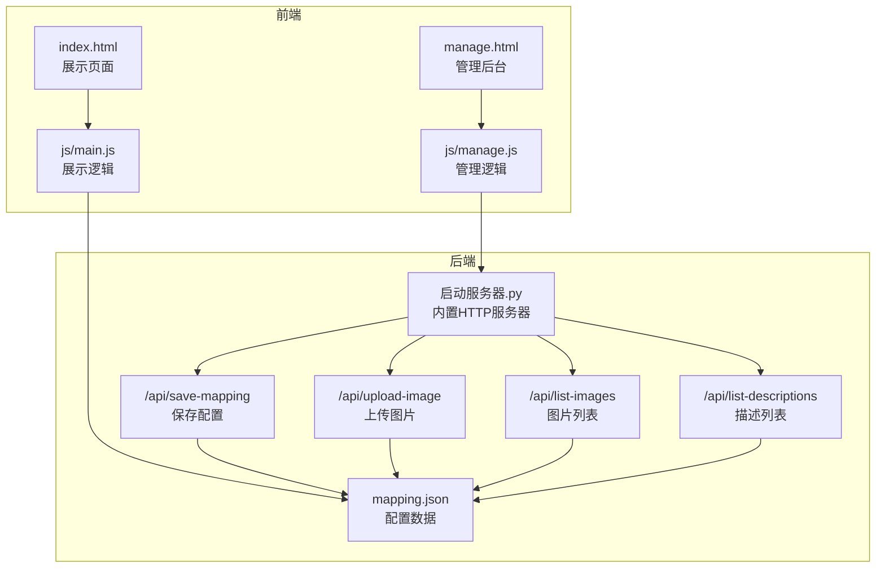
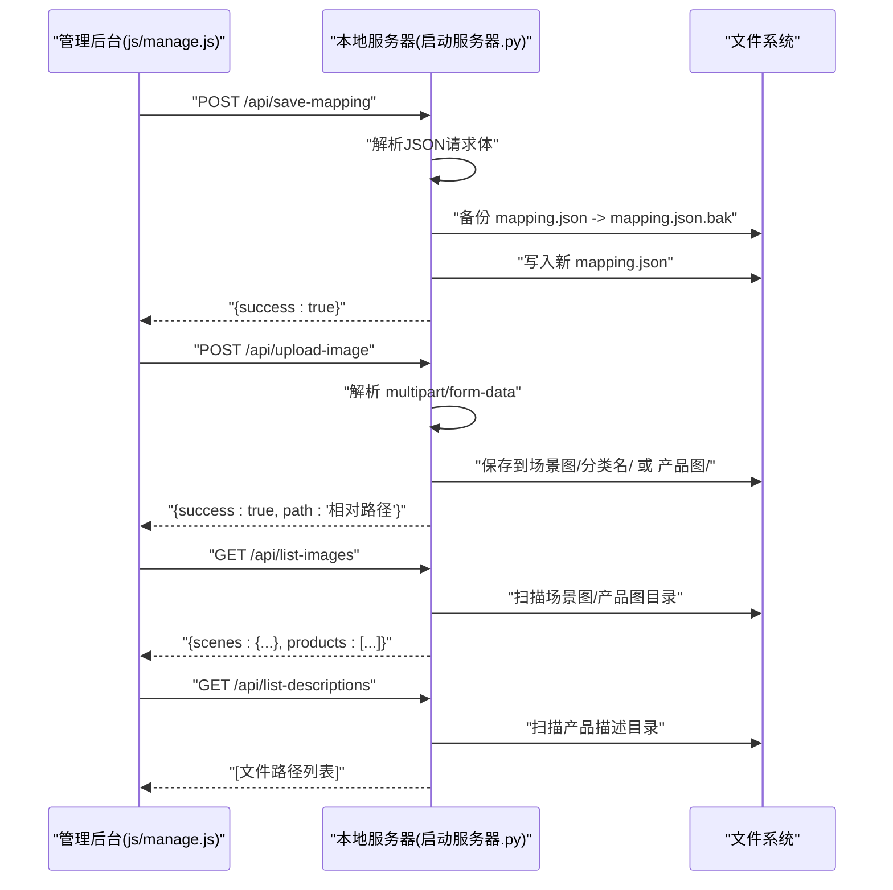
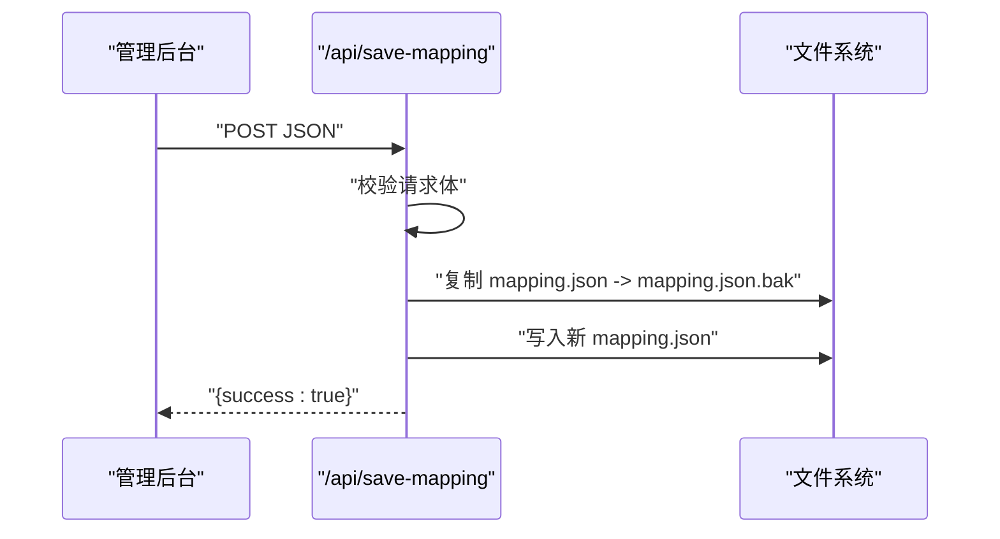
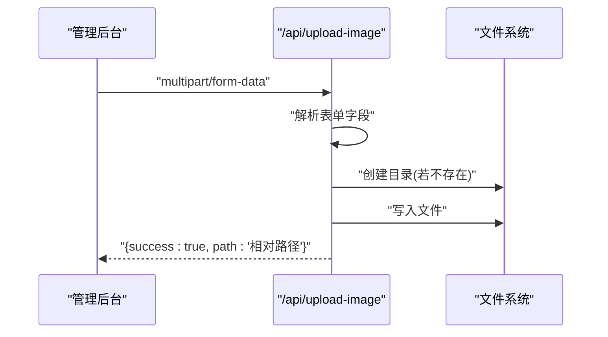
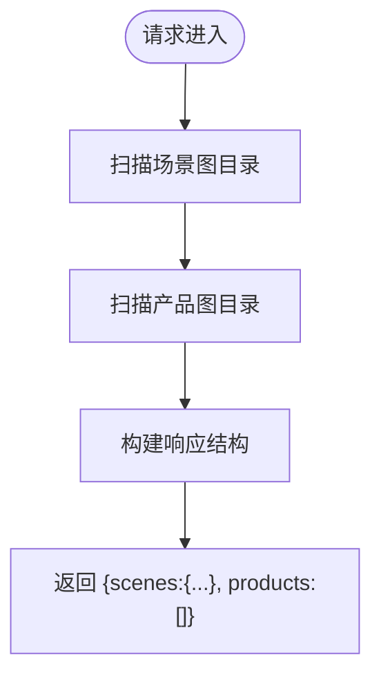
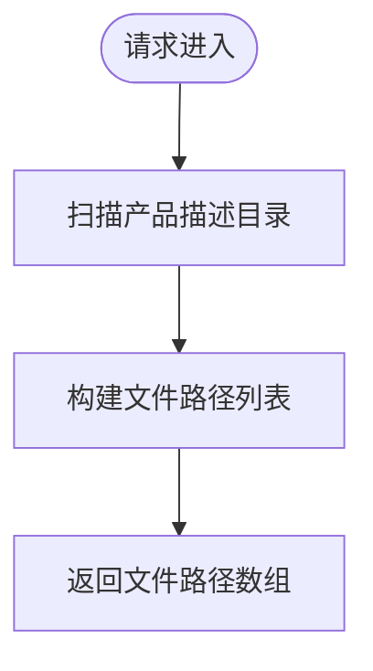
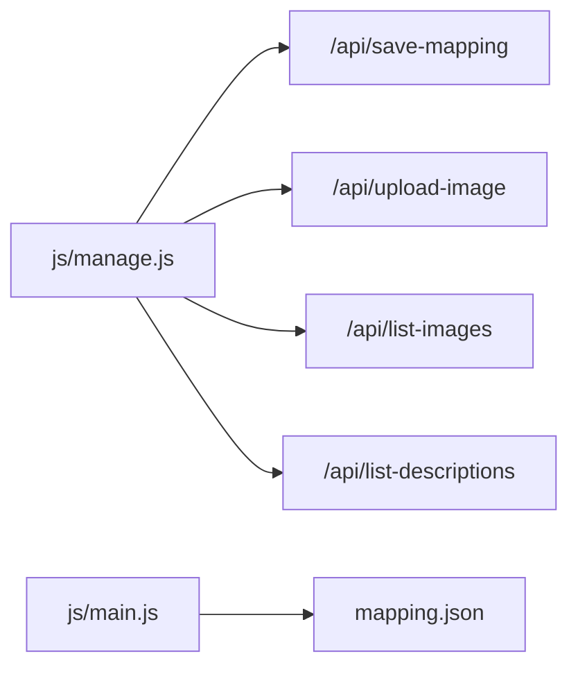

# API接口文档

<cite>
**本文档引用的文件**
- [启动服务器.py](file://启动服务器.py)
- [js/manage.js](file://js/manage.js)
- [manage.html](file://manage.html)
- [mapping.json](file://mapping.json)
- [project_architecture.md](file://project_architecture.md)
- [index.html](file://index.html)
- [js/main.js](file://js/main.js)
</cite>

## 目录
1. [简介](#简介)
2. [项目结构](#项目结构)
3. [核心组件](#核心组件)
4. [架构总览](#架构总览)
5. [详细组件分析](#详细组件分析)
6. [依赖分析](#依赖分析)
7. [性能考虑](#性能考虑)
8. [故障排查指南](#故障排查指南)
9. [结论](#结论)
10. [附录](#附录)

## 简介
本项目为数字标牌产品展示系统，提供前端展示页面与管理后台。管理后台通过本地开发服务器提供的四个RESTful API端点实现配置数据保存、图片上传、图片列表查询与描述文件列表查询。本文档详细说明这些API的设计规范、接口标准、请求与响应格式、错误处理机制，并给出客户端集成指南与安全注意事项。

## 项目结构
项目采用前后端分离的静态资源与本地Python服务器架构：
- 前端页面：index.html（展示页面）、manage.html（管理后台）
- 前端逻辑：js/main.js（展示页面逻辑）、js/manage.js（管理后台逻辑）
- 数据配置：mapping.json（场景、产品、多语言配置）
- 本地服务器：启动服务器.py（内置HTTP服务器，提供API端点）

图表来源
- [启动服务器.py:75-97](file://启动服务器.py#L75-L97)
- [启动服务器.py:101-251](file://启动服务器.py#L101-L251)
- [js/manage.js:81-108](file://js/manage.js#L81-L108)
- [js/manage.js:762-781](file://js/manage.js#L762-L781)
- [js/manage.js:48-72](file://js/manage.js#L48-L72)

章节来源
- [project_architecture.md:43-108](file://project_architecture.md#L43-L108)
- [启动服务器.py:25-53](file://启动服务器.py#L25-L53)

## 核心组件
- RESTful API服务器：基于Python内置HTTP服务器，扩展了四个API端点，支持CORS跨域。
- 管理后台前端：负责调用API端点，进行配置保存、图片上传、列表加载与编辑。
- 展示页面前端：负责加载mapping.json并渲染场景与产品详情。
- 数据存储：mapping.json作为配置数据文件，图片与描述文件分别存放于场景图与产品描述目录。

章节来源
- [启动服务器.py:254-298](file://启动服务器.py#L254-L298)
- [js/manage.js:17-31](file://js/manage.js#L17-L31)
- [js/main.js:49-73](file://js/main.js#L49-L73)

## 架构总览
管理后台通过fetch调用本地API端点，服务器解析请求并执行相应逻辑，最终返回JSON响应。展示页面通过静态文件服务获取mapping.json并渲染内容。

图表来源
- [启动服务器.py:101-251](file://启动服务器.py#L101-L251)
- [js/manage.js:81-108](file://js/manage.js#L81-L108)
- [js/manage.js:762-781](file://js/manage.js#L762-L781)
- [js/manage.js:48-72](file://js/manage.js#L48-L72)

## 详细组件分析

### API设计规范与标准
- HTTP方法：遵循REST风格，GET用于查询，POST用于提交。
- URL模式：统一前缀/api/，清晰区分业务域。
- 内容协商：请求与响应均使用application/json；上传图片使用multipart/form-data。
- 错误处理：统一返回JSON错误对象，包含success:false与error消息；HTTP状态码反映错误级别。
- CORS：允许本地开发跨域，简化前后端联调。

章节来源
- [启动服务器.py:28-46](file://启动服务器.py#L28-L46)
- [启动服务器.py:48-53](file://启动服务器.py#L48-L53)

### POST /api/save-mapping
- 作用：保存配置数据到mapping.json，服务器先备份再写入。
- 请求方法：POST
- URL：/api/save-mapping
- 请求头：
  - Content-Type: application/json
- 请求体：完整的mapping.json数据结构（见“数据模型”）
- 成功响应：{"success": true}
- 错误响应：
  - 400：请求体为空或JSON解析失败
  - 500：服务器内部错误
- 客户端调用示例（伪代码）：
  - fetch("/api/save-mapping", {method:"POST", headers:{"Content-Type":"application/json"}, body:JSON.stringify(mappingData)})
  - .then(resp=>resp.json()).then(data=>console.log(data.success?"保存成功":"保存失败"))
  - .catch(err=>console.error("保存失败:",err))

图表来源
- [启动服务器.py:101-127](file://启动服务器.py#L101-L127)
- [js/manage.js:81-108](file://js/manage.js#L81-L108)

章节来源
- [启动服务器.py:101-127](file://启动服务器.py#L101-L127)
- [js/manage.js:81-108](file://js/manage.js#L81-L108)

### POST /api/upload-image
- 作用：上传图片到指定目录（场景图/分类名/ 或 产品图/），返回相对路径。
- 请求方法：POST
- URL：/api/upload-image
- 请求头：
  - Content-Type: multipart/form-data
- 表单字段：
  - file: 上传的图片文件（必填）
  - type: 图片类型（scene或product，必填）
  - category: 场景分类名（type=scene时必填）
  - filename: 指定文件名（可选，默认使用原始文件名）
- 成功响应：{"success": true, "path": "相对路径"}
- 错误响应：
  - 400：缺少必要字段或请求格式错误
  - 500：服务器内部错误
- 客户端调用示例（伪代码）：
  - const formData = new FormData(); formData.append("file", file); formData.append("type","scene"); formData.append("category","便利店场景");
  - fetch("/api/upload-image",{method:"POST",body:formData}).then(r=>r.json()).then(d=>console.log(d.path));

图表来源
- [启动服务器.py:129-202](file://启动服务器.py#L129-L202)
- [js/manage.js:762-781](file://js/manage.js#L762-L781)

章节来源
- [启动服务器.py:129-202](file://启动服务器.py#L129-L202)
- [js/manage.js:762-781](file://js/manage.js#L762-L781)

### GET /api/list-images
- 作用：返回所有可用图片文件列表，按场景分类组织。
- 请求方法：GET
- URL：/api/list-images
- 请求头：无特殊要求
- 成功响应：{"scenes": {"分类名": ["场景图相对路径..."]}, "products": ["产品图相对路径..."]}
- 错误响应：无（正常情况下返回空数组或空对象）
- 客户端调用示例（伪代码）：
  - fetch("/api/list-images").then(r=>r.json()).then(d=>console.log(d.scenes,d.products))

图表来源
- [启动服务器.py:204-236](file://启动服务器.py#L204-L236)
- [js/manage.js:48-59](file://js/manage.js#L48-L59)

章节来源
- [启动服务器.py:204-236](file://启动服务器.py#L204-L236)
- [js/manage.js:48-59](file://js/manage.js#L48-L59)

### GET /api/list-descriptions
- 作用：返回所有产品描述文件列表。
- 请求方法：GET
- URL：/api/list-descriptions
- 请求头：无特殊要求
- 成功响应：["产品描述/文件名.md", ...]
- 错误响应：无（正常情况下返回空数组）
- 客户端调用示例（伪代码）：
  - fetch("/api/list-descriptions").then(r=>r.json()).then(d=>console.log(d))

图表来源
- [启动服务器.py:238-251](file://启动服务器.py#L238-L251)
- [js/manage.js:61-72](file://js/manage.js#L61-L72)

章节来源
- [启动服务器.py:238-251](file://启动服务器.py#L238-L251)
- [js/manage.js:61-72](file://js/manage.js#L61-L72)

### 数据模型
- mapping.json结构（节选）：
  - version: "4.0"
  - scenes: 场景数组
  - i18n: 多语言字典
- 场景对象：
  - id: "scene_001"
  - category: {"ja": "...", "zh": "..."}
  - image: "场景图/分类/文件.webp"
  - hotspots: [{"id": "hs_001", "x": 30, "y": 25, "products": [...]}]
- 产品对象：
  - name: {"ja": "...", "zh": "..."}
  - image: "产品图/文件.webp"
  - descriptionFile: "产品描述/文件.md"

章节来源
- [mapping.json:1-232](file://mapping.json#L1-L232)
- [project_architecture.md:118-206](file://project_architecture.md#L118-L206)

## 依赖分析
- 管理后台依赖本地API端点：
  - 保存配置：POST /api/save-mapping
  - 图片上传：POST /api/upload-image
  - 列表加载：GET /api/list-images、GET /api/list-descriptions
- 展示页面依赖静态文件服务加载mapping.json，不依赖API端点。
- 服务器端依赖Python内置HTTP服务器与文件系统。

图表来源
- [js/manage.js:81-108](file://js/manage.js#L81-L108)
- [js/manage.js:48-72](file://js/manage.js#L48-L72)
- [js/manage.js:762-781](file://js/manage.js#L762-L781)
- [js/main.js:49-73](file://js/main.js#L49-L73)

章节来源
- [js/manage.js:17-31](file://js/manage.js#L17-L31)
- [js/main.js:49-73](file://js/main.js#L49-L73)

## 性能考虑
- 图片上传：服务器逐块读取上传内容并写入，避免一次性占用大量内存。
- 列表查询：扫描目录时仅过滤指定扩展名，减少IO开销。
- CORS：允许本地开发跨域，避免预检请求带来的额外延迟。
- 前端重试：展示页面对mapping.json加载采用递增延迟重试，提升弱网稳定性。

章节来源
- [启动服务器.py:187-202](file://启动服务器.py#L187-L202)
- [启动服务器.py:204-251](file://启动服务器.py#L204-L251)
- [js/main.js:621-640](file://js/main.js#L621-L640)

## 故障排查指南
- 保存失败：
  - 检查请求体是否为合法JSON
  - 确认服务器磁盘权限可写
  - 查看服务器错误日志
- 上传失败：
  - 确认Content-Type为multipart/form-data
  - 检查type与category参数是否符合要求
  - 确认目标目录存在或可创建
- 列表为空：
  - 确认图片与描述文件位于约定目录
  - 检查文件扩展名是否符合要求（.webp/.jpg/.png/.md）
- CORS问题：
  - 确认浏览器允许跨域请求
  - 检查服务器CORS响应头是否正确设置

章节来源
- [启动服务器.py:101-127](file://启动服务器.py#L101-L127)
- [启动服务器.py:129-202](file://启动服务器.py#L129-L202)
- [启动服务器.py:204-251](file://启动服务器.py#L204-L251)

## 结论
本项目通过简洁的RESTful API实现了管理后台与前端页面的数据交互，服务器端逻辑清晰、错误处理完备，满足本地开发与演示需求。建议在生产环境中引入认证与授权机制，并对上传文件进行更严格的校验与限制。

## 附录

### 客户端集成指南
- 使用fetch调用API端点，注意设置正确的Content-Type与表单字段。
- 保存配置前先备份mapping.json.bak，便于回滚。
- 图片上传时根据type选择保存目录，场景图需提供category参数。
- 列表加载用于填充下拉选择框，提升用户体验。

章节来源
- [js/manage.js:81-108](file://js/manage.js#L81-L108)
- [js/manage.js:762-781](file://js/manage.js#L762-L781)
- [js/manage.js:48-72](file://js/manage.js#L48-L72)

### 安全与访问控制
- 本地开发服务器默认允许跨域，便于前后端联调。
- 服务器未实现认证与授权机制，仅适用于本地开发环境。
- 建议在生产部署时：
  - 限制访问IP或启用代理认证
  - 对上传文件类型与大小进行严格校验
  - 对敏感操作增加CSRF防护
  - 使用HTTPS传输

章节来源
- [启动服务器.py:28-33](file://启动服务器.py#L28-L33)

### API版本管理与兼容性
- 当前API版本：v1（四个端点）
- 兼容性策略：
  - 新增端点时保留旧端点不变
  - 修改现有端点时保持请求/响应结构向后兼容
  - 通过服务器端版本号与客户端版本号协同管理

章节来源
- [启动服务器.py:266-298](file://启动服务器.py#L266-L298)