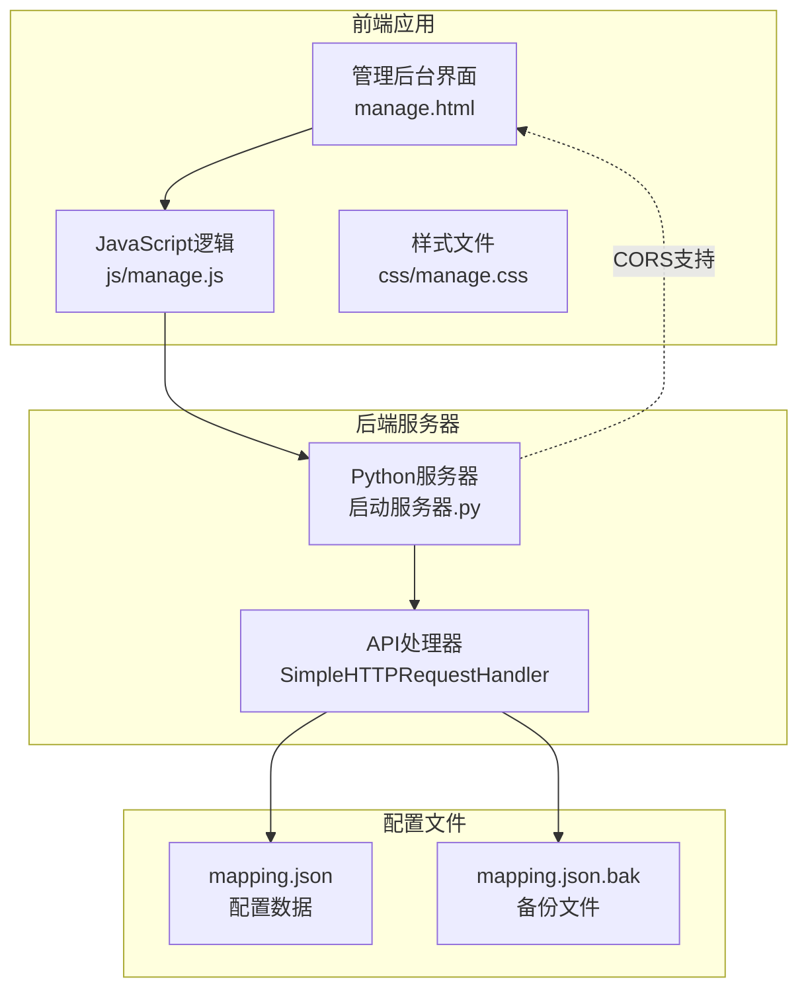
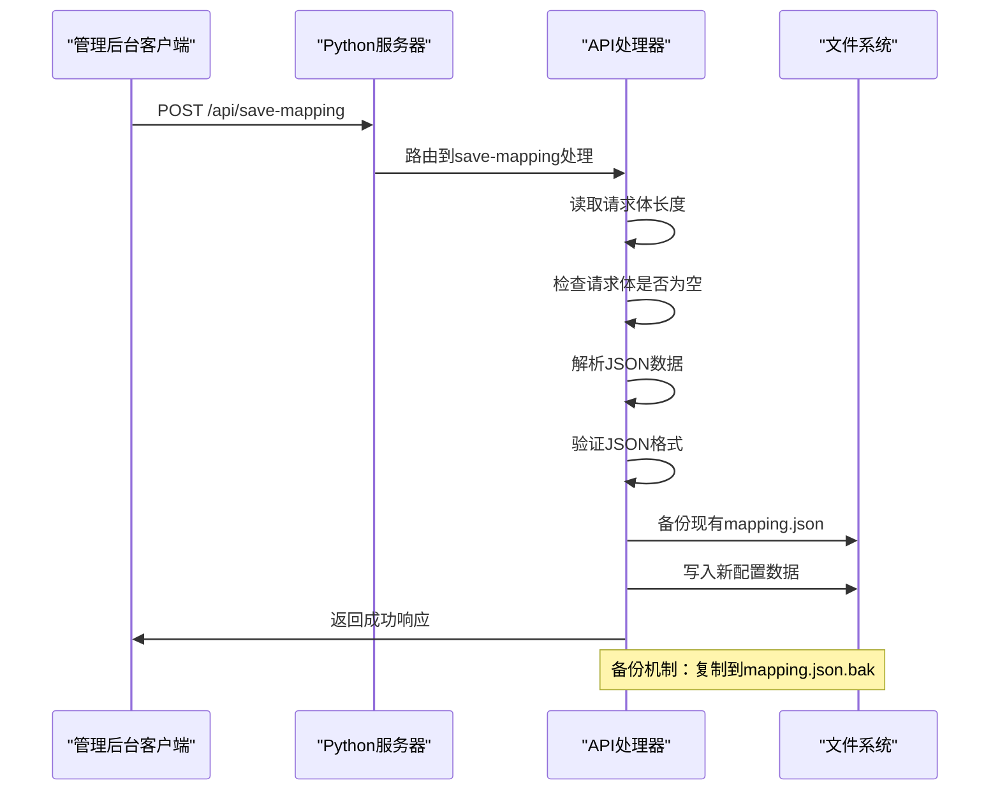
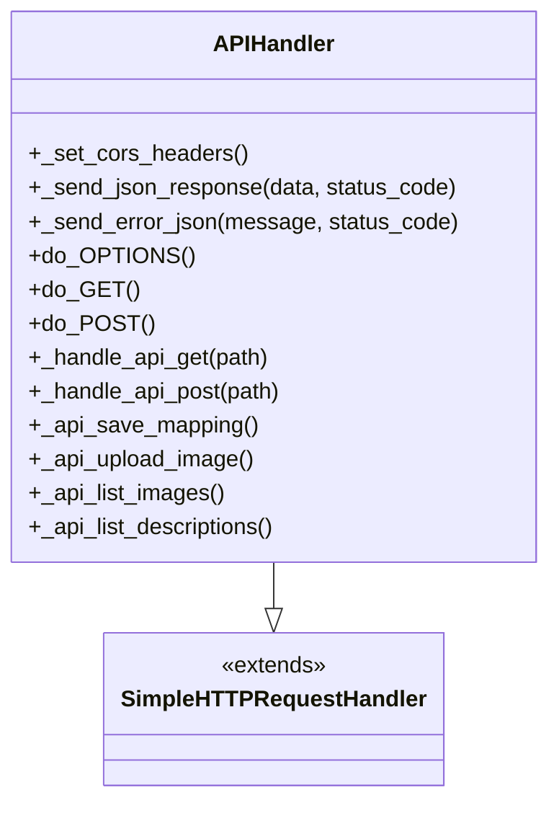
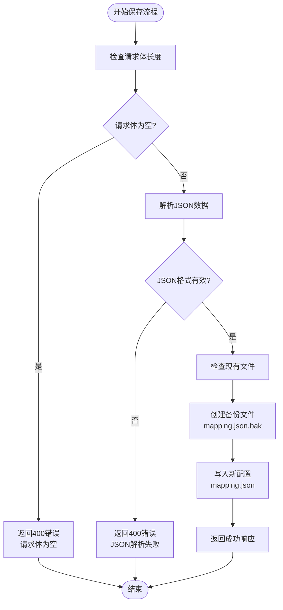
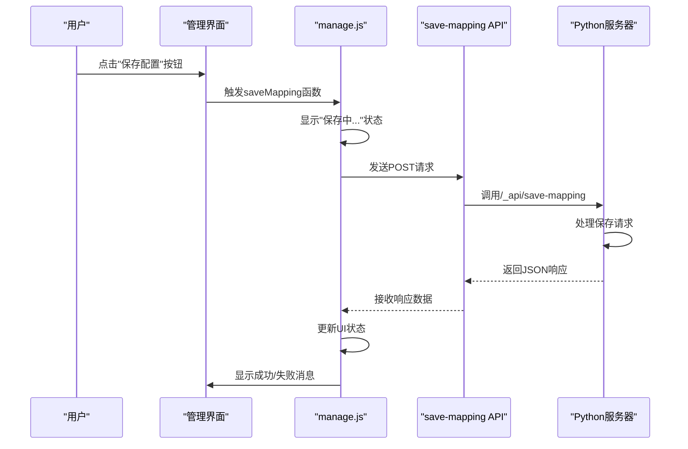
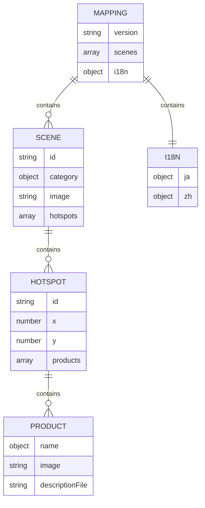
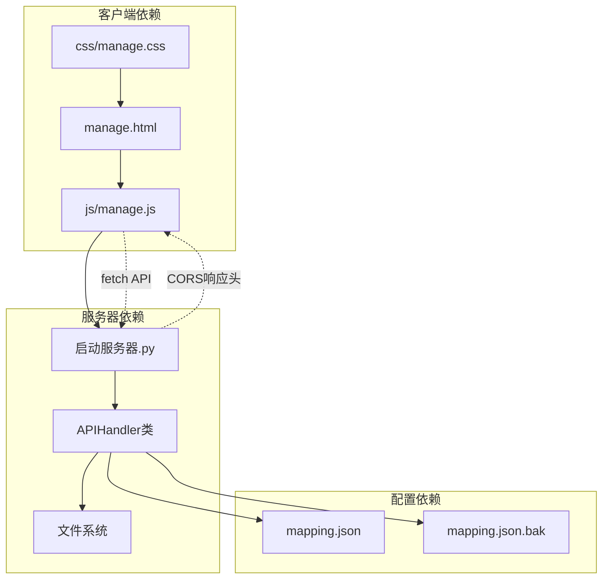
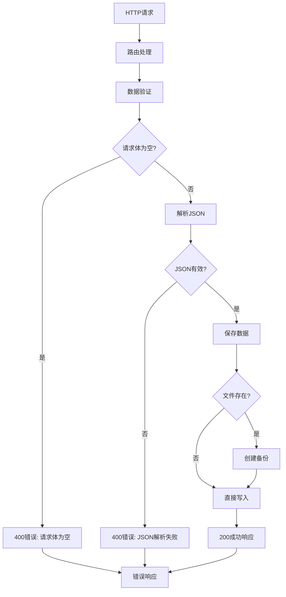

# 保存配置API

<cite>
**本文档引用的文件**
- [启动服务器.py](file://启动服务器.py)
- [manage.html](file://manage.html)
- [js/manage.js](file://js/manage.js)
- [mapping.json](file://mapping.json)
- [project_architecture.md](file://project_architecture.md)
</cite>

## 目录
1. [简介](#简介)
2. [项目结构](#项目结构)
3. [核心组件](#核心组件)
4. [架构概览](#架构概览)
5. [详细组件分析](#详细组件分析)
6. [依赖关系分析](#依赖关系分析)
7. [性能考虑](#性能考虑)
8. [故障排除指南](#故障排除指南)
9. [结论](#结论)

## 简介

本文档详细说明了POST /api/save-mapping接口的功能和使用方法。该接口用于保存mapping.json配置文件，实现了完整的配置管理功能，包括自动备份机制、JSON解析验证和错误处理。

该接口是数字标牌管理系统的核心组件之一，允许用户通过管理后台界面保存场景配置，包括场景、热点和产品等配置信息。

## 项目结构

该项目采用前后端分离的架构设计，主要包含以下组件：



**图表来源**
- [启动服务器.py:25-98](file://启动服务器.py#L25-L98)
- [manage.html:1-113](file://manage.html#L1-L113)

**章节来源**
- [启动服务器.py:1-298](file://启动服务器.py#L1-L298)
- [manage.html:1-113](file://manage.html#L1-L113)

## 核心组件

### API端点概述

POST /api/save-mapping是本地开发服务器提供的REST API端点，专门用于保存配置数据。该接口具有以下特点：

- **请求方法**: POST
- **请求路径**: `/api/save-mapping`
- **请求格式**: JSON
- **响应格式**: JSON
- **CORS支持**: 完全支持跨域请求
- **备份机制**: 自动创建.bak备份文件

### 请求参数说明

| 参数 | 类型 | 必需 | 描述 |
|------|------|------|------|
| JSON请求体 | Object | 是 | 完整的mapping.json数据结构 |

### 响应格式

成功响应：
```json
{
  "success": true
}
```

错误响应：
```json
{
  "success": false,
  "error": "错误消息"
}
```

**章节来源**
- [启动服务器.py:87-127](file://启动服务器.py#L87-L127)
- [project_architecture.md:770-787](file://project_architecture.md#L770-L787)

## 架构概览

该系统的整体架构采用Python内置HTTP服务器作为后端，结合前端管理界面实现完整的配置管理功能：



**图表来源**
- [启动服务器.py:101-127](file://启动服务器.py#L101-L127)

### 数据流分析

系统的数据流遵循以下模式：

1. **客户端请求**: 管理后台通过fetch API发送POST请求
2. **服务器接收**: Python HTTP服务器接收并路由请求
3. **数据验证**: 验证请求体格式和内容
4. **备份处理**: 自动创建配置文件备份
5. **持久化存储**: 将新配置写入mapping.json
6. **响应返回**: 发送JSON格式的成功响应

**章节来源**
- [js/manage.js:81-108](file://js/manage.js#L81-L108)
- [启动服务器.py:101-127](file://启动服务器.py#L101-L127)

## 详细组件分析

### 服务器端实现

#### API处理器类

服务器使用自定义的APIHandler类扩展SimpleHTTPRequestHandler，增加了对API端点的支持：



**图表来源**
- [启动服务器.py:25-252](file://启动服务器.py#L25-L252)

#### 保存映射API实现

`_api_save_mapping`方法实现了核心的保存功能：



**图表来源**
- [启动服务器.py:101-127](file://启动服务器.py#L101-L127)

**章节来源**
- [启动服务器.py:101-127](file://启动服务器.py#L101-L127)

### 客户端实现

#### JavaScript客户端逻辑

管理后台使用原生JavaScript实现配置保存功能：



**图表来源**
- [js/manage.js:81-108](file://js/manage.js#L81-L108)

#### 状态管理

客户端使用状态管理机制跟踪保存状态：

| 状态 | 描述 | 样式类 |
|------|------|--------|
| 保存中 | 用户点击保存按钮后显示 | `save-status` |
| 成功 | 保存成功后显示绿色 ✓ | `success` |
| 失败 | 保存失败后显示红色 ✗ | `error` |

**章节来源**
- [js/manage.js:81-108](file://js/manage.js#L81-L108)
- [manage.html:14](file://manage.html#L14)

### 配置数据结构

#### mapping.json完整结构

配置文件采用JSON格式，包含以下主要部分：



**图表来源**
- [mapping.json:1-232](file://mapping.json#L1-L232)

#### 字段详细说明

**版本信息**
- `version`: 字符串，当前配置版本号（如"4.0"）

**场景配置**
- `id`: 字符串，场景唯一标识符，格式为`scene_XXX`
- `category`: 对象，包含日文和中文的分类名称
- `image`: 字符串，场景图片的相对路径
- `hotspots`: 数组，包含该场景的所有热点配置

**热点配置**
- `id`: 字符串，热点唯一标识符，格式为`hs_XXX`
- `x`: 数字，水平位置百分比（0-100）
- `y`: 数字，垂直位置百分比（0-100）
- `products`: 数组，该热点关联的产品列表

**产品配置**
- `name`: 对象，包含日文和中文的产品名称
- `image`: 字符串，产品图片的相对路径
- `descriptionFile`: 字符串，产品描述文件的相对路径

**国际化配置**
- `i18n`: 对象，包含所有用户界面文本的多语言翻译

**章节来源**
- [mapping.json:1-232](file://mapping.json#L1-232)
- [project_architecture.md:118-205](file://project_architecture.md#L118-L205)

## 依赖关系分析

### 组件间依赖



**图表来源**
- [js/manage.js:81-108](file://js/manage.js#L81-L108)
- [启动服务器.py:25-98](file://启动服务器.py#L25-L98)

### 错误处理依赖

系统实现了多层次的错误处理机制：



**图表来源**
- [启动服务器.py:101-127](file://启动服务器.py#L101-L127)

**章节来源**
- [启动服务器.py:101-127](file://启动服务器.py#L101-L127)

## 性能考虑

### 服务器性能特性

1. **轻量级实现**: 使用Python内置HTTP服务器，无需额外依赖
2. **内存效率**: JSON数据在内存中处理，避免磁盘I/O频繁操作
3. **并发处理**: 基于线程的简单实现，适合开发环境使用
4. **CORS优化**: 预检请求快速响应，减少跨域请求开销

### 客户端性能特性

1. **异步处理**: 使用Promise和async/await避免阻塞UI
2. **状态反馈**: 实时显示保存进度和结果
3. **错误恢复**: 自动重试机制和友好的错误提示

## 故障排除指南

### 常见错误及解决方案

#### 1. 请求体为空错误 (400)

**症状**: 服务器返回"请求体为空"错误

**原因**: 客户端未正确发送JSON数据

**解决方案**:
- 确保请求头设置为`Content-Type: application/json`
- 验证JSON数据格式正确性
- 检查客户端代码中的`JSON.stringify()`调用

#### 2. JSON解析失败 (400)

**症状**: 服务器返回"JSON解析失败"错误

**原因**: JSON数据格式不符合规范

**解决方案**:
- 使用在线JSON验证工具检查格式
- 确保所有字符串都使用双引号
- 验证嵌套对象和数组的正确性

#### 3. 文件权限问题

**症状**: 保存成功但配置未更新

**原因**: 服务器进程没有写入权限

**解决方案**:
- 检查项目目录的写入权限
- 确保Python进程有管理员权限
- 验证目标文件路径的有效性

#### 4. 备份文件创建失败

**症状**: 配置保存成功但.bak文件未创建

**原因**: 备份目录权限不足或磁盘空间不足

**解决方案**:
- 检查备份目录的写入权限
- 确保有足够的磁盘空间
- 验证文件系统完整性

### 调试技巧

1. **浏览器开发者工具**: 使用Network标签监控API请求和响应
2. **服务器日志**: 查看Python控制台输出的错误信息
3. **JSON验证**: 使用在线工具验证配置数据格式
4. **逐步调试**: 在客户端代码中添加console.log语句

**章节来源**
- [启动服务器.py:101-127](file://启动服务器.py#L101-L127)
- [js/manage.js:81-108](file://js/manage.js#L81-L108)

## 结论

POST /api/save-mapping接口为数字标牌管理系统提供了完整的配置保存功能。该接口具有以下优势：

1. **可靠性**: 实现了完整的错误处理和数据验证机制
2. **安全性**: 自动备份机制确保配置数据的安全性
3. **易用性**: 简洁的API设计和清晰的错误响应
4. **可维护性**: 清晰的代码结构和详细的文档说明

该接口支持完整的配置管理流程，从数据验证到持久化存储，再到备份保护，为用户提供了一个可靠的配置管理解决方案。通过合理的错误处理和用户反馈机制，确保了良好的用户体验。