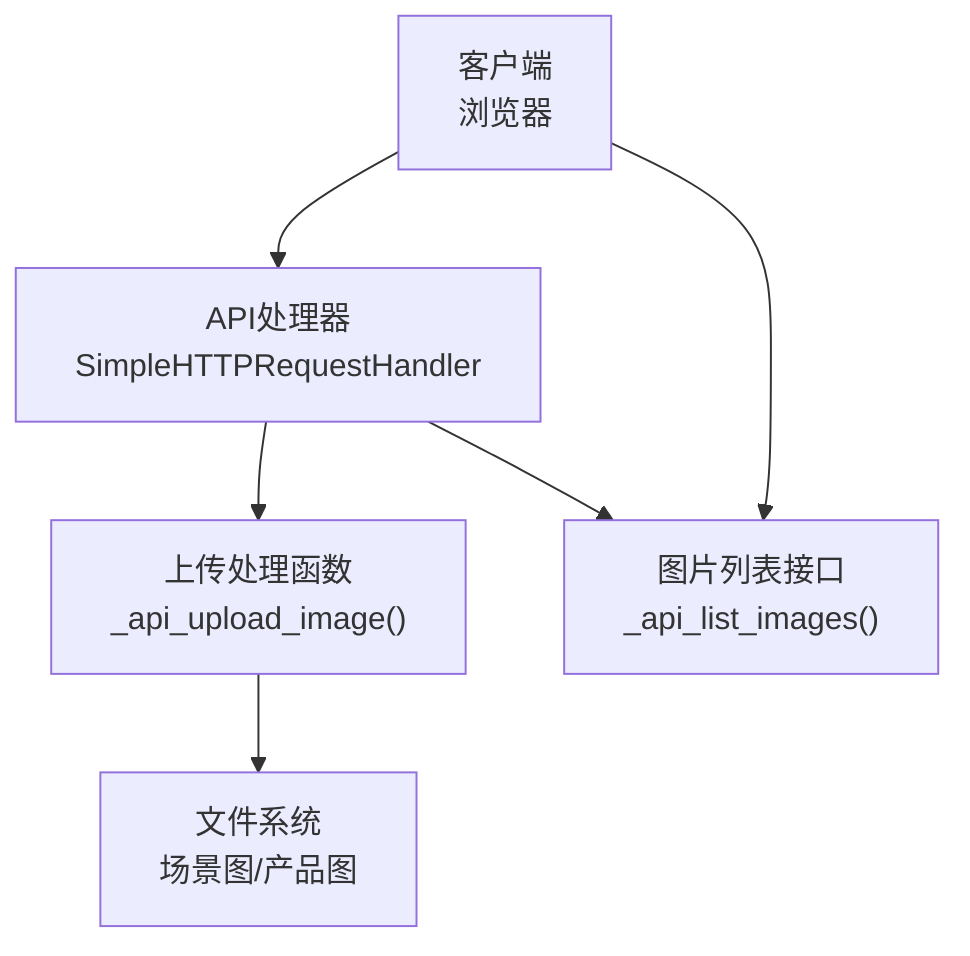
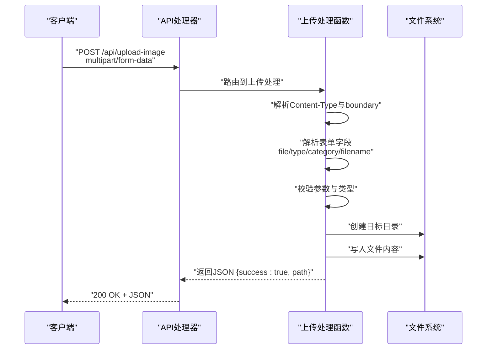
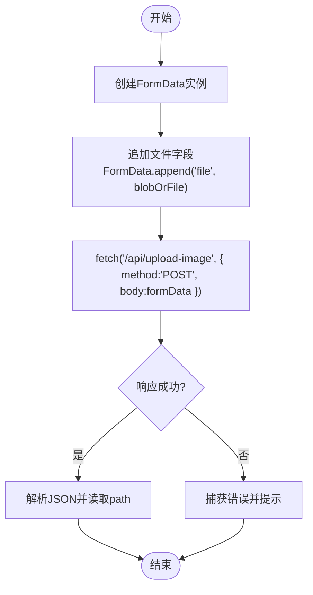
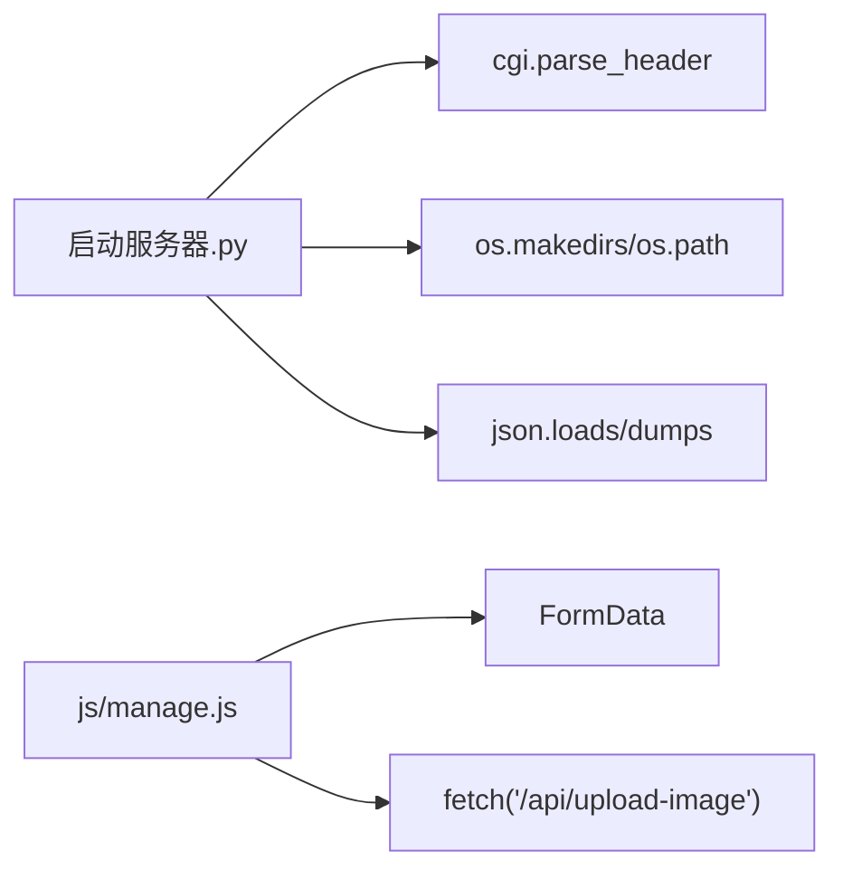

# 图片上传API

<cite>
**本文引用的文件**
- [启动服务器.py](file://启动服务器.py)
- [project_architecture.md](file://project_architecture.md)
- [js/manage.js](file://js/manage.js)
</cite>

## 目录
1. [简介](#简介)
2. [项目结构](#项目结构)
3. [核心组件](#核心组件)
4. [架构总览](#架构总览)
5. [详细组件分析](#详细组件分析)
6. [依赖分析](#依赖分析)
7. [性能考虑](#性能考虑)
8. [故障排查指南](#故障排查指南)
9. [结论](#结论)
10. [附录](#附录)

## 简介
本文档面向POST /api/upload-image接口，提供完整的技术说明与使用指南。该接口用于将图片文件上传至指定目录，支持multipart/form-data格式，包含type参数（scene或product）及必需的category参数（当type=scene时）。上传后的文件按规则保存在“场景图/类别”或“产品图”目录中，并返回相对路径供前端使用。

## 项目结构
- 服务器端基于Python内置HTTP服务器实现，提供静态文件服务与若干API端点。
- 客户端通过JavaScript发起上传请求，使用FormData封装multipart数据。
- 上传成功后返回相对路径字符串，便于前端拼接访问URL。

图表来源
- [启动服务器.py:25-298](file://启动服务器.py#L25-L298)

章节来源
- [启动服务器.py:25-298](file://启动服务器.py#L25-L298)

## 核心组件
- API处理器：负责解析请求、路由到具体API实现、设置CORS头、统一JSON响应格式。
- 上传处理函数：解析multipart数据、校验参数、确定保存目录、写入文件并返回相对路径。
- 客户端上传函数：封装FormData并通过fetch提交到/upload-image端点。

章节来源
- [启动服务器.py:25-298](file://启动服务器.py#L25-L298)
- [js/manage.js:762-781](file://js/manage.js#L762-L781)

## 架构总览
POST /api/upload-image的调用流程如下：

图表来源
- [启动服务器.py:129-202](file://启动服务器.py#L129-L202)

## 详细组件分析

### 接口定义与请求格式
- 方法：POST
- 路径：/api/upload-image
- 请求体：multipart/form-data
- 字段说明：
  - file：必填，要上传的图片文件
  - type：必填，取值为scene或product
  - category：当type=scene时必填，表示场景分类名
  - filename：可选，指定保存文件名；若未提供则使用原始文件名
- 响应体：JSON对象，包含success与path字段

章节来源
- [project_architecture.md:789-801](file://project_architecture.md#L789-L801)

### 参数与目录规则
- type=scene
  - 必须提供category参数
  - 保存目录：项目根目录/场景图/{category}/
- type=product
  - 不需要category参数
  - 保存目录：项目根目录/产品图/
- 目录不存在时自动创建
- 返回相对路径，使用正斜杠分隔

章节来源
- [启动服务器.py:172-185](file://启动服务器.py#L172-L185)
- [启动服务器.py:187-202](file://启动服务器.py#L187-L202)

### 文件验证与格式支持
- 支持的图片扩展名：webp、jpg、png（大小写不敏感）
- 服务器端通过扩展名判断是否为图片文件
- 上传过程采用二进制写入，未对图片内容进行额外格式校验

章节来源
- [启动服务器.py:21-22](file://启动服务器.py#L21-L22)
- [启动服务器.py:218-223](file://启动服务器.py#L218-L223)

### 错误处理与状态码
- 400：请求不是multipart/form-data格式
- 400：缺少type参数
- 400：type参数非法（既不是scene也不是product）
- 400：type=scene但缺少category参数
- 400：未找到上传文件
- 500：内部异常（由通用错误响应返回）

章节来源
- [启动服务器.py:132-135](file://启动服务器.py#L132-L135)
- [启动服务器.py:168-170](file://启动服务器.py#L168-L170)
- [启动服务器.py:180-182](file://启动服务器.py#L180-L182)
- [启动服务器.py:173-176](file://启动服务器.py#L173-L176)
- [启动服务器.py:160-162](file://启动服务器.py#L160-L162)

### 客户端JavaScript上传示例
- 使用FormData封装file字段
- 通过fetch向/upload-image发送POST请求
- 成功后从响应JSON中提取path字段

图表来源
- [js/manage.js:762-781](file://js/manage.js#L762-L781)

章节来源
- [js/manage.js:762-781](file://js/manage.js#L762-L781)

### 完整请求示例
- 场景图片上传（type=scene）
  - multipart字段：
    - file：图片文件
    - type：scene
    - category：便利店场景
    - filename：可选
- 产品图片上传（type=product）
  - multipart字段：
    - file：图片文件
    - type：product
    - filename：可选

章节来源
- [project_architecture.md:789-801](file://project_architecture.md#L789-L801)

## 依赖分析
- 服务器端依赖
  - Python标准库：http.server、socketserver、urllib.parse、os、json、shutil、cgi
  - 项目根目录常量：PROJECT_ROOT
  - 图片扩展名常量：IMAGE_EXTENSIONS
- 客户端依赖
  - 浏览器API：FormData、fetch
  - 管理后台模块：manage.js中的uploadImage函数

图表来源
- [启动服务器.py:144-152](file://启动服务器.py#L144-L152)
- [启动服务器.py:184-185](file://启动服务器.py#L184-L185)
- [js/manage.js:765-771](file://js/manage.js#L765-L771)

章节来源
- [启动服务器.py:144-152](file://启动服务器.py#L144-L152)
- [启动服务器.py:184-185](file://启动服务器.py#L184-L185)
- [js/manage.js:765-771](file://js/manage.js#L765-L771)

## 性能考虑
- 上传采用分块读取（每次8192字节）写入磁盘，避免一次性加载大文件到内存。
- 目录不存在时自动创建，减少前置检查成本。
- 返回相对路径便于前端直接使用，避免额外路径拼接错误。

章节来源
- [启动服务器.py:191-195](file://启动服务器.py#L191-L195)
- [启动服务器.py:184-185](file://启动服务器.py#L184-L185)
- [启动服务器.py:197-200](file://启动服务器.py#L197-L200)

## 故障排查指南
- “请求必须是 multipart/form-data 格式”
  - 检查客户端是否正确设置Content-Type与boundary
  - 确保使用FormData封装文件
- “缺少 type 参数”
  - 确保multipart表单中包含type字段
- “type 参数必须是 scene 或 product”
  - type只能为scene或product之一
- “上传场景图片时必须提供 category 参数”
  - 当type=scene时，必须提供category
- “未找到上传文件”
  - 确认file字段存在且非空
- “服务器错误”
  - 检查服务器日志，确认磁盘写入权限与路径有效

章节来源
- [启动服务器.py:132-135](file://启动服务器.py#L132-L135)
- [启动服务器.py:168-170](file://启动服务器.py#L168-L170)
- [启动服务器.py:180-182](file://启动服务器.py#L180-L182)
- [启动服务器.py:173-176](file://启动服务器.py#L173-L176)
- [启动服务器.py:160-162](file://启动服务器.py#L160-L162)

## 结论
POST /api/upload-image接口提供了简单可靠的图片上传能力，支持场景与产品两类图片的分类存储。客户端可通过FormData便捷地发起上传请求，服务器端负责参数校验、目录创建与文件写入，并返回可用于访问的相对路径。建议在生产环境中结合前端校验与后端权限控制，确保上传流程的安全与稳定。

## 附录
- CORS支持：所有API响应包含CORS头，允许本地开发跨域访问
- 端口策略：默认8082，若被占用自动递增寻找可用端口

章节来源
- [project_architecture.md:822-833](file://project_architecture.md#L822-L833)