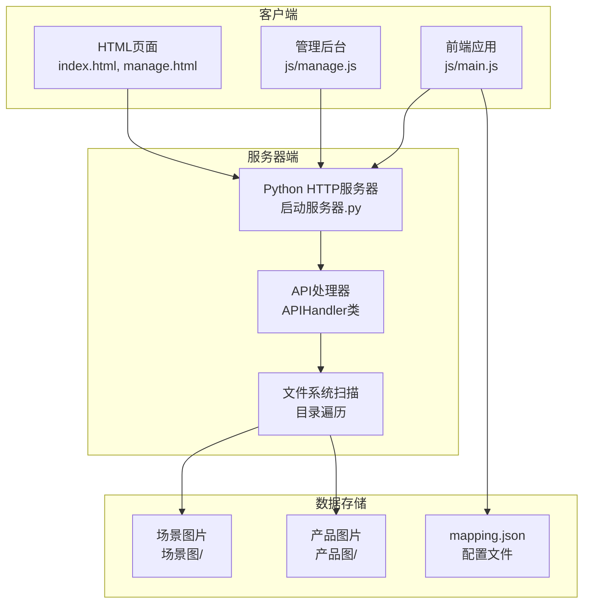

# 图片列表API

<cite>
**本文档引用的文件**
- [启动服务器.py](file://启动服务器.py)
- [js/main.js](file://js/main.js)
- [js/manage.js](file://js/manage.js)
- [index.html](file://index.html)
- [manage.html](file://manage.html)
- [mapping.json](file://mapping.json)
</cite>

## 目录
1. [简介](#简介)
2. [API概述](#api概述)
3. [请求规范](#请求规范)
4. [响应数据结构](#响应数据结构)
5. [文件扫描机制](#文件扫描机制)
6. [路径处理说明](#路径处理说明)
7. [客户端使用示例](#客户端使用示例)
8. [完整响应示例](#完整响应示例)
9. [错误处理](#错误处理)
10. [最佳实践](#最佳实践)

## 简介

GET /api/list-images 接口是数字标牌产品介绍系统的图片资源管理API，专门用于获取项目中所有图片文件的完整列表。该接口为前端应用提供了统一的图片资源访问入口，支持场景图片和产品图片的分类管理。

## API概述

### 基本信息
- **接口名称**: 图片列表获取
- **HTTP方法**: GET
- **完整URL**: `/api/list-images`
- **返回格式**: JSON
- **支持的图片格式**: `.webp`, `.jpg`, `.png`

### 功能描述
该接口扫描项目根目录下的场景图和产品图目录，收集所有支持格式的图片文件，并按照场景类别进行分组，返回结构化的图片列表数据。

## 请求规范

### 请求头
- **Content-Type**: 不适用（GET请求）
- **Accept**: `application/json`

### 查询参数
- **无查询参数**

### 认证要求
- **不需要认证**（本地开发环境）

## 响应数据结构

### 响应体结构

```json
{
  "scenes": {
    "场景类别1": [
      "场景图/场景类别1/图片1.webp",
      "场景图/场景类别1/图片2.jpg",
      "场景图/场景类别1/图片3.png"
    ],
    "场景类别2": [
      "场景图/场景类别2/图片1.webp"
    ]
  },
  "products": [
    "产品图/产品1.webp",
    "产品图/产品2.jpg",
    "产品图/产品3.png",
    "产品图/产品4.webp"
  ]
}
```

### 字段说明

#### scenes 对象
- **类型**: 对象（字典）
- **描述**: 按场景类别分组的图片列表
- **键**: 场景类别名称（字符串）
- **值**: 该类别下的图片文件路径数组

#### products 数组
- **类型**: 数组
- **描述**: 所有产品图片的文件路径列表
- **元素**: 图片文件的相对路径字符串

### 数据类型定义

| 字段 | 类型 | 必填 | 描述 |
|------|------|------|------|
| scenes | object | 是 | 场景图片分组对象 |
| scenes[].* | array | 是 | 场景类别下的图片路径数组 |
| products | array | 是 | 产品图片路径数组 |

## 文件扫描机制

### 目录结构
系统采用严格的目录组织结构：

```
项目根目录/
├── 场景图/
│   ├── 便利店场景/
│   ├── 超市场景/
│   ├── 快餐店场景/
│   ├── 酒店场景/
│   ├── 集会场景/
│   └── 其他场景/
├── 产品图/
└── 产品描述/
```

### 扫描规则

#### 场景图片扫描
1. **根目录**: `场景图/`
2. **遍历层级**: 一级子目录（场景类别）
3. **文件过滤**: 仅接受指定格式的文件
4. **排序规则**: 字典序排序

#### 产品图片扫描
1. **根目录**: `产品图/`
2. **遍历层级**: 直接子文件
3. **文件过滤**: 仅接受指定格式的文件
4. **排序规则**: 字典序排序

### 支持的图片格式
- **WebP**: `.webp`（推荐格式）
- **JPEG**: `.jpg`, `.jpeg`
- **PNG**: `.png`

## 路径处理说明

### 路径格式
- **返回格式**: 相对路径（相对于项目根目录）
- **分隔符**: 统一使用正斜杠 `/`
- **跨平台兼容**: 自动转换操作系统特定的路径分隔符

### 路径生成过程
1. 构建绝对路径
2. 计算相对路径（相对于项目根目录）
3. 将路径分隔符统一转换为正斜杠
4. 确保路径可被Web服务器正确解析

### 示例路径格式
- `场景图/便利店场景/场景1.webp`
- `产品图/商用壁挂液晶显示器.webp`

## 客户端使用示例

### JavaScript 原生实现

```javascript
// 获取图片列表
async function getImageList() {
    try {
        const response = await fetch('/api/list-images');
        
        if (!response.ok) {
            throw new Error(`HTTP error! status: ${response.status}`);
        }
        
        const imageData = await response.json();
        
        console.log('场景图片:', imageData.scenes);
        console.log('产品图片:', imageData.products);
        
        return imageData;
    } catch (error) {
        console.error('获取图片列表失败:', error);
        throw error;
    }
}

// 使用示例
getImageList()
    .then(data => {
        // 处理场景图片
        Object.entries(data.scenes).forEach(([category, images]) => {
            console.log(`${category}: ${images.length} 张图片`);
        });
        
        // 处理产品图片
        console.log(`产品图片总数: ${data.products.length}`);
    })
    .catch(error => {
        console.error('错误处理:', error);
    });
```

### jQuery 实现

```javascript
$.ajax({
    url: '/api/list-images',
    method: 'GET',
    dataType: 'json',
    success: function(data) {
        console.log('图片列表获取成功');
        console.log('场景分类:', Object.keys(data.scenes).length);
        console.log('产品数量:', data.products.length);
        
        // 更新下拉菜单
        updateImageDropdown(data);
    },
    error: function(xhr, status, error) {
        console.error('图片列表获取失败:', error);
    }
});

function updateImageDropdown(imageData) {
    const dropdown = $('#image-select');
    dropdown.empty();
    
    // 添加场景图片选项
    Object.entries(imageData.scenes).forEach(([category, images]) => {
        images.forEach(image => {
            dropdown.append(`<option value="${image}">${image}</option>`);
        });
    });
    
    // 添加产品图片选项
    imageData.products.forEach(image => {
        dropdown.append(`<option value="${image}">${image}</option>`);
    });
}
```

### React Hook 实现

```javascript
import { useState, useEffect } from 'react';

function useImageList() {
    const [imageData, setImageData] = useState(null);
    const [loading, setLoading] = useState(true);
    const [error, setError] = useState(null);

    useEffect(() => {
        const fetchImageList = async () => {
            try {
                const response = await fetch('/api/list-images');
                
                if (!response.ok) {
                    throw new Error(`HTTP ${response.status}`);
                }
                
                const data = await response.json();
                setImageData(data);
                setLoading(false);
            } catch (err) {
                setError(err);
                setLoading(false);
            }
        };

        fetchImageList();
    }, []);

    return { imageData, loading, error };
}

// 使用示例
function ImageSelector() {
    const { imageData, loading, error } = useImageList();

    if (loading) return <div>加载中...</div>;
    if (error) return <div>加载失败: {error.message}</div>;
    if (!imageData) return <div>无数据</div>;

    return (
        <div>
            <h3>场景图片</h3>
            {Object.entries(imageData.scenes).map(([category, images]) => (
                <div key={category}>
                    <h4>{category} ({images.length} 张)</h4>
                    <ul>
                        {images.map((image, index) => (
                            <li key={index}>{image}</li>
                        ))}
                    </ul>
                </div>
            ))}
            
            <h3>产品图片</h3>
            <ul>
                {imageData.products.map((image, index) => (
                    <li key={index}>{image}</li>
                ))}
            </ul>
        </div>
    );
}
```

## 完整响应示例

### 成功响应示例

```json
{
  "scenes": {
    "便利店": [
      "场景图/便利店场景/便利店场景1.webp",
      "场景图/便利店场景/便利店场景2.jpg",
      "场景图/便利店场景/便利店场景3.png"
    ],
    "超市": [
      "场景图/超市场景/超市场景1.webp",
      "场景图/超市场景/超市场景2.webp",
      "场景图/超市场景/超市场景3.jpg"
    ],
    "快餐店": [
      "场景图/快餐店场景/快餐店场景1.webp",
      "场景图/快餐店场景/快餐店场景2.webp"
    ]
  },
  "products": [
    "产品图/商用壁挂液晶显示器.webp",
    "产品图/电子水牌.webp",
    "产品图/室内双面吊装标牌.webp",
    "产品图/室外可移动广告机.webp",
    "产品图/室内立式广告机.webp",
    "产品图/自助点单机1.webp",
    "产品图/自助点单机2.webp",
    "产品图/自助点单机3.webp",
    "产品图/室外立式广告机.webp"
  ]
}
```

### 响应字段详细说明

#### scenes 对象结构
- **键**: 场景类别名称（如 "便利店", "超市", "快餐店"）
- **值**: 对应类别的图片文件路径数组
- **顺序**: 按字典序排列

#### products 数组结构
- **元素**: 单个产品图片的相对路径
- **顺序**: 按字典序排列

## 错误处理

### HTTP 状态码
- **200 OK**: 请求成功
- **404 Not Found**: API路径不存在
- **500 Internal Server Error**: 服务器内部错误

### 错误响应格式

```json
{
  "success": false,
  "error": "错误消息描述"
}
```

### 常见错误场景

1. **服务器未启动**: 返回连接错误
2. **目录权限问题**: 扫描失败，返回空列表
3. **网络中断**: 请求超时
4. **路径不存在**: 返回404状态码

## 最佳实践

### 1. 错误处理
```javascript
async function safeGetImageList() {
    try {
        const response = await fetch('/api/list-images', {
            cache: 'no-cache'
        });
        
        if (!response.ok) {
            throw new Error(`HTTP ${response.status}`);
        }
        
        return await response.json();
    } catch (error) {
        console.error('图片列表获取失败:', error);
        // 返回默认空数据结构
        return { scenes: {}, products: [] };
    }
}
```

### 2. 缓存策略
```javascript
// 使用localStorage缓存图片列表
const CACHE_KEY = 'image-list-cache';
const CACHE_TTL = 5 * 60 * 1000; // 5分钟

function getCachedImageList() {
    const cached = localStorage.getItem(CACHE_KEY);
    if (cached) {
        const { data, timestamp } = JSON.parse(cached);
        if (Date.now() - timestamp < CACHE_TTL) {
            return data;
        }
    }
    return null;
}

function setCachedImageList(data) {
    localStorage.setItem(CACHE_KEY, JSON.stringify({
        data,
        timestamp: Date.now()
    }));
}
```

### 3. 性能优化
- **懒加载**: 按需获取图片列表
- **批量处理**: 合并多个API调用
- **错误重试**: 实现指数退避重试机制

### 4. 调试建议
```javascript
// 调试模式
function debugImageList() {
    console.log('调试信息:');
    console.log('- 项目根目录:', PROJECT_ROOT);
    console.log('- 场景图目录:', SCENES_DIR);
    console.log('- 产品图目录:', PRODUCTS_DIR);
    console.log('- 支持格式:', IMAGE_EXTENSIONS);
}
```

## 依赖关系分析

### 服务器端实现
- **Python内置模块**: `os`, `json`, `urllib.parse`
- **HTTP服务器**: `http.server.HTTPServer`
- **文件系统**: 目录遍历和文件过滤

### 客户端集成
- **前端应用**: `js/main.js` 和 `js/manage.js`
- **静态资源**: HTML页面和样式文件
- **API调用**: 原生fetch和第三方库支持



**图表来源**
- [启动服务器.py:25-236](file://启动服务器.py#L25-L236)
- [js/main.js:1197-1284](file://js/main.js#L1197-L1284)
- [js/manage.js:48-72](file://js/manage.js#L48-L72)

**章节来源**
- [启动服务器.py:204-236](file://启动服务器.py#L204-L236)
- [js/main.js:1197-1284](file://js/main.js#L1197-L1284)
- [js/manage.js:48-72](file://js/manage.js#L48-L72)
- [index.html:1-83](file://index.html#L1-L83)
- [manage.html:1-113](file://manage.html#L1-L113)
- [mapping.json:1-232](file://mapping.json#L1-L232)