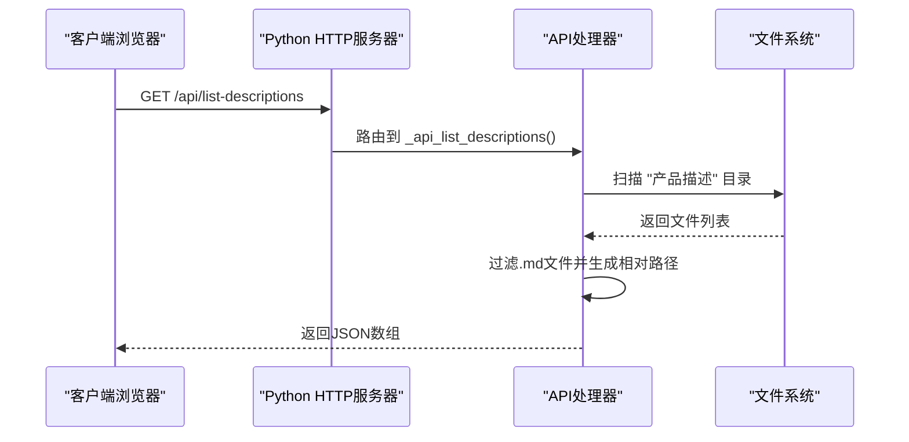
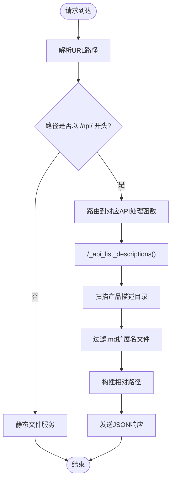
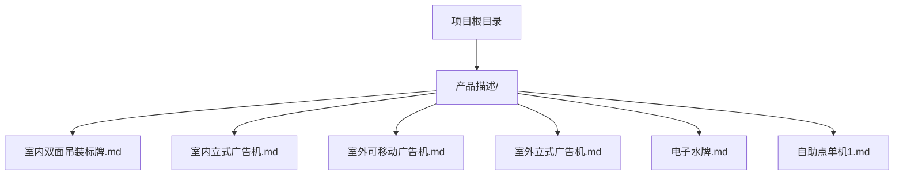
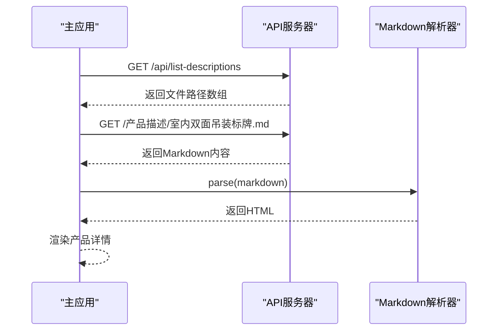
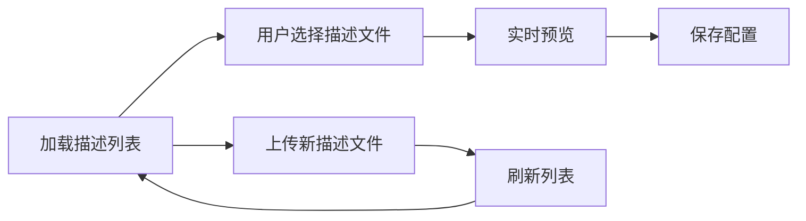
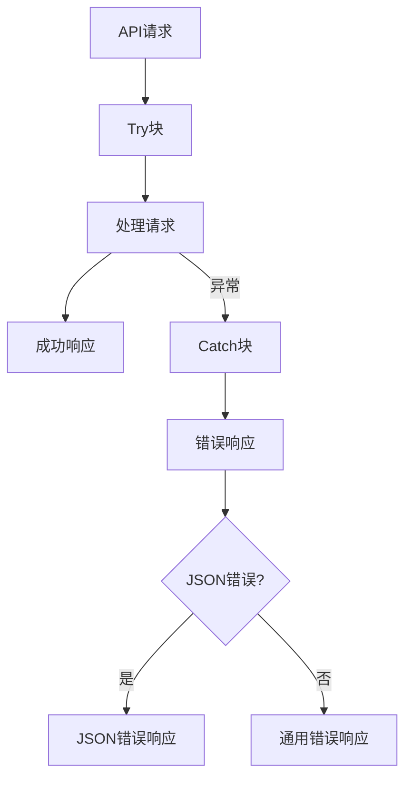

# 描述文件列表API

<cite>
**本文档引用的文件**
- [启动服务器.py](file://启动服务器.py)
- [js/main.js](file://js/main.js)
- [js/manage.js](file://js/manage.js)
- [产品描述/室内双面吊装标牌.md](file://产品描述/室内双面吊装标牌.md)
</cite>

## 目录
1. [简介](#简介)
2. [接口概述](#接口概述)
3. [技术实现](#技术实现)
4. [响应数据结构](#响应数据结构)
5. [文件扫描机制](#文件扫描机制)
6. [路径处理规范](#路径处理规范)
7. [完整响应示例](#完整响应示例)
8. [客户端使用指南](#客户端使用指南)
9. [错误处理](#错误处理)
10. [最佳实践](#最佳实践)

## 简介

GET /api/list-descriptions 接口是一个专门用于获取产品描述文件列表的API端点。该接口返回项目中所有Markdown格式描述文件的相对路径，为前端应用提供动态加载产品详细信息的能力。

## 接口概述

### 基本信息
- **HTTP方法**: GET
- **端点路径**: `/api/list-descriptions`
- **功能**: 返回所有产品描述文件的相对路径列表
- **响应格式**: JSON数组
- **内容类型**: `application/json`

### 服务器实现

该接口由Python内置HTTP服务器实现，位于启动服务器.py文件中：



**图表来源**
- [启动服务器.py:238-251](file://启动服务器.py#L238-L251)

## 技术实现

### 服务器端实现

服务器端通过SimpleHTTPRequestHandler类扩展，增加了自定义API路由功能：



**图表来源**
- [启动服务器.py:75-86](file://启动服务器.py#L75-L86)
- [启动服务器.py:238-251](file://启动服务器.py#L238-L251)

### 客户端集成

前端应用通过fetch API调用该接口，主要在两个场景使用：

1. **主应用**: 用于获取描述文件列表以便动态加载产品详情
2. **管理后台**: 用于提供描述文件选择下拉菜单

**章节来源**
- [js/main.js:421-442](file://js/main.js#L421-L442)
- [js/manage.js:61-72](file://js/manage.js#L61-L72)

## 响应数据结构

### 基本格式

接口返回一个JSON数组，数组中的每个元素都是字符串类型的文件路径：

```json
[
  "产品描述/室内双面吊装标牌.md",
  "产品描述/室内立式广告机.md",
  "产品描述/室外可移动广告机.md",
  "产品描述/室外立式广告机.md",
  "产品描述/电子水牌.md",
  "产品描述/自助点单机1.md"
]
```

### 数据类型说明

- **数组元素**: 字符串
- **路径格式**: 相对路径
- **编码格式**: UTF-8
- **字符编码**: Unicode

### 响应头信息

- **Content-Type**: `application/json; charset=utf-8`
- **Access-Control-Allow-Origin**: `*` (支持跨域访问)
- **Access-Control-Allow-Methods**: `GET, POST, OPTIONS`

**章节来源**
- [启动服务器.py:34-46](file://启动服务器.py#L34-L46)

## 文件扫描机制

### 目录结构

接口扫描特定目录来发现描述文件：



**图表来源**
- [启动服务器.py:239-251](file://启动服务器.py#L239-L251)

### 扫描算法

1. **目录定位**: 通过`os.path.join(PROJECT_ROOT, '产品描述')`构建绝对路径
2. **目录验证**: 检查目标目录是否存在
3. **文件枚举**: 使用`os.listdir()`获取目录内容
4. **文件过滤**: 仅保留`.md`扩展名的文件
5. **路径生成**: 使用`os.path.relpath()`生成相对路径
6. **格式化**: 将路径分隔符统一转换为正斜杠

### 过滤规则

- **扩展名过滤**: 仅接受`.md`扩展名（大小写不敏感）
- **文件类型**: 仅处理普通文件，忽略子目录
- **排序**: 返回的文件按字母顺序排序

**章节来源**
- [启动服务器.py:244-249](file://启动服务器.py#L244-L249)

## 路径处理规范

### 路径生成

服务器使用以下步骤生成返回路径：

1. **相对路径计算**: `os.path.relpath(file_path, PROJECT_ROOT)`
2. **分隔符标准化**: `relative_path.replace(os.sep, '/')`
3. **编码处理**: 使用UTF-8编码确保国际化字符正确传输

### 跨平台兼容性

- **Windows**: 将反斜杠`\`转换为正斜杠`/`
- **Unix/Linux**: 保持原样
- **macOS**: 保持原样

### 路径安全性

- **相对路径**: 始终返回相对于项目根目录的路径
- **文件存在性**: 仅返回实际存在的文件
- **权限检查**: 不检查文件访问权限，仅基于文件系统可见性

**章节来源**
- [启动服务器.py:246-248](file://启动服务器.py#L246-L248)

## 完整响应示例

### 成功响应

```json
[
  "产品描述/室内双面吊装标牌.md",
  "产品描述/室内立式广告机.md",
  "产品描述/室外可移动广告机.md",
  "产品描述/室外立式广告机.md",
  "产品描述/电子水牌.md",
  "产品描述/自助点单机1.md"
]
```

### 空响应

当没有描述文件时，返回空数组：

```json
[]
```

### 错误响应

当发生内部服务器错误时，返回JSON对象：

```json
{
  "success": false,
  "error": "错误消息描述"
}
```

**章节来源**
- [启动服务器.py:44-46](file://启动服务器.py#L44-L46)

## 客户端使用指南

### JavaScript调用示例

#### 基础调用

```javascript
// 获取描述文件列表
async function loadDescriptionList() {
    try {
        const response = await fetch('/api/list-descriptions');
        if (!response.ok) {
            throw new Error(`HTTP ${response.status}`);
        }
        const descFiles = await response.json();
        console.log('描述文件列表:', descFiles);
        return descFiles;
    } catch (error) {
        console.error('获取描述文件列表失败:', error);
        return [];
    }
}
```

#### 在管理后台中的使用

```javascript
// 管理后台初始化时加载描述文件列表
document.addEventListener('DOMContentLoaded', async () => {
    try {
        const response = await fetch('/api/list-descriptions');
        if (response.ok) {
            descFiles = await response.json();
            console.log('可用描述文件:', descFiles);
            // 更新下拉菜单选项
            updateDescriptionSelectOptions(descFiles);
        }
    } catch (error) {
        console.warn('获取描述文件列表失败:', error);
    }
});
```

#### 动态加载描述内容

```javascript
// 根据文件路径加载Markdown内容
async function loadDescriptionContent(filePath) {
    try {
        const response = await fetch(filePath);
        if (!response.ok) {
            throw new Error(`加载失败: ${response.status}`);
        }
        const markdown = await response.text();
        return markdown;
    } catch (error) {
        console.warn(`产品说明文件加载失败: ${filePath}`, error);
        return null;
    }
}

// 使用marked.js解析Markdown
function parseMarkdown(markdown) {
    if (typeof marked !== 'undefined') {
        return marked.parse(markdown);
    }
    return markdown
        .replace(/&/g, '&amp;')
        .replace(/</g, '&lt;')
        .replace(/>/g, '&gt;')
        .replace(/\n/g, '<br>');
}
```

### 前端集成模式

#### 主应用模式



**图表来源**
- [js/main.js:421-460](file://js/main.js#L421-L460)

#### 管理后台模式



**图表来源**
- [js/manage.js:61-72](file://js/manage.js#L61-L72)

**章节来源**
- [js/main.js:421-460](file://js/main.js#L421-L460)
- [js/manage.js:61-72](file://js/manage.js#L61-L72)

## 错误处理

### 服务器端错误处理

服务器实现了完善的错误处理机制：



### 常见错误场景

1. **未知API路径**: 返回404状态码
2. **服务器内部错误**: 返回500状态码
3. **网络连接中断**: 客户端需要实现重试机制
4. **文件系统访问失败**: 返回空数组或部分结果

### 客户端错误处理

```javascript
async function robustFetch(url, options = {}) {
    try {
        const response = await fetch(url, options);
        if (!response.ok) {
            throw new Error(`HTTP ${response.status}: ${response.statusText}`);
        }
        return await response.json();
    } catch (error) {
        console.error(`请求失败: ${url}`, error);
        // 实现重试逻辑
        return handleRetry(url, options);
    }
}
```

**章节来源**
- [启动服务器.py:84-85](file://启动服务器.py#L84-L85)
- [js/main.js:436-441](file://js/main.js#L436-L441)

## 最佳实践

### 性能优化建议

1. **缓存策略**: 建议在客户端实现描述文件列表缓存
2. **并发加载**: 使用Promise.all()并行加载多个描述文件
3. **错误重试**: 实现指数退避重试机制
4. **超时控制**: 为API请求设置合理的超时时间

### 安全考虑

1. **路径遍历防护**: 服务器端已通过相对路径生成避免路径遍历攻击
2. **文件访问控制**: 仅返回项目根目录内的文件
3. **CORS配置**: 已启用跨域访问支持
4. **输入验证**: 服务器端对API路径进行严格验证

### 维护建议

1. **文件命名规范**: 建议使用有意义的文件名
2. **目录结构**: 保持描述文件集中在一个目录中
3. **版本控制**: 将描述文件纳入版本控制系统
4. **备份策略**: 定期备份重要的描述文件

### 扩展性考虑

1. **多语言支持**: 可以扩展支持多语言描述文件
2. **元数据管理**: 可以添加描述文件的元数据信息
3. **搜索功能**: 可以实现描述文件的搜索和过滤功能
4. **权限控制**: 可以添加基于角色的访问控制

**章节来源**
- [启动服务器.py:28-32](file://启动服务器.py#L28-L32)
- [启动服务器.py:48-52](file://启动服务器.py#L48-L52)