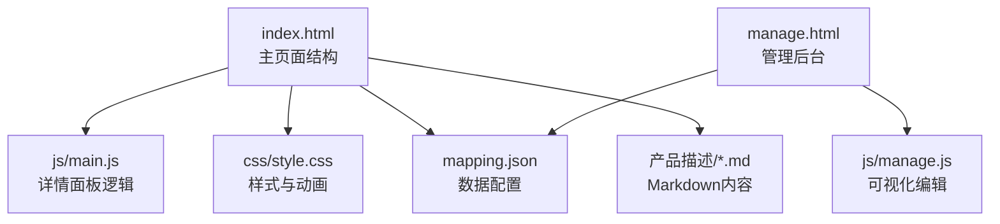
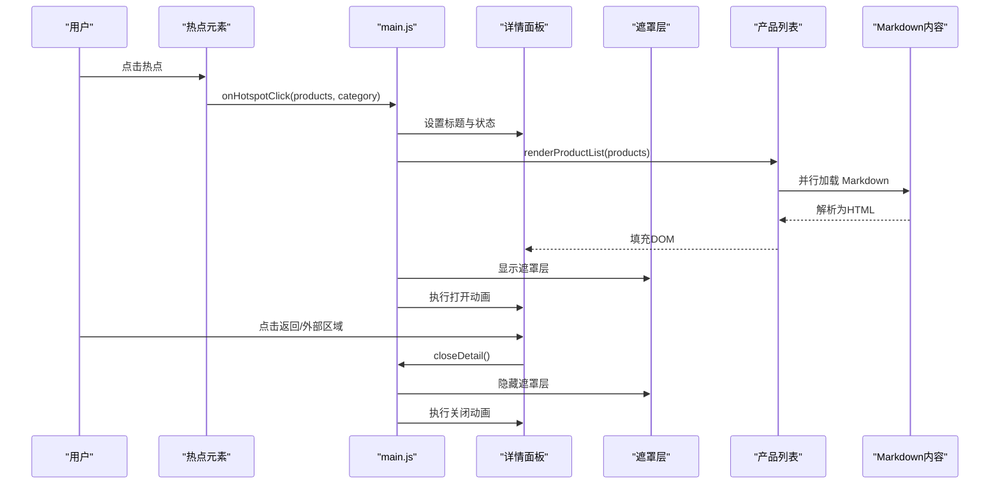
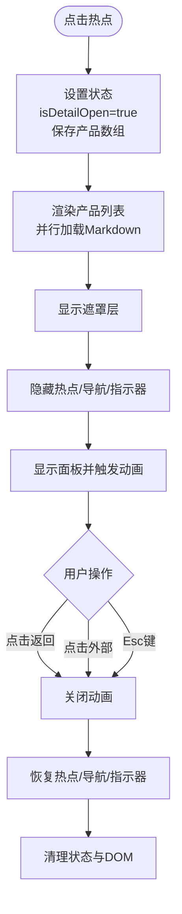
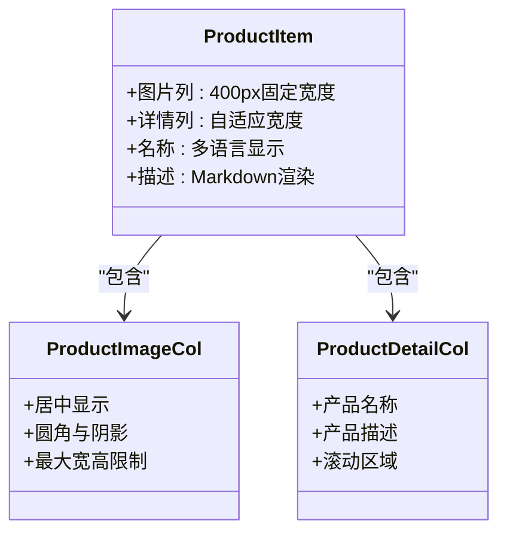
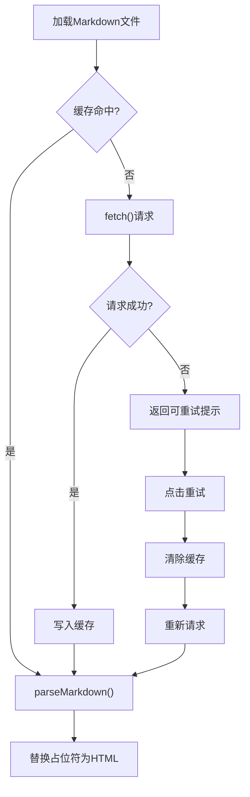
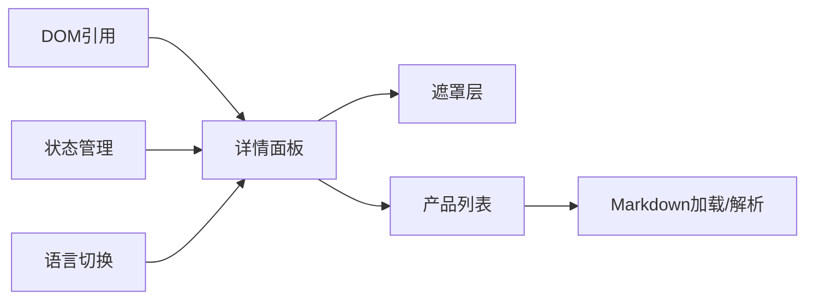

# 产品详情面板

<cite>
**本文档引用的文件**
- [index.html](file://index.html)
- [js/main.js](file://js/main.js)
- [css/style.css](file://css/style.css)
- [mapping.json](file://mapping.json)
- [project_architecture.md](file://project_architecture.md)
- [产品描述/室内双面吊装标牌.md](file://产品描述/室内双面吊装标牌.md)
- [产品描述/电子水牌.md](file://产品描述/电子水牌.md)
- [manage.html](file://manage.html)
- [js/manage.js](file://js/manage.js)
</cite>

## 目录
1. [简介](#简介)
2. [项目结构](#项目结构)
3. [核心组件](#核心组件)
4. [架构总览](#架构总览)
5. [详细组件分析](#详细组件分析)
6. [依赖关系分析](#依赖关系分析)
7. [性能考量](#性能考量)
8. [故障排除指南](#故障排除指南)
9. [结论](#结论)
10. [附录](#附录)

## 简介
本文件为“产品详情面板”的全面功能文档，聚焦于以下方面：
- 详情面板的显示/隐藏控制、动画过渡效果与遮罩层管理
- 产品列表的动态渲染机制（多产品并排显示、滚动适配与响应式布局）
- Markdown 内容的渲染流程（marked.js 集成、安全过滤与格式化处理）
- 返回按钮的功能实现与用户导航体验
- 详情面板的样式定制指南（主题色、字体大小、间距调整）
- 内容加载优化与错误处理机制，确保良好用户体验

## 项目结构
该项目采用纯前端架构，数据与逻辑分离，通过 mapping.json 动态驱动场景与产品配置。详情面板位于展示页面 index.html 中，由 js/main.js 控制其显示/隐藏与动画，css/style.css 提供样式与动画定义。

图表来源
- [index.html:56-72](file://index.html#L56-L72)
- [js/main.js:873-1025](file://js/main.js#L873-L1025)
- [css/style.css:458-525](file://css/style.css#L458-L525)
- [mapping.json:1-232](file://mapping.json#L1-L232)

章节来源
- [index.html:1-83](file://index.html#L1-L83)
- [project_architecture.md:257-301](file://project_architecture.md#L257-L301)

## 核心组件
- 详情面板容器与卡片：负责承载产品列表与标题，提供居中显示与弹性缩放动画。
- 遮罩层：控制面板外点击关闭行为，提供半透明背景与过渡动画。
- 产品列表：动态渲染多个产品，采用左图右文布局，支持垂直滚动与自定义滚动条样式。
- Markdown 渲染：通过 marked.js 将 Markdown 转换为 HTML，并提供加载占位与失败重试机制。
- 返回按钮：支持点击与键盘 Esc 关闭详情面板，确保一致的导航体验。

章节来源
- [js/main.js:873-1025](file://js/main.js#L873-L1025)
- [css/style.css:458-790](file://css/style.css#L458-L790)

## 架构总览
详情面板的交互流程围绕“热点点击 → 详情面板打开 → 产品列表渲染 → 遮罩层管理 → 返回关闭”展开。整体采用异步加载与并行处理，确保首屏加载与用户体验的平衡。

图表来源
- [js/main.js:856-1025](file://js/main.js#L856-L1025)
- [js/main.js:1109-1130](file://js/main.js#L1109-L1130)

## 详细组件分析

### 详情面板显示/隐藏控制与动画
- 显示控制：onHotspotClick 设置状态 isDetailOpen，保存当前产品数组与热点元素，设置面板标题。
- 打开动画：openDetailAnimation 顺序执行背景淡化、遮罩层显隐、隐藏热点与导航按钮、延迟显示面板并触发动画。
- 关闭流程：closeDetail 逆向执行，先隐藏面板，再恢复背景与遮罩层，最后恢复热点与导航按钮并清理状态。
- 键盘支持：Esc 键在详情面板打开时可一键关闭。

图表来源
- [js/main.js:856-1025](file://js/main.js#L856-L1025)

章节来源
- [js/main.js:856-1025](file://js/main.js#L856-L1025)
- [js/main.js:1109-1130](file://js/main.js#L1109-L1130)

### 遮罩层管理
- 遮罩层通过 CSS 过渡实现淡入淡出，z-index 保证在面板之下、场景之上。
- 点击遮罩层触发关闭流程，避免误操作导致面板无法关闭。
- 背景容器 dimmed 类实现场景图的模糊与亮度降低，突出详情面板。

章节来源
- [css/style.css:439-456](file://css/style.css#L439-L456)
- [js/main.js:962-1025](file://js/main.js#L962-L1025)

### 产品列表动态渲染机制
- 左图右文布局：每个产品项包含左侧产品图片列与右侧详情列，图片列固定宽度，详情列自适应。
- 多产品并排：产品列表容器支持纵向滚动，每个产品项具有统一的间距与分隔线。
- 响应式布局：图片列在不同屏幕尺寸下保持比例与阴影效果，详情列根据内容自适应高度。
- 滚动适配：自定义滚动条样式，提升阅读体验；滚动区域支持触摸滚动。

图表来源
- [css/style.css:619-700](file://css/style.css#L619-L700)
- [js/main.js:888-956](file://js/main.js#L888-L956)

章节来源
- [css/style.css:587-700](file://css/style.css#L587-L700)
- [js/main.js:888-956](file://js/main.js#L888-L956)

### Markdown 内容渲染流程
- marked.js 集成：parseMarkdown 使用 marked.parse 将 Markdown 转换为 HTML。
- 缓存机制：descriptionCache 避免重复请求同一文件。
- 加载占位：渲染时先显示加载占位符，提升感知速度。
- 失败重试：加载失败返回可点击重试的提示，点击后清除缓存并重新加载。
- 降级处理：marked.js 未加载时进行 HTML 转义与换行处理，保证基本可用。

图表来源
- [js/main.js:421-461](file://js/main.js#L421-L461)
- [js/main.js:933-955](file://js/main.js#L933-L955)

章节来源
- [js/main.js:421-461](file://js/main.js#L421-L461)
- [js/main.js:933-955](file://js/main.js#L933-L955)

### 返回按钮功能实现与导航体验
- 点击返回：触发 closeDetail，执行关闭动画与状态清理。
- 键盘 Esc：在详情面板打开状态下，Esc 键可一键关闭。
- 无障碍支持：返回按钮具备 aria-label，便于屏幕阅读器识别。
- 一致性体验：返回按钮文字随语言切换而更新，确保本地化一致性。

章节来源
- [js/main.js:1109-1130](file://js/main.js#L1109-L1130)
- [js/main.js:1197-1281](file://js/main.js#L1197-L1281)

### 样式定制指南
- 主题色：使用蓝色系（主题蓝、深蓝、浅蓝）作为强调色，适用于按钮、装饰条与高亮元素。
- 字体大小：标题使用较大字号，正文使用适中字号，确保可读性；产品名称与描述分别设置不同字号与行高。
- 间距调整：产品项之间设置统一间距，图片列与详情列之间设置横向间距，保证视觉平衡。
- 阴影与圆角：卡片与图片列采用圆角与阴影，提升层次感；按钮与标签采用毛玻璃背景与模糊效果。
- 滚动条样式：自定义滚动条颜色与宽度，提升滚动体验；悬停时增强对比度。

章节来源
- [css/style.css:367-380](file://css/style.css#L367-L380)
- [css/style.css:587-790](file://css/style.css#L587-L790)

## 依赖关系分析
- 详情面板依赖 DOM 引用与状态管理，通过 openDetailAnimation/closeDetail 控制显示与隐藏。
- 产品列表依赖 Markdown 加载与解析，通过并行加载提升性能。
- 遮罩层与背景容器共同作用，提供沉浸式体验。
- 语言切换影响标题与按钮文字，详情面板在语言切换时重新渲染。

图表来源
- [js/main.js:169-188](file://js/main.js#L169-L188)
- [js/main.js:195-204](file://js/main.js#L195-L204)
- [js/main.js:873-1025](file://js/main.js#L873-L1025)

章节来源
- [js/main.js:169-188](file://js/main.js#L169-L188)
- [js/main.js:195-204](file://js/main.js#L195-L204)

## 性能考量
- 并行加载：产品描述采用 Promise.all 并行加载，显著缩短渲染时间。
- 首屏独占带宽：首场景加载完成后才启动后台预加载，避免带宽竞争导致首图长时间加载失败。
- 防抖与节流：窗口大小变化时使用防抖，减少频繁重定位计算。
- 缓存策略：图片与 Markdown 内容缓存，避免重复请求。
- 动画优化：使用 CSS 过渡与 requestAnimationFrame，确保动画流畅。

章节来源
- [js/main.js:933-955](file://js/main.js#L933-L955)
- [js/main.js:1140-1148](file://js/main.js#L1140-L1148)
- [js/main.js:257-327](file://js/main.js#L257-L327)

## 故障排除指南
- 详情面板无法打开：检查热点点击事件是否被阻止，确认 isDetailOpen 状态未被锁定。
- 遮罩层无效：确认遮罩层 CSS 类是否正确添加/移除，检查 z-index 层级。
- 产品列表空白：检查 Markdown 加载是否失败，查看失败提示并尝试重试。
- 返回按钮无效：确认事件绑定是否正常，Esc 键支持仅在详情面板打开时生效。
- 语言切换后标题未更新：检查 switchLanguage 是否正确调用并重新渲染标题。

章节来源
- [js/main.js:1109-1130](file://js/main.js#L1109-L1130)
- [js/main.js:1197-1281](file://js/main.js#L1197-L1281)

## 结论
产品详情面板通过清晰的状态管理、流畅的动画过渡与完善的错误处理，提供了优秀的用户体验。结合并行加载与缓存策略，确保在弱网环境下也能快速呈现内容。样式系统支持灵活的主题定制，满足不同品牌与场景需求。

## 附录
- 数据配置：mapping.json 定义场景、热点与产品，支持多语言名称与描述文件路径。
- Markdown 示例：产品描述采用 Markdown 格式，支持列表、表格与强调等语法。
- 管理后台：通过 manage.html 与 js/manage.js 可视化编辑场景与产品配置，简化维护流程。

章节来源
- [mapping.json:1-232](file://mapping.json#L1-L232)
- [产品描述/室内双面吊装标牌.md:1-13](file://产品描述/室内双面吊装标牌.md#L1-L13)
- [产品描述/电子水牌.md:1-10](file://产品描述/电子水牌.md#L1-L10)
- [manage.html:1-113](file://manage.html#L1-L113)
- [js/manage.js:1-800](file://js/manage.js#L1-L800)