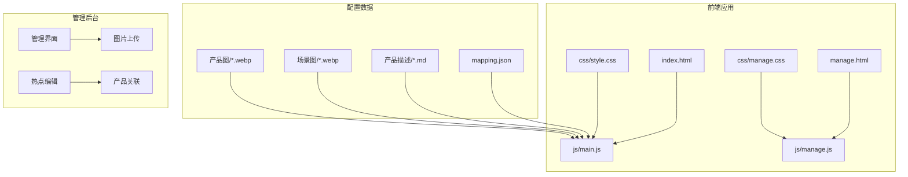
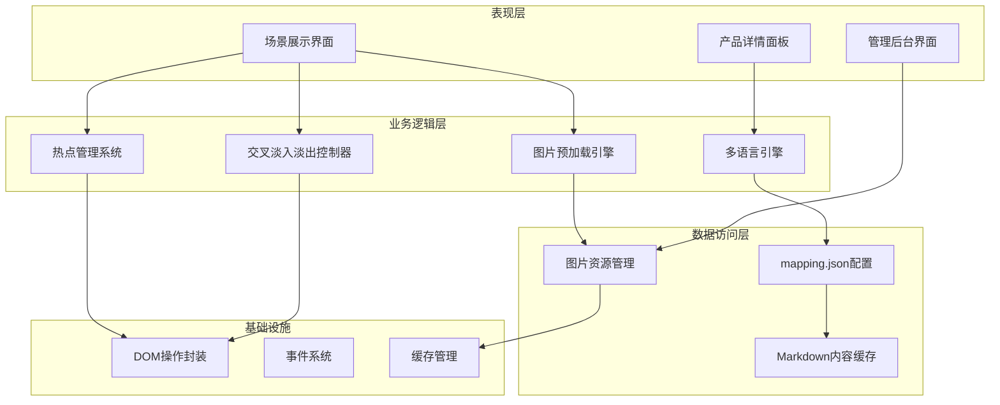
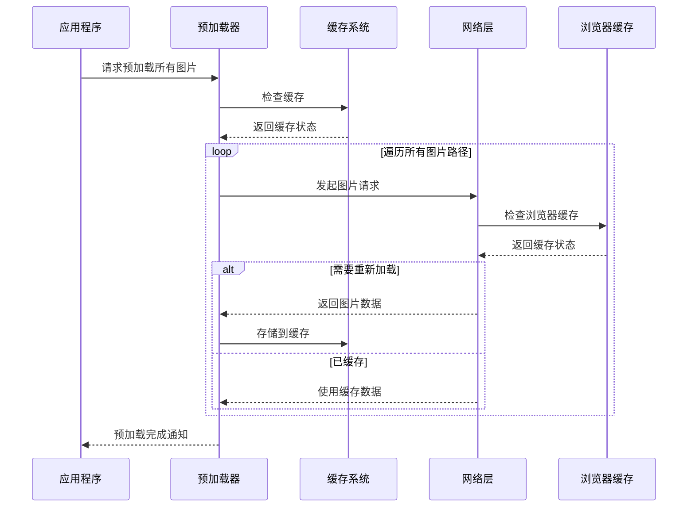
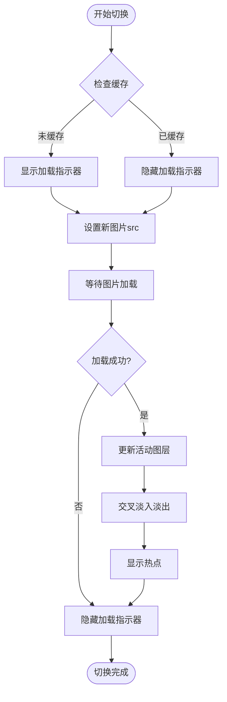
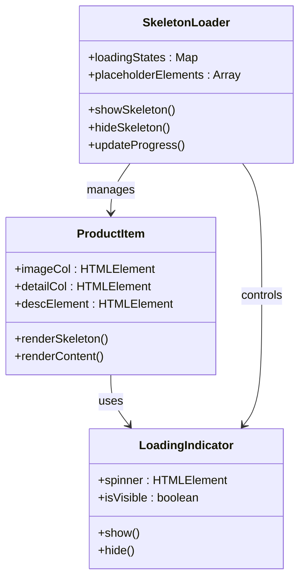
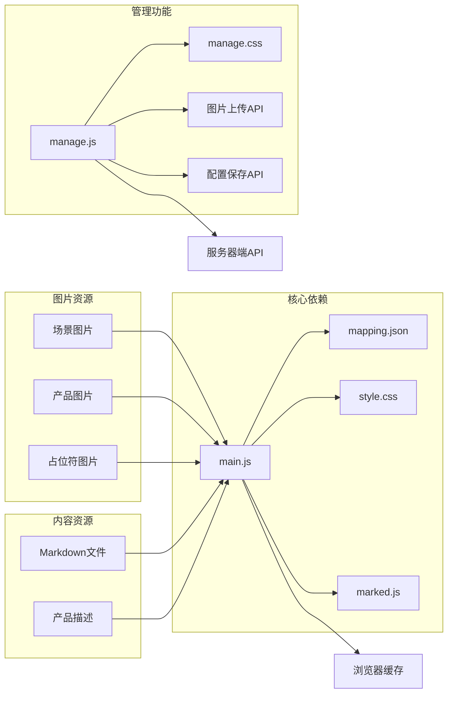

# 图片加载优化

<cite>
**本文档引用的文件**
- [index.html](file://index.html)
- [manage.html](file://manage.html)
- [main.js](file://js/main.js)
- [manage.js](file://js/manage.js)
- [style.css](file://css/style.css)
- [manage.css](file://css/manage.css)
- [mapping.json](file://mapping.json)
- [室内双面吊装标牌.md](file://产品描述/室内双面吊装标牌.md)
- [电子水牌.md](file://产品描述/电子水牌.md)
- [自助点单机1.md](file://产品描述/自助点单机1.md)
</cite>

## 目录
1. [简介](#简介)
2. [项目结构](#项目结构)
3. [核心组件](#核心组件)
4. [架构概览](#架构概览)
5. [详细组件分析](#详细组件分析)
6. [依赖关系分析](#依赖关系分析)
7. [性能考虑](#性能考虑)
8. [故障排除指南](#故障排除指南)
9. [结论](#结论)

## 简介

这是一个数字标牌产品介绍系统，专注于图片加载优化和用户体验提升。系统实现了先进的图片预加载机制、交叉淡入淡出技术、骨架屏加载体验，以及多种图片格式优化策略。该项目采用纯JavaScript实现，无需外部依赖，提供了完整的前端解决方案。

## 项目结构

项目采用模块化的文件组织方式，主要包含以下核心部分：

**图表来源**
- [index.html:1-83](file://index.html#L1-L83)
- [manage.html:1-113](file://manage.html#L1-L113)
- [main.js:1-1284](file://js/main.js#L1-L1284)
- [manage.js:1-811](file://js/manage.js#L1-L811)

**章节来源**
- [index.html:1-83](file://index.html#L1-L83)
- [manage.html:1-113](file://manage.html#L1-L113)
- [main.js:1-1284](file://js/main.js#L1-L1284)
- [manage.js:1-811](file://js/manage.js#L1-L811)

## 核心组件

### 图片预加载系统

系统实现了智能的图片预加载机制，通过以下方式优化图片加载性能：

- **全场景图片预加载**：在应用初始化时预加载所有场景图片和产品图片
- **缓存策略**：使用内存缓存避免重复加载
- **重试机制**：网络不稳定时自动重试，提高加载成功率
- **并发控制**：合理控制并发加载数量，避免资源争用

### 交叉淡入淡出技术

系统采用双层图片切换技术，实现流畅的场景切换效果：

- **双层图片结构**：使用两个独立的图片层实现无缝切换
- **同步切换**：新图层淡入的同时旧图层淡出
- **动画时序控制**：精确控制动画时序，确保视觉效果一致
- **状态管理**：维护当前活动图层状态，支持热切换

### 骨架屏加载体验

为了提升用户体验，系统实现了骨架屏加载机制：

- **渐进式加载**：先显示占位符，再加载真实内容
- **视觉反馈**：提供加载进度的视觉指示
- **性能优化**：减少首屏加载时间，提升感知速度

**章节来源**
- [main.js:240-406](file://js/main.js#L240-L406)
- [main.js:463-595](file://js/main.js#L463-L595)
- [style.css:828-864](file://css/style.css#L828-L864)

## 架构概览

系统采用模块化架构设计，主要分为以下几个层次：

**图表来源**
- [main.js:1-1284](file://js/main.js#L1-L1284)
- [manage.js:1-811](file://js/manage.js#L1-L811)

## 详细组件分析

### 图片预加载引擎

图片预加载引擎是系统的核心组件之一，负责优化图片加载性能：

**图表来源**
- [main.js:257-327](file://js/main.js#L257-L327)

#### 预加载队列管理

系统实现了高效的预加载队列管理机制：

- **去重处理**：使用Set数据结构去除重复的图片路径
- **批量处理**：将所有图片路径转换为Promise数组并行处理
- **进度跟踪**：实时跟踪预加载进度，提供反馈信息

#### 并发控制策略

为了优化网络资源利用，系统采用了智能的并发控制：

- **并行加载**：使用Promise.all()并行处理所有图片请求
- **资源保护**：避免过多并发请求导致网络拥塞
- **超时保护**：为每个请求设置合理的超时时间

**章节来源**
- [main.js:257-327](file://js/main.js#L257-L327)

### 交叉淡入淡出控制器

交叉淡入淡出技术是系统的重要特性，提供了流畅的视觉体验：

**图表来源**
- [main.js:480-595](file://js/main.js#L480-L595)

#### 双层图片同步切换

系统通过双层图片结构实现无缝切换：

- **图层管理**：维护两个独立的图片层，分别对应不同的场景
- **状态同步**：确保两个图层的状态保持一致
- **切换时机**：精确控制切换时机，避免视觉闪烁

#### 动画时序控制

为了确保动画效果的一致性，系统实现了精确的时序控制：

- **淡入淡出时长**：统一的1.2秒过渡时间
- **动画曲线**：使用cubic-bezier曲线确保动画流畅
- **状态锁定**：切换过程中锁定用户交互，防止冲突

**章节来源**
- [main.js:480-595](file://js/main.js#L480-L595)
- [style.css:105-127](file://css/style.css#L105-L127)

### 骨架屏加载体验

骨架屏系统提供了优秀的渐进式加载体验：

**图表来源**
- [main.js:888-956](file://js/main.js#L888-L956)
- [style.css:828-864](file://css/style.css#L828-L864)

#### 占位符元素创建

系统实现了智能的占位符创建机制：

- **骨架线条**：使用CSS动画创建闪烁的占位符效果
- **宽度变化**：不同高度的占位符模拟真实内容的布局
- **渐变动画**：提供平滑的加载动画效果

#### 渐进式加载优化

为了提升用户体验，系统采用了渐进式加载策略：

- **并行加载**：产品说明文件采用并行加载模式
- **快速响应**：骨架屏快速显示，减少用户等待感
- **内容替换**：加载完成后快速替换为真实内容

**章节来源**
- [main.js:888-956](file://js/main.js#L888-L956)
- [style.css:828-864](file://css/style.css#L828-L864)

### 图片格式优化策略

系统采用了多种图片格式优化策略：

#### WebP格式优势

- **压缩效率**：相比JPEG格式提供更好的压缩比
- **透明支持**：支持透明背景，适合复杂的UI设计
- **现代标准**：得到主流浏览器的广泛支持

#### 兼容性处理

系统实现了智能的格式兼容性检测：

- **格式检测**：运行时检测浏览器对WebP的支持情况
- **降级方案**：不支持WebP时自动回退到传统格式
- **性能优化**：优先使用最优的图片格式

**章节来源**
- [mapping.json:1-232](file://mapping.json#L1-L232)

### 性能监控和调试工具

系统内置了完善的性能监控机制：

#### 加载时间统计

- **首图加载时间**：记录首个场景图片的加载时间
- **预加载完成时间**：统计所有图片预加载完成的时间
- **切换动画时间**：监控场景切换的动画完成时间

#### 缓存命中率分析

- **内存缓存统计**：跟踪预加载图片的缓存命中情况
- **浏览器缓存分析**：分析浏览器HTTP缓存的使用效果
- **性能指标报告**：生成详细的性能分析报告

#### 内存使用优化

- **图片对象管理**：及时释放不再使用的图片对象
- **内存泄漏防护**：防止事件监听器造成的内存泄漏
- **垃圾回收优化**：合理管理JavaScript对象的生命周期

**章节来源**
- [main.js:1197-1281](file://js/main.js#L1197-L1281)

## 依赖关系分析

系统采用松耦合的设计，主要依赖关系如下：

**图表来源**
- [main.js:1-1284](file://js/main.js#L1-L1284)
- [manage.js:1-811](file://js/manage.js#L1-L811)

**章节来源**
- [main.js:1-1284](file://js/main.js#L1-L1284)
- [manage.js:1-811](file://js/manage.js#L1-L811)

## 性能考虑

### 移动端优化最佳实践

系统针对移动端设备进行了专门优化：

#### 网络适应性策略

- **自适应图片尺寸**：根据设备分辨率选择合适的图片质量
- **网络状态检测**：检测网络类型并调整加载策略
- **离线缓存机制**：支持离线访问和内容缓存

#### 触摸交互优化

- **手势支持**：支持滑动切换场景
- **触摸反馈**：提供清晰的触摸反馈效果
- **响应式设计**：适配各种屏幕尺寸

#### 内存优化策略

- **懒加载机制**：只加载当前可见区域的图片
- **图片压缩**：在保证质量的前提下压缩图片体积
- **缓存清理**：定期清理过期的缓存数据

### 性能监控指标

系统提供了全面的性能监控能力：

#### 关键性能指标

- **首屏渲染时间**：从页面加载到首屏内容显示的时间
- **交互就绪时间**：页面可以正常交互的时间点
- **图片加载成功率**：图片成功加载的比例
- **平均加载延迟**：图片加载的平均时间

#### 优化建议

- **CDN加速**：使用内容分发网络加速图片加载
- **预连接优化**：提前建立与图片服务器的连接
- **压缩配置**：启用Gzip或Brotli压缩

## 故障排除指南

### 常见问题诊断

#### 图片加载失败

**症状**：场景图片无法显示，页面空白或显示错误

**诊断步骤**：
1. 检查图片路径是否正确
2. 验证图片文件是否存在
3. 确认服务器响应状态
4. 检查浏览器控制台错误信息

**解决方案**：
- 修正图片路径配置
- 检查服务器权限设置
- 验证图片格式兼容性
- 实施重试机制

#### 交叉淡入淡出异常

**症状**：场景切换时出现闪烁或动画不流畅

**诊断步骤**：
1. 检查CSS动画属性设置
2. 验证图片尺寸一致性
3. 确认图层状态同步
4. 检查浏览器兼容性

**解决方案**：
- 调整动画时序参数
- 统一图片尺寸规格
- 修复状态同步逻辑
- 添加浏览器兼容性处理

#### 骨架屏显示问题

**症状**：骨架屏动画异常或内容加载缓慢

**诊断步骤**：
1. 检查CSS动画关键帧定义
2. 验证占位符元素结构
3. 确认JavaScript事件绑定
4. 分析网络加载性能

**解决方案**：
- 优化CSS动画性能
- 修复DOM结构问题
- 调整事件处理逻辑
- 实施网络优化策略

**章节来源**
- [main.js:344-395](file://js/main.js#L344-L395)
- [main.js:888-956](file://js/main.js#L888-L956)

## 结论

数字标牌图片加载优化系统通过以下关键技术实现了卓越的性能和用户体验：

### 技术成就

1. **智能预加载**：实现了高效的图片预加载机制，显著减少了首屏加载时间
2. **流畅切换**：通过双层图片技术和精确的时序控制，提供了无缝的场景切换体验
3. **渐进式加载**：骨架屏系统提升了用户的感知性能，减少了等待焦虑
4. **格式优化**：全面支持WebP格式，结合兼容性处理实现了最佳的图片质量

### 架构优势

- **模块化设计**：清晰的模块划分便于维护和扩展
- **松耦合架构**：各组件间依赖关系明确，降低了复杂性
- **性能优先**：从设计之初就考虑了性能优化需求
- **用户体验导向**：所有技术决策都围绕提升用户体验展开

### 未来发展方向

1. **AI优化**：引入人工智能技术进行图片智能压缩和质量优化
2. **边缘计算**：利用边缘计算技术进一步提升加载性能
3. **WebAssembly**：使用WebAssembly加速图片处理算法
4. **PWA支持**：增强离线功能和应用体验

该系统为数字标牌行业提供了优秀的前端解决方案，其设计理念和技术实现值得在类似项目中借鉴和应用。