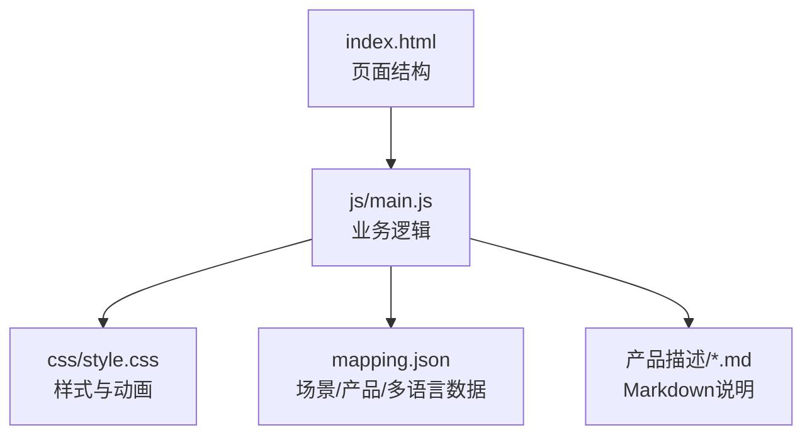
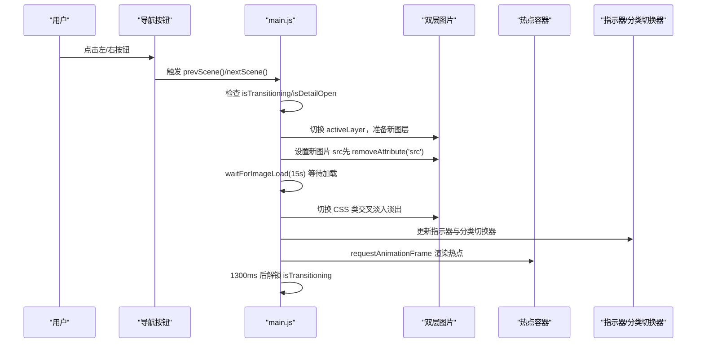
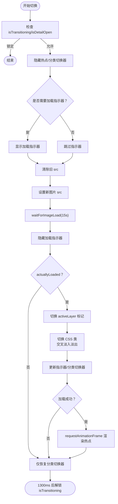
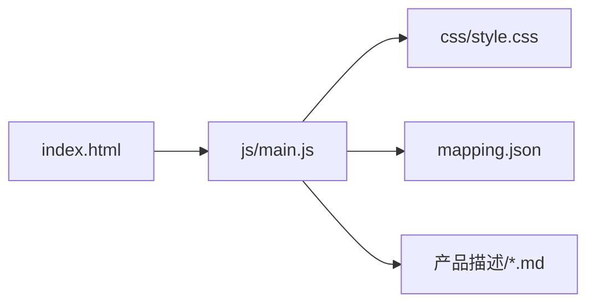

# 场景导航系统

<cite>
**本文引用的文件**
- [index.html](file://index.html)
- [main.js](file://js/main.js)
- [style.css](file://css/style.css)
- [mapping.json](file://mapping.json)
- [项目架构文档](file://project_architecture.md)
- [室内双面吊装标牌.md](file://产品描述/室内双面吊装标牌.md)
- [自助点单机1.md](file://产品描述/自助点单机1.md)
</cite>

## 目录
1. [简介](#简介)
2. [项目结构](#项目结构)
3. [核心组件](#核心组件)
4. [架构总览](#架构总览)
5. [详细组件分析](#详细组件分析)
6. [依赖关系分析](#依赖关系分析)
7. [性能考量](#性能考量)
8. [故障排查指南](#故障排查指南)
9. [结论](#结论)
10. [附录](#附录)

## 简介
本文件为“场景导航系统”的全面功能文档，聚焦于场景切换的实现原理、交叉淡入淡出动画的技术细节、场景指示器与用户反馈机制、场景分类系统与快速跳转、性能优化策略以及调试与常见问题解决方法。系统通过双层图片实现无黑屏交叉淡入淡出，结合热点定位、弹窗详情与多语言支持，提供流畅的场景浏览体验。

## 项目结构
- 展示页面：index.html
- 样式：css/style.css
- 逻辑：js/main.js
- 数据配置：mapping.json
- 产品描述：产品描述/*.md
- 项目架构说明：project_architecture.md

图表来源
- [index.html:1-83](file://index.html#L1-L83)
- [main.js:1197-1284](file://js/main.js#L1197-L1284)
- [style.css:1-997](file://css/style.css#L1-L997)
- [mapping.json:1-232](file://mapping.json#L1-L232)

章节来源
- [index.html:1-83](file://index.html#L1-L83)
- [project_architecture.md:43-108](file://project_architecture.md#L43-L108)

## 核心组件
- 数据加载与重试：从 mapping.json 动态加载场景与多语言配置，含最多 3 次递增延迟重试。
- 状态管理：包含当前索引、切换状态锁、当前语言、预加载缓存、活跃图层等。
- 场景渲染与切换：双层图片交叉淡入淡出，加载等待与超时保护，热点渲染与重定位。
- 场景分类系统：动态生成分类标签与快速跳转。
- 热点系统：脉冲热点渲染、像素坐标计算、点击交互与弹窗详情。
- 多语言引擎：t()/getText()/switchLanguage()，支持页面文本、标题、按钮与弹窗内容的实时切换。
- 用户反馈：加载指示器、骨架屏、错误提示与键盘/鼠标事件绑定。

章节来源
- [main.js:37-73](file://js/main.js#L37-L73)
- [main.js:195-204](file://js/main.js#L195-L204)
- [main.js:467-595](file://js/main.js#L467-L595)
- [main.js:669-703](file://js/main.js#L669-L703)
- [main.js:716-847](file://js/main.js#L716-L847)
- [main.js:856-1025](file://js/main.js#L856-L1025)
- [main.js:119-162](file://js/main.js#L119-L162)
- [main.js:1104-1149](file://js/main.js#L1104-L1149)

## 架构总览
系统采用“数据驱动 + 双层图片交叉淡入淡出”的架构模式，核心流程如下：
- 初始化：加载 mapping.json → 生成分类映射 → 创建 UI → 首屏独占带宽加载 → 后台预加载
- 场景切换：防抖锁与状态锁 → 双层图片切换 → 加载等待与超时保护 → 热点重定位与渲染
- 热点交互：点击热点 → 弹窗详情 → 骨架屏加载 → Markdown 渲染 → 可点击重试
- 多语言：切换语言 → 重建分类与 UI → 重渲染弹窗内容

图表来源
- [main.js:598-624](file://js/main.js#L598-L624)
- [main.js:480-595](file://js/main.js#L480-L595)
- [main.js:642-663](file://js/main.js#L642-L663)

## 详细组件分析

### 场景切换与交叉淡入淡出
- 双层图片：scene-image-a 与 scene-image-b 交替使用，避免黑屏。
- 切换流程：
  - 隐藏热点与分类切换器，降低视觉干扰
  - 检查是否需要加载指示器（缓存命中则不显示）
  - 清除旧 src 以重置 complete 状态，确保 waitForImageLoad 正确等待
  - 等待图片加载（15 秒超时），二次检查 actuallyLoaded
  - 切换 activeLayer 标记，切换 CSS 类，触发 1.2s 交叉淡入淡出
  - 更新指示器与分类切换器，渲染热点（加载成功时）
  - 1300ms 后解锁状态锁
- 边界条件：
  - 状态锁：isTransitioning 与 isDetailOpen 防止并发切换
  - 超时保护：超时后仍尝试显示，避免永久等待
  - 加载失败：不渲染热点，仅恢复分类切换器，保证可用性

图表来源
- [main.js:480-595](file://js/main.js#L480-L595)
- [main.js:598-624](file://js/main.js#L598-L624)

章节来源
- [main.js:480-595](file://js/main.js#L480-L595)
- [main.js:598-624](file://js/main.js#L598-L624)

### 左/右导航按钮事件处理与边界条件
- 事件绑定：点击左/右按钮分别调用 prevScene()/nextScene()，键盘左右键与 Esc 键支持。
- 边界条件：
  - 状态锁：切换中或详情弹窗打开时忽略事件
  - 循环索引：使用模运算实现首尾循环
  - 解锁时机：等待图片加载与 CSS 过渡完成后统一解锁

章节来源
- [main.js:1104-1149](file://js/main.js#L1104-L1149)
- [main.js:598-624](file://js/main.js#L598-L624)

### 场景索引管理与循环边界
- 索引管理：currentIndex 存储当前场景索引，切换时通过模运算实现循环。
- 快速跳转：goToScene(index) 支持直接跳转，内部同样使用状态锁与渲染流程。

章节来源
- [main.js:630-637](file://js/main.js#L630-L637)
- [main.js:600-624](file://js/main.js#L600-L624)

### 交叉淡入淡出动画技术实现
- 图层切换：新图层 inactive→active，旧图层 active→inactive，CSS transition 1.2s 实现交叉淡入淡出。
- 时序控制：先切换 activeLayer 标记，再切换 CSS 类，确保 repositionHotspots 引用正确图层。
- 视觉优化：object-fit: cover，热点坐标基于实际绘制区域计算，避免裁切偏移导致的定位误差。

章节来源
- [main.js:488-536](file://js/main.js#L488-L536)
- [main.js:774-817](file://js/main.js#L774-L817)

### 场景指示器与用户反馈
- 指示器生成：根据场景总数动态创建底部圆点，点击可快速跳转。
- 反馈机制：
  - 加载指示器：图片加载中显示旋转动画
  - 骨架屏：产品描述加载占位符，提升感知速度
  - 错误提示：Markdown 加载失败时显示可点击重试文本
  - 键盘提示：首屏底部提示文本，周期性淡入淡出

章节来源
- [main.js:642-663](file://js/main.js#L642-L663)
- [style.css:795-826](file://css/style.css#L795-L826)
- [style.css:832-863](file://css/style.css#L832-L863)
- [style.css:956-974](file://css/style.css#L956-L974)

### 场景分类系统与快速跳转
- 动态分类映射：从 mappingData.scenes 动态计算每个分类的第一个场景索引。
- 分类切换器：顶部居中显示分类标签，点击跳转至该分类首个场景。
- 语言切换：切换语言后重建分类映射与 UI，确保标签文本与当前语言一致。

章节来源
- [main.js:217-229](file://js/main.js#L217-L229)
- [main.js:669-703](file://js/main.js#L669-L703)
- [main.js:119-162](file://js/main.js#L119-L162)

### 热点系统与定位
- 渲染：renderHotspots(hotspots) 遍历热点数组，计算像素坐标并创建脉冲热点。
- 定位：calcHotspotPixelPosition 基于 object-fit: cover 的裁剪偏移，将百分比坐标转换为像素坐标。
- 重定位：窗口 resize 时防抖 200ms 后重新计算热点位置。
- 交互：点击热点触发详情弹窗，传递产品数组与分类名。

章节来源
- [main.js:716-759](file://js/main.js#L716-L759)
- [main.js:774-817](file://js/main.js#L774-L817)
- [main.js:826-847](file://js/main.js#L826-L847)
- [main.js:856-870](file://js/main.js#L856-L870)

### 详情弹窗与 Markdown 加载
- 骨架屏：先创建 DOM 骨架（含加载占位符），随后并行加载 Markdown，显著缩短感知延迟。
- Markdown 解析：使用 marked.js，未加载时降级为简单转义与换行。
- 错误处理：加载失败返回可点击重试的提示，点击后清除缓存并重新加载。
- 动画：背景淡化、遮罩淡入、面板缩放弹出，关闭时逆向恢复。

章节来源
- [main.js:888-956](file://js/main.js#L888-L956)
- [main.js:958-1025](file://js/main.js#L958-L1025)

### 多语言引擎与 UI 更新
- t(key)/getText(obj)/switchLanguage(lang)：统一获取与切换多语言文本，更新页面标题、按钮、切换器与弹窗内容。
- 语言切换器：右上角中日文切换按钮，动态创建与状态更新。

章节来源
- [main.js:87-162](file://js/main.js#L87-L162)
- [main.js:1036-1094](file://js/main.js#L1036-L1094)

## 依赖关系分析
- index.html 依赖 main.js 与 style.css，提供 DOM 结构与事件入口。
- main.js 依赖 mapping.json 提供场景与多语言数据，依赖 style.css 提供动画与视觉样式。
- 产品描述 md 文件通过 Markdown 加载机制被渲染到详情弹窗。

图表来源
- [index.html:1-83](file://index.html#L1-L83)
- [main.js:1197-1284](file://js/main.js#L1197-L1284)
- [style.css:1-997](file://css/style.css#L1-L997)
- [mapping.json:1-232](file://mapping.json#L1-L232)

章节来源
- [index.html:1-83](file://index.html#L1-L83)
- [main.js:1197-1284](file://js/main.js#L1197-L1284)
- [style.css:1-997](file://css/style.css#L1-L997)
- [mapping.json:1-232](file://mapping.json#L1-L232)

## 性能考量
- 首屏独占带宽：首屏图片加载完成后才启动后台预加载，避免慢速网络下首屏永远不显示。
- 图片预加载：去重收集场景图与产品图，使用隐藏 Image 对象预加载，失败时递增延迟重试。
- 加载等待：waitForImageLoad 使用 addEventListener + { once: true } 避免内存泄漏，超时保护 8~30 秒。
- 防抖：窗口 resize 时 200ms 防抖，减少频繁计算。
- 动画时序：CSS transition 与 requestAnimationFrame 协同，避免强制同步布局。
- 事件绑定：集中 bindEvents，减少重复绑定与内存泄漏风险。

章节来源
- [main.js:257-327](file://js/main.js#L257-L327)
- [main.js:354-395](file://js/main.js#L354-L395)
- [main.js:1139-1148](file://js/main.js#L1139-L1148)
- [main.js:1104-1149](file://js/main.js#L1104-L1149)

## 故障排查指南
- mapping.json 加载失败：
  - 现象：页面显示全屏错误提示
  - 处理：检查网络与路径，确认服务器可访问；重试或刷新页面
- 场景图片加载失败：
  - 现象：交叉淡入淡出后不显示热点，仅恢复分类切换器
  - 处理：检查图片路径与服务器状态，确认缓存命中情况
- Markdown 加载失败：
  - 现象：详情弹窗显示可点击重试文本
  - 处理：点击重试，若仍失败检查文件路径与服务器权限
- 热点定位异常：
  - 现象：热点位置偏移
  - 处理：确认图片已加载完成（naturalWidth>0），避免在未加载时计算；窗口变化后等待防抖完成
- 键盘/鼠标事件无效：
  - 现象：左右键或按钮无响应
  - 处理：检查 isTransitioning 与 isDetailOpen 状态锁，确认未处于切换或弹窗状态

章节来源
- [main.js:1173-1179](file://js/main.js#L1173-L1179)
- [main.js:514-555](file://js/main.js#L514-L555)
- [main.js:421-442](file://js/main.js#L421-L442)
- [main.js:774-786](file://js/main.js#L774-L786)
- [main.js:1115-1130](file://js/main.js#L1115-L1130)

## 结论
场景导航系统通过数据驱动与双层图片交叉淡入淡出，实现了流畅、稳定的场景浏览体验。配合动态分类系统、脉冲热点与详情弹窗，用户可在不同场景间高效跳转并深入了解产品信息。多语言引擎与完善的加载/错误处理机制进一步提升了可用性与可维护性。建议在生产环境中持续监控图片加载与网络状况，合理配置超时与重试策略，以获得最佳用户体验。

## 附录
- 示例数据文件：
  - [室内双面吊装标牌.md](file://产品描述/室内双面吊装标牌.md)
  - [自助点单机1.md](file://产品描述/自助点单机1.md)
- 架构与数据结构说明：[项目架构文档](file://project_architecture.md)