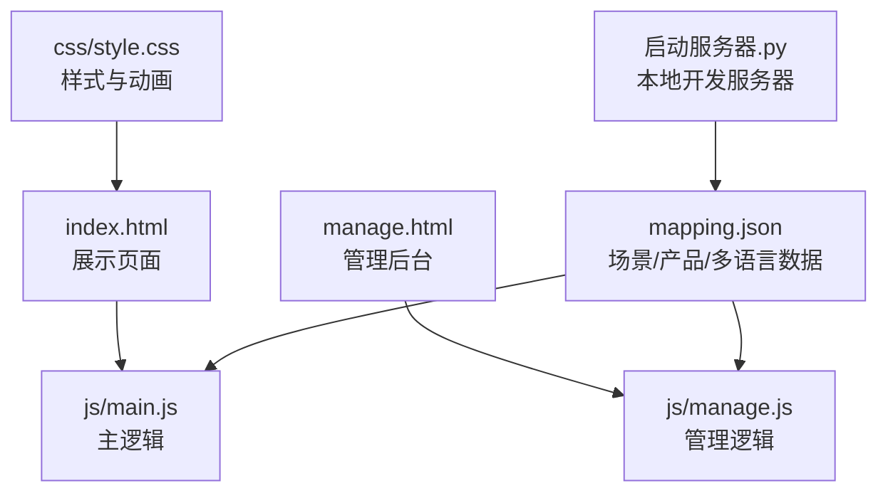
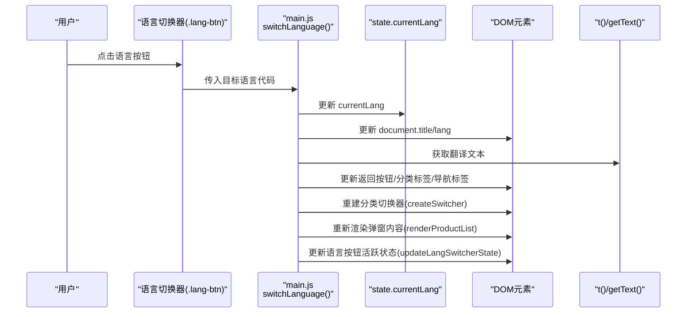
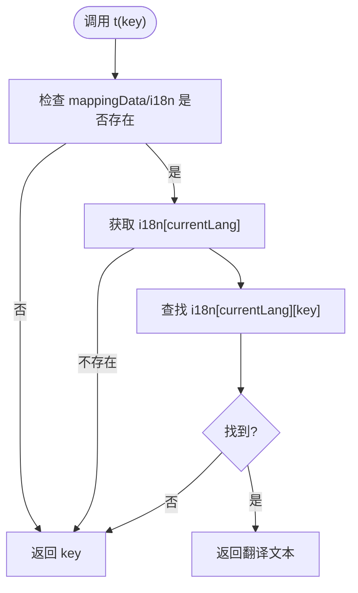
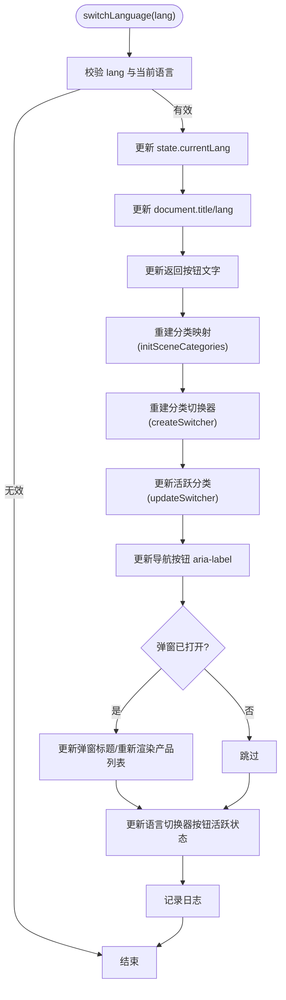
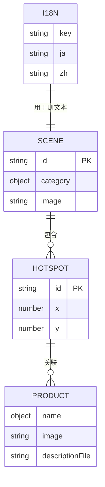
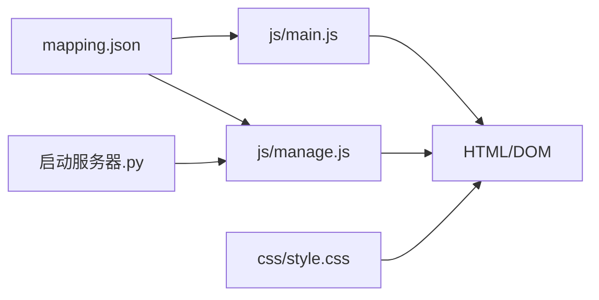

# 多语言系统

<cite>
**本文引用的文件**
- [index.html](file://index.html)
- [manage.html](file://manage.html)
- [mapping.json](file://mapping.json)
- [js/main.js](file://js/main.js)
- [js/manage.js](file://js/manage.js)
- [css/style.css](file://css/style.css)
- [启动服务器.py](file://启动服务器.py)
- [project_architecture.md](file://project_architecture.md)
</cite>

## 目录
1. [简介](#简介)
2. [项目结构](#项目结构)
3. [核心组件](#核心组件)
4. [架构总览](#架构总览)
5. [详细组件分析](#详细组件分析)
6. [依赖关系分析](#依赖关系分析)
7. [性能考量](#性能考量)
8. [故障排查指南](#故障排查指南)
9. [结论](#结论)
10. [附录](#附录)

## 简介
本项目是一个数字标牌产品展示页面，支持中日双语切换。本文档聚焦多语言系统的技术实现，包括：
- 翻译查找逻辑（t()）
- 多语言文本获取（getText()）
- 语言切换流程（switchLanguage()）
- 语言数据存储结构（mapping.json）
- 实时更新机制（DOM动态替换与界面重渲染）
- 语言优先级与回退策略
- 多语言内容维护指南与最佳实践

## 项目结构
项目采用“数据与逻辑分离”的架构，核心数据由 mapping.json 提供，前端通过 fetch 动态加载；展示页面与管理后台分别位于不同的 HTML 文件中，共享同一套多语言数据与切换逻辑。

图表来源
- [index.html:1-83](file://index.html#L1-L83)
- [manage.html:1-113](file://manage.html#L1-L113)
- [js/main.js:1197-1284](file://js/main.js#L1197-L1284)
- [js/manage.js:17-31](file://js/manage.js#L17-L31)
- [mapping.json:1-232](file://mapping.json#L1-L232)
- [css/style.css:1-200](file://css/style.css#L1-L200)
- [启动服务器.py:25-98](file://启动服务器.py#L25-L98)

章节来源
- [index.html:1-83](file://index.html#L1-L83)
- [manage.html:1-113](file://manage.html#L1-L113)
- [project_architecture.md:43-108](file://project_architecture.md#L43-L108)

## 核心组件
- 多语言引擎：提供 t()、getText()、switchLanguage() 三个核心函数，负责翻译查询、文本回退与语言切换。
- 数据源：mapping.json，包含场景、热点、产品及 i18n 字典。
- 状态管理：全局 state.currentLang 控制当前语言，配合 DOM 状态与 UI 组件实现实时更新。
- UI 组件：语言切换器、场景分类切换器、产品详情弹窗等，均在切换语言后重新渲染。

章节来源
- [js/main.js:76-162](file://js/main.js#L76-L162)
- [js/main.js:195-204](file://js/main.js#L195-L204)
- [mapping.json:205-230](file://mapping.json#L205-L230)

## 架构总览
多语言系统围绕“数据驱动 + 事件驱动”的模式构建：
- 数据驱动：mapping.json 提供多语言字典与业务数据；前端在初始化时加载并缓存。
- 事件驱动：用户点击语言切换器触发 switchLanguage()，随后更新页面标题、按钮文字、分类切换器、弹窗内容等。
- 实时更新：switchLanguage() 调用一系列更新函数，确保所有 UI 文本与多语言对象一致。

图表来源
- [js/main.js:119-162](file://js/main.js#L119-L162)
- [js/main.js:1036-1094](file://js/main.js#L1036-L1094)
- [js/main.js:87-92](file://js/main.js#L87-L92)
- [js/main.js:102-106](file://js/main.js#L102-L106)

## 详细组件分析

### 多语言引擎与翻译查找
- t(key)：从 mappingData.i18n[state.currentLang] 中获取 UI 文本，未找到时回退为 key 本身。
- getText(obj)：从多语言对象 { ja, zh } 中获取当前语言值；若为普通字符串则直接返回；若对象为空则回退到 ja 或任意值，最终为空字符串。
- 适用场景：页面标题、按钮文字、提示文本、弹窗标题与产品名称等。

图表来源
- [js/main.js:87-92](file://js/main.js#L87-L92)

章节来源
- [js/main.js:87-92](file://js/main.js#L87-L92)
- [js/main.js:102-106](file://js/main.js#L102-L106)

### 多语言文本获取与回退策略
- getText(obj) 的回退链路：obj[currentLang] → obj['ja'] → Object.values(obj)[0] → ''。
- 适用于场景分类名、产品名称等多语言对象字段。
- 保证在任一语言缺失时仍能显示有效文本，提升健壮性。

章节来源
- [js/main.js:102-106](file://js/main.js#L102-L106)
- [project_architecture.md:168-176](file://project_architecture.md#L168-L176)

### 语言切换流程（switchLanguage）
- 输入校验：目标语言与当前语言不同且存在于 i18n 中。
- 状态更新：state.currentLang = lang。
- UI 更新：
  - 更新 document.title 与 document.documentElement.lang。
  - 更新返回按钮文字（t('back')）。
  - 重建场景分类映射（initSceneCategories）与分类切换器（createSwitcher），并更新活跃分类（updateSwitcher）。
  - 更新导航按钮 aria-label（t('prevScene')/t('nextScene')）。
  - 若弹窗已打开，重新渲染弹窗标题与产品列表。
  - 更新语言切换器按钮活跃状态（updateLangSwitcherState）。

图表来源
- [js/main.js:119-162](file://js/main.js#L119-L162)
- [js/main.js:119-162](file://js/main.js#L119-L162)

章节来源
- [js/main.js:119-162](file://js/main.js#L119-L162)
- [project_architecture.md:565-580](file://project_architecture.md#L565-L580)

### 语言数据存储结构（mapping.json）
- 版本与场景：version 与 scenes 数组，每个场景包含 id、category（多语言）、image、hotspots。
- 多语言字典：i18n 对象，键为语言代码（如 ja、zh），值为键值对字典，涵盖页面标题、按钮文字、提示文本等。
- 产品与描述：hotspots 中的 products 包含 name（多语言）、image、descriptionFile（Markdown 文件路径）。

图表来源
- [mapping.json:1-232](file://mapping.json#L1-L232)

章节来源
- [mapping.json:1-232](file://mapping.json#L1-L232)
- [project_architecture.md:112-220](file://project_architecture.md#L112-L220)

### 实时更新机制（DOM 动态替换与界面重渲染）
- 页面标题与语言属性：switchLanguage() 直接更新 document.title 与 document.documentElement.lang。
- 返回按钮文字：通过 t('back') 获取翻译并更新 span 文本。
- 分类切换器：重建（createSwitcher）并更新活跃状态（updateSwitcher），使用 getText() 获取当前语言的分类名。
- 导航按钮 aria-label：使用 t('prevScene')/t('nextScene') 更新无障碍标签。
- 弹窗内容：若弹窗已打开，重新渲染标题与产品列表（renderProductList），产品名称使用 getText()，描述使用 t('loading') 占位符。
- 语言切换器按钮：根据 state.currentLang 切换 .active 类与样式。

章节来源
- [js/main.js:119-162](file://js/main.js#L119-L162)
- [js/main.js:87-92](file://js/main.js#L87-L92)
- [js/main.js:102-106](file://js/main.js#L102-L106)
- [js/main.js:1036-1094](file://js/main.js#L1036-L1094)

### 语言优先级与回退策略
- 语言优先级：switchLanguage() 更新 state.currentLang 后，后续所有 UI 文本均从此语言读取。
- getText() 回退：obj[currentLang] → obj['ja'] → Object.values(obj)[0] → ''。
- t() 回退：未找到键时直接返回 key，避免页面空白。
- 默认语言：state.currentLang 默认为 'ja'，可在初始化时调整。

章节来源
- [js/main.js:119-162](file://js/main.js#L119-L162)
- [js/main.js:102-106](file://js/main.js#L102-L106)
- [js/main.js:87-92](file://js/main.js#L87-L92)
- [js/main.js:195-204](file://js/main.js#L195-L204)

### 多语言内容维护指南
- 新增语言支持
  - 在 mapping.json 的 i18n 中新增语言键（如 ko），并在对应键下补充所有 UI 文本键。
  - 在 switchLanguage() 中加入新语言校验，确保目标语言存在。
  - 在 HTML 中为语言切换器新增按钮（如 data-lang="ko"），并在 updateLangSwitcherState() 中处理样式。
- 翻译校对
  - 使用 t('键名') 替代硬编码文本，便于统一校对。
  - 对于多语言对象（如场景分类名、产品名称），使用 getText() 获取当前语言值。
- 内容同步策略
  - 产品描述使用 Markdown 文件，通过 loadDescription() 缓存与并行加载，失败时提供可点击重试。
  - 场景与热点坐标使用百分比，切换语言不影响定位一致性。

章节来源
- [js/main.js:119-162](file://js/main.js#L119-L162)
- [js/main.js:421-442](file://js/main.js#L421-L442)
- [project_architecture.md:642-648](file://project_architecture.md#L642-L648)

### 国际化最佳实践与本地化注意事项
- 最佳实践
  - 使用 t() 与 getText() 统一管理 UI 文本与多语言对象。
  - 为所有用户可见文本提供 i18n 键，避免硬编码。
  - 对于图片与文件路径等非文本字段，保持不变，仅对文本进行多语言处理。
  - 使用 aria-label 提升无障碍体验，切换语言时同步更新。
- 本地化注意事项
  - 日文与中文在排版与字符宽度上差异较大，注意按钮与输入框的宽度适配。
  - 骨架屏与加载文案使用 t('loading')，确保多语言一致。
  - 错误提示（如 t('loadFailed')）提供可点击重试，提升用户体验。

章节来源
- [css/style.css:1-200](file://css/style.css#L1-L200)
- [js/main.js:421-442](file://js/main.js#L421-L442)
- [project_architecture.md:290-301](file://project_architecture.md#L290-L301)

## 依赖关系分析
- 数据依赖：js/main.js 与 js/manage.js 均依赖 mapping.json；管理后台还依赖本地开发服务器提供的 API。
- UI 依赖：语言切换器、分类切换器、弹窗等 UI 组件依赖 state.currentLang 与 t()/getText()。
- 样式依赖：css/style.css 定义了语言切换器与弹窗等组件的外观与动画。

图表来源
- [js/main.js:1197-1284](file://js/main.js#L1197-L1284)
- [js/manage.js:17-31](file://js/manage.js#L17-L31)
- [启动服务器.py:25-98](file://启动服务器.py#L25-L98)
- [css/style.css:1-200](file://css/style.css#L1-L200)

章节来源
- [js/main.js:1197-1284](file://js/main.js#L1197-L1284)
- [js/manage.js:17-31](file://js/manage.js#L17-L31)
- [启动服务器.py:25-98](file://启动服务器.py#L25-L98)

## 性能考量
- 首屏独占带宽：初始化时先加载首图，完成后才启动预加载，避免慢速网络下首图加载失败。
- 图片预加载：使用 Promise.all 并行预加载，减少等待时间。
- Markdown 加载：descriptionCache 缓存已加载文件，失败时返回可点击重试的提示，避免重复请求。
- 动画与渲染：使用 requestAnimationFrame 优化渲染时机，减少阻塞。

章节来源
- [js/main.js:1264-1267](file://js/main.js#L1264-L1267)
- [js/main.js:257-327](file://js/main.js#L257-L327)
- [js/main.js:421-442](file://js/main.js#L421-L442)
- [project_architecture.md:521-543](file://project_architecture.md#L521-L543)

## 故障排查指南
- mapping.json 加载失败
  - 现象：初始化阶段显示全屏错误提示。
  - 处理：检查网络与路径，确认本地服务器正常运行；查看控制台错误信息。
- 语言切换无效
  - 现象：点击语言按钮无变化。
  - 处理：确认目标语言存在于 mappingData.i18n；检查 switchLanguage() 的输入校验与 state.currentLang 更新。
- 文本未更新
  - 现象：部分按钮或标题未随语言切换而更新。
  - 处理：检查对应 DOM 更新逻辑（如返回按钮、分类切换器、导航按钮 aria-label）是否被调用。
- Markdown 加载失败
  - 现象：产品描述显示“加载失败，点击重试”。
  - 处理：点击重试后清除缓存并重新加载；检查文件路径与服务器权限。

章节来源
- [js/main.js:1197-1284](file://js/main.js#L1197-L1284)
- [js/main.js:119-162](file://js/main.js#L119-L162)
- [js/main.js:421-442](file://js/main.js#L421-L442)

## 结论
本多语言系统通过 mapping.json 统一管理多语言数据，结合 t()、getText() 与 switchLanguage() 实现了灵活、可靠的双语切换能力。其设计兼顾了性能与用户体验，提供了完善的错误处理与回退策略。遵循本文档的维护指南与最佳实践，可高效扩展新语言并保持内容一致性。

## 附录
- 术语
  - UI 文本：面向用户的界面文本，如按钮文字、提示信息等。
  - 多语言对象：包含 { ja, zh } 等键的对象，用于存储不同语言的文本。
  - 回退：当目标语言缺失时，按既定顺序寻找可用文本的过程。