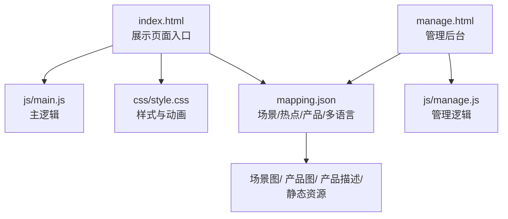
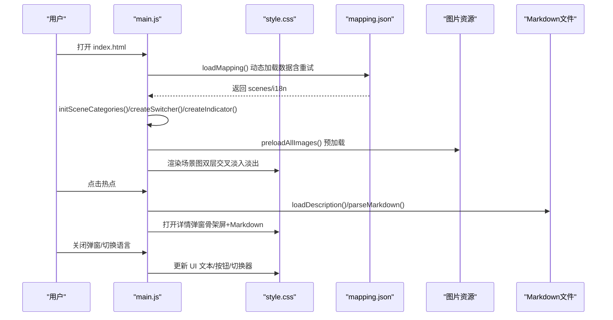
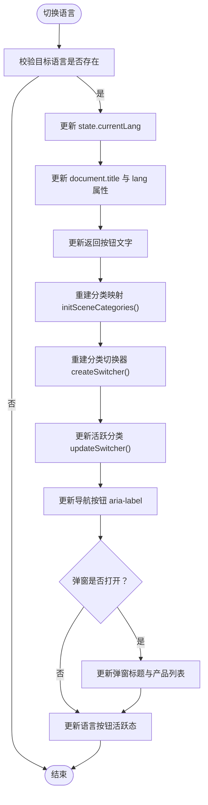
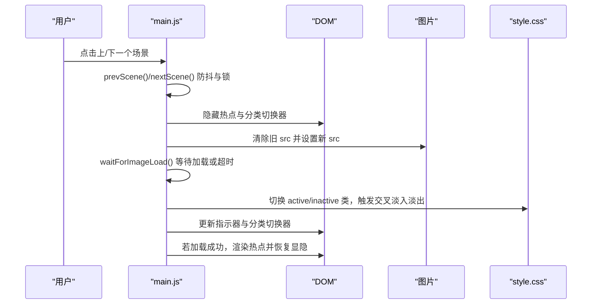
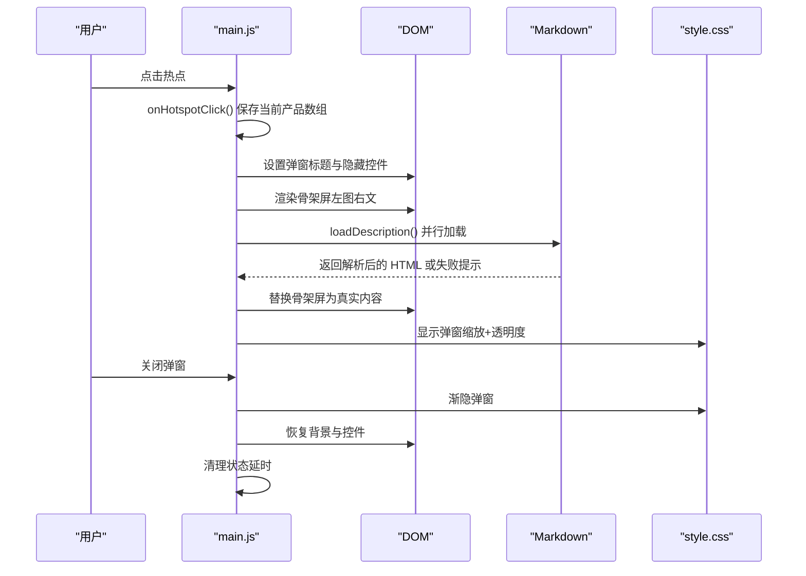
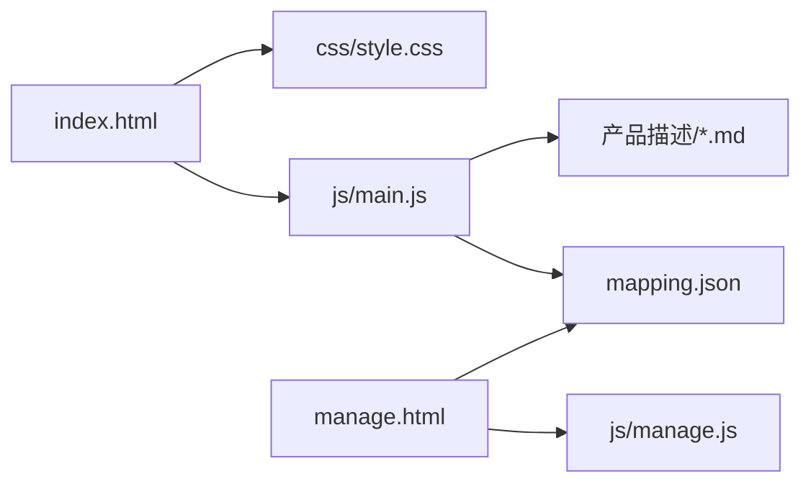

# 展示页面功能

<cite>
**本文引用的文件**   
- [index.html](file://index.html)
- [main.js](file://js/main.js)
- [style.css](file://css/style.css)
- [mapping.json](file://mapping.json)
- [project_architecture.md](file://project_architecture.md)
- [manage.html](file://manage.html)
- [manage.js](file://js/manage.js)
- [室内双面吊装标牌.md](file://产品描述/室内双面吊装标牌.md)
- [电子水牌.md](file://产品描述/电子水牌.md)
</cite>

## 目录
1. [简介](#简介)
2. [项目结构](#项目结构)
3. [核心组件](#核心组件)
4. [架构总览](#架构总览)
5. [详细组件分析](#详细组件分析)
6. [依赖分析](#依赖分析)
7. [性能考虑](#性能考虑)
8. [故障排查指南](#故障排查指南)
9. [结论](#结论)
10. [附录](#附录)

## 简介
本文件面向数字标牌产品展示页面，系统性阐述页面整体结构、HTML架构、核心交互逻辑、多语言系统、图片加载优化策略、响应式设计与性能优化建议，并提供调试与常见问题解决方案，帮助开发者高效维护与扩展展示页面。

## 项目结构
- 展示页面入口：index.html
- 样式：css/style.css
- 业务逻辑：js/main.js
- 数据配置：mapping.json（场景、热点、产品、多语言）
- 管理后台：manage.html + js/manage.js（可视化编辑场景、热点、产品）
- 产品描述：Markdown 文件（产品描述/目录下）

图表来源
- [index.html:1-83](file://index.html#L1-L83)
- [main.js:1-1284](file://js/main.js#L1-L1284)
- [style.css:1-997](file://css/style.css#L1-L997)
- [mapping.json:1-232](file://mapping.json#L1-L232)
- [manage.html:1-113](file://manage.html#L1-L113)
- [manage.js:1-811](file://js/manage.js#L1-L811)

章节来源
- [index.html:1-83](file://index.html#L1-L83)
- [project_architecture.md:43-108](file://project_architecture.md#L43-L108)

## 核心组件
- 数据加载与状态管理：从 mapping.json 动态加载场景、热点、产品与多语言配置，维护当前索引、语言、预加载缓存、过渡锁等状态。
- 多语言引擎：t()、getText()、switchLanguage()，统一管理 UI 文本与多语言回退逻辑。
- 图片系统：双层场景图交叉淡入淡出、预加载、等待加载完成、缓存检测、超时保护与失败处理。
- 热点系统：多热点渲染、像素位置计算、点击交互、弹窗详情。
- 详情弹窗：左图右文布局、Markdown 渲染、骨架屏加载、错误可重试。
- UI 控件：语言切换器、场景分类切换器、左右导航、底部指示器、遮罩层。
- Markdown 加载与解析：缓存、降级、失败提示与重试。

章节来源
- [main.js:33-73](file://js/main.js#L33-L73)
- [main.js:87-162](file://js/main.js#L87-L162)
- [main.js:257-407](file://js/main.js#L257-L407)
- [main.js:421-461](file://js/main.js#L421-L461)
- [main.js:480-595](file://js/main.js#L480-L595)
- [main.js:716-759](file://js/main.js#L716-L759)
- [main.js:873-1025](file://js/main.js#L873-L1025)
- [main.js:1028-1094](file://js/main.js#L1028-L1094)
- [main.js:1097-1277](file://js/main.js#L1097-L1277)

## 架构总览
展示页面采用“数据驱动 + 事件驱动”的纯原生 JS 架构，通过 mapping.json 驱动场景、热点、产品与多语言，使用 CSS 动画与骨架屏提升用户体验，结合预加载与等待机制保证首屏与切换流畅。

图表来源
- [main.js:49-73](file://js/main.js#L49-L73)
- [main.js:257-327](file://js/main.js#L257-L327)
- [main.js:480-595](file://js/main.js#L480-L595)
- [main.js:421-461](file://js/main.js#L421-L461)
- [style.css:106-127](file://css/style.css#L106-L127)
- [style.css:479-524](file://css/style.css#L479-L524)

## 详细组件分析

### HTML 架构与 DOM 层级
- 主容器 #app：承载所有 UI 元素。
- 语言切换器 #lang-switcher：右上角胶囊按钮，支持日文/中文切换。
- 场景容器 #scene-container：双层场景图（#scene-image-a / #scene-image-b），实现交叉淡入淡出。
- 加载指示器 #loading-indicator：网络延迟时的旋转动画反馈。
- 场景分类切换器 #scene-switcher：顶部居中标签，点击跳转至分类首个场景。
- 热点容器 #hotspot-container：动态渲染多个脉冲热点。
- 导航按钮 #btn-prev / #btn-next：左右切换场景。
- 指示器 #scene-indicator：底部圆点，点击跳转场景。
- 详情弹窗 #detail-panel：左图右文布局，包含 #detail-card、#detail-header、#product-list。
- 遮罩层 #overlay：点击关闭详情弹窗。

章节来源
- [index.html:14-77](file://index.html#L14-L77)
- [style.css:37-81](file://css/style.css#L37-L81)
- [style.css:87-127](file://css/style.css#L87-L127)
- [style.css:134-187](file://css/style.css#L134-L187)
- [style.css:288-330](file://css/style.css#L288-L330)
- [style.css:462-476](file://css/style.css#L462-L476)
- [style.css:479-524](file://css/style.css#L479-L524)
- [style.css:440-455](file://css/style.css#L440-L455)

### 多语言系统
- t(key)：从 mappingData.i18n[state.currentLang] 获取 UI 文本，未找到返回 key。
- getText(obj)：从多语言对象 { ja, zh } 获取当前语言值，支持普通字符串直接返回。
- switchLanguage(lang)：切换语言并刷新页面标题、按钮、分类切换器、弹窗标题与内容、语言按钮状态。

图表来源
- [main.js:119-162](file://js/main.js#L119-L162)
- [main.js:217-229](file://js/main.js#L217-L229)
- [main.js:135-160](file://js/main.js#L135-L160)

章节来源
- [main.js:87-162](file://js/main.js#L87-L162)
- [mapping.json:205-230](file://mapping.json#L205-L230)

### 场景切换与热点渲染
- 场景渲染：双层交叉淡入淡出，先隐藏热点与分类切换器，等待图片加载完成后再显示，避免黑屏与热点错位。
- 热点渲染：根据当前场景 hotspots 数组动态创建多个热点，计算像素位置，支持点击打开详情弹窗。
- 热点定位：calcHotspotPixelPosition() 基于 object-fit: cover 的裁剪偏移，确保热点与图片绘制区域一致。

图表来源
- [main.js:598-624](file://js/main.js#L598-L624)
- [main.js:480-595](file://js/main.js#L480-L595)
- [main.js:774-806](file://js/main.js#L774-L806)
- [style.css:106-127](file://css/style.css#L106-L127)

章节来源
- [main.js:480-595](file://js/main.js#L480-L595)
- [main.js:716-759](file://js/main.js#L716-L759)
- [main.js:774-806](file://js/main.js#L774-L806)

### 详情弹窗与产品列表
- 打开流程：设置 isDetailOpen，保存当前产品数组，渲染标题与骨架屏，Promise.all 并行加载 Markdown，失败显示可点击重试。
- 关闭流程：渐隐弹窗，恢复背景与控件，延时清理状态。
- 布局：左图右文，图片列 + 详情列，Markdown 渲染样式与表格、列表、粗体等。

图表来源
- [main.js:750-755](file://js/main.js#L750-L755)
- [main.js:873-930](file://js/main.js#L873-L930)
- [main.js:930-1025](file://js/main.js#L930-L1025)
- [style.css:479-524](file://css/style.css#L479-L524)
- [style.css:619-686](file://css/style.css#L619-L686)
- [style.css:705-788](file://css/style.css#L705-L788)

章节来源
- [main.js:873-1025](file://js/main.js#L873-L1025)
- [style.css:619-788](file://css/style.css#L619-L788)

### 图片加载优化策略
- 预加载：遍历 scenes 与 hotspots/products，去重收集路径，Promise.all 并行预加载，失败重试。
- 等待加载：waitForImageLoad() 使用 addEventListener + { once: true }，避免内存泄漏；超时保护（默认 8 秒，场景切换 15 秒）。
- 缓存检测：isImageCached() 基于预加载缓存决定是否显示加载指示器。
- 首屏策略：首屏图片加载完成后启动预加载，避免慢速网络下首屏不显示。
- 交叉淡入淡出：双层场景图，先隐藏热点与切换器，等待新图层加载完成再切换，无黑屏。

章节来源
- [main.js:257-327](file://js/main.js#L257-L327)
- [main.js:354-395](file://js/main.js#L354-L395)
- [main.js:404-406](file://js/main.js#L404-L406)
- [main.js:480-595](file://js/main.js#L480-L595)
- [style.css:106-127](file://css/style.css#L106-L127)

### Markdown 加载与渲染
- 缓存：descriptionCache 避免重复请求。
- 解析：marked.js 解析，未加载时降级为转义与换行。
- 失败处理：返回可点击重试的 HTML，绑定点击事件重新加载。
- 样式：列表、表格、粗体等 Markdown 元素的样式与 hover 效果。

章节来源
- [main.js:421-461](file://js/main.js#L421-L461)
- [style.css:705-788](file://css/style.css#L705-L788)

### 响应式设计
- 设计定位：项目文档明确“仅桌面版”，不涉及移动端响应式。
- 适配策略：通过固定宽高与绝对定位实现全屏覆盖，热点坐标使用百分比，确保在不同分辨率下相对位置一致。

章节来源
- [project_architecture.md:9-21](file://project_architecture.md#L9-L21)
- [project_architecture.md:963-965](file://project_architecture.md#L963-L965)

## 依赖分析
- 外部依赖：marked.js（CDN），用于 Markdown 解析。
- 内部依赖：index.html 依赖 main.js 与 style.css；main.js 依赖 mapping.json；管理后台依赖服务器 API。

图表来源
- [index.html:1-83](file://index.html#L1-L83)
- [main.js:1-1284](file://js/main.js#L1-L1284)
- [style.css:1-997](file://css/style.css#L1-L997)
- [mapping.json:1-232](file://mapping.json#L1-L232)
- [manage.html:1-113](file://manage.html#L1-L113)
- [manage.js:1-811](file://js/manage.js#L1-L811)

章节来源
- [index.html:10-10](file://index.html#L10-L10)
- [project_architecture.md:36-36](file://project_architecture.md#L36-L36)

## 性能考虑
- 内存管理
  - 使用 addEventListener + { once: true } 替代 onload/onerror 赋值，避免监听器累积导致内存泄漏。
  - waitForImageLoad() 返回后及时清理超时定时器。
- 事件绑定优化
  - 使用事件委托与最小化 DOM 查询，减少频繁选择器匹配。
  - 热点与弹窗开关时批量隐藏/显示控件，降低重绘重排。
- DOM 操作最佳实践
  - requestAnimationFrame 中渲染热点，避免阻塞主线程。
  - 预加载与首屏加载分离，避免慢网卡顿。
  - 骨架屏与占位符提升感知性能，减少空白等待。
- 图片与网络
  - 双层交叉淡入淡出 + 缓存检测，减少闪烁与重复下载。
  - Markdown 并行加载，失败可单独重试，不影响整体流程。

章节来源
- [main.js:354-395](file://js/main.js#L354-L395)
- [main.js:421-461](file://js/main.js#L421-L461)
- [style.css:833-863](file://css/style.css#L833-L863)

## 故障排查指南
- mapping.json 加载失败
  - 现象：全屏错误遮罩，显示“初始化失败”提示。
  - 处理：检查网络与路径，确认服务器端口（默认 8082），重试或刷新页面。
- 场景图加载失败/超时
  - 现象：加载指示器常驻或切换后无图。
  - 处理：检查图片路径是否存在于场景图目录，确认预加载缓存是否生效，适当延长等待时间。
- 热点位置偏移
  - 现象：点击热点无响应或位置错误。
  - 处理：确认图片已加载完成，热点在 requestAnimationFrame 中渲染，避免在未加载状态下计算像素位置。
- Markdown 加载失败
  - 现象：详情弹窗显示“加载失败，点击重试”。
  - 处理：点击重试按钮重新加载，或检查对应 .md 文件是否存在。
- 语言切换无效
  - 现象：点击语言按钮无变化。
  - 处理：确认 i18n 字典存在对应键，检查 switchLanguage() 调用链与按钮活跃态更新。

章节来源
- [main.js:49-73](file://js/main.js#L49-L73)
- [main.js:480-595](file://js/main.js#L480-L595)
- [main.js:774-806](file://js/main.js#L774-L806)
- [main.js:421-461](file://js/main.js#L421-L461)
- [main.js:119-162](file://js/main.js#L119-L162)

## 结论
该展示页面通过数据驱动与纯原生 JS 实现了稳定的场景切换、多语言支持、多热点交互与详情弹窗体验。配合预加载、等待机制、骨架屏与错误可重试策略，显著提升了首屏与切换性能与可用性。管理后台进一步降低了配置门槛，使非技术用户也能便捷地维护内容。

## 附录
- 产品描述示例：室内双面吊装标牌.md、电子水牌.md
- 项目架构与 API：project_architecture.md

章节来源
- [室内双面吊装标牌.md:1-13](file://产品描述/室内双面吊装标牌.md#L1-L13)
- [电子水牌.md:1-10](file://产品描述/电子水牌.md#L1-L10)
- [project_architecture.md:763-834](file://project_architecture.md#L763-L834)