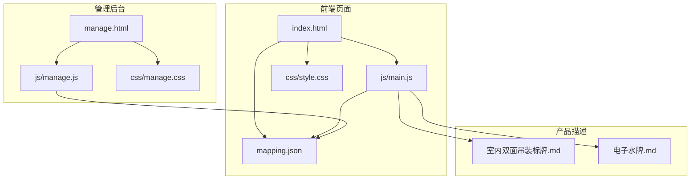
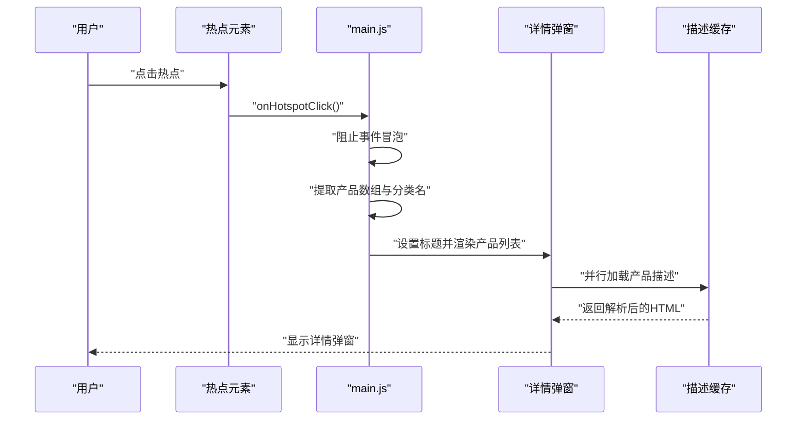
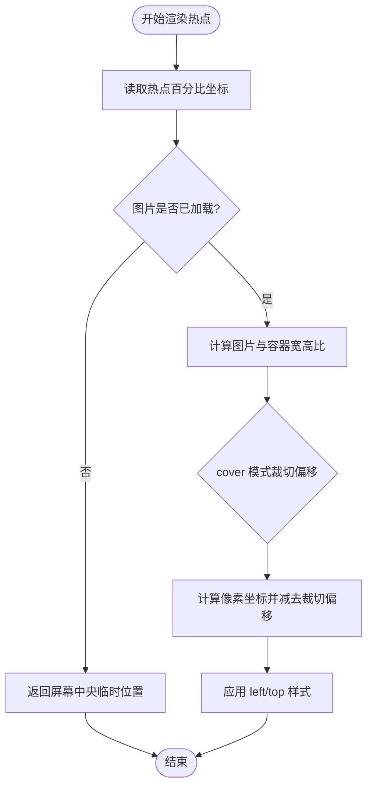
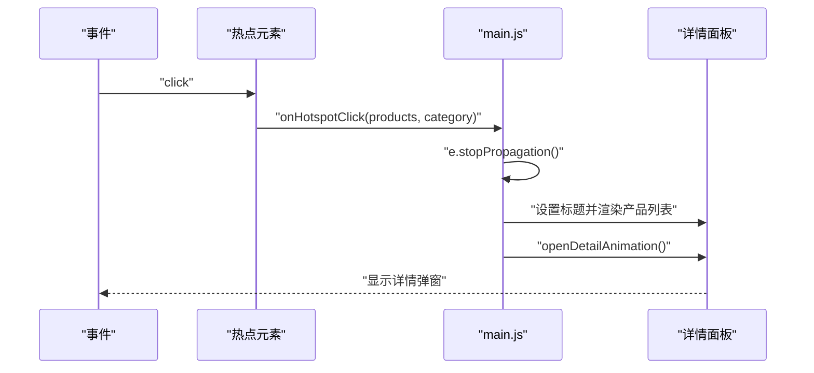
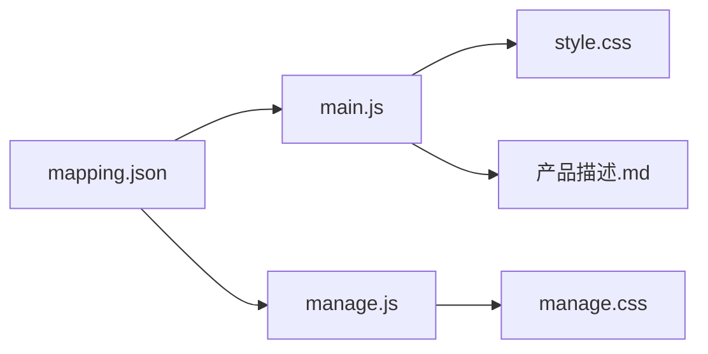

# 热点交互系统

<cite>
**本文档引用的文件**
- [index.html](file://index.html)
- [js/main.js](file://js/main.js)
- [mapping.json](file://mapping.json)
- [css/style.css](file://css/style.css)
- [manage.html](file://manage.html)
- [js/manage.js](file://js/manage.js)
- [css/manage.css](file://css/manage.css)
- [产品描述/室内双面吊装标牌.md](file://产品描述/室内双面吊装标牌.md)
- [产品描述/电子水牌.md](file://产品描述/电子水牌.md)
</cite>

## 目录
1. [简介](#简介)
2. [项目结构](#项目结构)
3. [核心组件](#核心组件)
4. [架构总览](#架构总览)
5. [详细组件分析](#详细组件分析)
6. [依赖关系分析](#依赖关系分析)
7. [性能考虑](#性能考虑)
8. [故障排除指南](#故障排除指南)
9. [结论](#结论)
10. [附录](#附录)

## 简介
本系统是一个基于 Web 的数字标牌产品介绍页面，采用“脉冲热点”交互方式引导用户探索场景中的产品信息。系统通过百分比坐标系定义热点位置，结合 CSS 动画实现脉冲视觉反馈，并在点击后以弹窗形式展示产品详情。系统还提供管理后台，允许运营人员可视化地编辑场景、热点和产品信息。

## 项目结构
系统主要由前端页面、样式表、数据映射文件和管理后台组成：
- 前端页面：index.html + js/main.js + css/style.css
- 数据映射：mapping.json
- 管理后台：manage.html + js/manage.js + css/manage.css
- 产品描述：Markdown 文件（产品描述目录）

**图表来源**
- [index.html](file://index.html)
- [js/main.js](file://js/main.js)
- [css/style.css](file://css/style.css)
- [mapping.json](file://mapping.json)
- [manage.html](file://manage.html)
- [js/manage.js](file://js/manage.js)
- [css/manage.css](file://css/manage.css)
- [产品描述/室内双面吊装标牌.md](file://产品描述/室内双面吊装标牌.md)
- [产品描述/电子水牌.md](file://产品描述/电子水牌.md)

**章节来源**
- [index.html:1-83](file://index.html#L1-L83)
- [js/main.js:1-1284](file://js/main.js#L1-L1284)
- [css/style.css:1-997](file://css/style.css#L1-L997)
- [mapping.json:1-232](file://mapping.json#L1-L232)
- [manage.html:1-113](file://manage.html#L1-L113)
- [js/manage.js:1-811](file://js/manage.js#L1-L811)
- [css/manage.css:1-824](file://css/manage.css#L1-L824)

## 核心组件
- 热点容器与脉冲动画：通过 CSS 动画实现脉冲波纹与中心点的循环动画，配合 JavaScript 在场景切换和窗口调整时重新定位热点。
- 百分比坐标系统：热点位置以百分比存储，运行时根据当前场景图片的 object-fit: cover 计算像素坐标，确保在不同分辨率下的精确对齐。
- 点击事件处理：捕获热点点击，阻止事件冒泡，提取产品信息并触发详情弹窗动画。
- 动态渲染机制：在渲染场景的同时异步加载产品描述，采用骨架屏与并行加载提升体验。
- 管理后台：可视化编辑场景、热点与产品信息，支持拖拽定位、批量操作与实时保存。

**章节来源**
- [js/main.js:706-847](file://js/main.js#L706-L847)
- [js/main.js:849-1025](file://js/main.js#L849-L1025)
- [css/style.css:284-434](file://css/style.css#L284-L434)
- [mapping.json:1-232](file://mapping.json#L1-L232)

## 架构总览
系统采用“数据驱动 + 视觉反馈”的交互模式：
- 数据层：mapping.json 存储场景、热点与产品信息。
- 渲染层：main.js 负责场景渲染、热点定位、动画控制与事件绑定；manage.js 负责管理界面的数据编辑与保存。
- 视觉层：style.css 定义脉冲动画、弹窗样式与整体 UI；manage.css 定义管理后台的三栏布局与控件样式。
- 交互层：用户通过点击热点进入详情弹窗，支持键盘与鼠标操作。

**图表来源**
- [js/main.js:849-870](file://js/main.js#L849-L870)
- [js/main.js:877-956](file://js/main.js#L877-L956)
- [css/style.css:458-525](file://css/style.css#L458-L525)

**章节来源**
- [js/main.js:1180-1281](file://js/main.js#L1180-L1281)
- [css/style.css:458-525](file://css/style.css#L458-L525)

## 详细组件分析

### 脉冲热点实现原理
- 结构组成：每个热点包含一个中心点与两层波纹环，通过 CSS 动画实现脉冲扩散与中心点呼吸效果。
- 动画策略：中心点与波纹环分别设置不同的动画延迟，形成错峰脉冲，增强视觉层次。
- 定位算法：calcHotspotPixelPosition 将百分比坐标转换为像素坐标，考虑 object-fit: cover 的裁切偏移，保证在不同宽高比下的精准定位。
- 重新定位：窗口 resize 时通过 repositionHotspots 防抖更新热点位置，避免频繁计算影响性能。

**图表来源**
- [js/main.js:762-817](file://js/main.js#L762-L817)
- [css/style.css:284-434](file://css/style.css#L284-L434)

**章节来源**
- [js/main.js:706-759](file://js/main.js#L706-L759)
- [js/main.js:762-847](file://js/main.js#L762-L847)
- [css/style.css:284-434](file://css/style.css#L284-L434)

### 定时器管理与视觉反馈
- 出现动画：热点元素使用 CSS 动画在渲染时淡入并缩放，nth-child 选择器为多个热点分配不同的动画延迟，避免同步闪烁。
- 脉冲动画：中心点与波纹环分别设置不同的动画时序，形成柔和的脉冲效果。
- 交互反馈：hover 状态下暂停动画并增强发光效果，提升触控反馈。
- 窗口调整：resize 事件采用防抖（200ms）减少重排压力。

**章节来源**
- [css/style.css:319-433](file://css/style.css#L319-L433)
- [js/main.js:1139-1148](file://js/main.js#L1139-L1148)

### 热点坐标计算与转换系统
- 百分比坐标：热点在 mapping.json 中以百分比存储，便于跨分辨率适配。
- 裁切偏移：object-fit: cover 模式下，图片可能被上下或左右裁切，系统根据容器与图片宽高比计算偏移量。
- 像素转换：将百分比坐标乘以渲染宽度/高度，再减去裁切偏移得到最终像素位置。
- 响应式适配：窗口变化时重新计算，确保热点始终与场景图像对齐。

**章节来源**
- [js/main.js:762-817](file://js/main.js#L762-L817)
- [mapping.json:1-232](file://mapping.json#L1-L232)

### 热点点击事件处理流程
- 事件捕获：热点元素绑定 click 事件，阻止冒泡以避免触发容器级事件。
- 数据提取：从热点数据中读取关联的产品数组与场景分类名。
- 弹窗触发：设置详情标题，渲染产品列表，执行打开动画。
- 动画序列：背景变暗、遮罩显示、隐藏导航与热点、延时显示弹窗卡片。

**图表来源**
- [js/main.js:849-870](file://js/main.js#L849-L870)
- [js/main.js:958-987](file://js/main.js#L958-L987)

**章节来源**
- [js/main.js:849-870](file://js/main.js#L849-L870)
- [js/main.js:958-1025](file://js/main.js#L958-L1025)

### 热点容器动态渲染机制
- DOM 创建：遍历热点数组，为每个热点创建容器元素，包含中心点与波纹环。
- 样式应用：设置绝对定位与 transform: translate(-50%, -50%)，确保中心对齐。
- 事件绑定：为每个热点绑定点击事件，传递产品数组与分类名。
- 延迟动画：通过 nth-child 为多个热点分配不同的动画延迟，营造错峰脉冲效果。

**章节来源**
- [js/main.js:706-759](file://js/main.js#L706-L759)
- [css/style.css:312-318](file://css/style.css#L312-L318)

### 用户体验优化策略
- 触摸友好：热点尺寸与间距经过优化，确保在移动端可轻松点击。
- 视觉引导：脉冲动画与 hover 发光效果提供明确的交互提示。
- 加载体验：详情弹窗采用骨架屏与并行加载，缩短首屏等待时间。
- 键盘支持：支持左右箭头切换场景，Esc 关闭详情弹窗。
- 多语言：支持日文与中文切换，标题与提示文本随语言变化。

**章节来源**
- [js/main.js:1028-1094](file://js/main.js#L1028-L1094)
- [js/main.js:1115-1130](file://js/main.js#L1115-L1130)
- [css/style.css:284-434](file://css/style.css#L284-L434)

## 依赖关系分析
- 数据依赖：前端页面依赖 mapping.json 提供的场景、热点与产品数据。
- 样式依赖：脉冲动画与弹窗样式由 style.css 定义，管理后台样式由 manage.css 定义。
- 事件依赖：热点点击事件依赖 DOM 结构与事件绑定逻辑。
- 描述依赖：详情弹窗中的产品描述来自 Markdown 文件，通过缓存与并行加载优化性能。

**图表来源**
- [mapping.json:1-232](file://mapping.json#L1-L232)
- [js/main.js:1-1284](file://js/main.js#L1-L1284)
- [js/manage.js:1-811](file://js/manage.js#L1-L811)
- [css/style.css:1-997](file://css/style.css#L1-L997)
- [css/manage.css:1-824](file://css/manage.css#L1-L824)

**章节来源**
- [js/main.js:1-1284](file://js/main.js#L1-L1284)
- [js/manage.js:1-811](file://js/manage.js#L1-L811)

## 性能考虑
- 图片加载策略：首屏独占带宽，确保首个场景图片优先显示，随后再进行后台预加载，避免带宽竞争导致首图超时。
- 并行加载：详情弹窗中的产品描述采用 Promise.all 并行加载，显著缩短加载时间。
- 防抖与节流：窗口 resize 事件使用 200ms 防抖，减少重排与重绘频率。
- 动画优化：使用 transform 与 opacity 控制动画，避免强制同步布局；nth-child 动画延迟分散，降低视觉冲突。
- 缓存机制：图片与描述文件均采用缓存，避免重复请求。

**章节来源**
- [js/main.js:1197-1281](file://js/main.js#L1197-L1281)
- [js/main.js:877-956](file://js/main.js#L877-L956)
- [js/main.js:1139-1148](file://js/main.js#L1139-L1148)
- [css/style.css:319-433](file://css/style.css#L319-L433)

## 故障排除指南
- 热点位置异常：检查场景图片是否已加载完成，未加载时计算会返回屏幕中央位置；确保百分比坐标在 0-100 范围内。
- 点击无效：确认事件冒泡已被阻止，且热点元素的 pointer-events 与 z-index 设置正确。
- 弹窗不显示：检查 isDetailOpen 状态与 DOM 类名切换逻辑，确认遮罩与面板的可见性状态。
- 图片加载失败：查看控制台错误信息，确认图片路径正确；利用重试机制与缓存清理功能进行排查。
- 管理后台无法保存：检查 /api/save-mapping 接口返回状态，确认服务器端路由与权限配置。

**章节来源**
- [js/main.js:849-1025](file://js/main.js#L849-L1025)
- [js/main.js:1197-1281](file://js/main.js#L1197-L1281)
- [js/manage.js:81-108](file://js/manage.js#L81-L108)

## 结论
本系统通过“脉冲热点 + 百分比坐标 + CSS 动画 + 弹窗详情”的组合，实现了直观、流畅且可扩展的交互体验。其核心优势在于：
- 坐标系统与动画机制确保了在不同设备与分辨率下的稳定表现；
- 动态渲染与并行加载提升了首屏体验；
- 管理后台提供了可视化的编辑能力，便于运营维护。

## 附录
- 产品描述文件示例：室内双面吊装标牌.md、电子水牌.md，用于详情弹窗中的内容展示。
- 管理后台功能：场景增删改、热点拖拽定位、产品关联编辑、实时保存与提示反馈。

**章节来源**
- [产品描述/室内双面吊装标牌.md:1-13](file://产品描述/室内双面吊装标牌.md#L1-L13)
- [产品描述/电子水牌.md:1-10](file://产品描述/电子水牌.md#L1-L10)
- [js/manage.js:18-31](file://js/manage.js#L18-L31)