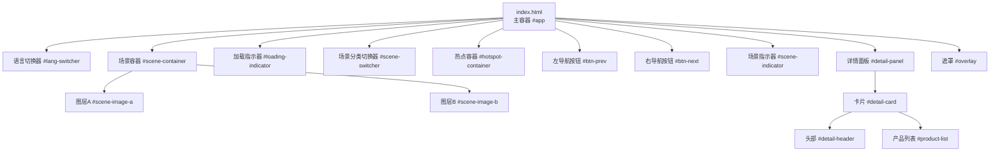
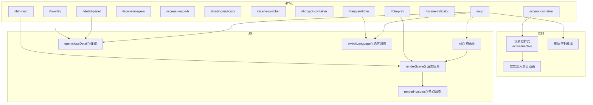
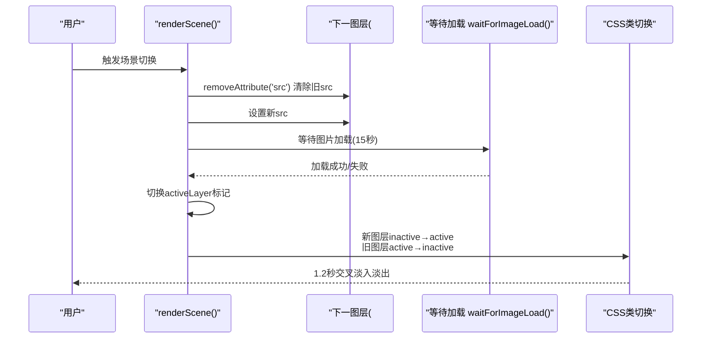
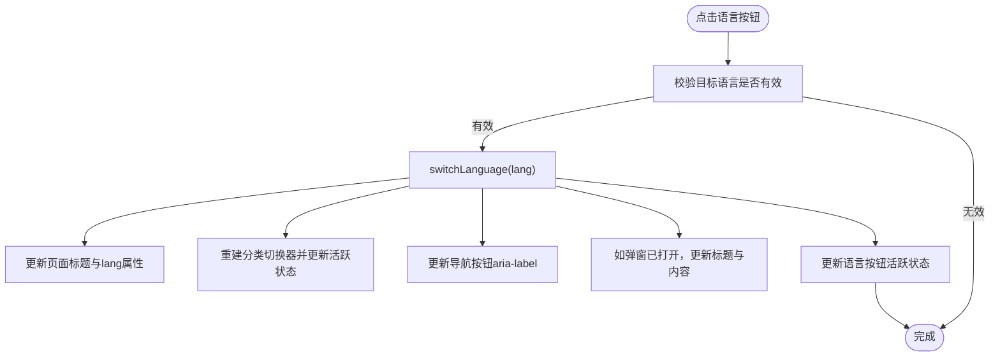
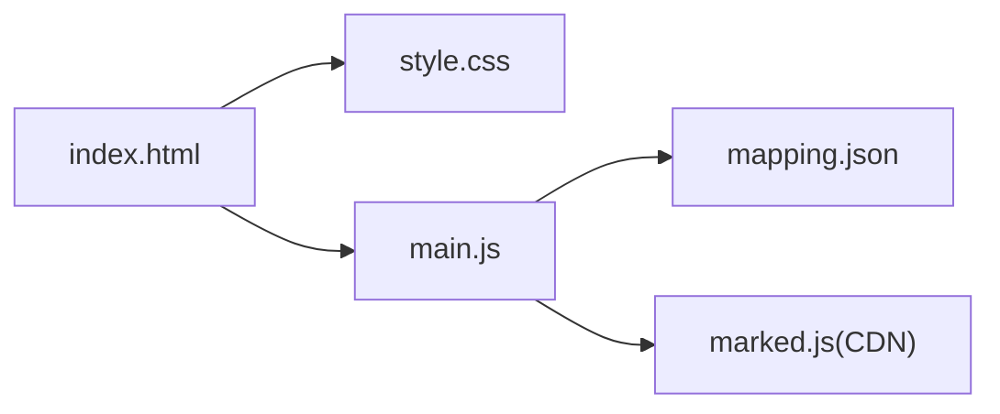

# 页面架构与结构

<cite>
**本文引用的文件**
- [index.html](file://index.html)
- [style.css](file://css/style.css)
- [main.js](file://js/main.js)
- [mapping.json](file://mapping.json)
- [project_architecture.md](file://project_architecture.md)
</cite>

## 目录
1. [简介](#简介)
2. [项目结构](#项目结构)
3. [核心组件](#核心组件)
4. [架构总览](#架构总览)
5. [详细组件分析](#详细组件分析)
6. [依赖分析](#依赖分析)
7. [性能考量](#性能考量)
8. [故障排查指南](#故障排查指南)
9. [结论](#结论)
10. [附录](#附录)

## 简介
本文件聚焦数字标牌展示页面的HTML架构与结构设计，围绕index.html中的DOM元素展开，系统阐述：
- app容器、场景图像层、语言切换器、导航按钮等核心组件的层级关系与职责
- 两层场景图像实现交叉淡入淡出的HTML结构原理
- 响应式设计的HTML基础（viewport设置与移动端适配）
- 语义化HTML与无障碍访问（如aria-label）的实践
- HTML结构最佳实践与可访问性指南

## 项目结构
index.html是展示页面的入口，配合CSS与JavaScript实现完整的交互体验。其核心结构如下：
- 主容器app承载所有UI元素
- 场景图像层（双层）实现无黑屏交叉淡入淡出
- 语言切换器（右上角）
- 导航按钮（左右）
- 场景指示器（底部圆点）
- 热点容器（脉冲热点）
- 产品详情弹窗（左图右文布局）
- 背景遮罩（点击关闭弹窗）

图表来源
- [index.html:14-77](file://index.html#L14-L77)

章节来源
- [index.html:12-82](file://index.html#L12-L82)
- [project_architecture.md:257-301](file://project_architecture.md#L257-L301)

## 核心组件
- app容器：承载所有UI元素，作为绝对定位的根容器，宽高100%，溢出隐藏。
- 场景图像层：双层img元素（scene-image-a、scene-image-b），通过CSS类active/inactive控制透明度，实现交叉淡入淡出。
- 语言切换器：右上角固定，包含日文/中文两个按钮，支持动态创建与状态切换。
- 导航按钮：左右箭头按钮，使用SVG图标，配合aria-label提升无障碍性。
- 场景指示器：底部居中圆点，动态生成，点击跳转对应场景。
- 热点容器：动态渲染多个脉冲热点，支持点击进入产品详情。
- 详情面板：居中弹窗，左图右文布局，支持滚动与Markdown渲染。
- 遮罩：点击关闭详情面板。

章节来源
- [index.html:14-77](file://index.html#L14-L77)
- [style.css:24-127](file://css/style.css#L24-L127)
- [main.js:169-188](file://js/main.js#L169-L188)

## 架构总览
HTML结构与CSS/JS的协作关系如下：
- HTML定义结构与语义，CSS提供视觉样式与动画，JS负责数据驱动与交互逻辑。
- 双层场景图通过active/inactive类在CSS中实现1.2秒交叉淡入淡出。
- 语言切换器与导航按钮通过aria-label提供无障碍支持。
- 详情面板采用毛玻璃背景与弹性缩放动画，提升用户体验。

图表来源
- [index.html:14-77](file://index.html#L14-L77)
- [style.css:86-127](file://css/style.css#L86-L127)
- [main.js:1197-1281](file://js/main.js#L1197-L1281)

## 详细组件分析

### 场景图像层与交叉淡入淡出
- 结构：两个img元素位于#scene-container内，初始类为inactive，通过active/inactive切换实现交叉淡入淡出。
- 逻辑：渲染场景时，先设置下一图层的src，等待图片加载完成，再切换activeLayer标记，最后切换CSS类，触发1.2秒过渡。
- 优势：无黑屏，加载失败/超时也不渲染热点，避免“黑屏上出现孤立热点”。

图表来源
- [main.js:480-595](file://js/main.js#L480-L595)
- [style.css:106-127](file://css/style.css#L106-L127)

章节来源
- [main.js:480-595](file://js/main.js#L480-L595)
- [style.css:86-127](file://css/style.css#L86-L127)

### 语言切换器与无障碍支持
- 结构：#lang-switcher包含两个按钮，分别对应日文/中文，使用data-lang标识语言代码。
- 交互：点击按钮调用switchLanguage()，更新页面标题、按钮文字、分类切换器与弹窗内容，并更新按钮活跃状态。
- 无障碍：导航按钮使用aria-label，详情返回按钮也具备aria-label，便于屏幕阅读器识别。

图表来源
- [main.js:119-162](file://js/main.js#L119-L162)
- [index.html:40-44](file://index.html#L40-L51)

章节来源
- [main.js:119-162](file://js/main.js#L119-L162)
- [index.html:17-20](file://index.html#L17-L20)
- [index.html:40-51](file://index.html#L40-L51)

### 导航按钮与场景指示器
- 导航按钮：左右箭头按钮，使用SVG图标，hover/active状态增强交互反馈。
- 场景指示器：底部圆点，动态生成，点击跳转至对应场景，hover放大并发光。
- 事件绑定：键盘方向键支持左右切换，Esc键关闭详情面板。

章节来源
- [style.css:194-237](file://css/style.css#L194-L237)
- [style.css:244-281](file://css/style.css#L244-L281)
- [main.js:1104-1149](file://js/main.js#L1104-L1149)

### 热点容器与脉冲动画
- 结构：#hotspot-container动态渲染多个热点，每个热点包含中心点与两层波纹环。
- 动画：核心点pulse与波纹impact循环动画，多热点之间通过nth-child分散延迟，营造层次感。
- 交互：点击热点进入详情面板，显示该热点关联的所有产品。

章节来源
- [style.css:287-433](file://css/style.css#L287-L433)
- [main.js:716-759](file://js/main.js#L716-L759)

### 详情面板与左图右文布局
- 结构：#detail-panel居中显示，#detail-card包含头部与产品列表。
- 布局：.product-item采用flex布局，左侧图片列，右侧详情列，偶数项背景略有差异。
- Markdown渲染：使用marked.js解析，失败时显示可点击重试提示。
- 动画：打开时背景淡化、遮罩淡入、面板缩放出现；关闭时逆向过程。

章节来源
- [style.css:461-524](file://css/style.css#L461-L524)
- [style.css:618-669](file://css/style.css#L618-L669)
- [main.js:888-1025](file://js/main.js#L888-L1025)

### 加载指示器与骨架屏
- 加载指示器：#loading-indicator在图片加载期间显示旋转动画，加载完成后隐藏。
- 骨架屏：.desc-loading与.skeleton-line提供加载占位符，提升感知速度。
- 错误处理：.desc-load-failed可点击重试，失败后仍可再次绑定重试事件。

章节来源
- [style.css:794-826](file://css/style.css#L794-L826)
- [style.css:832-863](file://css/style.css#L832-L863)
- [style.css:936-950](file://css/style.css#L936-L950)
- [main.js:933-955](file://js/main.js#L933-L955)

## 依赖分析
- HTML依赖CSS与JS：
  - CSS提供场景层、按钮、指示器、热点、面板、遮罩等样式与动画。
  - JS负责数据加载、状态管理、场景渲染、热点定位、弹窗动画、语言切换与事件绑定。
- 数据依赖：
  - mapping.json提供场景、热点、产品与多语言配置，JS通过fetch加载并驱动UI。
- 外部资源：
  - marked.js用于Markdown解析，CDN引入。

图表来源
- [index.html:8-10](file://index.html#L8-L10)
- [main.js:49-73](file://js/main.js#L49-L73)
- [mapping.json:1-232](file://mapping.json#L1-L232)

章节来源
- [index.html:8-10](file://index.html#L8-L10)
- [main.js:49-73](file://js/main.js#L49-L73)
- [mapping.json:1-232](file://mapping.json#L1-L232)

## 性能考量
- 首屏独占带宽策略：首图加载完成后才启动后台预加载，避免慢速网络下首图超时。
- 图片预加载：遍历所有场景图与产品图，使用Image对象预加载并缓存，减少切换时延。
- 加载等待：waitForImageLoad提供超时保护（默认8秒，场景切换15秒，首图30秒），避免长时间阻塞。
- 防抖与状态锁：窗口resize与场景切换使用防抖与状态锁，降低重排与重绘频率。
- 动画优化：交叉淡入淡出使用CSS transition，热点动画使用animation，避免强制同步布局。

章节来源
- [main.js:257-327](file://js/main.js#L257-L327)
- [main.js:354-395](file://js/main.js#L354-L395)
- [main.js:1139-1148](file://js/main.js#L1139-L1148)
- [main.js:599-624](file://js/main.js#L599-L624)

## 故障排查指南
- mapping.json加载失败：
  - 现象：全屏错误提示，页面无法初始化。
  - 处理：检查网络与服务器状态，确认路径正确；重试按钮可再次触发初始化。
- 场景图片加载失败/超时：
  - 现象：场景不切换或仅显示分类切换器。
  - 处理：检查图片路径与CDN可用性；确认预加载缓存；必要时刷新页面。
- 热点位置不准确：
  - 现象：热点偏移或不显示。
  - 处理：确认图片已加载完成；窗口resize后会自动重新定位；检查calcHotspotPixelPosition逻辑。
- 详情面板无法关闭：
  - 现象：面板不消失或遮罩不消失。
  - 处理：检查closeDetail流程与状态清理；确认遮罩点击事件绑定。

章节来源
- [main.js:1173-1178](file://js/main.js#L1173-L1178)
- [main.js:514-555](file://js/main.js#L514-L555)
- [main.js:826-847](file://js/main.js#L826-L847)
- [main.js:992-1025](file://js/main.js#L992-L1025)

## 结论
index.html通过清晰的层级结构与语义化标签，结合CSS动画与JS交互逻辑，实现了流畅的场景浏览体验。双层场景图的交叉淡入淡出、脉冲热点的层次动画、详情面板的左图右文布局，共同构成了现代数字标牌展示页面的典型架构。配合响应式设计与无障碍支持，满足多终端与多语言需求。

## 附录

### 响应式设计与移动端适配
- viewport设置：通过<meta name="viewport">确保移动端缩放与布局正确。
- object-fit: cover：场景图铺满容器，通过裁剪偏移计算热点坐标，保证跨设备一致性。
- 毛玻璃与阴影：backdrop-filter与box-shadow在移动端保持良好可读性与层次感。

章节来源
- [index.html:5](file://index.html#L5)
- [style.css:106-115](file://css/style.css#L106-L115)
- [main.js:774-817](file://js/main.js#L774-L817)

### 语义化HTML与无障碍访问
- 语义化标签：使用button、div、h2、span等，明确结构与角色。
- aria-label：导航按钮与返回按钮提供可读的无障碍标签，便于屏幕阅读器朗读。
- 可访问性建议：为所有可交互元素提供明确的焦点顺序与键盘支持；为图片提供alt文本；为表单控件提供label。

章节来源
- [index.html:40-67](file://index.html#L40-L67)
- [main.js:140-142](file://js/main.js#L140-L142)

### HTML结构最佳实践
- 结构清晰：容器与子元素职责单一，避免深层嵌套。
- 可扩展性：通过CSS类与JS状态管理解耦，便于后续功能扩展。
- 可维护性：数据与逻辑分离（mapping.json + main.js），降低硬编码风险。
- 性能优先：首屏独占带宽、图片预加载、防抖与状态锁，保障流畅体验。

章节来源
- [project_architecture.md:112-176](file://project_architecture.md#L112-L176)
- [main.js:1197-1281](file://js/main.js#L1197-L1281)