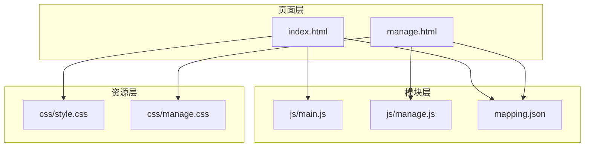
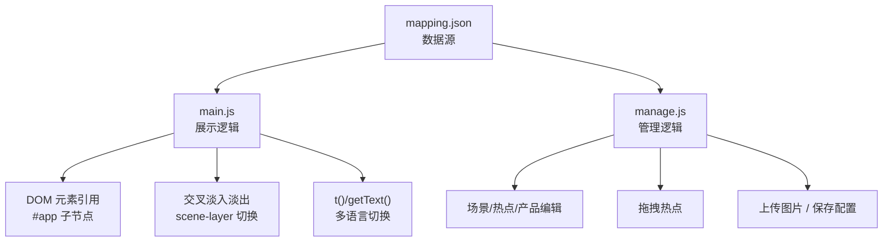
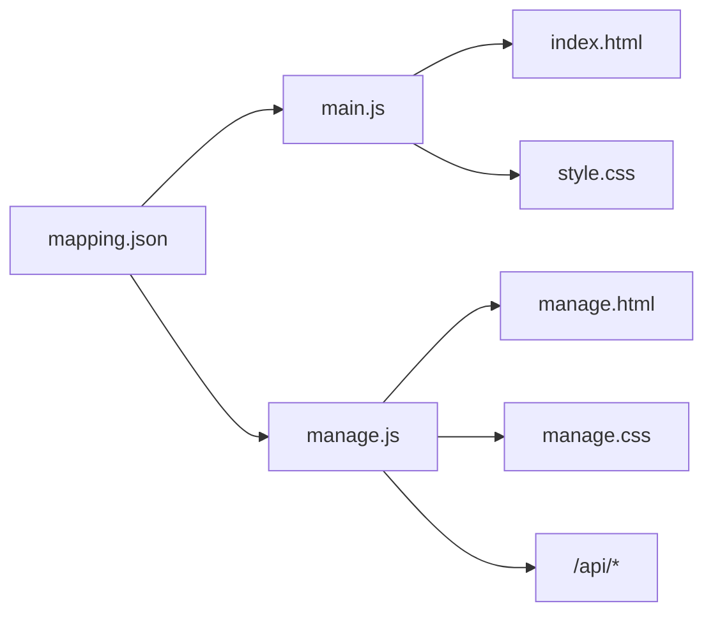

# 代码规范

<cite>
**本文档引用的文件**
- [index.html](file://index.html)
- [manage.html](file://manage.html)
- [style.css](file://css/style.css)
- [manage.css](file://css/manage.css)
- [main.js](file://js/main.js)
- [manage.js](file://js/manage.js)
- [mapping.json](file://mapping.json)
</cite>

## 目录
1. [简介](#简介)
2. [项目结构](#项目结构)
3. [核心组件](#核心组件)
4. [架构总览](#架构总览)
5. [详细组件分析](#详细组件分析)
6. [依赖关系分析](#依赖关系分析)
7. [性能考虑](#性能考虑)
8. [故障排查指南](#故障排查指南)
9. [结论](#结论)
10. [附录](#附录)

## 简介
本规范面向“数字标牌产品展示”项目，旨在统一前端代码风格与实现质量，确保 main.js 与 manage.js 的一致性、可维护性与可扩展性；同时明确 CSS 与 HTML 的编写标准，以及代码格式化与质量检查流程，帮助团队建立一致的开发与评审标准。

## 项目结构
项目采用“页面-模块-资源”三层组织方式：
- 页面层：index.html、manage.html
- 模块层：js/*.js（业务逻辑）
- 资源层：css/*.css、mapping.json、静态媒体资源

图表来源
- [index.html](file://index.html)
- [manage.html](file://manage.html)
- [main.js](file://js/main.js)
- [manage.js](file://js/manage.js)
- [style.css](file://css/style.css)
- [manage.css](file://css/manage.css)
- [mapping.json](file://mapping.json)

章节来源
- [index.html](file://index.html)
- [manage.html](file://manage.html)
- [style.css](file://css/style.css)
- [manage.css](file://css/manage.css)
- [main.js](file://js/main.js)
- [manage.js](file://js/manage.js)
- [mapping.json](file://mapping.json)

## 核心组件
- 数据层：mapping.json 提供场景、热点、产品与多语言文案
- 视图层：index.html 与 manage.html 定义页面骨架与容器
- 样式层：style.css 与 manage.css 提供视觉与交互样式
- 逻辑层：main.js（展示页）、manage.js（管理页）负责状态、渲染与交互

章节来源
- [mapping.json](file://mapping.json)
- [index.html](file://index.html)
- [manage.html](file://manage.html)
- [style.css](file://css/style.css)
- [manage.css](file://css/manage.css)
- [main.js](file://js/main.js)
- [manage.js](file://js/manage.js)

## 架构总览
整体采用“数据驱动 + 事件驱动”的前端架构：
- 数据来源：mapping.json（动态加载）
- 展示页：main.js 负责场景切换、热点渲染、详情面板、国际化
- 管理页：manage.js 负责场景/热点/产品编辑、拖拽、上传、保存

图表来源
- [main.js](file://js/main.js)
- [manage.js](file://js/manage.js)
- [mapping.json](file://mapping.json)

## 详细组件分析

### JavaScript 编码规范（ES6+）
- 语法与模块化
  - 使用 ES6+ 语法（const/let、解构、模板字符串、箭头函数、async/await、类/模块导入导出等）
  - 严格模式：在模块顶部声明 use strict（如适用）
  - 命名：变量与函数使用小驼峰；常量使用大写下划线；类名首字母大写
  - 文件命名：模块文件使用小写短横线或驼峰，如 main.js、manage.js
- 变量与作用域
  - 优先使用 const/let，避免 var
  - 函数内部局部变量集中声明，减少跨作用域污染
  - 避免全局变量污染，必要时通过命名空间或模块导出
- 函数组织
  - 单一职责：每个函数只做一件事
  - 参数控制：尽量不超过 3-4 个参数；复杂参数使用对象解构
  - 返回值：明确返回类型；错误使用异常或显式错误对象
  - 异步：统一使用 async/await，避免回调地狱；对网络请求设置超时与重试
- 注释规范
  - 文件头注释：简述模块功能、版本、作者、变更记录
  - 函数注释：参数、返回值、异常、复杂逻辑说明
  - 行内注释：关键步骤、边界条件、性能注意点
- 错误处理
  - fetch 请求：统一 try/catch，区分网络错误与业务错误
  - 图片加载：使用 Promise 包装，设置超时与失败回退
  - UI 反馈：Toast、提示文本、重试按钮
- 性能与健壮性
  - 防抖/节流：高频事件（窗口 resize、拖拽）使用防抖
  - 跨域与缓存：合理利用浏览器缓存与预加载
  - DOM 操作：批量更新、requestAnimationFrame 优化重绘

章节来源
- [main.js](file://js/main.js)
- [manage.js](file://js/manage.js)

### main.js 规范要点
- 数据加载与重试
  - loadMapping：最多重试 3 次，递增延迟；失败抛错交由调用方处理
- 多语言引擎
  - t()：从 mappingData.i18n[currentLang] 获取翻译
  - getText()：从多语言对象取当前语言值，支持回退
  - switchLanguage：更新页面标题、按钮、分类切换器、弹窗内容与语言切换器状态
- DOM 与状态
  - dom：集中管理页面元素引用
  - state：currentIndex、isTransitioning、isDetailOpen、currentHotspot、activeLayer、preloadedImages、currentLang、currentProducts
- 图片预加载与加载等待
  - preloadAllImages：收集场景图与产品图，去重并发预加载，失败重试
  - waitForImageLoad：基于 addEventListener + { once: true }，带超时保护
  - isImageCached/isImagePreloaded：缓存命中判断
- Markdown 解析
  - loadDescription：缓存命中直接返回；失败返回可点击重试的 HTML
  - parseMarkdown：优先使用 marked；降级时进行字符转义
- 场景渲染与切换
  - renderScene：交叉淡入淡出，先清 src 再设置，避免 complete 状态残留
  - prevScene/nextScene/goToScene：状态锁与过渡动画配合
  - createIndicator/updateIndicator/createSwitcher/updateSwitcher：指示器与分类切换器
- 热点渲染与交互
  - renderHotspots：基于 object-fit: cover 计算像素位置，支持多热点
  - calcHotspotPixelPosition：自然尺寸校验，未加载时返回屏幕中央
- 详情面板
  - 产品列表渲染、Markdown 解析与表格样式

章节来源
- [main.js](file://js/main.js)
- [mapping.json](file://mapping.json)

### manage.js 规范要点
- 初始化与事件绑定
  - DOMContentLoaded：绑定工具栏、编辑区、对话框事件
  - loadMappingData/loadImageList/loadDescriptionList：异步加载数据与文件列表
- 工具栏与保存
  - saveMapping：POST /api/save-mapping，状态反馈与 Toast
- 场景列表
  - renderSceneList/selectScene：渲染缩略图、名称、删除按钮；懒加载占位
- 场景编辑区
  - 实时更新分类名、更换场景图（上传后刷新列表与预览）
  - renderHotspots：渲染热点叠加层，百分比定位
- 热点拖拽
  - startDrag/onDrag/endDrag：鼠标拖拽，百分比坐标限制与数据同步
- 产品编辑器
  - renderProductList/createProductEditItem：名称、图片、描述文件的编辑与删除
- 对话框与新增场景
  - confirmAddScene：校验、上传图片、生成新场景并选中
- ID 生成
  - generateSceneId/generateHotspotId：基于现有最大编号自增
- 上传与提示
  - uploadImage：FormData 上传，返回相对路径
  - showToast：Toast 容器与淡出动画

章节来源
- [manage.js](file://js/manage.js)
- [manage.html](file://manage.html)

### CSS 样式规范
- 选择器命名
  - ID 选择器：页面主容器与主要控件，如 #app、#scene-container、#btn-prev
  - 类选择器：通用组件与状态，如 .scene-layer、.nav-btn、.hotspot、.hidden
  - 命名风格：短横线分隔，语义化，避免过度抽象
- 动画命名
  - 场景切换：cross-fade（通过 .active/.inactive 控制透明度）
  - 热点：pulse-impact、core-pulse、hotspot-appear
  - 加载：spin、skeleton-shimmer、toast-in/out
  - 语义化命名，便于复用与调试
- 响应式设计
  - 使用相对单位（%、vh/vw、rem/em）与 object-fit: cover 适配不同分辨率
  - 预留滚动条样式，兼容 WebKit 与非 WebKit 内核
- 颜色值使用
  - 使用十六进制与 RGBA，保持主题一致性（如 #3b82f6、rgba(59, 130, 246, 0.x)）
  - 渐变与阴影：统一在组件级别定义，避免散落全局
- 结构化组织
  - 按组件分段注释（如“场景图像层”、“热点”、“详情面板”），每段以“========================================”分隔
  - 通用工具类：.hidden 等，避免内联样式

章节来源
- [style.css](file://css/style.css)
- [manage.css](file://css/manage.css)

### HTML 结构规范
- 语义化标签
  - 使用语义化容器与标题层级，如 h1–h6、section、article、figure、figcaption
- 属性命名
  - data-* 属性用于存储业务数据（如 data-index、data-x、data-y）
  - 事件绑定通过 JS 统一处理，避免内联 onclick/onchange
- 可访问性
  - 为交互元素提供 aria-label（如导航按钮）
  - 图片提供 alt 文本，缺失时使用占位背景
  - 焦点顺序与键盘可达性：Tab 顺序清晰，避免不可聚焦元素阻断

章节来源
- [index.html](file://index.html)
- [manage.html](file://manage.html)

## 依赖关系分析
- main.js 依赖
  - mapping.json：场景、热点、产品、i18n
  - DOM：#app 及其子节点
  - 样式：style.css（动画与布局）
- manage.js 依赖
  - mapping.json：场景、热点、产品
  - DOM：#toolbar、#main-container、#scene-list-panel、#scene-editor-panel、#product-editor-panel
  - 样式：manage.css（布局与组件）
  - 接口：/api/list-images、/api/list-descriptions、/api/upload-image、/api/save-mapping

图表来源
- [main.js](file://js/main.js)
- [manage.js](file://js/manage.js)
- [index.html](file://index.html)
- [manage.html](file://manage.html)
- [style.css](file://css/style.css)
- [manage.css](file://css/manage.css)
- [mapping.json](file://mapping.json)

章节来源
- [main.js](file://js/main.js)
- [manage.js](file://js/manage.js)
- [index.html](file://index.html)
- [manage.html](file://manage.html)
- [style.css](file://css/style.css)
- [manage.css](file://css/manage.css)
- [mapping.json](file://mapping.json)

## 性能考虑
- 图片加载
  - 预加载：preloadAllImages 并发预加载，失败重试
  - 缓存命中：isImageCached 判断，避免加载指示器闪烁
  - 完成等待：waitForImageLoad 带超时，避免长时间等待
- 动画与重绘
  - 使用 transform/opacity 控制动画，避免频繁触发布局
  - requestAnimationFrame 优化热点重定位与面板显示
- 事件处理
  - 高频事件（拖拽、滚动）使用防抖/节流
  - 一次性绑定与委托，减少监听器数量
- 网络请求
  - 重试策略与超时控制，失败时提供重试入口
  - 缓存策略：Markdown 文件缓存 descriptionCache

章节来源
- [main.js](file://js/main.js)
- [manage.js](file://js/manage.js)

## 故障排查指南
- 数据加载失败
  - 检查 mapping.json 是否可访问与格式正确
  - 查看控制台错误与重试日志
- 图片加载失败
  - 确认路径是否正确，检查 isImageCached 与 waitForImageLoad 的返回值
  - 检查服务器 CORS 与缓存策略
- 热点位置异常
  - 确保图片已加载（naturalWidth > 0），calcHotspotPixelPosition 未被跳过
- 管理页保存失败
  - 检查 /api/save-mapping 返回状态，Toast 提示与状态显示
- 对话框与上传
  - 确认 FormData 与 /api/upload-image 返回路径

章节来源
- [main.js](file://js/main.js)
- [manage.js](file://js/manage.js)

## 结论
本规范以 main.js 与 manage.js 为核心，结合 mapping.json 数据模型与 CSS/HTML 规范，形成统一的前端开发标准。建议在团队内推广使用，并在 CI 中集成代码质量检查与格式化工具，持续提升代码一致性与可维护性。

## 附录

### 代码格式化与质量检查流程（建议）
- Prettier
  - 规则：单引号、尾逗号、分号可选、缩进 2 空格、行尾无空白
  - 配置文件：.prettierrc 或 package.json 中 prettier 字段
  - 执行：prettier --write js/**/*.js css/**/*.css *.html
- ESLint
  - 规则：ES6+、import/no-unresolved、no-unused-vars、no-console 等
  - 配置文件：.eslintrc 或 package.json 中 eslintConfig
  - 执行：eslint js/**/*.js --fix
- Git Hooks
  - 提交前自动运行 Prettier 与 ESLint，拒绝不规范代码
- CI 集成
  - 在流水线中加入格式化与静态检查步骤，失败即阻断合并

### 代码审查清单（建议）
- 代码风格：是否符合 Prettier/ESLint 规则
- 可读性：函数命名、注释、模块拆分是否清晰
- 错误处理：fetch/图片/拖拽等是否具备重试与降级
- 性能：是否存在不必要的重绘、阻塞主线程的操作
- 可访问性：是否具备 aria-label、alt、键盘可达性
- 兼容性：是否使用现代 API，必要时提供降级方案
- 安全：是否过滤用户输入、避免 XSS