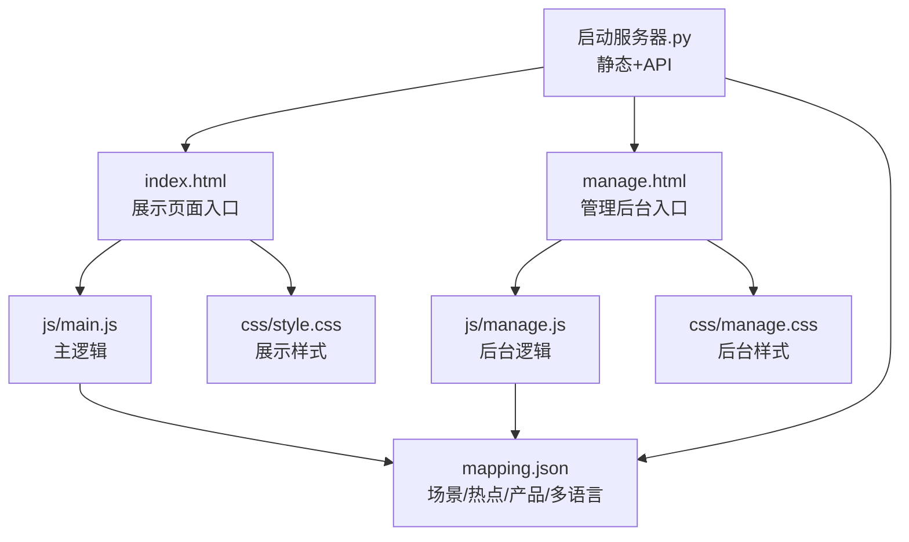
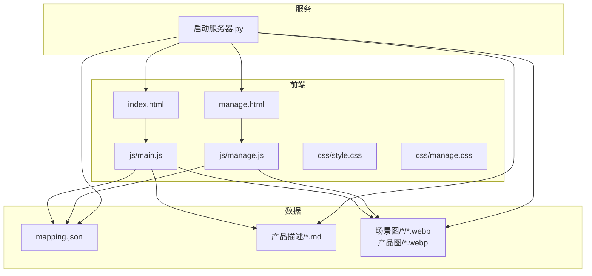
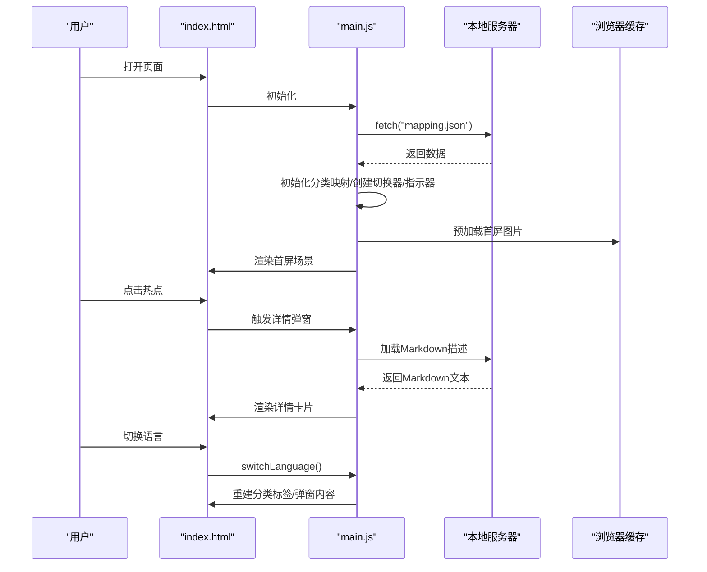
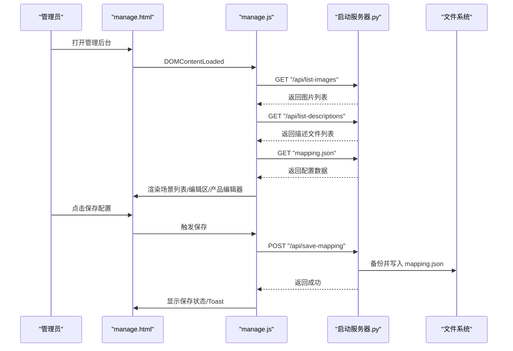
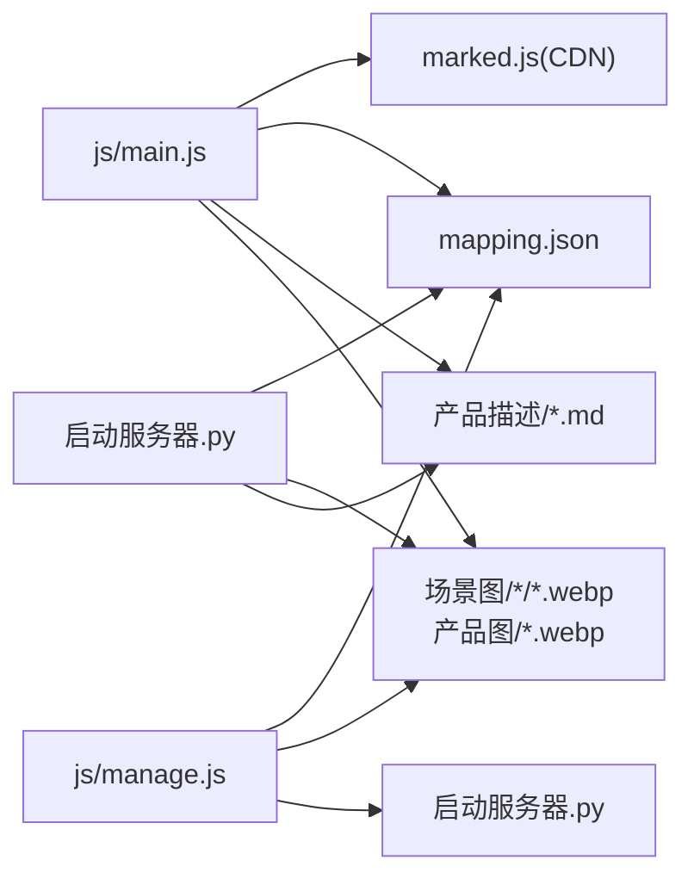

# 开发指南

<cite>
**本文引用的文件**
- [index.html](file://index.html)
- [manage.html](file://manage.html)
- [js/main.js](file://js/main.js)
- [js/manage.js](file://js/manage.js)
- [css/style.css](file://css/style.css)
- [css/manage.css](file://css/manage.css)
- [mapping.json](file://mapping.json)
- [启动服务器.py](file://启动服务器.py)
- [project_architecture.md](file://project_architecture.md)
- [.gitignore](file://.gitignore)
- [产品描述/室内双面吊装标牌.md](file://产品描述/室内双面吊装标牌.md)
- [产品描述/自助点单机1.md](file://产品描述/自助点单机1.md)
</cite>

## 目录
1. [简介](#简介)
2. [项目结构](#项目结构)
3. [核心组件](#核心组件)
4. [架构总览](#架构总览)
5. [详细组件分析](#详细组件分析)
6. [依赖关系分析](#依赖关系分析)
7. [性能考量](#性能考量)
8. [故障排除指南](#故障排除指南)
9. [结论](#结论)
10. [附录](#附录)

## 简介
本开发指南面向数字标牌产品展示项目，提供从环境搭建、代码规范、调试技巧、版本控制、测试、CI/CD 到质量保证与故障排除的全流程指导。项目采用纯原生前端技术（HTML/CSS/JavaScript），通过本地 Python 服务器提供 API 端点，支持中日双语、多场景多热点交互、Markdown 产品描述渲染与管理后台可视化编辑。

## 项目结构
项目采用“数据驱动 + 视图渲染”的组织方式，核心文件如下：
- 展示页面：index.html + js/main.js + css/style.css
- 管理后台：manage.html + js/manage.js + css/manage.css
- 数据配置：mapping.json（场景、热点、产品、多语言）
- 本地服务器：启动服务器.py（静态文件 + API）
- 架构文档：project_architecture.md（整体说明）

图表来源
- [index.html](file://index.html)
- [js/main.js](file://js/main.js)
- [css/style.css](file://css/style.css)
- [manage.html](file://manage.html)
- [js/manage.js](file://js/manage.js)
- [css/manage.css](file://css/manage.css)
- [mapping.json](file://mapping.json)
- [启动服务器.py](file://启动服务器.py)

章节来源
- [project_architecture.md](file://project_architecture.md)
- [index.html](file://index.html)
- [manage.html](file://manage.html)

## 核心组件
- 数据配置层：mapping.json，集中管理场景、热点、产品与多语言文案，前端通过 fetch 动态加载，管理后台通过 API 读写。
- 展示层：index.html + js/main.js + css/style.css，负责场景轮播、多热点渲染、详情弹窗、多语言切换与 Markdown 渲染。
- 管理层：manage.html + js/manage.js + css/manage.css，提供三栏布局的可视化编辑体验，支持场景/热点/产品增删改与保存。
- 服务层：启动服务器.py，提供静态资源服务与四个 API 端点，支持图片上传、文件列表查询与配置保存。

章节来源
- [mapping.json](file://mapping.json)
- [js/main.js](file://js/main.js)
- [js/manage.js](file://js/manage.js)
- [启动服务器.py](file://启动服务器.py)

## 架构总览
项目采用“前端纯原生 + 本地 Python 服务器”的轻量架构，数据与逻辑解耦，便于维护与扩展。

图表来源
- [index.html](file://index.html)
- [manage.html](file://manage.html)
- [js/main.js](file://js/main.js)
- [js/manage.js](file://js/manage.js)
- [css/style.css](file://css/style.css)
- [css/manage.css](file://css/manage.css)
- [mapping.json](file://mapping.json)
- [启动服务器.py](file://启动服务器.py)

## 详细组件分析

### 展示页面（index.html + main.js + style.css）
- 页面结构：语言切换器、双层场景图、加载指示器、分类切换器、热点容器、导航按钮、底部指示器、详情弹窗、遮罩层。
- 交互要点：
  - 场景切换：交叉淡入淡出，防抖与状态锁，图片缓存检测与超时保护。
  - 多热点：按百分比坐标计算像素位置，支持多个热点同时渲染。
  - 详情弹窗：左图右文布局，Markdown 渲染，骨架屏与错误可重试。
  - 多语言：t()/getText()/switchLanguage()，动态重建分类标签与弹窗内容。
- 性能优化：首屏独占带宽策略、预加载缓存、事件监听去重与超时保护。

图表来源
- [index.html](file://index.html)
- [js/main.js](file://js/main.js)
- [启动服务器.py](file://启动服务器.py)

章节来源
- [index.html](file://index.html)
- [js/main.js](file://js/main.js)
- [css/style.css](file://css/style.css)
- [project_architecture.md](file://project_architecture.md)

### 管理后台（manage.html + manage.js + manage.css）
- 页面结构：顶部工具栏（标题+保存状态+保存按钮）、左栏场景列表、中栏场景编辑区（分类名输入、场景图预览、热点叠加层、工具栏）、右栏产品编辑器（名称/图片/描述编辑）、Toast 提示、添加场景对话框。
- 交互要点：
  - 场景增删改：左栏选中场景，中栏显示场景图与热点，右栏显示产品列表。
  - 热点拖拽：百分比坐标实时更新，选中态高亮与脉冲动画。
  - 产品编辑：名称（日/中）、图片选择、描述文件选择、添加/删除产品。
  - 保存与上传：保存配置自动备份，图片上传到指定目录并返回相对路径。
- API 调用：/api/list-images、/api/list-descriptions、/api/save-mapping、/api/upload-image。

图表来源
- [manage.html](file://manage.html)
- [js/manage.js](file://js/manage.js)
- [启动服务器.py](file://启动服务器.py)

章节来源
- [manage.html](file://manage.html)
- [js/manage.js](file://js/manage.js)
- [css/manage.css](file://css/manage.css)
- [启动服务器.py](file://启动服务器.py)

### 数据配置（mapping.json）
- 结构：version、scenes（场景数组）、i18n（多语言字典）。
- 场景对象：id、category（多语言）、image、hotspots（热点数组）。
- 热点对象：id、x/y（百分比坐标）、products（产品数组）。
- 产品对象：name（多语言）、image、descriptionFile（Markdown 路径）。
- 多语言：支持 ja/zh，所有 UI 文本与产品名称均通过 getText()/t() 获取。

章节来源
- [mapping.json](file://mapping.json)
- [project_architecture.md](file://project_architecture.md)

### 本地服务器（启动服务器.py）
- 静态文件服务：提供 index.html、manage.html、静态资源与 API。
- API 端点：
  - GET /api/list-images：返回场景图与产品图列表。
  - GET /api/list-descriptions：返回所有产品描述文件列表。
  - POST /api/save-mapping：保存 mapping.json（先备份）。
  - POST /api/upload-image：上传图片到场景图/产品图目录。
- CORS：允许本地开发跨域访问。
- 端口：从 8082 开始寻找可用端口。

章节来源
- [启动服务器.py](file://启动服务器.py)

## 依赖关系分析
- 前端依赖：marked.js（CDN）用于 Markdown 解析；无构建工具与第三方框架，纯原生。
- 后端依赖：Python 标准库（http.server、socketserver、os、json、shutil、cgi、urllib）。
- 数据依赖：mapping.json 与产品描述 Markdown 文件，以及场景图/产品图资源。

图表来源
- [js/main.js](file://js/main.js)
- [js/manage.js](file://js/manage.js)
- [启动服务器.py](file://启动服务器.py)
- [mapping.json](file://mapping.json)

章节来源
- [启动服务器.py](file://启动服务器.py)
- [project_architecture.md](file://project_architecture.md)

## 性能考量
- 图片加载与缓存
  - 预加载策略：遍历 mapping.json 中所有场景图与产品图，统一预加载至浏览器缓存，减少切换时延。
  - 加载等待：waitForImageLoad 提供超时保护与事件监听去重，避免内存泄漏。
  - 首屏独占带宽：首屏图片加载完成后才启动其余图片预加载，保证首屏体验。
- 交互流畅性
  - 交叉淡入淡出：双层图层切换，无黑屏，过渡时隐藏热点与切换器，完成后恢复。
  - 防抖与状态锁：切换过程与详情弹窗期间禁止重复触发。
- 渲染优化
  - 动态渲染：热点、分类标签、指示器、产品列表均通过 JS 动态创建，按需更新。
  - 骨架屏与错误可重试：详情加载中显示骨架占位，失败时提供可点击重试。
- 服务器性能
  - 本地开发服务器，API 仅在本地使用，无需复杂中间件。

章节来源
- [js/main.js](file://js/main.js)
- [css/style.css](file://css/style.css)
- [启动服务器.py](file://启动服务器.py)

## 故障排除指南
- mapping.json 加载失败
  - 现象：展示页面全屏错误提示，无法进入主界面。
  - 排查：确认 mapping.json 存在且格式正确；检查本地服务器是否正常启动；查看浏览器控制台网络错误。
  - 处理：修复 JSON 格式或恢复备份文件；重启本地服务器。
- 图片加载失败/超时
  - 现象：场景图或产品图长时间不显示，加载指示器常驻。
  - 排查：确认图片路径与文件存在；检查服务器返回状态；查看网络面板。
  - 处理：修正路径或替换图片；确保图片格式为 .webp/.jpg/.png。
- Markdown 描述加载失败
  - 现象：详情弹窗中出现可点击重试的错误提示。
  - 排查：确认对应 .md 文件存在且路径正确。
  - 处理：修复路径或补充缺失的 Markdown 文件。
- 管理后台保存失败
  - 现象：点击保存后显示错误状态。
  - 排查：检查 /api/save-mapping 返回的错误信息；确认服务器权限与磁盘空间。
  - 处理：修复 JSON 格式或权限问题；查看服务器日志。
- 热点坐标不准确
  - 现象：拖拽热点后坐标显示异常。
  - 排查：确认场景图已加载完成；检查百分比计算逻辑。
  - 处理：等待图片加载后再进行拖拽；必要时刷新页面。

章节来源
- [js/main.js](file://js/main.js)
- [js/manage.js](file://js/manage.js)
- [启动服务器.py](file://启动服务器.py)

## 结论
本项目通过“数据驱动 + 纯原生前端 + 本地 Python 服务器”的架构，实现了中日双语、多场景多热点、Markdown 渲染与可视化管理的完整能力。遵循本文档的开发规范、调试方法与质量保障流程，可高效迭代与维护项目。

## 附录

### 开发环境搭建步骤
- Python 环境
  - 安装 Python（建议 3.x），确保命令行可用。
  - 运行启动服务器：双击“启动服务器.py”或在终端执行 python 启动服务器.py。
  - 默认访问地址：http://localhost:8082/index.html 与 http://localhost:8082/manage.html。
- 依赖安装
  - 前端依赖：通过 CDN 引入 marked.js，无需额外安装。
  - 本地服务器：Python 标准库即可满足需求。
- 开发工具推荐
  - 文本编辑器：VS Code（推荐启用 ESLint、Prettier 插件）。
  - 浏览器：Chrome/Firefox，使用开发者工具进行调试与性能分析。
  - Git：版本控制与协作。

章节来源
- [启动服务器.py](file://启动服务器.py)
- [index.html](file://index.html)
- [manage.html](file://manage.html)
- [.gitignore](file://.gitignore)

### 代码规范与最佳实践
- JavaScript 编码规范
  - 使用 ES6+ 语法，模块化组织代码（按功能拆分函数与状态）。
  - 事件绑定与解绑：避免重复绑定，使用 { once: true } 防止内存泄漏。
  - 异步处理：统一使用 async/await，合理设置超时与重试。
  - 变量命名：清晰表达意图，避免魔法数字与字符串。
  - DOM 操作：集中管理 DOM 引用，批量更新时使用 requestAnimationFrame。
- CSS 样式规范
  - 使用 BEM 或类似命名约定，避免全局污染。
  - 动画与过渡：统一时长与缓动函数，避免过度动画影响性能。
  - 响应式：针对不同设备宽度进行适配，优先使用相对单位。
  - 毛玻璃与阴影：合理使用 backdrop-filter 与 box-shadow，注意兼容性。
- HTML 结构规范
  - 语义化标签优先，为可访问性提供 aria-label 与 role。
  - 结构清晰，注释明确，便于维护与审查。
  - 资源路径使用相对路径，避免硬编码绝对路径。

章节来源
- [js/main.js](file://js/main.js)
- [js/manage.js](file://js/manage.js)
- [css/style.css](file://css/style.css)
- [css/manage.css](file://css/manage.css)
- [index.html](file://index.html)
- [manage.html](file://manage.html)

### 调试技巧与工具使用
- 浏览器开发者工具
  - Elements：检查 DOM 结构与样式，验证热点定位与布局。
  - Network：监控图片、Markdown 与 API 请求，识别失败与超时。
  - Performance：分析主线程卡顿，定位重排与重绘热点。
  - Console：查看错误日志与调试信息。
- 网络监控
  - 关注 /api/* 端点的响应状态与耗时，定位服务器问题。
  - 检查 CORS 头与跨域策略。
- 性能分析
  - 使用 Performance 面板录制首屏与切换流程，优化关键路径。
  - 关注图片体积与格式（.webp），减少带宽占用。

章节来源
- [启动服务器.py](file://启动服务器.py)
- [js/main.js](file://js/main.js)
- [js/manage.js](file://js/manage.js)

### 版本控制策略（Git 工作流程）
- 分支管理
  - 主分支：master/main（稳定发布）。
  - 开发分支：develop（日常开发）。
  - 功能分支：feature/*（新功能开发）。
  - 修复分支：fix/*（缺陷修复）。
- 提交规范
  - 标准格式：type(scope): subject
  - 示例：feat(manage): 增加场景拖拽功能；fix(main): 修复图片加载超时问题。
- 发布管理
  - 使用标签标记版本（vX.Y.Z），每次发布前更新 project_architecture.md 与 README。
  - 发布前进行回归测试与性能评估。

章节来源
- [.gitignore](file://.gitignore)
- [project_architecture.md](file://project_architecture.md)

### 测试指南
- 单元测试
  - 对独立函数（如坐标计算、ID 生成、多语言回退）编写小规模测试，验证边界条件。
- 集成测试
  - 端到端验证：启动本地服务器，模拟用户操作（切换场景、点击热点、打开详情、保存配置）。
  - 覆盖场景：弱网环境下的图片与 Markdown 加载、语言切换、热点拖拽。
- 用户验收测试（UAT）
  - 邀请业务人员参与，验证场景覆盖率、热点准确性、描述完整性与界面一致性。

章节来源
- [js/main.js](file://js/main.js)
- [js/manage.js](file://js/manage.js)
- [启动服务器.py](file://启动服务器.py)

### 持续集成与自动化部署
- CI 流程建议
  - 触发条件：push 到 develop/main，PR 合并。
  - 步骤：安装依赖（本地无需安装）、运行代码检查（ESLint/Prettier）、执行集成测试、生成报告。
- 自动化部署
  - 本地服务器：适用于开发与演示环境。
  - 生产部署：可将静态资源与 mapping.json 托管至 CDN/静态站点，后端 API 可迁移至云服务。

章节来源
- [启动服务器.py](file://启动服务器.py)
- [project_architecture.md](file://project_architecture.md)

### 代码审查清单与质量保证
- 代码审查清单
  - 逻辑正确性：场景切换、热点定位、详情渲染、多语言回退。
  - 性能与健壮性：超时与重试、防抖与状态锁、骨架屏与错误可重试。
  - 可维护性：函数职责单一、变量命名清晰、注释与文档齐全。
  - 安全性：输入校验、路径拼接安全、CORS 配置。
- 质量保证流程
  - 提交前自测：本地服务器验证、弱网模拟、多语言切换。
  - Review：至少一名同事审阅，关注边界与异常处理。
  - 合并：通过 CI，打标签并更新发布说明。

章节来源
- [js/main.js](file://js/main.js)
- [js/manage.js](file://js/manage.js)
- [启动服务器.py](file://启动服务器.py)

### 扩展开发注意事项
- 模块化设计
  - 将公共逻辑抽离为工具函数（坐标计算、ID 生成、多语言回退）。
  - 状态管理集中化，避免全局污染。
- 向后兼容性
  - mapping.json 字段变更需提供默认值与回退逻辑。
  - 新增 API 时保留兼容端点或提供迁移指引。
- 资源管理
  - 图片与 Markdown 文件路径统一管理，避免硬编码。
  - 上传图片时校验类型与大小，确保跨平台兼容。

章节来源
- [mapping.json](file://mapping.json)
- [启动服务器.py](file://启动服务器.py)
- [产品描述/室内双面吊装标牌.md](file://产品描述/室内双面吊装标牌.md)
- [产品描述/自助点单机1.md](file://产品描述/自助点单机1.md)