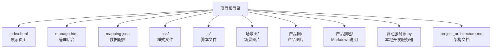
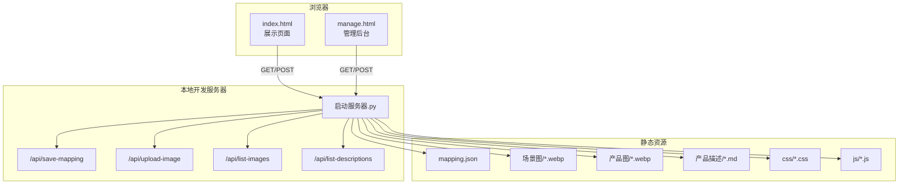
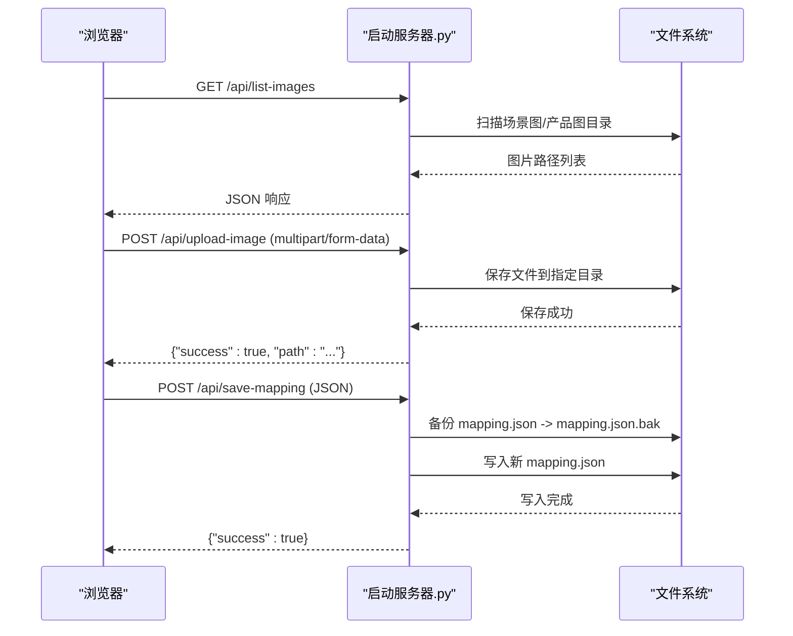
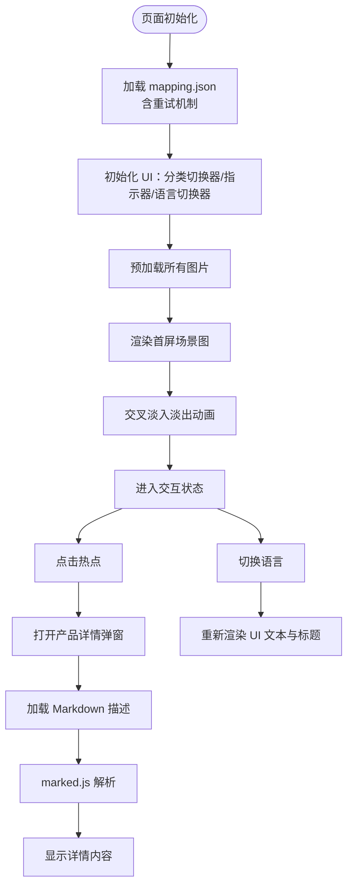
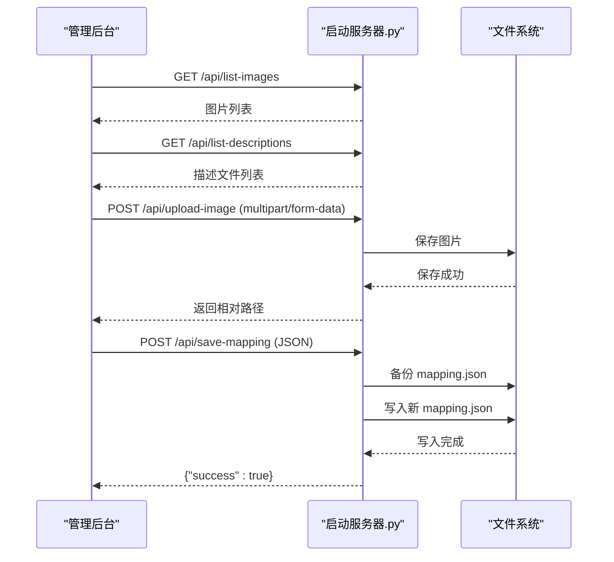
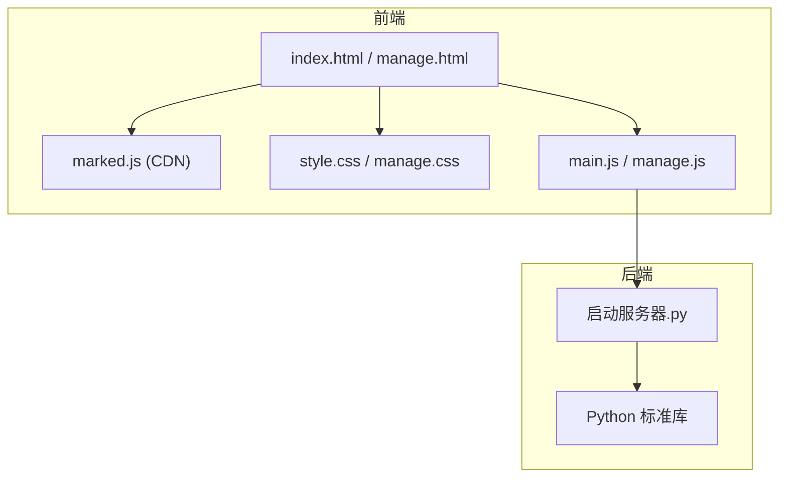

# 开发环境搭建

<cite>
**本文引用的文件**
- [index.html](file://index.html)
- [manage.html](file://manage.html)
- [启动服务器.py](file://启动服务器.py)
- [mapping.json](file://mapping.json)
- [js/main.js](file://js/main.js)
- [js/manage.js](file://js/manage.js)
- [css/style.css](file://css/style.css)
- [css/manage.css](file://css/manage.css)
- [项目架构文档](file://project_architecture.md)
- [室内双面吊装标牌.md](file://产品描述/室内双面吊装标牌.md)
- [电子水牌.md](file://产品描述/电子水牌.md)
</cite>

## 目录
1. [简介](#简介)
2. [项目结构](#项目结构)
3. [核心组件](#核心组件)
4. [架构总览](#架构总览)
5. [详细组件分析](#详细组件分析)
6. [依赖分析](#依赖分析)
7. [性能考虑](#性能考虑)
8. [故障排查指南](#故障排查指南)
9. [结论](#结论)
10. [附录](#附录)

## 简介
本指南面向数字标牌产品展示项目的本地开发环境搭建，涵盖 Python 环境要求、本地开发服务器启动与配置、CDN 资源与本地资源的配置方法、环境验证步骤以及常见问题排查。项目采用纯原生前端技术（HTML/CSS/JavaScript），通过内置 Python HTTP 服务器提供静态文件服务与 API 端点，支持中日文双语展示与可视化管理后台。

## 项目结构
项目采用“页面 + 数据 + 资源 + 服务”的扁平化组织方式，便于快速定位与维护。

图表来源
- [项目架构文档:43-108](file://project_architecture.md#L43-L108)

章节来源
- [项目架构文档:43-108](file://project_architecture.md#L43-L108)

## 核心组件
- 展示页面（index.html）：基于 mapping.json 动态渲染场景、热点与产品详情，支持中日文切换与 Markdown 渲染。
- 管理后台（manage.html）：可视化编辑场景、热点与产品配置，通过 API 保存与上传资源。
- 本地开发服务器（启动服务器.py）：提供静态文件服务与四个 API 端点，支持 CORS 与图片上传。
- 数据配置（mapping.json）：集中管理场景、热点、产品与多语言文案。
- 样式文件（css/style.css、css/manage.css）：展示页面与管理后台的视觉与交互样式。
- 脚本文件（js/main.js、js/manage.js）：展示页面与管理后台的交互逻辑。

章节来源
- [项目架构文档:29-41](file://project_architecture.md#L29-L41)
- [项目架构文档:112-176](file://project_architecture.md#L112-L176)

## 架构总览
项目采用“静态页面 + 数据配置 + 本地 API 服务”的轻量级架构，前端通过 fetch 与 API 交互，无需构建工具即可运行。

图表来源
- [启动服务器.py:25-98](file://启动服务器.py#L25-L98)
- [启动服务器.py:204-251](file://启动服务器.py#L204-L251)
- [启动服务器.py:254-295](file://启动服务器.py#L254-L295)

章节来源
- [启动服务器.py:25-98](file://启动服务器.py#L25-L98)
- [启动服务器.py:204-251](file://启动服务器.py#L204-L251)
- [启动服务器.py:254-295](file://启动服务器.py#L254-L295)

## 详细组件分析

### 本地开发服务器（启动服务器.py）
- 功能：提供静态文件服务与四个 API 端点，支持 CORS、图片上传、文件列表查询与配置保存。
- 端口：默认 8082，若被占用会自动寻找可用端口。
- CORS：允许任意来源跨域访问，便于前后端分离开发。
- API 端点：
  - POST /api/save-mapping：保存 mapping.json（先备份为 .bak）。
  - POST /api/upload-image：上传图片至场景图/产品图目录。
  - GET /api/list-images：返回场景图与产品图的相对路径列表。
  - GET /api/list-descriptions：返回产品描述 Markdown 文件列表。

图表来源
- [启动服务器.py:75-98](file://启动服务器.py#L75-L98)
- [启动服务器.py:101-128](file://启动服务器.py#L101-L128)
- [启动服务器.py:129-203](file://启动服务器.py#L129-L203)
- [启动服务器.py:204-251](file://启动服务器.py#L204-L251)

章节来源
- [启动服务器.py:25-98](file://启动服务器.py#L25-L98)
- [启动服务器.py:101-128](file://启动服务器.py#L101-L128)
- [启动服务器.py:129-203](file://启动服务器.py#L129-L203)
- [启动服务器.py:204-251](file://启动服务器.py#L204-L251)
- [启动服务器.py:254-295](file://启动服务器.py#L254-L295)

### 展示页面（index.html + js/main.js + css/style.css）
- 数据驱动：通过 fetch 加载 mapping.json，支持 3 次重试与错误提示。
- 多语言：支持中日文切换，UI 文本与产品名称均来自 i18n 字典。
- 热点交互：多热点渲染与定位，点击弹出产品详情（左图右文）。
- Markdown：使用 marked.js 解析产品描述，失败时显示可点击重试。
- 性能优化：首屏独占带宽策略、双层交叉淡入淡出、图片预加载与缓存。

图表来源
- [js/main.js:49-73](file://js/main.js#L49-L73)
- [js/main.js:119-162](file://js/main.js#L119-L162)
- [js/main.js:480-595](file://js/main.js#L480-L595)
- [js/main.js:421-442](file://js/main.js#L421-L442)
- [js/main.js:450-460](file://js/main.js#L450-L460)

章节来源
- [js/main.js:49-73](file://js/main.js#L49-L73)
- [js/main.js:119-162](file://js/main.js#L119-L162)
- [js/main.js:480-595](file://js/main.js#L480-L595)
- [js/main.js:421-442](file://js/main.js#L421-L442)
- [js/main.js:450-460](file://js/main.js#L450-L460)

### 管理后台（manage.html + js/manage.js + css/manage.css）
- 三栏布局：左栏场景列表、中栏场景编辑区、右栏产品编辑器。
- 可视化编辑：拖拽热点、实时更新坐标、选择图片与描述文件。
- 保存与上传：点击保存将完整 mapping.json 发送到服务器，上传图片使用 multipart/form-data。
- 提示系统：Toast 提示保存状态与错误信息。

图表来源
- [js/manage.js:35-72](file://js/manage.js#L35-L72)
- [js/manage.js:762-781](file://js/manage.js#L762-L781)
- [js/manage.js:81-108](file://js/manage.js#L81-L108)
- [启动服务器.py:129-203](file://启动服务器.py#L129-L203)
- [启动服务器.py:101-128](file://启动服务器.py#L101-L128)

章节来源
- [js/manage.js:35-72](file://js/manage.js#L35-L72)
- [js/manage.js:762-781](file://js/manage.js#L762-L781)
- [js/manage.js:81-108](file://js/manage.js#L81-L108)
- [启动服务器.py:129-203](file://启动服务器.py#L129-L203)
- [启动服务器.py:101-128](file://启动服务器.py#L101-L128)

## 依赖分析
- 前端依赖：marked.js（CDN）用于 Markdown 解析；项目未使用任何构建工具或第三方框架。
- 服务器依赖：Python 标准库（http.server、socketserver、webbrowser、os、json、shutil、cgi、urllib.parse）。
- 资源依赖：场景图、产品图、产品描述 Markdown 文件需按目录结构放置。

图表来源
- [项目架构文档:29-41](file://project_architecture.md#L29-L41)
- [启动服务器.py:7-16](file://启动服务器.py#L7-L16)

章节来源
- [项目架构文档:29-41](file://project_architecture.md#L29-L41)
- [启动服务器.py:7-16](file://启动服务器.py#L7-L16)

## 性能考虑
- 图片加载：首屏独占带宽策略，确保首屏可见后再进行预加载，减少网络拥塞。
- 交叉淡入淡出：双层图层切换，避免切换过程中的黑屏与闪烁。
- 缓存与重试：图片与 Markdown 描述均具备缓存与重试机制，提升弱网稳定性。
- 骨架屏与提示：加载中与错误状态提供用户反馈，改善感知性能。

章节来源
- [js/main.js:257-327](file://js/main.js#L257-L327)
- [js/main.js:480-595](file://js/main.js#L480-L595)
- [js/main.js:421-442](file://js/main.js#L421-L442)
- [css/style.css:344-353](file://css/style.css#L344-L353)

## 故障排查指南
- 端口冲突
  - 现象：启动服务器报错“Address already in use”或端口被占用。
  - 处理：启动服务器会自动寻找可用端口（从 8082 开始），若仍失败，可手动修改 PORT 常量或关闭占用端口的进程。
  - 参考：[启动服务器.py:254-264](file://启动服务器.py#L254-L264)
- CORS 跨域问题
  - 现象：浏览器控制台出现跨域错误。
  - 处理：服务器已设置 Access-Control-Allow-Origin:*，确保使用本地开发服务器提供的 API。
  - 参考：[启动服务器.py:28-33](file://启动服务器.py#L28-L33)
- 图片上传失败
  - 现象：上传图片后返回错误或无法显示。
  - 处理：检查 multipart/form-data 请求格式、type 与 category 参数、目标目录权限与磁盘空间。
  - 参考：[启动服务器.py:129-203](file://启动服务器.py#L129-L203)
- mapping.json 保存失败
  - 现象：保存配置后 mapping.json 未更新或出现 .bak 文件。
  - 处理：确认请求体为合法 JSON，服务器会先备份再写入；检查文件权限与磁盘空间。
  - 参考：[启动服务器.py:101-128](file://启动服务器.py#L101-L128)
- Markdown 加载失败
  - 现象：产品描述显示“加载失败，点击重试”。
  - 处理：检查描述文件路径是否正确、文件是否存在、网络是否稳定；点击重试可清除缓存后重新加载。
  - 参考：[js/main.js:421-442](file://js/main.js#L421-L442)
- marked.js 未加载
  - 现象：Markdown 未解析或显示原始文本。
  - 处理：确认 index.html 中已引入 marked.js CDN；若网络受限，可替换为本地版本。
  - 参考：[index.html](file://index.html#L10)

章节来源
- [启动服务器.py:254-264](file://启动服务器.py#L254-L264)
- [启动服务器.py:28-33](file://启动服务器.py#L28-L33)
- [启动服务器.py:129-203](file://启动服务器.py#L129-L203)
- [启动服务器.py:101-128](file://启动服务器.py#L101-L128)
- [js/main.js:421-442](file://js/main.js#L421-L442)
- [index.html](file://index.html#L10)

## 结论
本项目通过纯原生前端与内置 Python 服务器实现了低门槛的本地开发体验，既满足展示页面的高性能交互，又提供可视化的管理后台。遵循本文档的环境搭建与验证步骤，可快速完成开发环境准备并高效迭代。

## 附录

### Python 环境要求与依赖包安装
- Python 版本：建议使用 Python 3.6+（项目使用标准库，无需额外安装第三方包）。
- 依赖包：无需安装，使用 Python 标准库即可运行本地开发服务器。
- 安装方式：从 Python 官网下载并安装 Python，确保命令行可执行 python 或 python3。

章节来源
- [启动服务器.py:7-16](file://启动服务器.py#L7-L16)

### 本地开发服务器启动与配置
- 启动方式：双击“启动服务器.py”或在项目根目录执行命令行启动。
- 默认端口：8082；若被占用自动寻找可用端口。
- 访问地址：
  - 展示页面：http://localhost:端口/index.html
  - 管理后台：http://localhost:端口/manage.html
- CORS：已启用，允许任意来源跨域访问。
- API 端点：
  - POST /api/save-mapping：保存 mapping.json（先备份为 .bak）。
  - POST /api/upload-image：上传图片至场景图/产品图目录。
  - GET /api/list-images：返回图片列表。
  - GET /api/list-descriptions：返回描述文件列表。

章节来源
- [启动服务器.py:254-295](file://启动服务器.py#L254-L295)
- [项目架构文档:23-26](file://project_architecture.md#L23-L26)

### 开发工具推荐
- 代码编辑器：Visual Studio Code（推荐安装 Live Server 插件用于快速预览，但本项目使用内置服务器）。
- 浏览器开发者工具：Chrome DevTools（Network/Console/Elements 面板用于调试与性能分析）。
- 调试工具：浏览器断点调试、Console 输出、Network 面板监控 API 请求与资源加载。

章节来源
- [项目架构文档:23-26](file://project_architecture.md#L23-L26)

### CDN 资源与本地资源配置
- CDN 资源：marked.js 通过 CDN 引入，路径位于 index.html。
- 本地资源：场景图、产品图、产品描述 Markdown 文件需按目录结构放置，服务器会扫描这些目录并返回文件列表。
- 配置方法：在 mapping.json 中正确填写图片与描述文件的相对路径，确保与实际文件一致。

章节来源
- [index.html](file://index.html#L10)
- [启动服务器.py:204-251](file://启动服务器.py#L204-L251)
- [mapping.json:1-232](file://mapping.json#L1-L232)

### 环境验证步骤
- 启动服务器后，打开浏览器访问 http://localhost:端口/index.html 与 http://localhost:端口/manage.html。
- 在管理后台中：
  - 点击“保存配置”，确认返回成功状态。
  - 上传一张图片，确认返回相对路径。
  - 刷新展示页面，确认图片与描述正常显示。
- 若出现跨域或资源加载错误，检查 CORS 设置与 CDN 可达性。

章节来源
- [启动服务器.py:254-295](file://启动服务器.py#L254-L295)
- [js/manage.js:81-108](file://js/manage.js#L81-L108)
- [js/manage.js:762-781](file://js/manage.js#L762-L781)
- [项目架构文档:23-26](file://project_architecture.md#L23-L26)