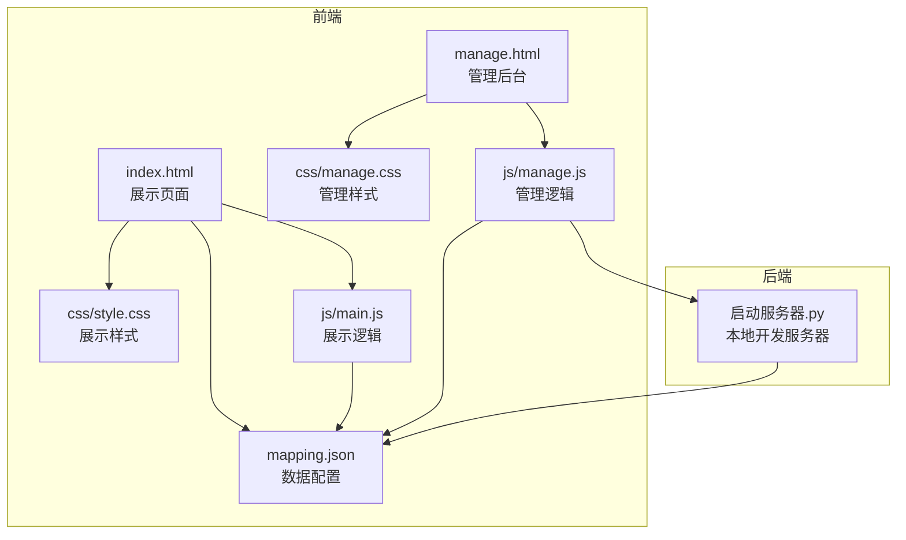
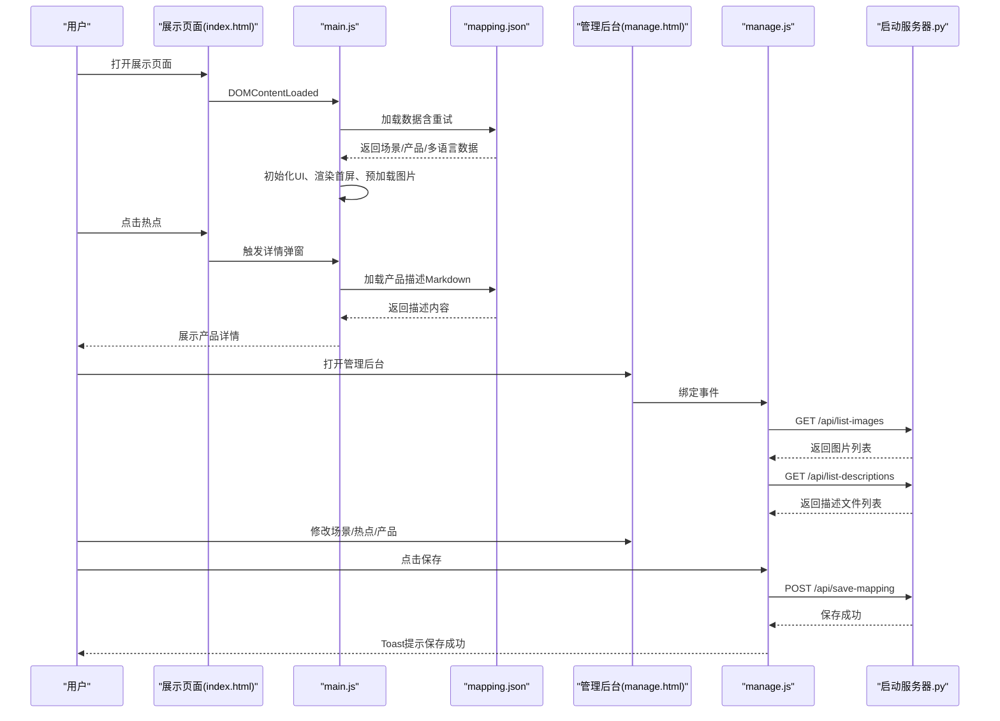
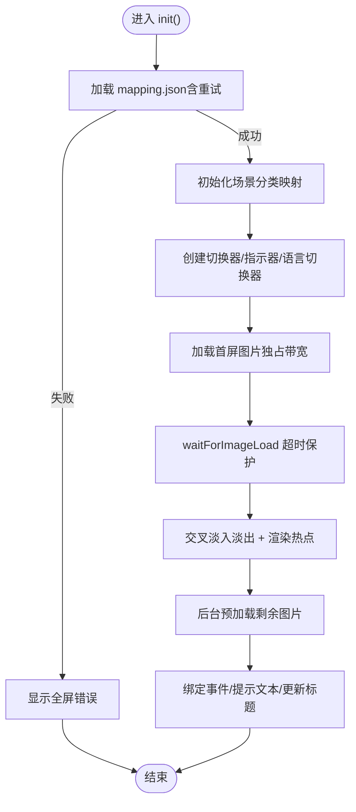
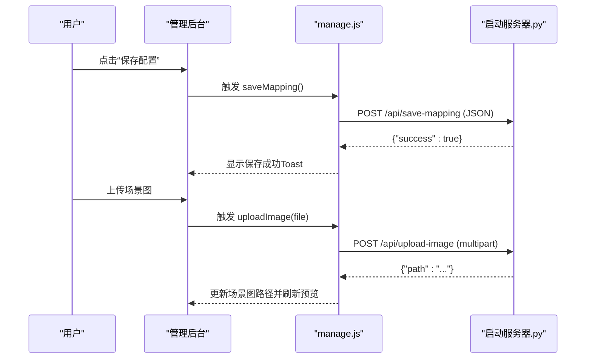
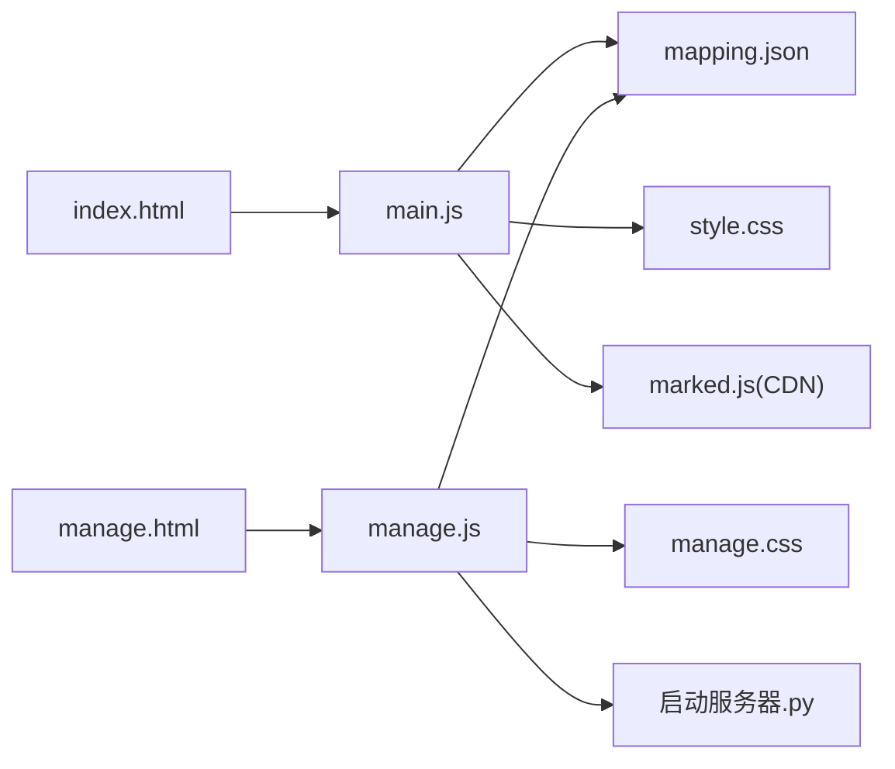

# 测试指南

<cite>
**本文引用的文件**
- [index.html](file://index.html)
- [manage.html](file://manage.html)
- [main.js](file://js/main.js)
- [manage.js](file://js/manage.js)
- [style.css](file://css/style.css)
- [manage.css](file://css/manage.css)
- [mapping.json](file://mapping.json)
- [项目架构文档](file://project_architecture.md)
- [室内双面吊装标牌.md](file://产品描述/室内双面吊装标牌.md)
- [电子水牌.md](file://产品描述/电子水牌.md)
- [自助点单机1.md](file://产品描述/自助点单机1.md)
- [启动服务器.py](file://启动服务器.py)
</cite>

## 目录
1. [简介](#简介)
2. [项目结构](#项目结构)
3. [核心组件](#核心组件)
4. [架构总览](#架构总览)
5. [详细组件分析](#详细组件分析)
6. [依赖关系分析](#依赖关系分析)
7. [性能考量](#性能考量)
8. [故障排查指南](#故障排查指南)
9. [结论](#结论)
10. [附录](#附录)

## 简介
本测试指南面向“数字标牌产品展示项目”，旨在提供一套系统化的测试策略与实施方法，覆盖单元测试、集成测试、用户验收测试与自动化测试工具集成。项目包含前端展示页与管理后台两部分，数据通过 mapping.json 动态加载，支持中日文双语切换，具备场景浏览、热点点击、产品详情展示、图片加载与多语言切换等核心功能。

## 项目结构
项目采用前后端分离的静态资源组织方式，前端通过原生 JavaScript 与 CSS 实现，后端本地开发服务器提供 API 端点以支撑管理后台的数据持久化与文件上传。

图表来源
- [index.html](file://index.html)
- [manage.html](file://manage.html)
- [main.js](file://js/main.js)
- [manage.js](file://js/manage.js)
- [style.css](file://css/style.css)
- [manage.css](file://css/manage.css)
- [mapping.json](file://mapping.json)
- [启动服务器.py](file://启动服务器.py)

章节来源
- [项目架构文档](file://project_architecture.md)
- [index.html](file://index.html)
- [manage.html](file://manage.html)
- [main.js](file://js/main.js)
- [manage.js](file://js/manage.js)
- [style.css](file://css/style.css)
- [manage.css](file://css/manage.css)
- [mapping.json](file://mapping.json)
- [启动服务器.py](file://启动服务器.py)

## 核心组件
- 展示页面（index.html + main.js + style.css）
  - 数据加载与重试、多语言引擎、DOM 引用与状态管理、图片预加载与等待、Markdown 描述缓存与解析、场景渲染与切换、多热点渲染与交互、产品详情弹窗与动画、语言切换器、事件绑定与初始化。
- 管理后台（manage.html + manage.js + manage.css）
  - 数据加载（mapping.json、图片列表、描述文件列表）、工具栏事件（保存）、场景列表渲染、场景编辑区（分类名、场景图更换、热点操作）、热点拖拽、产品编辑器、添加场景对话框、图片上传、Toast 提示。
- 数据配置（mapping.json）
  - 场景、热点、产品、多语言字典等结构化数据。
- 本地开发服务器（启动服务器.py）
  - 提供 /api/save-mapping、/api/upload-image、/api/list-images、/api/list-descriptions 等端点。

章节来源
- [main.js](file://js/main.js)
- [manage.js](file://js/manage.js)
- [mapping.json](file://mapping.json)
- [项目架构文档](file://project_architecture.md)

## 架构总览
展示页面与管理后台共享 mapping.json 数据源，管理后台通过本地服务器 API 写入与上传文件，前端负责渲染与交互。

图表来源
- [index.html](file://index.html)
- [main.js](file://js/main.js)
- [manage.html](file://manage.html)
- [manage.js](file://js/manage.js)
- [启动服务器.py](file://启动服务器.py)
- [mapping.json](file://mapping.json)

章节来源
- [项目架构文档](file://project_architecture.md)
- [main.js](file://js/main.js)
- [manage.js](file://js/manage.js)
- [启动服务器.py](file://启动服务器.py)

## 详细组件分析

### 展示页面组件分析
- 数据加载与重试
  - 通过 fetch 加载 mapping.json，最多重试 3 次，延迟递增。
  - 失败时显示全屏错误提示。
- 多语言引擎
  - t(key) 与 getText(obj) 提供 UI 文本与多语言对象解析。
  - switchLanguage 切换语言并刷新页面标题、按钮、切换器与弹窗。
- 图片加载与预加载
  - preloadAllImages 预加载场景图与产品图，含重试与缓存。
  - waitForImageLoad 提供超时保护与事件监听，避免内存泄漏。
- Markdown 描述
  - loadDescription 缓存 + 失败降级（可点击重试）。
  - parseMarkdown 使用 marked.js 解析，未加载时进行安全降级。
- 场景渲染与切换
  - renderScene 支持交叉淡入淡出，先清除 src 再设置，确保 complete 状态重置。
  - repositionHotspots 基于 object-fit: cover 的裁剪偏移计算热点像素位置。
- 详情弹窗与动画
  - openDetailAnimation 与 closeDetail 控制背景淡化、遮罩与面板显隐。
- 事件绑定与初始化
  - init() 启动流程：加载数据 → 初始化分类 → 创建 UI → 首图独占带宽 → 预加载 → 绑定事件 → 提示文本 → 更新标题。

图表来源
- [main.js](file://js/main.js)

章节来源
- [main.js](file://js/main.js)
- [index.html](file://index.html)
- [style.css](file://css/style.css)
- [mapping.json](file://mapping.json)

### 管理后台组件分析
- 数据加载
  - loadMappingData 读取 mapping.json；loadImageList 与 loadDescriptionList 通过 /api 接口获取可用文件列表。
- 场景列表与编辑
  - renderSceneList 渲染缩略图、分类名与删除按钮；selectScene 切换当前场景并更新中栏与右栏。
- 热点渲染与拖拽
  - renderHotspots 在场景图上叠加热点标记；拖拽时计算百分比坐标并更新数据。
- 产品编辑器
  - updateProductEditor 根据选中热点显示产品列表；createProductEditItem 支持名称、图片与描述文件编辑。
- 添加场景对话框
  - confirmAddScene 支持输入分类名与上传图片，生成新场景并选中。
- 保存与上传
  - saveMapping 通过 /api/save-mapping 写入 mapping.json；uploadImage 上传图片至服务器。

图表来源
- [manage.js](file://js/manage.js)
- [启动服务器.py](file://启动服务器.py)

章节来源
- [manage.js](file://js/manage.js)
- [manage.html](file://manage.html)
- [manage.css](file://css/manage.css)
- [启动服务器.py](file://启动服务器.py)

## 依赖关系分析
- 展示页面依赖
  - main.js 依赖 mapping.json、style.css、marked.js（CDN）。
  - DOM 结构由 index.html 提供，JS 通过查询选择器进行操作。
- 管理后台依赖
  - manage.js 依赖 mapping.json、manage.css、启动服务器.py 提供的 API。
  - DOM 结构由 manage.html 提供，JS 通过事件委托与选择器进行操作。
- 数据依赖
  - mapping.json 为数据源，管理后台通过 API 写入，展示页面通过 fetch 读取。

图表来源
- [index.html](file://index.html)
- [main.js](file://js/main.js)
- [style.css](file://css/style.css)
- [manage.html](file://manage.html)
- [manage.js](file://js/manage.js)
- [manage.css](file://css/manage.css)
- [mapping.json](file://mapping.json)
- [启动服务器.py](file://启动服务器.py)

章节来源
- [main.js](file://js/main.js)
- [manage.js](file://js/manage.js)
- [index.html](file://index.html)
- [manage.html](file://manage.html)
- [style.css](file://css/style.css)
- [manage.css](file://css/manage.css)
- [mapping.json](file://mapping.json)
- [启动服务器.py](file://启动服务器.py)

## 性能考量
- 图片加载与预加载
  - 首屏独占带宽策略：首图加载完成后才启动后台预加载，避免慢速网络下首图超时。
  - waitForImageLoad 超时保护与事件监听，防止内存泄漏。
- Markdown 加载
  - descriptionCache 缓存避免重复请求；失败时提供可点击重试。
- 动画与渲染
  - requestAnimationFrame 优化渲染时机；交叉淡入淡出与热点出现动画使用 CSS 过渡。
- 语言切换
  - 仅更新 UI 文本与切换器，避免不必要的重渲染。

章节来源
- [main.js](file://js/main.js)
- [style.css](file://css/style.css)

## 故障排查指南
- mapping.json 加载失败
  - 现象：展示页面显示全屏错误提示。
  - 处理：检查网络连通性、路径正确性；确认本地服务器运行正常。
- 图片加载失败或超时
  - 现象：场景图或产品图未显示，加载指示器长时间显示。
  - 处理：检查图片路径是否存在；确认图片格式与尺寸；观察控制台错误信息。
- Markdown 加载失败
  - 现象：产品描述区域显示“加载失败，点击重试”。
  - 处理：点击重试按钮；检查描述文件路径与内容；确认 marked.js 可用。
- 热点位置不准确
  - 现象：点击热点无效或位置偏移。
  - 处理：确认场景图已加载完成；检查 object-fit: cover 的裁剪偏移计算；窗口大小变化时触发 repositionHotspots。
- 管理后台保存失败
  - 现象：点击保存后显示失败状态。
  - 处理：检查 /api/save-mapping 返回状态；确认服务器端权限与磁盘空间；查看控制台错误。

章节来源
- [main.js](file://js/main.js)
- [manage.js](file://js/manage.js)
- [启动服务器.py](file://启动服务器.py)

## 结论
本测试指南围绕展示页面与管理后台的关键功能，提供了从单元测试到用户验收测试的完整方案，并结合项目架构与实现细节给出可操作的测试策略与工具集成建议。通过合理的测试用例设计与覆盖率要求，能够有效保障系统的稳定性与用户体验。

## 附录

### 单元测试方法
- JavaScript 函数测试
  - 使用 Jest 对核心函数进行单元测试，如 loadMapping、t、getText、preloadAllImages、waitForImageLoad、calcHotspotPixelPosition、renderProductList、openDetailAnimation、closeDetail、switchLanguage、bindEvents、init 等。
  - 测试要点：
    - 数据加载重试与错误处理（模拟网络失败与超时）。
    - 多语言文本解析与回退逻辑。
    - 图片预加载与缓存命中/未命中分支。
    - Markdown 加载缓存与失败重试。
    - 热点坐标计算与 repositionHotspots。
    - 弹窗动画状态切换。
- DOM 操作测试
  - 使用 JSDOM 或 DOM Testing Library 在无头环境中模拟 DOM，验证渲染与交互行为（如语言切换器、场景切换器、热点容器、详情面板等）。
  - 测试要点：
    - DOM 结构与类名变更（active/inactive、visible/hidden）。
    - 事件绑定与回调触发（点击、键盘事件、窗口 resize）。
- API 接口测试
  - 使用 Jest + fetch 模拟 /api/save-mapping、/api/upload-image、/api/list-images、/api/list-descriptions。
  - 测试要点：
    - 请求体格式与响应结构。
    - 错误状态码与降级处理。

章节来源
- [main.js](file://js/main.js)
- [manage.js](file://js/manage.js)
- [启动服务器.py](file://启动服务器.py)

### 集成测试方案
- 页面加载测试
  - 验证 index.html 与 manage.html 的加载顺序、脚本与样式引入、初始状态（首屏图片、指示器、切换器、语言切换器）。
- 交互功能测试
  - 场景切换（左右按钮、键盘方向键、底部指示器、顶部分类切换器）。
  - 热点点击与详情弹窗（标题、产品列表、返回按钮、遮罩关闭）。
  - 语言切换（页面标题、按钮文字、切换器状态）。
- 多语言切换测试
  - 切换语言后 UI 文本一致性校验，弹窗内容重渲染验证。
- 图片加载测试
  - 首图独占带宽策略验证；图片缓存命中与加载失败重试。
- 管理后台功能测试
  - 场景列表渲染与选中状态；场景图更换与热点拖拽；产品编辑与保存；添加场景与图片上传；保存状态提示。

章节来源
- [index.html](file://index.html)
- [manage.html](file://manage.html)
- [main.js](file://js/main.js)
- [manage.js](file://js/manage.js)
- [启动服务器.py](file://启动服务器.py)

### 用户验收测试流程
- 场景浏览测试
  - 验证场景顺序、分类切换器、底部指示器与键盘/鼠标交互。
- 热点点击测试
  - 点击热点后弹窗出现，标题与产品列表正确显示。
- 产品详情展示测试
  - Markdown 渲染正确，加载失败可重试，表格与列表样式一致。
- 管理后台功能测试
  - 场景增删改、热点添加/删除/拖拽、产品编辑、保存与上传、Toast 提示。

章节来源
- [index.html](file://index.html)
- [manage.html](file://manage.html)
- [main.js](file://js/main.js)
- [manage.js](file://js/manage.js)
- [项目架构文档](file://project_architecture.md)

### 自动化测试工具集成
- Jest（单元与集成）
  - 配置 jest.config.js，启用 JSDOM 与 fetch 模拟。
  - 使用 @testing-library/jest-dom 扩展断言。
- Cypress（端到端）
  - 配置 cypress.config.js，编写 e2e 测试用例覆盖页面加载、交互与 API。
  - 使用 cy.intercept 拦截 /api 端点，模拟保存与上传。
- 测试覆盖率
  - Jest 配置 coverageThreshold，要求函数/行/分支/语句覆盖率不低于 80%（可根据团队标准调整）。

章节来源
- [main.js](file://js/main.js)
- [manage.js](file://js/manage.js)
- [启动服务器.py](file://启动服务器.py)

### 测试数据准备与测试环境搭建
- 测试数据准备
  - mapping.json：包含多场景、多热点、多产品与多语言文本。
  - 产品描述：准备若干 Markdown 文件（如室内双面吊装标牌.md、电子水牌.md、自助点单机1.md）。
  - 场景图与产品图：准备若干 .webp 图片文件。
- 测试环境搭建
  - 启动本地服务器：python 启动服务器.py（默认端口 8082）。
  - 前端页面：index.html 与 manage.html 通过本地服务器访问。
  - 端到端测试：Cypress 在本地服务器环境下运行 e2e 用例。

章节来源
- [mapping.json](file://mapping.json)
- [室内双面吊装标牌.md](file://产品描述/室内双面吊装标牌.md)
- [电子水牌.md](file://产品描述/电子水牌.md)
- [自助点单机1.md](file://产品描述/自助点单机1.md)
- [启动服务器.py](file://启动服务器.py)

### 测试用例设计原则与覆盖率要求
- 设计原则
  - 原子性：每个用例聚焦单一功能点。
  - 可重复性：测试环境稳定，步骤可重复。
  - 可观测性：断言明确，失败信息清晰。
  - 边界与异常：覆盖边界条件与异常路径（网络失败、超时、路径错误）。
- 覆盖率要求
  - 函数覆盖率 ≥ 80%，行覆盖率 ≥ 80%，分支覆盖率 ≥ 75%，语句覆盖率 ≥ 80%。

章节来源
- [main.js](file://js/main.js)
- [manage.js](file://js/manage.js)

### 回归测试流程与持续集成
- 回归测试流程
  - 每次提交后自动运行单元测试与集成测试；端到端测试在 PR 合并前执行。
  - 关键变更（数据结构、API、UI 动画）重点回归。
- 持续集成
  - GitHub Actions：配置工作流，安装依赖、启动本地服务器、运行 Jest 与 Cypress。
  - 缓存策略：npm/yarn 缓存加速构建。
  - 报告与通知：上传测试报告，失败时发送通知。

章节来源
- [main.js](file://js/main.js)
- [manage.js](file://js/manage.js)
- [启动服务器.py](file://启动服务器.py)