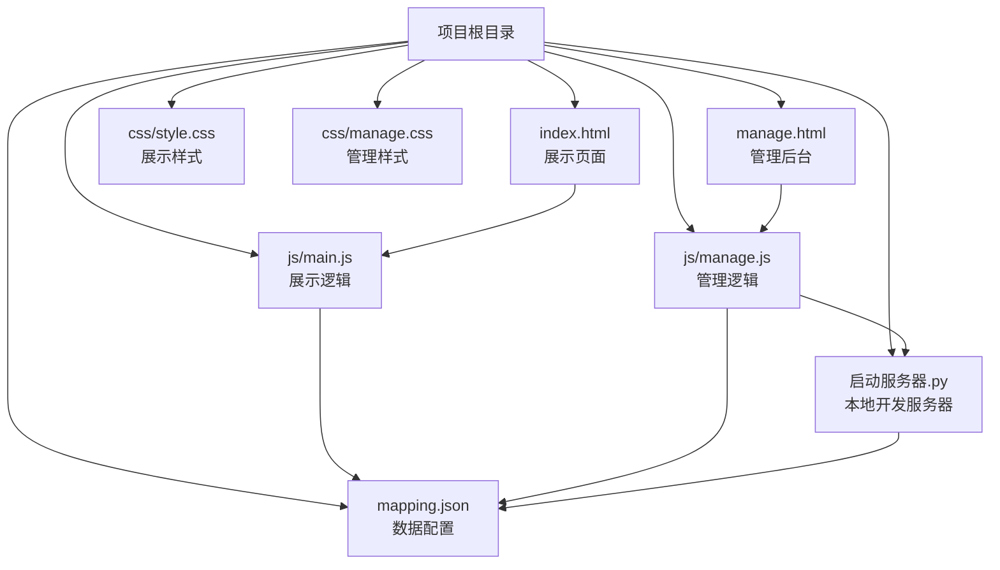
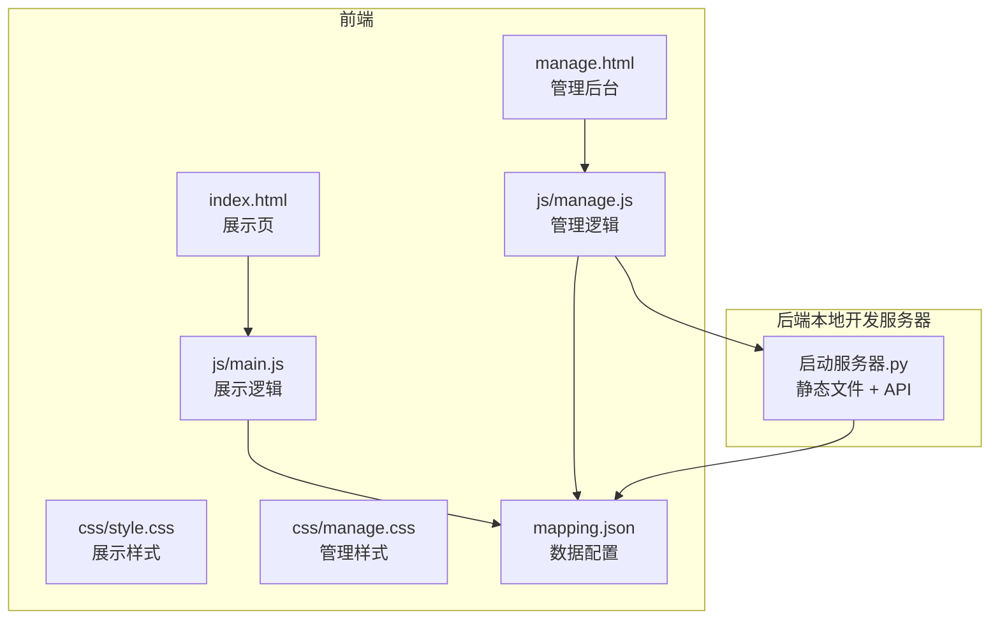
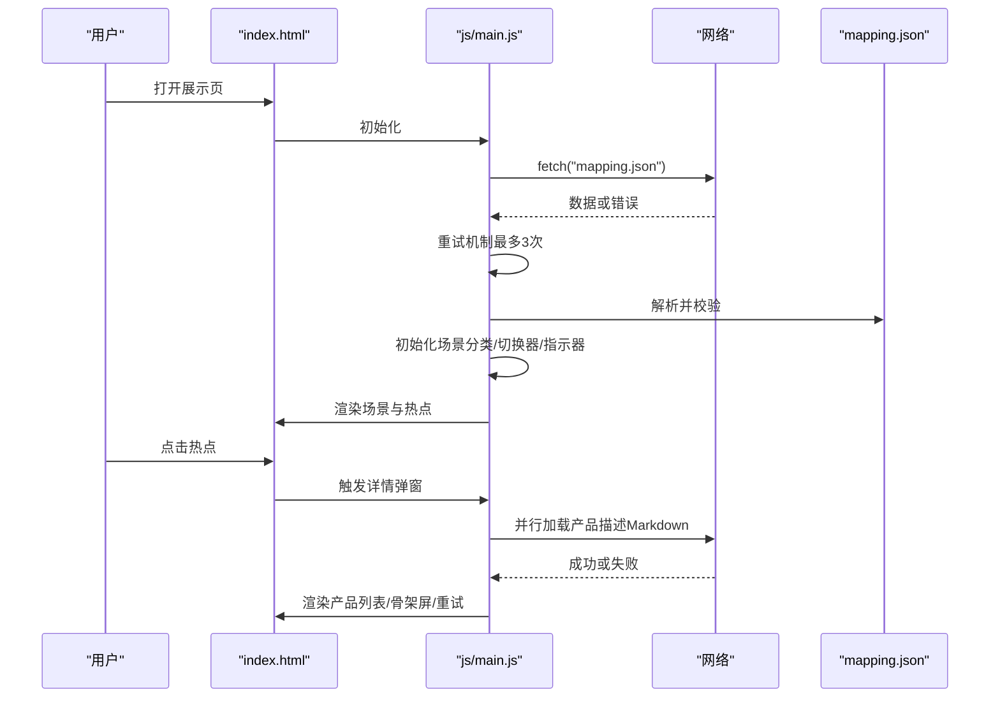
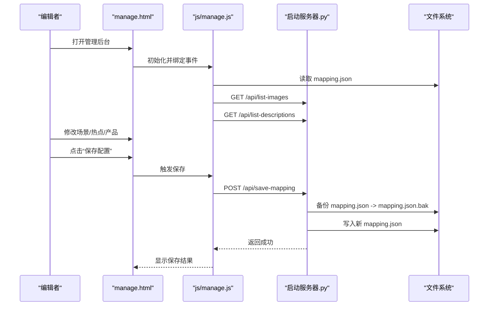
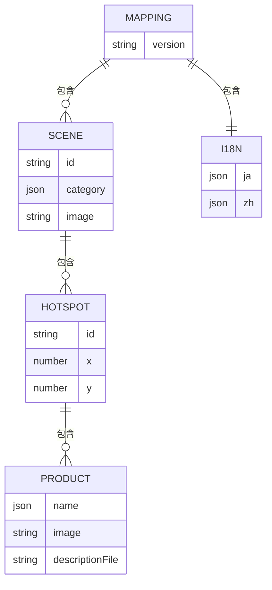
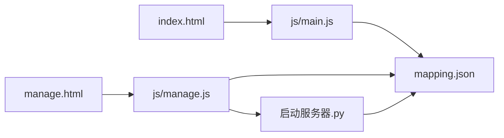

# 版本控制

<cite>
**本文引用的文件**
- [.gitignore](file://.gitignore)
- [project_architecture.md](file://project_architecture.md)
- [mapping.json](file://mapping.json)
- [启动服务器.py](file://启动服务器.py)
- [index.html](file://index.html)
- [manage.html](file://manage.html)
- [js/main.js](file://js/main.js)
- [js/manage.js](file://js/manage.js)
- [css/style.css](file://css/style.css)
- [css/manage.css](file://css/manage.css)
</cite>

## 目录
1. [简介](#简介)
2. [项目结构](#项目结构)
3. [核心组件](#核心组件)
4. [架构总览](#架构总览)
5. [详细组件分析](#详细组件分析)
6. [依赖关系分析](#依赖关系分析)
7. [性能考量](#性能考量)
8. [故障排查指南](#故障排查指南)
9. [结论](#结论)
10. [附录](#附录)

## 简介
本文件面向“数字标牌产品展示”项目，系统化梳理版本控制与协作开发流程，覆盖以下方面：
- Git 工作流程：分支策略（主分支保护、功能分支、热修复）、提交信息规范、合并请求流程
- 代码审查：PR 模板、审查清单、反馈处理机制
- 发布管理：版本号规则、发布分支、发布说明编写
- 团队协作：代码共享、冲突解决、文档更新流程
- 版本回滚与紧急修复操作指南
- CI/CD 集成：自动化测试、构建部署、质量检查的集成思路

说明：当前仓库未包含 GitHub Actions 等 CI/CD 配置文件，本文在现有代码与文档基础上，提出可落地的流程与实践建议。

## 项目结构
项目采用前端静态资源 + 本地开发服务器的轻量架构，核心文件组织如下：
- 静态页面：index.html（展示页）、manage.html（管理后台）
- 样式：css/style.css（展示页样式）、css/manage.css（管理后台样式）
- 逻辑：js/main.js（展示页交互）、js/manage.js（管理后台交互）
- 数据：mapping.json（场景/热点/产品/多语言配置）
- 服务器：启动服务器.py（提供静态文件服务与 API 端点）

图表来源
- [index.html:1-83](file://index.html#L1-L83)
- [manage.html:1-113](file://manage.html#L1-L113)
- [css/style.css:1-200](file://css/style.css#L1-L200)
- [css/manage.css:1-200](file://css/manage.css#L1-L200)
- [js/main.js:1-200](file://js/main.js#L1-L200)
- [js/manage.js:1-200](file://js/manage.js#L1-L200)
- [mapping.json:1-232](file://mapping.json#L1-L232)
- [启动服务器.py:1-298](file://启动服务器.py#L1-L298)

章节来源
- [project_architecture.md:43-108](file://project_architecture.md#L43-L108)
- [.gitignore:1-18](file://.gitignore#L1-L18)

## 核心组件
- 展示页面（index.html + js/main.js + css/style.css）
  - 功能：场景浏览、多语言切换、多热点交互、产品详情弹窗、图片预加载与错误重试
  - 数据来源：mapping.json（v4.0 起由独立 JSON 管理，替代硬编码数组）
- 管理后台（manage.html + js/manage.js + css/manage.css + 启动服务器.py）
  - 功能：可视化编辑场景/热点/产品，文件上传与列表，保存配置（含备份）
  - 依赖：本地开发服务器提供的 API（/api/save-mapping、/api/upload-image、/api/list-images、/api/list-descriptions）
- 数据配置（mapping.json）
  - 结构：version、scenes（场景数组）、i18n（多语言字典）
  - 作用：驱动前端渲染与管理后台编辑

章节来源
- [project_architecture.md:112-234](file://project_architecture.md#L112-L234)
- [启动服务器.py:76-251](file://启动服务器.py#L76-L251)
- [mapping.json:1-232](file://mapping.json#L1-L232)

## 架构总览
整体架构围绕“数据驱动”的前端渲染展开，管理后台通过本地服务器 API 写入 mapping.json，前端通过 fetch 动态加载数据并渲染。

图表来源
- [index.html:1-83](file://index.html#L1-L83)
- [manage.html:1-113](file://manage.html#L1-L113)
- [js/main.js:1-200](file://js/main.js#L1-L200)
- [js/manage.js:1-200](file://js/manage.js#L1-L200)
- [css/style.css:1-200](file://css/style.css#L1-L200)
- [css/manage.css:1-200](file://css/manage.css#L1-L200)
- [mapping.json:1-232](file://mapping.json#L1-L232)
- [启动服务器.py:25-251](file://启动服务器.py#L25-L251)

## 详细组件分析

### 展示页面（index.html + js/main.js + css/style.css）
- 数据加载与重试：从 mapping.json 动态加载，含最多 3 次递增延迟重试
- 多语言引擎：t()、getText()、switchLanguage()，支持日文/中文切换
- 场景渲染与切换：双层图片交叉淡入淡出、分类切换器、指示器
- 产品详情弹窗：骨架屏占位、Markdown 渲染、错误可重试
- 性能与体验：首屏独占带宽、预加载策略、防抖与状态锁

图表来源
- [js/main.js:49-73](file://js/main.js#L49-L73)
- [js/main.js:87-162](file://js/main.js#L87-L162)
- [js/main.js:463-703](file://js/main.js#L463-L703)
- [js/main.js:873-1025](file://js/main.js#L873-L1025)
- [mapping.json:1-232](file://mapping.json#L1-L232)

章节来源
- [project_architecture.md:446-608](file://project_architecture.md#L446-L608)
- [js/main.js:1-200](file://js/main.js#L1-L200)
- [css/style.css:1-200](file://css/style.css#L1-L200)

### 管理后台（manage.html + js/manage.js + 启动服务器.py）
- 数据加载：fetch mapping.json、/api/list-images、/api/list-descriptions
- 可视化编辑：场景列表、场景编辑区（分类名、场景图）、热点标记与拖拽、产品编辑器
- 保存流程：POST /api/save-mapping，先备份 mapping.json 再写入
- 文件上传：/api/upload-image，支持场景图与产品图两类

图表来源
- [js/manage.js:18-31](file://js/manage.js#L18-L31)
- [js/manage.js:35-72](file://js/manage.js#L35-L72)
- [js/manage.js:81-108](file://js/manage.js#L81-L108)
- [启动服务器.py:101-127](file://启动服务器.py#L101-L127)
- [启动服务器.py:204-251](file://启动服务器.py#L204-L251)

章节来源
- [project_architecture.md:712-760](file://project_architecture.md#L712-L760)
- [启动服务器.py:76-251](file://启动服务器.py#L76-L251)
- [js/manage.js:1-200](file://js/manage.js#L1-L200)
- [css/manage.css:1-200](file://css/manage.css#L1-L200)

### 数据模型（mapping.json）
- version：版本号（v4.0）
- scenes：场景数组，每项包含 id、category（多语言）、image、hotspots
- hotspots：热点数组，每项包含 id、x/y 百分比坐标、products
- products：产品数组，每项包含 name（多语言）、image、descriptionFile
- i18n：多语言字典（ja/zh）

图表来源
- [mapping.json:1-232](file://mapping.json#L1-L232)

章节来源
- [project_architecture.md:112-206](file://project_architecture.md#L112-L206)
- [mapping.json:1-232](file://mapping.json#L1-L232)

## 依赖关系分析
- 前端依赖
  - index.html 依赖 js/main.js 与 css/style.css
  - manage.html 依赖 js/manage.js 与 css/manage.css
  - 两者均依赖 mapping.json 提供的数据
- 后端依赖
  - 启动服务器.py 提供静态文件服务与 API（/api/*）
  - 管理后台通过 API 读写 mapping.json，并进行文件上传与列表查询
- 数据耦合
  - mapping.json 是核心数据源，展示页与管理后台均依赖其结构与内容

图表来源
- [index.html:1-83](file://index.html#L1-L83)
- [manage.html:1-113](file://manage.html#L1-L113)
- [js/main.js:1-200](file://js/main.js#L1-L200)
- [js/manage.js:1-200](file://js/manage.js#L1-L200)
- [mapping.json:1-232](file://mapping.json#L1-L232)
- [启动服务器.py:25-251](file://启动服务器.py#L25-L251)

章节来源
- [project_architecture.md:763-788](file://project_architecture.md#L763-L788)

## 性能考量
- 展示页
  - 首屏独占带宽策略：优先加载首屏图片，完成后启动其余图片预加载
  - 双层图片交叉淡入淡出：避免切换黑屏，提升视觉连续性
  - 骨架屏与错误可重试：改善弱网与加载失败体验
- 管理后台
  - 图片与描述文件列表懒加载，减少初始负担
  - 保存前自动备份 mapping.json，降低风险

章节来源
- [project_architecture.md:290-301](file://project_architecture.md#L290-L301)
- [project_architecture.md:344-352](file://project_architecture.md#L344-L352)
- [启动服务器.py:116-127](file://启动服务器.py#L116-L127)

## 故障排查指南
- mapping.json 加载失败
  - 现象：展示页初始化失败，全屏错误提示
  - 处理：检查 mapping.json 格式与路径；确认本地服务器正常运行
- 产品描述加载失败
  - 现象：详情弹窗显示“加载失败”，可点击重试
  - 处理：检查 Markdown 文件是否存在与可访问；确认路径正确
- 保存配置失败
  - 现象：管理后台显示“保存失败”
  - 处理：确认 /api/save-mapping 可用；检查 mapping.json 格式；查看服务器日志
- 图片上传失败
  - 现象：上传接口报错或返回失败
  - 处理：确认 /api/upload-image 请求格式与参数；检查目标目录权限

章节来源
- [js/main.js:49-73](file://js/main.js#L49-L73)
- [js/main.js:409-461](file://js/main.js#L409-L461)
- [js/manage.js:81-108](file://js/manage.js#L81-L108)
- [启动服务器.py:101-127](file://启动服务器.py#L101-L127)
- [启动服务器.py:129-202](file://启动服务器.py#L129-L202)

## 结论
本项目以 mapping.json 为核心数据源，结合本地开发服务器提供的 API，实现了“所见即所得”的可视化编辑与高性能前端展示。建议在现有基础上完善版本控制与协作流程，明确分支策略、提交规范、审查机制与发布流程，以支撑多人协作与持续交付。

## 附录

### Git 工作流程与分支管理策略
- 主分支保护
  - master/main 分支启用保护规则：禁止直接推送、强制启用管理员审批
  - 代码必须通过 PR 合并，至少一名审查者批准
- 功能分支
  - 命名规范：feature/模块名/简要描述
  - 合并策略：rebase 或 squash，保持提交历史整洁
- 热修复分支
  - 命名规范：hotfix/问题描述
  - 合并策略：同时合并至 main 与 develop，并打补丁标签

章节来源
- [project_architecture.md:1-9](file://project_architecture.md#L1-L9)

### 提交信息规范
- 格式：类型(范围): 摘要
- 类型：feat、fix、docs、style、refactor、perf、test、chore
- 示例：feat(js): 优化图片预加载策略

章节来源
- [js/main.js:1-27](file://js/main.js#L1-L27)

### 合并请求（PR）流程
- PR 模板
  - 标题：简述变更
  - 摘要：背景、改动点、影响范围
  - 截图/链接：相关页面/接口截图或链接
  - 测试要点：关键用例与验证步骤
- 审查清单
  - 代码风格与可读性
  - 性能与安全
  - 兼容性与回归测试
  - 文档与注释更新
- 反馈处理
  - 逐条回复审查意见
  - 修改后重新审查，直至通过

章节来源
- [project_architecture.md:1-9](file://project_architecture.md#L1-L9)

### 发布管理流程
- 版本号规则（语义化版本）
  - v主版本.次版本.修订号
  - 主版本：破坏性变更
  - 次版本：向下兼容的功能新增
  - 修订：向下兼容的问题修正
- 发布分支
  - release/vX.Y：准备发布的稳定分支
  - hotfix/vX.Y.Z：紧急修复分支
- 发布说明
  - 新增/改进/修复/已知问题
  - 依赖与兼容性说明
  - 升级与回滚指引

章节来源
- [mapping.json:1-3](file://mapping.json#L1-L3)
- [project_architecture.md:1-9](file://project_architecture.md#L1-L9)

### 团队协作规范
- 代码共享
  - 优先使用功能分支，避免直接在主分支提交
  - 提交前本地自测，确保通过 Lint 与最小化测试
- 冲突解决
  - rebase 优先于 merge，保持线性历史
  - 冲突需人工审查与验证
- 文档更新
  - 重大变更同步更新 project_architecture.md 与 README
  - API 变更同步更新启动服务器.py 注释与接口说明

章节来源
- [project_architecture.md:1-9](file://project_architecture.md#L1-L9)
- [启动服务器.py:1-20](file://启动服务器.py#L1-L20)

### 版本回滚与紧急修复
- 回滚步骤
  - 停止服务，回滚至最近一次稳定构建
  - 如涉及数据库/配置变更，回滚至对应备份
- 紧急修复
  - 从主分支切出 hotfix 分支，修复后合并至 main/develop
  - 打补丁标签并发布紧急版本

章节来源
- [启动服务器.py:116-127](file://启动服务器.py#L116-L127)

### CI/CD 集成建议
- 自动化测试
  - 前端：静态资源校验（HTML/CSS/JS 语法）、关键交互用例（模拟点击/切换）
  - 后端：API 接口测试（保存/上传/列表）
- 构建部署
  - 本地开发：启动服务器.py（端口检测与自动打开浏览器）
  - 生产部署：打包静态资源，配置反向代理与缓存策略
- 质量检查
  - Lint：ESLint（JS）、Stylelint（CSS）
  - 安全扫描：依赖漏洞扫描（如 pip-audit/OWASP Dependency-Check）
  - 自动化覆盖率与性能基线监控

章节来源
- [启动服务器.py:254-295](file://启动服务器.py#L254-L295)