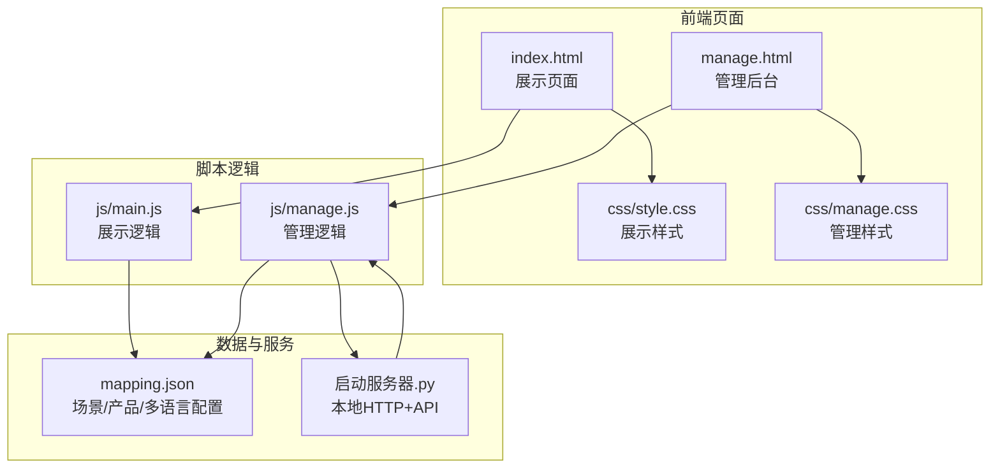
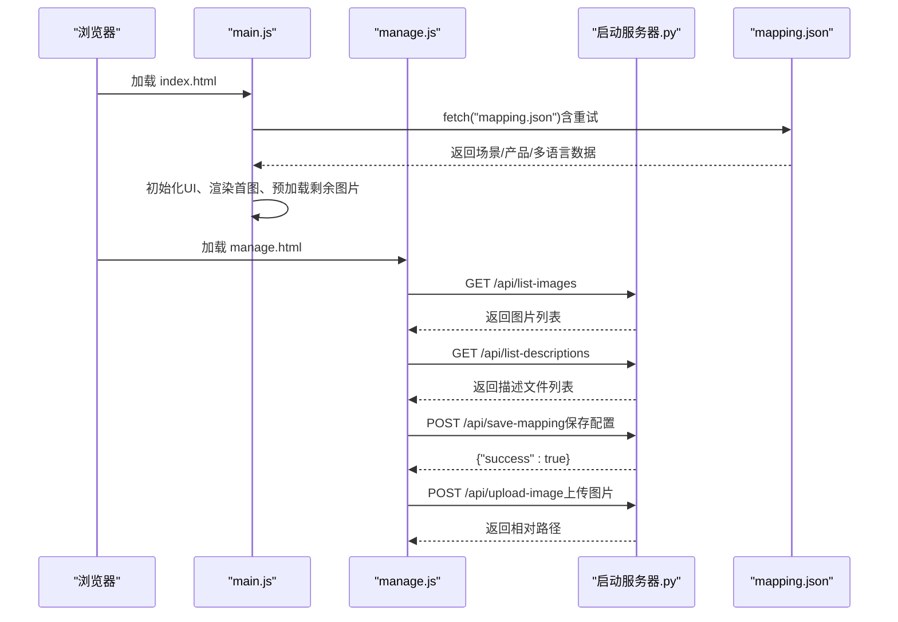
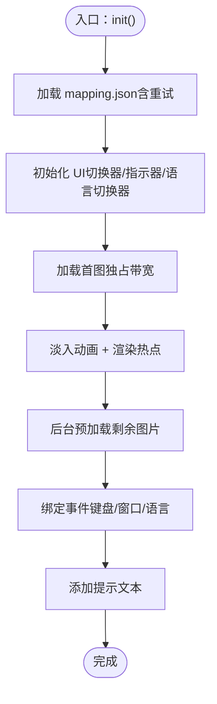
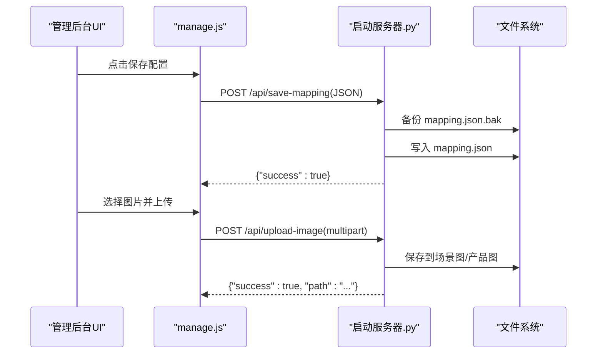
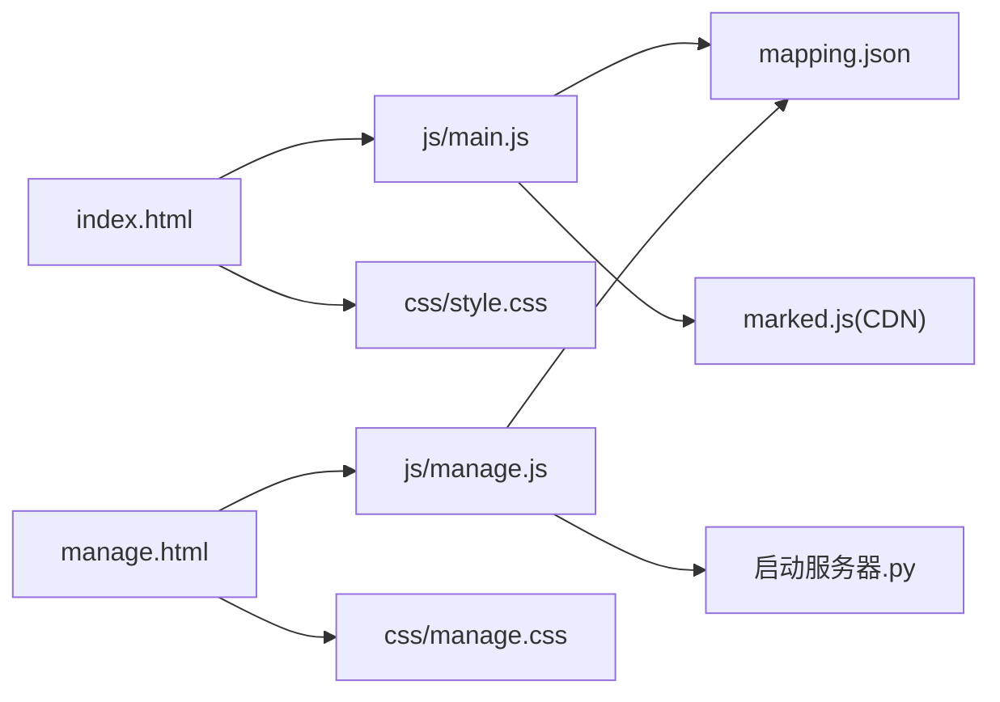

# 调试技巧

<cite>
**本文引用的文件**
- [index.html](file://index.html)
- [manage.html](file://manage.html)
- [js/main.js](file://js/main.js)
- [js/manage.js](file://js/manage.js)
- [css/style.css](file://css/style.css)
- [css/manage.css](file://css/manage.css)
- [mapping.json](file://mapping.json)
- [project_architecture.md](file://project_architecture.md)
- [启动服务器.py](file://启动服务器.py)
</cite>

## 目录
1. [简介](#简介)
2. [项目结构](#项目结构)
3. [核心组件](#核心组件)
4. [架构总览](#架构总览)
5. [详细组件分析](#详细组件分析)
6. [依赖关系分析](#依赖关系分析)
7. [性能考量](#性能考量)
8. [故障排查指南](#故障排查指南)
9. [结论](#结论)
10. [附录](#附录)

## 简介
本指南聚焦于数字标牌产品展示项目的调试技巧与工具使用方法，涵盖浏览器开发者工具的Elements/Console/Network/Performance面板实践、JavaScript调试（断点、变量监视、调用栈）、关键调试点定位（main.js与manage.js）、网络请求调试（API端点测试与响应校验）、图片加载与缓存问题排查（预加载与跨域）、以及性能分析与优化建议（内存泄漏检测与渲染优化）。文档以仓库现有源码为依据，提供可操作的调试步骤与可视化图示，帮助开发者快速定位问题并提升体验。

## 项目结构
项目采用“静态资源 + 原生JS + 本地Python服务器”的轻量架构：
- 展示页面：index.html + js/main.js + css/style.css
- 管理后台：manage.html + js/manage.js + css/manage.css
- 数据配置：mapping.json
- 本地服务器：启动服务器.py（内置API端点）

图表来源
- [index.html:1-83](file://index.html#L1-L83)
- [manage.html:1-113](file://manage.html#L1-L113)
- [js/main.js:1-1284](file://js/main.js#L1-L1284)
- [js/manage.js:1-811](file://js/manage.js#L1-L811)
- [css/style.css:1-997](file://css/style.css#L1-L997)
- [css/manage.css:1-824](file://css/manage.css#L1-L824)
- [mapping.json:1-232](file://mapping.json#L1-L232)
- [启动服务器.py:1-298](file://启动服务器.py#L1-L298)

章节来源
- [project_architecture.md:43-108](file://project_architecture.md#L43-L108)

## 核心组件
- 展示页面核心逻辑（main.js）
  - 数据加载与重试、多语言引擎、DOM引用、状态管理、图片预加载与等待、Markdown描述缓存与加载、场景渲染与切换、多热点渲染与交互、详情面板与动画、语言切换器、事件绑定与初始化。
- 管理后台核心逻辑（manage.js）
  - 初始化与事件绑定、数据加载（mapping.json、图片/描述列表）、场景列表渲染、场景编辑区（分类名/图片/热点）、热点拖拽、产品编辑器、添加场景对话框、ID生成、图片上传、Toast提示、窗口调整重渲染。

章节来源
- [js/main.js:1-1284](file://js/main.js#L1-L1284)
- [js/manage.js:1-811](file://js/manage.js#L1-L811)
- [project_architecture.md:446-708](file://project_architecture.md#L446-L708)

## 架构总览
展示页面与管理后台通过mapping.json解耦，管理后台通过本地Python服务器提供的API端点与之交互。浏览器开发者工具贯穿数据加载、渲染、事件与网络请求的调试全过程。

图表来源
- [js/main.js:49-73](file://js/main.js#L49-L73)
- [js/manage.js:35-72](file://js/manage.js#L35-L72)
- [启动服务器.py:75-98](file://启动服务器.py#L75-L98)
- [启动服务器.py:101-128](file://启动服务器.py#L101-L128)
- [启动服务器.py:129-203](file://启动服务器.py#L129-L203)
- [启动服务器.py:204-251](file://启动服务器.py#L204-L251)

## 详细组件分析

### 展示页面调试要点（main.js）
- 数据加载与重试
  - 关键调点：loadMapping()（含3次递增延迟重试），init()中首次加载失败时显示全屏错误。
  - 调试建议：在Console面板观察重试日志与错误堆栈；Network面板监控mapping.json请求状态码与耗时。
- 图片预加载与等待
  - 关键调点：preloadAllImages()、waitForImageLoad()、isImageCached()/isImagePreloaded()。
  - 调试建议：在Network面板筛选图片资源，观察缓存命中与重试行为；在Elements面板检查loading-indicator显隐。
- 场景渲染与切换
  - 关键调点：renderScene()、prevScene()/nextScene()/goToScene()、createSwitcher()/updateSwitcher()。
  - 调试建议：在Performance面板录制切换过程，关注交叉淡入淡出动画与图片加载等待；在Elements面板检查active/inactive类切换。
- 多热点渲染与交互
  - 关键调点：renderHotspots()、calcHotspotPixelPosition()、repositionHotspots()、onHotspotClick()。
  - 调试建议：在Elements面板检查热点DOM结构与定位；在Console面板验证calcHotspotPixelPosition()返回值；在Performance面板观察热点重定位的防抖效果。
- 详情面板与动画
  - 关键调点：renderProductList()（并行加载Markdown）、openDetailAnimation()/closeDetail()。
  - 调试建议：在Network面板观察描述文件请求；在Elements面板检查骨架屏与加载状态；在Performance面板录制面板开合动画。
- 语言切换器
  - 关键调点：createLangSwitcher()/updateLangSwitcherState()、switchLanguage()。
  - 调试建议：在Console面板观察语言切换日志；在Elements面板检查按钮活跃态与标题更新。

图表来源
- [js/main.js:1197-1281](file://js/main.js#L1197-L1281)

章节来源
- [js/main.js:49-73](file://js/main.js#L49-L73)
- [js/main.js:257-327](file://js/main.js#L257-L327)
- [js/main.js:354-395](file://js/main.js#L354-L395)
- [js/main.js:480-595](file://js/main.js#L480-L595)
- [js/main.js:716-847](file://js/main.js#L716-L847)
- [js/main.js:888-956](file://js/main.js#L888-L956)
- [js/main.js:1036-1094](file://js/main.js#L1036-L1094)
- [js/main.js:1197-1281](file://js/main.js#L1197-L1281)

### 管理后台调试要点（manage.js）
- 初始化与事件绑定
  - 关键调点：DOMContentLoaded -> bindToolbarEvents/bindEditorEvents/bindDialogEvents -> loadMappingData/loadImageList/loadDescriptionList -> renderSceneList。
  - 调试建议：在Console面板确认初始化顺序与API请求结果；在Elements面板检查三栏布局与交互元素。
- 数据加载与API
  - 关键调点：loadMappingData()、loadImageList()、loadDescriptionList()、saveMapping()、uploadImage()。
  - 调试建议：在Network面板监控/api/*端点；在Console面板观察错误提示与状态更新。
- 场景列表与编辑
  - 关键调点：renderSceneList()、selectScene()、updateSceneEditor()、renderHotspots()。
  - 调试建议：在Elements面板检查缩略图与删除按钮；在Console面板验证坐标更新与选中态切换。
- 热点拖拽与产品编辑
  - 关键调点：startDrag/onDrag/endDrag、createProductEditItem()、addProductToHotspot()。
  - 调试建议：在Console面板观察坐标四舍五入精度；在Elements面板检查选中/拖拽态样式。
- 添加场景与上传
  - 关键调点：confirmAddScene()、uploadImage()。
  - 调试建议：在Network面板观察multipart上传与返回路径；在Console面板确认文件名与目录结构。

图表来源
- [js/manage.js:82-108](file://js/manage.js#L82-L108)
- [启动服务器.py:101-128](file://启动服务器.py#L101-L128)
- [启动服务器.py:129-203](file://启动服务器.py#L129-L203)

章节来源
- [js/manage.js:17-31](file://js/manage.js#L17-L31)
- [js/manage.js:35-72](file://js/manage.js#L35-L72)
- [js/manage.js:112-185](file://js/manage.js#L112-L185)
- [js/manage.js:273-310](file://js/manage.js#L273-L310)
- [js/manage.js:389-438](file://js/manage.js#L389-L438)
- [js/manage.js:468-541](file://js/manage.js#L468-L541)
- [js/manage.js:599-617](file://js/manage.js#L599-L617)
- [js/manage.js:691-728](file://js/manage.js#L691-L728)
- [js/manage.js:763-781](file://js/manage.js#L763-L781)
- [启动服务器.py:75-98](file://启动服务器.py#L75-L98)
- [启动服务器.py:101-128](file://启动服务器.py#L101-L128)
- [启动服务器.py:129-203](file://启动服务器.py#L129-L203)

## 依赖关系分析
- 展示页面依赖
  - index.html引入js/main.js与css/style.css；依赖mapping.json提供数据；依赖CDN marked.js解析Markdown。
- 管理后台依赖
  - manage.html引入js/manage.js与css/manage.css；依赖本地Python服务器提供的/api/*端点；依赖mapping.json进行可视化编辑。
- 样式与交互
  - style.css与manage.css分别定义展示与管理的UI样式与动画；main.js与manage.js通过DOM操作与事件绑定驱动交互。

图表来源
- [index.html:1-83](file://index.html#L1-L83)
- [manage.html:1-113](file://manage.html#L1-L113)
- [js/main.js:1-1284](file://js/main.js#L1-L1284)
- [js/manage.js:1-811](file://js/manage.js#L1-L811)
- [css/style.css:1-997](file://css/style.css#L1-L997)
- [css/manage.css:1-824](file://css/manage.css#L1-L824)
- [mapping.json:1-232](file://mapping.json#L1-L232)
- [启动服务器.py:1-298](file://启动服务器.py#L1-L298)

章节来源
- [project_architecture.md:29-41](file://project_architecture.md#L29-L41)

## 性能考量
- 图片加载与缓存
  - 首图独占带宽策略：首图完全显示后再启动后台预加载，避免慢速网络下首图超时永不显示。
  - 图片等待机制：waitForImageLoad()使用addEventListener + { once: true }避免监听器泄漏，超时保护与complete属性校验。
- 渲染性能
  - 交叉淡入淡出使用requestAnimationFrame与CSS过渡，减少强制同步布局。
  - 热点重定位采用防抖（200ms）降低频繁resize带来的计算压力。
- 并行加载
  - 详情面板并行加载多个Markdown描述，显著缩短首屏等待时间。
- 内存与事件
  - 图片加载监听器使用{ once: true }，避免累积；详情面板关闭后清理状态与DOM引用。

章节来源
- [js/main.js:1197-1281](file://js/main.js#L1197-L1281)
- [js/main.js:354-395](file://js/main.js#L354-L395)
- [js/main.js:826-847](file://js/main.js#L826-L847)
- [js/main.js:931-956](file://js/main.js#L931-L956)
- [js/main.js:1140-1148](file://js/main.js#L1140-L1148)

## 故障排查指南

### 浏览器开发者工具使用
- Elements面板
  - 检查DOM结构与类名（如.active/.inactive、.visible、.hidden）是否符合预期。
  - 验证热点容器与场景图的层级关系，确认定位计算正确。
- Console面板
  - 观察日志与错误信息（如图片加载失败、Markdown加载失败、API错误）。
  - 使用断点调试关键函数（如renderScene、onHotspotClick、switchLanguage）。
- Network面板
  - 监控mapping.json、图片资源、Markdown描述文件的请求状态与耗时。
  - 过滤XHR/Fetch请求，查看响应体与响应头（含CORS）。
- Performance面板
  - 录制场景切换、面板开合、窗口resize等关键交互，观察主线程占用与长任务。

### JavaScript调试技巧
- 断点设置
  - 在main.js的关键函数（如renderScene、waitForImageLoad、calcHotspotPixelPosition）设置断点。
  - 在manage.js的关键函数（如saveMapping、uploadImage、renderHotspots）设置断点。
- 变量监视
  - 监视state对象、dom引用、mappingData、descriptionCache等全局状态。
- 调用栈分析
  - 在断点处查看调用栈，确认事件触发链路（如点击热点 -> onHotspotClick -> renderProductList）。

### 网络请求调试
- API端点测试
  - 使用Network面板直接发起请求，验证/save-mapping、/upload-image、/list-images、/list-descriptions的行为与返回。
- 响应数据检查
  - 检查JSON结构是否完整，特别是save-mapping的备份与写入逻辑。
- 错误处理验证
  - 模拟请求体为空、JSON解析失败、文件缺失等边界情况，确认错误响应与提示。

### 图片加载与缓存问题
- 预加载机制验证
  - 在Network面板观察图片资源请求，确认preloadAllImages()是否命中浏览器缓存。
- 跨域问题排查
  - 检查CORS响应头（Access-Control-Allow-*），确认本地开发环境允许跨域。
- 加载失败与超时
  - 使用waitForImageLoad()的超时保护与失败回调，结合Console日志定位问题。

### 性能分析与优化
- 内存泄漏检测
  - 使用Performance面板的内存快照对比，确认事件监听器是否正确移除（{ once: true }）。
- 渲染性能优化
  - 减少不必要的DOM查询与样式读写，使用requestAnimationFrame批量更新。
  - 控制热点重定位频率，避免高频resize导致的性能抖动。

章节来源
- [js/main.js:354-395](file://js/main.js#L354-L395)
- [js/main.js:480-595](file://js/main.js#L480-L595)
- [js/main.js:716-847](file://js/main.js#L716-L847)
- [js/main.js:888-956](file://js/main.js#L888-L956)
- [js/manage.js:82-108](file://js/manage.js#L82-L108)
- [js/manage.js:763-781](file://js/manage.js#L763-L781)
- [启动服务器.py:28-47](file://启动服务器.py#L28-L47)
- [启动服务器.py:101-128](file://启动服务器.py#L101-L128)
- [启动服务器.py:129-203](file://启动服务器.py#L129-L203)
- [启动服务器.py:204-251](file://启动服务器.py#L204-L251)

## 结论
通过系统化的浏览器开发者工具使用与JavaScript调试技巧，结合对main.js与manage.js关键调点的深入理解，可以高效定位并解决数字标牌产品展示项目中的数据加载、图片缓存、网络请求与性能问题。建议在开发与维护过程中持续利用Network与Performance面板进行回归测试，确保在不同网络与设备条件下的稳定表现。

## 附录
- 本地服务器与API端点
  - 默认端口：8082
  - 端点：
    - POST /api/save-mapping：保存mapping.json（自动备份）
    - POST /api/upload-image：上传图片到指定目录
    - GET /api/list-images：返回场景图与产品图列表
    - GET /api/list-descriptions：返回产品描述文件列表

章节来源
- [启动服务器.py:266-298](file://启动服务器.py#L266-L298)
- [启动服务器.py:75-98](file://启动服务器.py#L75-L98)
- [启动服务器.py:101-128](file://启动服务器.py#L101-L128)
- [启动服务器.py:129-203](file://启动服务器.py#L129-L203)
- [启动服务器.py:204-251](file://启动服务器.py#L204-L251)