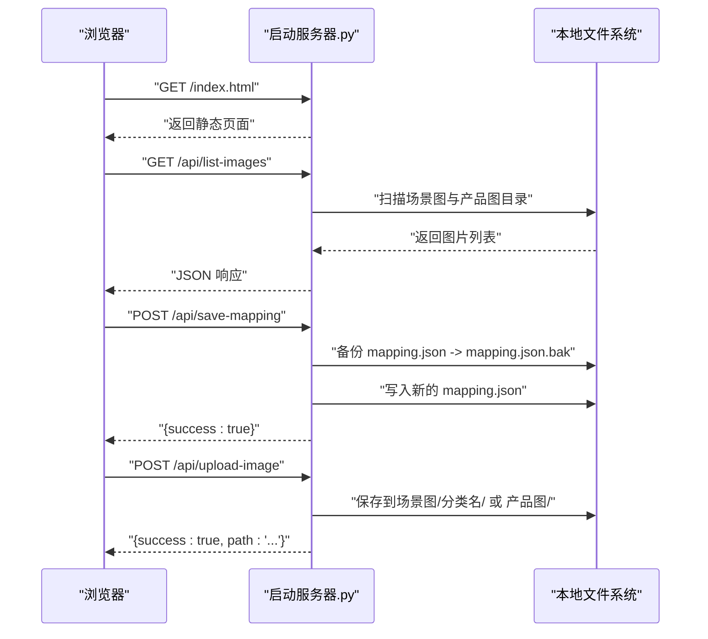
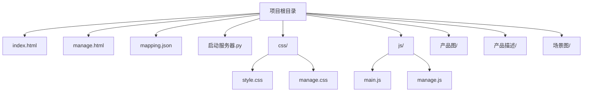

# 快速开始

<cite>
**本文引用的文件**
- [启动服务器.py](file://启动服务器.py)
- [index.html](file://index.html)
- [manage.html](file://manage.html)
- [mapping.json](file://mapping.json)
- [project_architecture.md](file://project_architecture.md)
- [js/main.js](file://js/main.js)
- [js/manage.js](file://js/manage.js)
- [css/style.css](file://css/style.css)
- [css/manage.css](file://css/manage.css)
- [产品描述/室内双面吊装标牌.md](file://产品描述/室内双面吊装标牌.md)
- [产品描述/电子水牌.md](file://产品描述/电子水牌.md)
</cite>

## 目录
1. [简介](#简介)
2. [环境要求](#环境要求)
3. [安装与部署](#安装与部署)
4. [启动服务器.py 工作原理与配置](#启动服务器py-工作原理与配置)
5. [访问页面与管理后台](#访问页面与管理后台)
6. [项目目录结构概览](#项目目录结构概览)
7. [基本使用示例](#基本使用示例)
8. [常见问题与排障](#常见问题与排障)
9. [性能与优化建议](#性能与优化建议)
10. [结语](#结语)

## 简介
本项目是一个数字标牌产品展示页面，支持中日文双语切换、场景化展示与热点交互，并提供可视化管理后台，便于非技术人员维护场景、热点与产品配置。项目采用纯前端与本地 Python 服务器实现，无需额外依赖，适合快速搭建与演示。

## 环境要求
- Python 版本
  - 项目使用标准库 HTTP 服务器，推荐使用 Python 3.x（例如 3.8+）运行本地开发服务器。
- 浏览器兼容性
  - 展示页面与管理后台均使用原生 JavaScript 与现代 CSS，建议使用较新的浏览器（Chrome、Edge、Firefox、Safari）以获得最佳体验。
  - 展示页面通过 CDN 引入 Markdown 解析库，需保证网络可访问该资源。
- 操作系统
  - Windows、macOS、Linux 均可运行。

章节来源
- [启动服务器.py:254-264](file://启动服务器.py#L254-L264)
- [project_architecture.md:29-39](file://project_architecture.md#L29-L39)

## 安装与部署
以下步骤将帮助你从零开始部署并运行项目：

1. 克隆或下载代码仓库到本地任意目录。
2. 确保本地已安装 Python 3.x。
3. 打开终端或命令行，进入项目根目录。
4. 运行本地开发服务器脚本：
   - Windows：双击“启动服务器.py”文件，或在命令行中执行 python 启动服务器.py。
   - macOS/Linux：在终端中执行 python3 启动服务器.py。
5. 服务器启动后会自动打开浏览器访问展示页面；同时可在浏览器中访问管理后台进行可视化编辑。

章节来源
- [启动服务器.py:266-298](file://启动服务器.py#L266-L298)
- [project_architecture.md:23-26](file://project_architecture.md#L23-L26)

## 启动服务器.py 工作原理与配置
启动服务器.py 是一个增强的本地开发服务器，它在提供静态文件服务的同时，新增了 4 个 API 端点，供管理后台使用。

- 默认端口
  - 服务器默认监听 8082 端口；若该端口被占用，脚本会自动寻找可用端口并在控制台输出最终访问地址。
- CORS 支持
  - 服务器为所有响应设置了允许跨域的响应头，便于前端页面与 API 的通信。
- API 端点
  - POST /api/save-mapping：保存 mapping.json（自动备份原文件为 .bak）。
  - POST /api/upload-image：上传图片到指定目录（支持场景图与产品图两类）。
  - GET /api/list-images：返回所有图片文件列表（按场景分类与产品图分类组织）。
  - GET /api/list-descriptions：返回所有产品描述文件（.md）列表。
- 自动打开浏览器
  - 启动后自动打开默认浏览器访问展示页面。

图表来源
- [启动服务器.py:25-98](file://启动服务器.py#L25-L98)
- [启动服务器.py:101-202](file://启动服务器.py#L101-L202)
- [启动服务器.py:204-252](file://启动服务器.py#L204-L252)

章节来源
- [启动服务器.py:19](file://启动服务器.py#L19)
- [启动服务器.py:254-264](file://启动服务器.py#L254-L264)
- [启动服务器.py:266-298](file://启动服务器.py#L266-L298)
- [project_architecture.md:763-796](file://project_architecture.md#L763-L796)

## 访问页面与管理后台
- 展示页面
  - 默认地址：http://localhost:8082/index.html
  - 功能：场景轮播、脉冲热点、产品详情弹窗、中日文切换、场景分类切换器。
- 管理后台
  - 默认地址：http://localhost:8082/manage.html
  - 功能：场景列表、场景编辑（分类名、场景图）、热点拖拽定位、产品关联编辑、保存配置。
- 端口说明
  - 若 8082 端口被占用，脚本会自动选择下一个可用端口；最终访问地址会在控制台打印。

章节来源
- [project_architecture.md:23-26](file://project_architecture.md#L23-L26)
- [启动服务器.py:271](file://启动服务器.py#L271)

## 项目目录结构概览
- 根目录
  - index.html：展示主页面
  - manage.html：管理后台页面
  - mapping.json：场景/产品/多语言数据配置
  - 启动服务器.py：本地开发服务器（含 API 端点）
- 子目录
  - css/：样式文件（style.css、manage.css）
  - js/：前端逻辑（main.js、manage.js）
  - 产品图/：产品白底图（.webp）
  - 产品描述/：Markdown 格式的产品描述
  - 场景图/：场景应用图（按场景分类组织）

图表来源
- [project_architecture.md:43-108](file://project_architecture.md#L43-L108)

章节来源
- [project_architecture.md:43-108](file://project_architecture.md#L43-L108)

## 基本使用示例
- 立即运行
  - 双击“启动服务器.py”或在命令行执行 python 启动服务器.py，等待浏览器自动打开。
- 查看展示页面
  - 在浏览器中访问 http://localhost:8082/index.html，即可看到场景轮播与脉冲热点。
- 使用管理后台
  - 在浏览器中访问 http://localhost:8082/manage.html，进行场景与热点的可视化编辑。
- 保存配置
  - 在管理后台点击“保存配置”，服务器会自动备份 mapping.json 并写入新配置。

章节来源
- [project_architecture.md:23-26](file://project_architecture.md#L23-L26)
- [启动服务器.py:271](file://启动服务器.py#L271)

## 常见问题与排障
- 端口冲突
  - 现象：启动时报错或无法访问。
  - 处理：关闭占用 8082 端口的程序，或等待脚本自动选择下一个可用端口。
  - 参考：端口查找逻辑与自动选择。
- 文件权限问题
  - 现象：保存配置或上传图片失败。
  - 处理：确保项目目录具有读写权限；在 Windows 上以管理员身份运行命令行或脚本。
- 网络受限导致 Markdown 解析库加载失败
  - 现象：展示页面提示加载失败或部分功能异常。
  - 处理：检查网络连通性，确保可访问 CDN 资源；或离线放置对应资源。
- 图片未显示或路径错误
  - 现象：场景图或产品图不显示。
  - 处理：确认图片文件位于正确目录（场景图/分类名/ 与 产品图/），并使用管理后台上传接口进行上传；检查 mapping.json 中的路径是否与实际一致。
- 语言切换无效
  - 现象：点击语言切换按钮无变化。
  - 处理：确认 mapping.json 中 i18n 字段完整；检查浏览器控制台是否有错误。

章节来源
- [启动服务器.py:254-264](file://启动服务器.py#L254-L264)
- [启动服务器.py:101-127](file://启动服务器.py#L101-L127)
- [启动服务器.py:129-202](file://启动服务器.py#L129-L202)
- [启动服务器.py:204-252](file://启动服务器.py#L204-L252)
- [project_architecture.md:763-796](file://project_architecture.md#L763-L796)

## 性能与优化建议
- 图片加载优化
  - 使用 .webp 格式以减小体积；合理控制场景图与产品图尺寸。
  - 首屏独占带宽策略：优先加载首屏图片，完成后才进行预加载，减少慢网下的阻塞。
- 预加载策略
  - 管理后台与展示页面均实现了图片预加载与缓存，建议保持默认配置以获得最佳体验。
- 服务器稳定性
  - 本地开发服务器为单线程，适合演示与开发；生产环境建议使用成熟的 Web 服务器或静态托管服务。

章节来源
- [js/main.js:49-73](file://js/main.js#L49-L73)
- [js/manage.js:35-72](file://js/manage.js#L35-L72)

## 结语
通过以上步骤，你可以快速启动并运行数字标牌产品展示项目。如需进一步定制场景、热点与产品配置，欢迎使用管理后台进行可视化编辑，并随时保存到 mapping.json。祝你开发顺利！