# JavaScript性能优化

<cite>
**本文引用的文件**
- [index.html](file://index.html)
- [manage.html](file://manage.html)
- [main.js](file://js/main.js)
- [manage.js](file://js/manage.js)
- [style.css](file://css/style.css)
- [manage.css](file://css/manage.css)
- [mapping.json](file://mapping.json)
- [project_architecture.md](file://project_architecture.md)
</cite>

## 目录
1. [简介](#简介)
2. [项目结构](#项目结构)
3. [核心组件](#核心组件)
4. [架构总览](#架构总览)
5. [详细组件分析](#详细组件分析)
6. [依赖关系分析](#依赖关系分析)
7. [性能考量](#性能考量)
8. [故障排查指南](#故障排查指南)
9. [结论](#结论)
10. [附录](#附录)

## 简介
本指南围绕数字标牌项目的前端实现，系统梳理JavaScript性能优化策略，涵盖异步加载、防抖与节流、DOM优化、算法与数据结构、渲染性能以及性能测试与基准方法。通过对现有代码的深入分析，提炼出可复用的工程实践，帮助在复杂交互场景（如场景切换、多热点渲染、详情弹窗、管理后台编辑）中获得流畅体验与稳定性能。

## 项目结构
项目采用“数据与逻辑分离”的架构：数据由 mapping.json 提供，前端通过 fetch 动态加载；展示页与管理后台分别由独立的 HTML/CSS/JS 文件实现，职责清晰、便于维护与扩展。

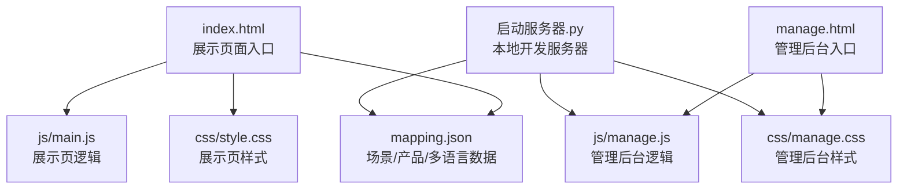

图表来源
- [index.html:1-83](file://index.html#L1-L83)
- [manage.html:1-113](file://manage.html#L1-L113)
- [main.js:1-1284](file://js/main.js#L1-L1284)
- [manage.js:1-811](file://js/manage.js#L1-L811)
- [style.css:1-997](file://css/style.css#L1-L997)
- [manage.css:1-824](file://css/manage.css#L1-L824)
- [mapping.json:1-232](file://mapping.json#L1-L232)
- [project_architecture.md:1-965](file://project_architecture.md#L1-L965)

章节来源
- [project_architecture.md:43-108](file://project_architecture.md#L43-L108)

## 核心组件
- 数据加载与重试：通过 fetch + 递增延迟重试，保障弱网环境下的稳定性。
- 多语言引擎：统一的 t()/getText() 与 switchLanguage()，减少重复逻辑与提升一致性。
- 图片预加载与缓存：预加载全场景与产品图片，结合缓存与超时保护，降低切换卡顿。
- Markdown缓存与加载：descriptionCache 避免重复请求，失败时提供可点击重试。
- 场景渲染与切换：双层交叉淡入淡出，配合 requestAnimationFrame 与超时检测，保证视觉连续性。
- 多热点渲染与交互：热点坐标计算与重定位，支持多热点同时渲染与动画错峰。
- 详情弹窗：骨架屏占位、并行加载、错误可重试，提升感知速度与可用性。
- 管理后台：三栏布局、拖拽热点、实时保存、Toast 提示，兼顾效率与体验。

章节来源
- [main.js:29-73](file://js/main.js#L29-L73)
- [main.js:87-162](file://js/main.js#L87-L162)
- [main.js:257-327](file://js/main.js#L257-L327)
- [main.js:421-442](file://js/main.js#L421-L442)
- [main.js:480-595](file://js/main.js#L480-L595)
- [main.js:716-759](file://js/main.js#L716-L759)
- [main.js:873-950](file://js/main.js#L873-L950)
- [manage.js:17-31](file://js/manage.js#L17-L31)
- [manage.js:35-72](file://js/manage.js#L35-L72)
- [manage.js:189-235](file://js/manage.js#L189-L235)
- [manage.js:273-284](file://js/manage.js#L273-L284)
- [manage.js:389-438](file://js/manage.js#L389-L438)
- [manage.js:442-476](file://js/manage.js#L442-L476)

## 架构总览
展示页与管理后台共享“数据驱动 + 异步加载 + 视觉反馈”的设计范式，通过 CSS 动画与骨架屏缓解等待感，通过缓存与预加载降低首屏与切换延迟。

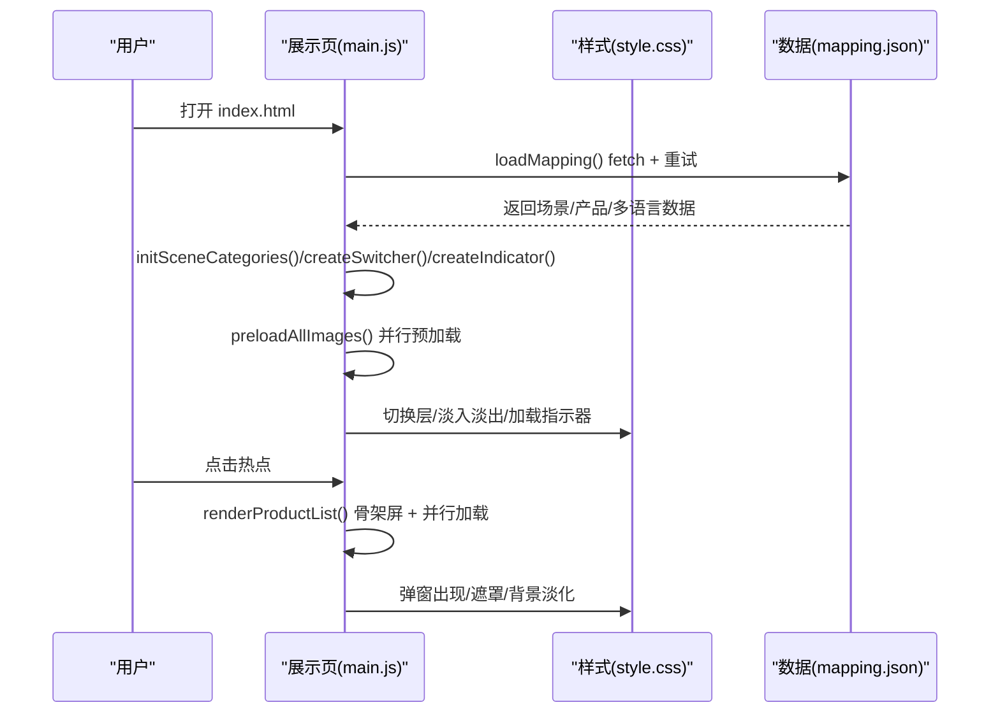

图表来源
- [main.js:49-73](file://js/main.js#L49-L73)
- [main.js:217-229](file://js/main.js#L217-L229)
- [main.js:257-327](file://js/main.js#L257-L327)
- [main.js:480-595](file://js/main.js#L480-L595)
- [main.js:873-950](file://js/main.js#L873-L950)
- [style.css:93-127](file://css/style.css#L93-L127)
- [style.css:795-826](file://css/style.css#L795-L826)
- [style.css:833-863](file://css/style.css#L833-L863)

## 详细组件分析

### 异步加载与重试策略
- fetch + Promise 链式调用：封装重试逻辑，逐次增加延迟，避免频繁请求导致拥塞。
- 超时保护：waitForImageLoad 为图片加载设置超时，防止长时间阻塞 UI。
- 缓存策略：descriptionCache 与 preloadedImages 避免重复请求与重复下载。
- 并行加载：Promise.all 并行预加载与并行加载 Markdown，缩短总耗时。

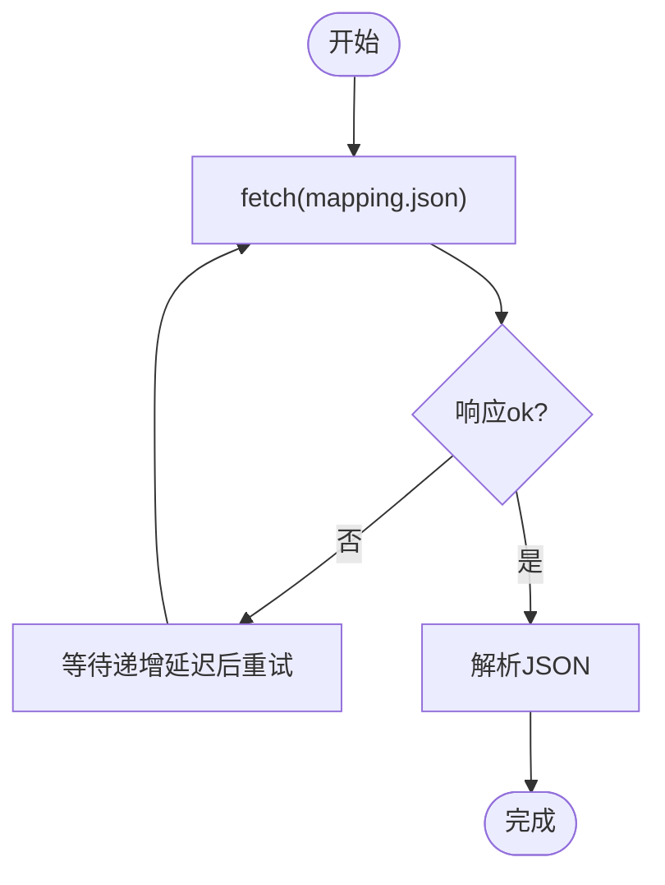

图表来源
- [main.js:49-73](file://js/main.js#L49-L73)

章节来源
- [main.js:49-73](file://js/main.js#L49-L73)
- [main.js:257-327](file://js/main.js#L257-L327)
- [main.js:421-442](file://js/main.js#L421-L442)
- [main.js:354-395](file://js/main.js#L354-L395)

### 多语言与状态管理
- 多语言引擎：t() 与 getText() 统一获取 UI 文本与多语言对象值；switchLanguage() 切换语言并刷新 UI。
- 状态管理：state 对象集中管理当前索引、过渡状态、活跃层、预加载缓存、当前语言与弹窗产品集合。
- 动态分类映射：initSceneCategories() 基于 mappingData.scenes 动态生成分类映射，支持语言切换后自动更新。

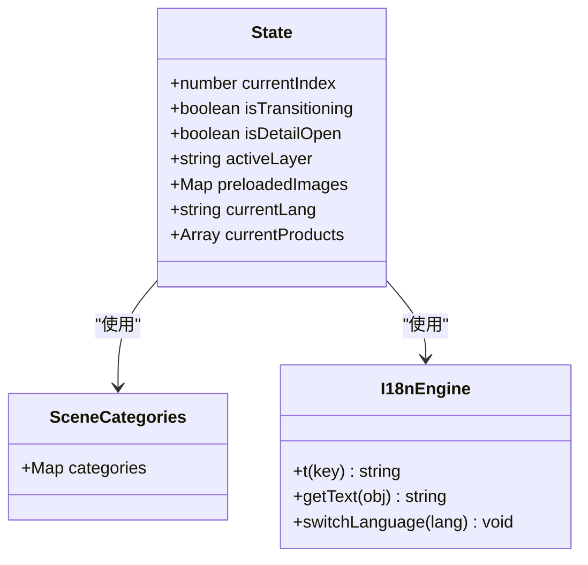

图表来源
- [main.js:195-204](file://js/main.js#L195-L204)
- [main.js:217-229](file://js/main.js#L217-L229)
- [main.js:87-162](file://js/main.js#L87-L162)

章节来源
- [main.js:195-204](file://js/main.js#L195-L204)
- [main.js:217-229](file://js/main.js#L217-L229)
- [main.js:87-162](file://js/main.js#L87-L162)

### 图片预加载与加载等待
- 预加载策略：遍历 mappingData.scenes 与 hotspots/products，去重后并行预加载，缓存 Image 对象。
- 加载等待：waitForImageLoad 使用 addEventListener + { once: true } 避免内存泄漏；支持超时与二次检查。
- 缓存判断：isImageCached 与 isImagePreloaded 避免重复加载与闪烁。

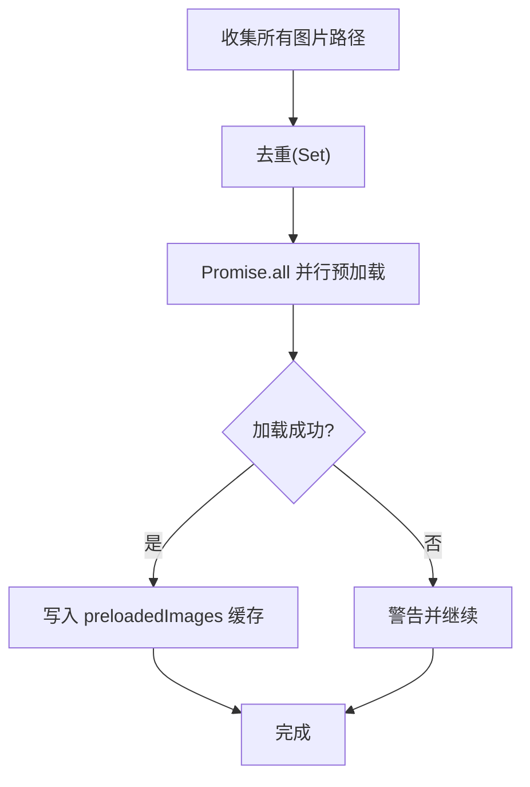

图表来源
- [main.js:257-327](file://js/main.js#L257-L327)
- [main.js:354-395](file://js/main.js#L354-L395)

章节来源
- [main.js:257-327](file://js/main.js#L257-L327)
- [main.js:354-395](file://js/main.js#L354-L395)
- [main.js:404-406](file://js/main.js#L404-L406)

### Markdown缓存与加载
- 缓存：descriptionCache 避免重复请求。
- 降级：marked.js 未加载时进行 HTML 转义与换行处理。
- 错误与重试：加载失败返回可点击重试的提示，点击后清除缓存并重新加载。

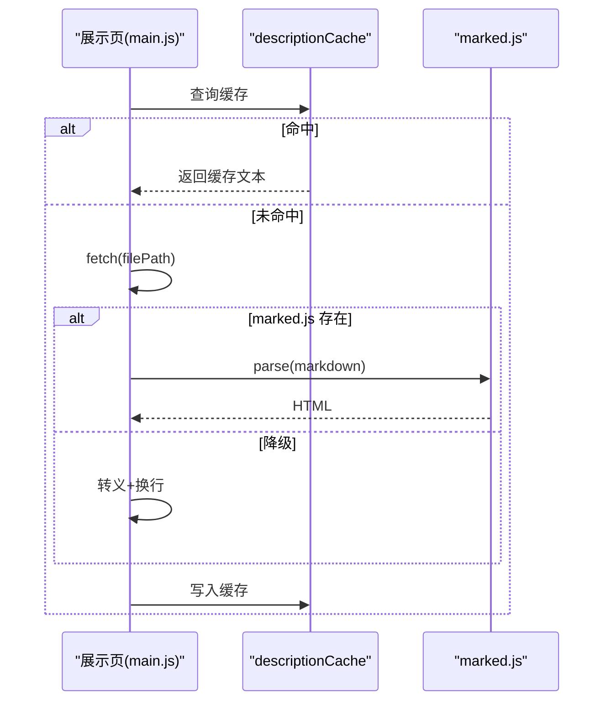

图表来源
- [main.js:421-442](file://js/main.js#L421-L442)
- [main.js:450-460](file://js/main.js#L450-L460)

章节来源
- [main.js:421-442](file://js/main.js#L421-L442)
- [main.js:450-460](file://js/main.js#L450-L460)

### 场景渲染与切换（交叉淡入淡出）
- 双层图层：scene-layer.a 与 scene-layer.b 交替，避免黑屏。
- 交叉淡入淡出：先隐藏热点与切换器，设置新图层 src 后等待加载，再切换 active/inactive 类，最后恢复可见性。
- requestAnimationFrame：在图片加载完成后批量渲染热点，避免阻塞主线程。
- 超时与二次检查：15 秒超时 + actuallyLoaded 二次确认，确保稳定性。

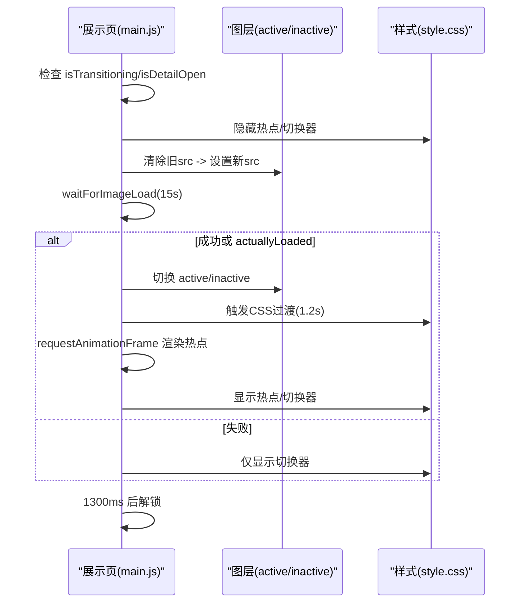

图表来源
- [main.js:480-595](file://js/main.js#L480-L595)
- [style.css:93-127](file://css/style.css#L93-L127)

章节来源
- [main.js:480-595](file://js/main.js#L480-L595)
- [style.css:93-127](file://css/style.css#L93-L127)

### 多热点渲染与交互
- 渲染：renderHotspots() 接收热点数组，计算像素位置并创建 DOM，绑定点击事件。
- 坐标计算：calcHotspotPixelPosition() 基于 object-fit: cover 的裁剪偏移，确保热点与图片对齐。
- 重定位：repositionHotspots() 从 mappingData 获取当前场景热点，支持 resize 与切换后重算。
- 动画错峰：nth-child 与 nth-child .hotspot-core 的延迟分散，避免动画同步造成的视觉拥挤。

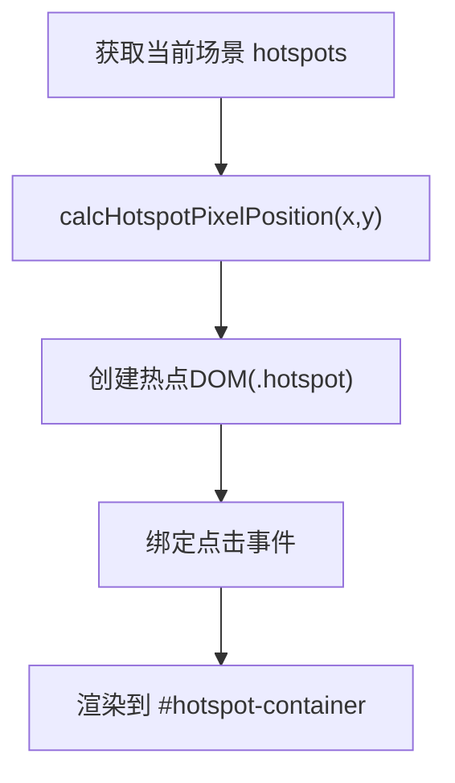

图表来源
- [main.js:716-759](file://js/main.js#L716-L759)
- [main.js:774-806](file://js/main.js#L774-L806)

章节来源
- [main.js:716-759](file://js/main.js#L716-L759)
- [main.js:774-806](file://js/main.js#L774-L806)

### 详情弹窗与骨架屏
- 骨架屏：.desc-loading 与 .skeleton-line 提供占位，配合 skeleton-shimmer 动画提升感知速度。
- 并行加载：Promise.all 并行加载产品描述，缩短整体等待时间。
- 错误可重试：.load-failed 提示点击重试，点击后清除缓存并重新加载。
- 背景淡化与遮罩：.dimmed 与 #overlay 提升弹窗聚焦度与可关闭性。

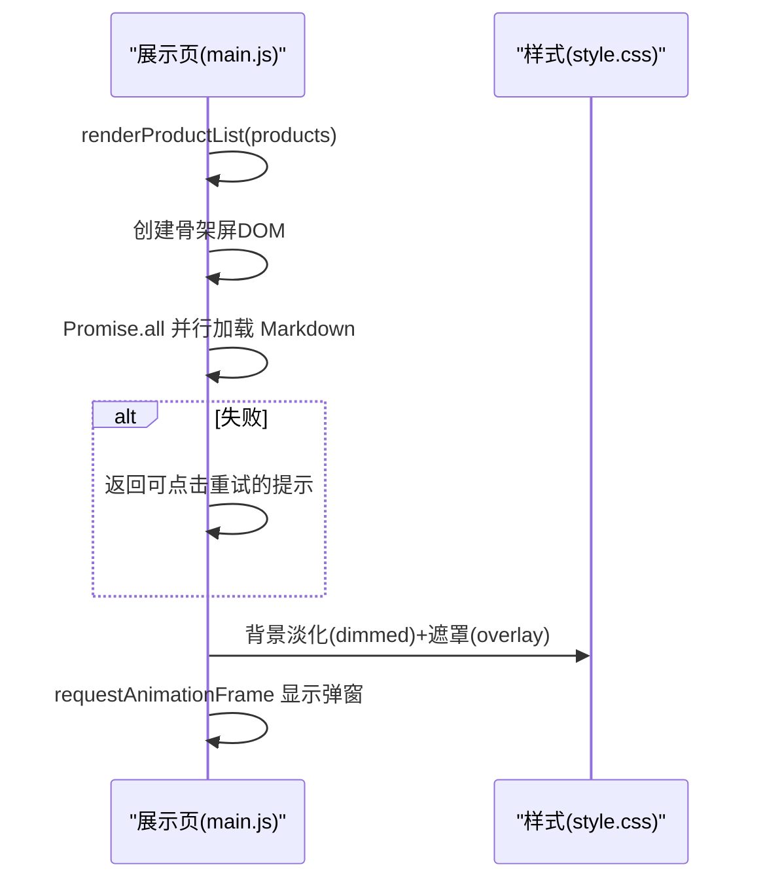

图表来源
- [main.js:873-950](file://js/main.js#L873-L950)
- [style.css:833-863](file://css/style.css#L833-L863)
- [style.css:892-907](file://css/style.css#L892-L907)

章节来源
- [main.js:873-950](file://js/main.js#L873-L950)
- [style.css:833-863](file://css/style.css#L833-L863)
- [style.css:936-950](file://css/style.css#L936-L950)

### 管理后台编辑与拖拽
- 三栏布局：左栏场景列表、中栏场景编辑区、右栏产品编辑器，配合 .hidden 控制显隐。
- 实时编辑：分类名输入、图片更换、热点添加/删除、拖拽调整坐标，均实时更新数据与视图。
- 拖拽实现：mousedown/startDrag → mousemove/onDrag → mouseup/endDrag，限制坐标范围并更新数据。
- 保存与提示：saveMapping() 通过 /api/save-mapping 保存，Toast 提示保存状态。

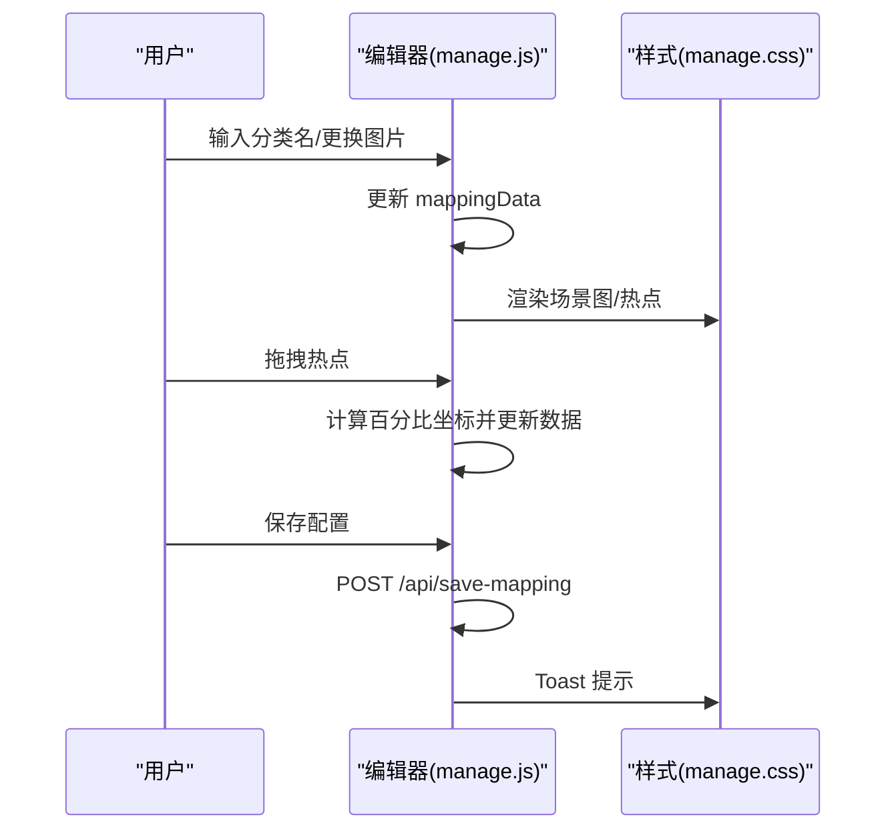

图表来源
- [manage.js:189-235](file://js/manage.js#L189-L235)
- [manage.js:389-438](file://js/manage.js#L389-L438)
- [manage.js:82-108](file://js/manage.js#L82-L108)
- [manage.css:324-339](file://css/manage.css#L324-L339)

章节来源
- [manage.js:189-235](file://js/manage.js#L189-L235)
- [manage.js:389-438](file://js/manage.js#L389-L438)
- [manage.js:82-108](file://js/manage.js#L82-L108)
- [manage.css:324-339](file://css/manage.css#L324-L339)

## 依赖关系分析
- 展示页依赖 mapping.json 提供的数据；通过 fetch 动态加载，避免硬编码。
- 样式层通过 CSS 动画与骨架屏缓解等待；脚本层通过 requestAnimationFrame 与缓存策略优化渲染。
- 管理后台依赖本地开发服务器提供的 API，实现保存、上传与列表查询。

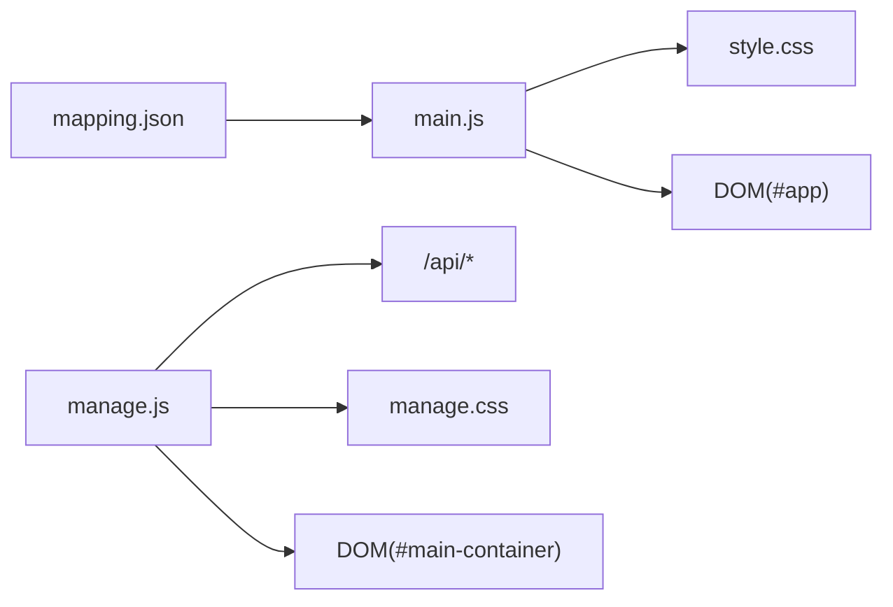

图表来源
- [mapping.json:1-232](file://mapping.json#L1-L232)
- [main.js:49-73](file://js/main.js#L49-L73)
- [style.css:1-997](file://css/style.css#L1-L997)
- [manage.js:35-72](file://js/manage.js#L35-L72)
- [manage.css:1-824](file://css/manage.css#L1-L824)

章节来源
- [project_architecture.md:763-800](file://project_architecture.md#L763-L800)

## 性能考量
- 异步加载与重试
  - 使用 Promise 链式与递增延迟重试，避免频繁失败导致的资源浪费。
  - 为图片与 Markdown 设置合理超时，防止长时间阻塞 UI。
- 缓存与预加载
  - descriptionCache 与 preloadedImages 缓存显著降低重复请求与重复下载。
  - 预加载在首屏完成后启动，避免慢速网络下首屏永远不显示。
- DOM 优化
  - requestAnimationFrame 批量更新热点，避免主线程阻塞。
  - 事件绑定采用一次性监听（{ once: true }）与超时清理，防止内存泄漏。
  - 骨架屏与占位符提升感知速度，减少真实 DOM 的闪烁。
- 渲染性能
  - CSS 过渡与动画使用硬件加速友好的属性（opacity、transform），避免触发布局与重绘。
  - 多热点动画延迟错峰，避免动画同步造成的视觉拥挤与性能抖动。
- 算法与数据结构
  - 使用 Set 去重收集图片路径，降低重复处理成本。
  - 使用 Map 作为缓存容器，提供 O(1) 级别的查找与更新。
- 事件处理
  - 通过状态锁（isTransitioning、isDetailOpen）避免并发操作导致的状态混乱。
  - resize/scroll 等高频事件建议结合防抖/节流（见下一节最佳实践）。

[本节为通用性能讨论，不直接分析具体文件]

## 故障排查指南
- mapping.json 加载失败
  - 现象：全屏错误遮罩 + 重试按钮。
  - 处理：检查网络与服务器状态；确认路径与权限；重试后若仍失败，查看控制台错误。
- 图片加载失败或超时
  - 现象：场景切换时热点未显示或加载指示器常驻。
  - 处理：确认图片路径与服务器可达；检查 isImageCached 与 preloadedImages；必要时清理缓存后重试。
- Markdown 加载失败
  - 现象：产品描述区域显示可点击重试提示。
  - 处理：点击重试清除缓存后重新加载；检查文件路径与服务器状态。
- 弹窗无法关闭或背景未恢复
  - 现象：弹窗关闭后背景仍淡化或遮罩未消失。
  - 处理：检查 closeDetail() 的状态清理顺序与 requestAnimationFrame 调用时机。
- 管理后台保存失败
  - 现象：保存状态显示错误；Toast 提示失败。
  - 处理：检查 /api/save-mapping 返回；确认服务器端备份与写入流程；查看控制台错误。

章节来源
- [main.js:49-73](file://js/main.js#L49-L73)
- [main.js:354-395](file://js/main.js#L354-L395)
- [main.js:421-442](file://js/main.js#L421-L442)
- [main.js:873-950](file://js/main.js#L873-L950)
- [manage.js:82-108](file://js/manage.js#L82-L108)

## 结论
本项目通过“数据驱动 + 异步加载 + 缓存 + 骨架屏 + 硬件加速动画”的组合拳，在弱网与复杂交互场景下实现了稳定的用户体验。遵循本文的异步策略、DOM 优化、算法选择与渲染优化建议，可在类似数字标牌项目中进一步提升性能与可维护性。

[本节为总结性内容，不直接分析具体文件]

## 附录

### 异步加载与重试最佳实践清单
- 使用 fetch + Promise 链式调用，封装递增延迟重试。
- 为关键资源设置超时与二次检查，避免长时间阻塞。
- 对图片与 Markdown 使用缓存，避免重复请求。
- 并行加载多个资源，缩短总等待时间。

章节来源
- [main.js:49-73](file://js/main.js#L49-L73)
- [main.js:257-327](file://js/main.js#L257-L327)
- [main.js:421-442](file://js/main.js#L421-L442)
- [main.js:354-395](file://js/main.js#L354-L395)

### 防抖与节流应用场景
- 窗口 resize：在切换语言或切换器显示时，避免频繁计算与重绘。
- 滚动事件：在详情弹窗滚动加载更多描述时，减少请求频率。
- 输入事件：在搜索或过滤场景中，降低服务器压力与 UI 抖动。

[本节为通用指导，不直接分析具体文件]

### DOM 操作优化技巧
- 批量 DOM 更新：使用 requestAnimationFrame 或微任务队列合并更新。
- CSS 类名切换：使用类名切换而非内联样式，利用硬件加速。
- 事件委托：将事件绑定在父容器上，减少事件监听器数量。
- 骨架屏与占位符：在真实数据到达前提供占位，减少闪烁。

章节来源
- [main.js:546-550](file://js/main.js#L546-L550)
- [main.js:716-759](file://js/main.js#L716-L759)
- [style.css:833-863](file://css/style.css#L833-L863)

### 算法与数据结构选择原则
- 去重与集合：使用 Set 收集图片路径，降低重复处理。
- 缓存：使用 Map 作为缓存容器，提供快速查找与更新。
- 并行：使用 Promise.all 并行处理多个异步任务，缩短总耗时。

章节来源
- [main.js:259-273](file://js/main.js#L259-L273)
- [main.js:323-326](file://js/main.js#L323-L326)
- [main.js:590-593](file://js/main.js#L590-L593)

### 浏览器渲染性能优化
- 避免重排重绘：使用 transform/opacity 等硬件加速属性。
- 动画与过渡：使用 CSS 动画与 requestAnimationFrame，避免主线程阻塞。
- 多热点动画错峰：通过 nth-child 与延迟分散，避免动画同步。

章节来源
- [style.css:93-127](file://css/style.css#L93-L127)
- [style.css:319-330](file://css/style.css#L319-L330)
- [style.css:414-433](file://css/style.css#L414-L433)
- [main.js:546-550](file://js/main.js#L546-L550)

### 性能测试与基准方法
- 基准测试
  - 使用 Performance API 记录关键阶段耗时（数据加载、首屏渲染、切换耗时）。
  - 使用 Memory API 监控内存峰值与泄漏风险。
- 用户体验指标
  - 首屏可交互时间（TTI）、最大布局偏移（CLS）、感知速度（骨架屏到真实内容）。
- 网络模拟
  - 在弱网条件下测试重试与缓存策略的有效性。
- A/B 对比
  - 对比启用/禁用缓存、预加载与骨架屏的性能差异，量化收益。

[本节为通用指导，不直接分析具体文件]