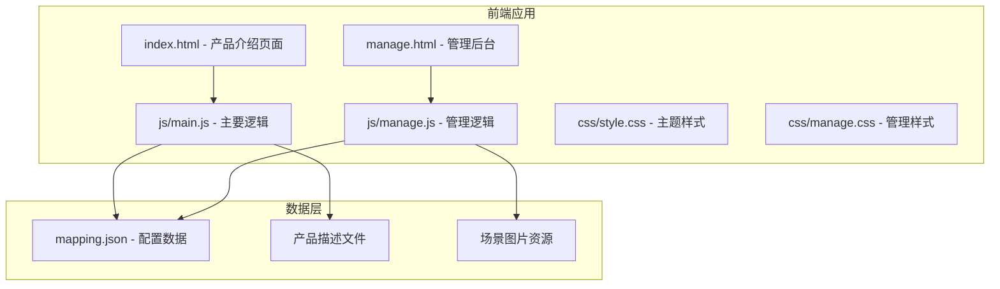
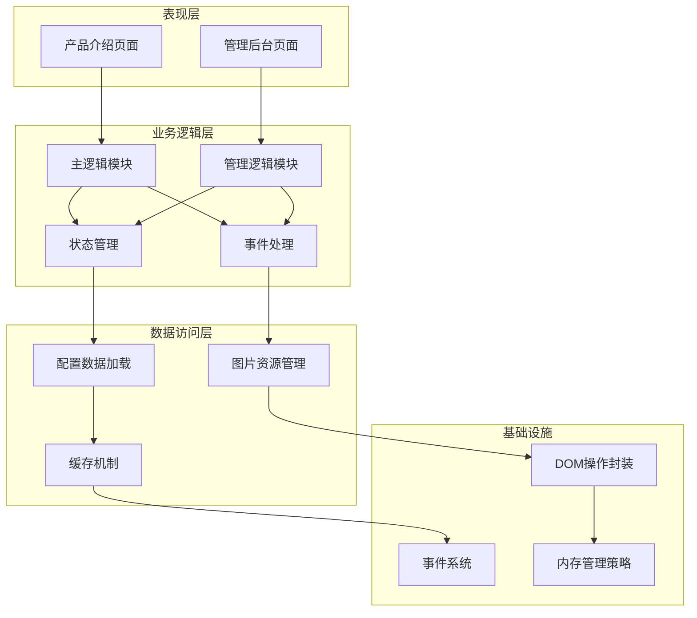
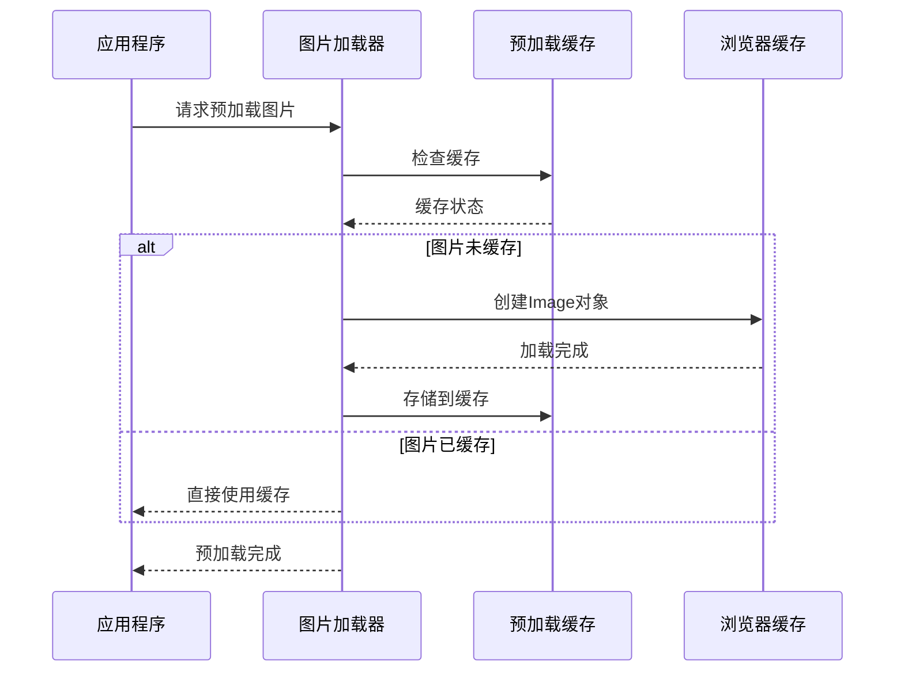
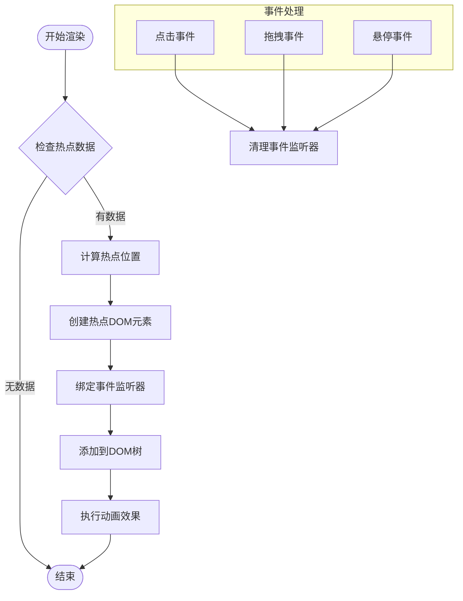
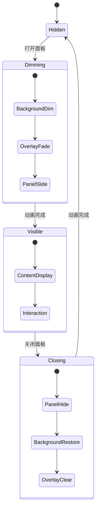
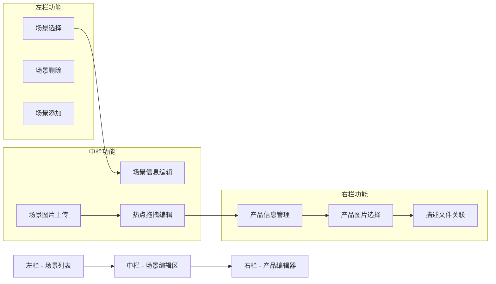
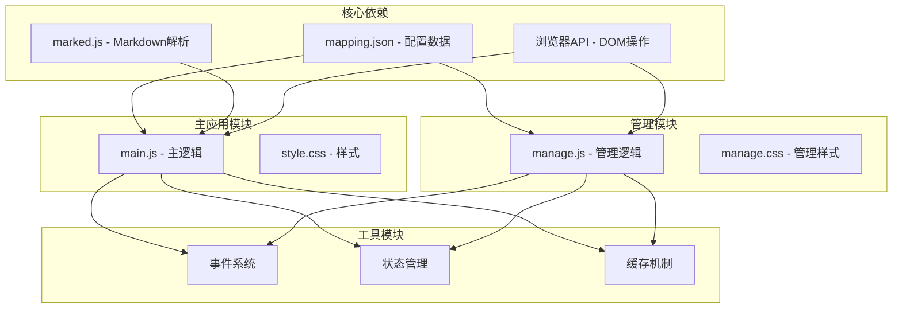

# 内存管理优化

<cite>
**本文档引用的文件**
- [index.html](file://index.html)
- [manage.html](file://manage.html)
- [js/main.js](file://js/main.js)
- [js/manage.js](file://js/manage.js)
- [css/style.css](file://css/style.css)
- [css/manage.css](file://css/manage.css)
- [mapping.json](file://mapping.json)
</cite>

## 目录
1. [简介](#简介)
2. [项目结构](#项目结构)
3. [核心组件](#核心组件)
4. [架构概览](#架构概览)
5. [详细组件分析](#详细组件分析)
6. [依赖关系分析](#依赖关系分析)
7. [性能考虑](#性能考虑)
8. [故障排除指南](#故障排除指南)
9. [结论](#结论)

## 简介

本项目是一个数字标牌展示系统，包含两个主要页面：产品介绍页面和管理后台。该项目在内存管理方面采用了多项优化策略，包括DOM元素生命周期管理、事件监听器清理、图片资源管理、以及JavaScript垃圾回收配合策略。

数字标牌系统通常需要长时间运行在公共场合的显示设备上，因此内存管理优化对于系统的稳定性和可靠性至关重要。本项目通过合理的架构设计和最佳实践，有效避免了常见的内存泄漏问题。

## 项目结构

项目采用模块化的前端架构，主要包含以下组件：



**图表来源**
- [index.html:1-83](file://index.html#L1-L83)
- [manage.html:1-113](file://manage.html#L1-L113)
- [js/main.js:1-50](file://js/main.js#L1-L50)
- [js/manage.js:1-50](file://js/manage.js#L1-L50)

**章节来源**
- [index.html:1-83](file://index.html#L1-L83)
- [manage.html:1-113](file://manage.html#L1-L113)
- [mapping.json:1-50](file://mapping.json#L1-L50)

## 核心组件

### DOM元素生命周期管理

项目实现了完整的DOM元素生命周期管理策略：

1. **元素创建与销毁**
   - 所有动态创建的DOM元素都有明确的销毁时机
   - 热点元素在场景切换时被完全重建
   - 详细面板在关闭时从DOM树中移除

2. **状态管理**
   - 使用集中式的状态对象管理应用状态
   - 避免全局变量污染，减少内存泄漏风险
   - 状态更新采用不可变模式，便于垃圾回收

3. **资源清理**
   - 图片预加载缓存机制，避免重复加载
   - 事件监听器的正确绑定和解绑
   - 定时器的及时清理

**章节来源**
- [js/main.js:169-204](file://js/main.js#L169-L204)
- [js/main.js:257-327](file://js/main.js#L257-L327)
- [js/manage.js:6-16](file://js/manage.js#L6-L16)

### 事件监听器管理

项目采用了多种策略来管理事件监听器：

1. **addEventListener vs on属性**
   - 优先使用addEventListener而非onclick等属性赋值
   - 避免覆盖现有的监听器，防止内存泄漏

2. **监听器清理**
   - 在组件销毁时清理所有绑定的事件监听器
   - 使用{once: true}选项自动移除一次性监听器

3. **防抖机制**
   - 窗口大小变化事件使用防抖，避免频繁触发
   - 减少不必要的DOM操作和内存分配

**章节来源**
- [js/main.js:342-395](file://js/main.js#L342-L395)
- [js/main.js:1139-1148](file://js/main.js#L1139-L1148)
- [js/manage.js:232-235](file://js/manage.js#L232-L235)

## 架构概览

系统采用模块化架构，分为以下几个主要层次：



**图表来源**
- [js/main.js:1-50](file://js/main.js#L1-L50)
- [js/manage.js:1-50](file://js/manage.js#L1-L50)
- [css/style.css:1-50](file://css/style.css#L1-L50)
- [css/manage.css:1-50](file://css/manage.css#L1-L50)

## 详细组件分析

### 图片管理系统

图片管理系统是内存管理的关键组件，实现了高效的资源管理策略：

#### 图片预加载机制



**图表来源**
- [js/main.js:257-327](file://js/main.js#L257-L327)
- [js/main.js:334-336](file://js/main.js#L334-L336)

#### 图片加载等待机制

项目实现了智能的图片加载等待机制，避免内存泄漏：

1. **超时保护**
   - 默认8秒超时，防止无限等待
   - 超时后自动清理监听器

2. **状态管理**
   - 使用complete属性确保正确的加载状态
   - 清除src属性重置加载状态

3. **错误处理**
   - 网络错误时自动重试
   - 失败时提供用户友好的反馈

**章节来源**
- [js/main.js:354-395](file://js/main.js#L354-L395)
- [js/main.js:285-320](file://js/main.js#L285-L320)

### 热点管理系统

热点管理系统实现了复杂的DOM操作和事件处理：

#### 热点渲染流程



**图表来源**
- [js/main.js:716-759](file://js/main.js#L716-L759)
- [js/manage.js:286-310](file://js/manage.js#L286-L310)

#### 热点位置计算

项目实现了精确的热点位置计算算法：

1. **对象适配模式处理**
   - 支持object-fit: cover模式下的精确计算
   - 处理图片裁剪产生的偏移

2. **性能优化**
   - 图片未加载时使用默认位置
   - 避免重复计算，使用缓存机制

**章节来源**
- [js/main.js:774-817](file://js/main.js#L774-L817)
- [js/manage.js:400-426](file://js/manage.js#L400-L426)

### 详细面板系统

详细面板系统实现了复杂的动画和状态管理：

#### 面板生命周期



**图表来源**
- [js/main.js:962-1025](file://js/main.js#L962-L1025)

#### 内容加载策略

面板实现了智能的内容加载策略：

1. **骨架屏技术**
   - 先创建DOM骨架，提升用户体验
   - 并行加载多个产品描述

2. **错误恢复**
   - 单个产品加载失败不影响整体显示
   - 提供重试机制

**章节来源**
- [js/main.js:888-956](file://js/main.js#L888-L956)

### 管理后台系统

管理后台系统提供了完整的场景和热点管理功能：

#### 三栏布局架构



**图表来源**
- [manage.html:20-80](file://manage.html#L20-L80)
- [css/manage.css:123-487](file://css/manage.css#L123-L487)

#### 拖拽系统

管理后台实现了完整的拖拽交互系统：

1. **拖拽状态管理**
   - 使用全局状态跟踪拖拽状态
   - 避免内存泄漏的拖拽事件

2. **坐标计算**
   - 基于容器边界计算百分比坐标
   - 实时更新热点位置

**章节来源**
- [js/manage.js:389-438](file://js/manage.js#L389-L438)
- [js/manage.js:232-235](file://js/manage.js#L232-L235)

## 依赖关系分析

项目采用松耦合的设计，各模块之间的依赖关系清晰：



**图表来源**
- [index.html:9-10](file://index.html#L9-L10)
- [js/main.js:1-50](file://js/main.js#L1-L50)
- [js/manage.js:1-50](file://js/manage.js#L1-L50)

**章节来源**
- [mapping.json:1-50](file://mapping.json#L1-L50)
- [index.html:9-10](file://index.html#L9-L10)

## 性能考虑

### 内存使用优化策略

1. **DOM节点复用**
   - 使用innerHTML批量更新而非逐个节点操作
   - 避免频繁的DOM查询和修改

2. **事件委托**
   - 在父容器上统一处理子元素事件
   - 减少事件监听器的数量

3. **定时器管理**
   - 使用防抖和节流减少高频操作
   - 及时清理不再使用的定时器

4. **缓存策略**
   - 图片预加载缓存避免重复请求
   - Markdown内容缓存提升加载速度

### 垃圾回收配合策略

1. **对象生命周期管理**
   - 明确的对象创建和销毁时机
   - 避免循环引用的闭包

2. **大对象处理**
   - 图片对象及时释放
   - 大量DOM节点批量处理

3. **内存监控**
   - 定期检查内存使用情况
   - 及时发现内存泄漏

## 故障排除指南

### 常见内存问题诊断

#### Chrome DevTools使用指南

1. **内存快照分析**
   - 使用Heap Snapshot功能捕获内存快照
   - 比较不同时间点的内存使用情况
   - 查找无法释放的对象引用链

2. **事件监听器检查**
   - 在Event Listeners面板查看绑定的监听器
   - 确认组件销毁时监听器是否正确清理

3. **DOM泄漏检测**
   - 使用DOM Breakpoints追踪DOM节点的创建和销毁
   - 检查是否有DOM节点未从页面移除

#### 内存泄漏常见原因

1. **闭包陷阱**
   ```javascript
   // 错误示例：循环中的闭包持有DOM引用
   for (let i = 0; i < elements.length; i++) {
       elements[i].onclick = function() {
           // 闭包持有对elements[i]的引用
           process(elements[i]);
       };
   }
   
   // 正确做法：使用事件委托或弱引用
   ```

2. **全局变量污染**
   - 避免在全局作用域创建大量变量
   - 使用模块模式封装私有变量

3. **循环引用**
   - 注意DOM元素与JavaScript对象的相互引用
   - 使用WeakMap存储DOM到数据的映射

**章节来源**
- [js/main.js:1139-1148](file://js/main.js#L1139-L1148)
- [js/manage.js:389-438](file://js/manage.js#L389-L438)

### 代码重构建议

#### DOM操作优化

1. **批量DOM更新**
   ```javascript
   // 错误：频繁的DOM查询
   for (let i = 0; i < items.length; i++) {
       document.getElementById('item-' + i).textContent = items[i];
   }
   
   // 正确：使用DocumentFragment
   const fragment = document.createDocumentFragment();
   for (let i = 0; i < items.length; i++) {
       const div = document.createElement('div');
       div.textContent = items[i];
       fragment.appendChild(div);
   }
   container.appendChild(fragment);
   ```

2. **事件监听器管理**
   ```javascript
   // 使用事件委托
   container.addEventListener('click', (e) => {
       if (e.target.matches('.item')) {
           handleItemClick(e.target);
       }
   });
   
   // 组件销毁时清理
   cleanup() {
       container.removeEventListener('click', handler);
   }
   ```

#### 内存泄漏预防

1. **正确使用addEventListener**
   ```javascript
   // 推荐：使用{once: true}自动清理
   element.addEventListener('click', callback, {once: true});
   
   // 或者手动清理
   function handleClick() {
       // 处理逻辑
   }
   
   element.addEventListener('click', handleClick);
   // 组件销毁时
   element.removeEventListener('click', handleClick);
   ```

2. **图片资源管理**
   ```javascript
   // 清理图片引用
   function clearImageCache() {
       Object.keys(preloadedImages).forEach(key => {
           preloadedImages[key] = null;
           delete preloadedImages[key];
       });
   }
   
   // 使用URL.createObjectURL时注意清理
   URL.revokeObjectURL(objectUrl);
   ```

## 结论

本数字标牌项目在内存管理方面采用了全面而深入的优化策略，通过合理的架构设计和最佳实践，有效避免了常见的内存泄漏问题。主要成果包括：

1. **完善的DOM生命周期管理**：从元素创建到销毁的完整生命周期管理，确保每个DOM节点都能得到适当的清理。

2. **智能的事件监听器管理**：采用事件委托和一次性监听器策略，避免事件监听器泄漏。

3. **高效的资源管理**：图片预加载缓存、Markdown内容缓存等策略，提升性能的同时减少内存占用。

4. **健壮的状态管理**：集中式的状态管理避免了全局变量污染，便于垃圾回收。

5. **完善的错误处理机制**：超时保护、重试机制等确保系统在异常情况下也能正常运行。

这些优化策略不仅提升了系统的性能和稳定性，也为类似项目的内存管理提供了宝贵的参考经验。通过持续的监控和维护，可以确保系统在长期运行中保持良好的内存使用效率。