# 加载性能优化

<cite>
**本文档引用的文件**
- [index.html](file://index.html)
- [manage.html](file://manage.html)
- [js/main.js](file://js/main.js)
- [js/manage.js](file://js/manage.js)
- [css/style.css](file://css/style.css)
- [mapping.json](file://mapping.json)
- [project_architecture.md](file://project_architecture.md)
- [启动服务器.py](file://启动服务器.py)
</cite>

## 目录
1. [项目概述](#项目概述)
2. [首屏加载优先级策略](#首屏加载优先级策略)
3. [资源预加载技术](#资源预加载技术)
4. [缓存机制设计](#缓存机制设计)
5. [异步加载最佳实践](#异步加载最佳实践)
6. [网络请求优化](#网络请求优化)
7. [性能监控与测量](#性能监控与测量)
8. [架构优化建议](#架构优化建议)
9. [故障排除指南](#故障排除指南)
10. [总结](#总结)

## 项目概述

数字标牌项目是一个基于纯原生JavaScript的展示系统，通过场景化展示数字标牌产品在实际环境中的应用效果。项目采用数据驱动架构，通过`mapping.json`集中管理所有配置数据，支持中日文双语切换，并提供可视化管理后台。

### 核心特性
- **数据驱动架构**：使用`mapping.json`集中管理场景、产品和多语言配置
- **双层图片系统**：实现无黑屏的交叉淡入淡出效果
- **多热点支持**：单场景可包含多个热点，每个热点关联不同产品
- **骨架屏体验**：提供优雅的加载等待体验
- **错误处理机制**：完善的加载失败降级和重试机制

## 首屏加载优先级策略

### 1. 首屏资源识别

根据项目架构分析，首屏关键资源包括：

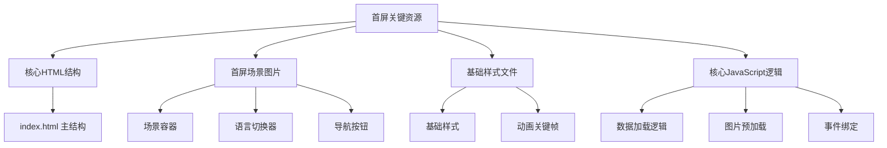

**图表来源**
- [index.html:14-76](file://index.html#L14-L76)
- [js/main.js:480-595](file://js/main.js#L480-L595)

### 2. 首屏加载策略

项目实现了"首屏独占带宽"策略，确保首屏图片加载完成后才启动其他资源预加载：

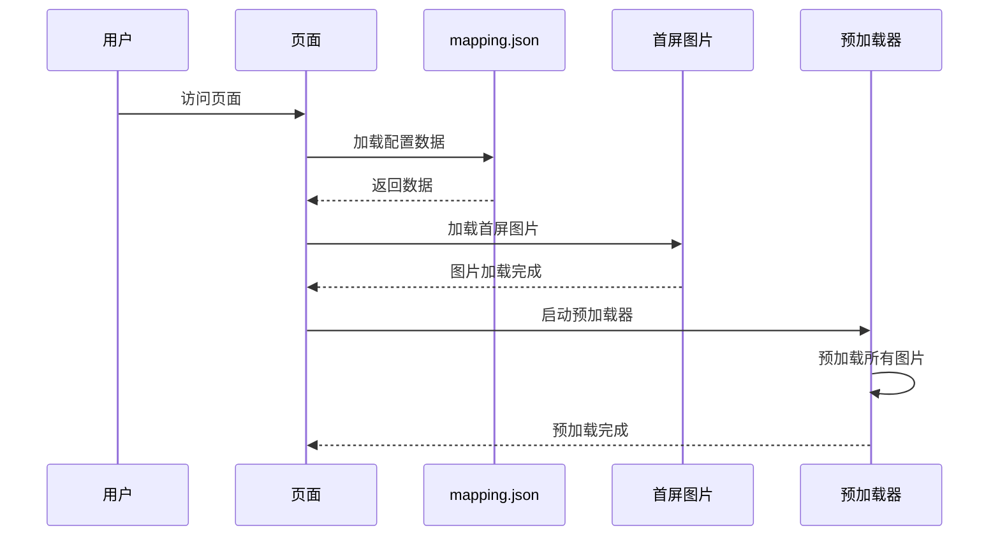

**图表来源**
- [js/main.js:524-542](file://js/main.js#L524-L542)
- [js/main.js:322-327](file://js/main.js#L322-L327)

### 3. 关键资源优先级排序

| 优先级 | 资源类型 | 说明 | 优化策略 |
|--------|----------|------|----------|
| 1 | HTML结构 | 页面骨架 | 内联到<head> |
| 2 | 核心CSS | 基础样式 | 内联关键CSS |
| 3 | 首屏图片 | 场景主图 | 预加载 + 缓存 |
| 4 | 核心JS | 交互逻辑 | 延迟加载 |
| 5 | 产品图片 | 详情图片 | 懒加载 |
| 6 | 描述文件 | Markdown内容 | 按需加载 |

**章节来源**
- [js/main.js:524-542](file://js/main.js#L524-L542)
- [js/main.js:257-327](file://js/main.js#L257-L327)

## 资源预加载技术

### 1. 图片预加载机制

项目实现了智能的图片预加载系统，通过遍历所有场景和产品数据收集图片URL：

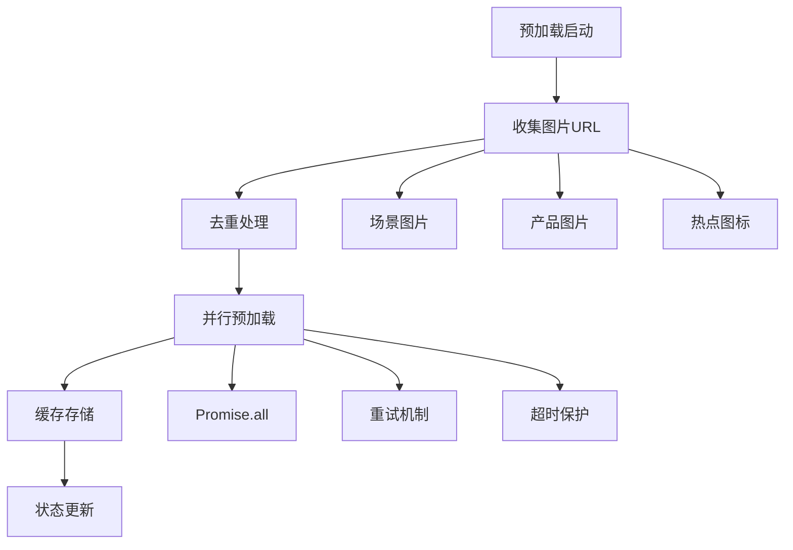

**图表来源**
- [js/main.js:257-327](file://js/main.js#L257-L327)
- [js/main.js:285-320](file://js/main.js#L285-L320)

### 2. 预加载重试策略

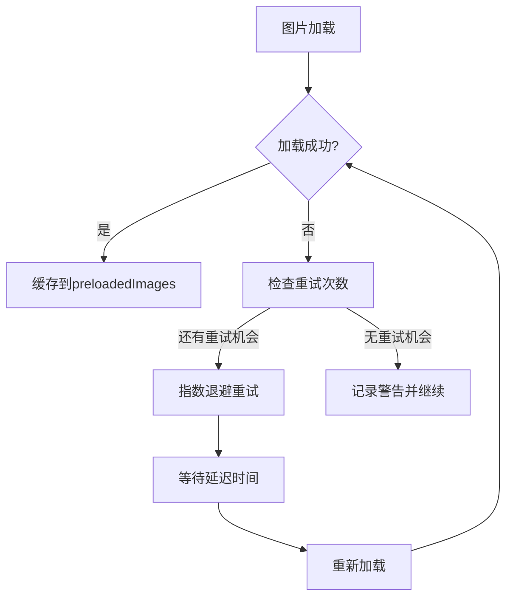

**图表来源**
- [js/main.js:298-319](file://js/main.js#L298-L319)

### 3. 预加载缓存管理

项目使用内存缓存结合浏览器HTTP缓存的双重策略：

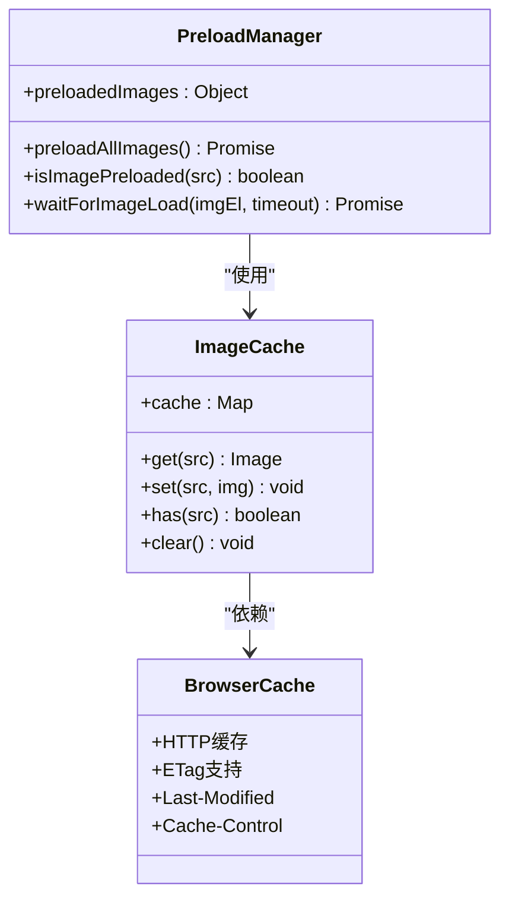

**图表来源**
- [js/main.js:195-204](file://js/main.js#L195-L204)
- [js/main.js:201](file://js/main.js#L201)

**章节来源**
- [js/main.js:257-407](file://js/main.js#L257-L407)

## 缓存机制设计

### 1. 多层次缓存架构

项目实现了三层缓存体系：

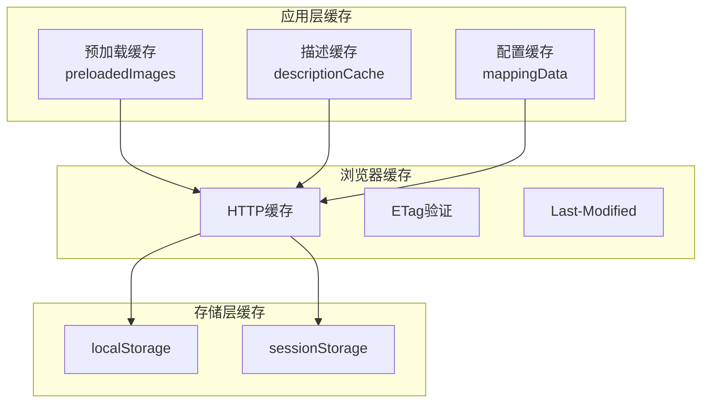

**图表来源**
- [js/main.js:235](file://js/main.js#L235)
- [js/main.js:201](file://js/main.js#L201)

### 2. 缓存策略配置

| 缓存类型 | 缓存位置 | 过期策略 | 大小限制 |
|----------|----------|----------|----------|
| 预加载缓存 | 内存 | 应用生命周期 | 无限制 |
| 描述缓存 | 内存 | 应用生命周期 | 无限制 |
| 配置缓存 | 内存 | 应用生命周期 | 无限制 |
| HTTP缓存 | 浏览器 | 服务器控制 | 浏览器限制 |
| localStorage | 持久化 | 手动清理 | 5-10MB |

### 3. 缓存失效机制

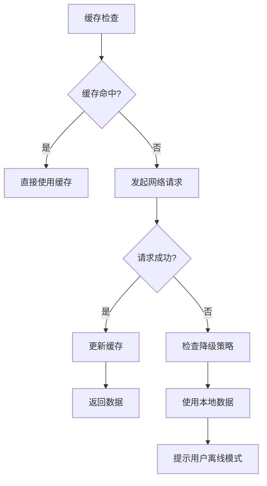

**图表来源**
- [js/main.js:421-442](file://js/main.js#L421-L442)

**章节来源**
- [js/main.js:235-442](file://js/main.js#L235-L442)

## 异步加载最佳实践

### 1. 动态导入策略

项目采用渐进式加载策略，将非关键资源延迟到首屏之后加载：

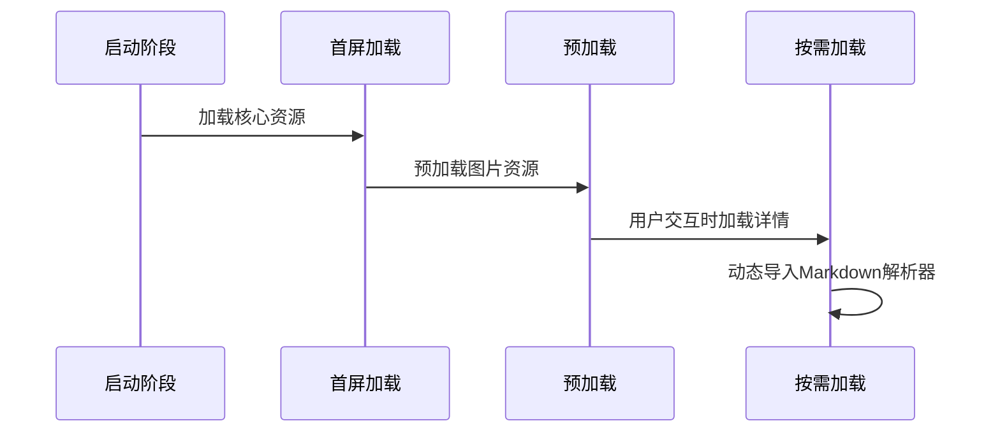

**图表来源**
- [js/main.js:539-542](file://js/main.js#L539-L542)

### 2. 懒加载实现

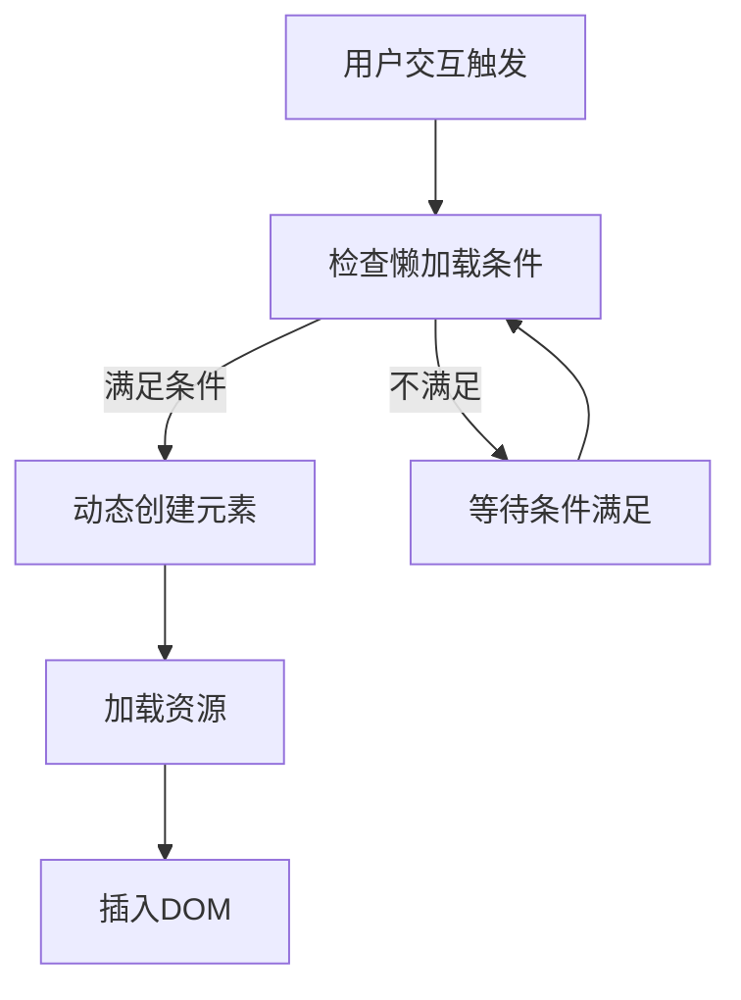

**图表来源**
- [js/main.js:589-594](file://js/main.js#L589-L594)

### 3. 模块化策略

项目采用单一职责的模块化设计：

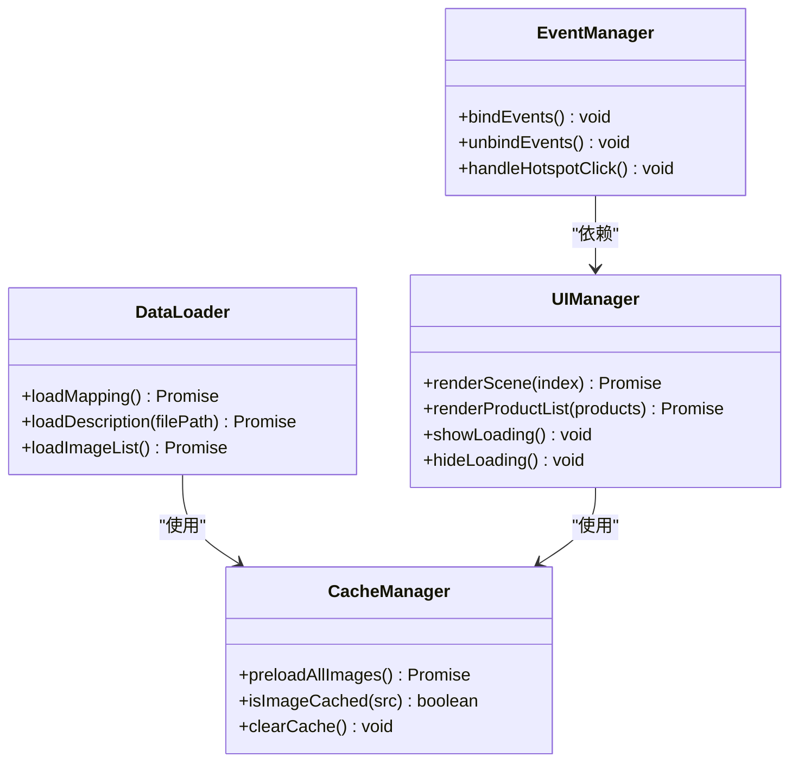

**图表来源**
- [js/main.js:49-73](file://js/main.js#L49-L73)
- [js/main.js:480-595](file://js/main.js#L480-L595)

**章节来源**
- [js/main.js:49-595](file://js/main.js#L49-L595)

## 网络请求优化

### 1. 请求合并策略

项目通过数据聚合减少HTTP请求数量：

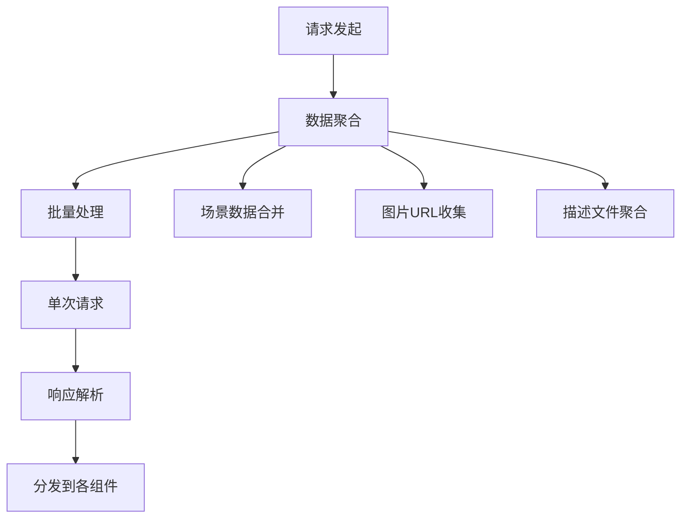

**图表来源**
- [js/main.js:257-274](file://js/main.js#L257-L274)

### 2. 连接复用优化

项目利用浏览器的HTTP/1.1连接复用特性：

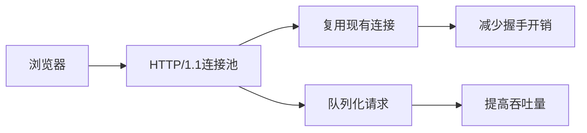

### 3. 请求超时与重试

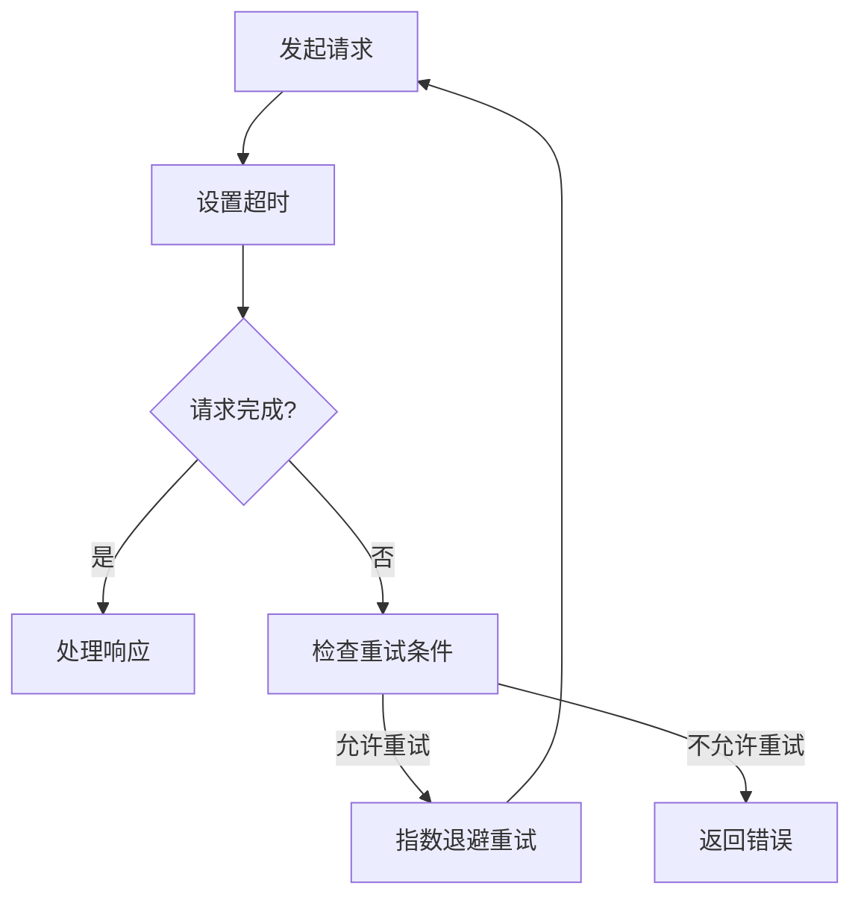

**图表来源**
- [js/main.js:354-395](file://js/main.js#L354-L395)

**章节来源**
- [js/main.js:257-395](file://js/main.js#L257-L395)

## 性能监控与测量

### 1. 性能指标定义

项目关注以下关键性能指标：

| 指标类型 | 指标名称 | 目标值 | 测量方法 |
|----------|----------|--------|----------|
| 首屏性能 | FCP | <2秒 | PerformanceObserver |
| 交互性能 | FID | <100ms | PerformanceObserver |
| 稳定性 | TTFB | <500ms | Network Timing API |
| 资源效率 | 首屏请求数 | ≤8个 | Network Panel |
| 用户体验 | LCP | <2.5秒 | PerformanceObserver |

### 2. 监控工具集成

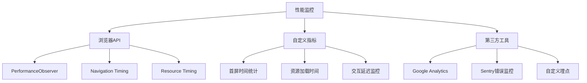

### 3. 性能数据分析

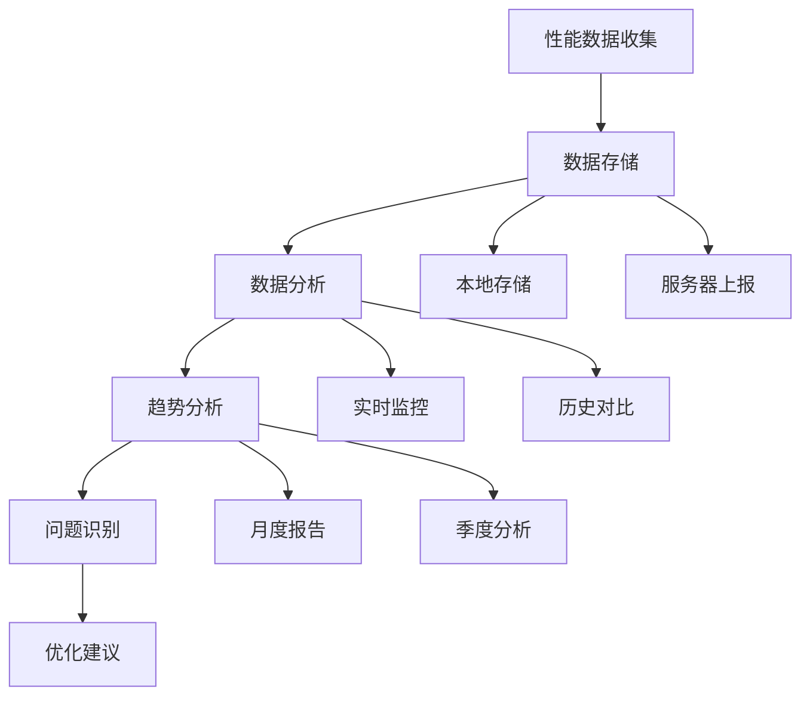

**章节来源**
- [js/main.js:354-461](file://js/main.js#L354-L461)

## 架构优化建议

### 1. DNS预解析优化

建议在HTML头部添加DNS预解析：

```html
<!-- DNS预解析 -->
<link rel="dns-prefetch" href="//cdn.jsdelivr.net">
<link rel="dns-prefetch" href="//localhost:8082">

<!-- 预连接 -->
<link rel="preconnect" href="//cdn.jsdelivr.net" crossorigin>
<link rel="preconnect" href="//localhost:8082" crossorigin>
```

### 2. 关键资源预取

```html
<!-- 关键资源预取 -->
<link rel="prefetch" href="css/style.css" as="style">
<link rel="prefetch" href="js/main.js" as="script">
<link rel="prefetch" href="mapping.json" as="fetch">
```

### 3. 图片优化策略

```html
<!-- 现代图片格式支持 -->
<picture>
    <source srcset="image.webp" type="image/webp">
    <source srcset="image.jpg" type="image/jpeg">
    
</picture>
```

### 4. 代码分割优化

```javascript
// 动态导入大型模块
async function loadMarkdownParser() {
    const { marked } = await import('./lib/marked.js');
    return marked;
}

// 按需加载功能模块
async function loadFeatureModule(feature) {
    const module = await import(`./features/${feature}.js`);
    return module.default;
}
```

## 故障排除指南

### 1. 常见性能问题诊断

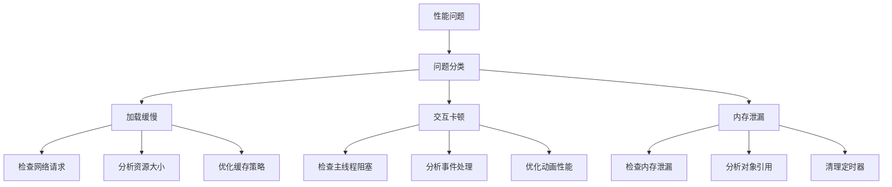

### 2. 错误处理机制

项目实现了多层次的错误处理：

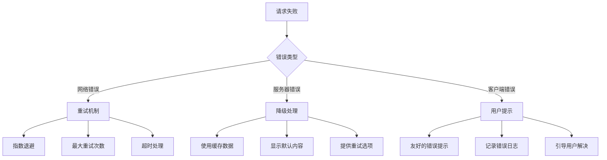

**图表来源**
- [js/main.js:623-640](file://js/main.js#L623-L640)

### 3. 性能调试工具

推荐使用以下工具进行性能分析：

- **Chrome DevTools Performance Tab**：分析CPU使用情况
- **Network Tab**：监控网络请求和资源加载
- **Memory Tab**：检测内存泄漏和垃圾回收
- **Lighthouse**：自动化性能审计
- **WebPageTest**：跨地区性能测试

**章节来源**
- [js/main.js:623-640](file://js/main.js#L623-L640)

## 总结

数字标牌项目在加载性能方面已经实现了较为完善的优化策略，包括：

### 已实现的优势
- **首屏独占带宽**：确保用户体验优先
- **智能预加载**：减少场景切换延迟
- **多层次缓存**：提升重复访问性能
- **错误降级**：保证系统稳定性
- **骨架屏体验**：改善感知性能

### 进一步优化方向
1. **DNS预解析和连接预建立**：减少域名解析和连接建立时间
2. **资源压缩和CDN部署**：进一步降低资源传输时间
3. **图片格式优化**：采用现代压缩算法
4. **代码分割**：实现更细粒度的按需加载
5. **性能监控完善**：建立持续的性能跟踪机制

通过实施这些优化措施，可以进一步提升数字标牌项目的加载性能，为用户提供更加流畅的展示体验。