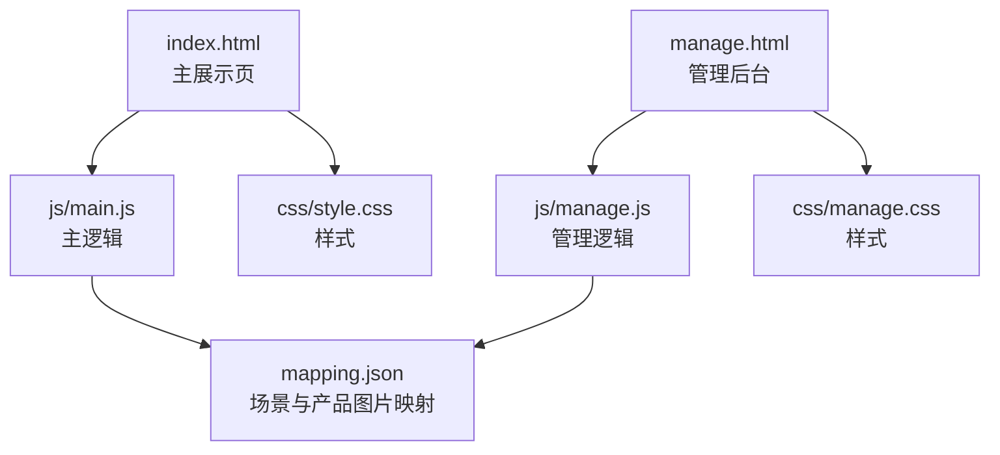
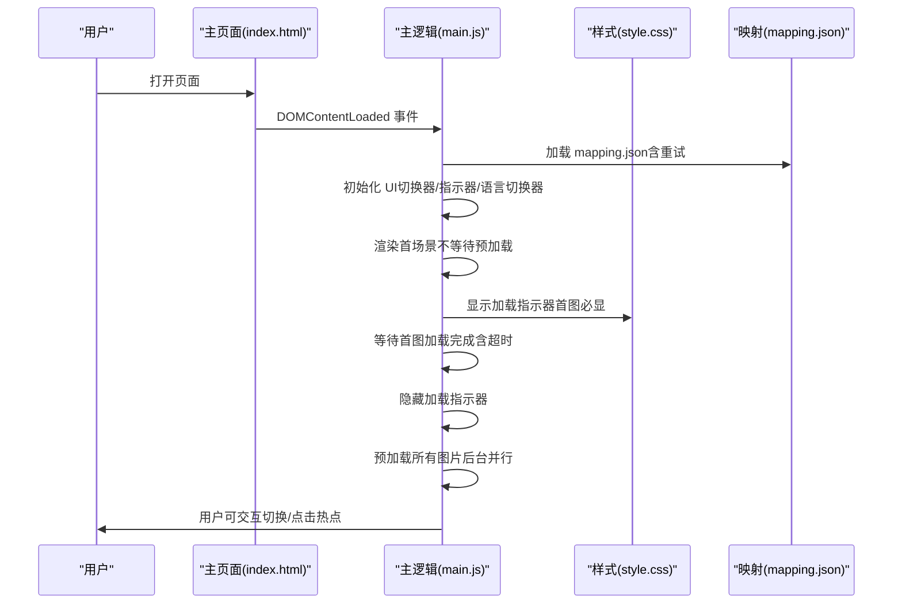
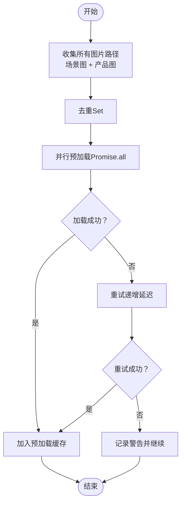
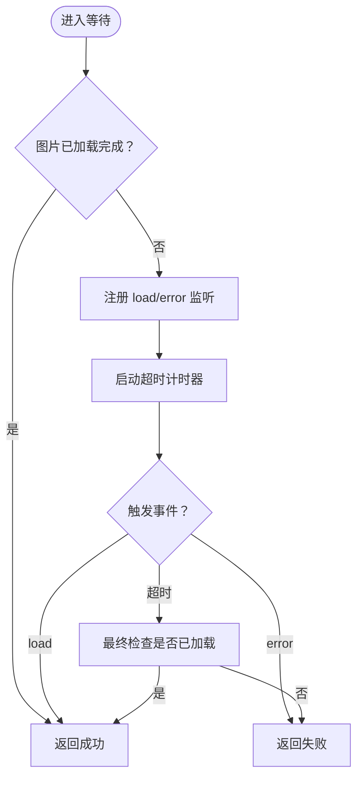
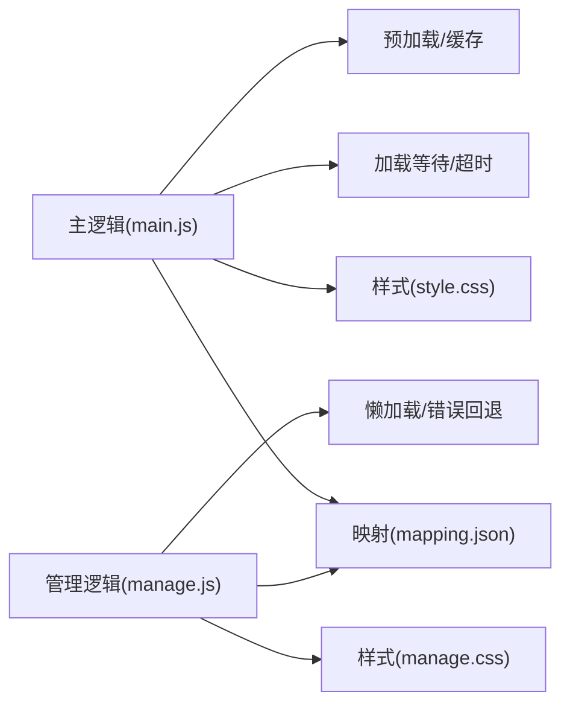

# 图片优化策略

<cite>
**本文引用的文件**
- [index.html](file://index.html)
- [manage.html](file://manage.html)
- [js/main.js](file://js/main.js)
- [js/manage.js](file://js/manage.js)
- [css/style.css](file://css/style.css)
- [css/manage.css](file://css/manage.css)
- [mapping.json](file://mapping.json)
</cite>

## 目录
1. [简介](#简介)
2. [项目结构](#项目结构)
3. [核心组件](#核心组件)
4. [架构总览](#架构总览)
5. [详细组件分析](#详细组件分析)
6. [依赖关系分析](#依赖关系分析)
7. [性能考量](#性能考量)
8. [故障排查指南](#故障排查指南)
9. [结论](#结论)
10. [附录](#附录)

## 简介
本文件面向数字标牌项目的图片优化策略，围绕WebP格式选择与转换、图片预加载与缓存、懒加载与用户体验优化展开，结合项目现有实现（场景图片与产品图片均为WebP）与前端代码，给出可落地的优化建议与实施路径。文档同时提供格式选择指南与具体优化案例，帮助在真实业务中取得更好的加载速度与视觉体验。

## 项目结构
项目采用前后端分离的静态站点结构，前端由HTML、CSS、JS组成，图片资源位于本地目录，通过JSON映射文件统一管理。核心页面包含主展示页与管理后台页，分别承担图片展示与图片管理功能。

图表来源
- [index.html:1-83](file://index.html#L1-L83)
- [manage.html:1-113](file://manage.html#L1-L113)
- [js/main.js:1197-1284](file://js/main.js#L1197-L1284)
- [js/manage.js:17-31](file://js/manage.js#L17-L31)
- [mapping.json:1-232](file://mapping.json#L1-L232)

章节来源
- [index.html:1-83](file://index.html#L1-L83)
- [manage.html:1-113](file://manage.html#L1-L113)
- [js/main.js:1197-1284](file://js/main.js#L1197-L1284)
- [js/manage.js:17-31](file://js/manage.js#L17-L31)
- [mapping.json:1-232](file://mapping.json#L1-L232)

## 核心组件
- 图片预加载与缓存：在首屏场景完全显示后再启动后台预加载，避免带宽竞争导致首图长时间不显示；使用去重集合收集所有图片路径，避免重复下载。
- 图片加载等待与超时保护：对每张图片等待加载完成或超时，超时后仍允许继续渲染，保证界面可用性。
- 图片缓存检测：通过预加载缓存判断图片是否已缓存，若已缓存则不显示加载指示器，提升首屏体验。
- 图片懒加载：管理后台场景缩略图使用延迟加载属性，减少初始带宽占用。
- 图片格式策略：项目中场景图与产品图均采用WebP格式，具备高压缩率与良好兼容性，适合数字标牌场景。

章节来源
- [js/main.js:257-327](file://js/main.js#L257-L327)
- [js/main.js:354-395](file://js/main.js#L354-L395)
- [js/main.js:404-406](file://js/main.js#L404-L406)
- [js/manage.js:127](file://js/manage.js#L127)
- [mapping.json:7](file://mapping.json#L7)
- [mapping.json:16](file://mapping.json#L16)

## 架构总览
整体架构围绕“数据驱动 + 图片优化”的思路构建：通过映射文件集中管理图片路径，前端在初始化阶段加载数据并执行首屏渲染，随后进行后台预加载，最终在用户交互时提供流畅的图片切换与细节展示。

图表来源
- [js/main.js:1197-1284](file://js/main.js#L1197-L1284)
- [js/main.js:257-327](file://js/main.js#L257-L327)
- [js/main.js:354-395](file://js/main.js#L354-L395)
- [css/style.css:795-826](file://css/style.css#L795-L826)
- [mapping.json:1-232](file://mapping.json#L1-L232)

## 详细组件分析

### 图片预加载与缓存机制
- 去重与收集：遍历所有场景与热点产品，使用集合去重收集图片路径，避免重复下载。
- 并行预加载：将所有图片路径映射为预加载任务，使用 Promise.all 并行执行，显著缩短预加载时间。
- 重试与容错：单张图片加载失败时进行有限次重试，降低弱网环境下的失败率。
- 缓存检测：通过预加载缓存判断图片是否已缓存，已缓存图片不显示加载指示器。

图表来源
- [js/main.js:257-327](file://js/main.js#L257-L327)
- [js/main.js:285-320](file://js/main.js#L285-L320)

章节来源
- [js/main.js:257-327](file://js/main.js#L257-L327)
- [js/main.js:285-320](file://js/main.js#L285-L320)

### 图片加载等待与超时保护
- 等待策略：使用事件监听方式等待图片加载完成或错误，避免覆盖其他监听器。
- 超时保护：为每张图片设置超时时间，超时后仍允许继续执行，保证界面可用。
- 完成判定：通过 complete 与 naturalWidth 判断图片是否真正加载完成，避免误判。

图表来源
- [js/main.js:354-395](file://js/main.js#L354-L395)

章节来源
- [js/main.js:354-395](file://js/main.js#L354-L395)

### 图片缓存检测与首屏独占带宽策略
- 首图独占：首场景图片完全显示后再启动后台预加载，避免带宽竞争导致首图长时间不显示。
- 缓存检测：根据预加载缓存决定是否显示加载指示器，已缓存图片不显示指示器，提升首屏体验。
- 性能保障：通过超时与完成判定，确保在弱网环境下仍能提供可用界面。

章节来源
- [js/main.js:1216-1269](file://js/main.js#L1216-L1269)
- [js/main.js:404-406](file://js/main.js#L404-L406)

### 图片懒加载（管理后台）
- 场景缩略图：使用延迟加载属性，减少初始带宽占用，提升后台加载效率。
- 产品缩略图：同样采用延迟加载，配合错误回退占位，保证界面一致性。

章节来源
- [js/manage.js:127](file://js/manage.js#L127)
- [js/manage.js:490](file://js/manage.js#L490)

### 图片格式选择与转换策略
- 项目现状：场景图与产品图均采用WebP格式，具备高压缩率与良好兼容性。
- 适用场景：数字标牌场景多为室内或室外固定展示，对加载速度与体积敏感，WebP是合适选择。
- 质量与体积平衡：建议在保证视觉质量的前提下，优先选择WebP；对于极少数需要透明背景的图标或小图，可考虑PNG；对纹理复杂且色彩丰富的场景图，可适当提高质量参数以换取更佳视觉效果。

章节来源
- [mapping.json:7](file://mapping.json#L7)
- [mapping.json:16](file://mapping.json#L16)

### 图片格式选择指南（WebP/JPEG/PNG）
- WebP
  - 优点：高压缩率、支持透明、渐进式加载、动画支持。
  - 适用：场景图、产品图、图标等。
  - 建议：优先选择，质量参数根据内容类型调整。
- JPEG
  - 优点：成熟稳定、广泛支持。
  - 适用：照片类内容、不需要透明度的场景。
  - 建议：在WebP不可用时的备选方案。
- PNG
  - 优点：无损压缩、支持透明。
  - 适用：图标、小图、需要透明背景的元素。
  - 建议：尽量压缩体积，避免过大PNG影响加载。

章节来源
- [mapping.json:7](file://mapping.json#L7)
- [mapping.json:16](file://mapping.json#L16)

### 优化案例与实施要点
- 案例一：首屏独占带宽策略
  - 实施：首场景图片完全显示后再启动后台预加载，避免带宽竞争。
  - 效果：在弱网环境下仍能保证首图及时显示。
  - 参考路径：[js/main.js:1216-1269](file://js/main.js#L1216-L1269)
- 案例二：并行预加载与去重
  - 实施：收集所有图片路径并去重，使用 Promise.all 并行预加载。
  - 效果：显著缩短预加载时间，提升后续切换体验。
  - 参考路径：[js/main.js:257-327](file://js/main.js#L257-L327)
- 案例三：懒加载与错误回退
  - 实施：管理后台缩略图使用延迟加载，图片加载失败时使用占位背景。
  - 效果：减少初始带宽占用，提升后台加载效率与稳定性。
  - 参考路径：[js/manage.js:127](file://js/manage.js#L127), [js/manage.js:490](file://js/manage.js#L490)

章节来源
- [js/main.js:1216-1269](file://js/main.js#L1216-L1269)
- [js/main.js:257-327](file://js/main.js#L257-L327)
- [js/manage.js:127](file://js/manage.js#L127)
- [js/manage.js:490](file://js/manage.js#L490)

## 依赖关系分析
- 数据依赖：主逻辑依赖映射文件提供图片路径；管理后台同样依赖映射文件与后端接口。
- 样式依赖：加载指示器与骨架屏样式依赖样式文件；管理后台缩略图样式依赖管理样式。
- 事件依赖：图片加载完成与错误事件依赖事件监听机制；窗口大小变化依赖防抖处理。

图表来源
- [js/main.js:1197-1284](file://js/main.js#L1197-L1284)
- [js/manage.js:17-31](file://js/manage.js#L17-L31)
- [css/style.css:795-826](file://css/style.css#L795-L826)
- [css/manage.css:180-187](file://css/manage.css#L180-L187)

章节来源
- [js/main.js:1197-1284](file://js/main.js#L1197-L1284)
- [js/manage.js:17-31](file://js/manage.js#L17-L31)
- [css/style.css:795-826](file://css/style.css#L795-L826)
- [css/manage.css:180-187](file://css/manage.css#L180-L187)

## 性能考量
- 带宽竞争：首屏独占带宽策略有效避免了预加载与首图之间的带宽争抢。
- 并行加载：Promise.all 并行预加载显著缩短等待时间，但需注意服务器并发限制。
- 超时与完成判定：合理的超时与完成判定确保在弱网环境下仍能提供可用界面。
- 懒加载：管理后台缩略图的懒加载减少了初始带宽占用，提升了后台加载效率。
- 缓存利用：预加载缓存与浏览器缓存结合，减少重复下载，提升切换体验。

## 故障排查指南
- 图片加载失败
  - 现象：图片未显示或加载指示器持续出现。
  - 排查：检查图片路径是否正确、服务器是否可达、网络状况。
  - 处理：启用重试机制，必要时手动刷新或检查缓存。
  - 参考路径：[js/main.js:285-320](file://js/main.js#L285-L320), [js/main.js:354-395](file://js/main.js#L354-L395)
- 首图长时间不显示
  - 现象：首场景图片加载超时。
  - 排查：检查网络状况、服务器响应时间、是否启用了首屏独占带宽策略。
  - 处理：适当增加超时时间或优化服务器性能。
  - 参考路径：[js/main.js:1216-1269](file://js/main.js#L1216-L1269)
- 缓存未生效
  - 现象：切换场景时仍显示加载指示器。
  - 排查：确认预加载是否完成、缓存键是否一致。
  - 处理：清理缓存或重新触发预加载。
  - 参考路径：[js/main.js:404-406](file://js/main.js#L404-L406)

章节来源
- [js/main.js:285-320](file://js/main.js#L285-L320)
- [js/main.js:354-395](file://js/main.js#L354-L395)
- [js/main.js:1216-1269](file://js/main.js#L1216-L1269)
- [js/main.js:404-406](file://js/main.js#L404-L406)

## 结论
本项目通过WebP格式与完善的图片优化策略，在数字标牌场景中实现了快速加载与良好的用户体验。首屏独占带宽、并行预加载、缓存检测与懒加载等机制协同工作，有效降低了首屏延迟与切换卡顿。建议在现有基础上进一步完善质量参数与体积控制策略，并持续监控加载性能与用户反馈，以获得更优的综合表现。

## 附录
- 优化建议清单
  - WebP参数：根据内容类型调整质量参数，兼顾体积与清晰度。
  - 服务器优化：开启Gzip/HTTP/2、CDN加速、缓存头设置。
  - 监控与告警：建立加载时长与失败率监控，及时发现异常。
  - 用户体验：在弱网环境下提供骨架屏与占位图，增强感知速度。