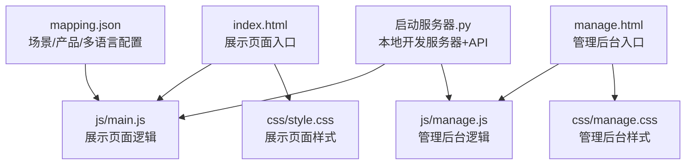
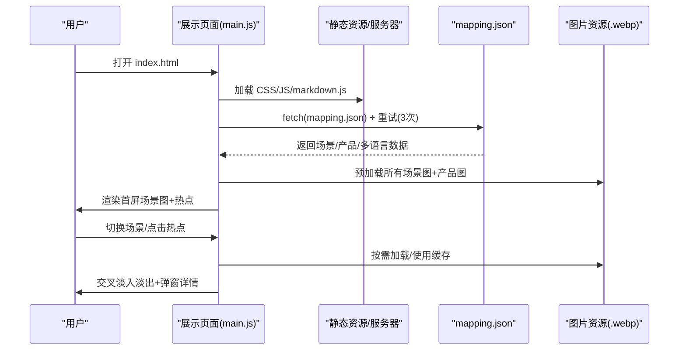
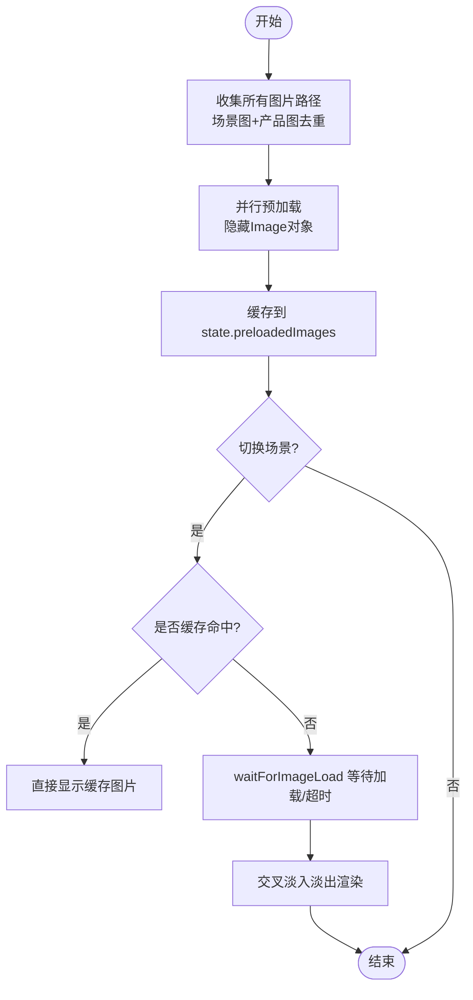
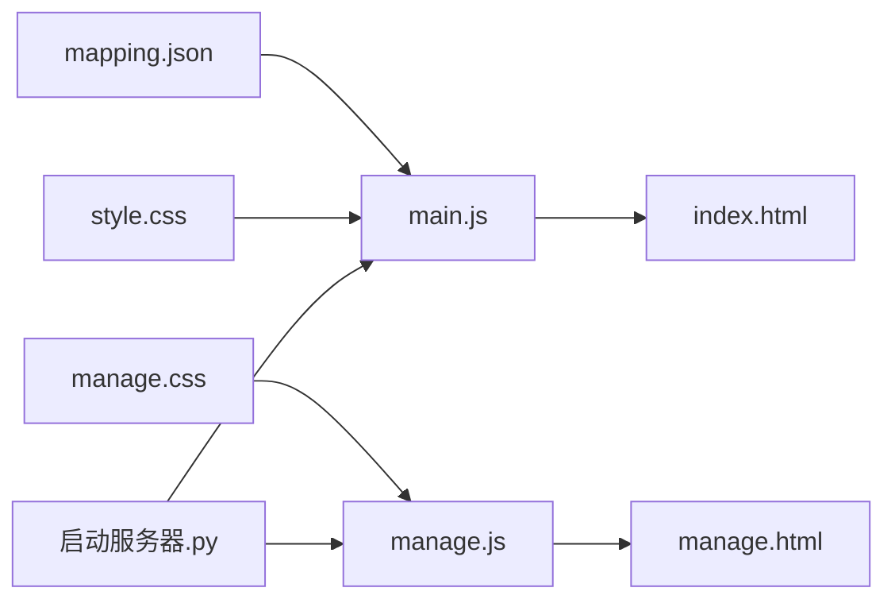

# 性能优化

<cite>
**本文引用的文件**
- [index.html](file://index.html)
- [main.js](file://js/main.js)
- [style.css](file://css/style.css)
- [manage.html](file://manage.html)
- [manage.js](file://js/manage.js)
- [manage.css](file://css/manage.css)
- [mapping.json](file://mapping.json)
- [项目架构说明](file://project_architecture.md)
- [启动服务器.py](file://启动服务器.py)
</cite>

## 目录
1. [简介](#简介)
2. [项目结构](#项目结构)
3. [核心组件](#核心组件)
4. [架构总览](#架构总览)
5. [详细组件分析](#详细组件分析)
6. [依赖关系分析](#依赖关系分析)
7. [性能考量](#性能考量)
8. [故障排查指南](#故障排查指南)
9. [结论](#结论)
10. [附录](#附录)

## 简介
本指南围绕数字标牌产品展示项目，系统梳理前端性能优化策略，涵盖图片优化、加载性能、内存管理、JavaScript性能、网络性能、移动端优化、性能监控与评估等方面。结合项目现有实现（如图片预加载、交叉淡入淡出、骨架屏、错误可重试、多语言与Markdown缓存等），给出可落地的优化建议与案例路径，帮助开发者快速提升用户体验与运行效率。

## 项目结构
项目采用“数据与逻辑分离”的架构：数据由 mapping.json 提供，前端通过 fetch 动态加载；展示页面与管理后台分别对应不同的入口与职责边界。整体结构清晰，便于按模块进行性能优化。

图表来源
- [index.html:1-83](file://index.html#L1-L83)
- [main.js:1-1284](file://js/main.js#L1-L1284)
- [style.css:1-997](file://css/style.css#L1-L997)
- [manage.html:1-113](file://manage.html#L1-L113)
- [manage.js:1-811](file://js/manage.js#L1-L811)
- [manage.css:1-824](file://css/manage.css#L1-L824)
- [mapping.json:1-232](file://mapping.json#L1-L232)
- [启动服务器.py:1-298](file://启动服务器.py#L1-L298)

章节来源
- [项目架构说明:43-108](file://project_architecture.md#L43-L108)

## 核心组件
- 数据加载与重试：通过 fetch 动态加载 mapping.json，内置最多 3 次递增延迟重试，失败时触发全屏错误提示。
- 图片预加载与缓存：遍历所有场景图与产品图，使用隐藏 Image 对象预加载并缓存，切换时优先使用缓存避免闪烁与白屏。
- 交叉淡入淡出：双层图片容器实现无黑屏过渡，配合加载指示器与超时保护，保证流畅体验。
- 多语言与Markdown：多语言文本统一从 i18n 字典获取；Markdown 描述采用缓存与可点击重试机制，失败时提供降级文案。
- 事件与状态：全局状态管理与事件锁（如切换中锁、详情弹窗锁）避免并发冲突；DOM 元素集中管理，减少重复查询。

章节来源
- [main.js:49-73](file://js/main.js#L49-L73)
- [main.js:257-327](file://js/main.js#L257-L327)
- [main.js:480-595](file://js/main.js#L480-L595)
- [main.js:421-442](file://js/main.js#L421-L442)
- [main.js:195-204](file://js/main.js#L195-L204)

## 架构总览
展示页面与管理后台共享数据源 mapping.json，通过本地开发服务器提供 API 端点，支持图片上传、列表查询与配置保存。样式采用 CSS3 动画与毛玻璃效果，提升视觉体验的同时注意性能开销。

图表来源
- [main.js:49-73](file://js/main.js#L49-L73)
- [main.js:257-327](file://js/main.js#L257-L327)
- [main.js:480-595](file://js/main.js#L480-L595)
- [启动服务器.py:75-97](file://启动服务器.py#L75-L97)
- [mapping.json:1-232](file://mapping.json#L1-L232)

## 详细组件分析

### 图片优化策略
- 格式选择：项目大量使用 .webp 格式（场景图、产品图），具备更高压缩率与更好的质量表现，适合展示类场景。
- 预加载与缓存：通过预加载函数收集所有图片路径并并行加载，使用对象缓存已加载的 Image，切换时优先命中缓存，避免闪烁与白屏。
- 加载等待与超时：waitForImageLoad 提供超时保护与事件监听，避免长时间阻塞；isImageCached 判断决定是否显示加载指示器。
- 骨架屏与占位：详情页产品列表采用骨架屏占位，提升感知速度；加载失败时提供可点击重试提示。

图表来源
- [main.js:257-327](file://js/main.js#L257-L327)
- [main.js:354-395](file://js/main.js#L354-L395)
- [main.js:404-406](file://js/main.js#L404-L406)

章节来源
- [main.js:257-327](file://js/main.js#L257-L327)
- [main.js:354-395](file://js/main.js#L354-L395)
- [main.js:404-406](file://js/main.js#L404-L406)
- [项目架构说明:60-100](file://project_architecture.md#L60-L100)

### 加载性能优化
- 首屏独占带宽：首屏图片加载完成后才启动其余图片预加载，避免慢速网络下首屏长期空白。
- 资源预加载策略：预加载函数遍历 mapping.json 中所有场景与产品图片，使用 Promise.all 并行加载，缩短总体等待时间。
- 缓存机制：图片缓存与 Markdown 描述缓存双重缓存，避免重复请求；错误时提供可点击重试，提升容错能力。
- 交叉淡入淡出：双层图片容器 + CSS 过渡，消除黑屏与闪烁，提升感知流畅度。

章节来源
- [main.js:257-327](file://js/main.js#L257-L327)
- [main.js:421-442](file://js/main.js#L421-L442)
- [main.js:480-595](file://js/main.js#L480-L595)
- [style.css:86-127](file://css/style.css#L86-L127)

### 内存管理最佳实践
- DOM 元素集中管理：dom 对象统一持有关键节点引用，避免重复查询与泄漏。
- 事件监听器清理：使用 addEventListener 并配合 { once: true } 防止监听器累积；详情弹窗关闭后及时移除事件与清理状态。
- 状态锁与并发控制：isTransitioning、isDetailOpen 等状态锁避免并发切换与渲染，降低内存抖动风险。
- 骨架屏与占位：详情页使用骨架屏占位，减少真实 DOM 的频繁创建与销毁。

章节来源
- [main.js:169-188](file://js/main.js#L169-L188)
- [main.js:597-624](file://js/main.js#L597-L624)
- [main.js:597-606](file://js/main.js#L597-L606)
- [style.css:744-790](file://css/style.css#L744-L790)

### JavaScript 性能优化技巧
- 异步加载与并行：Promise.all 并行预加载图片；Markdown 描述 Promise.all 并行加载，显著缩短等待时间。
- 防抖与节流：切换场景时使用状态锁与定时器，避免短时间内多次触发；详情弹窗关闭后延迟清理，减少主线程压力。
- DOM 操作优化：批量更新 DOM，使用 requestAnimationFrame 触发动画；热点与切换器在切换前先隐藏，避免不必要的重绘。
- 事件绑定与解绑：使用 { once: true } 与显式移除监听器，避免内存泄漏。

章节来源
- [main.js:322-327](file://js/main.js#L322-L327)
- [main.js:597-624](file://js/main.js#L597-L624)
- [main.js:480-595](file://js/main.js#L480-L595)

### 网络性能优化
- 本地开发服务器：启动服务器.py 提供静态文件服务与 API 端点，支持 CORS，便于本地调试与管理后台使用。
- API 设计：提供图片列表、描述列表、保存配置、上传图片等接口，减少手动维护成本。
- 缓存策略：浏览器缓存 + 应用层缓存（图片与 Markdown），降低重复请求与带宽占用。
- 错误重试：数据加载与 Markdown 加载均提供重试与可点击重试提示，提升在网络波动下的可用性。

章节来源
- [启动服务器.py:25-97](file://启动服务器.py#L25-L97)
- [启动服务器.py:204-251](file://启动服务器.py#L204-L251)
- [main.js:49-73](file://js/main.js#L49-L73)
- [main.js:421-442](file://js/main.js#L421-L442)

### 移动端性能优化
- 触摸事件优化：热点容器与导航按钮均支持触摸交互，使用 CSS 动画与 GPU 加速，减少主线程压力。
- 硬件加速：CSS3 动画与 transform/opacity 使用 GPU 加速，提升流畅度。
- 电池消耗控制：避免过度重绘与频繁 DOM 操作；详情弹窗关闭后延迟清理，降低后台任务开销。
- 响应式布局：媒体查询与弹性布局适配不同设备尺寸，减少额外缩放与重排。

章节来源
- [style.css:383-396](file://css/style.css#L383-L396)
- [style.css:86-127](file://css/style.css#L86-L127)

### 性能监控与分析方法
- 关键指标测量：首屏加载时间、图片加载成功率、交叉淡入淡出耗时、详情弹窗打开耗时、Markdown 加载耗时。
- 性能瓶颈识别：使用浏览器性能面板观察主线程占用、重绘重排、GPU 使用情况；关注预加载阶段与切换阶段的峰值。
- 优化效果评估：对比优化前后关键指标变化，结合用户反馈与日志统计，持续迭代。

章节来源
- [项目架构说明:304-396](file://project_architecture.md#L304-L396)

## 依赖关系分析
- 展示页面依赖 mapping.json 提供的数据，依赖静态资源（CSS/JS/图片/Markdown）与本地服务器 API。
- 管理后台依赖本地服务器 API 获取图片与描述列表，依赖 mapping.json 进行可视化编辑与保存。

图表来源
- [mapping.json:1-232](file://mapping.json#L1-L232)
- [main.js:1-1284](file://js/main.js#L1-L1284)
- [style.css:1-997](file://css/style.css#L1-L997)
- [index.html:1-83](file://index.html#L1-L83)
- [manage.js:1-811](file://js/manage.js#L1-L811)
- [manage.css:1-824](file://css/manage.css#L1-L824)
- [manage.html:1-113](file://manage.html#L1-L113)
- [启动服务器.py:1-298](file://启动服务器.py#L1-L298)

章节来源
- [项目架构说明:763-776](file://project_architecture.md#L763-L776)

## 性能考量
- 图片体积与格式：继续推进 .webp 使用，必要时引入 AVIF 以获得更高压缩率；对大图进行合理裁剪与尺寸控制。
- 预加载策略：根据设备性能与网络状况动态调整预加载数量与并发度，避免抢占带宽。
- 动画与特效：在低端设备上适度降低动画复杂度与频率，保证交互流畅。
- 缓存与持久化：利用浏览器缓存与应用层缓存，减少重复请求；对关键资源进行版本化管理。
- 错误与降级：完善错误处理与降级策略，确保在网络异常时仍能提供基本体验。

## 故障排查指南
- mapping.json 加载失败：检查网络连接与服务器状态；查看控制台错误日志；确认 CORS 配置。
- 图片加载失败：检查图片路径是否存在；确认图片格式与大小；查看预加载日志。
- Markdown 加载失败：检查描述文件路径；查看缓存状态；确认可点击重试是否生效。
- 详情弹窗异常：检查 isDetailOpen 状态锁；确认事件绑定与清理；查看 DOM 结构是否完整。

章节来源
- [main.js:49-73](file://js/main.js#L49-L73)
- [main.js:421-442](file://js/main.js#L421-L442)
- [main.js:597-606](file://js/main.js#L597-L606)
- [项目架构说明:565-607](file://project_architecture.md#L565-L607)

## 结论
本项目在展示页面与管理后台两端均实现了较为完善的性能基础：数据与逻辑分离、图片预加载与缓存、交叉淡入淡出、多语言与 Markdown 缓存、错误可重试与骨架屏等。在此基础上，建议进一步优化图片体积与格式、动态调整预加载策略、在低端设备上适度简化动画、完善监控与评估体系，以获得更佳的用户体验与运行效率。

## 附录
- 优化案例路径
  - 图片优化：[图片预加载与缓存:257-327](file://js/main.js#L257-L327)、[加载等待与超时:354-395](file://js/main.js#L354-L395)
  - 加载性能：[首屏独占带宽:539-540](file://js/main.js#L539-L540)、[并行预加载:322-327](file://js/main.js#L322-L327)
  - 内存管理：[DOM 元素集中管理:169-188](file://js/main.js#L169-L188)、[状态锁与清理:597-606](file://js/main.js#L597-L606)
  - JavaScript 性能：[并行加载与 requestAnimationFrame:546-550](file://js/main.js#L546-L550)、[事件监听器清理:388-394](file://js/main.js#L388-L394)
  - 网络性能：[本地服务器 API:75-97](file://启动服务器.py#L75-L97)、[图片/描述列表:204-251](file://启动服务器.py#L204-L251)
  - 移动端优化：[硬件加速与动画:383-396](file://css/style.css#L383-L396)、[响应式布局:1-22](file://css/style.css#L1-L22)
  - 性能监控：[关键指标测量:304-396](file://project_architecture.md#L304-L396)