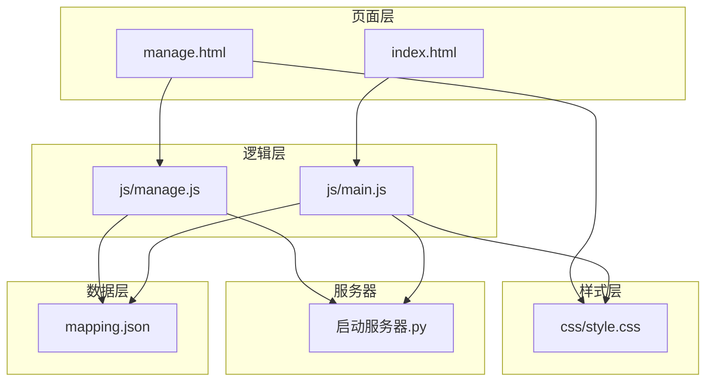
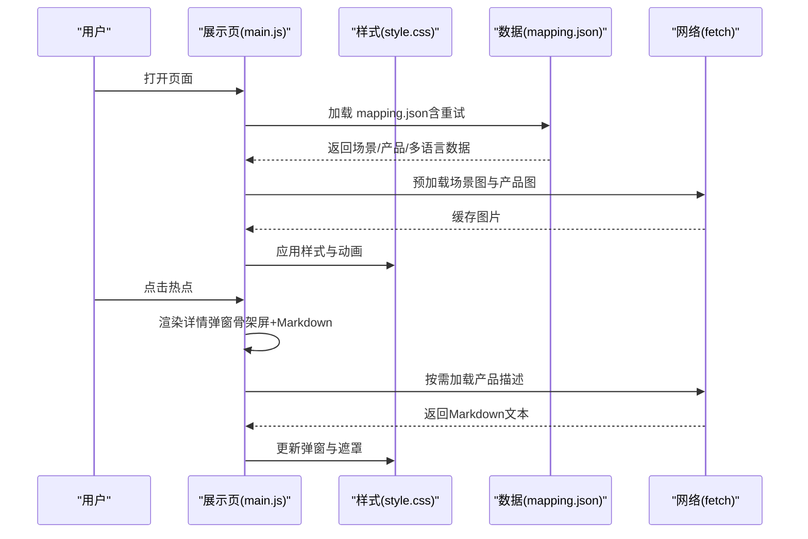
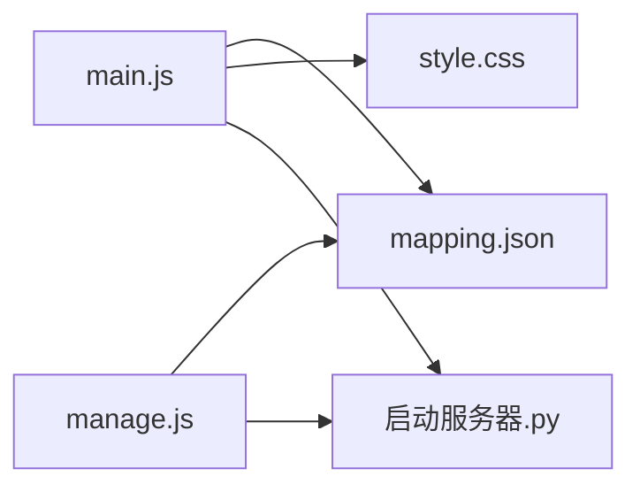

# 移动端性能优化

<cite>
**本文引用的文件**
- [index.html](file://index.html)
- [manage.html](file://manage.html)
- [js/main.js](file://js/main.js)
- [js/manage.js](file://js/manage.js)
- [css/style.css](file://css/style.css)
- [mapping.json](file://mapping.json)
- [project_architecture.md](file://project_architecture.md)
- [启动服务器.py](file://启动服务器.py)
</cite>

## 目录
1. [简介](#简介)
2. [项目结构](#项目结构)
3. [核心组件](#核心组件)
4. [架构总览](#架构总览)
5. [详细组件分析](#详细组件分析)
6. [依赖关系分析](#依赖关系分析)
7. [性能考量](#性能考量)
8. [故障排查指南](#故障排查指南)
9. [结论](#结论)
10. [附录](#附录)

## 简介
本文件聚焦于数字标牌项目在移动端的性能优化，围绕触摸事件优化、硬件加速利用、电池消耗控制、移动端网络优化、移动端特有问题与调试实践等方面，结合项目现有实现进行系统化梳理与改进建议。项目采用纯原生前端技术栈，无第三方框架依赖，具备良好的可维护性与可扩展性，便于在移动端场景中实施针对性优化。

## 项目结构
项目采用“页面 + 数据 + 样式 + 逻辑”的清晰分层：
- 页面层：index.html（展示页）、manage.html（管理后台）
- 数据层：mapping.json（场景/产品/多语言配置）
- 样式层：css/style.css（展示页样式与动画）
- 逻辑层：js/main.js（展示页交互）、js/manage.js（管理后台交互）
- 服务器：启动服务器.py（本地开发服务器 + API）

图表来源
- [index.html](file://index.html)
- [manage.html](file://manage.html)
- [js/main.js](file://js/main.js)
- [js/manage.js](file://js/manage.js)
- [css/style.css](file://css/style.css)
- [mapping.json](file://mapping.json)
- [启动服务器.py](file://启动服务器.py)

章节来源
- [project_architecture.md](file://project_architecture.md)

## 核心组件
- 数据加载与重试：通过 fetch 从 mapping.json 动态加载，含 3 次递增延迟重试，失败时显示全屏错误提示。
- 多语言引擎：提供 t()、getText()、switchLanguage()，支持中日文切换与 UI 文本动态更新。
- 图片预加载与缓存：遍历场景图与产品图，使用 Image 对象预加载并缓存，减少切换时延。
- 场景渲染与切换：双层图片交叉淡入淡出，使用 requestAnimationFrame 与超时保护，避免黑屏与卡顿。
- 热点渲染与交互：基于 object-fit: cover 的图片裁剪计算，热点像素位置精确映射，支持多热点脉冲动画。
- 详情弹窗：左图右文布局，Markdown 渲染，骨架屏占位与错误可重试提示。
- 管理后台：三栏布局，可视化编辑场景、热点与产品，支持图片上传与配置保存。

章节来源
- [js/main.js](file://js/main.js)
- [css/style.css](file://css/style.css)
- [mapping.json](file://mapping.json)
- [project_architecture.md](file://project_architecture.md)

## 架构总览
移动端性能优化的关键在于“数据与渲染解耦、事件与动画分离、资源与网络协同”。项目通过以下设计达成：
- 数据与视图分离：mapping.json 与 main.js 解耦，便于缓存与增量更新。
- 视图与动画分离：CSS 过渡与 JS 动画职责清晰，避免主线程阻塞。
- 事件与交互分离：热点容器 pointer-events: none，点击事件在热点元素上触发，降低事件冒泡成本。
- 网络与资源分离：图片预加载与 Markdown 缓存，弱网环境下的降级与重试策略。

图表来源
- [js/main.js](file://js/main.js)
- [css/style.css](file://css/style.css)
- [mapping.json](file://mapping.json)

## 详细组件分析

### 触摸事件与手势优化
- 事件委托与冒泡控制
  - 热点容器设置 pointer-events: none，热点元素设置 pointer-events: all，仅在热点元素上绑定点击事件，避免不必要的事件冒泡与捕获。
  - 点击热点后调用 onHotspotClick，传递产品数组与分类名，减少 DOM 查询与状态传递成本。
- 触摸反馈与视觉反馈
  - 热点中心点与波纹环使用 CSS 动画，hover 时暂停动画并增强发光效果，提升触觉反馈体验。
  - 场景切换按钮与指示器使用 hover/active 状态，配合 transform 缩放与阴影变化，增强点击感知。
- 手势冲突规避
  - 场景容器与热点容器分别承担“场景切换”和“热点点击”，避免同时监听触摸滑动导致的手势冲突。
  - 详情弹窗开启时，背景容器 dimmed 状态与遮罩层 opacity 控制，确保弹窗交互独立。

章节来源
- [css/style.css](file://css/style.css)
- [js/main.js](file://js/main.js)

### 硬件加速与动画优化
- 交叉淡入淡出
  - 使用 .scene-layer 的 opacity 过渡（1.2s），配合 CSS cubic-bezier 缓动曲线，充分利用 GPU 加速合成层。
  - 切换前后先更新 activeLayer 标记，再切换 CSS 类，确保 repositionHotspots 引用正确图层。
- 热点动画
  - .hotspot 出现动画与 .hotspot-core 脉动使用 transform: scale 与 animation，避免强制重排。
  - 多热点动画延迟分散（nth-child），减轻主线程压力。
- 骨架屏与加载指示
  - .desc-loading 与 .skeleton-line 使用 background-position 动画，避免复杂布局重排。
  - #loading-indicator 使用 transform: translate(-50%, -50%) 与 animation，减少布局抖动。

章节来源
- [css/style.css](file://css/style.css)
- [js/main.js](file://js/main.js)

### 电池消耗控制
- CPU 使用率监控建议
  - 使用 Performance API 记录关键帧耗时（如 renderScene、renderHotspots），在开发阶段识别长任务。
  - 使用 requestAnimationFrame 包裹高频更新逻辑，避免主线程阻塞。
- 后台任务限制
  - 场景切换时隐藏热点与切换器，减少不必要的 DOM 更新与重绘。
  - 弹窗开启时仅保留必要元素，背景容器 dimmed 与遮罩层透明度过渡，避免过度合成。
- 屏幕亮度智能调节
  - 项目未涉及屏幕亮度控制，可在移动端浏览器中通过系统设置或 PWA manifest 控制显示模式（如 prefers-color-scheme）。

章节来源
- [js/main.js](file://js/main.js)
- [css/style.css](file://css/style.css)

### 移动端网络优化
- 离线缓存策略
  - 图片预加载：遍历 mapping.json 中的场景图与产品图，使用 Image 对象预加载并缓存，减少切换时延。
  - Markdown 缓存：descriptionCache 对象缓存已加载的 Markdown 文件，避免重复请求。
- 弱网环境适配
  - 图片加载失败重试：preloadOne 支持最多 2 次重试，递增延迟，提升成功率。
  - Markdown 加载失败降级：返回可点击重试的 HTML 文本，点击后清除缓存重新加载。
- 流量使用优化
  - 图片格式：场景图与产品图采用 .webp，体积更小，加载更快。
  - 首屏独占带宽：首屏图片加载完成后启动其余图片预加载，避免慢速网络下首屏永远不显示。

章节来源
- [js/main.js](file://js/main.js)
- [mapping.json](file://mapping.json)

### 移动端特有问题与解决方案
- 内存限制
  - 图片缓存：state.preloadedImages 仅缓存已加载图片，避免无限增长；可通过 LRU 或容量阈值进一步优化。
  - DOM 复用：详情弹窗关闭后清理 DOM 与状态（state.currentProducts = null），释放内存。
- 存储空间
  - 图片与描述文件采用相对路径，集中管理在场景图/产品图/产品描述目录，便于清理与迁移。
- 设备兼容性
  - object-fit: cover 与裁剪偏移计算，确保热点位置与图片绘制区域一致。
  - CSS 动画使用 transform 与 opacity，避免强制重排，提升低端设备表现。

章节来源
- [js/main.js](file://js/main.js)
- [css/style.css](file://css/style.css)

### 移动端调试与性能测试最佳实践
- 调试工具
  - Chrome DevTools：Performance 面板记录帧率与长任务；Memory 面板观察内存增长；Network 面板分析图片与 Markdown 加载。
  - Lighthouse：评估性能、可访问性与最佳实践得分，针对移动端指标优化。
- 性能测试
  - 使用 Throttling 模拟 3G/4G 网络，验证弱网环境下的加载与交互表现。
  - 使用 FPS Meter 或自定义计时器统计关键操作耗时（如场景切换、热点渲染）。
- 代码级优化建议
  - 将高频事件（如鼠标移动）改为节流/防抖，减少回调频率。
  - 使用 IntersectionObserver 替代 scroll 事件监听，降低主线程压力。
  - 合理拆分动画与布局，避免在同一帧内多次强制重排。

章节来源
- [js/main.js](file://js/main.js)
- [css/style.css](file://css/style.css)

## 依赖关系分析
- 数据依赖：main.js 依赖 mapping.json 提供场景与产品数据；管理后台依赖服务器 API 获取图片与描述列表。
- 样式依赖：CSS 动画与过渡依赖 DOM 结构（场景容器、热点容器、详情弹窗）。
- 服务器依赖：管理后台通过 /api/save-mapping、/api/upload-image、/api/list-images、/api/list-descriptions 与本地服务器通信。

图表来源
- [js/main.js](file://js/main.js)
- [js/manage.js](file://js/manage.js)
- [css/style.css](file://css/style.css)
- [mapping.json](file://mapping.json)
- [启动服务器.py](file://启动服务器.py)

章节来源
- [project_architecture.md](file://project_architecture.md)

## 性能考量
- 动画与合成
  - 优先使用 transform 与 opacity，避免频繁触发布局与绘制。
  - 合理设置动画时长与缓动曲线，平衡视觉体验与性能。
- 资源与网络
  - 图片格式与尺寸优化，减少首屏加载时间。
  - 预加载策略与缓存命中率直接影响切换流畅度。
- 事件与交互
  - 事件委托与最小化监听器数量，降低事件处理成本。
  - 避免在触摸事件中执行同步阻塞操作。

[本节为通用指导，不直接分析具体文件]

## 故障排查指南
- mapping.json 加载失败
  - 现象：全屏错误遮罩与重试按钮。
  - 处理：检查网络连接与服务器状态；确认路径与权限。
- 图片加载失败
  - 现象：热点渲染缺失或加载指示器常驻。
  - 处理：检查图片路径与格式；确认预加载缓存状态。
- Markdown 加载失败
  - 现象：产品描述显示可点击重试提示。
  - 处理：点击重试清除缓存后重新加载；检查文件路径与权限。
- 场景切换卡顿
  - 现象：切换时黑屏或延迟明显。
  - 处理：检查图片大小与格式；确认预加载完成；优化动画时长。

章节来源
- [js/main.js](file://js/main.js)
- [css/style.css](file://css/style.css)

## 结论
本项目在移动端性能方面已具备良好基础：数据与视图分离、CSS 动画与 GPU 合成、弱网环境下的重试与降级策略。为进一步提升移动端体验，建议在事件优化、资源缓存策略、长任务监控与调试工具链方面持续完善，确保在不同设备与网络条件下稳定流畅地呈现数字标牌内容。

[本节为总结性内容，不直接分析具体文件]

## 附录
- 术语
  - 骨架屏：用于内容加载前的占位样式，提升感知速度。
  - 合成层：由 GPU 管理的图层，transform 与 opacity 变化通常在合成层执行，避免布局与绘制。
- 参考
  - 项目架构文档：包含数据结构、页面结构与 API 说明。

章节来源
- [project_architecture.md](file://project_architecture.md)