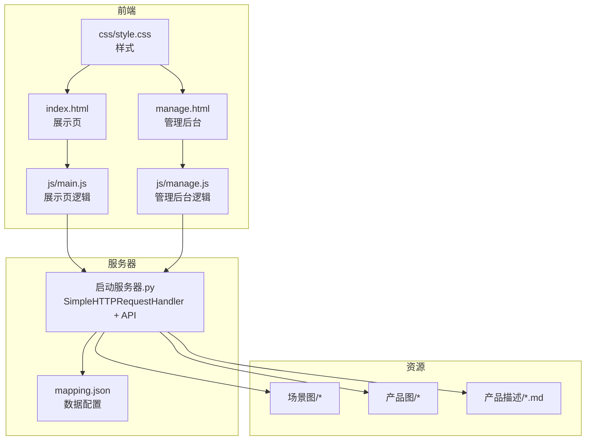
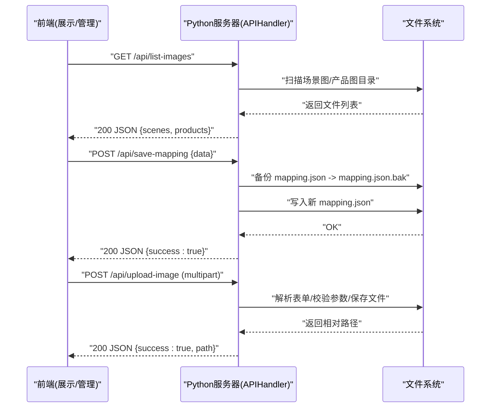
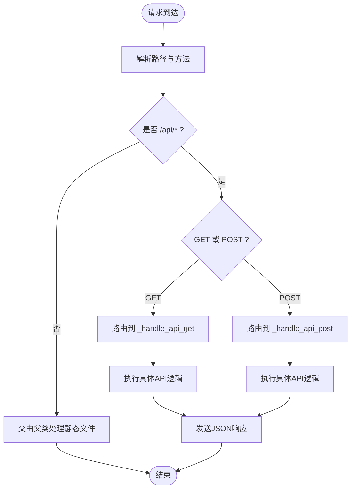
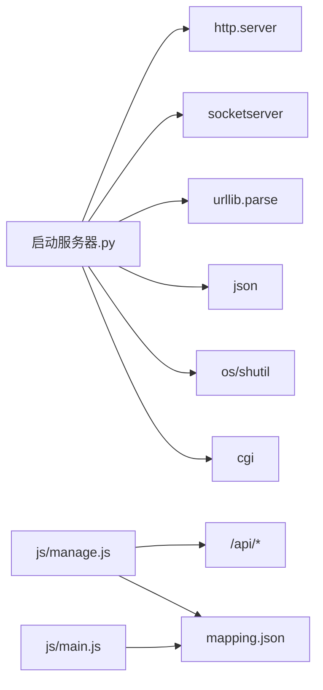

# API扩展

<cite>
**本文引用的文件**
- [启动服务器.py](file://启动服务器.py)
- [project_architecture.md](file://project_architecture.md)
- [index.html](file://index.html)
- [manage.html](file://manage.html)
- [mapping.json](file://mapping.json)
- [js/main.js](file://js/main.js)
- [js/manage.js](file://js/manage.js)
- [css/style.css](file://css/style.css)
- [产品描述/室内双面吊装标牌.md](file://产品描述/室内双面吊装标牌.md)
- [产品描述/自助点单机1.md](file://产品描述/自助点单机1.md)
</cite>

## 目录
1. [简介](#简介)
2. [项目结构](#项目结构)
3. [核心组件](#核心组件)
4. [架构总览](#架构总览)
5. [详细组件分析](#详细组件分析)
6. [依赖分析](#依赖分析)
7. [性能考量](#性能考量)
8. [故障排查指南](#故障排查指南)
9. [结论](#结论)
10. [附录](#附录)

## 简介
本指南面向在Python本地开发服务器上扩展API端点与业务逻辑的开发者，围绕数字标牌产品展示项目，系统讲解如何在现有基础上安全、稳定地新增RESTful API端点，包括路由定义、请求处理、响应格式、错误处理、版本管理与向后兼容策略，并提供可落地的扩展示例（如用户管理、产品搜索、统计分析等）。

## 项目结构
该项目采用“静态资源 + 本地Python HTTP服务器 + 前端单页应用”的轻量架构：
- 服务器：内置HTTP服务器，提供静态文件服务与4个API端点
- 前端：展示页与管理后台两套SPA，通过fetch与服务器交互
- 数据：mapping.json集中管理场景、热点、产品与国际化文案
- 资源：场景图、产品图、产品描述Markdown文件

图表来源
- [启动服务器.py:1-298](file://启动服务器.py#L1-L298)
- [project_architecture.md:43-108](file://project_architecture.md#L43-L108)

章节来源
- [project_architecture.md:43-108](file://project_architecture.md#L43-L108)
- [启动服务器.py:17-298](file://启动服务器.py#L17-L298)

## 核心组件
- 服务器处理器：继承自SimpleHTTPRequestHandler，扩展CORS、统一JSON响应、错误处理与路由分发
- API端点：提供保存配置、上传图片、列出图片、列出描述四项接口
- 前端交互：展示页与管理后台通过fetch调用API，管理后台还负责备份与写回

章节来源
- [启动服务器.py:25-98](file://启动服务器.py#L25-L98)
- [启动服务器.py:75-252](file://启动服务器.py#L75-L252)
- [js/manage.js:35-108](file://js/manage.js#L35-L108)

## 架构总览
服务器作为统一入口，既提供静态资源，又承载API。前端通过REST风格URL访问，遵循统一的响应约定与错误处理。

图表来源
- [启动服务器.py:75-252](file://启动服务器.py#L75-L252)
- [js/manage.js:48-108](file://js/manage.js#L48-L108)

## 详细组件分析

### 服务器处理器与路由
- CORS处理：OPTIONS预检与响应头设置
- 统一JSON响应：成功与错误响应格式一致
- 路由分发：GET与POST分别进入_handle_api_get/_handle_api_post
- 错误捕获：异常统一转换为错误JSON响应

图表来源
- [启动服务器.py:54-98](file://启动服务器.py#L54-L98)

章节来源
- [启动服务器.py:25-98](file://启动服务器.py#L25-L98)

### 现有API端点详解
- POST /api/save-mapping
  - 请求体：完整mapping.json数据
  - 处理：解析JSON → 备份原文件 → 写入新文件
  - 响应：成功返回{"success": true}
  - 错误：请求体为空(400)、JSON解析失败(400)、服务器错误(500)
- POST /api/upload-image
  - 请求体：multipart/form-data，字段file/type/category/filename
  - 处理：校验类型 → 确定保存目录 → 保存文件 → 返回相对路径
  - 响应：{"success": true, "path": "..."}
  - 错误：非multipart(400)、缺少参数(400)、未知type(400)
- GET /api/list-images
  - 处理：扫描场景图与产品图目录，过滤图片扩展名
  - 响应：{"scenes": {...}, "products": [...]}
- GET /api/list-descriptions
  - 处理：扫描产品描述目录，过滤.md扩展名
  - 响应：["产品描述/xxx.md", ...]

章节来源
- [启动服务器.py:101-252](file://启动服务器.py#L101-L252)
- [project_architecture.md:763-803](file://project_architecture.md#L763-L803)

### 前端集成要点
- 展示页：主要消费mapping.json与Markdown描述，不直接依赖API
- 管理后台：通过fetch调用API进行数据读写与图片上传
- 错误提示：统一Toast提示，区分成功/失败状态

章节来源
- [js/manage.js:35-108](file://js/manage.js#L35-L108)
- [index.html:1-83](file://index.html#L1-L83)
- [manage.html:1-113](file://manage.html#L1-L113)

## 依赖分析
- 服务器依赖：标准库http.server、socketserver、urllib.parse、json、os、shutil、cgi
- 前端依赖：marked.js用于Markdown解析（CDN引入）
- 数据依赖：mapping.json集中配置，前端与管理后台共享同一数据源

图表来源
- [启动服务器.py:7-15](file://启动服务器.py#L7-L15)
- [js/manage.js:35-46](file://js/manage.js#L35-L46)
- [js/main.js:49-73](file://js/main.js#L49-L73)

章节来源
- [启动服务器.py:7-15](file://启动服务器.py#L7-L15)
- [js/manage.js:35-46](file://js/manage.js#L35-L46)
- [js/main.js:49-73](file://js/main.js#L49-L73)

## 性能考量
- 静态文件服务：利用内置HTTP服务器，适合本地开发
- 图片上传：分块读取，避免大文件内存占用
- 响应格式：统一JSON，减少前端解析成本
- 建议：生产环境建议迁移到具备中间件、限流、缓存与CDN能力的Web框架

[本节为通用指导，无需特定文件来源]

## 故障排查指南
- CORS问题：确认服务器已设置Access-Control-Allow-Origin等头
- JSON解析失败：检查请求体是否为合法JSON，Content-Type是否为application/json
- 文件写入失败：检查服务器进程权限与磁盘空间
- 图片上传失败：确认Content-Type为multipart/form-data，字段齐全
- 前端无法加载mapping.json：检查路径与网络，观察重试逻辑

章节来源
- [启动服务器.py:28-46](file://启动服务器.py#L28-L46)
- [启动服务器.py:110-114](file://启动服务器.py#L110-L114)
- [js/main.js:49-73](file://js/main.js#L49-L73)

## 结论
通过在现有SimpleHTTPRequestHandler基础上扩展路由与业务逻辑，可以在不引入复杂依赖的前提下快速迭代API。建议遵循REST规范、统一响应与错误格式、做好参数校验与备份策略，并在管理后台中提供友好的错误提示与状态反馈。

[本节为总结，无需特定文件来源]

## 附录

### API扩展设计原则
- RESTful规范
  - 使用名词而非动词命名端点
  - 使用标准HTTP方法：GET/POST/PUT/DELETE
  - 使用层级路径表达资源关系
- 版本管理
  - 建议在URL中加入版本号：/api/v1/...
  - 保持向后兼容，新增端点不破坏旧接口
- 错误处理
  - 统一错误响应格式：{"success": false, "error": "..."}
  - 明确HTTP状态码与错误信息
- 数据一致性
  - 写操作前先备份，失败时回滚
  - 严格校验请求参数与数据结构

[本节为通用指导，无需特定文件来源]

### 扩展步骤与最佳实践
- 新增端点
  - 在路由分发处注册新路径
  - 实现具体API逻辑，处理请求参数与业务规则
  - 统一响应格式，必要时返回错误码
- 路由定义
  - 在_handle_api_get/_handle_api_post中新增分支
  - 保持与现有端点一致的错误处理与CORS设置
- 请求处理
  - GET：查询类逻辑，尽量无副作用
  - POST：幂等性优先，必要时引入去重键
- 响应格式
  - 成功：{"success": true, ...}
  - 失败：{"success": false, "error": "..."}
- 安全考虑
  - 限制文件上传类型与大小
  - 对写操作进行鉴权与审计
  - 严格校验输入参数，防止注入与越权
- 测试方法
  - 单元测试：针对业务逻辑与参数校验
  - 集成测试：模拟前端调用，覆盖成功/失败路径
  - 压力测试：模拟并发请求，评估性能与稳定性

[本节为通用指导，无需特定文件来源]

### 具体扩展示例

#### 示例一：用户管理API
- 设计
  - GET /api/v1/users：获取用户列表
  - POST /api/v1/users：创建用户
  - PUT /api/v1/users/{id}：更新用户
  - DELETE /api/v1/users/{id}：删除用户
- 实现要点
  - 参数校验：用户名、邮箱、角色等
  - 数据持久化：可使用JSON文件或SQLite
  - 错误处理：重复用户名、非法邮箱、权限不足
  - 响应格式：统一success/error

[本节为概念性示例，无需特定文件来源]

#### 示例二：产品搜索API
- 设计
  - GET /api/v1/products/search?q=关键词&category=类别
  - 返回匹配的产品集合（支持分页）
- 实现要点
  - 基于mapping.json中的产品名称与描述进行模糊匹配
  - 支持多语言关键词（根据当前语言）
  - 分页参数：page/size
  - 性能优化：建立索引或缓存热门查询

[本节为概念性示例，无需特定文件来源]

#### 示例三：统计分析API
- 设计
  - GET /api/v1/stats/scenes：场景访问统计
  - GET /api/v1/stats/products：产品点击统计
- 实现要点
  - 数据来源：前端埋点上报或服务器日志
  - 时间范围：start/end参数
  - 聚合维度：按场景、产品、时间区间聚合
  - 响应格式：时间序列或汇总指标

[本节为概念性示例，无需特定文件来源]

### API版本升级与向后兼容
- 版本策略
  - URL版本：/api/v1/...，v2/...，逐步迁移
  - 头部版本：Accept-Version或API-Version
- 升级流程
  - 新增v2端点，保持v1不变
  - 通知客户端迁移，设置迁移窗口
  - 窗口结束后停止v1维护
- 兼容性
  - v1保持只读或有限写操作
  - v2提供增强功能，保留常用字段
  - 文档与变更日志清晰标注差异

[本节为通用指导，无需特定文件来源]

### 与现有代码的对接要点
- 路由扩展
  - 在_handle_api_get/_handle_api_post中新增分支
  - 保持CORS与统一JSON响应
- 前端调用
  - 管理后台已有fetch封装，可复用
  - 注意错误提示与状态反馈
- 数据一致性
  - 写操作前备份，失败回滚
  - 严格校验请求参数与数据结构

章节来源
- [启动服务器.py:75-98](file://启动服务器.py#L75-L98)
- [启动服务器.py:101-127](file://启动服务器.py#L101-L127)
- [js/manage.js:81-108](file://js/manage.js#L81-L108)