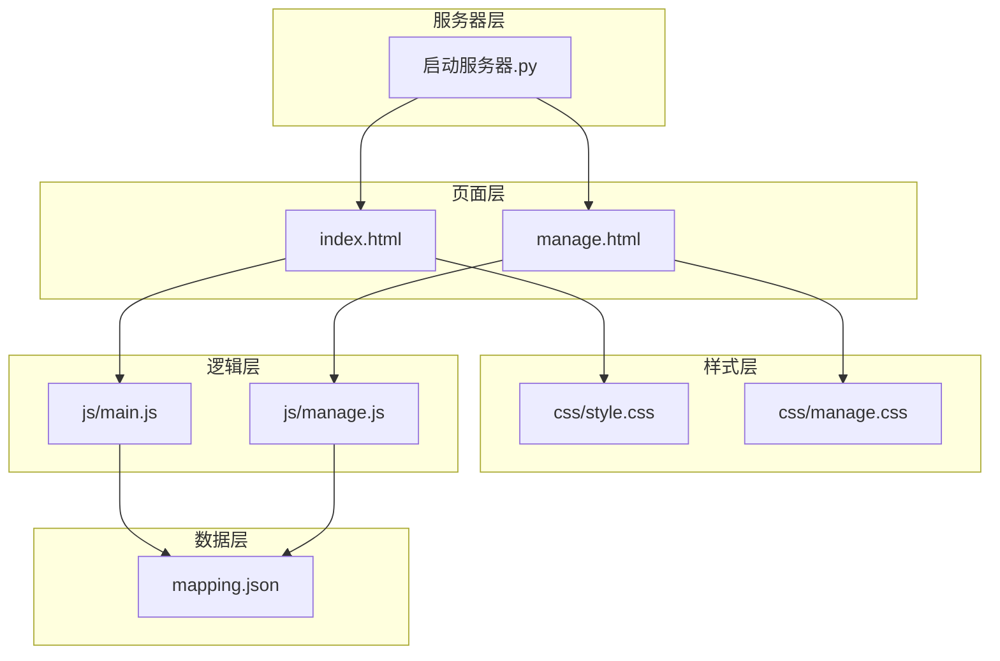
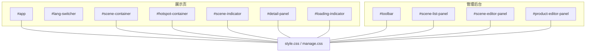
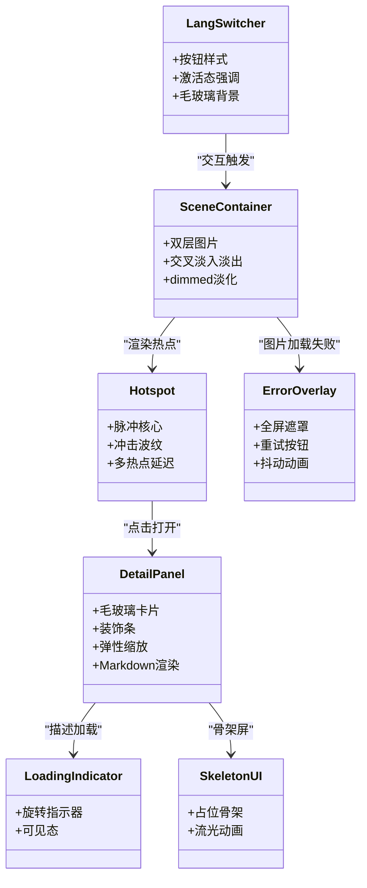
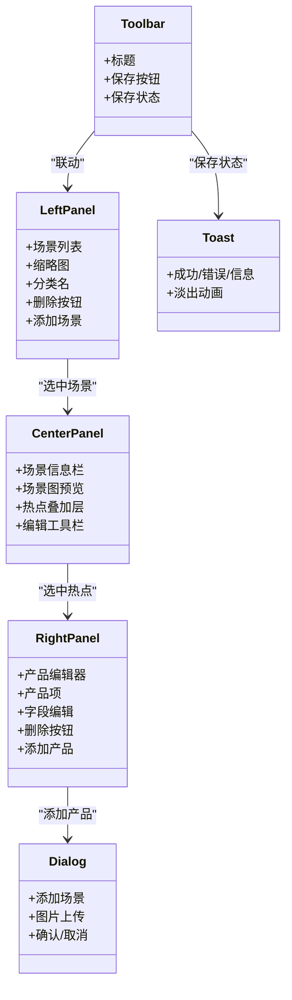
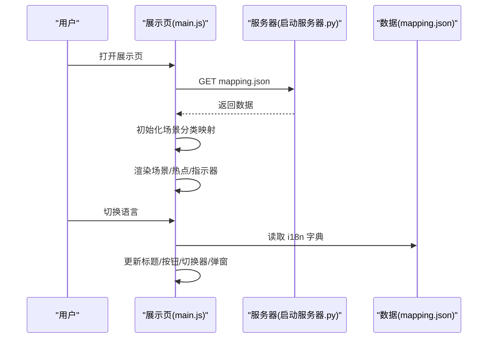
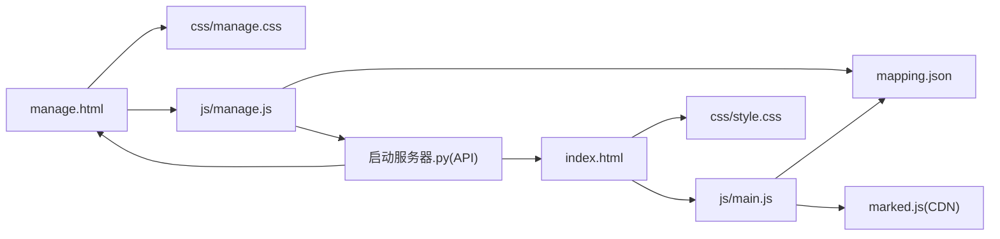

# 主题定制

<cite>
**本文引用的文件**
- [index.html](file://index.html)
- [css/style.css](file://css/style.css)
- [css/manage.css](file://css/manage.css)
- [js/main.js](file://js/main.js)
- [js/manage.js](file://js/manage.js)
- [project_architecture.md](file://project_architecture.md)
- [mapping.json](file://mapping.json)
- [启动服务器.py](file://启动服务器.py)
</cite>

## 目录
1. [简介](#简介)
2. [项目结构](#项目结构)
3. [核心组件](#核心组件)
4. [架构总览](#架构总览)
5. [详细组件分析](#详细组件分析)
6. [依赖关系分析](#依赖关系分析)
7. [性能考量](#性能考量)
8. [故障排查指南](#故障排查指南)
9. [结论](#结论)
10. [附录](#附录)

## 简介
本指南面向需要为数字标牌产品展示项目创建“自定义主题”的开发者，系统讲解如何在现有样式体系上进行主题化改造与扩展。项目采用纯原生 HTML/CSS/JavaScript 构建，具备完善的多语言与数据驱动能力，同时提供管理后台用于可视化编辑场景与产品配置。本指南将围绕以下目标展开：
- 主题系统架构设计：明确样式组织方式、主题切换机制与样式继承规则
- CSS 变量使用：如何通过变量集中管理颜色、字体与布局参数
- 主题定制步骤：从样式文件组织、变量定义到组件样式修改
- 多主题方案：如何创建多套主题以满足品牌定制与个性化需求
- 最佳实践：响应式设计、无障碍访问与跨浏览器兼容性
- 示例与模板：提供可直接参考的主题开发模板与示例

## 项目结构
项目采用“页面 + 样式 + 逻辑 + 数据 + 服务器”的清晰分层：
- 页面层：index.html（展示页）、manage.html（管理后台）
- 样式层：css/style.css（展示页样式）、css/manage.css（管理后台样式）
- 逻辑层：js/main.js（展示页交互）、js/manage.js（管理后台交互）
- 数据层：mapping.json（场景/产品/多语言配置）
- 服务器层：启动服务器.py（静态 + API）

图表来源
- [index.html](file://index.html)
- [css/style.css](file://css/style.css)
- [css/manage.css](file://css/manage.css)
- [js/main.js](file://js/main.js)
- [js/manage.js](file://js/manage.js)
- [mapping.json](file://mapping.json)
- [启动服务器.py](file://启动服务器.py)

章节来源
- [project_architecture.md](file://project_architecture.md)
- [index.html](file://index.html)
- [css/style.css](file://css/style.css)
- [css/manage.css](file://css/manage.css)
- [js/main.js](file://js/main.js)
- [js/manage.js](file://js/manage.js)
- [mapping.json](file://mapping.json)
- [启动服务器.py](file://启动服务器.py)

## 核心组件
- 展示页（index.html + style.css + main.js）
  - 场景图容器、语言切换器、导航按钮、指示器、热点容器、详情弹窗、加载指示器、骨架屏与错误状态
- 管理后台（manage.html + manage.css + manage.js）
  - 三栏布局（场景列表、场景编辑区、产品编辑器），支持可视化编辑场景、热点与产品
- 数据配置（mapping.json）
  - 场景、热点、产品、多语言字典统一管理
- 本地服务器（启动服务器.py）
  - 提供静态资源与 API 端点（保存配置、上传图片、列出文件）

章节来源
- [project_architecture.md](file://project_architecture.md)
- [index.html](file://index.html)
- [css/style.css](file://css/style.css)
- [js/main.js](file://js/main.js)
- [css/manage.css](file://css/manage.css)
- [js/manage.js](file://js/manage.js)
- [mapping.json](file://mapping.json)
- [启动服务器.py](file://启动服务器.py)

## 架构总览
展示页与管理后台共享“数据驱动 + 多语言 + 可视化编辑”的核心理念。样式层通过模块化组织与可复用的组件类名实现一致的视觉风格，同时为后续主题化改造预留空间。

图表来源
- [index.html](file://index.html)
- [css/style.css](file://css/style.css)
- [css/manage.css](file://css/manage.css)

章节来源
- [project_architecture.md](file://project_architecture.md)
- [index.html](file://index.html)
- [css/style.css](file://css/style.css)
- [css/manage.css](file://css/manage.css)

## 详细组件分析

### 展示页样式系统（style.css）
- 语言切换器：右上角固定位置，使用毛玻璃背景与渐变强调当前语言
- 场景图容器：双层图片实现交叉淡入淡出，支持“场景切换中”状态下的 UI 隐藏
- 热点系统：脉冲热点 + 冲击波纹 + 中心点脉动，多热点动画延迟与时间错开增强层次感
- 详情弹窗：毛玻璃卡片 + 装饰条 + 弹性缩放进入，支持 Markdown 渲染与骨架屏
- 加载与错误：加载指示器、骨架屏、全屏错误遮罩与重试按钮
- 工具类：隐藏类、场景切换中状态类

图表来源
- [css/style.css](file://css/style.css)

章节来源
- [css/style.css](file://css/style.css)
- [project_architecture.md](file://project_architecture.md)

### 管理后台样式系统（manage.css）
- 顶部工具栏：标题、保存按钮、保存状态提示
- 三栏布局：左栏场景列表、中栏场景编辑区、右栏产品编辑器
- 场景编辑：分类名输入、场景图预览、热点叠加层、拖拽态与选中态
- 产品编辑：名称（日/中）、图片选择、描述文件选择、删除按钮
- 对话框与 Toast：添加场景对话框、提示消息

图表来源
- [css/manage.css](file://css/manage.css)

章节来源
- [css/manage.css](file://css/manage.css)
- [project_architecture.md](file://project_architecture.md)

### 数据驱动与多语言（mapping.json + main.js）
- mapping.json：统一管理场景、热点、产品与多语言字典
- main.js：从 mapping.json 动态加载数据，构建场景分类映射，渲染 UI 并处理多语言切换
- 管理后台：通过 API 读写 mapping.json，支持可视化编辑

图表来源
- [js/main.js](file://js/main.js)
- [mapping.json](file://mapping.json)
- [启动服务器.py](file://启动服务器.py)

章节来源
- [js/main.js](file://js/main.js)
- [mapping.json](file://mapping.json)
- [启动服务器.py](file://启动服务器.py)
- [project_architecture.md](file://project_architecture.md)

## 依赖关系分析
- 展示页依赖：
  - index.html 结构依赖 css/style.css 样式与 js/main.js 逻辑
  - main.js 依赖 mapping.json 数据与 marked.js（CDN）
- 管理后台依赖：
  - manage.html 结构依赖 css/manage.css 样式与 js/manage.js 逻辑
  - manage.js 依赖 mapping.json 与本地服务器 API
- 服务器：
  - 启动服务器.py 提供静态文件服务与 API 端点，支持 CORS

图表来源
- [index.html](file://index.html)
- [css/style.css](file://css/style.css)
- [js/main.js](file://js/main.js)
- [css/manage.css](file://css/manage.css)
- [js/manage.js](file://js/manage.js)
- [mapping.json](file://mapping.json)
- [启动服务器.py](file://启动服务器.py)

章节来源
- [project_architecture.md](file://project_architecture.md)
- [index.html](file://index.html)
- [css/style.css](file://css/style.css)
- [js/main.js](file://js/main.js)
- [css/manage.css](file://css/manage.css)
- [js/manage.js](file://js/manage.js)
- [mapping.json](file://mapping.json)
- [启动服务器.py](file://启动服务器.py)

## 性能考量
- 图片预加载与缓存：通过预加载与缓存机制减少切换时的延迟
- 骨架屏与加载指示器：在网络延迟时提供良好体验
- 动画与过渡：合理使用 CSS 动画与过渡，避免过度消耗 CPU/GPU
- 事件监听与超时保护：图片加载与 Markdown 加载设置超时，防止长时间等待

章节来源
- [js/main.js](file://js/main.js)
- [css/style.css](file://css/style.css)

## 故障排查指南
- mapping.json 加载失败：展示页会显示全屏错误遮罩与重试按钮
- 图片加载失败：场景切换时若图片加载失败/超时，将不渲染热点
- Markdown 加载失败：显示可点击重试的提示，点击后重新加载
- 管理后台保存失败：保存状态提示错误，Toast 显示具体原因

章节来源
- [js/main.js](file://js/main.js)
- [css/style.css](file://css/style.css)
- [js/manage.js](file://js/manage.js)
- [css/manage.css](file://css/manage.css)

## 结论
本项目通过“数据驱动 + 多语言 + 可视化编辑 + 毛玻璃与动画”的组合，构建了易于维护与扩展的展示系统。主题定制的关键在于：
- 将颜色、字体、阴影、间距等视觉参数抽象为 CSS 变量
- 通过类名与模块化样式组织主题样式
- 在展示页与管理后台分别维护主题样式文件
- 通过数据层（mapping.json）与多语言系统实现品牌与语言的灵活切换

## 附录

### 主题系统架构设计
- 样式组织
  - 展示页主题：在 css/style.css 中按模块划分（语言切换器、场景图、热点、详情弹窗、加载与错误等），便于主题覆盖
  - 管理后台主题：在 css/manage.css 中按三栏布局划分，便于主题覆盖
- 主题切换机制
  - 通过为根元素或特定容器添加主题类名（如 data-theme="dark" 或 .theme-dark），在 CSS 中使用属性选择器或类选择器进行差异化覆盖
  - 语言切换与主题切换解耦，互不影响
- 样式继承规则
  - 基础样式（全局重置、基础字体、颜色）定义在顶层
  - 组件样式遵循“容器-子元素”层级，子元素继承父容器的字体与颜色
  - 动画与过渡在组件内部定义，避免跨组件污染

章节来源
- [css/style.css](file://css/style.css)
- [css/manage.css](file://css/manage.css)
- [project_architecture.md](file://project_architecture.md)

### 通过 CSS 变量实现主题定制
- 颜色方案
  - 主题蓝：用于按钮、强调、装饰条等
  - 背景黑：用于深色主题背景
  - 毛玻璃：用于控件背景与弹窗
  - 错误/成功：用于状态提示
- 字体设置
  - 展示页使用日文字体栈，管理后台使用系统字体栈，可通过变量统一替换
- 布局调整
  - 间距、圆角、阴影、动画时长与缓动函数可通过变量集中管理

建议的变量命名与作用域
- :root 或[data-theme="dark"] 中定义基础变量
- 组件内部使用变量进行覆盖，避免硬编码
- 为毛玻璃、阴影、动画等常用模式定义变量集合

章节来源
- [css/style.css](file://css/style.css)
- [css/manage.css](file://css/manage.css)
- [project_architecture.md](file://project_architecture.md)

### 创建多套主题方案
- 方案一：暗色主题
  - 背景：深色（如 #0a0a0a）
  - 文本：浅色（如 #ffffff）
  - 强调色：蓝色系（如 #3b82f6）
  - 毛玻璃：半透明黑色 + 模糊
- 方案二：浅色主题
  - 背景：浅色（如 #f5f7fa）
  - 文本：深色（如 #1a1a2e）
  - 强调色：蓝色系（如 #3b82f6）
  - 毛玻璃：半透明白色 + 模糊
- 方案三：品牌定制主题
  - 以企业品牌色为主色调，结合品牌字体与图标风格
  - 通过变量集中管理，保证一致性

章节来源
- [css/style.css](file://css/style.css)
- [css/manage.css](file://css/manage.css)
- [project_architecture.md](file://project_architecture.md)

### 主题开发步骤
- 步骤一：样式文件组织
  - 展示页：在 css/style.css 中按模块划分，为每个模块添加注释分节
  - 管理后台：在 css/manage.css 中按三栏划分，为每个区域添加注释分节
- 步骤二：变量定义
  - 在 :root 或[data-theme="dark"] 中定义颜色、字体、间距、圆角、阴影、动画参数
  - 在组件内部使用变量进行覆盖
- 步骤三：组件样式修改
  - 语言切换器：使用变量控制背景、边框、强调色
  - 场景图容器：使用变量控制模糊、透明度、阴影
  - 热点系统：使用变量控制脉冲核心、波纹、阴影
  - 详情弹窗：使用变量控制卡片背景、装饰条、阴影
  - 加载与错误：使用变量控制指示器、骨架屏、错误遮罩
- 步骤四：主题切换
  - 为根元素或容器添加 data-theme 属性或类名
  - 在 CSS 中使用属性选择器或类选择器进行差异化覆盖
- 步骤五：测试与优化
  - 在不同设备与浏览器上验证主题效果
  - 优化动画与过渡，确保流畅性

章节来源
- [css/style.css](file://css/style.css)
- [css/manage.css](file://css/manage.css)
- [project_architecture.md](file://project_architecture.md)

### 最佳实践
- 响应式设计
  - 使用媒体查询适配不同屏幕尺寸
  - 控制字体大小与行高，确保可读性
- 无障碍访问
  - 为按钮与链接提供合适的 aria-label
  - 确保键盘可访问性与焦点可见性
- 跨浏览器兼容性
  - 使用现代 CSS 特性时提供降级方案
  - 验证关键动画在不同浏览器上的表现

章节来源
- [index.html](file://index.html)
- [css/style.css](file://css/style.css)
- [css/manage.css](file://css/manage.css)
- [js/main.js](file://js/main.js)
- [js/manage.js](file://js/manage.js)

### 示例与模板
- 展示页主题模板
  - 在 :root 中定义基础变量（颜色、字体、间距、圆角、阴影、动画）
  - 在语言切换器、场景图容器、热点系统、详情弹窗、加载与错误等模块中使用变量
  - 通过 data-theme 属性切换主题
- 管理后台主题模板
  - 在 :root 中定义基础变量（颜色、字体、间距、圆角、阴影）
  - 在工具栏、三栏布局、场景编辑区、产品编辑器等模块中使用变量
  - 通过类名切换主题

章节来源
- [css/style.css](file://css/style.css)
- [css/manage.css](file://css/manage.css)
- [project_architecture.md](file://project_architecture.md)