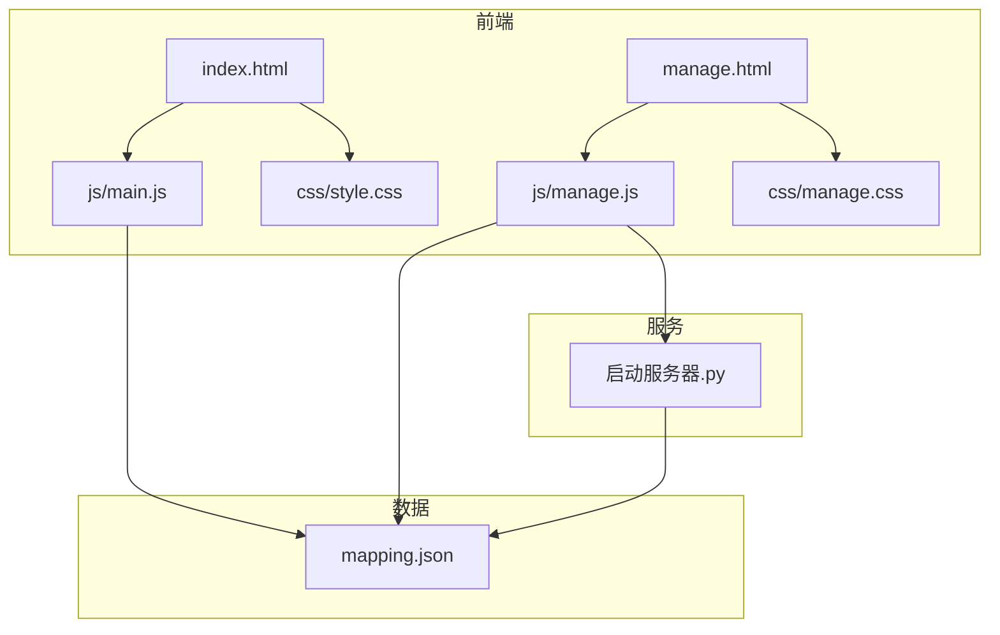
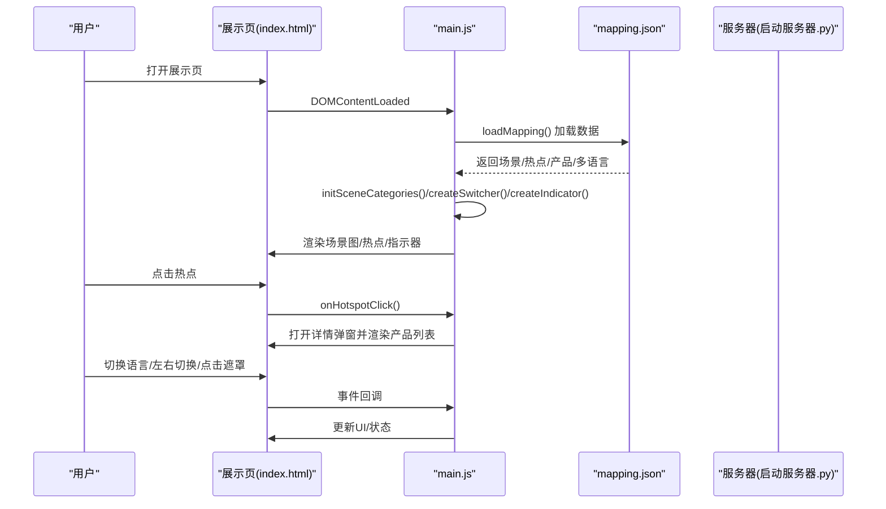
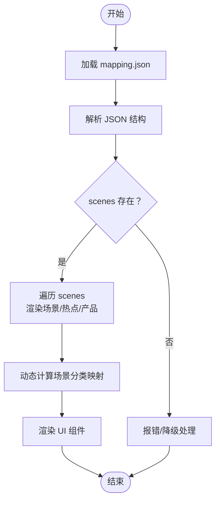
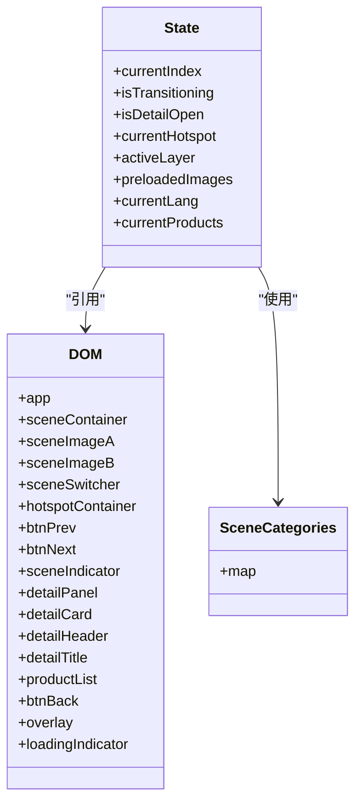
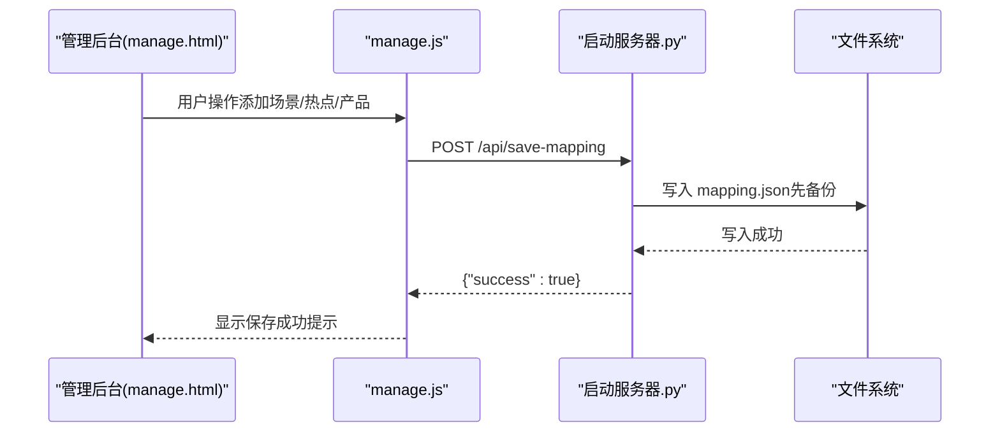
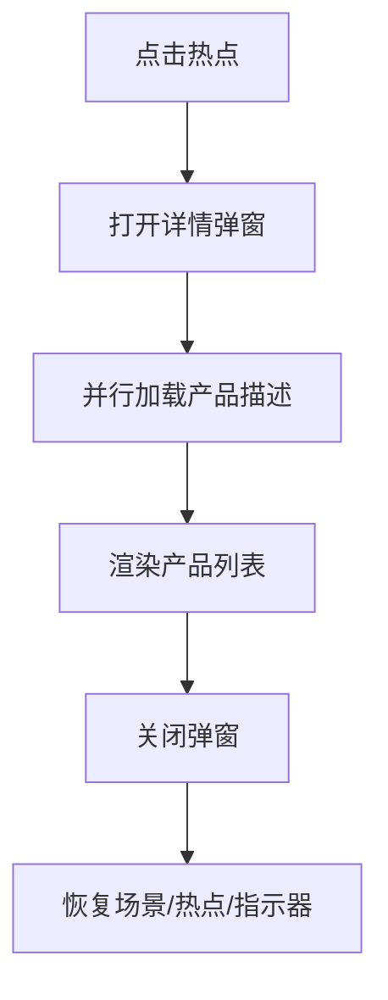
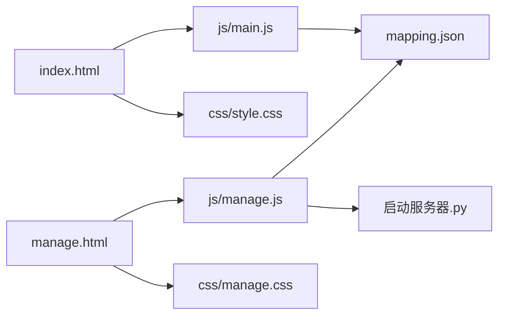

# 功能扩展

<cite>
**本文引用的文件**
- [index.html](file://index.html)
- [manage.html](file://manage.html)
- [mapping.json](file://mapping.json)
- [js/main.js](file://js/main.js)
- [js/manage.js](file://js/manage.js)
- [css/style.css](file://css/style.css)
- [css/manage.css](file://css/manage.css)
- [project_architecture.md](file://project_architecture.md)
- [启动服务器.py](file://启动服务器.py)
- [产品描述/自助点单机1.md](file://产品描述/自助点单机1.md)
- [产品描述/电子水牌.md](file://产品描述/电子水牌.md)
</cite>

## 目录
1. [简介](#简介)
2. [项目结构](#项目结构)
3. [核心组件](#核心组件)
4. [架构总览](#架构总览)
5. [详细组件分析](#详细组件分析)
6. [依赖关系分析](#依赖关系分析)
7. [性能考虑](#性能考虑)
8. [故障排查指南](#故障排查指南)
9. [结论](#结论)
10. [附录](#附录)

## 简介
本指南面向在现有数字标牌产品展示项目基础上进行功能扩展的开发者。项目采用“数据驱动 + 管理后台”的架构，核心数据集中于 mapping.json，前端通过 main.js 动态加载并渲染，管理后台 manage.js 提供可视化编辑能力。本文将系统讲解如何在不破坏现有功能的前提下，安全地添加新页面、新组件与新功能，并通过扩展 mapping.json 结构支持新的场景类型、产品类别与交互模式。

## 项目结构
项目采用“静态资源 + 数据 + 逻辑 + 管理后台”的清晰分层：
- 静态页面：index.html（展示页）、manage.html（管理后台）
- 数据配置：mapping.json（场景、热点、产品、多语言）
- 样式：css/style.css（展示页样式）、css/manage.css（管理后台样式）
- 逻辑：js/main.js（展示页逻辑）、js/manage.js（管理后台逻辑）
- 服务器：启动服务器.py（本地开发服务器 + API）

图表来源
- [index.html:1-83](file://index.html#L1-L83)
- [manage.html:1-113](file://manage.html#L1-L113)
- [mapping.json:1-232](file://mapping.json#L1-L232)
- [js/main.js:1197-1284](file://js/main.js#L1197-L1284)
- [js/manage.js:17-31](file://js/manage.js#L17-L31)
- [启动服务器.py:25-98](file://启动服务器.py#L25-L98)

章节来源
- [project_architecture.md:43-108](file://project_architecture.md#L43-L108)

## 核心组件
- 数据层（mapping.json）：集中存储场景、热点、产品与多语言配置，支持版本字段与国际化字典。
- 展示层（index.html + js/main.js + css/style.css）：负责场景渲染、热点交互、详情弹窗、语言切换与动画。
- 管理层（manage.html + js/manage.js + css/manage.css + 启动服务器.py）：提供可视化编辑、文件上传、配置保存与 API 服务。

章节来源
- [mapping.json:1-232](file://mapping.json#L1-L232)
- [js/main.js:1197-1284](file://js/main.js#L1197-L1284)
- [js/manage.js:17-31](file://js/manage.js#L17-L31)
- [启动服务器.py:76-98](file://启动服务器.py#L76-L98)

## 架构总览
整体采用“数据驱动 + 事件驱动”的模式：
- 数据驱动：前端通过 fetch 加载 mapping.json，动态构建 UI。
- 事件驱动：键盘、鼠标、窗口变化等事件触发状态更新与渲染。
- 管理后台：通过 API 与本地文件系统交互，实现配置持久化与资源管理。

图表来源
- [js/main.js:1197-1284](file://js/main.js#L1197-L1284)
- [js/main.js:856-870](file://js/main.js#L856-L870)
- [js/main.js:1104-1149](file://js/main.js#L1104-L1149)
- [mapping.json:1-232](file://mapping.json#L1-L232)

## 详细组件分析

### 数据层扩展（mapping.json）
- 新增场景类型：在 scenes 数组中添加新的场景对象，包含 id、category、image、hotspots。
- 新增产品类别：在 hotspots[].products 中添加新的产品对象，包含 name、image、descriptionFile。
- 新增交互模式：可在 mapping.json 中引入新的字段（例如交互类型、动画参数等），并在前端逻辑中读取与渲染。
- 多语言扩展：在 i18n 中新增键值对，前端通过 t() 与 getText() 获取对应语言文本。

图表来源
- [js/main.js:49-73](file://js/main.js#L49-L73)
- [js/main.js:217-229](file://js/main.js#L217-L229)
- [mapping.json:1-232](file://mapping.json#L1-L232)

章节来源
- [mapping.json:1-232](file://mapping.json#L1-L232)
- [js/main.js:49-73](file://js/main.js#L49-L73)
- [js/main.js:217-229](file://js/main.js#L217-L229)

### 展示页组件扩展（index.html + js/main.js + css/style.css）
- 新页面开发：在 index.html 中新增容器与交互元素，通过 js/main.js 的 DOM 引用与事件绑定接入逻辑。
- 新组件集成：在 css/style.css 中新增样式类，确保与现有动画与主题一致。
- 现有功能增强：在 main.js 中扩展渲染逻辑（如新增动画、交互行为），并通过状态管理与事件绑定保证一致性。

图表来源
- [js/main.js:195-204](file://js/main.js#L195-L204)
- [js/main.js:169-188](file://js/main.js#L169-L188)
- [js/main.js:211-229](file://js/main.js#L211-L229)

章节来源
- [index.html:1-83](file://index.html#L1-L83)
- [js/main.js:169-204](file://js/main.js#L169-L204)
- [css/style.css:1-997](file://css/style.css#L1-L997)

### 管理后台组件扩展（manage.html + js/manage.js + css/manage.css + 启动服务器.py）
- 新页面开发：在 manage.html 中新增面板与交互控件，通过 js/manage.js 的事件绑定与状态管理接入逻辑。
- 新组件集成：在 css/manage.css 中新增样式类，确保与现有布局与交互一致。
- API 扩展：在启动服务器.py 中新增 API 端点，满足新功能的数据持久化与资源管理需求。

图表来源
- [js/manage.js:82-108](file://js/manage.js#L82-L108)
- [启动服务器.py:101-127](file://启动服务器.py#L101-L127)

章节来源
- [manage.html:1-113](file://manage.html#L1-L113)
- [js/manage.js:17-31](file://js/manage.js#L17-L31)
- [启动服务器.py:76-98](file://启动服务器.py#L76-L98)

### 交互与动画扩展
- 热点交互：通过 renderHotspots() 与 onHotspotClick() 实现多热点渲染与详情弹窗。
- 场景切换：通过 renderScene() 实现交叉淡入淡出与指示器更新。
- 动画与主题：通过 CSS 动画与毛玻璃效果统一风格，确保扩展时保持一致性。

图表来源
- [js/main.js:856-870](file://js/main.js#L856-L870)
- [js/main.js:888-956](file://js/main.js#L888-L956)
- [js/main.js:992-1025](file://js/main.js#L992-L1025)

章节来源
- [js/main.js:856-1025](file://js/main.js#L856-L1025)

## 依赖关系分析
- 前端依赖：index.html 依赖 js/main.js 与 css/style.css；manage.html 依赖 js/manage.js 与 css/manage.css。
- 数据依赖：js/main.js 与 js/manage.js 依赖 mapping.json；管理后台还依赖启动服务器.py 提供的 API。
- 样式依赖：展示页与管理后台分别维护独立样式，扩展时需遵循各自主题规范。

图表来源
- [index.html:1-83](file://index.html#L1-L83)
- [manage.html:1-113](file://manage.html#L1-L113)
- [js/main.js:1197-1284](file://js/main.js#L1197-L1284)
- [js/manage.js:17-31](file://js/manage.js#L17-L31)
- [启动服务器.py:25-98](file://启动服务器.py#L25-L98)

章节来源
- [project_architecture.md:43-108](file://project_architecture.md#L43-L108)

## 性能考虑
- 图片加载与缓存：通过 preloadAllImages() 与 isImageCached() 优化首屏与后续切换体验，避免网络抖动导致的卡顿。
- Markdown 加载：采用并行加载与缓存策略，减少详情面板渲染等待时间。
- 动画与重绘：合理使用 CSS 动画与 transform，避免频繁触发布局与重绘。
- 事件防抖：窗口 resize 采用防抖策略，降低高频事件对性能的影响。

章节来源
- [js/main.js:257-327](file://js/main.js#L257-L327)
- [js/main.js:421-442](file://js/main.js#L421-L442)
- [js/main.js:1140-1148](file://js/main.js#L1140-L1148)

## 故障排查指南
- mapping.json 加载失败：前端会在初始化阶段进行重试，若仍失败则显示全屏错误提示。检查网络与路径，确认服务器已启动。
- 图片加载失败：详情面板会显示可点击重试的提示，点击后清除缓存并重新加载。
- 管理后台保存失败：检查 API 端点与权限，确认服务器已启动并返回成功响应。
- 热点定位异常：确认场景图已加载完成，未加载时热点计算会跳过，以屏幕中央作为临时位置。

章节来源
- [js/main.js:1197-1206](file://js/main.js#L1197-L1206)
- [js/main.js:421-442](file://js/main.js#L421-L442)
- [js/manage.js:82-108](file://js/manage.js#L82-L108)
- [js/main.js:774-817](file://js/main.js#L774-L817)

## 结论
通过“数据驱动 + 事件驱动 + 可视化管理”的架构，项目具备良好的扩展性与可维护性。扩展新功能时，建议遵循以下原则：
- 以 mapping.json 为中心，统一新增配置项与多语言键值。
- 在前端逻辑中通过状态管理与事件绑定实现功能增强，保持与现有交互一致。
- 在样式层面遵循现有主题与动画规范，确保视觉一致性。
- 在管理后台中通过 API 与文件系统交互，保障配置持久化与资源管理。

## 附录

### 扩展 mapping.json 的最佳实践
- 新增场景类型：在 scenes 数组中添加场景对象，确保 id 唯一，category 使用多语言对象，image 指向有效路径。
- 新增产品类别：在 hotspots[].products 中添加产品对象，name 使用多语言对象，image 与 descriptionFile 指向有效路径。
- 新增交互模式：在 mapping.json 中引入新字段（如交互类型、动画参数），并在前端逻辑中读取与渲染。
- 多语言扩展：在 i18n 中新增键值对，前端通过 t() 与 getText() 获取对应语言文本。

章节来源
- [mapping.json:1-232](file://mapping.json#L1-L232)
- [js/main.js:87-106](file://js/main.js#L87-L106)

### 新功能开发的具体实现步骤
- HTML 结构扩展：在 index.html 或 manage.html 中新增容器与交互元素，确保与现有结构一致。
- CSS 样式添加：在 css/style.css 或 css/manage.css 中新增样式类，遵循现有主题与动画规范。
- JavaScript 逻辑编写：在 js/main.js 或 js/manage.js 中扩展事件绑定与状态管理，确保与现有逻辑协同工作。
- API 接口扩展：在启动服务器.py 中新增 API 端点，满足新功能的数据持久化与资源管理需求。

章节来源
- [index.html:1-83](file://index.html#L1-L83)
- [manage.html:1-113](file://manage.html#L1-L113)
- [css/style.css:1-997](file://css/style.css#L1-L997)
- [css/manage.css:1-824](file://css/manage.css#L1-L824)
- [js/main.js:1104-1149](file://js/main.js#L1104-L1149)
- [js/manage.js:17-31](file://js/manage.js#L17-L31)
- [启动服务器.py:76-98](file://启动服务器.py#L76-L98)

### 保持向后兼容性的策略
- 数据版本控制：在 mapping.json 中维护 version 字段，新增字段时提供默认值或回退逻辑。
- 多语言回退：在 getText() 中实现多语言回退策略，确保缺失键值时仍能正常显示。
- 事件与状态：在扩展逻辑中避免破坏现有状态与事件绑定，确保切换语言、场景切换等核心流程不受影响。

章节来源
- [mapping.json:2-3](file://mapping.json#L2-L3)
- [js/main.js:102-106](file://js/main.js#L102-L106)
- [js/main.js:1104-1149](file://js/main.js#L1104-L1149)

### 具体扩展示例
- 添加新的场景分类：在 mapping.json 的 scenes 中新增场景对象，确保 category 使用多语言对象，前端会自动计算分类映射并渲染分类切换器。
- 实现新的热点交互效果：在 js/main.js 中扩展 renderHotspots() 与 onHotspotClick()，新增动画或交互行为，确保与现有弹窗与指示器协同工作。
- 增加新的产品展示模式：在 mapping.json 的 hotspots[].products 中新增产品对象，前端会自动渲染产品列表与描述，支持 Markdown 渲染与重试机制。

章节来源
- [mapping.json:1-232](file://mapping.json#L1-L232)
- [js/main.js:716-759](file://js/main.js#L716-L759)
- [js/main.js:856-870](file://js/main.js#L856-L870)
- [产品描述/自助点单机1.md:1-11](file://产品描述/自助点单机1.md#L1-L11)
- [产品描述/电子水牌.md:1-10](file://产品描述/电子水牌.md#L1-L10)