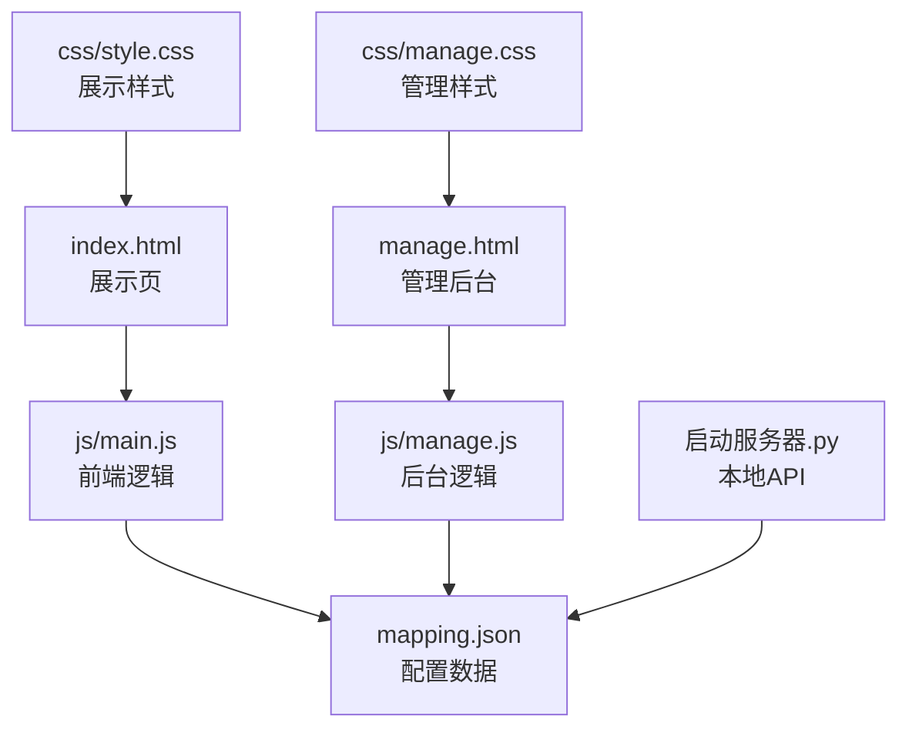
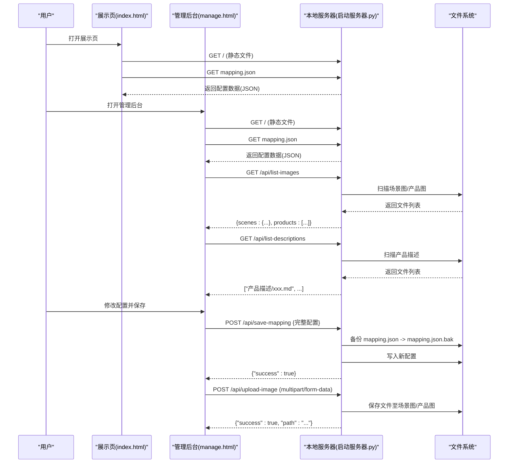
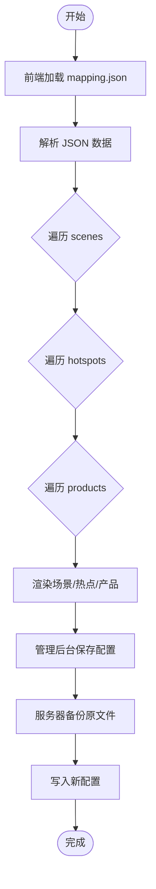
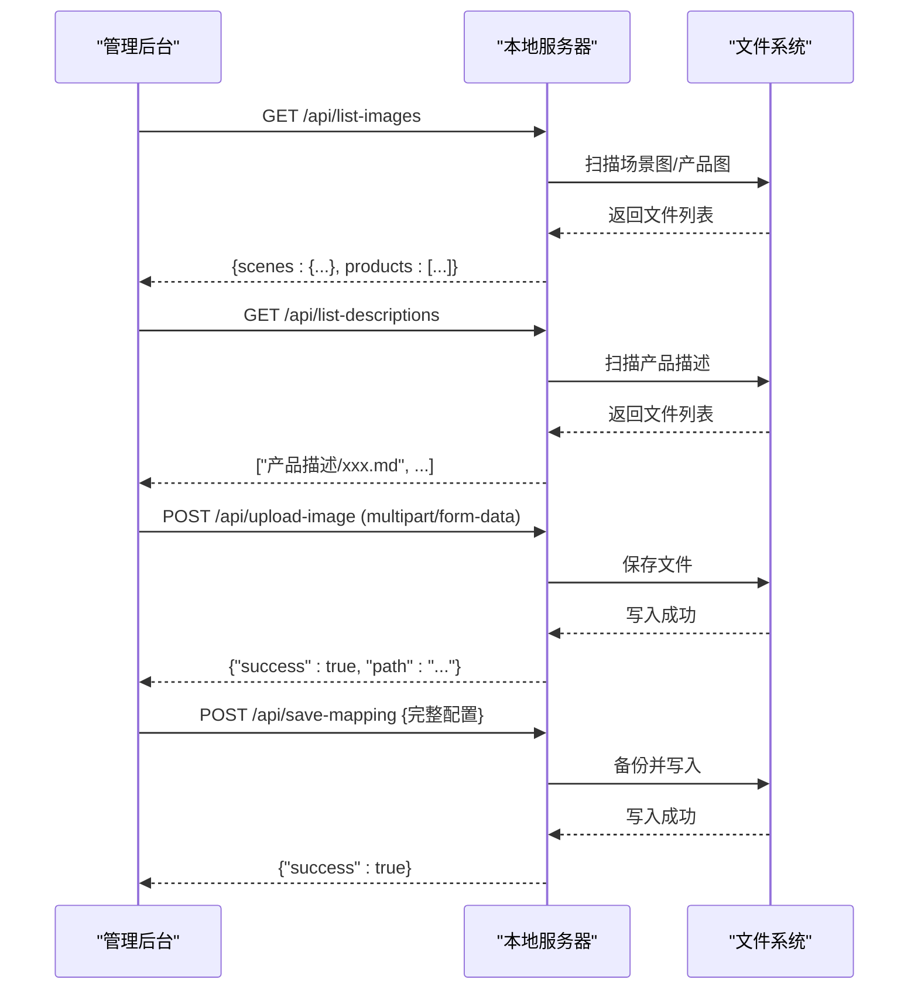
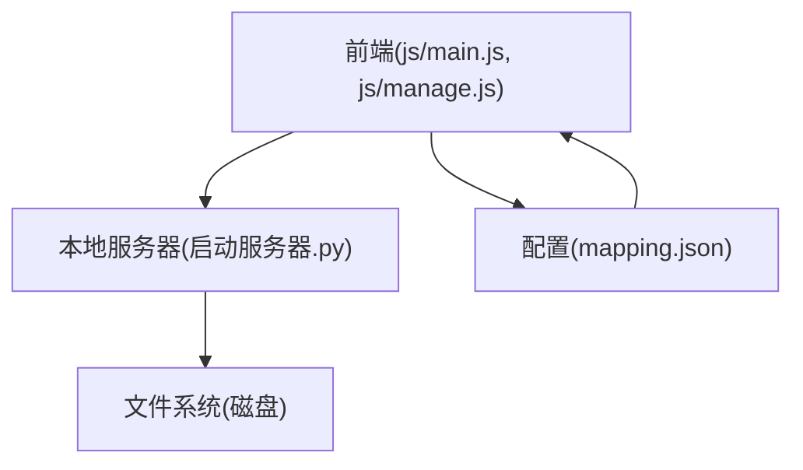

# 扩展开发

<cite>
**本文引用的文件**
- [index.html](file://index.html)
- [manage.html](file://manage.html)
- [mapping.json](file://mapping.json)
- [project_architecture.md](file://project_architecture.md)
- [启动服务器.py](file://启动服务器.py)
- [js/main.js](file://js/main.js)
- [js/manage.js](file://js/manage.js)
- [css/style.css](file://css/style.css)
- [css/manage.css](file://css/manage.css)
- [产品描述/室内双面吊装标牌.md](file://产品描述/室内双面吊装标牌.md)
- [产品描述/电子水牌.md](file://产品描述/电子水牌.md)
</cite>

## 目录
1. [简介](#简介)
2. [项目结构](#项目结构)
3. [核心组件](#核心组件)
4. [架构总览](#架构总览)
5. [详细组件分析](#详细组件分析)
6. [依赖分析](#依赖分析)
7. [性能考量](#性能考量)
8. [故障排查指南](#故障排查指南)
9. [结论](#结论)
10. [附录](#附录)

## 简介
本指南面向希望在现有数字标牌产品展示项目基础上进行扩展与二次开发的工程师与产品人员。项目采用“数据与逻辑分离”的架构，通过 mapping.json 配置驱动前端展示与管理后台编辑，结合轻量级 Python 服务器提供 API 能力，支持新增页面、组件、API 端点、主题样式、数据模型与第三方集成。本文将系统讲解扩展机制、插件化思路、最佳实践与常见问题处理方法。

## 项目结构
项目采用“静态资源 + 配置驱动 + 本地服务器”的组织方式：
- 前端页面：index.html（展示页）、manage.html（管理后台）
- 配置中心：mapping.json（场景、热点、产品、多语言）
- 样式体系：css/style.css（展示页）、css/manage.css（管理后台）
- 逻辑模块：js/main.js（展示页逻辑）、js/manage.js（管理后台逻辑）
- 本地服务器：启动服务器.py（提供静态文件与4个API端点）

图表来源
- [index.html](file://index.html)
- [manage.html](file://manage.html)
- [mapping.json](file://mapping.json)
- [js/main.js](file://js/main.js)
- [js/manage.js](file://js/manage.js)
- [启动服务器.py](file://启动服务器.py)
- [css/style.css](file://css/style.css)
- [css/manage.css](file://css/manage.css)

章节来源
- [project_architecture.md](file://project_architecture.md)

## 核心组件
- 配置驱动层：mapping.json 提供场景、热点、产品与多语言配置，前端通过 fetch 动态加载，管理后台通过 API 读写。
- 前端展示层：index.html + js/main.js 实现场景轮播、多热点渲染、产品详情弹窗、多语言切换与骨架屏/错误提示。
- 管理后台层：manage.html + js/manage.js 提供可视化编辑、图片上传、文件列表、保存配置能力。
- 本地服务器层：启动服务器.py 提供静态文件服务与4个API端点，支持CORS与自动端口探测。

章节来源
- [project_architecture.md](file://project_architecture.md)
- [mapping.json](file://mapping.json)
- [js/main.js](file://js/main.js)
- [js/manage.js](file://js/manage.js)
- [启动服务器.py](file://启动服务器.py)

## 架构总览
整体采用“配置驱动 + 本地API + 前后端解耦”的轻量架构。前端通过 fetch 与本地服务器通信，实现配置的读取、保存与媒体资源的上传与列举。

图表来源
- [启动服务器.py](file://启动服务器.py)
- [js/main.js](file://js/main.js)
- [js/manage.js](file://js/manage.js)

章节来源
- [project_architecture.md](file://project_architecture.md)

## 详细组件分析

### 配置驱动与 mapping.json 扩展
- 数据结构：顶层包含 version、scenes（场景数组）、i18n（多语言字典）。每个场景包含 id、category、image、hotspots；每个热点包含 id、x、y、products；每个产品包含 name、image、descriptionFile。
- 扩展点：
  - 新增场景：在 scenes 数组中添加新场景对象，包含 category、image、hotspots。
  - 新增热点：在任一场景的 hotspots 数组中添加热点对象，设置 id、x、y 百分比坐标、products。
  - 新增产品：在热点的 products 数组中添加产品对象，设置 name、image、descriptionFile。
  - 多语言扩展：在 i18n 中新增语言键值，同时在 category 与产品 name 中补充对应语言值。
- 读取与回写：前端通过 loadMapping() 获取 mapping.json；管理后台通过 /api/save-mapping 写回，服务器自动备份并写入新文件。

图表来源
- [js/main.js](file://js/main.js)
- [js/manage.js](file://js/manage.js)
- [启动服务器.py](file://启动服务器.py)

章节来源
- [mapping.json](file://mapping.json)
- [project_architecture.md](file://project_architecture.md)

### 展示页前端扩展（页面/组件/API）
- 新页面开发：在项目根目录新增 HTML 文件，引入所需 CSS/JS，遵循现有 DOM 结构与命名规范，确保与现有样式/动画兼容。
- 新组件集成：在现有 DOM 结构中预留占位容器（如 #scene-switcher、#hotspot-container），通过 JS 动态创建并插入，保持与现有动画与事件体系一致。
- 新 API 端点：在本地服务器中新增路由与处理函数，返回 JSON；前端通过 fetch 调用，注意 CORS 头设置与错误处理。

章节来源
- [index.html](file://index.html)
- [css/style.css](file://css/style.css)
- [js/main.js](file://js/main.js)
- [启动服务器.py](file://启动服务器.py)

### 管理后台扩展（可视化编辑与API）
- 场景/热点/产品编辑：通过 manage.js 的渲染与事件绑定，实现新增、删除、拖拽、字段编辑等功能。
- 文件上传与列举：利用 /api/list-images 与 /api/list-descriptions 获取可用资源，使用 /api/upload-image 上传媒体资源。
- 保存配置：通过 /api/save-mapping 将完整配置写回，服务器自动备份旧文件。

图表来源
- [js/manage.js](file://js/manage.js)
- [启动服务器.py](file://启动服务器.py)

章节来源
- [manage.html](file://manage.html)
- [js/manage.js](file://js/manage.js)
- [启动服务器.py](file://启动服务器.py)

### 主题与样式扩展
- 展示页主题：通过 css/style.css 的变量与颜色值（如主题蓝 #3b82f6、深蓝 #2563eb）统一修改主题色；通过动画参数（如核心脉冲、波纹扩散、加载旋转）调整视觉节奏。
- 管理后台主题：通过 css/manage.css 的三栏布局与控件样式，统一风格与交互体验。
- 扩展建议：新增主题时，优先通过变量与类名复用现有动画与布局，减少破坏性改动。

章节来源
- [css/style.css](file://css/style.css)
- [css/manage.css](file://css/manage.css)

### 数据模型扩展
- 字段新增：在 mapping.json 的场景、热点、产品对象中添加新字段，前端通过 getText()/t() 读取，管理后台通过表单/下拉框编辑。
- 结构变更：若需改变现有结构（如将 products 从数组改为对象），需同步修改前端渲染逻辑与管理后台编辑器，确保向后兼容与迁移策略。

章节来源
- [mapping.json](file://mapping.json)
- [js/main.js](file://js/main.js)
- [js/manage.js](file://js/manage.js)

### API 扩展开发
- 新增端点：在启动服务器.py 中新增路由与处理函数，设置 CORS 头，返回 JSON；在前端通过 fetch 调用。
- 错误处理：对空请求体、JSON 解析失败、服务器异常等情况返回统一错误格式，前端进行友好提示。
- 安全与性能：限制请求体大小、校验文件类型与大小、启用自动端口探测，避免端口冲突。

章节来源
- [启动服务器.py](file://启动服务器.py)
- [js/main.js](file://js/main.js)
- [js/manage.js](file://js/manage.js)

## 依赖分析
- 前端依赖：marked.js（Markdown 解析）、本地静态资源与本地服务器 API。
- 后端依赖：Python 标准库（http.server、socketserver、json、shutil、cgi、urllib.parse）。
- 耦合关系：前端通过 fetch 与本地服务器通信，管理后台与展示页共享同一套配置数据与 API。

图表来源
- [js/main.js](file://js/main.js)
- [js/manage.js](file://js/manage.js)
- [启动服务器.py](file://启动服务器.py)
- [mapping.json](file://mapping.json)

章节来源
- [project_architecture.md](file://project_architecture.md)

## 性能考量
- 图片加载与预加载：展示页采用双层交叉淡入淡出与首屏独占带宽策略，提升首屏体验；管理后台懒加载缩略图，减少初始渲染压力。
- Markdown 加载：采用缓存与骨架屏，失败时提供可点击重试，避免阻塞主线程。
- 动画与过渡：合理设置动画时长与缓动函数，避免过多重排重绘；热点脉冲与波纹动画采用 nth-child 分散，降低视觉拥挤感。
- 服务器性能：本地服务器默认端口 8082，若被占用自动递增寻找可用端口，避免启动失败。

章节来源
- [project_architecture.md](file://project_architecture.md)
- [css/style.css](file://css/style.css)

## 故障排查指南
- mapping.json 加载失败：前端会在多次重试后显示全屏错误提示；检查文件路径、格式与服务器权限。
- API 调用失败：确认 CORS 头设置、请求体格式与服务器端口；查看浏览器网络面板与控制台错误。
- 图片上传失败：检查 multipart/form-data 格式、type 与 category 参数、保存目录权限。
- 管理后台无法保存：确认 /api/save-mapping 请求体为完整 JSON，服务器具备写权限；查看备份与写入日志。

章节来源
- [js/main.js](file://js/main.js)
- [js/manage.js](file://js/manage.js)
- [启动服务器.py](file://启动服务器.py)

## 结论
本项目通过“配置驱动 + 本地API + 前后端解耦”的架构，提供了清晰的扩展路径。开发者可在不破坏现有结构的前提下，通过扩展 mapping.json、新增页面与组件、完善 API 与样式主题，实现功能增强与定制化需求。建议在扩展过程中遵循向后兼容、性能优化与安全性保障的原则，确保系统稳定与可维护性。

## 附录
- 示例与模板
  - 新增场景模板：在 mapping.json 的 scenes 数组中添加对象，包含 id、category、image、hotspots。
  - 新增热点模板：在场景的 hotspots 数组中添加对象，包含 id、x、y、products。
  - 新增产品模板：在热点的 products 数组中添加对象，包含 name、image、descriptionFile。
  - 新增语言模板：在 mapping.json 的 i18n 中添加语言字典，并在 category 与 name 中补充对应语言值。
  - 新增 API 模板：在启动服务器.py 中新增路由与处理函数，设置 CORS 头，返回 JSON；在前端通过 fetch 调用。
- 最佳实践清单
  - 向后兼容：新增字段时保留旧字段，前端通过 getText()/t() 回退。
  - 性能优化：合理使用骨架屏与缓存，避免一次性加载大量资源。
  - 安全保障：校验请求体格式与文件类型，限制请求大小，启用自动端口探测。
  - 可维护性：统一命名规范与类名，复用现有动画与布局，减少破坏性改动。

章节来源
- [project_architecture.md](file://project_architecture.md)
- [mapping.json](file://mapping.json)
- [启动服务器.py](file://启动服务器.py)
- [css/style.css](file://css/style.css)
- [css/manage.css](file://css/manage.css)
- [产品描述/室内双面吊装标牌.md](file://产品描述/室内双面吊装标牌.md)
- [产品描述/电子水牌.md](file://产品描述/电子水牌.md)