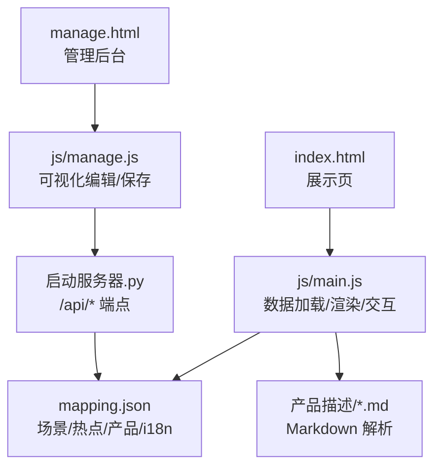
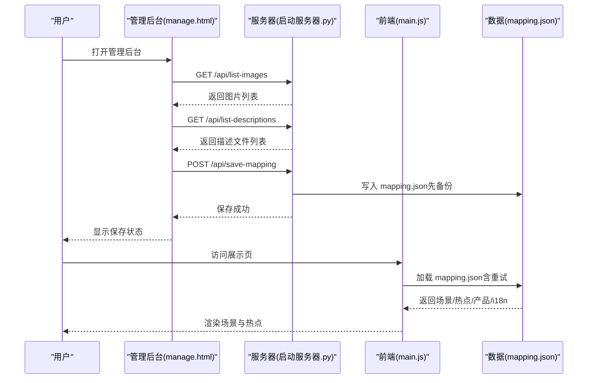
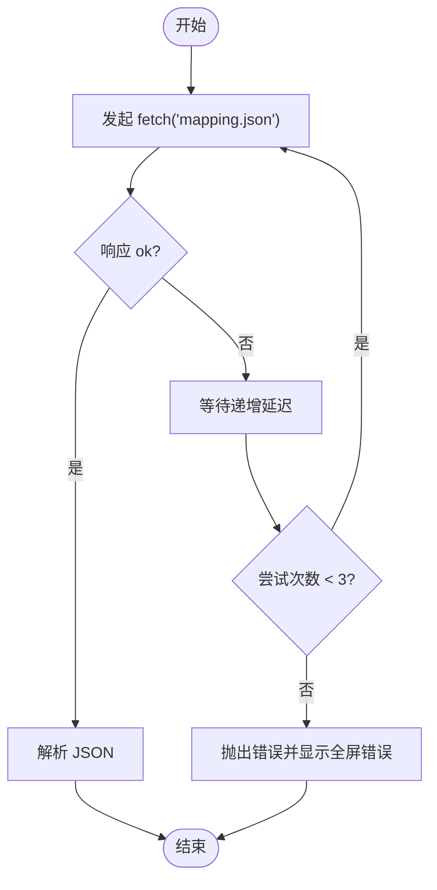
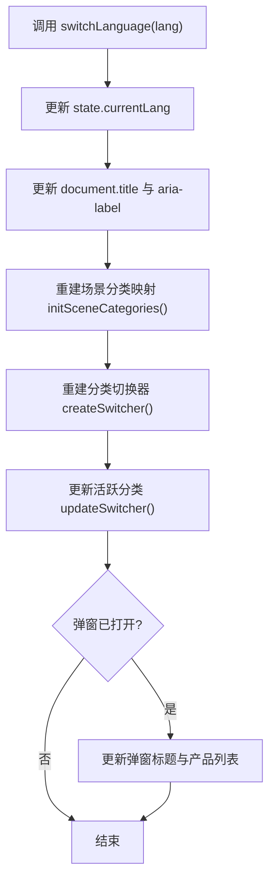
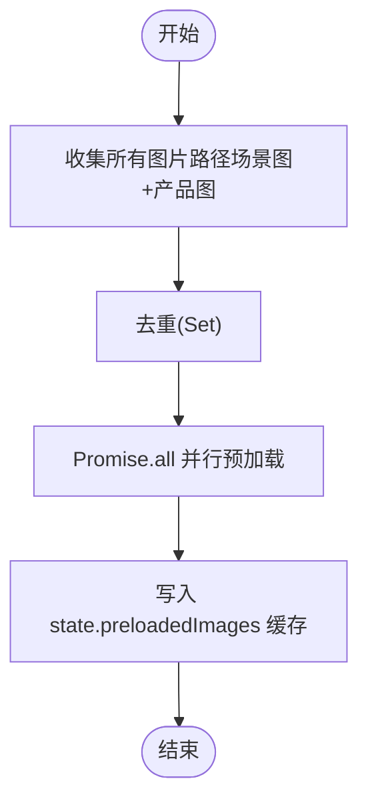
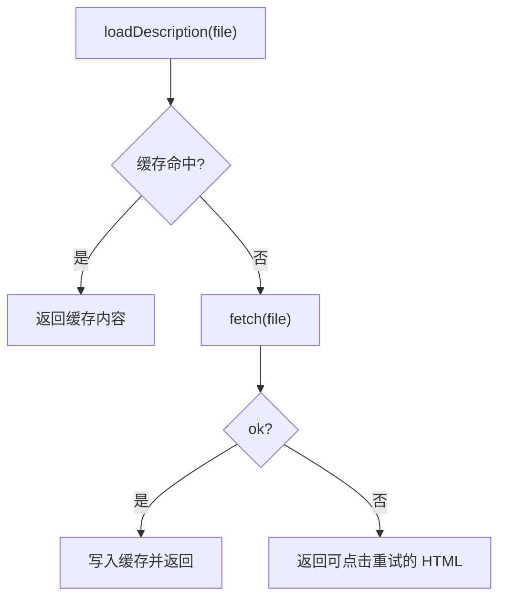
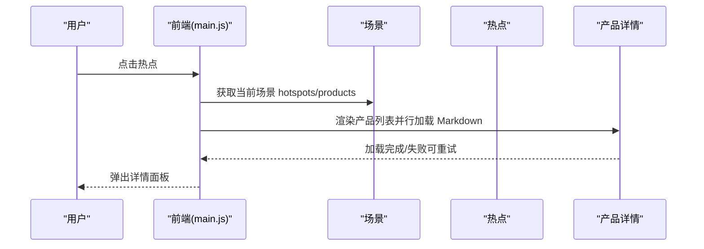
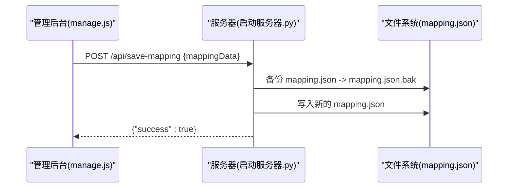
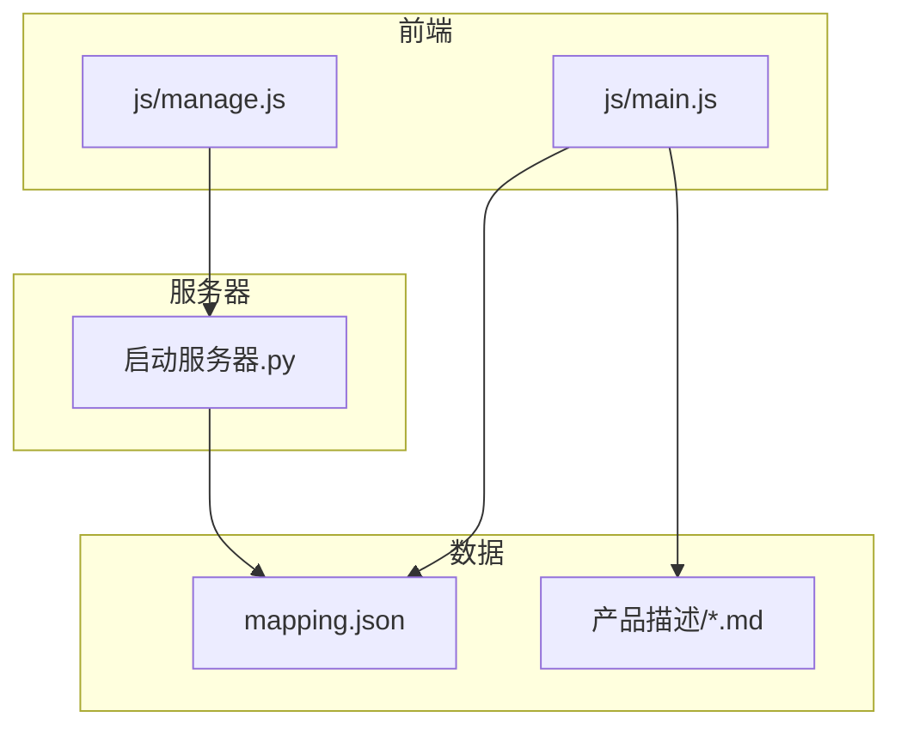

# 插件开发

<cite>
**本文引用的文件**
- [mapping.json](file://mapping.json)
- [index.html](file://index.html)
- [manage.html](file://manage.html)
- [js/main.js](file://js/main.js)
- [js/manage.js](file://js/manage.js)
- [启动服务器.py](file://启动服务器.py)
- [project_architecture.md](file://project_architecture.md)
- [产品描述/电子水牌.md](file://产品描述/电子水牌.md)
- [产品描述/自助点单机1.md](file://产品描述/自助点单机1.md)
</cite>

## 目录
1. [简介](#简介)
2. [项目结构](#项目结构)
3. [核心组件](#核心组件)
4. [架构总览](#架构总览)
5. [详细组件分析](#详细组件分析)
6. [依赖分析](#依赖分析)
7. [性能考量](#性能考量)
8. [故障排查指南](#故障排查指南)
9. [结论](#结论)
10. [附录](#附录)

## 简介
本指南面向希望为“数字标牌产品展示”项目开发插件的开发者。项目采用“数据驱动 + 管理后台”的架构：数据集中在 mapping.json，前端通过 js/main.js 动态加载并渲染；管理后台通过 js/manage.js 与 /api/* 端点交互，实现可视化编辑与持久化。插件开发的核心在于“扩展 mapping.json 的结构”，从而在不改动核心逻辑的前提下，灵活地注入新的场景、热点、产品与国际化文案。

## 项目结构
- 前端页面
  - 展示页：index.html + js/main.js
  - 管理后台：manage.html + js/manage.js
- 数据配置：mapping.json
- 本地开发服务器：启动服务器.py（提供 /api/* 端点）
- 资源目录：场景图、产品图、产品描述（Markdown）

图表来源
- [index.html:1-83](file://index.html#L1-L83)
- [js/main.js:1197-1281](file://js/main.js#L1197-L1281)
- [manage.html:1-113](file://manage.html#L1-L113)
- [js/manage.js:18-31](file://js/manage.js#L18-L31)
- [启动服务器.py:54-98](file://启动服务器.py#L54-L98)
- [mapping.json:1-232](file://mapping.json#L1-L232)

章节来源
- [project_architecture.md:43-108](file://project_architecture.md#L43-L108)

## 核心组件
- 数据加载与重试：前端通过 fetch 加载 mapping.json，内置最多 3 次重试，递增延迟，失败时显示全屏错误提示。
- 多语言引擎：统一的 t() 与 getText() 机制，支持 ja/zh 双语切换与 UI 文本回退。
- 图片预加载与缓存：全量图片预加载，缓存已加载资源，提升切换与首次加载体验。
- Markdown 描述加载：描述文件缓存、失败降级与可点击重试。
- 场景渲染与热点交互：交叉淡入淡出、热点定位、弹窗详情。
- 管理后台 API：保存配置、上传图片、列举资源、可视化编辑。

章节来源
- [js/main.js:49-73](file://js/main.js#L49-L73)
- [js/main.js:87-162](file://js/main.js#L87-L162)
- [js/main.js:257-327](file://js/main.js#L257-L327)
- [js/main.js:421-442](file://js/main.js#L421-L442)
- [js/main.js:480-595](file://js/main.js#L480-L595)
- [js/main.js:716-759](file://js/main.js#L716-L759)
- [js/main.js:888-956](file://js/main.js#L888-L956)
- [js/main.js:1197-1281](file://js/main.js#L1197-L1281)
- [js/manage.js:35-46](file://js/manage.js#L35-L46)
- [js/manage.js:81-108](file://js/manage.js#L81-L108)
- [启动服务器.py:75-98](file://启动服务器.py#L75-L98)

## 架构总览
插件系统本质是“数据插件”。通过扩展 mapping.json 的结构，即可在不修改核心逻辑的情况下，注入新的场景、热点、产品与国际化文案。管理后台通过 /api/* 端点与服务器交互，实现可视化编辑与持久化。

图表来源
- [js/manage.js:35-46](file://js/manage.js#L35-L46)
- [js/manage.js:81-108](file://js/manage.js#L81-L108)
- [启动服务器.py:75-98](file://启动服务器.py#L75-L98)
- [js/main.js:1197-1281](file://js/main.js#L1197-L1281)
- [mapping.json:1-232](file://mapping.json#L1-L232)

## 详细组件分析

### 组件A：数据加载与重试（mapping.json）
- 目标：从 mapping.json 动态加载数据，失败时重试 3 次，最终失败显示全屏错误。
- 关键点：
  - 重试策略：递增延迟 500ms/1000ms/2000ms。
  - 失败降级：初始化失败时显示全屏错误提示，阻止后续渲染。
  - 与管理后台协同：管理后台通过 /api/save-mapping 写入 mapping.json，前端下次初始化时读取最新数据。

图表来源
- [js/main.js:49-73](file://js/main.js#L49-L73)
- [js/main.js:1197-1206](file://js/main.js#L1197-L1206)

章节来源
- [js/main.js:49-73](file://js/main.js#L49-L73)
- [js/main.js:1197-1206](file://js/main.js#L1197-L1206)

### 组件B：多语言引擎（i18n）
- 目标：统一 UI 文本与多语言回退逻辑，支持 ja/zh 切换。
- 关键点：
  - t(key)：从 mappingData.i18n[currentLang] 获取翻译。
  - getText(obj)：从多语言对象 { ja, zh } 获取当前语言值，支持普通字符串直接返回。
  - switchLanguage(lang)：更新页面标题、按钮、切换器、弹窗标题与语言切换器状态。

图表来源
- [js/main.js:119-162](file://js/main.js#L119-L162)
- [js/main.js:217-229](file://js/main.js#L217-L229)

章节来源
- [js/main.js:87-162](file://js/main.js#L87-L162)
- [js/main.js:217-229](file://js/main.js#L217-L229)

### 组件C：图片预加载与缓存
- 目标：提升场景切换与首屏加载体验，避免黑屏与卡顿。
- 关键点：
  - 预加载策略：遍历 mappingData.scenes + hotspots + products 收集去重路径，批量预加载。
  - 缓存策略：state.preloadedImages[src] 记录已缓存图片，isImageCached/src 配合使用。
  - 超时保护：waitForImageLoad(imgEl, timeoutMs) 防止长时间等待。

图表来源
- [js/main.js:257-327](file://js/main.js#L257-L327)
- [js/main.js:354-395](file://js/main.js#L354-L395)

章节来源
- [js/main.js:257-327](file://js/main.js#L257-L327)
- [js/main.js:354-395](file://js/main.js#L354-L395)

### 组件D：Markdown 描述加载与重试
- 目标：异步加载产品描述 Markdown，支持缓存、失败降级与可点击重试。
- 关键点：
  - 缓存：descriptionCache[file] 避免重复请求。
  - 降级：加载失败返回带可点击重试的 HTML。
  - 重试：点击失败提示后清除缓存并重新加载。

图表来源
- [js/main.js:421-442](file://js/main.js#L421-L442)

章节来源
- [js/main.js:421-442](file://js/main.js#L421-L442)

### 组件E：场景渲染与热点交互
- 目标：交叉淡入淡出切换场景，热点定位与点击弹窗详情。
- 关键点：
  - 交叉淡入淡出：双图层切换，先切换 activeLayer 再切换 CSS 类，保证无黑屏。
  - 热点定位：calcHotspotPixelPosition 基于 object-fit: cover 计算裁剪偏移，确保热点与图片位置一致。
  - 弹窗详情：renderProductList 并行加载 Markdown，失败时显示可点击重试。

图表来源
- [js/main.js:716-759](file://js/main.js#L716-L759)
- [js/main.js:856-870](file://js/main.js#L856-L870)
- [js/main.js:888-956](file://js/main.js#L888-L956)

章节来源
- [js/main.js:480-595](file://js/main.js#L480-L595)
- [js/main.js:716-759](file://js/main.js#L716-L759)
- [js/main.js:856-870](file://js/main.js#L856-L870)
- [js/main.js:888-956](file://js/main.js#L888-L956)

### 组件F：管理后台 API 与持久化
- 目标：提供可视化编辑能力，保存 mapping.json 并备份。
- 关键点：
  - /api/save-mapping：接收完整 mapping.json，先备份再写入。
  - /api/upload-image：上传图片到场景图/产品图目录，返回相对路径。
  - /api/list-images：扫描场景图与产品图目录，返回可用图片列表。
  - /api/list-descriptions：返回产品描述文件列表。

图表来源
- [js/manage.js:81-108](file://js/manage.js#L81-L108)
- [启动服务器.py:101-127](file://启动服务器.py#L101-L127)

章节来源
- [js/manage.js:35-46](file://js/manage.js#L35-L46)
- [js/manage.js:81-108](file://js/manage.js#L81-L108)
- [启动服务器.py:75-98](file://启动服务器.py#L75-L98)
- [启动服务器.py:101-127](file://启动服务器.py#L101-L127)
- [启动服务器.py:204-251](file://启动服务器.py#L204-L251)

## 依赖分析
- 前端依赖
  - marked.js：用于 Markdown 解析（CDN 引入）。
  - 本地开发服务器：Python 内置 HTTPServer，扩展 /api/* 端点。
- 数据依赖
  - mapping.json：集中存储场景、热点、产品与国际化文案。
  - 产品描述：Markdown 文件，路径来自 mapping.json 的 descriptionFile 字段。
- 耦合与内聚
  - 前端通过 fetch 与服务器解耦，管理后台与服务器通过 API 解耦。
  - mapping.json 作为单一事实来源，降低核心逻辑与数据的耦合。

图表来源
- [js/main.js:1-20](file://js/main.js#L1-L20)
- [js/manage.js:1-10](file://js/manage.js#L1-L10)
- [启动服务器.py:1-20](file://启动服务器.py#L1-L20)
- [mapping.json:1-232](file://mapping.json#L1-L232)
- [产品描述/电子水牌.md:1-10](file://产品描述/电子水牌.md#L1-L10)

章节来源
- [project_architecture.md:29-40](file://project_architecture.md#L29-L40)
- [启动服务器.py:25-53](file://启动服务器.py#L25-L53)

## 性能考量
- 图片加载
  - 首屏独占带宽策略：首图加载完成后启动后台预加载，避免慢速网络下首图超时。
  - 预加载与缓存：减少重复请求，提升切换流畅度。
- Markdown 加载
  - 并行加载：renderProductList 使用 Promise.all 并行加载，显著缩短等待时间。
  - 缓存与重试：失败后可点击重试，避免阻塞整体渲染。
- 事件与动画
  - requestAnimationFrame：用于热点重定位与淡入淡出，保证流畅度。
  - 防抖：窗口 resize 事件使用防抖，避免频繁计算。

章节来源
- [js/main.js:1264-1266](file://js/main.js#L1264-L1266)
- [js/main.js:931-955](file://js/main.js#L931-L955)
- [js/main.js:1140-1148](file://js/main.js#L1140-L1148)

## 故障排查指南
- mapping.json 加载失败
  - 现象：初始化阶段显示全屏错误提示。
  - 排查：检查网络、路径与权限；确认 /api/save-mapping 是否成功写入。
- 图片加载失败/超时
  - 现象：场景切换时热点未显示或加载指示器常驻。
  - 排查：检查图片路径是否存在于 mapping.json；确认服务器可访问对应资源。
- Markdown 加载失败
  - 现象：产品描述区域显示可点击重试提示。
  - 排查：检查 descriptionFile 路径；确认文件存在且可访问。
- 管理后台保存失败
  - 现象：保存状态显示失败。
  - 排查：检查请求体 JSON 格式；确认服务器端口与 CORS 设置。

章节来源
- [js/main.js:1173-1178](file://js/main.js#L1173-L1178)
- [js/main.js:514-555](file://js/main.js#L514-L555)
- [js/main.js:940-953](file://js/main.js#L940-L953)
- [js/manage.js:97-101](file://js/manage.js#L97-L101)
- [启动服务器.py:48-53](file://启动服务器.py#L48-L53)

## 结论
本项目通过 mapping.json 实现“数据驱动”的插件化扩展：新增场景、热点、产品与国际化文案，只需在 mapping.json 中扩展相应结构，并通过管理后台或 /api/save-mapping 持久化。前端通过 fetch 动态加载数据，结合多语言引擎、图片预加载与 Markdown 加载机制，提供流畅的用户体验。管理后台通过 /api/* 端点提供可视化编辑能力，简化了配置与维护工作。

## 附录

### 插件开发标准流程
- 扩展 mapping.json 结构
  - 场景：在 scenes 数组中新增场景对象，包含 id、category、image、hotspots。
  - 热点：在 hotspots 数组中新增热点对象，包含 id、x、y、products。
  - 产品：在 products 数组中新增产品对象，包含 name、image、descriptionFile。
  - 国际化：在 i18n 中新增对应键值，支持 ja/zh。
- 配置文件扩展
  - 场景图与产品图：将图片放入场景图/与产品图目录，路径写入 mapping.json。
  - 产品描述：将 Markdown 文件放入产品描述目录，路径写入 mapping.json。
- 数据模型扩展
  - 保持字段命名与类型一致，避免破坏现有渲染逻辑。
- API 端点扩展
  - 若需新增管理能力，可在启动服务器.py 中新增 /api/* 端点，遵循现有错误处理与 CORS 策略。
- 生命周期管理
  - 加载：前端 init() 调用 loadMapping()，失败时显示全屏错误。
  - 初始化：构建分类映射、创建 UI、首图加载与预加载。
  - 运行：事件绑定、场景切换、热点交互、弹窗详情。
  - 卸载：页面关闭时释放资源（由浏览器自动回收）。
- 插件间通信与数据共享
  - 共享数据：通过 mapping.json 作为共享数据源。
  - 事件：通过 DOM 事件与全局状态（state）进行松耦合通信。
- 模板与示例
  - 参考现有场景与热点结构，复制粘贴并修改字段值。
  - 示例 Markdown 文件可参考产品描述目录下的文件。
- 最佳实践
  - 错误处理：统一使用重试与降级策略，提供可点击重试。
  - 性能优化：并行加载、缓存、防抖与首屏独占带宽。
  - 安全考虑：服务器端校验请求体与文件上传类型，避免非法路径。
- 测试与调试
  - 前端：使用浏览器开发者工具检查网络请求、控制台错误与 DOM 结构。
  - 后端：检查 /api/* 端点响应与日志，确认 mapping.json 写入成功。
- 打包与分发
  - 打包：将 mapping.json 与相关资源打包发布。
  - 分发：通过管理后台或 /api/save-mapping 进行部署。

章节来源
- [mapping.json:1-232](file://mapping.json#L1-L232)
- [js/main.js:1197-1281](file://js/main.js#L1197-L1281)
- [js/manage.js:81-108](file://js/manage.js#L81-L108)
- [启动服务器.py:75-98](file://启动服务器.py#L75-L98)
- [项目架构文档:112-229](file://project_architecture.md#L112-L229)
- [产品描述/电子水牌.md:1-10](file://产品描述/电子水牌.md#L1-L10)
- [产品描述/自助点单机1.md:1-11](file://产品描述/自助点单机1.md#L1-L11)