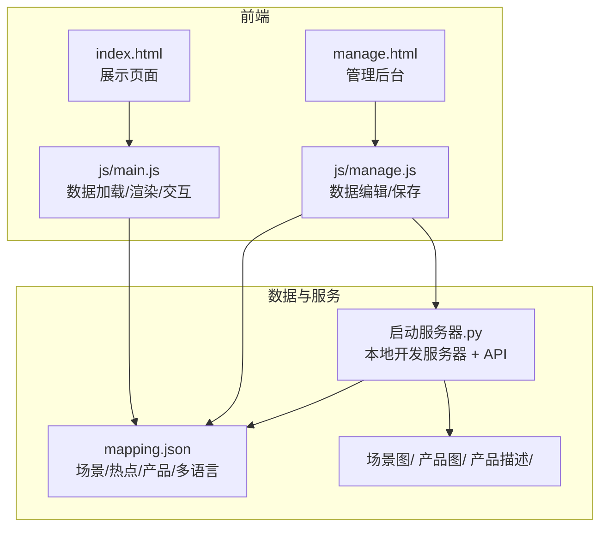
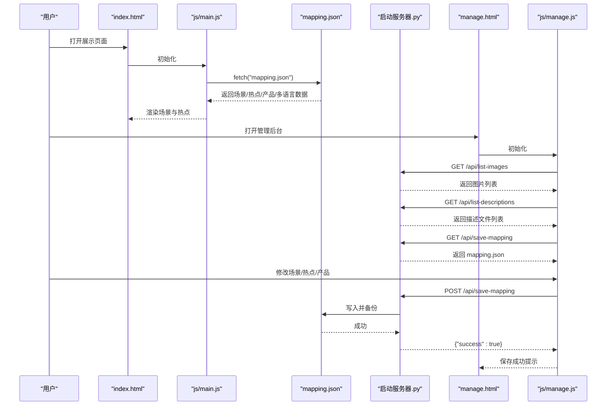
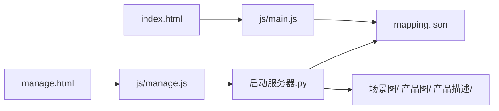

# 数据模型扩展

<cite>
**本文引用的文件**
- [mapping.json](file://mapping.json)
- [project_architecture.md](file://project_architecture.md)
- [启动服务器.py](file://启动服务器.py)
- [index.html](file://index.html)
- [manage.html](file://manage.html)
- [js/main.js](file://js/main.js)
- [js/manage.js](file://js/manage.js)
- [产品描述/室内双面吊装标牌.md](file://产品描述/室内双面吊装标牌.md)
- [产品描述/电子水牌.md](file://产品描述/电子水牌.md)
- [产品描述/自助点单机1.md](file://产品描述/自助点单机1.md)
</cite>

## 目录
1. [简介](#简介)
2. [项目结构](#项目结构)
3. [核心组件](#核心组件)
4. [架构总览](#架构总览)
5. [详细组件分析](#详细组件分析)
6. [依赖分析](#依赖分析)
7. [性能考量](#性能考量)
8. [故障排查指南](#故障排查指南)
9. [结论](#结论)
10. [附录](#附录)

## 简介
本指南面向数字标牌产品展示项目，提供数据模型扩展的系统化方法论与实操步骤。重点涵盖：
- 设计原则：向后兼容、数据验证、业务规则约束
- mapping.json 扩展：新增字段、修改结构、国际化文本
- Python 服务器扩展：新增 API 端点与数据处理逻辑
- 数据迁移策略：备份、回滚、一致性校验
- 最佳实践：数据规范化、索引与查询优化
- 具体示例：新增场景属性、产品规格、用户偏好设置

## 项目结构
项目采用“数据与逻辑分离”的架构：前端通过 fetch 动态加载 mapping.json，管理后台通过本地开发服务器提供的 API 读写数据。核心文件与职责如下：
- mapping.json：场景、热点、产品、多语言配置的统一数据源
- 启动服务器.py：提供 /api/save-mapping、/api/upload-image、/api/list-images、/api/list-descriptions
- index.html + js/main.js：展示页面，动态渲染场景、热点、产品详情
- manage.html + js/manage.js：管理后台，可视化编辑 mapping.json
- 产品描述/*.md：Markdown 格式的产品描述文件

图表来源
- [index.html:1-83](file://index.html#L1-L83)
- [js/main.js:1-200](file://js/main.js#L1-L200)
- [manage.html:1-113](file://manage.html#L1-L113)
- [js/manage.js:1-200](file://js/manage.js#L1-L200)
- [启动服务器.py:25-298](file://启动服务器.py#L25-L298)
- [mapping.json:1-232](file://mapping.json#L1-L232)

章节来源
- [project_architecture.md:43-108](file://project_architecture.md#L43-L108)
- [启动服务器.py:254-298](file://启动服务器.py#L254-L298)

## 核心组件
- 数据模型（mapping.json）
  - version：版本号，用于迁移策略与兼容性判断
  - scenes：场景数组，每个场景包含 id、category、image、hotspots
  - i18n：多语言字典，键为语言代码，值为 UI 文本集合
- 前端渲染（js/main.js）
  - loadMapping：从 mapping.json 动态加载数据，含重试机制
  - getText/t：多语言文本获取与切换
  - 场景渲染、热点渲染、详情弹窗、图片预加载
- 管理后台（js/manage.js）
  - loadMappingData/loadImageList/loadDescriptionList：从本地 API 获取数据
  - saveMapping：POST /api/save-mapping 写入 mapping.json
  - 场景/热点/产品编辑与拖拽交互
- 本地服务器（启动服务器.py）
  - /api/save-mapping：保存 mapping.json（自动备份）
  - /api/upload-image：上传图片到场景图/产品图目录
  - /api/list-images：扫描场景图与产品图目录，返回文件列表
  - /api/list-descriptions：返回产品描述文件列表

章节来源
- [project_architecture.md:112-220](file://project_architecture.md#L112-L220)
- [js/main.js:49-73](file://js/main.js#L49-L73)
- [js/manage.js:35-72](file://js/manage.js#L35-L72)
- [启动服务器.py:75-252](file://启动服务器.py#L75-L252)

## 架构总览
前端与服务器之间的数据流如下：

图表来源
- [js/main.js:49-73](file://js/main.js#L49-L73)
- [js/manage.js:35-72](file://js/manage.js#L35-L72)
- [启动服务器.py:75-128](file://启动服务器.py#L75-L128)

## 详细组件分析

### mapping.json 数据模型与扩展点
- 场景对象（scene）
  - id：场景唯一标识，建议格式 scene_001
  - category：多语言分类名，键为语言代码
  - image：场景图路径（相对项目根目录）
  - hotspots：热点数组，每个热点包含 id、x、y、products
- 热点对象（hotspot）
  - id：热点唯一标识，建议格式 hs_001
  - x/y：百分比坐标（0-100），用于精确定位
  - products：产品数组，每个产品包含 name、image、descriptionFile
- 产品对象（product）
  - name：多语言产品名
  - image：产品图路径
  - descriptionFile：产品描述文件路径
- 多语言字典（i18n）
  - 键为语言代码（如 ja、zh），值为 UI 文本集合

扩展设计原则
- 向后兼容：新增字段需提供默认值或可选，避免破坏既有渲染逻辑
- 数据验证：在保存前进行字段类型与范围校验
- 业务规则：热点坐标应在 0-100 之间；场景/热点 id 唯一且符合命名规范
- 国际化：新增文本字段需同时提供 ja、zh 值

章节来源
- [project_architecture.md:118-220](file://project_architecture.md#L118-L220)
- [mapping.json:1-232](file://mapping.json#L1-L232)

### 前端渲染逻辑与扩展适配
- 数据加载与重试
  - loadMapping：最多重试 3 次，递增延迟，失败时触发全屏错误提示
- 多语言切换
  - getText：优先取当前语言，其次 ja，最后取第一个值
  - switchLanguage：更新页面标题、按钮、切换器、弹窗标题与产品列表
- 场景与热点渲染
  - renderScene：从 mappingData.scenes 获取数据
  - renderHotspots：接收热点数组，逐个渲染脉冲热点
- 详情弹窗
  - renderProductList：并行加载 Markdown 描述，失败时显示可重试提示

扩展适配要点
- 新增场景属性：在场景对象中添加字段，前端需在渲染处兼容读取
- 新增产品规格：在产品对象中添加字段，管理后台需提供编辑入口
- 用户偏好设置：可在 mapping.json 中新增顶层对象，前端按需读取

章节来源
- [js/main.js:49-73](file://js/main.js#L49-L73)
- [js/main.js:87-162](file://js/main.js#L87-L162)
- [js/main.js:463-703](file://js/main.js#L463-L703)
- [js/main.js:706-870](file://js/main.js#L706-L870)
- [js/main.js:873-1025](file://js/main.js#L873-L1025)

### 管理后台编辑流程与扩展适配
- 数据加载
  - loadMappingData：获取 mapping.json
  - loadImageList：获取场景图与产品图列表
  - loadDescriptionList：获取产品描述文件列表
- 保存流程
  - saveMapping：POST /api/save-mapping，服务器先备份再写入
- 场景/热点/产品编辑
  - 场景编辑：分类名输入、更换场景图、添加/删除热点
  - 热点拖拽：实时更新百分比坐标
  - 产品编辑：名称、图片、描述文件选择

扩展适配要点
- 新增字段：在管理后台对应编辑区域添加输入控件
- 上传与路径：使用 /api/upload-image 上传图片，返回相对路径
- 保存与备份：通过 /api/save-mapping 保存，确保服务器自动备份

章节来源
- [js/manage.js:35-72](file://js/manage.js#L35-L72)
- [js/manage.js:81-108](file://js/manage.js#L81-L108)
- [js/manage.js:189-200](file://js/manage.js#L189-L200)

### 本地服务器 API 与扩展适配
- /api/save-mapping
  - 请求体：完整的 mapping.json 数据
  - 处理：解析 JSON、备份原文件、写入新文件
- /api/upload-image
  - 请求体：multipart/form-data，包含 file、type、category、filename
  - 处理：根据 type 决定保存目录（场景图/分类名/ 或 产品图/），返回相对路径
- /api/list-images
  - 返回：{"scenes": {...}, "products": [...]}
- /api/list-descriptions
  - 返回：["产品描述/xxx.md", ...]

扩展适配要点
- 新增 API：遵循现有模式，提供 CORS 处理、错误响应与返回格式
- 数据校验：在服务器端对请求体进行 JSON 解析与字段校验
- 文件安全：限制上传类型与大小，确保路径安全

章节来源
- [启动服务器.py:75-252](file://启动服务器.py#L75-L252)

## 依赖分析
前端与服务器之间的依赖关系如下：

图表来源
- [js/main.js:49-73](file://js/main.js#L49-L73)
- [js/manage.js:35-72](file://js/manage.js#L35-L72)
- [启动服务器.py:75-252](file://启动服务器.py#L75-L252)

章节来源
- [project_architecture.md:43-108](file://project_architecture.md#L43-L108)

## 性能考量
- 图片加载与预加载
  - 首屏独占带宽策略：首屏图片加载完成后启动其余图片预加载
  - 双层交叉淡入淡出：减少切换过程中的黑屏与闪烁
  - 预加载缓存：避免重复加载相同资源
- Markdown 描述加载
  - 并行加载多个描述文件，失败时显示可重试提示
  - 缓存已加载的描述内容，避免重复请求
- 服务器端
  - CORS 预检：OPTIONS 处理提升跨域请求效率
  - 文件上传分块读取：避免大文件内存占用过高

章节来源
- [project_architecture.md:290-301](file://project_architecture.md#L290-L301)
- [js/main.js:238-407](file://js/main.js#L238-L407)
- [js/main.js:409-461](file://js/main.js#L409-L461)
- [启动服务器.py:48-98](file://启动服务器.py#L48-L98)
- [启动服务器.py:129-202](file://启动服务器.py#L129-L202)

## 故障排查指南
- mapping.json 加载失败
  - 现象：展示页面出现全屏错误提示
  - 排查：检查网络连接、文件路径、JSON 格式
  - 处理：管理后台保存后确认 /api/save-mapping 返回 success
- 图片加载失败
  - 现象：场景图或产品图显示占位
  - 排查：确认图片路径正确、文件存在、扩展名受支持
  - 处理：通过管理后台上传图片，使用 /api/upload-image
- 描述文件加载失败
  - 现象：产品详情加载失败，显示可重试提示
  - 排查：确认 Markdown 文件存在、路径正确
  - 处理：在管理后台选择正确的描述文件
- 服务器端错误
  - 现象：POST /api/save-mapping 返回错误
  - 排查：检查请求体 JSON 格式、Content-Type、服务器权限
  - 处理：查看服务器日志，确认备份与写入流程

章节来源
- [js/main.js:619-640](file://js/main.js#L619-L640)
- [js/main.js:409-461](file://js/main.js#L409-L461)
- [启动服务器.py:101-128](file://启动服务器.py#L101-L128)
- [启动服务器.py:129-202](file://启动服务器.py#L129-L202)

## 结论
通过将数据与逻辑分离、引入本地开发服务器 API、以及完善的前端渲染与管理后台，项目具备良好的扩展性。扩展数据模型时，应遵循向后兼容、数据验证与业务规则约束的原则，结合服务器端备份与前端兼容渲染，确保升级过程中的数据完整性与用户体验。

## 附录

### 数据模型扩展设计原则
- 向后兼容
  - 新增字段提供默认值或可选
  - 渲染逻辑对缺失字段进行安全处理
- 数据验证
  - 服务器端对请求体进行 JSON 解析与字段校验
  - 前端对用户输入进行基本格式校验
- 业务规则约束
  - 热点坐标范围 0-100
  - 场景/热点 id 唯一且符合命名规范
  - 多语言字段必须提供 ja、zh 值
- 国际化
  - 新增 UI 文本字段需同时提供 ja、zh 值
  - 多语言切换不影响已有数据结构

章节来源
- [project_architecture.md:118-220](file://project_architecture.md#L118-L220)
- [启动服务器.py:101-128](file://启动服务器.py#L101-L128)

### mapping.json 扩展示例

#### 示例一：为场景新增属性（如“适用人群”）
- 扩展方案
  - 在场景对象中新增字段，例如适用人群、安装方式等
  - 前端渲染时兼容读取，若缺失则显示默认文案
- 适用场景
  - 区分不同场景的受众群体，便于营销策略制定
- 注意事项
  - 保持与现有渲染逻辑兼容，避免破坏热点与产品展示

章节来源
- [mapping.json:1-232](file://mapping.json#L1-L232)
- [js/main.js:463-703](file://js/main.js#L463-L703)

#### 示例二：为产品新增规格字段（如“尺寸”、“分辨率”）
- 扩展方案
  - 在产品对象中新增规格字段，管理后台提供输入控件
  - 前端详情弹窗中展示规格信息
- 适用场景
  - 提升产品信息透明度，辅助客户决策
- 注意事项
  - 规格字段需与多语言系统解耦，避免影响现有 name 与描述

章节来源
- [mapping.json:1-232](file://mapping.json#L1-L232)
- [js/manage.js:440-617](file://js/manage.js#L440-L617)
- [js/main.js:873-1025](file://js/main.js#L873-L1025)

#### 示例三：新增用户偏好设置（如“默认语言”、“主题模式”）
- 扩展方案
  - 在 mapping.json 顶层新增偏好对象，前端按需读取
  - 管理后台提供开关或下拉菜单
- 适用场景
  - 个性化用户体验，减少重复设置
- 注意事项
  - 偏好设置应与现有 i18n 体系协同，避免冲突

章节来源
- [mapping.json:1-232](file://mapping.json#L1-L232)
- [js/main.js:87-162](file://js/main.js#L87-L162)
- [js/manage.js:81-108](file://js/manage.js#L81-L108)

### Python 服务器扩展指南

#### 新增 API 端点（以“获取场景统计”为例）
- 设计思路
  - 路径：GET /api/stats/scenes
  - 功能：返回场景数量、分类分布、平均热点数等统计信息
  - 响应：JSON 格式，包含统计数据
- 实现步骤
  - 在 APIHandler 中新增路由与处理函数
  - 读取 mapping.json，计算统计指标
  - 返回 JSON 响应，设置 CORS 头
- 错误处理
  - 文件不存在或解析失败时返回错误响应
  - 服务器异常捕获并返回统一错误格式

章节来源
- [启动服务器.py:75-98](file://启动服务器.py#L75-L98)
- [启动服务器.py:204-252](file://启动服务器.py#L204-L252)

#### 数据处理逻辑扩展
- 保存前校验
  - 对新增字段进行类型与范围校验
  - 对多语言字段进行完整性检查
- 写入与备份
  - 保持现有备份策略，确保可回滚
- 前端兼容
  - 新增字段不影响旧版前端渲染
  - 旧版前端遇到未知字段时忽略处理

章节来源
- [启动服务器.py:101-128](file://启动服务器.py#L101-L128)
- [js/main.js:87-162](file://js/main.js#L87-L162)

### 数据迁移方法与策略
- 备份与回滚
  - 保存前自动备份 mapping.json 为 mapping.json.bak
  - 失败时回滚至备份文件
- 版本管理
  - 在 mapping.json 中维护 version 字段
  - 升级时根据版本号执行差异迁移脚本
- 一致性校验
  - 校验 id 唯一性、路径存在性、多语言完整性
  - 对异常数据给出修复建议或自动修复
- 渐进式发布
  - 先在测试环境验证，再逐步推广到生产环境
  - 提供灰度发布与快速回滚能力

章节来源
- [启动服务器.py:116-127](file://启动服务器.py#L116-L127)
- [project_architecture.md:118-126](file://project_architecture.md#L118-L126)

### 最佳实践
- 数据规范化
  - 统一字段命名与数据类型
  - 多语言字段采用键值对结构
- 索引与查询优化
  - 前端：通过 id 快速定位场景/热点/产品
  - 服务器：扫描目录时按字母序排序，便于管理
- 查询性能
  - 预加载与缓存：图片与描述文件采用缓存策略
  - 并行加载：Markdown 描述文件并行加载，提升响应速度

章节来源
- [js/main.js:238-407](file://js/main.js#L238-L407)
- [js/main.js:409-461](file://js/main.js#L409-L461)
- [启动服务器.py:204-252](file://启动服务器.py#L204-L252)