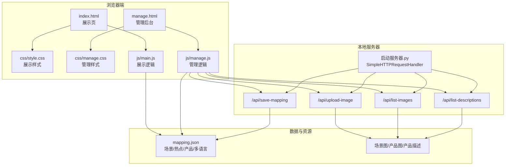
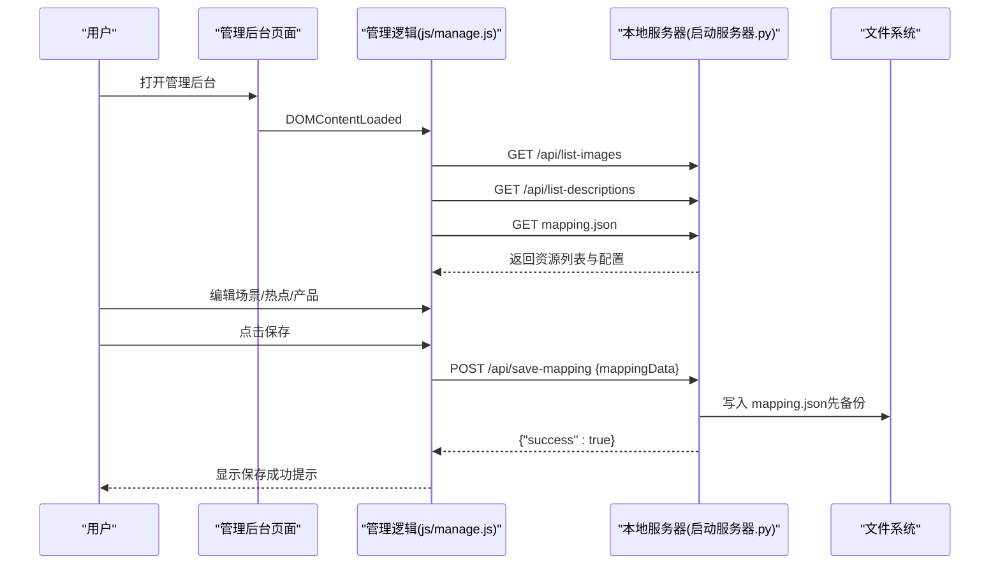
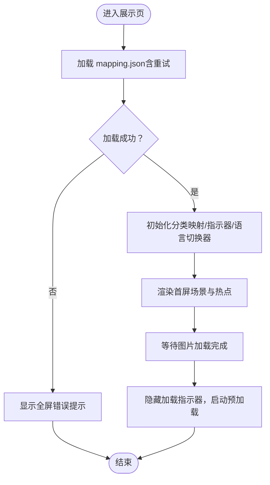
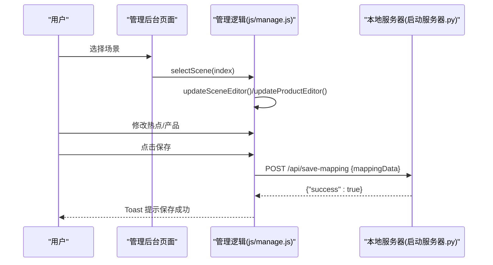
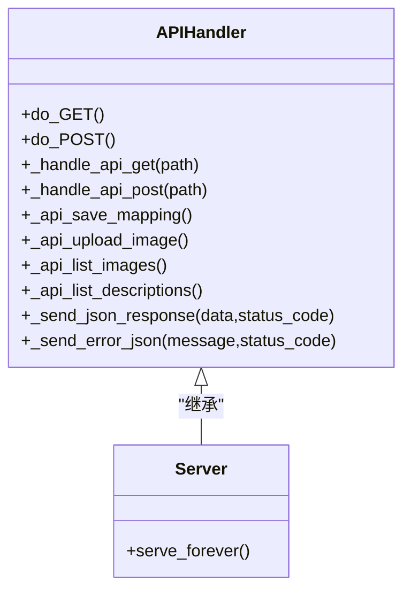
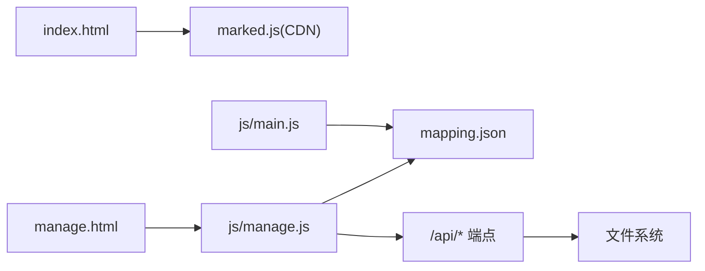

# 第三方集成

<cite>
**本文引用的文件**
- [index.html](file://index.html)
- [manage.html](file://manage.html)
- [启动服务器.py](file://启动服务器.py)
- [mapping.json](file://mapping.json)
- [project_architecture.md](file://project_architecture.md)
- [js/main.js](file://js/main.js)
- [js/manage.js](file://js/manage.js)
- [css/style.css](file://css/style.css)
- [css/manage.css](file://css/manage.css)
</cite>

## 目录
1. [简介](#简介)
2. [项目结构](#项目结构)
3. [核心组件](#核心组件)
4. [架构总览](#架构总览)
5. [详细组件分析](#详细组件分析)
6. [依赖分析](#依赖分析)
7. [性能考量](#性能考量)
8. [故障排查指南](#故障排查指南)
9. [结论](#结论)
10. [附录](#附录)

## 简介
本指南面向需要在现有数字标牌产品展示项目中集成第三方服务（如图片处理库、内容管理系统、分析平台、监控系统等）的工程师。文档基于仓库中的本地开发服务器、前端页面与数据模型，系统阐述如何安全地引入新库、扩展API端点、接入外部服务，并给出故障与降级策略建议。为便于非技术读者理解，文档采用分层讲解与可视化图示。

## 项目结构
项目采用“静态资源 + Python本地服务器 + 前端页面 + JSON配置”的轻量架构：
- 前端页面：展示页与管理后台两套页面，分别对应不同的交互与数据来源
- 本地服务器：提供静态文件服务与4个API端点，支撑管理后台的数据读写
- 数据模型：mapping.json集中管理场景、热点、产品与多语言文案
- 样式：两套独立样式文件，分别服务于展示页与管理后台

图表来源
- [index.html:1-83](file://index.html#L1-L83)
- [manage.html:1-113](file://manage.html#L1-L113)
- [启动服务器.py:25-252](file://启动服务器.py#L25-L252)
- [mapping.json:1-232](file://mapping.json#L1-L232)

章节来源
- [project_architecture.md:43-108](file://project_architecture.md#L43-L108)

## 核心组件
- 展示页（index.html + js/main.js + css/style.css）
  - 动态加载 mapping.json，渲染场景、热点、产品详情与多语言文案
  - 支持双层图片交叉淡入淡出、骨架屏与错误重试
- 管理后台（manage.html + js/manage.js + css/manage.css）
  - 可视化编辑场景、热点、产品与多语言文案
  - 通过API与本地服务器交互，保存配置、上传图片、列举资源
- 本地服务器（启动服务器.py）
  - 静态文件服务 + 4个API端点，负责读写 mapping.json 与图片资源
- 数据模型（mapping.json）
  - 统一的场景-热点-产品-多语言配置中心

章节来源
- [project_architecture.md:112-229](file://project_architecture.md#L112-L229)
- [启动服务器.py:25-252](file://启动服务器.py#L25-L252)

## 架构总览
前端通过 fetch 与本地服务器通信，服务器以静态文件服务为基础，扩展了API端点。数据模型集中于 mapping.json，管理后台负责编辑与持久化。

图表来源
- [js/manage.js:35-108](file://js/manage.js#L35-L108)
- [启动服务器.py:75-128](file://启动服务器.py#L75-L128)

## 详细组件分析

### 展示页组件分析
- 数据加载与重试
  - 通过 fetch 加载 mapping.json，内置3次递增重试，失败时触发全屏错误提示
- 多语言引擎
  - t(key) 与 getText(obj) 提供统一的多语言文本获取与回退策略
- 场景渲染与切换
  - 交叉淡入淡出、指示器与分类切换器动态生成
- 热点与详情面板
  - 支持单场景多热点，详情面板采用左图右文布局，Markdown描述支持缓存与重试

图表来源
- [js/main.js:49-73](file://js/main.js#L49-L73)
- [js/main.js:119-162](file://js/main.js#L119-L162)

章节来源
- [js/main.js:1-200](file://js/main.js#L1-L200)
- [css/style.css:1-200](file://css/style.css#L1-L200)

### 管理后台组件分析
- 数据加载
  - 从 mapping.json、/api/list-images、/api/list-descriptions 获取数据
- 场景与热点编辑
  - 场景列表、场景编辑区（分类名、场景图、热点标记）、产品编辑器
- 保存与上传
  - 保存配置到服务器，上传图片到指定目录

图表来源
- [js/manage.js:171-185](file://js/manage.js#L171-L185)
- [js/manage.js:82-108](file://js/manage.js#L82-L108)

章节来源
- [js/manage.js:1-200](file://js/manage.js#L1-L200)
- [css/manage.css:1-200](file://css/manage.css#L1-L200)

### 本地服务器与API端点
- 端点概览
  - POST /api/save-mapping：保存 mapping.json（先备份）
  - POST /api/upload-image：上传图片到场景图/产品图目录
  - GET /api/list-images：返回场景图与产品图列表
  - GET /api/list-descriptions：返回产品描述文件列表
- CORS与错误处理
  - 统一设置 Access-Control-Allow-* 响应头
  - JSON错误响应格式统一，便于前端处理

图表来源
- [启动服务器.py:25-252](file://启动服务器.py#L25-L252)

章节来源
- [启动服务器.py:25-252](file://启动服务器.py#L25-L252)

## 依赖分析
- 前端依赖
  - marked.js（CDN）：Markdown解析
  - 无构建工具与打包器，纯原生JS/CSS
- 服务器依赖
  - Python标准库：http.server、socketserver、urllib、json、os、shutil、cgi
- 数据依赖
  - mapping.json：集中配置
  - 场景图/产品图/产品描述：静态资源

图表来源
- [index.html:9-10](file://index.html#L9-L10)
- [启动服务器.py:1-20](file://启动服务器.py#L1-L20)

章节来源
- [project_architecture.md:29-39](file://project_architecture.md#L29-L39)

## 性能考量
- 图片加载与预加载
  - 首屏独占带宽策略：首屏图片加载完成后才启动其余图片预加载
  - 交叉淡入淡出减少闪烁，提升感知性能
- 缓存与降级
  - Markdown描述缓存，失败时提供可点击重试
  - mapping.json加载失败时全屏提示，避免空白页
- 建议
  - 对于第三方图片处理服务，建议在前端进行懒加载与缓存策略优化
  - 对于分析平台，建议采用异步上报与批量合并，避免阻塞主线程

[本节为通用指导，不直接分析具体文件]

## 故障排查指南
- mapping.json加载失败
  - 现象：全屏错误提示，无法进入展示页
  - 排查：确认文件存在、JSON格式正确、服务器端口可用
- 图片上传失败
  - 现象：上传接口报错或返回错误信息
  - 排查：检查 Content-Type、boundary、文件大小限制、保存目录权限
- API跨域问题
  - 现象：浏览器控制台出现CORS错误
  - 排查：确认服务器已设置 Access-Control-Allow-* 响应头
- 管理后台保存失败
  - 现象：保存状态显示失败
  - 排查：检查请求体JSON格式、服务器写入权限、备份文件是否被覆盖

章节来源
- [js/main.js:49-73](file://js/main.js#L49-L73)
- [启动服务器.py:44-97](file://启动服务器.py#L44-L97)
- [js/manage.js:82-108](file://js/manage.js#L82-L108)

## 结论
本项目以“静态资源 + 本地服务器 + JSON配置”为核心，提供了清晰的前端与后端边界。通过扩展API端点与引入第三方服务，可以在不破坏现有架构的前提下实现功能增强。建议在引入新库或服务时遵循统一的错误处理、CORS与安全策略，并结合现有重试与降级机制，确保系统的稳定性与可靠性。

[本节为总结性内容，不直接分析具体文件]

## 附录

### 如何集成新的图片处理库
- 方案一：前端直连（推荐）
  - 在前端页面中引入第三方图片处理SDK（如CDN或npm包），在需要时调用其API进行压缩、裁剪、格式转换
  - 注意：需遵守CORS策略，必要时在本地服务器代理
- 方案二：后端扩展
  - 在本地服务器中新增图片处理API端点，接收图片与处理参数，返回处理结果
  - 优点：避免跨域与客户端兼容性问题
  - 缺点：增加服务器负载与复杂度

章节来源
- [启动服务器.py:25-252](file://启动服务器.py#L25-L252)

### 如何集成内容管理系统（CMS）
- 两种思路
  - 本地化：将CMS输出的静态资源与现有结构对齐（场景图/产品图/产品描述），通过 /api/list-images 与 /api/list-descriptions 暴露给管理后台
  - 远程化：在前端通过API对接CMS，但需注意跨域与鉴权
- 配置迁移
  - 将CMS中的场景、热点、产品与多语言信息映射到 mapping.json 结构，保持与现有渲染逻辑一致

章节来源
- [mapping.json:1-232](file://mapping.json#L1-L232)
- [启动服务器.py:204-252](file://启动服务器.py#L204-L252)

### 如何扩展现有RESTful API
- 新增端点步骤
  - 在请求路由中注册新路径
  - 实现处理逻辑（参数校验、业务处理、错误处理）
  - 统一返回JSON响应与CORS头
- 示例：新增“获取统计报表”
  - 路径：GET /api/stats
  - 逻辑：读取统计数据或调用第三方分析平台API
  - 返回：{"success": true, "data": {...}}

章节来源
- [启动服务器.py:75-97](file://启动服务器.py#L75-L97)
- [启动服务器.py:25-53](file://启动服务器.py#L25-L53)

### 如何集成数据分析工具与监控系统
- 前端埋点
  - 在关键交互处（如场景切换、热点点击、详情打开）收集事件数据，异步上报
  - 建议：批量上报、去重、限流
- 后端指标
  - 在本地服务器中新增 /api/monitoring 端点，聚合访问日志与错误信息
- 第三方平台
  - 若接入第三方分析平台，需在前端通过HTTPS与鉴权头访问，并在本地服务器中设置CORS

章节来源
- [js/main.js:521-607](file://js/main.js#L521-L607)
- [启动服务器.py:25-53](file://启动服务器.py#L25-L53)

### 安全考虑与最佳实践
- 认证与授权
  - 本地开发阶段：使用CORS通配符满足本地调试需求
  - 生产部署：限制 Access-Control-Allow-Origin，启用CSRF防护与鉴权中间件
- 数据加密
  - 传输加密：强制HTTPS
  - 存储加密：对敏感配置与日志进行加密存储
- 访问控制
  - 管理后台：仅允许受信任IP访问或添加登录校验
  - API端点：对敏感操作（如保存配置）进行权限校验
- 输入验证与错误处理
  - 对上传文件进行类型与大小校验
  - 对JSON请求体进行严格解析与异常捕获
  - 统一错误响应格式，避免泄露内部细节

章节来源
- [启动服务器.py:28-46](file://启动服务器.py#L28-L46)
- [启动服务器.py:101-127](file://启动服务器.py#L101-L127)
- [启动服务器.py:129-202](file://启动服务器.py#L129-L202)

### 故障与降级策略
- 前端降级
  - mapping.json加载失败：全屏错误提示 + 重试按钮
  - Markdown加载失败：显示可点击重试提示
  - 图片加载失败：骨架屏占位 + 重试
- 后端降级
  - API不可用：返回友好错误信息，记录日志
  - 文件写入失败：回滚至备份文件，提示人工干预
- 运维保障
  - 健康检查端点：/health（可扩展）
  - 日志分级：区分warn/error级别，便于快速定位

章节来源
- [js/main.js:49-73](file://js/main.js#L49-L73)
- [js/main.js:409-461](file://js/main.js#L409-L461)
- [启动服务器.py:116-127](file://启动服务器.py#L116-L127)