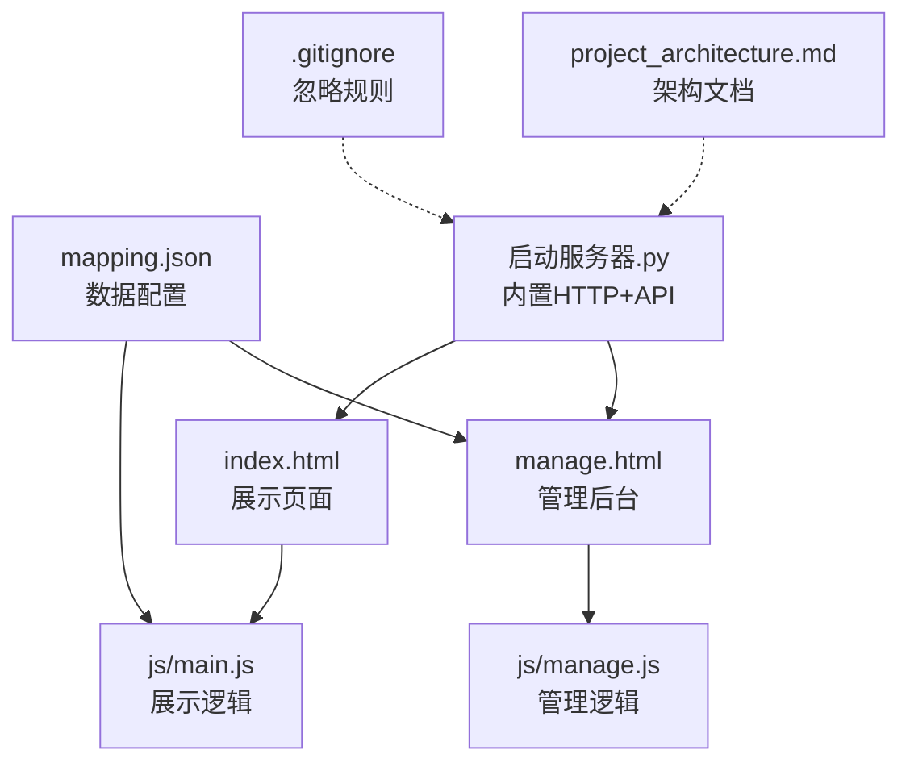
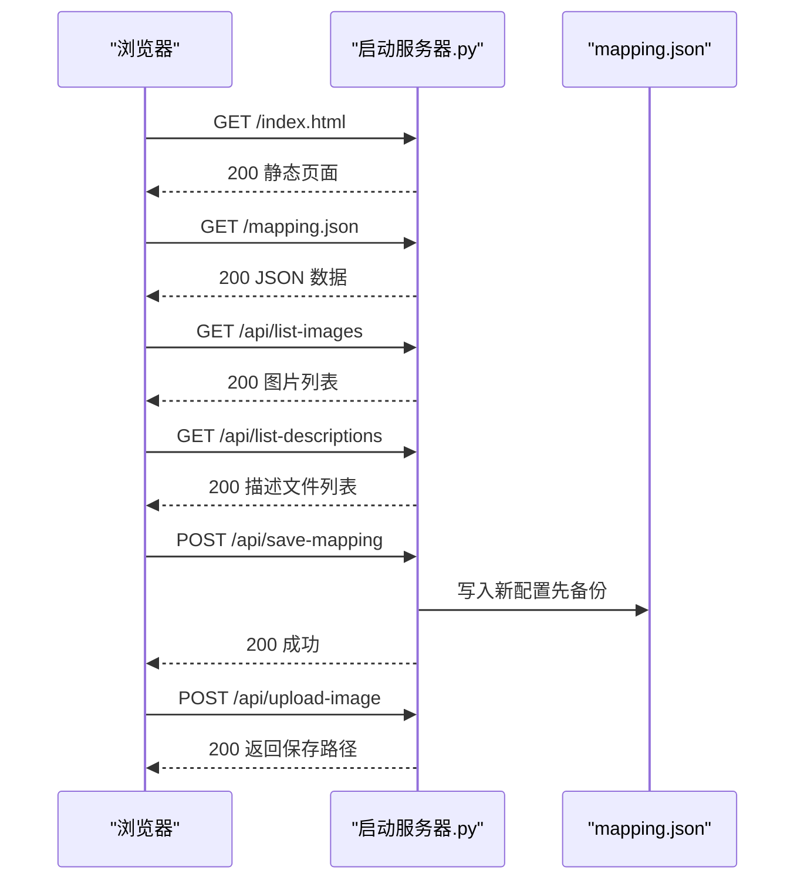
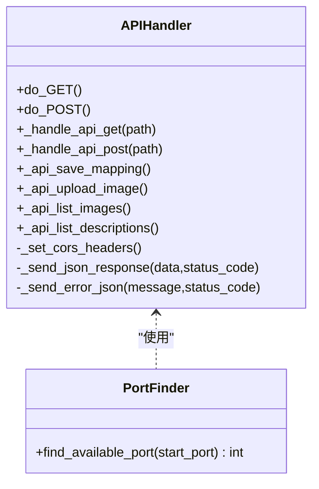
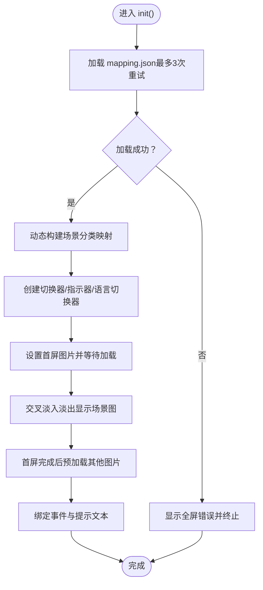
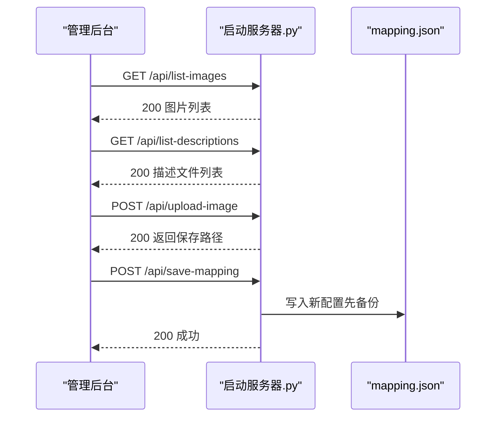
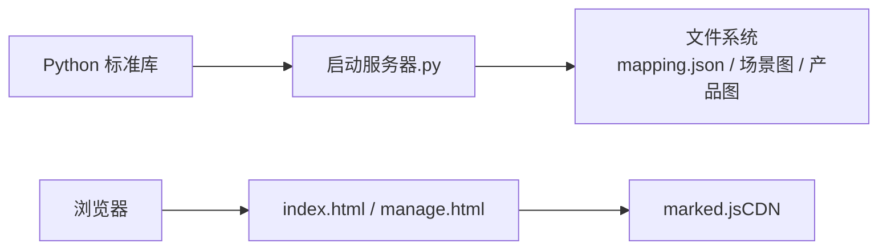

# 开发环境问题

<cite>
**本文引用的文件**
- [启动服务器.py](file://启动服务器.py)
- [index.html](file://index.html)
- [manage.html](file://manage.html)
- [mapping.json](file://mapping.json)
- [.gitignore](file://.gitignore)
- [project_architecture.md](file://project_architecture.md)
- [js/main.js](file://js/main.js)
- [js/manage.js](file://js/manage.js)
</cite>

## 目录
1. [简介](#简介)
2. [项目结构](#项目结构)
3. [核心组件](#核心组件)
4. [架构总览](#架构总览)
5. [详细组件分析](#详细组件分析)
6. [依赖关系分析](#依赖关系分析)
7. [性能考虑](#性能考虑)
8. [故障排除指南](#故障排除指南)
9. [结论](#结论)
10. [附录](#附录)

## 简介
本指南聚焦于数字标牌产品展示项目的开发环境问题，围绕本地服务器启动失败、文件权限、Git 版本控制、开发工具配置以及标准化搭建流程进行系统化排障与最佳实践说明。项目采用纯前端与内置 Python 服务器组合的方式，无需 Node.js 或包管理器即可运行，便于快速搭建与维护。

## 项目结构
项目采用“静态资源 + 内置 Python 服务器 + 前端页面”的轻量架构：
- 静态页面：index.html（展示页）、manage.html（管理后台）
- 数据配置：mapping.json（场景、热点、产品与多语言配置）
- 本地服务器：启动服务器.py（内置 HTTP 服务器 + API 端点）
- 前端逻辑：js/main.js（展示页交互）、js/manage.js（管理后台交互）
- 资源目录：场景图、产品图、产品描述（Markdown）

图表来源
- [启动服务器.py:1-298](file://启动服务器.py#L1-L298)
- [index.html:1-83](file://index.html#L1-L83)
- [manage.html:1-113](file://manage.html#L1-L113)
- [mapping.json:1-232](file://mapping.json#L1-L232)
- [.gitignore:1-18](file://.gitignore#L1-L18)
- [project_architecture.md:1-108](file://project_architecture.md#L1-L108)

章节来源
- [project_architecture.md:43-108](file://project_architecture.md#L43-L108)

## 核心组件
- 内置开发服务器：启动服务器.py 提供静态文件服务与 4 个 API 端点，支持跨域、图片上传、列表查询与配置保存。
- 展示页面：index.html + js/main.js，负责场景浏览、多语言切换、热点交互与产品详情弹窗。
- 管理后台：manage.html + js/manage.js，负责可视化编辑场景、热点与产品配置，并通过 API 保存至 mapping.json。
- 数据配置：mapping.json，集中管理场景、热点、产品与多语言文本。

章节来源
- [启动服务器.py:25-252](file://启动服务器.py#L25-L252)
- [index.html:1-83](file://index.html#L1-L83)
- [manage.html:1-113](file://manage.html#L1-L113)
- [mapping.json:1-232](file://mapping.json#L1-L232)
- [js/main.js:1-200](file://js/main.js#L1-L200)
- [js/manage.js:1-200](file://js/manage.js#L1-L200)

## 架构总览
本地开发流程概览：
- 启动服务器.py 在 8082 端口提供静态资源与 API。
- 展示页通过 fetch 加载 mapping.json，渲染场景与热点。
- 管理后台通过 /api/list-images、/api/list-descriptions、/api/save-mapping、/api/upload-image 与服务器交互。

图表来源
- [启动服务器.py:75-252](file://启动服务器.py#L75-L252)
- [js/main.js:49-73](file://js/main.js#L49-L73)
- [js/manage.js:35-72](file://js/manage.js#L35-L72)

## 详细组件分析

### 组件A：内置开发服务器（启动服务器.py）
- 功能要点
  - 静态文件服务：基于 SimpleHTTPRequestHandler 提供 index.html、manage.html 与资源。
  - API 端点：/api/save-mapping、/api/upload-image、/api/list-images、/api/list-descriptions。
  - 跨域支持：CORS 响应头允许本地开发跨域。
  - 端口选择：默认 8082，若被占用自动寻找可用端口。
  - 自动打开浏览器：启动后自动打开 http://localhost:端口/index.html。
- 关键实现位置
  - 端口查找与启动：[find_available_port:254-263](file://启动服务器.py#L254-L263)、[main:266-295](file://启动服务器.py#L266-L295)
  - API 路由与处理：[APIHandler:25-252](file://启动服务器.py#L25-L252)
  - 上传与保存逻辑：[_api_upload_image:129-202](file://启动服务器.py#L129-L202)、[_api_save_mapping:101-127](file://启动服务器.py#L101-L127)

图表来源
- [启动服务器.py:25-263](file://启动服务器.py#L25-L263)

章节来源
- [启动服务器.py:25-298](file://启动服务器.py#L25-L298)

### 组件B：展示页面（index.html + js/main.js）
- 功能要点
  - 动态加载 mapping.json，含 3 次重试与递增延迟。
  - 多语言系统：t()、getText()、switchLanguage()。
  - 场景渲染与交叉淡入淡出、热点渲染与点击交互、产品详情弹窗。
- 关键实现位置
  - 数据加载与重试：[loadMapping:49-73](file://js/main.js#L49-L73)
  - 多语言引擎：[t/getText/switchLanguage:87-162](file://js/main.js#L87-L162)
  - 场景切换与热点渲染：[renderScene/prevScene/nextScene/renderHotspots:463-870](file://js/main.js#L463-L870)

图表来源
- [js/main.js:49-73](file://js/main.js#L49-L73)
- [js/main.js:463-870](file://js/main.js#L463-L870)

章节来源
- [index.html:1-83](file://index.html#L1-L83)
- [js/main.js:1-200](file://js/main.js#L1-L200)

### 组件C：管理后台（manage.html + js/manage.js）
- 功能要点
  - 场景列表、场景编辑区、热点渲染与拖拽、产品编辑器、保存配置。
  - 通过 /api/list-images、/api/list-descriptions、/api/save-mapping、/api/upload-image 与服务器交互。
- 关键实现位置
  - 数据加载：[loadMappingData/loadImageList/loadDescriptionList:35-72](file://js/manage.js#L35-L72)
  - 保存配置：[saveMapping:81-108](file://js/manage.js#L81-L108)
  - 图片上传：[uploadImage:760-781](file://js/manage.js#L760-L781)

图表来源
- [js/manage.js:35-72](file://js/manage.js#L35-L72)
- [js/manage.js:760-781](file://js/manage.js#L760-L781)
- [启动服务器.py:75-252](file://启动服务器.py#L75-L252)

章节来源
- [manage.html:1-113](file://manage.html#L1-L113)
- [js/manage.js:1-200](file://js/manage.js#L1-L200)

## 依赖关系分析
- 运行时依赖
  - Python 标准库：http.server、socketserver、os、sys、json、shutil、cgi、urllib.parse。
  - 前端依赖：marked.js（CDN）用于 Markdown 渲染。
- 文件与目录
  - 服务器读写 mapping.json 与图片目录（场景图、产品图）。
  - .gitignore 忽略 IDE、Python 缓存与日志文件。

图表来源
- [启动服务器.py:7-16](file://启动服务器.py#L7-L16)
- [index.html:9](file://index.html#L9)
- [.gitignore:6-17](file://.gitignore#L6-L17)

章节来源
- [启动服务器.py:7-16](file://启动服务器.py#L7-L16)
- [index.html:9](file://index.html#L9)
- [.gitignore:6-17](file://.gitignore#L6-L17)

## 性能考虑
- 首屏优化：先加载首屏图片，完成后启动其他图片预加载，避免慢网环境下首屏长时间无显示。
- 交叉淡入淡出：双层图片切换，提升视觉连续性。
- 图片缓存：预加载缓存与命中检测，减少重复请求。
- Markdown 加载：缓存已加载描述，失败时提供可点击重试提示。

章节来源
- [project_architecture.md:381-396](file://project_architecture.md#L381-L396)
- [js/main.js:463-870](file://js/main.js#L463-L870)

## 故障排除指南

### 本地服务器启动失败
- 症状
  - 双击启动脚本报错或无法访问页面。
- 诊断步骤
  - 确认 Python 环境可用：命令行执行 python --version。
  - 端口占用检查：默认 8082，若被占用自动寻找可用端口；可在任务管理器或 netstat 检查占用。
  - 防火墙设置：临时关闭防火墙测试，确认是否为拦截导致无法访问。
  - 权限问题：确保项目目录具备读取权限；Windows 上右键以管理员身份运行可规避部分权限限制。
- 快速修复
  - 手动指定端口：修改启动服务器.py 中的 PORT 常量后重启。
  - 清理缓存：删除 __pycache__ 与 .pyc（受 .gitignore 控制）。
  - 重新打开浏览器：若浏览器缓存导致页面异常，清理缓存或使用隐身模式。
- 预防措施
  - 使用统一的 Python 版本与虚拟环境（如需）。
  - 保持项目目录整洁，避免无关文件干扰。

章节来源
- [启动服务器.py:18-263](file://启动服务器.py#L18-L263)
- [.gitignore:12-17](file://.gitignore#L12-L17)

### 端口占用与防火墙
- 症状
  - 服务器启动后无法访问，或端口被占用。
- 诊断步骤
  - 查看启动日志输出的最终端口号（启动后打印的服务地址）。
  - 使用 netstat -ano | findstr :端口 检查占用进程。
  - Windows 防火墙：检查入站规则是否允许 Python 或浏览器访问。
- 快速修复
  - 终止占用进程或更换端口。
  - 临时关闭防火墙验证问题是否解决。
- 预防措施
  - 固定常用端口并在团队内统一约定。
  - 在企业网络中申请放行开发端口。

章节来源
- [启动服务器.py:266-295](file://启动服务器.py#L266-L295)

### 文件权限问题
- 症状
  - 保存配置时报错（无法写入 mapping.json）。
  - 上传图片失败（无法写入场景图/产品图目录）。
- 诊断步骤
  - 检查 mapping.json 与图片目录的写入权限。
  - Windows：右键项目根目录 → 属性 → 安全，确认当前用户具备完全控制权。
  - macOS/Linux：使用 ls -la 查看文件权限，必要时使用 chmod/chown 修正。
- 快速修复
  - 以管理员/当前用户身份运行启动脚本。
  - 临时关闭杀毒软件的实时保护，避免拦截写入。
- 预防措施
  - 使用统一的工作目录并赋予开发账户完整权限。
  - 避免在只读分区或共享盘中直接开发。

章节来源
- [启动服务器.py:101-127](file://启动服务器.py#L101-L127)
- [启动服务器.py:129-202](file://启动服务器.py#L129-L202)

### Git 版本控制问题
- 分支合并冲突
  - 症状：git merge 报告冲突，尤其涉及 mapping.json。
  - 处理方法：使用文本编辑器打开冲突标记，保留正确修改后 git add、git commit。
- 提交历史清理
  - 症状：历史过大或包含敏感文件。
  - 处理方法：谨慎使用 git rebase 或 git filter-branch（建议在备份分支上操作）。
- 远程仓库同步
  - 症状：推送/拉取失败或频繁提示未跟踪文件。
  - 处理方法：确认 .gitignore 规则生效，先 git add .gitignore 管理的文件，再 push/pull。
- 预防措施
  - 合并前先 pull，尽量避免多人同时修改同一文件。
  - 使用 feature 分支开发，合并到主干前进行代码评审。

章节来源
- [.gitignore:1-18](file://.gitignore#L1-L18)

### 开发工具配置问题
- 症状
  - 浏览器无法加载 marked.js 或加载缓慢。
- 诊断步骤
  - 检查网络连通性与 CDN 可达性。
  - 若离线开发，可将 marked.js 下载到本地并替换 CDN 引用。
- 快速修复
  - 使用稳定镜像或本地资源替代 CDN。
- 预防措施
  - 在项目中提供本地 fallback 资源清单，降低对外部依赖的耦合。

章节来源
- [index.html:9](file://index.html#L9)

### 开发环境搭建标准化流程
- 步骤
  1) 环境准备：确认 Python 可用（python --version）。
  2) 启动服务器：双击启动服务器.py 或在终端执行 python 启动服务器.py。
  3) 访问页面：浏览器打开 http://localhost:端口/index.html 与 http://localhost:端口/manage.html。
  4) 验证 API：在开发者工具 Network 面板观察 /api/* 请求是否返回 200。
  5) 权限校验：尝试在管理后台保存配置与上传图片，确认写入成功。
- 验证清单
  - 服务器日志显示服务地址与 API 端点。
  - 展示页正常加载 mapping.json，语言切换与热点交互可用。
  - 管理后台可列出图片与描述文件，保存配置后 mapping.json 更新并生成备份文件。

章节来源
- [启动服务器.py:266-295](file://启动服务器.py#L266-L295)
- [js/main.js:49-73](file://js/main.js#L49-L73)
- [js/manage.js:35-72](file://js/manage.js#L35-L72)

### 常见开发环境错误与快速修复
- 错误：无法访问页面
  - 修复：确认端口未被占用，防火墙放行，或更换端口。
- 错误：保存配置失败
  - 修复：检查 mapping.json 写权限，确保项目目录可写。
- 错误：上传图片失败
  - 修复：确认场景图/产品图目录存在且可写，检查服务器日志错误。
- 错误：语言切换无效
  - 修复：确认 mapping.json 中 i18n 字段完整，前端 t()/getText() 能正确解析。
- 错误：Markdown 加载失败
  - 修复：检查描述文件路径与命名，确认文件存在且可读。

章节来源
- [启动服务器.py:101-127](file://启动服务器.py#L101-L127)
- [js/main.js:87-106](file://js/main.js#L87-L106)
- [js/main.js:642-648](file://js/main.js#L642-L648)

## 结论
本项目采用“内置 Python 服务器 + 前端静态页面”的极简方案，开发环境搭建与排障路径清晰。通过规范的权限管理、端口与防火墙配置、Git 规范与本地资源准备，可有效避免大多数开发环境问题。建议团队在统一端口、权限与提交流程的基础上，持续完善文档与自动化验证，保障协作效率与稳定性。

## 附录
- 术语
  - CORS：跨域资源共享，本地开发默认允许。
  - 备份：保存配置前自动备份 mapping.json 为 mapping.json.bak。
- 参考
  - 项目架构文档：[project_architecture.md](file://project_architecture.md)