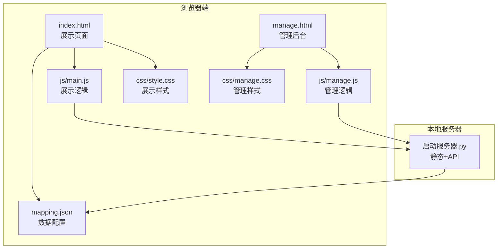
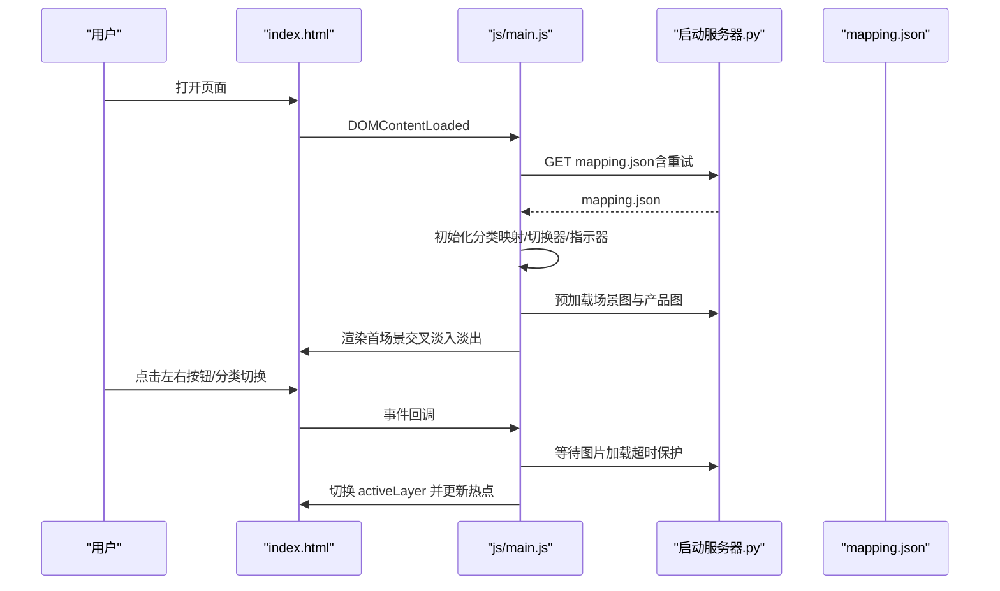
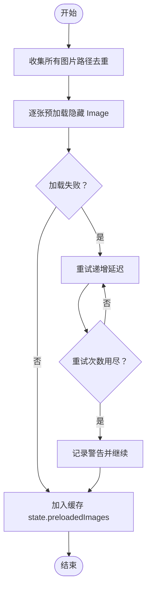
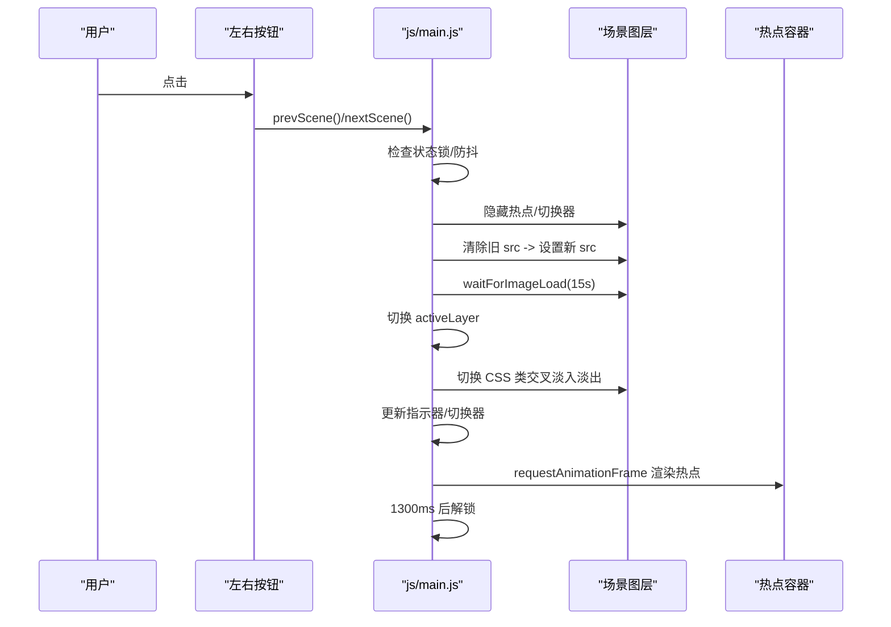
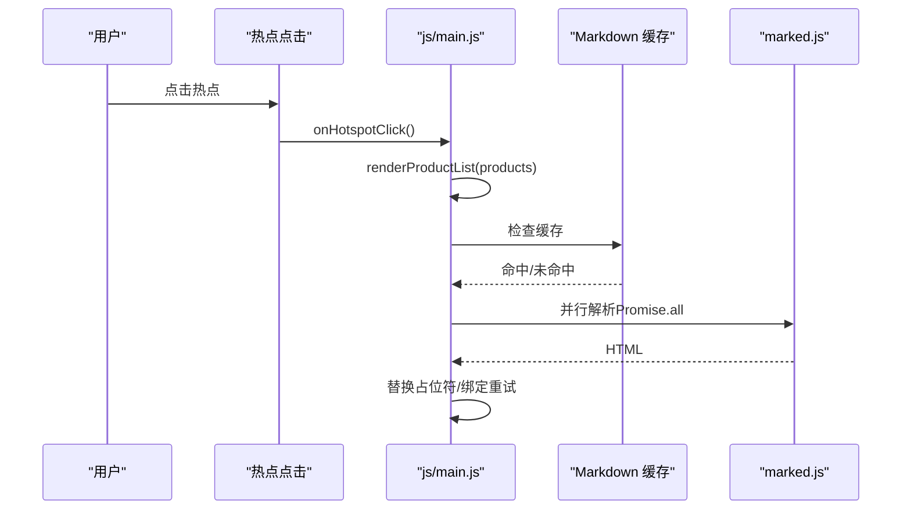
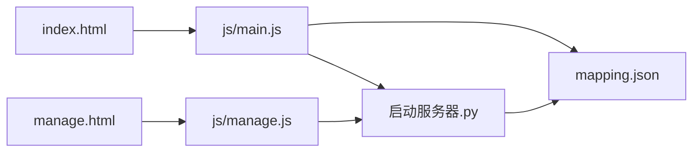

# 性能问题

<cite>
**本文引用的文件**
- [index.html](file://index.html)
- [manage.html](file://manage.html)
- [js/main.js](file://js/main.js)
- [js/manage.js](file://js/manage.js)
- [css/style.css](file://css/style.css)
- [css/manage.css](file://css/manage.css)
- [mapping.json](file://mapping.json)
- [project_architecture.md](file://project_architecture.md)
- [启动服务器.py](file://启动服务器.py)
</cite>

## 目录
1. [简介](#简介)
2. [项目结构](#项目结构)
3. [核心组件](#核心组件)
4. [架构总览](#架构总览)
5. [详细组件分析](#详细组件分析)
6. [依赖关系分析](#依赖关系分析)
7. [性能考量](#性能考量)
8. [故障排查指南](#故障排查指南)
9. [结论](#结论)
10. [附录](#附录)

## 简介
本指南聚焦于数字标牌产品展示项目的性能问题诊断与优化，围绕页面卡顿、加载缓慢、内存泄漏、图片预加载失败、场景切换动画卡顿、大数据量场景下的性能瓶颈等关键问题，结合现有代码实现，给出可落地的诊断步骤、优化策略与最佳实践。目标是在不改变业务逻辑的前提下，显著提升用户体验与稳定性。

## 项目结构
项目采用“纯前端 + 本地开发服务器”的轻量架构：
- 展示页面：index.html + js/main.js + css/style.css
- 管理后台：manage.html + js/manage.js + css/manage.css
- 数据配置：mapping.json（场景、热点、产品、多语言）
- 本地服务器：启动服务器.py（提供静态文件服务与4个API端点）

图表来源
- [index.html:1-83](file://index.html#L1-L83)
- [manage.html:1-113](file://manage.html#L1-L113)
- [js/main.js:1-1284](file://js/main.js#L1-L1284)
- [js/manage.js:1-811](file://js/manage.js#L1-L811)
- [css/style.css:1-997](file://css/style.css#L1-L997)
- [css/manage.css:1-824](file://css/manage.css#L1-L824)
- [mapping.json:1-232](file://mapping.json#L1-L232)
- [启动服务器.py:1-298](file://启动服务器.py#L1-L298)

章节来源
- [project_architecture.md:1-108](file://project_architecture.md#L1-L108)

## 核心组件
- 数据加载与重试：从 mapping.json 动态加载，含3次递增延迟重试，失败时全屏错误提示。
- 图片预加载与缓存：遍历场景图与产品图，使用隐藏 Image 对象预加载，缓存于 state.preloadedImages，支持重试与超时保护。
- 场景渲染与切换：双层交叉淡入淡出，先等待图片加载，再切换 activeLayer，防抖与状态锁避免并发冲突。
- 多语言与热点：动态生成分类切换器与指示器，热点按 object-fit: cover 的裁剪偏移计算像素位置，窗口变化时防抖重定位。
- 详情面板：骨架屏占位 + 并行加载 Markdown，失败时可点击重试。
- 管理后台：三栏布局，可视化编辑场景、热点与产品，支持图片上传与配置保存。

章节来源
- [js/main.js:49-73](file://js/main.js#L49-L73)
- [js/main.js:257-327](file://js/main.js#L257-L327)
- [js/main.js:480-595](file://js/main.js#L480-L595)
- [js/main.js:716-847](file://js/main.js#L716-L847)
- [js/main.js:888-956](file://js/main.js#L888-L956)
- [js/manage.js:18-31](file://js/manage.js#L18-L31)
- [css/style.css:86-127](file://css/style.css#L86-L127)
- [css/style.css:287-433](file://css/style.css#L287-L433)

## 架构总览
展示页面与管理后台共享统一的数据源 mapping.json，通过本地服务器提供 API 以支持管理后台的可视化编辑能力。前端通过 fetch 与事件驱动实现高性能交互，CSS 动画与骨架屏提升感知速度与体验。

图表来源
- [js/main.js:1197-1281](file://js/main.js#L1197-L1281)
- [启动服务器.py:54-63](file://启动服务器.py#L54-L63)
- [mapping.json:1-232](file://mapping.json#L1-L232)

## 详细组件分析

### 图片预加载与加载失败诊断
- 预加载策略
  - 遍历 mapping.json 中所有场景图与产品图，去重后批量创建隐藏 Image 对象，触发浏览器 HTTP 缓存。
  - 预加载失败时进行有限次重试（默认2次，递增延迟），避免首屏卡顿。
  - 首屏独占带宽：首场景完全显示后再启动后台预加载，避免慢速网络下带宽争用导致首图永不显示。
- 加载失败诊断
  - 使用 waitForImageLoad(imgEl, timeoutMs) 等待图片加载，支持超时保护（默认8秒，场景切换默认15秒，首图30秒）。
  - isImageCached(src) 判断是否已缓存，缓存命中则不显示加载指示器。
  - 若加载失败/超时，隐藏加载指示器，保留分类切换器可见，避免用户无法操作。
- 优化建议
  - 图片格式：项目大量使用 .webp，具备更优压缩率与质量，建议优先使用；对老设备回退至 .jpg/.png。
  - 缓存策略：利用浏览器 HTTP 缓存与 service worker（可选）进一步降低重复请求。
  - 带宽检测：可通过测量首次图片加载耗时与首屏显示时间评估网络状况，结合重试策略动态调整。

图表来源
- [js/main.js:257-327](file://js/main.js#L257-L327)
- [js/main.js:285-320](file://js/main.js#L285-L320)
- [js/main.js:354-395](file://js/main.js#L354-L395)

章节来源
- [js/main.js:257-327](file://js/main.js#L257-L327)
- [js/main.js:354-395](file://js/main.js#L354-L395)
- [js/main.js:1191-1266](file://js/main.js#L1191-L1266)

### 场景切换动画卡顿诊断与优化
- 现象与原因
  - 交叉淡入淡出使用 CSS transition（1.2s），若主线程阻塞或图片加载未完成，会出现卡顿或黑屏。
  - 热点定位依赖图片自然尺寸，若图片未加载完成，热点位置计算错误，导致闪烁或偏移。
  - 窗口 resize 频繁触发重定位，未做防抖，可能导致性能下降。
- 诊断步骤
  - 使用浏览器性能面板（Performance）录制切换过程，观察主线程耗时峰值与帧率。
  - 检查 waitForImageLoad 的超时时间与是否提前解除 isTransitioning 锁。
  - 确认 activeLayer 切换顺序与 requestAnimationFrame 的时机。
- 优化策略
  - 保持图片加载与 CSS 过渡完成后再解锁 isTransitioning。
  - 对 repositionHotspots 使用防抖（当前已实现约200ms），避免频繁计算。
  - 将热点渲染放入 requestAnimationFrame，减少主线程阻塞。
  - 使用 will-change 或 GPU 加速属性（如 transform/opacity）确保动画流畅。

图表来源
- [js/main.js:598-624](file://js/main.js#L598-L624)
- [js/main.js:480-595](file://js/main.js#L480-L595)
- [css/style.css:114-115](file://css/style.css#L114-L115)

章节来源
- [js/main.js:480-595](file://js/main.js#L480-L595)
- [js/main.js:1139-1148](file://js/main.js#L1139-L1148)
- [css/style.css:114-115](file://css/style.css#L114-L115)

### 详情面板与 Markdown 加载性能
- 骨架屏与并行加载
  - 先创建所有产品 DOM 骨架（含加载占位符），随后并行加载 Markdown，显著缩短首屏感知时间。
  - 失败时显示可点击重试提示，点击后清除缓存并重新加载。
- 优化建议
  - 对 Markdown 内容进行缓存（descriptionCache），避免重复请求。
  - 对长列表采用虚拟滚动（见“大数据量场景”章节）。
  - 控制 Markdown 解析库的使用范围，避免不必要的全局依赖。

图表来源
- [js/main.js:888-956](file://js/main.js#L888-L956)
- [js/main.js:421-442](file://js/main.js#L421-L442)
- [js/main.js:450-460](file://js/main.js#L450-L460)

章节来源
- [js/main.js:888-956](file://js/main.js#L888-L956)
- [js/main.js:421-442](file://js/main.js#L421-L442)

### 管理后台性能与交互
- 三栏布局与拖拽
  - 场景图预览区支持热点拖拽，实时更新百分比坐标，拖拽态使用 z-index 与阴影增强可视反馈。
  - 窗口变化时重新渲染热点，避免布局错位。
- 优化建议
  - 拖拽事件中避免频繁 DOM 查询，可缓存必要元素。
  - 对列表滚动使用原生滚动条样式，减少自定义渲染成本。
  - 图片上传采用分块读取，避免大文件阻塞主线程。

章节来源
- [js/manage.js:389-438](file://js/manage.js#L389-L438)
- [js/manage.js:805-810](file://js/manage.js#L805-L810)
- [css/manage.css:342-427](file://css/manage.css#L342-L427)

## 依赖关系分析
- 前端依赖
  - marked.js：用于 Markdown 解析（CDN引入）。
  - fetch：用于加载 mapping.json、Markdown、以及管理后台 API。
- 服务器端依赖
  - Python http.server：提供静态文件服务与自定义 API。
  - CORS：允许本地开发跨域访问。
- 数据依赖
  - mapping.json：集中管理场景、热点、产品与多语言配置。

图表来源
- [js/main.js:49-73](file://js/main.js#L49-L73)
- [js/manage.js:35-46](file://js/manage.js#L35-L46)
- [启动服务器.py:54-97](file://启动服务器.py#L54-L97)
- [mapping.json:1-232](file://mapping.json#L1-L232)

章节来源
- [启动服务器.py:25-97](file://启动服务器.py#L25-L97)
- [project_architecture.md:763-776](file://project_architecture.md#L763-L776)

## 性能考量
- 首屏加载时间
  - 首图独占带宽策略：首场景 30 秒超时，确保在慢速网络下也能显示。
  - 预加载策略：首图显示后再启动后台预加载，避免带宽争用。
- 交互响应时间
  - 场景切换：waitForImageLoad 超时保护与状态锁，确保动画完成后解锁。
  - 热点定位：防抖（约200ms）避免频繁计算。
- 内存占用与泄漏
  - 图片加载使用 { once: true } 监听器，避免重复绑定导致的内存泄漏。
  - 预加载缓存 state.preloadedImages，避免重复创建 Image 对象。
  - 详情面板关闭后清理 DOM 与状态，释放内存。
- 大数据量场景优化
  - 骨架屏 + 并行加载：缩短感知时间。
  - 虚拟滚动（建议）：对长列表采用虚拟化，仅渲染可视区域。
  - 懒加载：对不在视口内的图片延迟加载。
  - 资源压缩：优先使用 .webp，合理压缩图片体积。

章节来源
- [js/main.js:354-395](file://js/main.js#L354-L395)
- [js/main.js:1191-1266](file://js/main.js#L1191-L1266)
- [js/main.js:1018-1025](file://js/main.js#L1018-L1025)

## 故障排查指南
- 图片预加载失败
  - 现象：首图长时间显示加载指示器或最终失败。
  - 排查：检查网络请求、服务器端口占用、图片路径是否正确。
  - 处理：启用重试与超时保护，必要时降低图片分辨率或改用 .webp。
- 场景切换卡顿
  - 现象：切换时出现黑屏或动画不流畅。
  - 排查：使用性能面板查看主线程耗时，确认 waitForImageLoad 是否提前解锁。
  - 处理：确保 CSS 过渡完成后才解除 isTransitioning，热点渲染放入 requestAnimationFrame。
- 详情面板加载慢
  - 现象：点击热点后面板打开缓慢。
  - 排查：检查 Markdown 文件大小与网络状况，确认缓存命中情况。
  - 处理：并行加载 + 骨架屏，必要时拆分长 Markdown。
- 管理后台拖拽卡顿
  - 现象：拖拽热点时卡顿。
  - 排查：检查拖拽事件频率与 DOM 更新次数。
  - 处理：减少不必要的查询与样式计算，使用 transform 代替布局变动。

章节来源
- [js/main.js:354-395](file://js/main.js#L354-L395)
- [js/main.js:480-595](file://js/main.js#L480-L595)
- [js/main.js:888-956](file://js/main.js#L888-L956)
- [js/manage.js:389-438](file://js/manage.js#L389-L438)

## 结论
通过首屏独占带宽、预加载与缓存、骨架屏与并行加载、防抖与状态锁等策略，项目在复杂场景与弱网环境下仍能保持较好的交互体验。建议在大数据量场景下引入虚拟滚动与懒加载，并持续监控关键性能指标，以获得更稳定的性能表现。

## 附录
- 性能指标阈值（建议）
  - 首屏加载时间：< 10 秒（慢速网络下不超过 30 秒）
  - 场景切换响应时间：< 100 ms（点击到动画开始）
  - 动画流畅度：目标帧率 ≥ 60fps，丢帧率 < 5%
  - 内存占用：详情面板打开后回落至初始水平，无持续增长
- 优化建议清单
  - 图片格式：优先 .webp，必要时 .jpg/.png 回退
  - 缓存策略：HTTP 缓存 + 前端缓存（state.preloadedImages/descriptionCache）
  - 动画优化：使用 transform/opacity，避免强制同步布局
  - 大数据量：骨架屏 + 并行加载 + 虚拟滚动 + 懒加载
  - 错误处理：加载失败可点击重试，超时保护与日志记录