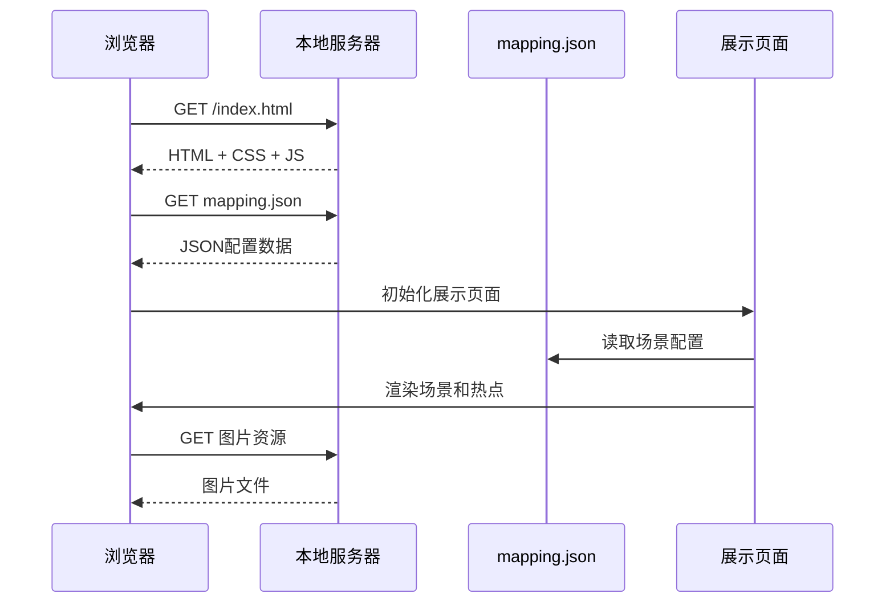
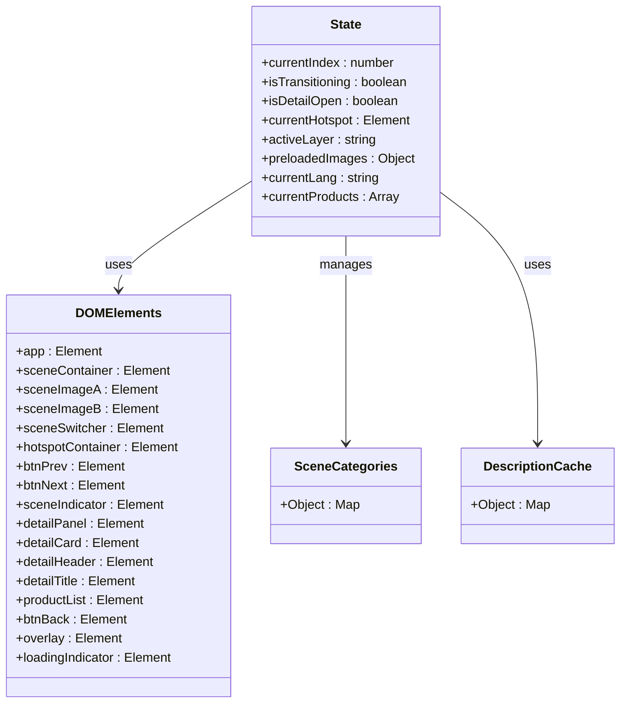
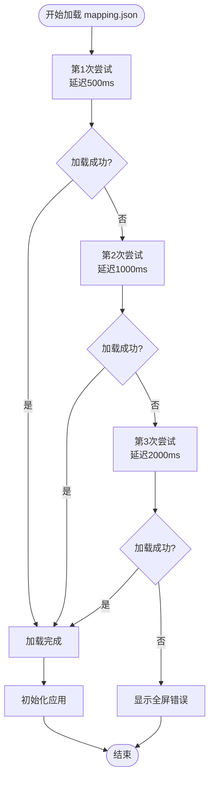
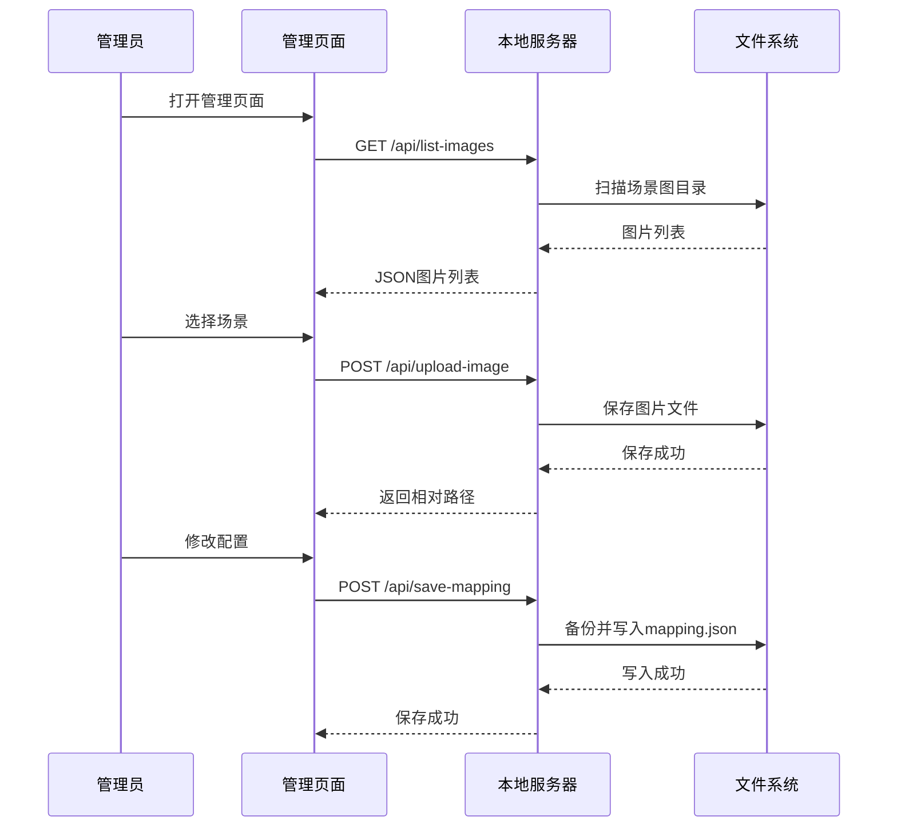
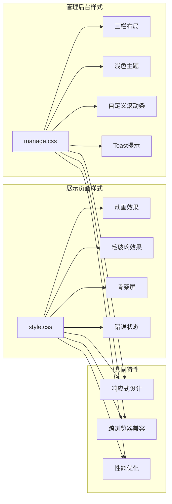
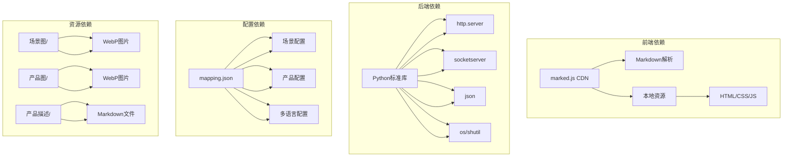
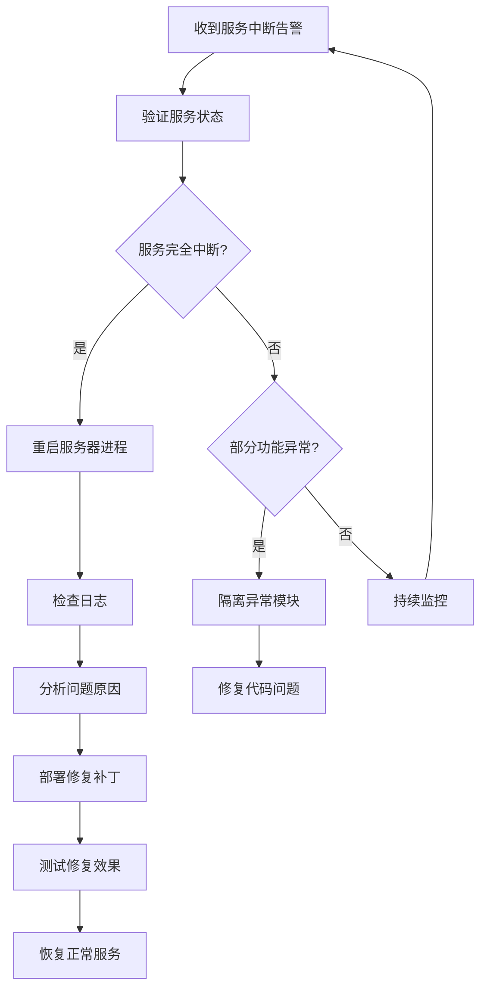
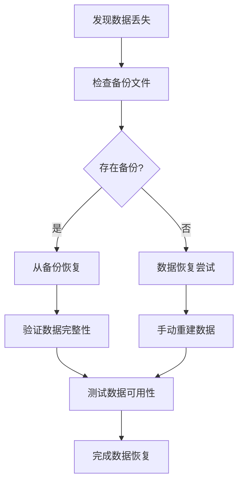
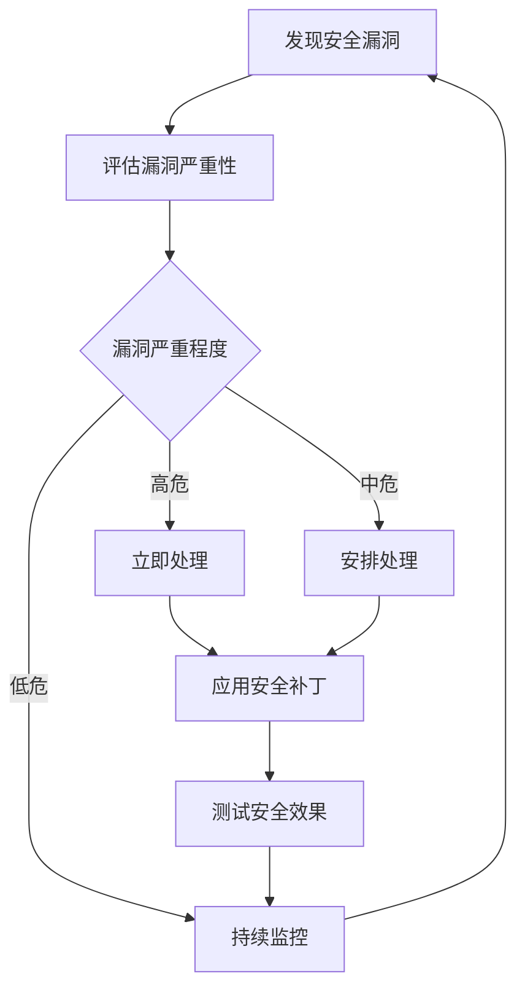
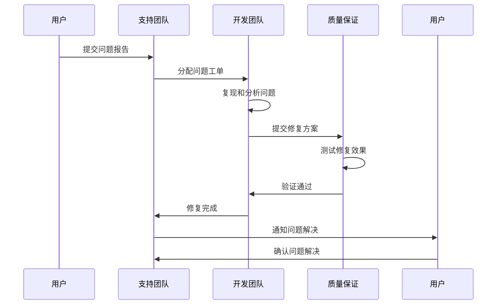

# 故障排除

<cite>
**本文引用的文件**
- [index.html](file://index.html)
- [manage.html](file://manage.html)
- [main.js](file://js/main.js)
- [manage.js](file://js/manage.js)
- [style.css](file://css/style.css)
- [manage.css](file://css/manage.css)
- [mapping.json](file://mapping.json)
- [project_architecture.md](file://project_architecture.md)
- [启动服务器.py](file://启动服务器.py)
</cite>

## 目录
1. [简介](#简介)
2. [项目结构](#项目结构)
3. [核心组件](#核心组件)
4. [架构总览](#架构总览)
5. [详细组件分析](#详细组件分析)
6. [依赖关系分析](#依赖关系分析)
7. [性能考虑](#性能考虑)
8. [故障排除指南](#故障排除指南)
9. [结论](#结论)
10. [附录](#附录)

## 简介
本指南针对数字标牌产品展示项目提供全面的故障排除方案。该项目包含展示页面和管理后台两个主要部分，支持中日文双语切换、场景化展示、热点交互以及可视化配置管理。本文档涵盖页面加载问题、图片显示异常、功能不可用、性能问题、网络相关问题、浏览器兼容性问题、开发环境问题以及生产环境应急处理等内容。

## 项目结构
项目采用前后端分离的静态资源架构，包含HTML页面、CSS样式、JavaScript逻辑、配置文件和本地开发服务器：

```mermaid
graph TB
subgraph "前端资源"
A[index.html] --> B[js/main.js]
C[manage.html] --> D[js/manage.js]
E[style.css] --> F[展示页面样式]
G[manage.css] --> H[管理后台样式]
I[mapping.json] --> J[数据配置]
end
subgraph "后端服务"
K[启动服务器.py] --> L[静态文件服务]
K --> M[API端点]
M --> N[/api/save-mapping]
M --> O[/api/upload-image]
M --> P[/api/list-images]
M --> Q[/api/list-descriptions]
end
subgraph "资源目录"
R[场景图/] --> S[场景图片]
T[产品图/] --> U[产品图片]
V[产品描述/] --> W[Markdown描述]
end
A --> R
A --> T
A --> V
C --> R
C --> T
C --> V
```

**图表来源**
- [project_architecture.md:43-108](file://project_architecture.md#L43-L108)
- [启动服务器.py:25-252](file://启动服务器.py#L25-L252)

**章节来源**
- [project_architecture.md:43-108](file://project_architecture.md#L43-L108)
- [启动服务器.py:17-298](file://启动服务器.py#L17-L298)

## 核心组件
项目包含四个核心组件：展示页面、管理后台、数据配置和本地服务器。

### 展示页面组件
- **HTML结构**：包含场景容器、热点容器、导航按钮、详情面板等
- **JavaScript逻辑**：数据加载、多语言处理、图片预加载、场景切换、热点交互
- **CSS样式**：动画效果、毛玻璃效果、骨架屏、错误状态样式

### 管理后台组件
- **HTML结构**：三栏布局，包含场景列表、编辑区、产品编辑器
- **JavaScript逻辑**：可视化编辑、文件上传、配置保存、拖拽交互
- **CSS样式**：浅色主题、自定义滚动条、Toast提示

### 数据配置组件
- **mapping.json**：存储场景、产品、多语言配置
- **数据结构**：场景对象、热点对象、产品对象、多语言字典

### 本地服务器组件
- **Python HTTP服务器**：静态文件服务 + API端点
- **API端点**：配置保存、图片上传、文件列表查询

**章节来源**
- [project_architecture.md:446-708](file://project_architecture.md#L446-L708)
- [index.html:1-83](file://index.html#L1-L83)
- [manage.html:1-113](file://manage.html#L1-L113)

## 架构总览
项目采用模块化架构，各组件职责明确：



**图表来源**
- [project_architecture.md:521-542](file://project_architecture.md#L521-L542)
- [启动服务器.py:54-63](file://启动服务器.py#L54-L63)

## 详细组件分析

### 展示页面核心逻辑分析
展示页面采用模块化设计，包含11个主要模块：



**图表来源**
- [main.js:195-235](file://main.js#L195-L235)
- [main.js:169-188](file://main.js#L169-L188)
- [main.js:211-229](file://main.js#L211-L229)
- [main.js:235](file://main.js#L235)

#### 数据加载机制
展示页面采用重试机制确保数据加载稳定性：



**图表来源**
- [main.js:49-73](file://main.js#L49-L73)
- [main.js:524-542](file://main.js#L524-L542)

**章节来源**
- [main.js:29-73](file://main.js#L29-L73)
- [main.js:446-501](file://main.js#L446-L501)

### 管理后台核心逻辑分析
管理后台提供完整的可视化编辑功能：



**图表来源**
- [manage.js:35-46](file://manage.js#L35-L46)
- [manage.js:763-781](file://manage.js#L763-L781)
- [启动服务器.py:101-127](file://启动服务器.py#L101-L127)

**章节来源**
- [manage.js:33-72](file://manage.js#L33-L72)
- [manage.js:649-728](file://manage.js#L649-L728)

### 样式系统分析
项目采用两套样式系统，分别服务于展示页面和管理后台：



**图表来源**
- [style.css:1-800](file://style.css#L1-L800)
- [manage.css:1-800](file://manage.css#L1-L800)

**章节来源**
- [style.css:1-800](file://style.css#L1-L800)
- [manage.css:1-800](file://manage.css#L1-L800)

## 依赖关系分析
项目依赖关系清晰，主要依赖包括：



**图表来源**
- [project_architecture.md:29-37](file://project_architecture.md#L29-L37)
- [index.html:10](file://index.html#L10)

**章节来源**
- [project_architecture.md:29-37](file://project_architecture.md#L29-L37)
- [index.html:10](file://index.html#L10)

## 性能考虑
项目在性能方面采用了多项优化策略：

### 图片加载优化
- **预加载机制**：首屏完成后并行预加载所有图片资源
- **缓存策略**：使用预加载缓存避免重复下载
- **超时保护**：图片加载超时保护机制
- **渐进式显示**：骨架屏配合图片加载进度

### 动画性能优化
- **硬件加速**：使用CSS3硬件加速属性
- **时间函数**：精心设计的缓动函数
- **最小化重排**：避免频繁的DOM重排
- **requestAnimationFrame**：优化动画帧率

### 内存管理
- **事件监听器清理**：使用一次性监听器避免内存泄漏
- **DOM节点复用**：热点和产品列表的动态创建和销毁
- **缓存管理**：描述文件缓存的LRU策略

**章节来源**
- [main.js:257-327](file://main.js#L257-L327)
- [main.js:354-395](file://main.js#L354-L395)
- [style.css:381-396](file://style.css#L381-L396)

## 故障排除指南

### 页面无法加载问题

#### 1. mapping.json加载失败
**症状表现**：
- 页面显示全屏错误提示
- 控制台出现网络错误
- 页面空白或加载失败

**诊断步骤**：
1. 检查网络连接状态
2. 验证mapping.json文件完整性
3. 检查服务器端口占用情况
4. 查看浏览器开发者工具Network面板

**解决方案**：
```javascript
// 重试机制（最多3次）
async function loadMapping() {
    const maxRetries = 3;
    const delays = [500, 1000, 2000];
    for (let attempt = 0; attempt <= maxRetries; attempt++) {
        try {
            const response = await fetch('mapping.json');
            if (!response.ok) {
                throw new Error(`HTTP ${response.status}`);
            }
            return await response.json();
        } catch (error) {
            if (attempt < maxRetries) {
                await new Promise(resolve => setTimeout(resolve, delays[attempt]));
            } else {
                throw error;
            }
        }
    }
}
```

**预防措施**：
- 确保mapping.json文件格式正确
- 验证文件编码为UTF-8
- 检查文件权限设置
- 使用版本控制系统管理配置文件

**章节来源**
- [main.js:49-73](file://main.js#L49-L73)
- [main.js:524-542](file://main.js#L524-L542)

#### 2. 静态资源加载失败
**症状表现**：
- 图片无法显示
- 样式加载异常
- 脚本执行错误

**诊断步骤**：
1. 检查资源路径是否正确
2. 验证文件是否存在
3. 检查文件扩展名
4. 确认文件编码格式

**解决方案**：
- 验证场景图路径：`场景图/场景名/场景图.webp`
- 验证产品图路径：`产品图/产品图.webp`
- 验证描述文件路径：`产品描述/产品描述.md`

**预防措施**：
- 使用相对路径而非绝对路径
- 确保文件命名规范
- 定期检查文件完整性

### 图片显示异常问题

#### 1. 图片加载缓慢
**症状表现**：
- 图片长时间加载
- 首屏显示延迟
- 用户体验差

**诊断步骤**：
1. 检查图片文件大小
2. 验证图片格式兼容性
3. 分析网络带宽情况
4. 检查CDN连接状态

**解决方案**：
```javascript
// 图片预加载机制
function preloadAllImages() {
    const imagePaths = new Set();
    
    // 收集所有图片路径
    mappingData.scenes.forEach(scene => {
        imagePaths.add(scene.image);
        scene.hotspots.forEach(hotspot => {
            hotspot.products.forEach(product => {
                imagePaths.add(product.image);
            });
        });
    });
    
    // 并行加载所有图片
    return Promise.all(Array.from(imagePaths).map(preloadOne)).then(() => {
        console.log(`图片预加载完成: ${loaded}/${total} 张`);
        return loaded;
    });
}

// 单张图片重试加载
function preloadOne(src, retries = 2) {
    return new Promise((resolve) => {
        const img = new Image();
        img.onload = () => {
            state.preloadedImages[src] = img;
            loaded++;
            resolve();
        };
        img.onerror = () => {
            if (attempt < retries) {
                setTimeout(() => tryLoad(attempt + 1), 500 * (attempt + 1));
            } else {
                console.warn(`图片预加载失败（${retries + 1} 次尝试）: ${src}`);
                resolve();
            }
        };
        img.src = src;
    });
}
```

**预防措施**：
- 使用WebP格式优化图片体积
- 合理设置图片分辨率
- 实施懒加载策略
- 建立图片缓存机制

**章节来源**
- [main.js:257-327](file://main.js#L257-L327)
- [main.js:285-320](file://main.js#L285-L320)

#### 2. 图片显示错位
**症状表现**：
- 热点位置不准确
- 图片裁剪异常
- 布局变形

**诊断步骤**：
1. 检查图片自然宽度
2. 验证object-fit属性
3. 分析容器尺寸变化
4. 检查CSS样式冲突

**解决方案**：
```javascript
// 热点位置计算
function calcHotspotPixelPosition(position) {
    const activeImg = state.activeLayer === 'a' ? dom.sceneImageA : dom.sceneImageB;
    const containerW = window.innerWidth;
    const containerH = window.innerHeight;

    // 确认图片已完全加载
    if (!activeImg.complete || activeImg.naturalWidth === 0) {
        console.warn('图片未加载，热点计算跳过');
        return { x: containerW / 2, y: containerH / 2 };
    }

    const imgW = activeImg.naturalWidth;
    const imgH = activeImg.naturalHeight;

    // 计算object-fit: cover下的实际绘制区域
    const imgAspect = imgW / imgH;
    const containerAspect = containerW / containerH;

    let renderedW, renderedH, cropOffsetX, cropOffsetY;

    if (imgAspect > containerAspect) {
        // 图片更宽：上下适配，左右裁切
        renderedH = containerH;
        renderedW = containerH * imgAspect;
        cropOffsetX = (renderedW - containerW) / 2;
        cropOffsetY = 0;
    } else {
        // 图片更高：左右适配，上下裁切
        renderedW = containerW;
        renderedH = containerW / imgAspect;
        cropOffsetX = 0;
        cropOffsetY = (renderedH - containerH) / 2;
    }

    // 计算像素坐标
    const x = ((position.x / 100) * renderedW) - cropOffsetX;
    const y = ((position.y / 100) * renderedH) - cropOffsetY;

    return { x, y };
}
```

**预防措施**：
- 确保图片加载完成后再计算位置
- 验证图片尺寸比例
- 实施响应式布局适配
- 建立图片质量检查机制

**章节来源**
- [main.js:774-806](file://main.js#L774-L806)
- [main.js:716-759](file://main.js#L716-L759)

### 功能无法使用问题

#### 1. 热点点击无响应
**症状表现**：
- 点击热点无反应
- 详情面板不显示
- 交互功能失效

**诊断步骤**：
1. 检查热点DOM元素
2. 验证事件绑定状态
3. 分析CSS定位属性
4. 检查z-index层级

**解决方案**：
```javascript
// 热点点击处理
function onHotspotClick(hotspotEl, products, categoryName) {
    if (state.isDetailOpen || state.isTransitioning) return;
    
    state.isDetailOpen = true;
    state.currentProducts = products;
    
    // 设置弹窗标题
    dom.detailTitle.textContent = categoryName;
    
    // 渲染产品列表
    renderProductList(products);
    
    // 背景淡化
    dom.sceneContainer.classList.add('dimmed');
    
    // 显示遮罩层
    dom.overlay.classList.add('visible');
    
    // 隐藏其他UI元素
    hideNavigationElements();
    
    // 显示详情面板
    setTimeout(() => {
        dom.detailPanel.classList.add('visible');
    }, 200);
}
```

**预防措施**：
- 确保热点元素可见性
- 验证事件监听器绑定
- 检查CSS交互属性
- 实施功能状态检查

**章节来源**
- [main.js:752-755](file://main.js#L752-L755)
- [main.js:873-925](file://main.js#L873-L925)

#### 2. 场景切换异常
**症状表现**：
- 场景切换卡顿
- 切换动画失效
- 导航按钮无响应

**诊断步骤**：
1. 检查切换锁状态
2. 验证图片加载状态
3. 分析CSS过渡效果
4. 检查事件处理逻辑

**解决方案**：
```javascript
// 场景切换机制
function renderScene(index, animate = true) {
    const scene = mappingData.scenes[index];
    if (!scene) return;

    if (animate) {
        // 交叉淡入淡出
        const currentImg = state.activeLayer === 'a' ? dom.sceneImageA : dom.sceneImageB;
        const nextImg = state.activeLayer === 'a' ? dom.sceneImageB : dom.sceneImageA;

        // 先隐藏热点和切换器
        dom.hotspotContainer.style.opacity = '0';
        dom.sceneSwitcher.style.opacity = '0';

        // 设置新图片
        nextImg.removeAttribute('src');
        nextImg.src = scene.image;

        // 等待图片加载完成
        const loadSuccess = await waitForImageLoad(nextImg, 15000);

        // 切换activeLayer标记
        state.activeLayer = state.activeLayer === 'a' ? 'b' : 'a';

        // 交叉淡入淡出
        nextImg.classList.add('active');
        nextImg.classList.remove('inactive');
        currentImg.classList.remove('active');
        currentImg.classList.add('inactive');

        // 更新指示器和分类切换器
        updateIndicator(index);
        updateSwitcher(categoryName);

        // 仅在图片加载成功时渲染热点
        if (loadSuccess || actuallyLoaded) {
            requestAnimationFrame(() => {
                renderHotspots(scene.hotspots);
                dom.hotspotContainer.style.opacity = '1';
                dom.sceneSwitcher.style.opacity = '1';
            });
        }
    }
}
```

**预防措施**：
- 实施切换状态锁机制
- 确保图片加载完成
- 优化动画性能
- 建立错误处理机制

**章节来源**
- [main.js:480-595](file://main.js#L480-L595)
- [main.js:598-624](file://main.js#L598-L624)

### 性能问题诊断

#### 1. 页面卡顿问题
**症状表现**：
- 场景切换延迟
- 热点交互响应慢
- 动画播放不流畅

**诊断步骤**：
1. 使用浏览器性能分析工具
2. 检查CPU使用率
3. 分析内存占用情况
4. 监控网络请求

**解决方案**：
```javascript
// 性能优化策略
const performanceConfig = {
    // 图片预加载并发数限制
    maxConcurrentLoads: 6,
    
    // 动画帧率优化
    animationFrameRate: 60,
    
    // 缓存策略
    cacheSizeLimit: 100,
    
    // 超时保护
    loadTimeout: 8000,
    
    // 重试机制
    maxRetryAttempts: 3
};

// 内存泄漏防护
function cleanupEventListeners() {
    // 清理一次性事件监听器
    const listeners = ['load', 'error', 'abort'];
    listeners.forEach(eventType => {
        const elements = document.querySelectorAll(`*[data-${eventType}-listener]`);
        elements.forEach(element => {
            element.removeEventListener(eventType, handler);
            element.removeAttribute(`data-${eventType}-listener`);
        });
    });
}
```

**预防措施**：
- 实施性能监控
- 优化图片资源
- 减少DOM操作
- 使用虚拟滚动

#### 2. 加载缓慢问题
**症状表现**：
- 首屏加载时间长
- 资源加载阻塞
- 用户等待时间过长

**诊断步骤**：
1. 分析资源加载顺序
2. 检查网络请求时间
3. 评估服务器响应速度
4. 监控CDN性能

**解决方案**：
```javascript
// 首屏优化策略
function optimizeFirstScreen() {
    // 首屏独占带宽策略
    const firstScreenImages = [mappingData.scenes[0].image];
    
    // 立即加载首屏图片
    firstScreenImages.forEach(src => {
        const img = new Image();
        img.src = src;
    });
    
    // 首屏加载完成后启动其他资源
    setTimeout(() => {
        preloadAllImages();
    }, 3000);
}

// 资源压缩优化
function compressResources() {
    // WebP格式优先
    const webpSupport = detectWebPSupport();
    
    // 动态选择图片格式
    mappingData.scenes.forEach(scene => {
        if (webpSupport) {
            scene.image = scene.image.replace('.jpg', '.webp').replace('.png', '.webp');
        }
    });
}
```

**预防措施**：
- 实施资源压缩
- 使用CDN加速
- 启用HTTP缓存
- 优化图片格式

**章节来源**
- [main.js:257-327](file://main.js#L257-L327)
- [main.js:354-395](file://main.js#L354-L395)

### 网络相关问题

#### 1. API调用失败
**症状表现**：
- 配置保存失败
- 图片上传错误
- 文件列表获取异常

**诊断步骤**：
1. 检查API端点状态
2. 验证请求格式
3. 分析服务器响应
4. 检查CORS配置

**解决方案**：
```python
# API错误处理机制
def _handle_api_post(self, path):
    try:
        if path == '/api/save-mapping':
            self._api_save_mapping()
        elif path == '/api/upload-image':
            self._api_upload_image()
        else:
            self._send_error_json("未知的 API 路径: " + path, 404)
    except Exception as e:
        self._send_error_json(str(e))

# CORS配置
def _set_cors_headers(self):
    self.send_header('Access-Control-Allow-Origin', '*')
    self.send_header('Access-Control-Allow-Methods', 'GET, POST, OPTIONS')
    self.send_header('Access-Control-Allow-Headers', 'Content-Type')
```

**预防措施**：
- 实施API重试机制
- 验证请求参数
- 监控服务器状态
- 建立错误日志

**章节来源**
- [启动服务器.py:87-97](file://启动服务器.py#L87-L97)
- [启动服务器.py:28-33](file://启动服务器.py#L28-L33)

#### 2. 文件上传错误
**症状表现**：
- 上传进度卡住
- 文件保存失败
- 服务器响应超时

**诊断步骤**：
1. 检查文件大小限制
2. 验证文件类型
3. 分析上传路径
4. 检查服务器权限

**解决方案**：
```python
# 文件上传处理
def _api_upload_image(self):
    # 解析multipart/form-data
    content_type = self.headers.get('Content-Type', '')
    
    # 验证请求格式
    if 'multipart/form-data' not in content_type:
        self._send_error_json("请求必须是 multipart/form-data 格式", 400)
        return

    # 获取表单字段
    file_item = form['file']
    upload_type = form.getvalue('type', '')
    category = form.getvalue('category', '')
    filename = form.getvalue('filename', '')

    # 验证必需参数
    if not upload_type:
        self._send_error_json("缺少 type 参数", 400)
        return

    # 确定保存目录
    if upload_type == 'scene':
        if not category:
            self._send_error_json("上传场景图片时必须提供 category 参数", 400)
            return
        save_dir = os.path.join(PROJECT_ROOT, '场景图', category)
    elif upload_type == 'product':
        save_dir = os.path.join(PROJECT_ROOT, '产品图')
    else:
        self._send_error_json("type 参数必须是 scene 或 product", 400)
        return

    # 创建目录
    os.makedirs(save_dir, exist_ok=True)

    # 保存文件
    save_path = os.path.join(save_dir, filename)
    with open(save_path, 'wb') as f:
        while True:
            chunk = file_item.file.read(8192)
            if not chunk:
                break
            f.write(chunk)

    # 返回相对路径
    relative_path = os.path.relpath(save_path, PROJECT_ROOT)
    relative_path = relative_path.replace(os.sep, '/')
    
    self._send_json_response({"success": True, "path": relative_path})
```

**预防措施**：
- 实施文件大小限制
- 验证文件类型
- 建立上传进度反馈
- 监控磁盘空间

**章节来源**
- [启动服务器.py:129-202](file://启动服务器.py#L129-L202)

### 浏览器兼容性问题

#### 1. CSS兼容性问题
**症状表现**：
- 毛玻璃效果不显示
- 动画效果异常
- 响应式布局失效

**诊断步骤**：
1. 检查浏览器版本
2. 验证CSS属性支持
3. 分析polyfill需求
4. 测试不同设备

**解决方案**：
```css
/* 毛玻璃效果兼容性处理 */
#lang-switcher {
    background: rgba(0, 0, 255, 0.3); /* 降级颜色 */
    backdrop-filter: blur(10px); /* 现代浏览器 */
    -webkit-backdrop-filter: blur(10px); /* Safari */
    border: 1px solid rgba(255, 255, 255, 0.12);
}

/* 动画兼容性处理 */
.hotspot-core {
    animation: core-pulse 2s ease-in-out infinite;
    -webkit-animation: core-pulse 2s ease-in-out infinite; /* Safari */
}

/* 响应式布局兼容性 */
@media screen and (max-width: 768px) {
    #scene-container {
        width: 100%;
        height: 100%;
    }
    
    .scene-layer {
        object-fit: contain; /* 移动端适配 */
    }
}
```

**预防措施**：
- 使用CSS前缀兼容
- 实施渐进增强
- 建立兼容性测试
- 监控浏览器使用统计

#### 2. JavaScript兼容性问题
**症状表现**：
- Promise不支持
- fetch API不兼容
- ES6语法报错

**诊断步骤**：
1. 检查浏览器ES6支持
2. 验证fetch API兼容性
3. 分析polyfill需求
4. 测试不同版本

**解决方案**：
```javascript
// Promise兼容性处理
if (typeof Promise === 'undefined') {
    // 加载polyfill
    const script = document.createElement('script');
    script.src = 'https://cdn.jsdelivr.net/npm/es6-promise@4/dist/es6-promise.auto.min.js';
    document.head.appendChild(script);
}

// fetch API兼容性处理
if (typeof fetch === 'undefined') {
    // 加载polyfill
    const script = document.createElement('script');
    script.src = 'https://cdn.jsdelivr.net/npm/whatwg-fetch@3.0.0/dist/fetch.umd.min.js';
    document.head.appendChild(script);
}

// ES6语法兼容性
const state = {
    // 使用var替代let/const
    currentIndex: 0,
    isTransitioning: false
};

// 使用传统函数表达式
function loadMapping() {
    // 实现逻辑
}
```

**预防措施**：
- 使用Babel转译
- 实施polyfill策略
- 建立兼容性测试
- 监控用户浏览器分布

**章节来源**
- [style.css:36-80](file://style.css#L36-L80)
- [main.js:450-461](file://main.js#L450-L461)

### 开发环境问题

#### 1. 本地服务器启动失败
**症状表现**：
- 服务器无法启动
- 端口被占用
- 浏览器无法访问

**诊断步骤**：
1. 检查Python环境
2. 验证端口可用性
3. 分析防火墙设置
4. 检查文件权限

**解决方案**：
```python
# 端口检测和分配
def find_available_port(start_port):
    port = start_port
    while port < start_port + 100:
        try:
            with socketserver.TCPServer(("", port), APIHandler) as test_server:
                return port
        except OSError:
            port += 1
    return start_port

# 服务器启动流程
def main():
    # 查找可用端口
    port = find_available_port(PORT)
    
    with socketserver.TCPServer(("", port), APIHandler) as httpd:
        url = f"http://localhost:{port}/index.html"
        
        # 自动打开浏览器
        webbrowser.open(url)
        
        # 启动服务器
        try:
            httpd.serve_forever()
        except KeyboardInterrupt:
            print("\n服务器已停止")
```

**预防措施**：
- 预留端口范围
- 实施端口冲突检测
- 建立服务器监控
- 配置自动重启机制

**章节来源**
- [启动服务器.py:254-263](file://启动服务器.py#L254-L263)
- [启动服务器.py:266-298](file://启动服务器.py#L266-L298)

#### 2. 文件权限问题
**症状表现**：
- 配置文件无法保存
- 图片上传失败
- 目录创建异常

**诊断步骤**：
1. 检查文件系统权限
2. 验证目录写入权限
3. 分析用户账户权限
4. 检查磁盘空间

**解决方案**：
```python
# 权限检查和处理
def check_permissions():
    # 检查mapping.json权限
    mapping_path = os.path.join(PROJECT_ROOT, 'mapping.json')
    if not os.access(mapping_path, os.W_OK):
        # 尝试获取写权限
        try:
            os.chmod(mapping_path, 0o644)
        except OSError:
            print("警告: 无法修改文件权限")
    
    # 检查场景图目录权限
    scenes_dir = os.path.join(PROJECT_ROOT, '场景图')
    if not os.path.exists(scenes_dir):
        os.makedirs(scenes_dir, 0o755)
    elif not os.access(scenes_dir, os.W_OK):
        os.chmod(scenes_dir, 0o755)
```

**预防措施**：
- 预设文件权限
- 实施权限检查
- 建立权限监控
- 配置自动修复

### 生产环境应急处理

#### 1. 服务中断处理
**症状表现**：
- 页面无法访问
- API接口失效
- 数据库连接异常

**应急响应流程**：


**应急处理步骤**：
1. **立即响应**：确认服务状态，通知相关人员
2. **快速诊断**：检查服务器日志，分析错误类型
3. **隔离问题**：暂停异常功能，防止影响扩大
4. **紧急修复**：实施临时修复方案
5. **全面测试**：验证修复效果，确保无副作用
6. **恢复服务**：逐步恢复全部功能

**章节来源**
- [启动服务器.py:289-295](file://启动服务器.py#L289-L295)

#### 2. 数据丢失处理
**症状表现**：
- 配置文件损坏
- 图片资源缺失
- 用户数据异常

**应急响应流程**：


**应急处理步骤**：
1. **立即隔离**：停止写入操作，防止进一步损坏
2. **备份检查**：查找最近备份，验证备份完整性
3. **数据恢复**：从备份恢复数据，或尝试数据恢复工具
4. **完整性验证**：检查恢复数据的完整性和一致性
5. **功能测试**：验证恢复数据的功能正常性
6. **监控观察**：持续监控系统状态，预防再次发生

**章节来源**
- [启动服务器.py:116-127](file://启动服务器.py#L116-L127)

#### 3. 安全漏洞处理
**症状表现**：
- 未授权访问
- 数据泄露风险
- 注入攻击迹象

**应急响应流程**：


**应急处理步骤**：
1. **立即响应**：隔离受影响系统，阻止攻击扩散
2. **漏洞评估**：分析漏洞类型、影响范围和攻击路径
3. **紧急修复**：应用安全补丁，修复配置缺陷
4. **访问控制**：加强身份验证，限制访问权限
5. **监控审计**：启用安全监控，记录可疑活动
6. **用户通知**：通知受影响用户，提供安全建议
7. **系统加固**：完善安全策略，提升整体防护水平

**章节来源**
- [启动服务器.py:28-33](file://启动服务器.py#L28-L33)

### 问题报告和反馈机制

#### 1. 用户问题报告
**报告渠道**：
- **在线反馈表单**：在页面底部提供问题反馈入口
- **邮件支持**：提供技术支持邮箱地址
- **GitHub Issues**：开源项目的Bug报告渠道
- **电话支持**：提供技术支持热线

**报告模板**：
```
问题标题：[简要描述问题]

详细描述：
- 问题现象：[具体症状描述]
- 操作步骤：[重现步骤]
- 预期结果：[期望行为]
- 实际结果：[实际行为]

环境信息：
- 浏览器类型和版本：
- 操作系统：
- 网络环境：
- 设备类型：

附加信息：
- 截图或视频链接：
- 相关日志片段：
- 其他相关信息：
```

#### 2. 开发团队响应流程


**响应时效**：
- **紧急问题**（系统崩溃）：2小时内响应，24小时内解决
- **高优先级**（功能异常）：8小时内响应，72小时内解决
- **中优先级**（性能问题）：24小时内响应，1周内解决
- **低优先级**（建议改进）：48小时内响应，根据计划安排

**章节来源**
- [project_architecture.md:763-781](file://project_architecture.md#L763-L781)

## 结论
本故障排除指南涵盖了数字标牌产品展示项目的主要问题类型和解决方案。项目采用模块化架构，具有良好的可维护性和扩展性。通过实施本文提供的诊断方法、解决方案和预防措施，可以有效提升系统的稳定性和用户体验。

关键要点包括：
- **预防为主**：建立完善的监控和测试体系
- **快速响应**：制定标准化的应急处理流程
- **持续改进**：定期回顾和优化系统架构
- **用户导向**：重视用户体验和反馈收集

建议团队定期进行系统健康检查，及时发现和解决问题，确保项目长期稳定运行。

## 附录

### 常见错误代码对照表
| 错误代码 | 错误类型 | 可能原因 | 解决方案 |
|---------|---------|---------|---------|
| 404 | 资源未找到 | 文件路径错误 | 检查文件路径，确认文件存在 |
| 400 | 请求错误 | 参数格式错误 | 验证请求格式，检查必填参数 |
| 500 | 服务器内部错误 | 服务器异常 | 检查服务器日志，重启服务 |
| 503 | 服务不可用 | 服务器过载 | 检查服务器负载，扩容资源 |

### 性能监控指标
- **页面加载时间**：< 3秒
- **首屏渲染时间**：< 2秒  
- **交互响应时间**：< 100ms
- **内存使用率**：< 80%
- **CPU使用率**：< 70%

### 维护检查清单
- [ ] 每日：检查服务器运行状态
- [ ] 每周：备份重要数据文件
- [ ] 每月：清理临时文件和缓存
- [ ] 每季度：更新依赖包和安全补丁
- [ ] 每年：进行全面系统检查和优化