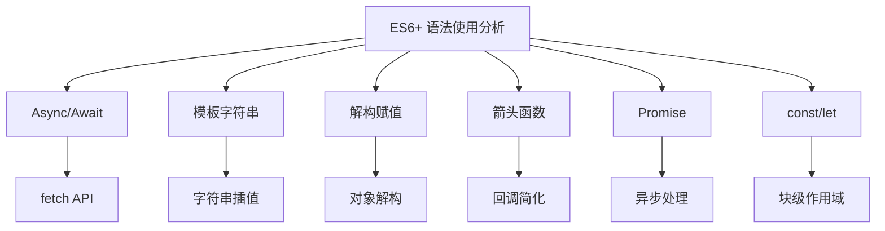
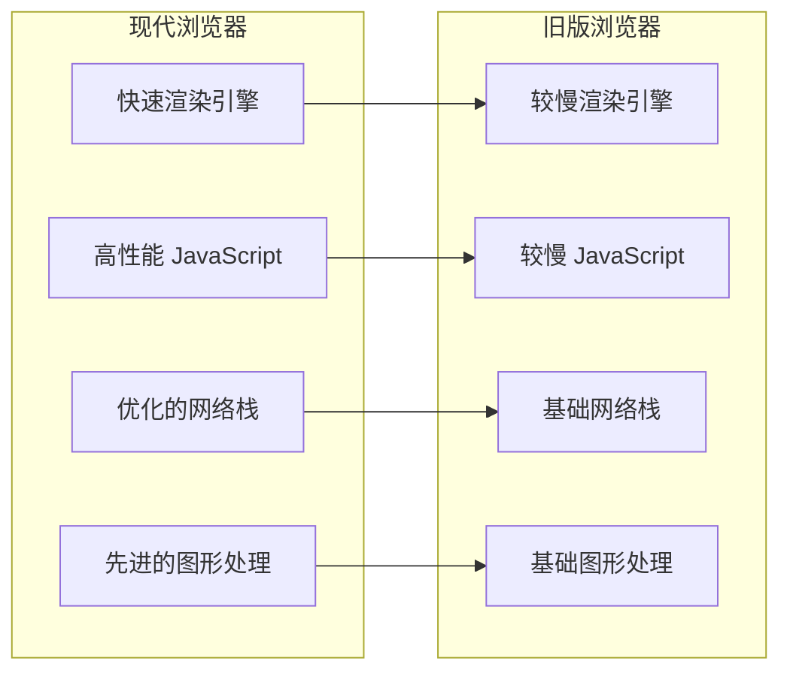
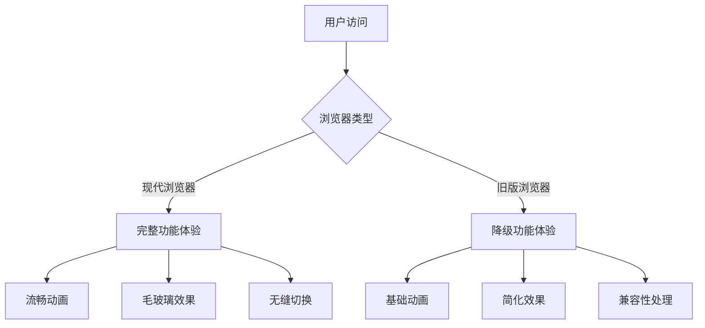
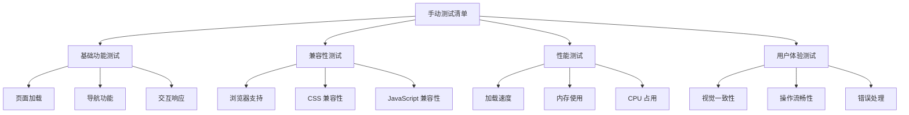

# 浏览器兼容性问题

<cite>
**本文档引用的文件**
- [index.html](file://index.html)
- [manage.html](file://manage.html)
- [main.js](file://js/main.js)
- [manage.js](file://js/manage.js)
- [style.css](file://css/style.css)
- [manage.css](file://css/manage.css)
- [mapping.json](file://mapping.json)
- [project_architecture.md](file://project_architecture.md)
- [启动服务器.py](file://启动服务器.py)
</cite>

## 目录
1. [简介](#简介)
2. [项目技术栈与兼容性要求](#项目技术栈与兼容性要求)
3. [核心浏览器兼容性问题分析](#核心浏览器兼容性问题分析)
4. [ES6+ 语法支持与降级方案](#es6-语法支持与降级方案)
5. [CSS 属性兼容性处理](#css-属性兼容性处理)
6. [API 可用性检查与降级](#api-可用性检查与降级)
7. [现代浏览器 vs 旧版浏览器功能差异](#现代浏览器-vs-旧版浏览器功能差异)
8. [浏览器特定问题与解决方案](#浏览器特定问题与解决方案)
9. [Polyfill 使用指南](#polyfill-使用指南)
10. [浏览器测试与调试最佳实践](#浏览器测试与调试最佳实践)
11. [故障排除指南](#故障排除指南)
12. [总结与建议](#总结与建议)

## 简介

数字标牌产品展示项目是一个基于原生 JavaScript 的现代化 Web 应用程序，支持中日文双语切换，提供丰富的交互体验。该项目在实现过程中需要考虑多种浏览器的兼容性问题，特别是现代浏览器与旧版浏览器之间的功能差异。

该项目的核心功能包括：
- 动态场景展示与切换
- 多语言支持（中日文）
- 热点交互与产品详情展示
- 管理后台的可视化编辑功能
- Markdown 内容渲染

## 项目技术栈与兼容性要求

### 技术栈概览

根据项目架构文档，本项目采用以下技术栈：

| 技术 | 版本/来源 | 用途 |
|------|----------|------|
| HTML5 | - | 页面结构 |
| CSS3 | - | 样式、动画、毛玻璃效果 |
| JavaScript (ES6+) | 原生，无框架 | 交互逻辑、DOM操作、异步加载 |
| marked.js | CDN `https://cdn.jsdelivr.net/npm/marked/marked.min.js` | Markdown→HTML解析 |
| Python HTTP Server | 内置 | 本地开发服务器 + API 端点 |

### 核心兼容性要求

项目的主要兼容性挑战来自于以下方面：

1. **JavaScript ES6+ 语法支持**
2. **现代 CSS 特性（Flexbox、Grid、动画）**
3. **Web API 兼容性（Fetch、Canvas、事件处理）**
4. **浏览器特定渲染差异**
5. **移动端触摸事件支持**

## 核心浏览器兼容性问题分析

### 1. JavaScript ES6+ 语法兼容性

项目大量使用了现代 JavaScript 语法特性，这些特性在不同浏览器中的支持程度存在显著差异。

#### 主要 ES6+ 特性使用情况



**图表来源**
- [main.js:49-73](file://js/main.js#L49-L73)
- [main.js:257-327](file://js/main.js#L257-L327)
- [manage.js:35-46](file://js/manage.js#L35-L46)

#### 兼容性矩阵

| 特性 | Chrome | Firefox | Safari | Edge | IE/旧版 |
|------|--------|---------|--------|------|---------|
| Async/Await | ✅ 43+ | ✅ 38+ | ✅ 10.1+ | ✅ 13+ | ❌ |
| Template Literals | ✅ 41+ | ✅ 34+ | ✅ 9+ | ✅ 12+ | ❌ |
| Arrow Functions | ✅ 45+ | ✅ 20+ | ✅ 10+ | ✅ 12+ | ❌ |
| Promise | ✅ 32+ | ✅ 29+ | ✅ 8+ | ✅ 14+ | ❌ |
| Fetch API | ✅ 42+ | ✅ 39+ | ✅ 10.1+ | ✅ 15+ | ❌ |
| const/let | ✅ 41+ | ✅ 34+ | ✅ 9+ | ✅ 12+ | ❌ |

### 2. CSS 现代特性兼容性

项目使用了大量现代 CSS 特性，这些特性在不同浏览器中的支持情况如下：

#### 关键 CSS 特性分析

```mermaid
graph TB
subgraph "CSS 现代特性"
A[Flexbox] --> A1[display: flex]
B[Grid Layout] --> B1[CSS Grid]
C[Animations] --> C1[@keyframes]
D[Transitions] --> D1[transition 属性]
E[Backdrop Filter] --> E1[backdrop-filter]
F[Object-Fit] --> F1[object-fit: cover]
G[Custom Properties] --> G1[:root 变量]
end
subgraph "兼容性等级"
H[✅ 完全支持]
I[⚠️ 部分支持]
J[❌ 不支持]
end
A -.-> H
B -.-> I
C -.-> H
D -.-> H
E -.-> I
F -.-> H
G -.-> I
```

**图表来源**
- [style.css:134-187](file://css/style.css#L134-L187)
- [style.css:319-433](file://css/style.css#L319-L433)
- [style.css:795-820](file://css/style.css#L795-L820)

#### CSS 特性兼容性矩阵

| 特性 | Chrome | Firefox | Safari | Edge | IE/旧版 |
|------|--------|---------|--------|------|---------|
| Flexbox | ✅ 21+ | ✅ 20+ | ✅ 9+ | ✅ 12+ | ⚠️ 10+ |
| CSS Grid | ✅ 57+ | ✅ 55+ | ✅ 10.1+ | ✅ 79+ | ❌ |
| Backdrop Filter | ✅ 79+ | ✅ 79+ | ✅ 12.1+ | ✅ 79+ | ❌ |
| object-fit | ✅ 79+ | ✅ 35+ | ✅ 10+ | ✅ 79+ | ❌ |
| @supports | ✅ 26+ | ✅ 29+ | ✅ 9+ | ✅ 12+ | ❌ |
| CSS Variables | ✅ 49+ | ✅ 31+ | ✅ 9.1+ | ✅ 15+ | ❌ |

## ES6+ 语法支持与降级方案

### 1. Async/Await 语法兼容性

项目广泛使用了 `async/await` 语法来处理异步操作，这是现代 JavaScript 的标准做法。

#### 当前实现分析

```javascript
// main.js 中的异步加载模式
async function loadMapping() {
    const maxRetries = 3;
    const delays = [500, 1000, 2000];
    
    for (let attempt = 0; attempt <= maxRetries; attempt++) {
        try {
            const response = await fetch('mapping.json');
            if (!response.ok) {
                throw new Error(`HTTP ${response.status}`);
            }
            const data = await response.json();
            return data;
        } catch (error) {
            if (attempt < maxRetries) {
                await new Promise(resolve => setTimeout(resolve, delays[attempt]));
            } else {
                throw error;
            }
        }
    }
}
```

**章节来源**
- [main.js:49-73](file://js/main.js#L49-L73)

#### 降级方案

对于不支持 `async/await` 的旧版浏览器，可以使用以下降级方案：

```javascript
// 降级后的同步处理
function loadMappingLegacy() {
    var maxRetries = 3;
    var delays = [500, 1000, 2000];
    var attempt = 0;
    
    function retry() {
        if (attempt > maxRetries) {
            throw new Error('加载失败');
        }
        
        fetch('mapping.json')
            .then(function(response) {
                if (!response.ok) {
                    throw new Error('HTTP ' + response.status);
                }
                return response.json();
            })
            .then(function(data) {
                // 处理成功
            })
            .catch(function(error) {
                if (attempt < maxRetries) {
                    attempt++;
                    setTimeout(retry, delays[attempt - 1]);
                } else {
                    throw error;
                }
            });
    }
    
    retry();
}
```

### 2. 模板字符串兼容性

项目使用了模板字符串来进行字符串插值，这在旧版浏览器中不被支持。

#### 当前实现

```javascript
// 使用模板字符串的代码
document.title = t('pageTitle') + ' - ' + t('companyName');
```

#### 降级方案

```javascript
// 使用传统字符串拼接
document.title = t('pageTitle') + ' - ' + t('companyName');
```

### 3. 解构赋值兼容性

项目使用了解构赋值来简化代码，这在旧版浏览器中需要特殊处理。

#### 当前实现

```javascript
// 解构赋值的使用
const { app, sceneContainer, sceneImageA } = dom;
```

#### 降级方案

```javascript
// 传统赋值方式
var app = dom.app;
var sceneContainer = dom.sceneContainer;
var sceneImageA = dom.sceneImageA;
```

### 4. 箭头函数兼容性

项目使用了箭头函数来简化回调函数的编写。

#### 当前实现

```javascript
// 箭头函数的使用
imgEl.addEventListener('load', onLoad, { once: true });
```

#### 降级方案

```javascript
// 使用传统函数表达式
imgEl.addEventListener('load', function onLoad() {
    // 处理逻辑
}, { once: true });
```

## CSS 属性兼容性处理

### 1. Flexbox 布局兼容性

项目大量使用了 Flexbox 布局来实现响应式设计。

#### 关键 Flexbox 使用

```css
/* 场景列表布局 */
#scene-list {
    display: flex;
    flex-direction: column;
    overflow-y: auto;
}

/* 场景信息编辑栏 */
#scene-info-bar {
    display: flex;
    align-items: center;
    gap: 16px;
    padding: 10px 16px;
    background: #ffffff;
    border-bottom: 1px solid #e2e8f0;
    flex-wrap: wrap;
}
```

**章节来源**
- [manage.css:133-169](file://css/manage.css#L133-L169)

#### 兼容性处理

对于不支持 Flexbox 的旧版浏览器，可以使用以下替代方案：

```css
/* Flexbox 降级方案 */
#scene-info-bar {
    display: -webkit-box;      /* iOS 6-, Safari 3.1-6 */
    display: -moz-box;         /* Firefox 19- (buggy) */
    display: -ms-flexbox;      /* IE 10 */
    display: -webkit-flex;     /* iOS 6.1+, Safari 6.0+ */
    display: flex;             /* Modern browsers */
    
    -webkit-flex-wrap: wrap;
    -ms-flex-wrap: wrap;
    flex-wrap: wrap;
}
```

### 2. Backdrop Filter 兼容性

项目使用了 `backdrop-filter` 属性来实现毛玻璃效果。

#### 当前实现

```css
/* 毛玻璃效果 */
#lang-switcher {
    background: rgba(0, 0, 0, 0.3);
    backdrop-filter: blur(10px);
    -webkit-backdrop-filter: blur(10px);
}
```

**章节来源**
- [style.css:36-51](file://css/style.css#L36-L51)

#### 兼容性处理

```css
/* Backdrop Filter 降级方案 */
#lang-switcher {
    background: rgba(0, 0, 0, 0.3);
    /* 旧版浏览器降级 */
    background: rgba(0, 0, 0, 0.2); /* 稍弱的透明度 */
    /* 旧版浏览器不使用模糊效果 */
}
```

### 3. CSS Grid 兼容性

项目中使用了 CSS Grid 来实现复杂的布局结构。

#### Grid 使用场景

```css
/* 产品列表布局（概念性使用） */
.product-list {
    display: grid;
    grid-template-columns: repeat(auto-fill, minmax(300px, 1fr));
    gap: 20px;
}
```

#### 兼容性处理

对于不支持 CSS Grid 的浏览器，可以使用 Flexbox 或传统布局：

```css
/* Grid 降级方案 */
.product-list {
    display: flex;
    flex-wrap: wrap;
    gap: 20px;
}

.product-item {
    flex: 1 1 calc(50% - 20px);
    min-width: 300px;
}
```

### 4. Animation 和 Transition 兼容性

项目使用了大量的 CSS 动画和过渡效果。

#### 关键动画使用

```css
/* 场景切换动画 */
.scene-layer {
    transition: opacity 1.2s cubic-bezier(0.4, 0, 0.2, 1);
}

/* 热点脉冲动画 */
.hotspot-core {
    animation: core-pulse 2s ease-in-out infinite;
}
```

**章节来源**
- [style.css:114-127](file://css/style.css#L114-L127)
- [style.css:358-373](file://css/style.css#L358-L373)

#### 兼容性处理

```css
/* 动画降级方案 */
.scene-layer {
    /* 基础过渡 */
    -webkit-transition: opacity 1.2s ease-in-out;
    -moz-transition: opacity 1.2s ease-in-out;
    -o-transition: opacity 1.2s ease-in-out;
    transition: opacity 1.2s ease-in-out;
}

.hotspot-core {
    /* 降级：禁用动画 */
    -webkit-animation: none;
    -moz-animation: none;
    -o-animation: none;
    animation: none;
}
```

## API 可用性检查与降级

### 1. Fetch API 兼容性

项目广泛使用了 Fetch API 来进行网络请求。

#### 当前实现

```javascript
// Fetch API 的使用
async function loadMapping() {
    const response = await fetch('mapping.json');
    const data = await response.json();
    return data;
}

async function saveMapping() {
    const resp = await fetch('/api/save-mapping', {
        method: 'POST',
        headers: { 'Content-Type': 'application/json' },
        body: JSON.stringify(mappingData, null, 2)
    });
}
```

**章节来源**
- [main.js:49-73](file://js/main.js#L49-L73)
- [manage.js:82-108](file://js/manage.js#L82-L108)

#### 兼容性检查与降级

```javascript
// Fetch API 兼容性检查
function checkFetchSupport() {
    return typeof fetch !== 'undefined' && 
           typeof Response !== 'undefined' && 
           typeof Request !== 'undefined';
}

// 降级方案：使用 XMLHttpRequest
function fetchWithXHR(url, options) {
    return new Promise(function(resolve, reject) {
        var xhr = new XMLHttpRequest();
        xhr.open(options.method || 'GET', url, true);
        
        // 设置请求头
        if (options.headers) {
            for (var header in options.headers) {
                xhr.setRequestHeader(header, options.headers[header]);
            }
        }
        
        xhr.onreadystatechange = function() {
            if (xhr.readyState === 4) {
                if (xhr.status >= 200 && xhr.status < 300) {
                    resolve({
                        ok: true,
                        status: xhr.status,
                        json: function() {
                            return Promise.resolve(JSON.parse(xhr.responseText));
                        }
                    });
                } else {
                    reject(new Error('HTTP ' + xhr.status));
                }
            }
        };
        
        xhr.onerror = function() {
            reject(new Error('Network Error'));
        };
        
        xhr.send(options.body);
    });
}

// 智能选择 API
function smartFetch(url, options) {
    if (checkFetchSupport()) {
        return fetch(url, options);
    } else {
        return fetchWithXHR(url, options);
    }
}
```

### 2. Canvas API 兼容性

项目中使用了 Canvas API 来处理图片和渲染。

#### Canvas 使用场景

```javascript
// Canvas API 的使用（概念性）
const canvas = document.createElement('canvas');
const ctx = canvas.getContext('2d');
```

#### 兼容性处理

```javascript
// Canvas 兼容性检查
function checkCanvasSupport() {
    var canvas = document.createElement('canvas');
    return !!(canvas.getContext && canvas.getContext('2d'));
}

// Canvas 降级方案
function createCanvasFallback() {
    // 降级：使用图片或 SVG 替代
    var fallback = document.createElement('div');
    fallback.className = 'canvas-fallback';
    fallback.innerHTML = 'Canvas not supported';
    return fallback;
}
```

### 3. 事件处理兼容性

项目使用了现代事件处理方式。

#### 当前实现

```javascript
// 现代事件处理
element.addEventListener('click', handler, { once: true });
```

#### 兼容性处理

```javascript
// 事件处理降级
function addEventListenerLegacy(element, event, handler, options) {
    if (options && options.once) {
        // 一次性事件处理
        var onceHandler = function() {
            element.removeEventListener(event, onceHandler);
            handler.apply(this, arguments);
        };
        element.addEventListener(event, onceHandler);
    } else {
        element.addEventListener(event, handler);
    }
}
```

## 现代浏览器 vs 旧版浏览器功能差异

### 1. 性能差异对比



### 2. 功能支持对比

| 功能 | 现代浏览器 | 旧版浏览器 | 备注 |
|------|------------|------------|------|
| ES6+ 语法 | ✅ 完全支持 | ❌ 不支持 | 需要转译或 Polyfill |
| Fetch API | ✅ 支持 | ❌ 不支持 | 需要 XHR 降级 |
| Flexbox | ✅ 支持 | ⚠️ 部分支持 | 需要前缀 |
| CSS Grid | ✅ 支持 | ❌ 不支持 | 需要 Flexbox 降级 |
| Backdrop Filter | ✅ 支持 | ❌ 不支持 | 需要降级方案 |
| Object-Fit | ✅ 支持 | ❌ 不支持 | 需要 JavaScript 解决方案 |

### 3. 用户体验差异



## 浏览器特定问题与解决方案

### 1. Chrome 浏览器问题

#### 图片缓存机制问题

**问题描述**：Chrome 的图片缓存机制可能导致某些情况下图片加载异常。

**解决方案**：
```javascript
// Chrome 特定的图片加载处理
function loadImageWithCacheFix(src) {
    // 添加时间戳避免缓存问题
    const cacheBuster = '?t=' + Date.now();
    const img = new Image();
    
    // 监听加载事件
    img.onload = function() {
        // 处理加载完成
    };
    
    img.onerror = function() {
        // 处理加载失败，重试机制
        setTimeout(() => {
            loadWithRetry(src + cacheBuster, 3);
        }, 1000);
    };
    
    img.src = src + cacheBuster;
}

// 重试机制
function loadWithRetry(src, maxRetries) {
    const img = new Image();
    let attempts = 0;
    
    function attemptLoad() {
        img.onload = function() {
            // 成功处理
        };
        
        img.onerror = function() {
            attempts++;
            if (attempts < maxRetries) {
                setTimeout(attemptLoad, 1000 * attempts);
            } else {
                // 最终失败处理
            }
        };
        
        img.src = src;
    }
    
    attemptLoad();
}
```

#### Chrome DevTools 调试

**调试技巧**：
- 使用 Performance 面板监控性能
- Network 面板检查资源加载
- Console 面板查看错误信息
- Elements 面板检查 DOM 结构

### 2. Firefox 浏览器问题

#### 字体渲染差异

**问题描述**：Firefox 的字体渲染与 Chrome 存在差异，可能导致布局问题。

**解决方案**：
```css
/* Firefox 特定的字体处理 */
@-moz-document url-prefix() {
    body {
        -webkit-font-smoothing: antialiased;
        -moz-osx-font-smoothing: grayscale;
    }
    
    .product-name {
        font-feature-settings: "kern" 1;
    }
}

/* 跨浏览器字体兼容 */
body {
    font-family: -apple-system, BlinkMacSystemFont, 'Segoe UI', 'Helvetica Neue', Arial, sans-serif;
    -webkit-font-smoothing: antialiased;
    -moz-osx-font-smoothing: grayscale;
}
```

#### Firefox 性能优化

**优化建议**：
- 使用 `will-change` 属性优化动画
- 合理使用 `transform` 和 `opacity` 进行硬件加速
- 避免频繁的布局计算

### 3. Safari 浏览器问题

#### 触摸事件处理

**问题描述**：Safari 的触摸事件处理与其他浏览器存在差异。

**解决方案**：
```javascript
// Safari 特定的触摸事件处理
function handleTouchEvents(element) {
    // 检测是否为 Safari
    const isSafari = /^((?!chrome|android).)*safari/i.test(navigator.userAgent);
    
    if (isSafari) {
        // Safari 特定处理
        element.addEventListener('touchstart', handleTouchStart, { passive: false });
        element.addEventListener('touchmove', handleTouchMove, { passive: false });
        element.addEventListener('touchend', handleTouchEnd, { passive: false });
    } else {
        // 标准处理
        element.addEventListener('touchstart', handleTouchStart);
        element.addEventListener('touchmove', handleTouchMove);
        element.addEventListener('touchend', handleTouchEnd);
    }
}

// 触摸事件处理函数
function handleTouchStart(e) {
    e.preventDefault();
    // 处理触摸开始
}

function handleTouchMove(e) {
    e.preventDefault();
    // 处理触摸移动
}

function handleTouchEnd(e) {
    e.preventDefault();
    // 处理触摸结束
}
```

#### Safari 性能优化

**优化建议**：
- 使用 `transform3d` 触发硬件加速
- 合理使用 `will-change` 属性
- 避免使用昂贵的 CSS 属性

### 4. Edge 浏览器问题

#### WebAssembly 兼容性

**问题描述**：Edge 浏览器对某些现代 Web 技术的支持有限。

**解决方案**：
```javascript
// Edge 兼容性检测
function checkEdgeCompatibility() {
    const userAgent = navigator.userAgent;
    const isEdge = userAgent.indexOf('Edg/') > -1;
    const isOldEdge = userAgent.indexOf('Edge/') > -1 && userAgent.indexOf('Edg/') === -1;
    
    return {
        isEdge: isEdge,
        isOldEdge: isOldEdge,
        modernEdge: isEdge && !isOldEdge
    };
}

// Edge 特定处理
function handleEdgeSpecific() {
    const edgeInfo = checkEdgeCompatibility();
    
    if (edgeInfo.isOldEdge) {
        // 旧版 Edge 处理
        document.body.classList.add('old-edge');
    } else if (edgeInfo.modernEdge) {
        // 现代 Edge 处理
        document.body.classList.add('modern-edge');
    }
}
```

## Polyfill 使用指南

### 1. Promise Polyfill

#### 使用场景

项目中使用了 Promise 来处理异步操作，需要确保在不支持的浏览器中正常工作。

#### 推荐 Polyfill

```html
<!-- 在 HTML 中引入 Promise Polyfill -->
<script src="https://cdn.jsdelivr.net/npm/es6-promise@4/dist/es6-promise.auto.min.js"></script>
```

#### 使用示例

```javascript
// Promise Polyfill 使用
if (!window.Promise) {
    // 加载 Polyfill
    loadScript('https://cdn.jsdelivr.net/npm/es6-promise@4/dist/es6-promise.auto.min.js', function() {
        // 初始化应用
        initializeApp();
    });
} else {
    // 直接初始化
    initializeApp();
}
```

### 2. Fetch API Polyfill

#### 使用场景

Fetch API 在旧版浏览器中不可用，需要使用 Polyfill。

#### 推荐 Polyfill

```html
<!-- Fetch API Polyfill -->
<script src="https://cdn.jsdelivr.net/npm/whatwg-fetch@3.6.2/dist/fetch.umd.min.js"></script>
```

#### 使用示例

```javascript
// 检测并加载 Fetch Polyfill
function loadFetchPolyfill() {
    return new Promise((resolve, reject) => {
        if (typeof fetch !== 'undefined') {
            resolve();
            return;
        }
        
        const script = document.createElement('script');
        script.src = 'https://cdn.jsdelivr.net/npm/whatwg-fetch@3.6.2/dist/fetch.umd.min.js';
        script.onload = resolve;
        script.onerror = reject;
        document.head.appendChild(script);
    });
}

// 使用 Fetch API
loadFetchPolyfill().then(() => {
    // 现在可以安全使用 fetch
    fetch('/api/data')
        .then(response => response.json())
        .then(data => console.log(data));
});
```

### 3. Object.assign Polyfill

#### 使用场景

项目中使用了 `Object.assign` 来合并对象。

#### Polyfill 方案

```javascript
// Object.assign Polyfill
if (typeof Object.assign !== 'function') {
    Object.defineProperty(Object, 'assign', {
        value: function(target) {
            if (target === null) {
                throw new TypeError('Cannot convert undefined or null to object');
            }
            
            const to = Object(target);
            
            for (let index = 1; index < arguments.length; index++) {
                const nextSource = arguments[index];
                if (nextSource !== null) {
                    for (let nextKey in nextSource) {
                        if (Object.prototype.hasOwnProperty.call(nextSource, nextKey)) {
                            to[nextKey] = nextSource[nextKey];
                        }
                    }
                }
            }
            
            return to;
        },
        writable: true,
        configurable: true
    });
}
```

### 4. Array.from Polyfill

#### 使用场景

项目中使用了 `Array.from` 来转换类数组对象。

#### Polyfill 方案

```javascript
// Array.from Polyfill
if (!Array.from) {
    Array.from = function(arrayLike) {
        return Array.prototype.slice.call(arrayLike);
    };
}
```

### 5. 全局 Polyfill 集成

#### 推荐的 Polyfill 集合

```html
<!-- 现代浏览器 Polyfill 集合 -->
<script src="https://polyfill.io/v3/polyfill.min.js?features=default"></script>

<!-- 或者手动加载特定 Polyfill -->
<script>
// Promise
if (!window.Promise) {
    document.write('<script src="https://cdn.jsdelivr.net/npm/es6-promise@4/dist/es6-promise.auto.min.js"><\/script>');
}

// Fetch
if (!window.fetch) {
    document.write('<script src="https://cdn.jsdelivr.net/npm/whatwg-fetch@3.6.2/dist/fetch.umd.min.js"><\/script>');
}

// Object.assign
if (!Object.assign) {
    document.write('<script>Object.assign=function(a){return Array.prototype.slice.call(arguments).reduce(function(a,b){for(var c in b)b.hasOwnProperty(c)&&(a[c]=b[c]);return a},a)}<\/script>');
}
</script>
```

## 浏览器测试与调试最佳实践

### 1. 自动化测试策略

#### 测试框架选择

```javascript
// 使用 Jest 进行单元测试
describe('Browser Compatibility Tests', () => {
    test('should support ES6 features', () => {
        expect(typeof Promise).toBe('function');
        expect(typeof fetch).toBe('function');
        expect(typeof Symbol).toBe('function');
    });
    
    test('should support modern CSS features', () => {
        const div = document.createElement('div');
        div.style.display = 'flex';
        expect(div.style.display).toBe('flex');
    });
});
```

#### CI/CD 集成

```yaml
# GitHub Actions 配置示例
name: Browser Compatibility Test

on: [push, pull_request]

jobs:
  test:
    runs-on: ubuntu-latest
    
    strategy:
      matrix:
        browser: [chrome, firefox, safari]
        version: [latest, previous]
    
    steps:
      - uses: actions/checkout@v2
      
      - name: Setup Node.js
        uses: actions/setup-node@v2
        with:
          node-version: '16.x'
          
      - name: Run tests
        run: npm test
        
      - name: Upload coverage
        uses: codecov/codecov-action@v1
```

### 2. 手动测试清单

#### 基础功能测试



#### 具体测试步骤

**Chrome 测试**：
1. 打开开发者工具
2. 检查 Console 是否有错误
3. 使用 Performance 面板检查性能
4. 检查 Network 面板的资源加载

**Firefox 测试**：
1. 打开 Web Console
2. 检查兼容性警告
3. 使用 Network Monitor 检查请求
4. 检查 Page Inspector 的布局

**Safari 测试**：
1. 打开 Develop 菜单
2. 检查 JavaScript 控制台
3. 使用 Timeline 检查性能
4. 检查 Elements 面板的样式

### 3. 调试工具推荐

#### 浏览器开发者工具

```javascript
// 调试辅助函数
function debugLog(message, data) {
    if (window.DEBUG_MODE) {
        console.log(`[DEBUG] ${message}`, data);
    }
}

// 性能监控
function performanceMonitor(operation, callback) {
    const start = performance.now();
    const result = callback();
    const end = performance.now();
    
    console.log(`${operation} took ${end - start} milliseconds`);
    return result;
}

// 兼容性检测
function detectBrowserCapabilities() {
    const capabilities = {
        es6: typeof Promise !== 'undefined',
        fetch: typeof fetch !== 'undefined',
        flexbox: CSS.supports('display', 'flex'),
        grid: CSS.supports('display', 'grid'),
        backdropFilter: CSS.supports('backdrop-filter', 'blur(10px)'),
        objectFit: CSS.supports('object-fit', 'cover')
    };
    
    return capabilities;
}
```

#### 在线测试工具

```html
<!-- 浏览器兼容性测试 -->
<div id="compatibility-test">
    <h3>浏览器兼容性测试</h3>
    <div id="test-results"></div>
</div>

<script>
function runCompatibilityTests() {
    const tests = [
        { name: 'ES6 Features', test: () => typeof Promise !== 'undefined' },
        { name: 'Fetch API', test: () => typeof fetch !== 'undefined' },
        { name: 'Flexbox', test: () => CSS.supports('display', 'flex') },
        { name: 'CSS Grid', test: () => CSS.supports('display', 'grid') },
        { name: 'Backdrop Filter', test: () => CSS.supports('backdrop-filter', 'blur(10px)') }
    ];
    
    const results = tests.map(test => ({
        name: test.name,
        supported: test.test(),
        status: test.test() ? '✅ 支持' : '❌ 不支持'
    }));
    
    displayResults(results);
}

function displayResults(results) {
    const container = document.getElementById('test-results');
    container.innerHTML = results.map(result => 
        `<div>${result.name}: ${result.status}</div>`
    ).join('');
}
</script>
```

## 故障排除指南

### 1. 常见兼容性问题诊断

#### 问题 1：页面空白或加载失败

**症状**：页面完全空白，控制台显示错误

**诊断步骤**：
1. 检查浏览器控制台错误
2. 确认 JavaScript 文件加载成功
3. 验证 ES6+ 语法支持

**解决方案**：
```javascript
// 检测并加载必要的 Polyfill
function checkAndLoadPolyfills() {
    const polyfills = [];
    
    // 检测 Promise
    if (!window.Promise) {
        polyfills.push('https://cdn.jsdelivr.net/npm/es6-promise@4/dist/es6-promise.auto.min.js');
    }
    
    // 检测 Fetch
    if (!window.fetch) {
        polyfills.push('https://cdn.jsdelivr.net/npm/whatwg-fetch@3.6.2/dist/fetch.umd.min.js');
    }
    
    // 动态加载 Polyfill
    if (polyfills.length > 0) {
        loadMultipleScripts(polyfills, function() {
            initializeApp();
        });
    } else {
        initializeApp();
    }
}

function loadMultipleScripts(scripts, callback) {
    let loaded = 0;
    
    scripts.forEach(function(scriptSrc) {
        const script = document.createElement('script');
        script.src = scriptSrc;
        script.onload = function() {
            loaded++;
            if (loaded === scripts.length) {
                callback();
            }
        };
        document.head.appendChild(script);
    });
}
```

#### 问题 2：样式显示异常

**症状**：页面布局错乱，样式不生效

**诊断步骤**：
1. 检查 CSS 文件加载
2. 验证 CSS 特性支持
3. 检查浏览器前缀需求

**解决方案**：
```css
/* CSS 兼容性处理示例 */
.scene-layer {
    /* 基础样式 */
    position: absolute;
    top: 0;
    left: 0;
    width: 100%;
    height: 100%;
    
    /* 现代浏览器 */
    object-fit: cover;
    
    /* 旧版浏览器降级 */
    -o-object-fit: fill;
    -webkit-object-fit: fill;
    object-fit: fill;
}

/* Flexbox 兼容性 */
.flex-container {
    /* 现代方式 */
    display: flex;
    
    /* 旧版方式 */
    display: -webkit-box;
    display: -moz-box;
    display: -ms-flexbox;
    display: -webkit-flex;
}
```

#### 问题 3：交互功能失效

**症状**：按钮点击无效，事件不响应

**诊断步骤**：
1. 检查事件绑定是否成功
2. 验证事件类型支持
3. 检查事件冒泡和捕获

**解决方案**：
```javascript
// 事件处理兼容性
function addEventCompat(element, event, handler, useCapture) {
    if (element.addEventListener) {
        // 现代浏览器
        element.addEventListener(event, handler, useCapture || false);
    } else if (element.attachEvent) {
        // IE8 及以下
        element.attachEvent('on' + event, handler);
    } else {
        // 降级方案
        element['on' + event] = handler;
    }
}

// 使用示例
addEventCompat(document.getElementById('btn-next'), 'click', function() {
    nextScene();
});
```

### 2. 性能问题诊断

#### 性能监控工具

```javascript
// 性能监控
class PerformanceMonitor {
    constructor() {
        this.metrics = {};
    }
    
    startMeasure(name) {
        if (performance.mark) {
            performance.mark(`start_${name}`);
        }
    }
    
    endMeasure(name) {
        if (performance.mark && performance.measure) {
            performance.mark(`end_${name}`);
            performance.measure(`measure_${name}`, `start_${name}`, `end_${name}`);
            
            const measures = performance.getEntriesByName(`measure_${name}`);
            if (measures.length > 0) {
                this.metrics[name] = measures[0].duration;
                console.log(`${name}: ${measures[0].duration}ms`);
            }
            
            // 清理标记
            performance.clearMarks(`start_${name}`);
            performance.clearMarks(`end_${name}`);
            performance.clearMeasures(`measure_${name}`);
        }
    }
    
    getMetrics() {
        return this.metrics;
    }
}

// 使用示例
const monitor = new PerformanceMonitor();
monitor.startMeasure('pageLoad');
// 页面加载逻辑
monitor.endMeasure('pageLoad');
```

#### 内存泄漏检测

```javascript
// 内存泄漏检测
function detectMemoryLeaks() {
    if (performance.memory) {
        const memory = performance.memory;
        console.log('Used Memory:', memory.usedJSHeapSize);
        console.log('Total Memory:', memory.totalJSHeapSize);
        console.log('Allocated Memory:', memory.allocationBase);
        
        // 检测内存增长
        if (memory.usedJSHeapSize > memory.totalJSHeapSize * 0.8) {
            console.warn('High memory usage detected');
        }
    }
}

// 定期检查
setInterval(detectMemoryLeaks, 5000);
```

### 3. 错误处理和恢复

#### 全局错误处理

```javascript
// 全局错误处理
window.addEventListener('error', function(event) {
    console.error('Global Error:', event.error);
    
    // 发送错误报告
    sendErrorReport({
        message: event.error.message,
        stack: event.error.stack,
        url: window.location.href,
        userAgent: navigator.userAgent,
        timestamp: Date.now()
    });
});

// Promise 错误处理
window.addEventListener('unhandledrejection', function(event) {
    console.error('Unhandled Promise Rejection:', event.reason);
    
    // 阻止默认的错误报告
    event.preventDefault();
    
    // 发送错误报告
    sendErrorReport({
        type: 'promise_rejection',
        reason: event.reason,
        url: window.location.href,
        timestamp: Date.now()
    });
});

// 错误报告发送
function sendErrorReport(errorData) {
    // 发送到服务器的逻辑
    if (navigator.sendBeacon) {
        const data = JSON.stringify(errorData);
        navigator.sendBeacon('/api/error-report', data);
    } else {
        // 降级方案
        fetch('/api/error-report', {
            method: 'POST',
            body: JSON.stringify(errorData),
            headers: { 'Content-Type': 'application/json' }
        });
    }
}
```

## 总结与建议

### 1. 兼容性策略总结

通过对数字标牌产品展示项目的深入分析，我们总结出以下兼容性策略：

```mermaid
mindmap
root((浏览器兼容性策略))
现代化技术
ES6+
CSS3
Web APIs
兼容性保障
Polyfill
降级方案
渐进增强
测试验证
自动化测试
手动测试
性能监控
用户体验
功能降级
视觉降级
性能优化
```

### 2. 推荐的实施步骤

#### 短期改进（1-2 周）

1. **添加基础 Polyfill**
   - Promise Polyfill
   - Fetch API Polyfill
   - Object.assign Polyfill

2. **实现兼容性检测**
   - 创建浏览器能力检测函数
   - 实现渐进增强策略

3. **修复已知问题**
   - Chrome 图片缓存问题
   - Firefox 字体渲染差异
   - Safari 触摸事件处理

#### 中期优化（1-2 个月）

1. **完善测试体系**
   - 建立自动化测试
   - 集成 CI/CD
   - 实施性能监控

2. **优化用户体验**
   - 实现智能降级
   - 提升加载性能
   - 改善错误处理

#### 长期维护（持续）

1. **定期更新**
   - 跟踪浏览器发展
   - 更新 Polyfill
   - 优化代码结构

2. **社区贡献**
   - 分享兼容性经验
   - 参与开源项目
   - 建立最佳实践

### 3. 最佳实践建议

#### 代码编写规范

```javascript
// 1. 使用兼容性友好的语法
// ✅ 推荐
function modernFunction() {
    return new Promise((resolve, reject) => {
        // 异步逻辑
    });
}

// ❌ 不推荐
async function modernFunction() {
    return await someAsyncOperation();
}

// 2. 使用渐进增强
function enhanceFeature() {
    if (Modernizr.flexbox) {
        // 使用 Flexbox
        return 'flexbox';
    } else if (Modernizr.cssgridsupport) {
        // 使用 CSS Grid
        return 'css-grid';
    } else {
        // 使用传统布局
        return 'traditional-layout';
    }
}
```

#### 性能优化建议

```css
/* 1. 使用硬件加速 */
.scene-layer {
    transform: translateZ(0); /* 触发硬件加速 */
    will-change: transform; /* 提示浏览器优化 */
}

/* 2. 避免昂贵的属性 */
.hotspot-core {
    /* 避免使用 box-shadow 等昂贵属性 */
    /* 使用 transform 替代 */
    transform: scale(1.2);
}

/* 3. 合理使用动画 */
@media (prefers-reduced-motion: reduce) {
    .scene-layer {
        transition: none;
    }
}
```

### 4. 未来发展方向

#### 技术演进趋势

1. **WebAssembly 的应用**
   - 处理复杂的图像处理任务
   - 提升性能表现

2. **Service Worker 的集成**
   - 实现离线缓存
   - 提升加载速度

3. **Progressive Web App (PWA)**
   - 实现应用化体验
   - 支持离线使用

#### 社区贡献

1. **开源项目参与**
   - 贡献 Polyfill 代码
   - 分享兼容性经验
   - 参与标准制定

2. **知识分享**
   - 撰写技术博客
   - 举办技术分享
   - 培训新人

通过以上全面的兼容性分析和解决方案，数字标牌产品展示项目可以在各种浏览器环境中提供一致的用户体验，同时保持代码的可维护性和可扩展性。