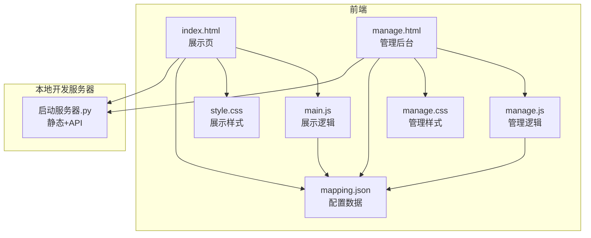
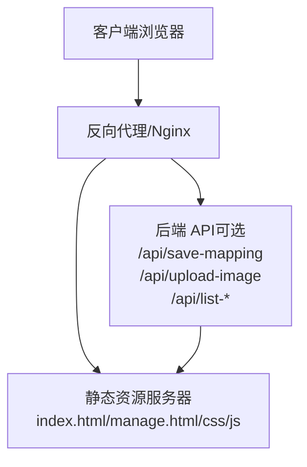
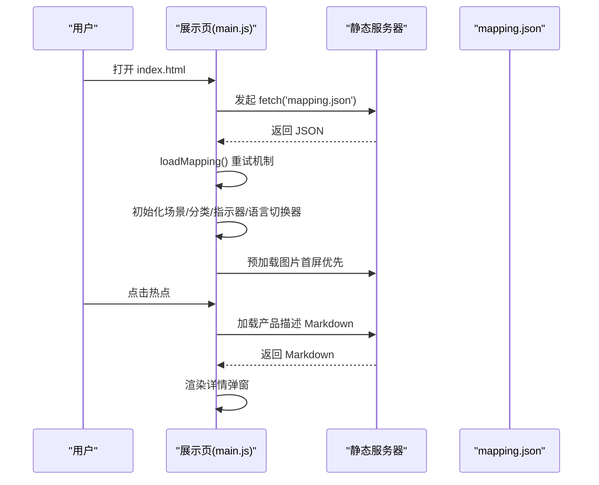
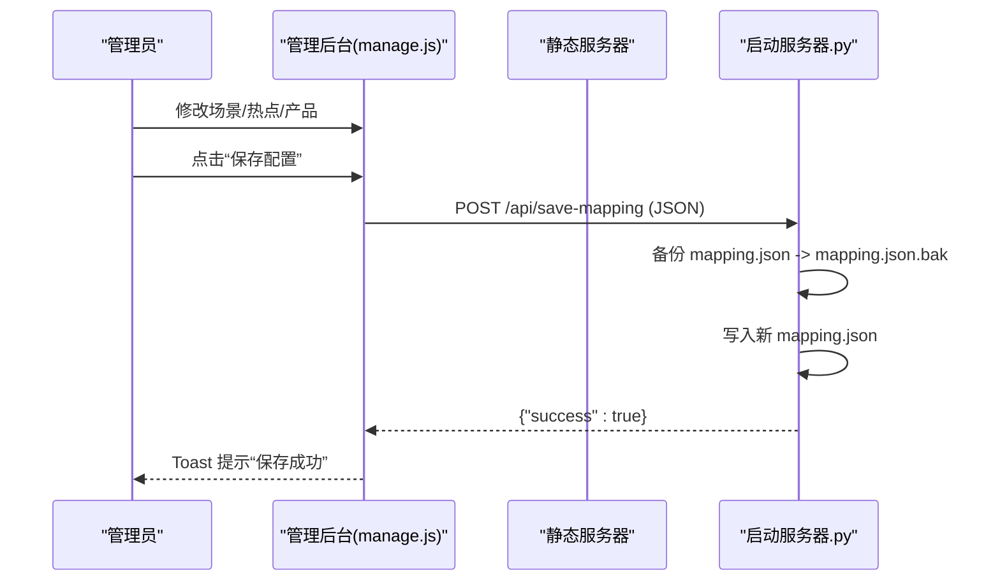
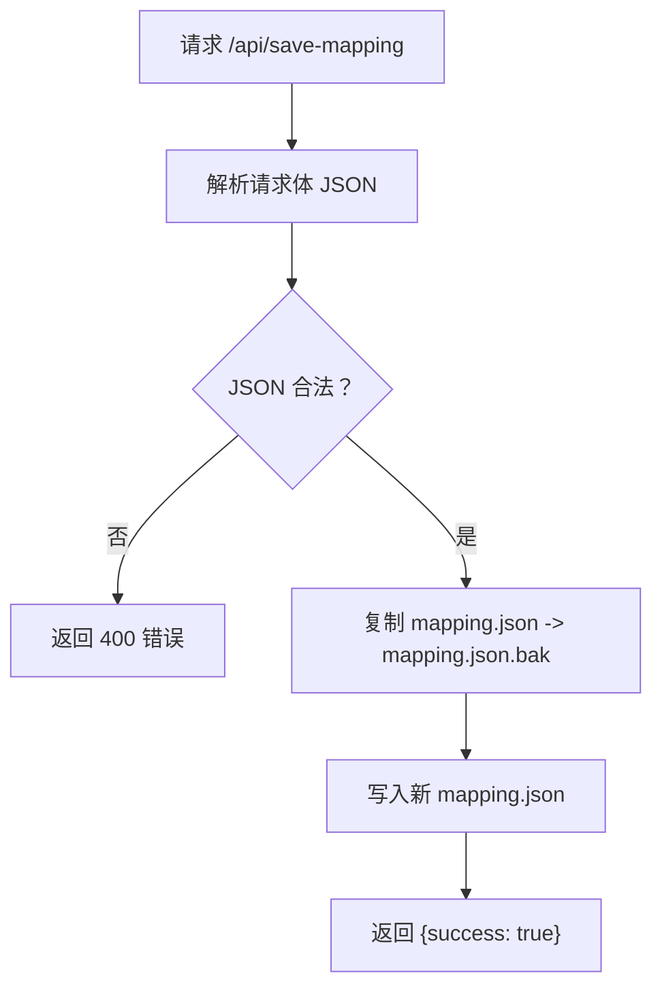
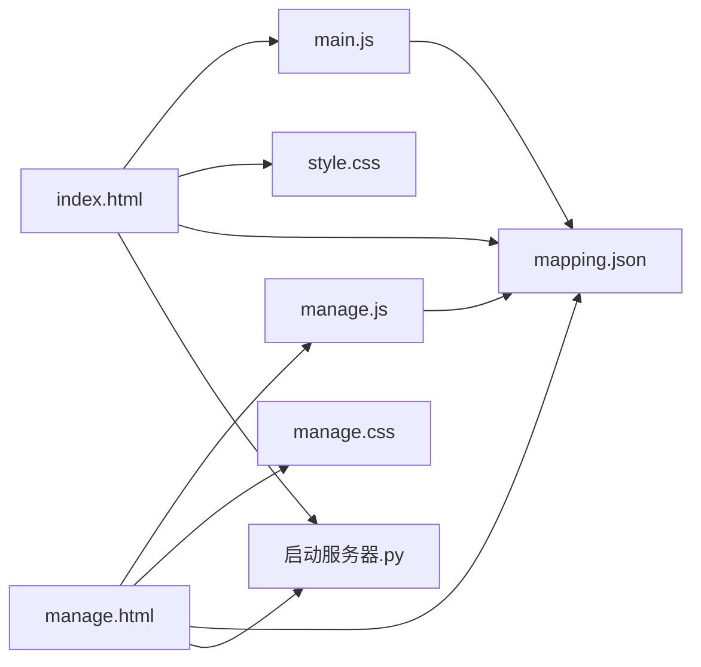

# 生产环境问题

<cite>
**本文引用的文件**
- [index.html](file://index.html)
- [manage.html](file://manage.html)
- [mapping.json](file://mapping.json)
- [启动服务器.py](file://启动服务器.py)
- [project_architecture.md](file://project_architecture.md)
- [style.css](file://css/style.css)
- [manage.css](file://css/manage.css)
- [main.js](file://js/main.js)
- [manage.js](file://js/manage.js)
</cite>

## 目录
1. [简介](#简介)
2. [项目结构](#项目结构)
3. [核心组件](#核心组件)
4. [架构总览](#架构总览)
5. [详细组件分析](#详细组件分析)
6. [依赖分析](#依赖分析)
7. [性能考虑](#性能考虑)
8. [故障排除指南](#故障排除指南)
9. [结论](#结论)
10. [附录](#附录)

## 简介
本指南面向数字标牌产品展示项目的生产环境运维与应急处理，聚焦以下关键目标：
- 快速恢复服务中断：服务器重启、进程监控与自动恢复
- 数据丢失与损坏应急：备份恢复、数据校验与一致性检查
- 安全漏洞快速响应：访问控制检查、输入验证与防护
- 高并发场景性能问题：负载均衡、缓存策略与数据库连接池
- 监控与告警：关键指标、日志分析与异常通知
- 完整应急预案与升级流程：最小化业务影响

本项目为纯前端静态资源与本地开发服务器，生产部署建议采用标准 Web 服务器（如 Nginx/Apache）托管静态资源，并在需要时通过反向代理接入后端服务（如 Python 服务器脚本）。本指南将结合项目现有实现与通用最佳实践给出可落地的生产级方案。

## 项目结构
项目采用“静态页面 + JSON 配置 + 本地开发服务器”的轻量架构：
- 前端页面：index.html（展示页）、manage.html（管理后台）
- 样式：css/style.css（展示页样式）、css/manage.css（管理后台样式）
- 逻辑：js/main.js（展示页逻辑）、js/manage.js（管理后台逻辑）
- 数据：mapping.json（场景/热点/产品/多语言配置）
- 服务器：启动服务器.py（本地开发服务器，含 API 端点）

图表来源
- [index.html](file://index.html)
- [manage.html](file://manage.html)
- [style.css](file://css/style.css)
- [manage.css](file://css/manage.css)
- [main.js](file://js/main.js)
- [manage.js](file://js/manage.js)
- [mapping.json](file://mapping.json)
- [启动服务器.py](file://启动服务器.py)

章节来源
- [project_architecture.md](file://project_architecture.md)
- [启动服务器.py](file://启动服务器.py)

## 核心组件
- 展示页（index.html + main.js + style.css + mapping.json）
  - 动态加载 mapping.json，含重试机制
  - 多语言系统（日文/中文）
  - 场景切换、热点渲染、详情弹窗、图片预加载与缓存
- 管理后台（manage.html + manage.js + manage.css + mapping.json + 启动服务器.py）
  - 场景/热点/产品可视化编辑
  - 保存配置（POST /api/save-mapping，自动备份 mapping.json.bak）
  - 图片上传（POST /api/upload-image）
  - 列表接口（GET /api/list-images、/api/list-descriptions）
- 本地开发服务器（启动服务器.py）
  - 静态文件服务 + CORS
  - API 端点：保存配置、上传图片、列出资源

章节来源
- [project_architecture.md](file://project_architecture.md)
- [启动服务器.py](file://启动服务器.py)

## 架构总览
生产环境推荐采用“静态资源 + 反向代理 + 后端 API（可选）”模式：
- 静态资源：Nginx/Apache 托管 index.html、manage.html、CSS、JS、图片与 Markdown
- 反向代理：统一入口、CORS、压缩、缓存
- 后端 API：若需管理后台保存/上传能力，可复用启动服务器.py 的 API 设计，或迁移至生产级后端（如 Python/Django/Node.js）

图表来源
- [启动服务器.py](file://启动服务器.py)
- [index.html](file://index.html)
- [manage.html](file://manage.html)

## 详细组件分析

### 展示页组件（index.html + main.js + style.css + mapping.json）
- 数据加载与重试
  - loadMapping()：从 mapping.json 动态加载，最多重试 3 次，递增延迟
  - 失败时显示全屏错误提示，阻止初始化继续
- 多语言引擎
  - t(key)、getText(obj)、switchLanguage(lang)：支持日文/中文切换
- 场景渲染与切换
  - 交叉淡入淡出（双层图片）、指示器、分类切换器
- 热点与详情
  - 多热点渲染、点击弹窗、产品列表（左图右文）、Markdown 渲染与缓存
- 图片与描述加载
  - 预加载策略、缓存、失败重试与降级提示

图表来源
- [main.js](file://js/main.js)
- [index.html](file://index.html)
- [mapping.json](file://mapping.json)

章节来源
- [project_architecture.md](file://project_architecture.md)
- [main.js](file://js/main.js)

### 管理后台组件（manage.html + manage.js + manage.css + 启动服务器.py）
- 数据加载
  - loadMappingData()：从 mapping.json 加载
  - loadImageList()/loadDescriptionList()：通过 /api/list-images、/api/list-descriptions 获取可用资源
- 可视化编辑
  - 场景列表、场景编辑区（分类名、场景图）、热点标记与拖拽、产品编辑器
- 保存与上传
  - saveMapping()：POST /api/save-mapping，先备份 mapping.json 为 mapping.json.bak，再写入新数据
  - uploadImage()：POST /api/upload-image，根据 type 保存到场景图/产品图目录

图表来源
- [manage.js](file://js/manage.js)
- [启动服务器.py](file://启动服务器.py)

章节来源
- [project_architecture.md](file://project_architecture.md)
- [manage.js](file://js/manage.js)
- [启动服务器.py](file://启动服务器.py)

### 服务器组件（启动服务器.py）
- 静态文件服务：默认根目录提供 index.html、manage.html、CSS、JS、图片与 Markdown
- CORS：允许本地开发跨域
- API 端点
  - POST /api/save-mapping：保存 mapping.json（自动备份）
  - POST /api/upload-image：上传图片到场景图/产品图目录
  - GET /api/list-images：返回场景图与产品图列表
  - GET /api/list-descriptions：返回产品描述文件列表

图表来源
- [启动服务器.py](file://启动服务器.py)

章节来源
- [启动服务器.py](file://启动服务器.py)

## 依赖分析
- 前端依赖
  - index.html 依赖 main.js、style.css、mapping.json
  - manage.html 依赖 manage.js、manage.css、mapping.json
  - marked.js 用于 Markdown 渲染（CDN 引入）
- 服务器依赖
  - 启动服务器.py 依赖 Python 标准库（http.server、socketserver、os、json、shutil、cgi、urllib）
- 运行时依赖
  - 浏览器运行时（无 Node.js 环境要求）

图表来源
- [index.html](file://index.html)
- [manage.html](file://manage.html)
- [main.js](file://js/main.js)
- [manage.js](file://js/manage.js)
- [style.css](file://css/style.css)
- [manage.css](file://css/manage.css)
- [mapping.json](file://mapping.json)
- [启动服务器.py](file://启动服务器.py)

章节来源
- [project_architecture.md](file://project_architecture.md)

## 性能考虑
- 图片加载与预加载
  - 首屏独占带宽策略：首屏图片加载完成后启动其余图片预加载
  - 双层图片交叉淡入淡出，避免黑屏
  - 图片缓存与重试：isImagePreloaded/isImageCached/waitForImageLoad
- Markdown 渲染
  - descriptionCache 缓存已加载文件
  - marked.js 未加载时的降级处理
- 前端渲染
  - 动态渲染热点、分类切换器、指示器与详情弹窗
  - 骨架屏与加载指示器提升感知性能
- 生产环境建议
  - 使用 CDN 缓存静态资源（CSS/JS/图片/Markdown）
  - 启用 Gzip/Brotli 压缩
  - 合理设置缓存头（immutable、max-age）
  - 使用反向代理做静态资源缓存与压缩
  - 高并发场景建议引入缓存中间件（如 Redis）存储热点数据与图片元信息

章节来源
- [project_architecture.md](file://project_architecture.md)
- [main.js](file://js/main.js)
- [style.css](file://css/style.css)

## 故障排除指南

### 服务中断快速恢复
- 服务器重启
  - 本地开发：双击启动服务器.py 或命令行运行，自动打开浏览器
  - 生产环境：使用 systemd/systemctl 管理服务，确保静态资源与反向代理正常
- 进程监控与自动恢复
  - 使用进程监控工具（如 supervisor）守护静态服务器与反向代理
  - 配置健康检查端点（如 /health），失败自动重启
- 端口占用
  - 启动服务器.py 支持端口探测（从 8082 开始寻找可用端口），生产环境建议固定端口并前置反向代理

章节来源
- [启动服务器.py](file://启动服务器.py)

### 数据丢失与损坏应急
- 备份恢复
  - 管理后台保存配置时，服务器会先将 mapping.json 备份为 mapping.json.bak
  - 生产环境建议定期备份 mapping.json 与相关资源目录（场景图/产品图/产品描述）
- 数据校验与一致性
  - 校验 mapping.json 结构完整性（version、scenes、i18n）
  - 校验图片与描述文件路径是否存在
  - 通过 /api/list-images 与 /api/list-descriptions 校验资源清单一致性
- 恢复流程
  - 若 mapping.json 损坏：使用 mapping.json.bak 恢复
  - 若资源缺失：通过 /api/list-images 与 /api/list-descriptions 重建资源清单，重新上传缺失文件

章节来源
- [启动服务器.py](file://启动服务器.py)
- [project_architecture.md](file://project_architecture.md)

### 安全漏洞快速响应
- 访问控制
  - 管理后台仅在内网或受保护入口访问，限制 /api/save-mapping 与 /api/upload-image 的调用范围
  - 反向代理启用认证与速率限制
- 输入验证
  - 服务器对 /api/save-mapping 的请求体进行 JSON 解析与合法性校验
  - 上传文件类型与大小限制（当前脚本未强制限制，建议在生产环境增加）
- 防护措施
  - 启用 HTTPS 与 HSTS
  - 配置 CORS 白名单，避免跨域风险
  - 静态资源开启安全响应头（X-Frame-Options、X-Content-Type-Options、Referrer-Policy）

章节来源
- [启动服务器.py](file://启动服务器.py)
- [project_architecture.md](file://project_architecture.md)

### 高并发场景性能问题处理
- 负载均衡
  - 使用 Nginx/HAProxy 做多实例负载均衡
  - 静态资源走就近缓存与 CDN
- 缓存策略
  - 前端：骨架屏、懒加载、图片预加载
  - 后端：Redis 缓存 mapping.json 与热门资源元信息
- 数据库连接池
  - 若引入后端数据库，使用连接池（如 SQLAlchemy/连接池）并合理配置最大连接数与超时
  - 对频繁读取的资源（如图片列表）做缓存与分页

章节来源
- [project_architecture.md](file://project_architecture.md)

### 监控与告警
- 关键指标
  - 服务器可用性（HTTP 2xx/4xx/5xx 比例）
  - 响应时间（P50/P95/P99）
  - 静态资源命中率与缓存命中率
  - 管理后台保存成功率与失败原因统计
- 日志分析
  - 反向代理日志（Nginx/Apache）与应用日志（Python 服务器）
  - 关键错误：JSON 解析失败、文件写入失败、图片上传失败
- 异常通知
  - 配置告警规则（阈值触发）并通过邮件/IM 通知
  - 对 mapping.json.bak 生成与保存失败进行告警

章节来源
- [启动服务器.py](file://启动服务器.py)

### 应急预案与升级流程
- 一级响应（页面不可用）
  - 快速检查静态资源与反向代理
  - 回滚 mapping.json.bak 至 mapping.json
  - 临时关闭管理后台保存入口，防止进一步破坏
- 二级响应（部分功能异常）
  - 检查 /api/save-mapping 与 /api/upload-image 的可用性
  - 校验资源目录权限与磁盘空间
- 三级响应（性能下降）
  - 启用缓存中间件与 CDN
  - 限流与熔断，逐步扩容
- 升级流程
  - 评估变更影响，灰度发布
  - 回滚策略：保留 mapping.json.bak，回滚到最近稳定版本

章节来源
- [启动服务器.py](file://启动服务器.py)
- [project_architecture.md](file://project_architecture.md)

## 结论
本项目以“静态资源 + JSON 配置 + 本地开发服务器”为核心，具备良好的可维护性与可移植性。生产环境建议：
- 使用标准 Web 服务器与反向代理托管静态资源
- 将管理后台 API 迁移至生产级后端，完善输入校验与安全防护
- 建立完善的监控、日志与备份体系，确保最小化业务影响
- 制定清晰的应急预案与升级流程，保障服务连续性

## 附录
- 术语
  - mapping.json：场景/热点/产品/多语言配置数据
  - API 端点：/api/save-mapping、/api/upload-image、/api/list-images、/api/list-descriptions
- 参考文件
  - [project_architecture.md](file://project_architecture.md)
  - [启动服务器.py](file://启动服务器.py)