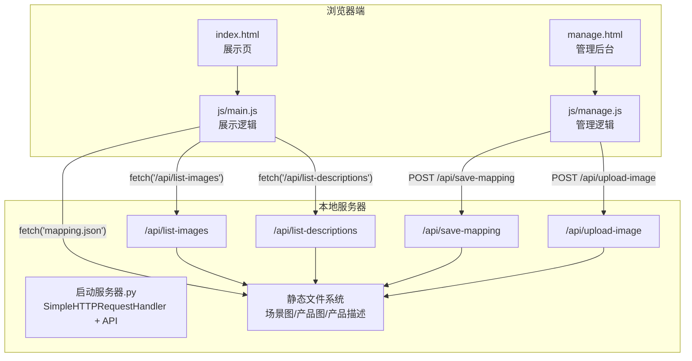
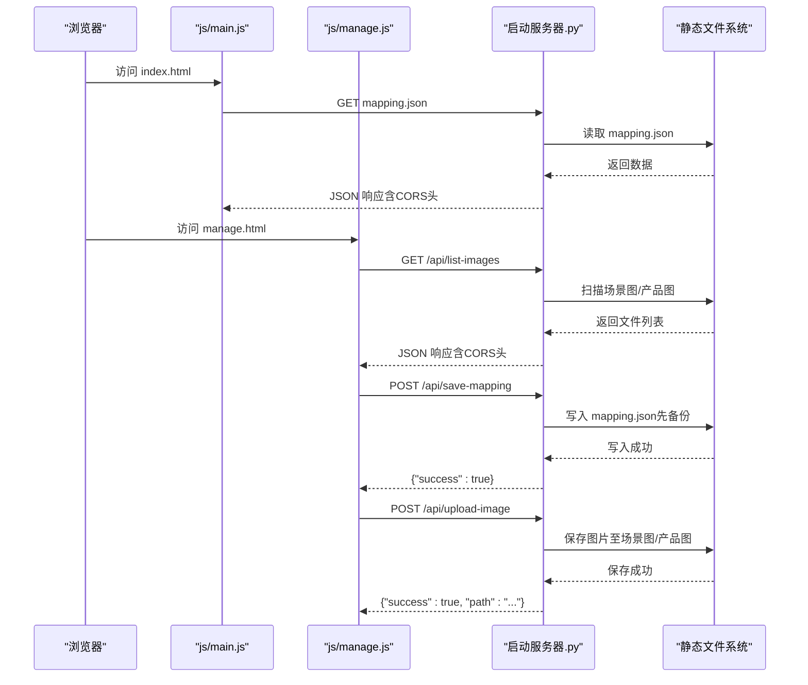
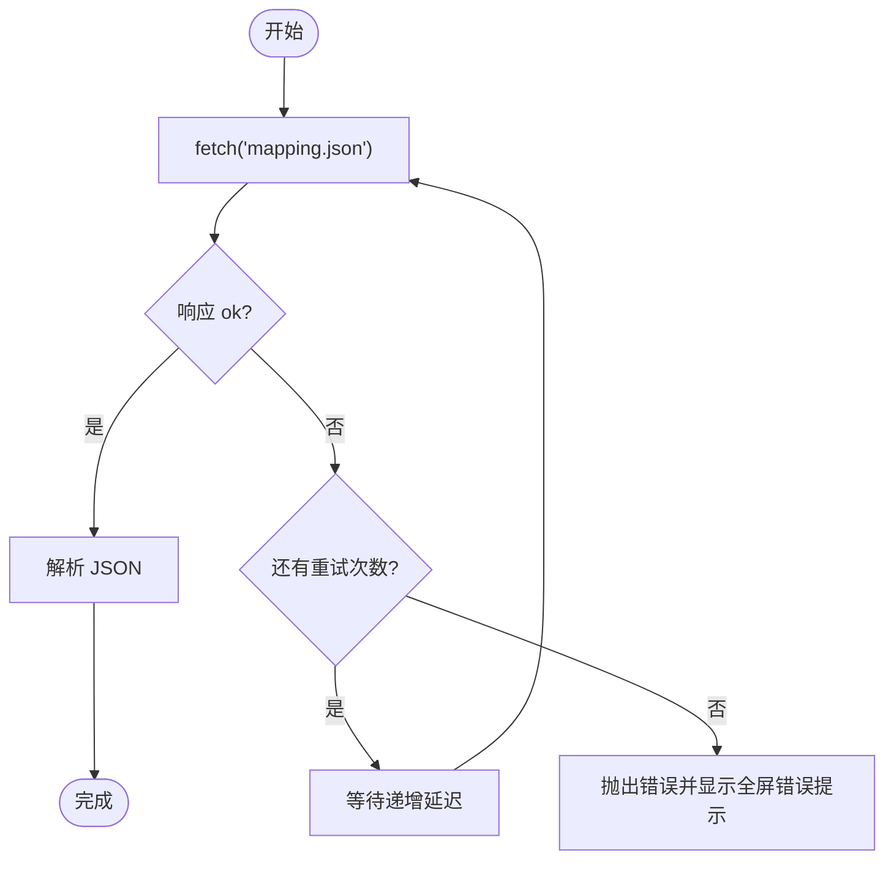
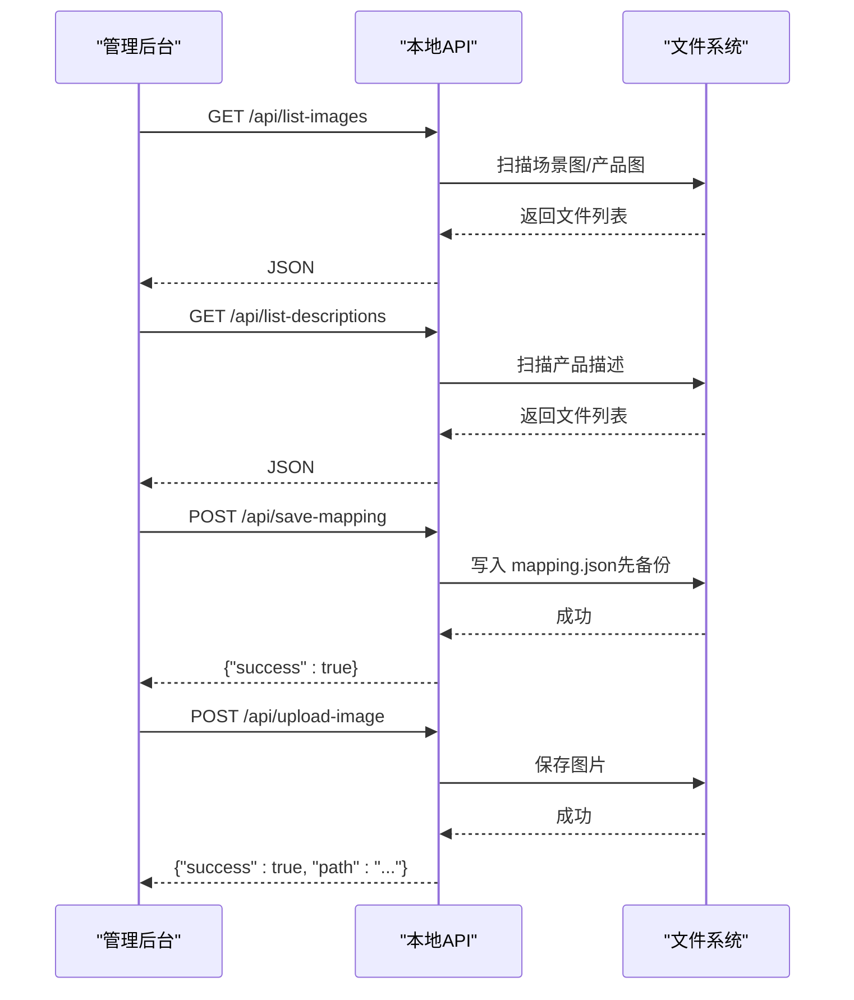
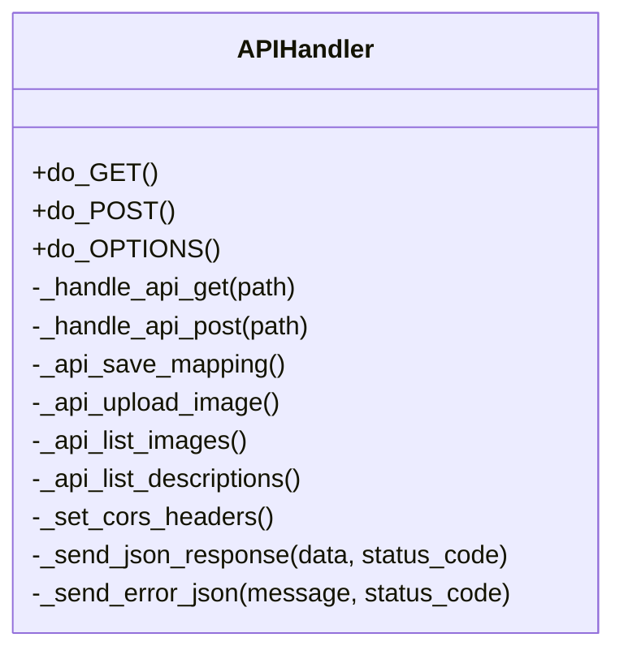
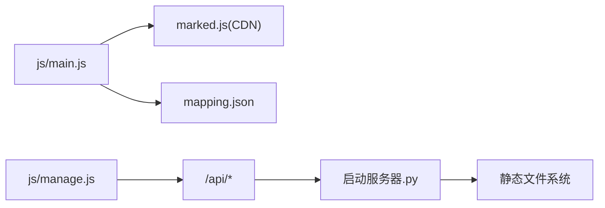

# 网络和API问题

<cite>
**本文引用的文件**
- [index.html](file://index.html)
- [manage.html](file://manage.html)
- [js/main.js](file://js/main.js)
- [js/manage.js](file://js/manage.js)
- [启动服务器.py](file://启动服务器.py)
- [mapping.json](file://mapping.json)
- [project_architecture.md](file://project_architecture.md)
- [产品描述/室内双面吊装标牌.md](file://产品描述/室内双面吊装标牌.md)
- [产品描述/自助点单机1.md](file://产品描述/自助点单机1.md)
</cite>

## 目录
1. [简介](#简介)
2. [项目结构](#项目结构)
3. [核心组件](#核心组件)
4. [架构总览](#架构总览)
5. [详细组件分析](#详细组件分析)
6. [依赖分析](#依赖分析)
7. [性能考虑](#性能考虑)
8. [故障排除指南](#故障排除指南)
9. [结论](#结论)
10. [附录](#附录)

## 简介
本指南聚焦于数字标牌产品展示项目的网络与API相关问题，涵盖以下方面：
- API接口调用失败的常见原因与解决方案（CORS跨域、服务器连接超时、请求格式错误）
- Python本地服务器启动失败的诊断方法（端口占用、Python版本兼容性、权限问题）
- 文件上传功能异常排查（文件大小限制、格式校验、服务器存储权限）
- 网络不稳定导致的数据加载失败处理（重试机制配置、超时参数调整）
- API响应错误的调试方法（请求头设置、认证令牌验证、数据格式检查）
- 提供具体错误代码示例与对应解决策略

## 项目结构
该项目采用纯前端+本地Python服务器的轻量架构：
- 前端页面：index.html（展示页）、manage.html（管理后台）
- 前端逻辑：js/main.js（展示页逻辑）、js/manage.js（管理后台逻辑）
- 本地服务器：启动服务器.py（内置HTTP服务器，提供静态文件与API端点）
- 数据配置：mapping.json（场景、热点、产品、多语言配置）

图表来源
- [启动服务器.py:25-252](file://启动服务器.py#L25-L252)
- [js/main.js:49-73](file://js/main.js#L49-L73)
- [js/manage.js:35-72](file://js/manage.js#L35-L72)

章节来源
- [project_architecture.md:43-108](file://project_architecture.md#L43-L108)
- [启动服务器.py:25-252](file://启动服务器.py#L25-L252)

## 核心组件
- 展示页数据加载与重试：前端通过fetch加载mapping.json，内置3次重试（递增延迟），失败时显示全屏错误提示。
- 管理后台API交互：管理后台通过fetch调用本地API端点，包括保存配置、上传图片、列出图片与描述文件。
- 本地API服务：启动服务器.py继承SimpleHTTPRequestHandler，扩展OPTIONS/CORS处理与4个API端点。
- Markdown加载与缓存：展示页对产品描述文件进行缓存与失败重试，支持点击重试。
- 图片加载与预加载：展示页对场景图与产品图进行预加载与等待，支持超时保护与缓存检测。

章节来源
- [js/main.js:49-73](file://js/main.js#L49-L73)
- [js/main.js:421-442](file://js/main.js#L421-L442)
- [js/main.js:257-327](file://js/main.js#L257-L327)
- [js/main.js:354-395](file://js/main.js#L354-L395)
- [js/manage.js:35-72](file://js/manage.js#L35-L72)
- [js/manage.js:81-108](file://js/manage.js#L81-L108)
- [js/manage.js:762-781](file://js/manage.js#L762-L781)
- [启动服务器.py:25-98](file://启动服务器.py#L25-L98)

## 架构总览
前端通过fetch与本地API交互，本地服务器提供静态资源与API端点。管理后台负责编辑配置并通过API持久化到mapping.json；展示页动态加载配置并渲染。

图表来源
- [js/main.js:49-73](file://js/main.js#L49-L73)
- [js/manage.js:35-72](file://js/manage.js#L35-L72)
- [js/manage.js:81-108](file://js/manage.js#L81-L108)
- [js/manage.js:762-781](file://js/manage.js#L762-L781)
- [启动服务器.py:75-97](file://启动服务器.py#L75-L97)
- [启动服务器.py:101-127](file://启动服务器.py#L101-L127)
- [启动服务器.py:129-202](file://启动服务器.py#L129-L202)
- [启动服务器.py:204-251](file://启动服务器.py#L204-L251)

## 详细组件分析

### 展示页数据加载与重试（mapping.json）
- 重试策略：最多3次，延迟500ms→1000ms→2000ms；最终失败抛出错误。
- 超时策略：首图30秒，场景切换与图片等待分别设置15秒与8秒超时。
- 失败处理：初始化失败时显示全屏错误提示，提示用户刷新页面。

图表来源
- [js/main.js:49-73](file://js/main.js#L49-L73)
- [js/main.js:1197-1206](file://js/main.js#L1197-L1206)

章节来源
- [js/main.js:49-73](file://js/main.js#L49-L73)
- [js/main.js:1197-1206](file://js/main.js#L1197-L1206)

### 管理后台API交互
- 列表获取：GET /api/list-images 与 /api/list-descriptions，返回可用文件列表。
- 保存配置：POST /api/save-mapping，请求体为完整mapping.json，服务器先备份再写入。
- 图片上传：POST /api/upload-image，multipart/form-data，支持scene/product类型与分类参数。

图表来源
- [js/manage.js:35-72](file://js/manage.js#L35-L72)
- [js/manage.js:81-108](file://js/manage.js#L81-L108)
- [js/manage.js:762-781](file://js/manage.js#L762-L781)
- [启动服务器.py:204-251](file://启动服务器.py#L204-L251)
- [启动服务器.py:101-127](file://启动服务器.py#L101-L127)
- [启动服务器.py:129-202](file://启动服务器.py#L129-L202)

章节来源
- [js/manage.js:35-72](file://js/manage.js#L35-L72)
- [js/manage.js:81-108](file://js/manage.js#L81-L108)
- [js/manage.js:762-781](file://js/manage.js#L762-L781)
- [启动服务器.py:204-251](file://启动服务器.py#L204-L251)
- [启动服务器.py:101-127](file://启动服务器.py#L101-L127)
- [启动服务器.py:129-202](file://启动服务器.py#L129-L202)

### 本地API服务（CORS与端点）
- CORS处理：OPTIONS预检与GET/POST统一设置Access-Control-Allow-Origin、Methods、Headers。
- 端点路由：/api/save-mapping（POST）、/api/upload-image（POST）、/api/list-images（GET）、/api/list-descriptions（GET）。
- 错误响应：请求体为空、JSON解析失败、未知API路径、服务器异常等返回相应状态码与错误消息。

图表来源
- [启动服务器.py:25-98](file://启动服务器.py#L25-L98)
- [启动服务器.py:101-202](file://启动服务器.py#L101-L202)
- [启动服务器.py:204-251](file://启动服务器.py#L204-L251)

章节来源
- [启动服务器.py:25-98](file://启动服务器.py#L25-L98)
- [启动服务器.py:101-202](file://启动服务器.py#L101-L202)
- [启动服务器.py:204-251](file://启动服务器.py#L204-L251)

## 依赖分析
- 前端依赖：marked.js（CDN引入）用于Markdown解析；本地fetch用于API与静态资源请求。
- 服务器依赖：Python标准库http.server、socketserver、cgi、urllib.parse、os、shutil、json。
- 文件组织：场景图/、产品图/、产品描述/目录结构清晰，便于API扫描与管理。

图表来源
- [index.html:9-10](file://index.html#L9-L10)
- [js/main.js:450-460](file://js/main.js#L450-L460)
- [js/manage.js:35-72](file://js/manage.js#L35-L72)
- [启动服务器.py:25-252](file://启动服务器.py#L25-L252)

章节来源
- [index.html:9-10](file://index.html#L9-L10)
- [js/main.js:450-460](file://js/main.js#L450-L460)
- [js/manage.js:35-72](file://js/manage.js#L35-L72)
- [启动服务器.py:25-252](file://启动服务器.py#L25-L252)

## 性能考虑
- 首屏独占带宽：首图加载完成后才启动预加载，避免慢速网络下首图超时。
- 图片等待超时：图片等待函数提供超时保护，防止长时间阻塞。
- Markdown并行加载：产品描述并行加载，提升渲染速度。
- 防抖与状态锁：场景切换与窗口resize使用防抖与状态锁，减少重复计算。

章节来源
- [js/main.js:1197-1267](file://js/main.js#L1197-L1267)
- [js/main.js:354-395](file://js/main.js#L354-L395)
- [js/main.js:931-955](file://js/main.js#L931-L955)
- [js/main.js:1140-1148](file://js/main.js#L1140-L1148)

## 故障排除指南

### 一、API接口调用失败

#### 1. CORS跨域问题
- 现象：浏览器控制台报跨域错误，请求被阻止。
- 原因：管理后台与展示页通过本地8082端口访问API，若浏览器安全策略或代理导致跨域，会出现CORS错误。
- 解决方案：
  - 确保在同一主机与端口访问（index.html与manage.html均通过http://localhost:8082访问）。
  - 服务器已设置通用CORS头（允许任意来源、方法与Content-Type），无需额外配置。
  - 若使用代理或反向代理，请确保代理透传CORS头或允许跨域。

章节来源
- [启动服务器.py:28-33](file://启动服务器.py#L28-L33)
- [启动服务器.py:48-53](file://启动服务器.py#L48-L53)

#### 2. 服务器连接超时
- 现象：fetch请求长时间无响应或超时。
- 原因：网络不稳定、服务器繁忙、端口被占用、Python版本或权限问题。
- 解决方案：
  - 检查本地端口占用：默认端口8082，若被占用会自动寻找可用端口；可在控制台查看实际服务地址。
  - 确认Python版本：项目使用Python标准库，建议使用Python 3.x。
  - 权限问题：确保对项目目录具有读写权限，特别是写入mapping.json与保存图片目录。
  - 超时参数：前端对图片等待设置了超时（8~15秒），若仍失败，检查网络与服务器磁盘IO。

章节来源
- [启动服务器.py:266-294](file://启动服务器.py#L266-L294)
- [js/main.js:354-395](file://js/main.js#L354-L395)
- [js/main.js:514-516](file://js/main.js#L514-L516)

#### 3. 请求格式错误
- 现象：服务器返回400错误（请求体为空、JSON解析失败、Content-Type不匹配）。
- 原因：请求体为空、JSON格式错误、multipart/form-data缺失必要字段。
- 解决方案：
  - 保存配置：确保POST /api/save-mapping携带完整JSON体。
  - 上传图片：确保Content-Type为multipart/form-data，包含file字段与type参数（scene或product），scene类型需提供category参数。
  - 未知API路径：确认请求路径为受支持的四个端点之一。

章节来源
- [启动服务器.py:104-114](file://启动服务器.py#L104-L114)
- [启动服务器.py:131-135](file://启动服务器.py#L131-L135)
- [启动服务器.py:168-182](file://启动服务器.py#L168-L182)
- [启动服务器.py:88-97](file://启动服务器.py#L88-L97)

#### 4. API响应错误调试
- 请求头设置：管理后台POST保存配置时设置Content-Type为application/json；上传图片使用multipart/form-data。
- 认证令牌验证：本地开发服务器未启用认证，无需Token；若接入生产环境，请在服务器端增加鉴权。
- 数据格式检查：确保mapping.json结构与字段符合预期（version、scenes、i18n）；产品描述文件为.md格式。

章节来源
- [js/manage.js:88-92](file://js/manage.js#L88-L92)
- [js/manage.js:768-771](file://js/manage.js#L768-L771)
- [mapping.json:1-232](file://mapping.json#L1-L232)

### 二、Python本地服务器启动失败

- 端口占用：默认端口8082，若被占用会自动向上查找可用端口；可在控制台输出的服务地址确认实际端口。
- Python版本兼容性：项目使用Python标准库，建议使用Python 3.x；若使用Python 2.x将无法运行。
- 权限问题：确保对项目根目录具有读写权限，特别是写入mapping.json与保存图片目录。
- 端口查找逻辑：从起始端口开始逐个尝试，最多尝试100个端口；若仍失败，回退到起始端口。

章节来源
- [启动服务器.py:254-264](file://启动服务器.py#L254-L264)
- [启动服务器.py:266-294](file://启动服务器.py#L266-L294)

### 三、文件上传功能异常

- 文件大小限制：Python CGI默认对上传大小有限制；可通过调整服务器端解析缓冲或在更高层的Web服务器中配置。
- 格式验证：服务器要求Content-Type为multipart/form-data，且包含file字段；type必须为scene或product；scene类型需提供category。
- 存储权限：保存目录（场景图/分类名/ 与 产品图/）需存在且可写；服务器会在不存在时自动创建。
- 上传流程：前端构造FormData并提交，服务器解析后保存文件并返回相对路径。

章节来源
- [js/manage.js:762-781](file://js/manage.js#L762-L781)
- [启动服务器.py:129-202](file://启动服务器.py#L129-L202)

### 四、网络不稳定导致的数据加载失败

- 重试机制：mapping.json加载具备3次重试（递增延迟），图片预加载与等待也具备重试与超时保护。
- 超时参数调整：图片等待超时默认8秒，场景切换等待15秒，首图等待30秒；可根据网络环境适当调整。
- 失败降级：Markdown加载失败时返回可点击重试的提示；图片预加载失败仅输出警告并继续。

章节来源
- [js/main.js:49-73](file://js/main.js#L49-L73)
- [js/main.js:285-320](file://js/main.js#L285-L320)
- [js/main.js:354-395](file://js/main.js#L354-L395)
- [js/main.js:421-442](file://js/main.js#L421-L442)

### 五、API响应错误示例与解决策略

- 400 请求体为空：检查请求体是否为空；保存配置时确保JSON有效。
- 400 JSON解析失败：检查JSON格式；使用在线JSON校验工具验证。
- 400 Content-Type不匹配：上传图片时确保使用multipart/form-data。
- 400 缺少type参数：上传图片时提供type（scene或product）。
- 400 上传场景图片缺少category：scene类型上传时提供category。
- 404 未知API路径：确认请求路径为受支持的四个端点之一。
- 500 服务器内部错误：检查服务器日志与文件权限，确保mapping.json与图片目录可写。

章节来源
- [启动服务器.py:104-114](file://启动服务器.py#L104-L114)
- [启动服务器.py:131-135](file://启动服务器.py#L131-L135)
- [启动服务器.py:168-182](file://启动服务器.py#L168-L182)
- [启动服务器.py:88-97](file://启动服务器.py#L88-L97)

## 结论
本项目通过纯前端与本地Python服务器实现了完整的数字标牌展示与管理能力。针对网络与API问题，建议重点关注CORS配置、端口占用与权限、请求格式与超时参数，并结合内置重试与超时机制提升稳定性。若扩展到生产环境，建议增加认证与更严格的上传校验。

## 附录

### A. API端点一览
- POST /api/save-mapping：保存配置（JSON体）
- POST /api/upload-image：上传图片（multipart/form-data）
- GET /api/list-images：获取图片列表
- GET /api/list-descriptions：获取描述文件列表

章节来源
- [project_architecture.md:769-776](file://project_architecture.md#L769-L776)
- [启动服务器.py:75-97](file://启动服务器.py#L75-L97)

### B. 数据结构参考
- mapping.json：包含version、scenes、i18n字段；scenes包含场景、热点、产品与描述文件路径。
- 产品描述文件：Markdown格式，位于产品描述/目录。

章节来源
- [mapping.json:1-232](file://mapping.json#L1-L232)
- [产品描述/室内双面吊装标牌.md:1-13](file://产品描述/室内双面吊装标牌.md#L1-L13)
- [产品描述/自助点单机1.md:1-11](file://产品描述/自助点单机1.md#L1-L11)