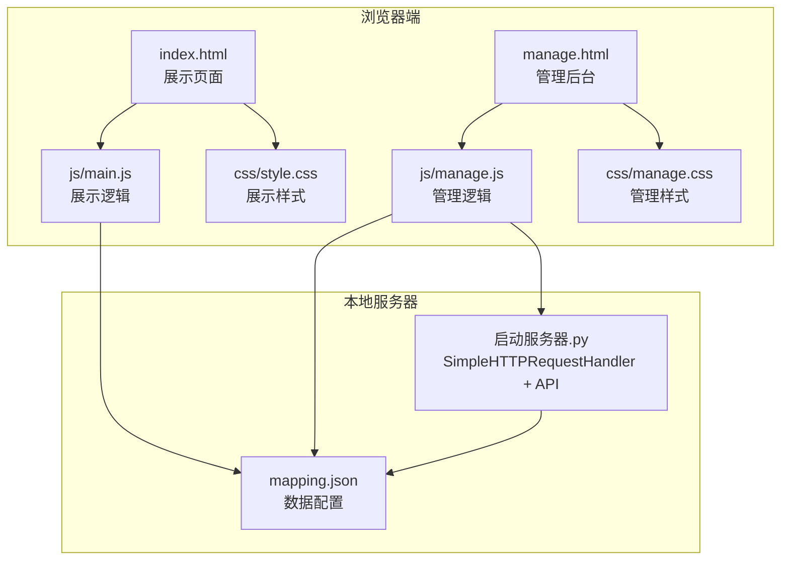
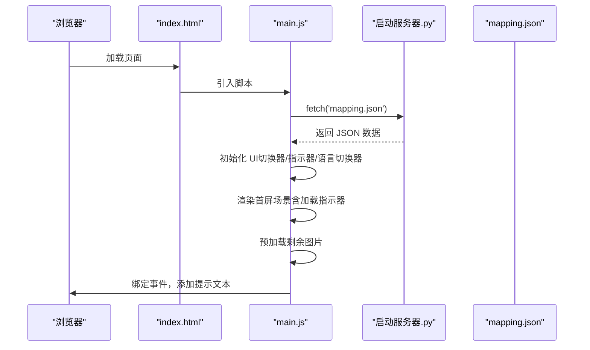
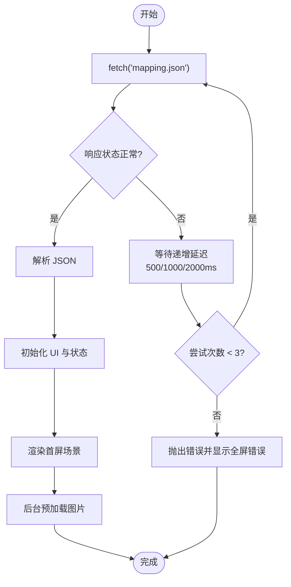
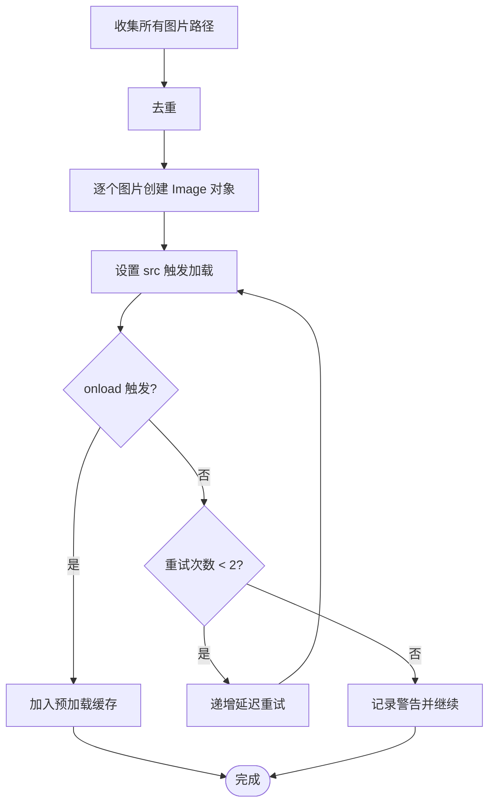
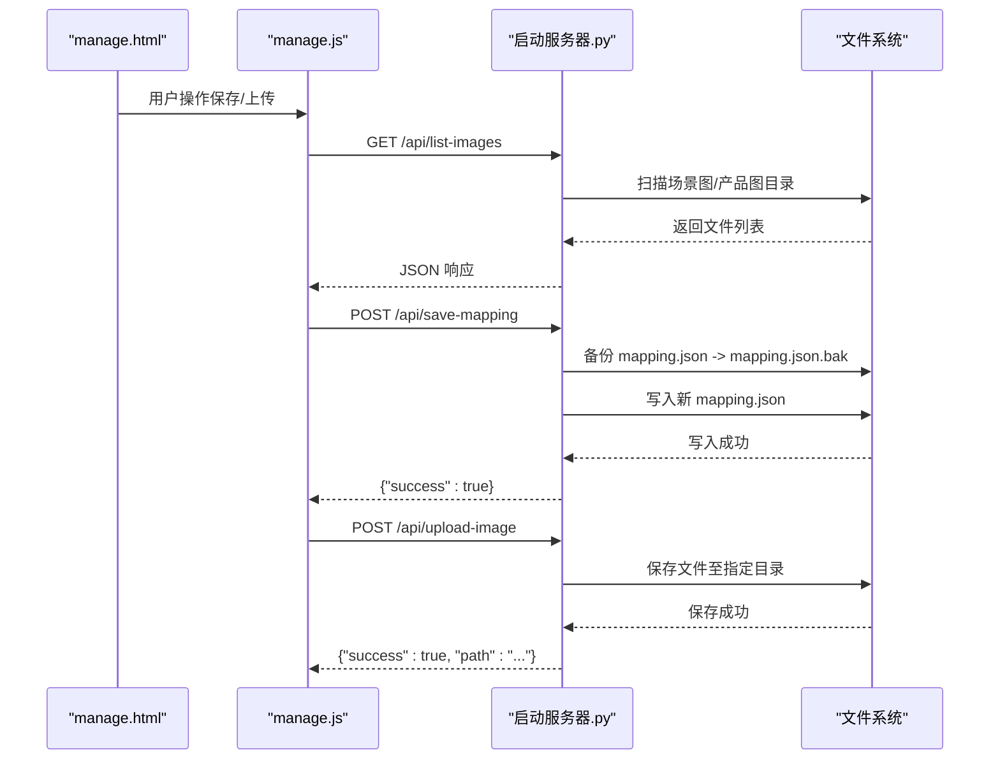
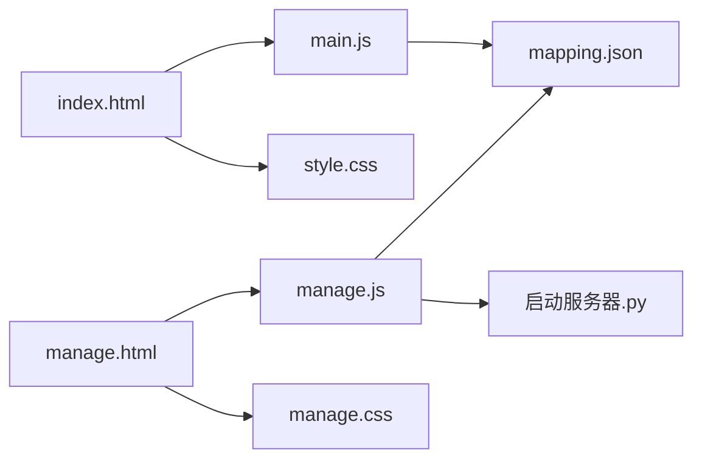

# 页面加载问题

<cite>
**本文档引用的文件**
- [index.html](file://index.html)
- [manage.html](file://manage.html)
- [mapping.json](file://mapping.json)
- [main.js](file://js/main.js)
- [manage.js](file://js/manage.js)
- [style.css](file://css/style.css)
- [manage.css](file://css/manage.css)
- [启动服务器.py](file://启动服务器.py)
- [project_architecture.md](file://project_architecture.md)
</cite>

## 目录
1. [简介](#简介)
2. [项目结构](#项目结构)
3. [核心组件](#核心组件)
4. [架构总览](#架构总览)
5. [详细组件分析](#详细组件分析)
6. [依赖关系分析](#依赖关系分析)
7. [性能考虑](#性能考虑)
8. [故障排除指南](#故障排除指南)
9. [结论](#结论)

## 简介
本指南聚焦于数字标牌产品展示项目的页面加载问题，涵盖页面无法正常加载、空白页面、资源加载失败等常见问题。重点包括：
- mapping.json 加载失败的诊断与修复
- 图片资源加载异常的排查与解决
- 页面空白或白屏问题的定位与处理
- 浏览器控制台错误信息的解读与应对
- 具体错误代码与消息示例及对应步骤

## 项目结构
项目采用前后端一体化的本地开发模式，前端通过静态文件与本地Python服务器提供服务，管理后台通过API端点与前端数据交互。

**图表来源**
- [index.html](file://index.html)
- [manage.html](file://manage.html)
- [main.js](file://js/main.js)
- [manage.js](file://js/manage.js)
- [style.css](file://css/style.css)
- [manage.css](file://css/manage.css)
- [启动服务器.py](file://启动服务器.py)
- [mapping.json](file://mapping.json)

**章节来源**
- [project_architecture.md](file://project_architecture.md)

## 核心组件
- 展示页面（index.html + main.js）：负责从 mapping.json 动态加载场景与产品数据，实现图片预加载、多语言切换、热点渲染与详情弹窗。
- 管理后台（manage.html + manage.js）：提供可视化编辑界面，通过本地API上传图片、列出可用资源、保存配置。
- 本地服务器（启动服务器.py）：提供静态文件服务与API端点，支持CORS跨域，便于本地开发调试。
- 数据配置（mapping.json）：集中存放场景、热点、产品与多语言文案，前端通过 fetch 动态加载。

**章节来源**
- [index.html](file://index.html)
- [manage.html](file://manage.html)
- [main.js](file://js/main.js)
- [manage.js](file://js/manage.js)
- [启动服务器.py](file://启动服务器.py)
- [mapping.json](file://mapping.json)

## 架构总览
展示页面与管理后台共享同一套数据源（mapping.json），通过本地服务器统一提供静态资源与API服务。页面初始化流程如下：

**图表来源**
- [main.js](file://js/main.js)
- [启动服务器.py](file://启动服务器.py)
- [mapping.json](file://mapping.json)

## 详细组件分析

### 组件A：数据加载与初始化（mapping.json）
- 加载策略：使用 fetch 从根目录加载 mapping.json，包含最多3次重试（延迟500ms/1000ms/2000ms）。
- 失败处理：若重试后仍失败，显示全屏错误提示，阻止后续初始化。
- 依赖关系：依赖 DOM 结构（#app、#scene-container 等）与全局状态（state、dom）。

**图表来源**
- [main.js](file://js/main.js)

**章节来源**
- [main.js](file://js/main.js)

### 组件B：图片资源加载与预加载
- 预加载策略：遍历 mapping.json 中所有场景图与产品图，使用 Image 对象并行预加载，失败时最多重试2次。
- 加载等待：waitForImageLoad 提供超时保护（默认8秒，场景切换为15秒，首屏为30秒），避免长时间阻塞。
- 缓存利用：isImageCached 与 isImagePreloaded 用于判断是否需要加载指示器与是否已缓存。

**图表来源**
- [main.js](file://js/main.js)

**章节来源**
- [main.js](file://js/main.js)

### 组件C：管理后台数据与API交互
- 数据加载：通过 /api/list-images 与 /api/list-descriptions 获取可用资源列表。
- 配置保存：POST /api/save-mapping 将完整 mapping.json 写回服务器，并自动备份原文件。
- 图片上传：POST /api/upload-image 支持场景图与产品图上传，自动创建目录并返回相对路径。

**图表来源**
- [manage.js](file://js/manage.js)
- [启动服务器.py](file://启动服务器.py)

**章节来源**
- [manage.js](file://js/manage.js)
- [启动服务器.py](file://启动服务器.py)

## 依赖关系分析
- 展示页面依赖 mapping.json 提供的数据，依赖本地服务器提供的静态资源与API。
- 管理后台依赖本地服务器提供的API端点，依赖 mapping.json 作为数据源。
- 样式文件（style.css、manage.css）为页面提供视觉与交互体验，与逻辑文件解耦。

**图表来源**
- [main.js](file://js/main.js)
- [manage.js](file://js/manage.js)
- [启动服务器.py](file://启动服务器.py)
- [mapping.json](file://mapping.json)
- [index.html](file://index.html)
- [manage.html](file://manage.html)
- [style.css](file://css/style.css)
- [manage.css](file://css/manage.css)

**章节来源**
- [project_architecture.md](file://project_architecture.md)

## 性能考虑
- 首屏独占带宽：首屏图片加载完成后才启动后台预加载，避免慢速网络下首屏超时。
- 图片缓存与复用：预加载缓存与浏览器HTTP缓存结合，减少重复请求。
- 并行加载：图片与Markdown描述采用并行加载策略，提升用户体验。
- 超时保护：针对网络波动设置合理超时，避免长时间等待。

[本节为通用指导，无需特定文件引用]

## 故障排除指南

### 一、页面无法正常加载（空白页面/白屏）

#### 1.1 mapping.json 加载失败
- 症状：页面显示全屏错误提示，无法进入主界面。
- 可能原因：
  - 本地服务器未启动或端口被占用
  - mapping.json 路径错误或文件损坏
  - CORS 跨域问题（本地开发默认允许）
- 排查步骤：
  1) 确认本地服务器已启动并监听端口（默认8082），浏览器访问 http://localhost:8082/index.html。
  2) 检查 mapping.json 是否存在于项目根目录，文件格式是否为有效JSON。
  3) 打开浏览器开发者工具，查看 Network 面板中 mapping.json 的请求状态码与响应内容。
  4) 若多次重试后仍失败，检查控制台错误信息（见“浏览器控制台错误解读”）。
- 预防措施：
  - 使用项目自带的启动脚本启动本地服务器，避免端口冲突。
  - 修改 mapping.json 后，确保JSON格式正确且字段完整。

**章节来源**
- [main.js](file://js/main.js)
- [启动服务器.py](file://启动服务器.py)
- [mapping.json](file://mapping.json)

#### 1.2 JavaScript 初始化失败
- 症状：页面空白，控制台报错指向 DOM 初始化或 fetch 失败。
- 排查步骤：
  1) 检查 index.html 中 DOM 结构是否完整（#app、#scene-container 等）。
  2) 确认 main.js 已正确引入，且 init() 在 DOMContentLoaded 后执行。
  3) 查看控制台是否存在语法错误或模块加载错误。
- 预防措施：
  - 保持 HTML 结构与 main.js 的依赖关系一致。
  - 避免在 main.js 中使用未定义的全局变量。

**章节来源**
- [index.html](file://index.html)
- [main.js](file://js/main.js)

### 二、资源加载失败（图片/Markdown）

#### 2.1 图片资源加载异常
- 症状：场景图或产品图不显示，加载指示器长时间显示。
- 可能原因：
  - 图片路径错误或文件不存在
  - 图片格式不被浏览器支持（虽然项目主要使用 .webp）
  - 缓存问题或网络不稳定
- 排查步骤：
  1) 在 Network 面板中检查对应图片请求的状态码与响应类型。
  2) 核对 mapping.json 中的 image 字段路径是否与实际文件路径一致。
  3) 尝试在浏览器中直接访问图片URL，确认可正常加载。
  4) 清除浏览器缓存或禁用缓存后重试。
- 解决方案：
  - 修正路径或上传缺失的图片文件。
  - 确保图片格式与命名符合预期。
  - 使用预加载函数（preloadAllImages）进行批量检测与重试。

**章节来源**
- [main.js](file://js/main.js)
- [mapping.json](file://mapping.json)

#### 2.2 Markdown 描述加载失败
- 症状：产品详情区域显示“加载失败，点击重试”提示。
- 可能原因：
  - 描述文件路径错误或文件不存在
  - 网络中断或服务器异常
- 排查步骤：
  1) 检查 mapping.json 中 descriptionFile 字段是否正确。
  2) 在 Network 面板中确认 Markdown 文件请求状态。
  3) 点击“点击重试”，观察是否能成功加载。
- 解决方案：
  - 修正路径或上传缺失的 Markdown 文件。
  4) 管理后台中通过“产品编辑器”重新选择描述文件。

**章节来源**
- [main.js](file://js/main.js)
- [mapping.json](file://mapping.json)

### 三、页面空白或白屏问题

#### 3.1 DOM 元素缺失
- 症状：页面空白，部分 UI（如语言切换器、场景切换器）不可见。
- 排查步骤：
  1) 检查 index.html 中关键容器（#app、#scene-container、#lang-switcher 等）是否存在。
  2) 确认 main.js 中 dom 对象的元素引用是否正确。
- 预防措施：
  - 保持 HTML 结构稳定，避免删除或重命名关键节点。

**章节来源**
- [index.html](file://index.html)
- [main.js](file://js/main.js)

#### 3.2 CSS 样式冲突
- 症状：页面显示异常或元素不可见。
- 排查步骤：
  1) 检查 style.css 是否正确加载。
  2) 使用 Elements 面板检查元素的样式计算结果，确认是否有覆盖或隐藏。
- 预防措施：
  - 避免在页面中内联覆盖关键样式。
  - 使用浏览器开发者工具逐步禁用样式定位问题。

**章节来源**
- [style.css](file://css/style.css)

### 四、浏览器控制台错误解读

#### 4.1 网络错误
- 常见错误类型：
  - mapping.json 加载失败：HTTP 404/500 或跨域失败
  - 图片/Markdown 加载失败：404、CORS 错误
- 解读要点：
  - 查看请求状态码与响应内容
  - 确认路径是否正确、服务器是否运行
- 处理建议：
  - 修正路径或启动本地服务器
  - 检查 CORS 配置（本地默认允许）

**章节来源**
- [main.js](file://js/main.js)
- [启动服务器.py](file://启动服务器.py)

#### 4.2 语法错误
- 常见错误类型：
  - JSON 语法错误（mapping.json）
  - JavaScript 语法错误（main.js/manage.js）
- 解读要点：
  - 查看错误行号与错误类型
  - 确认括号、逗号、引号匹配
- 处理建议：
  - 使用在线JSON校验工具检查 mapping.json
  - 使用 ESLint 或浏览器开发者工具定位语法问题

**章节来源**
- [mapping.json](file://mapping.json)
- [main.js](file://js/main.js)
- [manage.js](file://js/manage.js)

#### 4.3 运行时异常
- 常见错误类型：
  - DOM 元素未找到（dom 引用失败）
  - fetch 请求被拒绝（CORS/网络）
  - 图片加载超时（网络波动）
- 解读要点：
  - 查看堆栈信息与调用链
  - 结合业务逻辑定位问题环节
- 处理建议：
  - 确保 DOM 初始化顺序正确
  - 为 fetch 添加合理的错误处理与重试机制

**章节来源**
- [main.js](file://js/main.js)
- [manage.js](file://js/manage.js)

### 五、具体错误代码与消息示例

- mapping.json 加载失败（重试3次后）：
  - 控制台错误：HTTP 404/500 或 fetch 异常
  - 行为：显示全屏错误提示，阻止初始化
  - 解决步骤：检查服务器状态、文件路径、CORS 配置

- 图片加载失败：
  - 控制台错误：Network 面板显示 404/500 或超时
  - 行为：加载指示器持续显示，热点不渲染
  - 解决步骤：修正路径、上传缺失文件、清除缓存

- Markdown 加载失败：
  - 控制台错误：Network 面板显示 404/500
  - 行为：详情区域显示“点击重试”
  - 解决步骤：修正路径或上传缺失文件

- 管理后台保存失败：
  - 控制台错误：POST /api/save-mapping 返回错误
  - 行为：保存状态显示错误
  - 解决步骤：检查请求体格式、服务器权限、备份文件

**章节来源**
- [main.js](file://js/main.js)
- [manage.js](file://js/manage.js)
- [启动服务器.py](file://启动服务器.py)

## 结论
本指南围绕数字标牌项目的页面加载问题提供了系统化的诊断与修复方法。通过理解数据加载流程、资源加载机制与本地服务器API，可以快速定位并解决页面无法加载、空白页面与资源加载失败等问题。建议在日常维护中：
- 使用项目自带的本地服务器脚本
- 保持 mapping.json 的完整性与正确性
- 定期检查图片与Markdown文件的可用性
- 利用浏览器开发者工具进行实时监控与调试