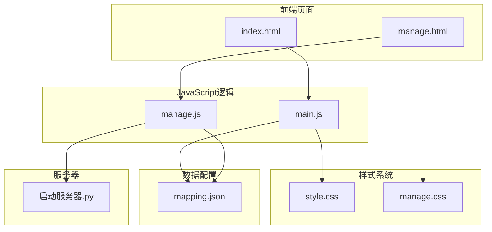
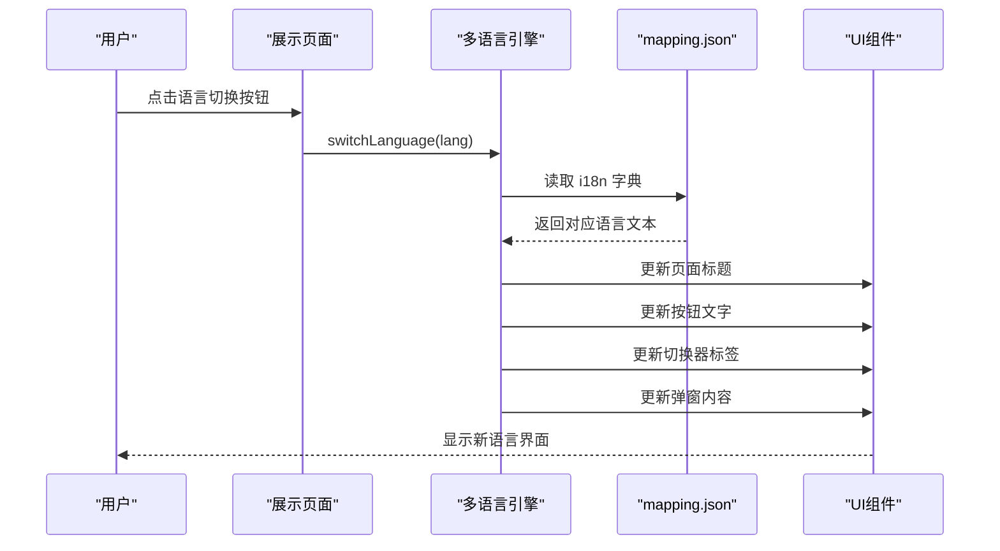
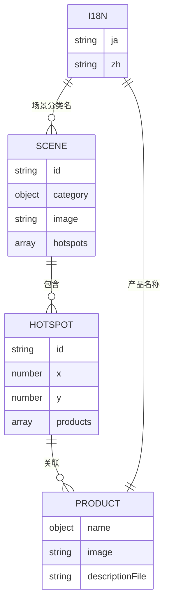

# 多语言支持系统

<cite>
**本文档引用的文件**
- [index.html](file://index.html)
- [manage.html](file://manage.html)
- [js/main.js](file://js/main.js)
- [js/manage.js](file://js/manage.js)
- [mapping.json](file://mapping.json)
- [css/style.css](file://css/style.css)
- [css/manage.css](file://css/manage.css)
- [project_architecture.md](file://project_architecture.md)
- [启动服务器.py](file://启动服务器.py)
</cite>

## 目录
1. [简介](#简介)
2. [项目结构](#项目结构)
3. [核心组件](#核心组件)
4. [架构总览](#架构总览)
5. [详细组件分析](#详细组件分析)
6. [依赖关系分析](#依赖关系分析)
7. [性能考虑](#性能考虑)
8. [故障排除指南](#故障排除指南)
9. [结论](#结论)
10. [附录](#附录)

## 简介
本项目是一个数字标牌产品展示页面，提供中日双语支持。系统通过独立的数据配置文件 mapping.json 实现数据与逻辑分离，前端通过 t() 和 getText() 函数实现多语言文本获取，支持动态语言切换、多热点渲染、产品详情弹窗等功能。本文档深入解析多语言国际化系统的实现原理，包括函数工作机制、字典结构设计、语言切换逻辑、文本替换算法以及内容管理策略。

## 项目结构
项目采用前后端分离的静态资源架构，主要文件组织如下：
- HTML 页面：index.html（展示页面）、manage.html（管理后台）
- 样式文件：css/style.css（展示样式）、css/manage.css（管理样式）
- JavaScript 逻辑：js/main.js（展示页面逻辑）、js/manage.js（管理后台逻辑）
- 数据配置：mapping.json（场景、产品、多语言配置）
- 服务器：启动服务器.py（本地开发服务器，提供 API 端点）



**图表来源**
- [index.html:1-83](file://index.html#L1-L83)
- [manage.html:1-113](file://manage.html#L1-L113)
- [js/main.js:1-1284](file://js/main.js#L1-L1284)
- [js/manage.js:1-811](file://js/manage.js#L1-L811)
- [mapping.json:1-232](file://mapping.json#L1-L232)
- [启动服务器.py:1-298](file://启动服务器.py#L1-L298)

**章节来源**
- [project_architecture.md:43-108](file://project_architecture.md#L43-L108)

## 核心组件
多语言支持系统的核心组件包括：

### 1. 多语言引擎函数
- **t() 函数**：从 i18n 字典中获取 UI 翻译文本
- **getText() 函数**：从多语言对象中获取当前语言的值
- **switchLanguage() 函数**：切换语言并刷新所有 UI 文本

### 2. 数据结构设计
- **mapping.json**：包含场景数据和 i18n 字典
- **i18n 字典**：支持 ja 和 zh 两种语言
- **多语言对象**：采用 { ja: "...", zh: "..." } 格式

### 3. 语言切换机制
- **动态更新**：切换语言时重新渲染所有 UI 文本
- **状态管理**：维护 currentLang 状态
- **回退策略**：多级回退确保文本显示

**章节来源**
- [js/main.js:76-162](file://js/main.js#L76-L162)
- [mapping.json:205-230](file://mapping.json#L205-L230)

## 架构总览
多语言支持系统采用模块化架构，各组件职责清晰：



**图表来源**
- [js/main.js:119-162](file://js/main.js#L119-L162)
- [js/main.js:1036-1094](file://js/main.js#L1036-L1094)

## 详细组件分析

### 多语言引擎实现

#### t() 函数工作机制
t() 函数负责从 i18n 字典中获取翻译文本：

```mermaid
flowchart TD
Start([调用 t(key)]) --> CheckData{"mappingData 存在?"}
CheckData --> |否| ReturnKey["返回 key 本身"]
CheckData --> |是| CheckI18n{"i18n 对象存在?"}
CheckI18n --> |否| ReturnKey
CheckI18n --> |是| CheckLang{"当前语言存在?"}
CheckLang --> |否| ReturnKey
CheckLang --> |是| GetText["获取 mappingData.i18n[currentLang][key]"]
GetText --> CheckResult{"结果存在?"}
CheckResult --> |是| ReturnText["返回翻译文本"]
CheckResult --> |否| ReturnKey
```

**图表来源**
- [js/main.js:87-92](file://js/main.js#L87-L92)

#### getText() 函数工作机制
getText() 函数处理多语言对象的获取逻辑：

```mermaid
flowchart TD
Start([调用 getText(obj)]) --> CheckType{"obj 是字符串?"}
CheckType --> |是| ReturnString["直接返回字符串"]
CheckType --> |否| CheckObj{"obj 存在?"}
CheckObj --> |否| ReturnEmpty["返回空字符串"]
CheckObj --> |是| CheckCurrent{"obj[currentLang] 存在?"}
CheckCurrent --> |是| ReturnCurrent["返回当前语言值"]
CheckCurrent --> |否| CheckJa{"obj['ja'] 存在?"}
CheckJa --> |是| ReturnJa["返回 ja 语言值"]
CheckJa --> |否| CheckValues{"Object.values(obj) 存在?"}
CheckValues --> |是| ReturnValue["返回第一个值"]
CheckValues --> |否| ReturnEmpty
```

**图表来源**
- [js/main.js:102-106](file://js/main.js#L102-L106)

#### switchLanguage() 函数实现
语言切换函数负责更新所有 UI 组件：

```mermaid
flowchart TD
Start([调用 switchLanguage(lang)]) --> CheckLang{"lang !== currentLang?"}
CheckLang --> |否| End([结束])
CheckLang --> |是| CheckExists{"目标语言存在?"}
CheckExists --> |否| End
CheckExists --> |是| UpdateState["更新 state.currentLang"]
UpdateState --> UpdateTitle["更新页面标题"]
UpdateTitle --> UpdateBack["更新返回按钮文字"]
UpdateBack --> InitCategories["重新初始化分类映射"]
InitCategories --> CreateSwitcher["重新创建分类切换器"]
CreateSwitcher --> UpdateSwitcher["更新活跃分类"]
UpdateSwitcher --> UpdateNav["更新导航按钮 aria-label"]
UpdateNav --> CheckDetail{"弹窗已打开?"}
CheckDetail --> |是| UpdateDetail["更新弹窗标题和内容"]
CheckDetail --> |否| UpdateSwitcherState["更新语言切换器状态"]
UpdateDetail --> UpdateSwitcherState
UpdateSwitcherState --> Log["记录日志"]
Log --> End
```

**图表来源**
- [js/main.js:119-162](file://js/main.js#L119-L162)

**章节来源**
- [js/main.js:87-162](file://js/main.js#L87-L162)

### 多语言字典结构设计

#### mapping.json 中的 i18n 字典
i18n 字典采用标准的双语言结构：

| 键名 | 用途 | 使用位置 |
|------|------|---------|
| `pageTitle` | 页面标题 | `document.title` |
| `companyName` | 公司名称 | 页面标题后缀 |
| `back` | 返回按钮文字 | 详情面板返回按钮 |
| `hint` | 操作提示 | 首屏底部提示文字 |
| `loading` | 加载中文案 | 产品描述加载占位符 |
| `prevScene` / `nextScene` | 导航按钮标签 | aria-label |
| `noDescription` | 无描述提示 | 产品描述加载失败降级 |
| `loadFailed` | 加载失败提示 | 可点击重试的失败提示 |
| `initError` | 初始化失败提示 | mapping.json 加载失败全屏提示 |

#### 多语言对象的嵌套结构
所有面向用户的文本均采用 `{ ja: "...", zh: "..." }` 格式：



**图表来源**
- [mapping.json:120-206](file://mapping.json#L120-L206)

**章节来源**
- [mapping.json:205-230](file://mapping.json#L205-L230)
- [project_architecture.md:177-220](file://project_architecture.md#L177-L220)

### 语言切换逻辑实现

#### 动态更新机制
语言切换时的更新流程包括：

1. **状态更新**：更新 state.currentLang
2. **页面标题**：更新 document.title 和 document.documentElement.lang
3. **按钮文字**：更新返回按钮的文字
4. **分类映射**：重新初始化 sceneCategories
5. **切换器重建**：重新创建分类切换器按钮
6. **导航更新**：更新导航按钮的 aria-label
7. **弹窗处理**：如果弹窗已打开，重新渲染弹窗内容
8. **界面状态**：更新语言切换器按钮的活跃状态

#### 语言检测与偏好设置
系统采用以下策略处理语言检测：

- **默认语言**：页面加载时默认使用 'ja' 语言
- **用户偏好**：通过语言切换器按钮手动选择
- **动态回退**：getText() 函数提供多级回退机制

**章节来源**
- [js/main.js:119-162](file://js/main.js#L119-L162)
- [js/main.js:1036-1094](file://js/main.js#L1036-L1094)

### 文本替换算法

#### 占位符处理机制
系统支持多种文本替换场景：

1. **UI 文本替换**：通过 t() 函数从 i18n 字典获取翻译
2. **多语言对象处理**：通过 getText() 函数获取当前语言的值
3. **动态内容更新**：语言切换时自动更新所有相关文本

#### 参数传递与格式化
虽然当前实现主要使用简单的文本替换，但系统架构支持：

- **参数化文本**：可通过扩展 t() 函数支持参数占位符
- **格式化选项**：支持日期、数字等格式化需求
- **复数形式**：可扩展支持不同语言的复数规则

**章节来源**
- [js/main.js:87-106](file://js/main.js#L87-L106)

## 依赖关系分析

### 组件耦合度分析
多语言系统与其他组件的依赖关系：

```mermaid
graph TB
subgraph "多语言引擎"
T[t() 函数]
GT[getText() 函数]
SL[switchLanguage() 函数]
end
subgraph "数据层"
MD[mappingData]
I18N[i18n 字典]
end
subgraph "UI 层"
UI1[页面标题]
UI2[按钮文字]
UI3[切换器标签]
UI4[弹窗内容]
end
subgraph "状态管理"
ST[state.currentLang]
SC[sceneCategories]
end
T --> I18N
GT --> I18N
SL --> ST
SL --> SC
T --> UI1
T --> UI2
T --> UI3
T --> UI4
GT --> UI4
MD --> T
MD --> GT
```

**图表来源**
- [js/main.js:76-162](file://js/main.js#L76-L162)
- [js/main.js:195-204](file://js/main.js#L195-L204)

### 外部依赖与集成点
- **marked.js**：用于 Markdown 解析（CDN 引入）
- **本地服务器**：Python HTTP 服务器提供 API 端点
- **浏览器 API**：使用 fetch API 加载数据

**章节来源**
- [index.html:9-10](file://index.html#L9-L10)
- [启动服务器.py:25-98](file://启动服务器.py#L25-L98)

## 性能考虑
多语言系统在性能方面的优化策略：

### 1. 缓存机制
- **i18n 字典缓存**：通过 mappingData 全局变量缓存已加载的字典
- **描述文件缓存**：descriptionCache 对象缓存已加载的 Markdown 文件
- **图片预加载缓存**：state.preloadedImages 缓存预加载的图片

### 2. 异步加载
- **数据异步加载**：使用 Promise 和 async/await 处理异步操作
- **并行加载**：产品描述文件采用 Promise.all 并行加载
- **重试机制**：数据加载失败时自动重试

### 3. 内存管理
- **事件监听器清理**：使用 { once: true } 防止内存泄漏
- **DOM 元素复用**：通过动态更新而非频繁创建销毁元素
- **超时保护**：图片加载和描述加载都有超时机制

## 故障排除指南

### 常见问题及解决方案

#### 1. 编码问题
**问题**：中文显示乱码
**原因**：字符编码设置不当
**解决方案**：
- 确保 HTML 文件使用 UTF-8 编码
- 服务器响应头设置正确的字符集
- Python 服务器正确处理 UTF-8 编码

#### 2. 显示异常
**问题**：语言切换后文本未更新
**原因**：状态更新不完整或 UI 未重新渲染
**解决方案**：
- 检查 switchLanguage() 函数的完整执行
- 确认所有 UI 组件都被正确更新
- 验证 state.currentLang 状态的正确性

#### 3. 性能优化
**问题**：页面加载缓慢
**原因**：图片和描述文件过多
**解决方案**：
- 使用图片预加载策略
- 实现懒加载机制
- 优化描述文件的缓存策略

#### 4. API 通信问题
**问题**：管理后台无法保存配置
**原因**：CORS 配置或服务器端点问题
**解决方案**：
- 检查 CORS 响应头设置
- 验证 API 端点的正确性
- 确认文件权限和路径

**章节来源**
- [启动服务器.py:28-47](file://启动服务器.py#L28-L47)
- [js/main.js:421-442](file://js/main.js#L421-L442)

## 结论
本项目的多语言支持系统实现了完整的国际化功能，具有以下特点：

1. **模块化设计**：多语言引擎独立封装，便于维护和扩展
2. **数据分离**：通过 mapping.json 实现数据与逻辑分离
3. **动态更新**：支持运行时语言切换和 UI 动态更新
4. **容错机制**：提供多级回退和错误处理
5. **性能优化**：采用缓存、异步加载和超时保护等策略

系统架构清晰，代码结构合理，为后续的功能扩展和维护提供了良好的基础。

## 附录

### 最佳实践指南

#### 1. 语言包组织
- **统一命名规范**：使用清晰的键名和层级结构
- **分组管理**：按功能模块组织 i18n 键值
- **版本控制**：为 i18n 字典建立版本管理

#### 2. 翻译质量保证
- **术语统一**：建立术语表确保翻译一致性
- **上下文标注**：为复杂文本提供上下文说明
- **多轮校对**：建立翻译校对流程

#### 3. 用户体验优化
- **渐进式加载**：先显示基本内容，再加载翻译
- **错误优雅降级**：翻译缺失时使用默认语言
- **性能监控**：监控多语言功能的性能表现

### 多语言内容管理策略

#### 1. 翻译维护
- **定期审查**：定期检查翻译质量和一致性
- **用户反馈**：建立用户反馈渠道
- **自动化测试**：编写测试用例验证翻译正确性

#### 2. 版本同步
- **版本跟踪**：记录 i18n 字典的版本变更
- **向后兼容**：确保新版本的向后兼容性
- **回滚机制**：提供快速回滚能力

#### 3. 一致性检查
- **键名一致性**：确保所有语言的键名一致
- **格式一致性**：统一文本格式和样式
- **语义一致性**：保持语义表达的一致性