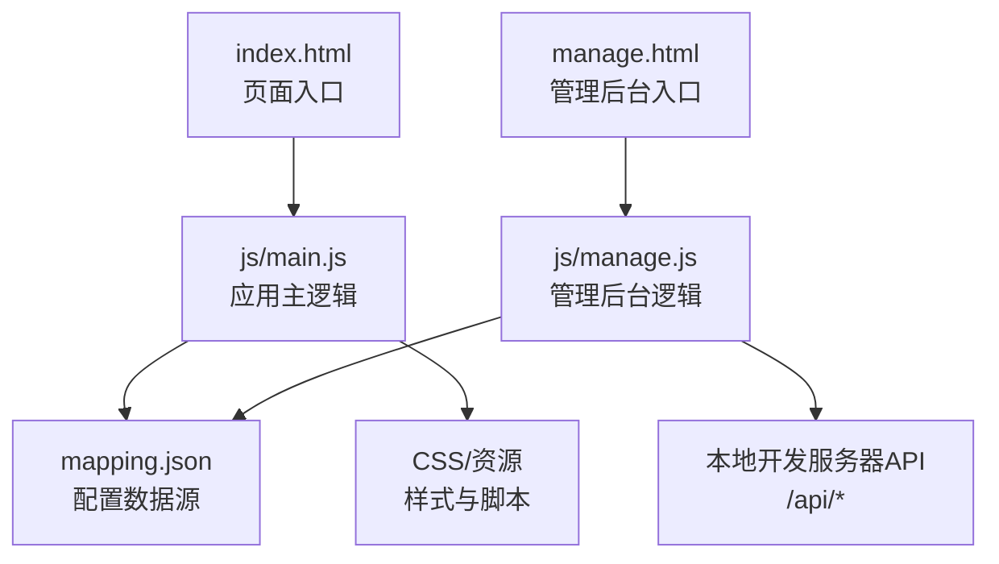
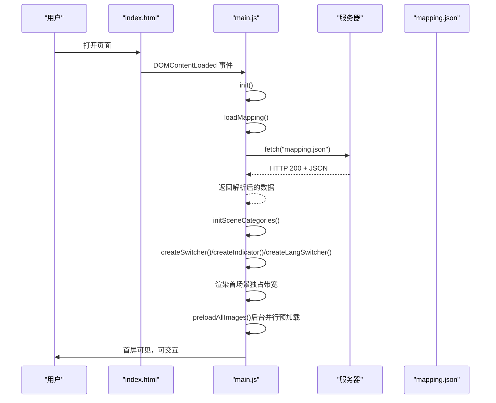
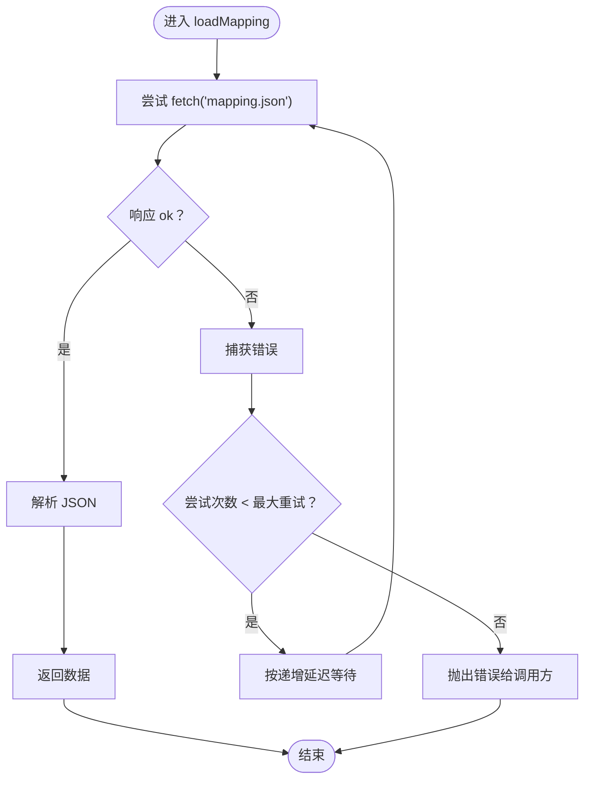
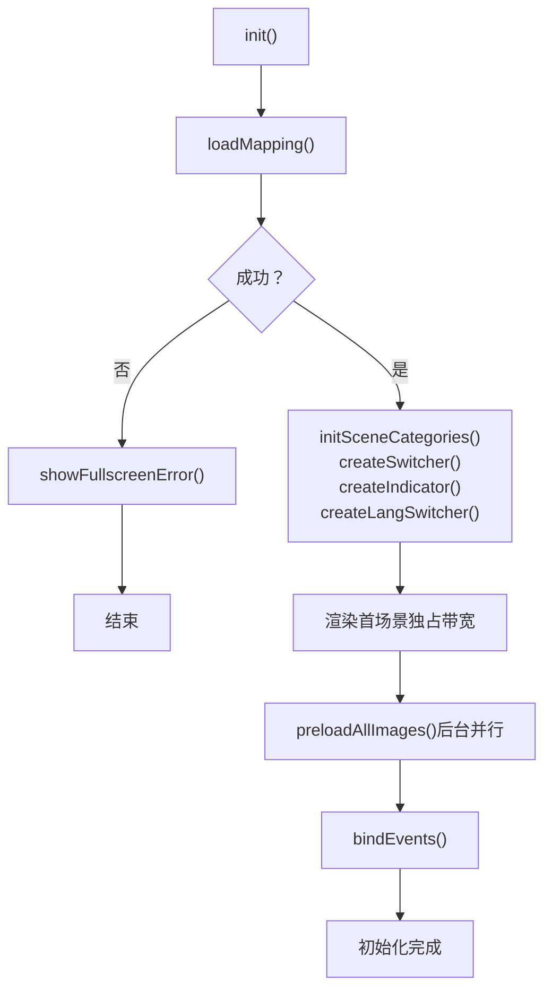
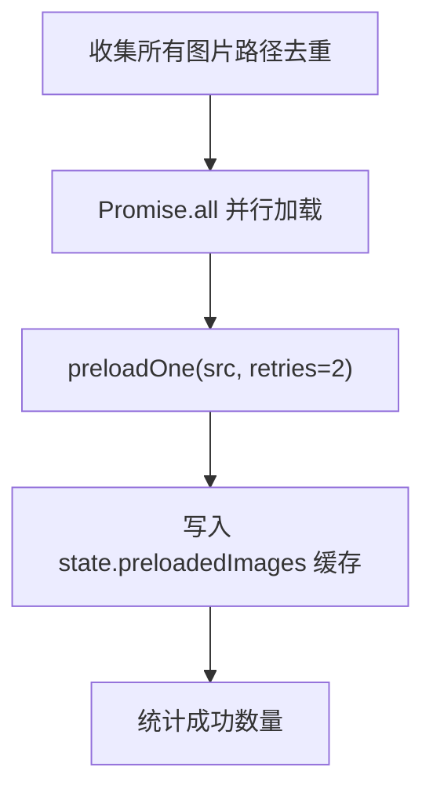
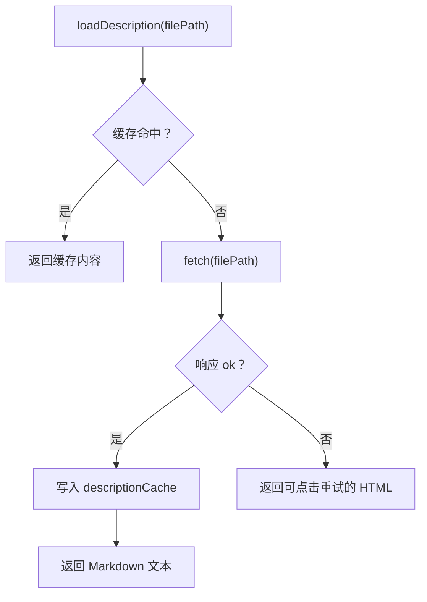
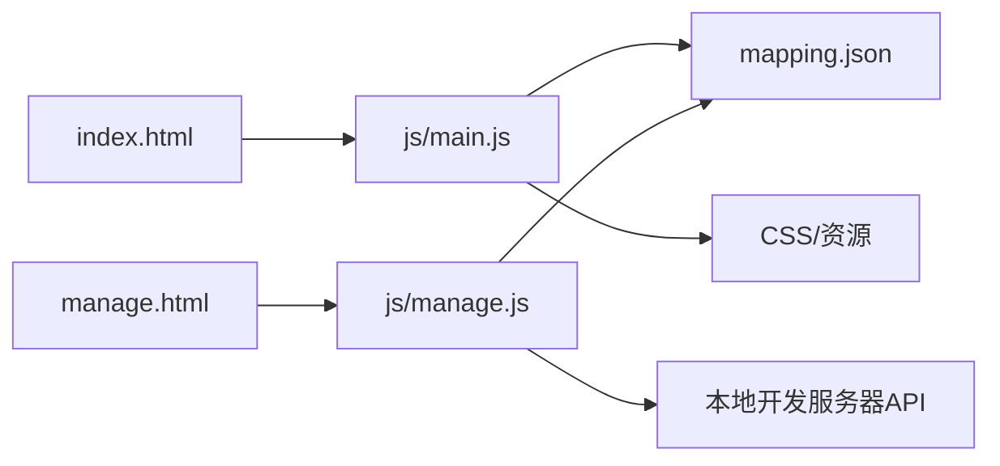

# 数据加载机制

<cite>
**本文档引用的文件**
- [mapping.json](file://mapping.json)
- [main.js](file://js/main.js)
- [index.html](file://index.html)
- [manage.html](file://manage.html)
- [manage.js](file://js/manage.js)
- [project_architecture.md](file://project_architecture.md)
</cite>

## 目录
1. [简介](#简介)
2. [项目结构](#项目结构)
3. [核心组件](#核心组件)
4. [架构总览](#架构总览)
5. [详细组件分析](#详细组件分析)
6. [依赖关系分析](#依赖关系分析)
7. [性能考量](#性能考量)
8. [故障排除指南](#故障排除指南)
9. [结论](#结论)

## 简介
本文件聚焦数字标牌项目的数据加载机制，系统性阐述前端如何从 mapping.json 加载配置数据，涵盖异步加载流程、文件读取策略、缓存与重试机制、并行预加载、依赖关系管理、加载进度与错误处理、数据验证与清理、性能优化与调试方法。目标是帮助开发者全面理解并高效维护数据加载子系统。

## 项目结构
- 前端展示页：index.html + js/main.js
- 管理后台：manage.html + js/manage.js
- 配置数据：mapping.json
- 架构说明：project_architecture.md

图表来源
- [index.html:1-83](file://index.html#L1-L83)
- [main.js:1197-1284](file://js/main.js#L1197-L1284)
- [manage.html:1-113](file://manage.html#L1-L113)
- [manage.js:18-31](file://js/manage.js#L18-L31)

章节来源
- [index.html:1-83](file://index.html#L1-L83)
- [manage.html:1-113](file://manage.html#L1-L113)
- [project_architecture.md:446-501](file://project_architecture.md#L446-L501)

## 核心组件
- 数据加载模块（从 mapping.json 动态加载，含重试机制）
- 多语言引擎（中文/日文切换）
- DOM 元素引用与状态管理
- 图片预加载（全场景图片+产品图片预加载，含重试机制）
- Markdown 说明缓存与加载
- 场景渲染与切换（交叉淡入淡出，图片加载等待）
- 多热点渲染与交互（单场景多热点支持）
- 详细面板与动画（多产品 + 左图右文）
- 语言切换器
- 事件绑定与初始化

章节来源
- [main.js:1-27](file://js/main.js#L1-L27)
- [project_architecture.md:446-501](file://project_architecture.md#L446-L501)

## 架构总览
前端应用的初始化流程严格遵循“先数据、后渲染”的顺序：首先通过 loadMapping() 从 mapping.json 加载配置，随后初始化 UI、渲染首屏场景，并在首屏显示后再进行后台图片预加载，从而保证首屏体验与后续流畅度的平衡。

图表来源
- [main.js:1197-1284](file://js/main.js#L1197-L1284)
- [main.js:49-73](file://js/main.js#L49-L73)
- [index.html:1-83](file://index.html#L1-L83)

## 详细组件分析

### 数据加载模块与 loadMapping() 实现
- 目标：从 mapping.json 异步加载配置数据，支持最多 3 次重试，递增延迟（500ms → 1000ms → 2000ms），最终失败时抛出错误交由调用方处理。
- 关键点：
  - 使用 fetch API 发起请求，校验响应状态，解析 JSON。
  - 重试循环中对每次失败记录警告日志，并按延迟策略等待后重试。
  - 成功后返回解析后的对象，供后续模块使用。
- 错误处理：调用方（init）捕获异常并显示全屏错误提示，避免白屏。

图表来源
- [main.js:49-73](file://js/main.js#L49-L73)

章节来源
- [main.js:49-73](file://js/main.js#L49-L73)
- [project_architecture.md:619-640](file://project_architecture.md#L619-L640)

### 初始化与错误回退
- init() 作为应用入口，负责：
  - 调用 loadMapping() 获取 mappingData。
  - 初始化场景分类映射、创建 UI 元素、渲染首场景。
  - 首场景加载完成后启动后台图片预加载。
  - 若 loadMapping() 抛错，显示全屏错误提示，阻止后续渲染。
- 首屏独占带宽策略：首场景完全显示后再启动预加载，避免慢速网络下带宽竞争导致首图长时间不显示。

图表来源
- [main.js:1197-1284](file://js/main.js#L1197-L1284)
- [main.js:1173-1178](file://js/main.js#L1173-L1178)

章节来源
- [main.js:1197-1284](file://js/main.js#L1197-L1284)
- [main.js:1173-1178](file://js/main.js#L1173-L1178)

### 图片预加载与并行优化
- 目标：将所有场景图与产品图预先下载至浏览器缓存，减少切换时的加载等待。
- 策略：
  - 去重收集所有图片路径（场景图 + 产品图）。
  - 并行加载（Promise.all），逐张图片重试（默认 2 次，递增延迟）。
  - 缓存已预加载图片，避免重复请求。
- 性能收益：首屏独占带宽策略 + 后台并行预加载，兼顾首屏可见性与后续切换流畅度。

图表来源
- [main.js:257-327](file://js/main.js#L257-L327)

章节来源
- [main.js:257-327](file://js/main.js#L257-L327)

### Markdown 描述加载与缓存
- 目标：按需加载产品说明 Markdown 文件，避免重复请求。
- 策略：
  - 使用 descriptionCache 缓存已加载内容。
  - fetch 失败时返回带可点击重试的 HTML 片段，绑定点击事件后清除缓存并重新加载。
  - marked.js 未加载时进行降级处理（转义 + 换行）。
- 适用场景：详情面板渲染产品描述时使用。

图表来源
- [main.js:421-442](file://js/main.js#L421-L442)

章节来源
- [main.js:421-442](file://js/main.js#L421-L442)
- [project_architecture.md:642-647](file://project_architecture.md#L642-L647)

### 数据验证与清理
- 数据完整性：
  - loadMapping() 仅在 response.ok 时解析 JSON，否则抛错，避免污染全局状态。
  - renderScene() 在图片加载失败/超时时不渲染热点，防止“黑屏上出现孤立热点”。
- 清理与回收：
  - 弹窗关闭后清理 DOM 与状态（例如 state.currentProducts = null），避免内存泄漏。
  - 图片加载等待 waitForImageLoad 使用一次性监听器（{ once: true }），防止监听器累积。

章节来源
- [main.js:55-58](file://js/main.js#L55-L58)
- [main.js:545-555](file://js/main.js#L545-L555)
- [main.js:354-395](file://js/main.js#L354-L395)
- [project_architecture.md:600-607](file://project_architecture.md#L600-L607)

### 管理后台的数据加载（对比参考）
- 管理后台通过 fetch('mapping.json') 加载配置，失败时降级为默认空数据结构，保证后台可用性。
- 同时加载可用图片与描述文件列表，便于编辑时选择。

章节来源
- [manage.js:35-46](file://js/manage.js#L35-L46)
- [manage.js:48-72](file://js/manage.js#L48-L72)

## 依赖关系分析
- main.js 依赖 mapping.json 提供的场景、热点、产品与多语言配置。
- index.html 作为入口，加载 main.js 并提供 DOM 结构。
- 管理后台（manage.js）同样依赖 mapping.json，并通过本地开发服务器 API 获取文件列表与保存配置。

图表来源
- [index.html:1-83](file://index.html#L1-L83)
- [main.js:1197-1284](file://js/main.js#L1197-L1284)
- [manage.html:1-113](file://manage.html#L1-L113)
- [manage.js:18-31](file://js/manage.js#L18-L31)

章节来源
- [index.html:1-83](file://index.html#L1-L83)
- [manage.html:1-113](file://manage.html#L1-L113)
- [project_architecture.md:763-777](file://project_architecture.md#L763-L777)

## 性能考量
- 首屏独占带宽策略：首场景完全显示后再启动后台预加载，避免慢速网络下首图长时间不显示。
- 并行加载：Promise.all 并行预加载图片，提升整体加载效率。
- 缓存利用：图片与 Markdown 内容均采用缓存，避免重复请求。
- 超时保护：图片加载等待与场景切换均设置超时，防止长时间阻塞。
- 懒加载：场景缩略图采用懒加载属性，减少初始带宽占用。

章节来源
- [main.js:1191-1196](file://js/main.js#L1191-L1196)
- [main.js:322-327](file://js/main.js#L322-L327)
- [main.js:354-395](file://js/main.js#L354-L395)
- [manage.js:127-129](file://js/manage.js#L127-L129)

## 故障排除指南
- mapping.json 加载失败：
  - 现象：首屏显示全屏错误提示。
  - 排查：检查网络请求状态、CORS 配置、文件路径与权限。
  - 处理：根据错误提示刷新页面，必要时检查本地开发服务器状态。
- 图片加载失败/超时：
  - 现象：场景切换时出现加载指示器或热点未显示。
  - 排查：确认图片路径正确、服务器可达、网络稳定。
  - 处理：等待重试或检查图片缓存状态。
- Markdown 加载失败：
  - 现象：产品描述区域显示“点击重试”提示。
  - 排查：确认描述文件存在且可访问。
  - 处理：点击重试后清除缓存重新加载。
- 管理后台无法加载数据：
  - 现象：后台空白或报错。
  - 排查：检查本地开发服务器 API 端点是否可用。
  - 处理：重启本地服务器或检查 CORS 设置。

章节来源
- [main.js:1200-1206](file://js/main.js#L1200-L1206)
- [main.js:515-525](file://js/main.js#L515-L525)
- [main.js:436-441](file://js/main.js#L436-L441)
- [manage.js:37-46](file://js/manage.js#L37-L46)

## 结论
本项目的数据加载机制以 mapping.json 为核心，结合 fetch API、Promise 链式调用与重试策略，实现了稳健的异步加载与错误回退。通过首屏独占带宽、并行预加载与缓存策略，兼顾了首屏体验与后续流畅度。配合 Markdown 缓存与一次性事件监听等细节优化，进一步提升了稳定性与性能。建议在生产环境中持续监控加载指标与错误率，按需扩展缓存与分块加载策略以适应更大规模的数据集。