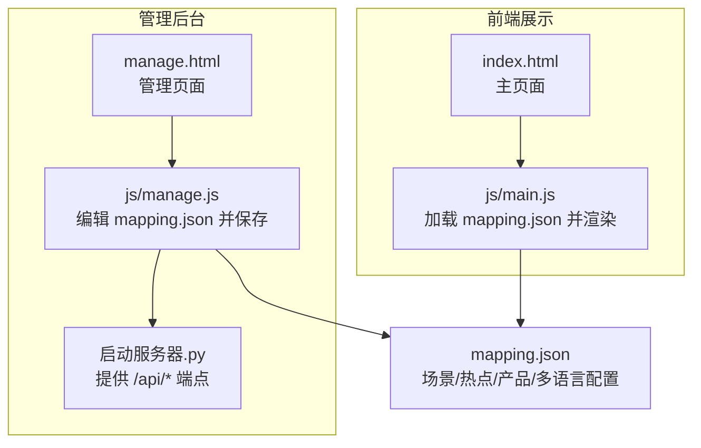
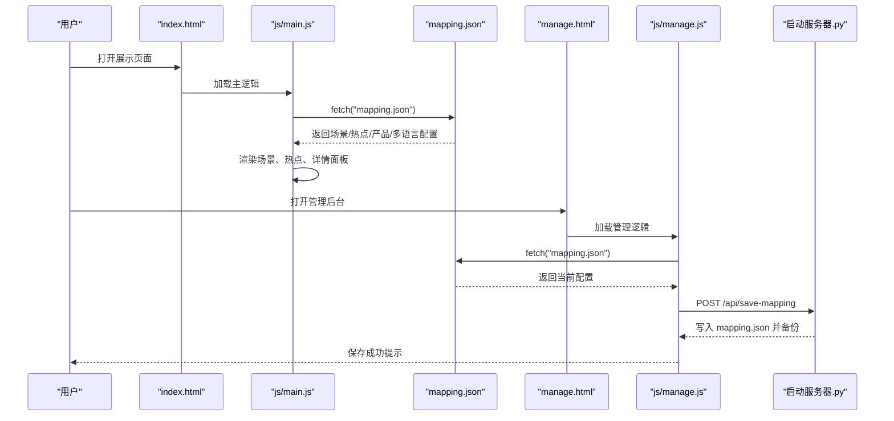
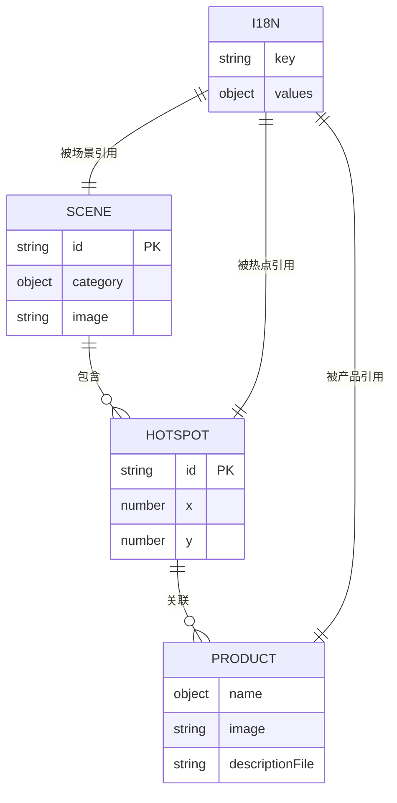

# 数据模型定义

<cite>
**本文引用的文件**
- [mapping.json](file://mapping.json)
- [project_architecture.md](file://project_architecture.md)
- [index.html](file://index.html)
- [manage.html](file://manage.html)
- [js/main.js](file://js/main.js)
- [js/manage.js](file://js/manage.js)
- [启动服务器.py](file://启动服务器.py)
- [产品描述/电子水牌.md](file://产品描述/电子水牌.md)
- [产品描述/自助点单机1.md](file://产品描述/自助点单机1.md)
</cite>

## 目录
1. [简介](#简介)
2. [项目结构](#项目结构)
3. [核心组件](#核心组件)
4. [架构总览](#架构总览)
5. [详细组件分析](#详细组件分析)
6. [依赖分析](#依赖分析)
7. [性能考量](#性能考量)
8. [故障排查指南](#故障排查指南)
9. [结论](#结论)
10. [附录](#附录)

## 简介
本文件聚焦于数字标牌项目的数据模型定义，围绕 mapping.json 中的核心数据结构进行系统化说明。重点覆盖场景对象（scenes）、热点对象（hotspots）和产品对象（products）的字段定义、数据类型、取值范围与约束条件；给出完整的 JSON Schema 规范；解释设计原则（层次关系、引用关系、数据一致性）；阐述版本控制机制（version 字段与向后兼容策略）；并提供最佳实践（命名规范、字段组织、扩展性考虑）以及字段示例与数据验证规则，帮助开发者正确理解与使用数据模型。

## 项目结构
项目采用“数据与逻辑分离”的架构：前端通过动态加载 mapping.json 获取场景、热点与产品配置；管理后台通过本地开发服务器提供的 API 读写 mapping.json，实现可视化编辑。项目还包含多语言字典（i18n）与配套资源（场景图、产品图、产品描述 Markdown）。

图表来源
- [index.html:1-83](file://index.html#L1-L83)
- [js/main.js:1-200](file://js/main.js#L1-L200)
- [manage.html:1-113](file://manage.html#L1-L113)
- [js/manage.js:1-200](file://js/manage.js#L1-L200)
- [启动服务器.py:1-200](file://启动服务器.py#L1-L200)
- [mapping.json:1-232](file://mapping.json#L1-L232)

章节来源
- [project_architecture.md:112-126](file://project_architecture.md#L112-L126)
- [project_architecture.md:446-501](file://project_architecture.md#L446-L501)

## 核心组件
本节对 mapping.json 的三大核心对象进行字段级定义与约束说明。

- 根对象
  - version: 字符串，版本号，用于标识数据模型版本，便于向后兼容与迁移。
  - scenes: 数组，场景对象集合。
  - i18n: 对象，多语言字典，键为语言代码（如 ja、zh），值为键值对映射。

- 场景对象（scene）
  - id: 字符串，唯一标识，建议遵循“scene_编号”格式。
  - category: 对象，多语言分类名，键为语言代码，值为对应语言的分类文本。
  - image: 字符串，场景图路径（相对项目根目录），指向场景图资源。
  - hotspots: 数组，该场景下的热点集合。

- 热点对象（hotspot）
  - id: 字符串，唯一标识，建议遵循“hs_编号”格式。
  - x: 数值，水平百分比坐标（0~100），0 表示最左，100 表示最右。
  - y: 数值，垂直百分比坐标（0~100），0 表示最上，100 表示最下。
  - products: 数组，该热点关联的产品集合。

- 产品对象（product）
  - name: 对象，多语言产品名称，键为语言代码，值为对应语言的产品名。
  - image: 字符串，产品图路径（相对项目根目录），指向产品白底图资源。
  - descriptionFile: 字符串，产品描述 Markdown 文件路径（相对项目根目录）。

- 多语言字典（i18n）
  - 键：语言代码（如 ja、zh）。
  - 值：键值对映射，涵盖页面标题、公司名、按钮文案、提示文本、错误信息等。

章节来源
- [mapping.json:1-232](file://mapping.json#L1-L232)
- [project_architecture.md:118-176](file://project_architecture.md#L118-L176)

## 架构总览
数据模型与前端渲染、管理后台的关系如下：

图表来源
- [js/main.js:49-73](file://js/main.js#L49-L73)
- [js/manage.js:36-46](file://js/manage.js#L36-L46)
- [启动服务器.py:101-127](file://启动服务器.py#L101-L127)
- [mapping.json:1-232](file://mapping.json#L1-L232)

## 详细组件分析

### 场景对象（scene）
- 字段定义与约束
  - id: 字符串，唯一标识，建议使用“scene_三位数”等统一格式，便于排序与检索。
  - category: 对象，键为语言代码（如 ja、zh），值为分类文本；前端通过 getText() 获取当前语言值。
  - image: 字符串，场景图路径，需指向项目根目录下的场景图资源；建议使用 .webp 格式。
  - hotspots: 数组，可为空；若为空则该场景无任何热点。

- 设计原则
  - 层次关系：场景包含多个热点，热点再关联多个产品，形成“场景→热点→产品”的树状结构。
  - 引用关系：前端通过 id 引用场景与热点，确保交互与渲染的一致性。
  - 数据一致性：同一场景内的热点坐标应在 0~100 范围内；热点与产品路径需真实存在。

- 示例与验证规则
  - id 必须唯一且符合命名规范。
  - category 至少包含当前语言键（如 ja 或 zh）。
  - image 与 descriptionFile 路径需与实际资源一致。
  - hotspots 数组可为空，但若存在，每个热点对象需满足热点字段约束。

章节来源
- [mapping.json:3-204](file://mapping.json#L3-L204)
- [project_architecture.md:128-157](file://project_architecture.md#L128-L157)

### 热点对象（hotspot）
- 字段定义与约束
  - id: 字符串，唯一标识，建议使用“hs_三位数”等统一格式。
  - x: 数值，0~100 的百分比，0 表示最左，100 表示最右。
  - y: 数值，0~100 的百分比，0 表示最上，100 表示最下。
  - products: 数组，可为空；若为空则该热点无产品。

- 设计原则
  - 精确定位：热点坐标以百分比形式存储，适配不同分辨率与容器尺寸。
  - 多产品支持：单个热点可关联多个产品，满足复杂场景需求。
  - 交互一致性：热点与产品列表在前端渲染时一一对应，点击热点打开详情面板。

- 示例与验证规则
  - x、y 必须为数值且在 0~100 闭区间。
  - products 数组可为空，但若存在，每个产品对象需满足产品字段约束。

章节来源
- [mapping.json:8-21](file://mapping.json#L8-L21)
- [project_architecture.md:159-166](file://project_architecture.md#L159-L166)

### 产品对象（product）
- 字段定义与约束
  - name: 对象，多语言产品名称，键为语言代码，值为对应语言的产品名。
  - image: 字符串，产品图路径，指向项目根目录下的产品白底图资源。
  - descriptionFile: 字符串，产品描述 Markdown 文件路径，指向项目根目录下的描述文件。

- 设计原则
  - 多语言支持：产品名称与描述均支持多语言，前端通过 getText() 与 t() 获取当前语言值。
  - 资源解耦：产品图与描述文件路径与场景图解耦，便于独立维护与替换。
  - 渲染优化：前端对描述文件进行缓存与并行加载，失败时提供可点击重试提示。

- 示例与验证规则
  - name 至少包含当前语言键（如 ja 或 zh）。
  - image 与 descriptionFile 路径需与实际资源一致，且可被静态服务器访问。
  - 描述文件可为空或缺失，前端提供降级提示。

章节来源
- [mapping.json:13-19](file://mapping.json#L13-L19)
- [project_architecture.md:168-175](file://project_architecture.md#L168-L175)

### 多语言字典（i18n）
- 字段定义与约束
  - 键：语言代码（如 ja、zh）。
  - 值：键值对映射，涵盖页面标题、公司名、按钮文案、提示文本、错误信息等。

- 设计原则
  - 面向用户的文本统一管理，避免硬编码。
  - getText() 与 t() 提供回退逻辑，确保在缺失键时仍能显示合理文本。

- 示例与验证规则
  - 每个语言键至少包含常用 UI 文本键（如 pageTitle、back、hint 等）。
  - 未找到键时，getText() 会回退到 ja 或第一个可用值，最终为空时返回空字符串。

章节来源
- [mapping.json:205-230](file://mapping.json#L205-L230)
- [project_architecture.md:177-218](file://project_architecture.md#L177-L218)

### JSON Schema 定义
以下为 mapping.json 的 JSON Schema 定义（字段与约束）：

- 根对象
  - version: 字符串，必填，版本号。
  - scenes: 数组，必填，元素为场景对象。
  - i18n: 对象，必填，键为语言代码，值为键值对映射。

- 场景对象（scene）
  - id: 字符串，必填，唯一标识。
  - category: 对象，必填，键为语言代码，值为字符串。
  - image: 字符串，必填，场景图路径。
  - hotspots: 数组，可选，元素为热点对象。

- 热点对象（hotspot）
  - id: 字符串，必填，唯一标识。
  - x: 数值，必填，0~100。
  - y: 数值，必填，0~100。
  - products: 数组，可选，元素为产品对象。

- 产品对象（product）
  - name: 对象，必填，键为语言代码，值为字符串。
  - image: 字符串，必填，产品图路径。
  - descriptionFile: 字符串，必填，描述文件路径。

- 多语言字典（i18n）
  - 键：语言代码（如 ja、zh），必填。
  - 值：键值对映射，键为 UI 文本键，值为字符串。

章节来源
- [mapping.json:1-232](file://mapping.json#L1-L232)
- [project_architecture.md:118-176](file://project_architecture.md#L118-L176)

### 版本控制机制
- version 字段
  - 作用：标识数据模型版本，便于前端与管理后台识别数据结构变化。
  - 前端行为：前端通过 loadMapping() 加载 mapping.json，若版本不匹配，可触发兼容处理或提示升级。
  - 管理后台行为：保存时将新版本写入 mapping.json，同时保留旧版本备份（见服务器 API）。

- 向后兼容策略
  - 新增字段：旧版本数据可包含新字段，前端忽略未知字段。
  - 删除字段：旧版本数据可缺少新字段，前端提供默认值或降级处理。
  - 字段类型变更：若类型变更，需在前端做类型转换或提供兼容逻辑。
  - 服务器 API：保存时先备份原文件，确保可回滚。

章节来源
- [mapping.json](file://mapping.json#L2)
- [project_architecture.md:112-126](file://project_architecture.md#L112-L126)
- [启动服务器.py:101-127](file://启动服务器.py#L101-L127)

### 最佳实践
- 命名规范
  - id：使用“scene_编号”、“hs_编号”等统一前缀与数字编号，便于排序与检索。
  - 路径：image 与 descriptionFile 使用相对项目根目录的路径，避免绝对路径。
  - 语言键：category 与 name 的语言键使用 ja、zh 等标准代码。

- 字段组织
  - 必填字段优先：version、scenes、i18n、id、category、image、hotspots、name、image、descriptionFile。
  - 可选字段：hotspots、products 可为空，但需保持结构一致。

- 扩展性考虑
  - 新增场景：在 scenes 数组中追加新场景对象，保持字段结构一致。
  - 新增热点：在场景的 hotspots 数组中追加热点对象，注意 x、y 坐标范围。
  - 新增产品：在热点的 products 数组中追加产品对象，确保资源路径有效。
  - 多语言扩展：在 i18n 中新增语言键，前端通过 getText() 与 t() 自动回退。

- 数据一致性保证
  - 前端渲染：通过 getText() 与 t() 获取当前语言值，确保 UI 文本一致。
  - 资源校验：image 与 descriptionFile 路径需真实存在，否则前端提供降级提示。
  - 服务器备份：保存 mapping.json 时先备份，确保可回滚。

章节来源
- [project_architecture.md:112-176](file://project_architecture.md#L112-L176)
- [启动服务器.py:101-127](file://启动服务器.py#L101-L127)

## 依赖分析
数据模型的依赖关系如下：

图表来源
- [mapping.json:1-232](file://mapping.json#L1-L232)

章节来源
- [mapping.json:1-232](file://mapping.json#L1-L232)

## 性能考量
- 资源加载
  - 前端对场景图、产品图与描述文件进行预加载与缓存，减少重复请求。
  - 描述文件加载失败时提供可点击重试提示，提升用户体验。

- 渲染优化
  - 双层图片交叉淡入淡出，避免首屏黑屏。
  - 多热点动画延迟分散，避免同时播放造成卡顿。

- 服务器端
  - 本地开发服务器提供 /api/save-mapping 与 /api/upload-image，支持批量保存与图片上传。
  - 保存前自动备份，确保可回滚。

章节来源
- [project_architecture.md:463-501](file://project_architecture.md#L463-L501)
- [启动服务器.py:101-200](file://启动服务器.py#L101-L200)

## 故障排查指南
- mapping.json 加载失败
  - 现象：展示页面全屏错误提示，无法初始化。
  - 处理：检查 mapping.json 路径与权限，确认服务器端口与 CORS 设置。
  - 参考：前端 loadMapping() 重试机制与错误提示。

- 热点坐标异常
  - 现象：热点位置不正确或超出边界。
  - 处理：确保 x、y 为 0~100 的数值；检查场景图尺寸与容器比例。

- 资源路径无效
  - 现象：场景图、产品图或描述文件加载失败。
  - 处理：确认 image 与 descriptionFile 路径与实际资源一致；检查服务器静态文件服务。

- 语言切换异常
  - 现象：切换语言后 UI 文本未更新。
  - 处理：确认 i18n 中包含目标语言键；检查 getText() 与 t() 回退逻辑。

章节来源
- [js/main.js:49-73](file://js/main.js#L49-L73)
- [js/main.js:119-162](file://js/main.js#L119-L162)
- [project_architecture.md:565-580](file://project_architecture.md#L565-L580)

## 结论
mapping.json 作为数字标牌项目的核心数据模型，实现了场景、热点与产品之间的清晰层次关系与多语言支持。通过明确的字段定义、约束条件与版本控制机制，项目在前端渲染与管理后台编辑之间建立了稳定的数据契约。遵循本文的最佳实践与验证规则，可确保数据模型的可维护性、可扩展性与一致性。

## 附录
- 字段示例与验证规则
  - 场景对象：id 唯一、category 包含当前语言键、image 有效、hotspots 可为空。
  - 热点对象：id 唯一、x/y 在 0~100、products 可为空。
  - 产品对象：name 包含当前语言键、image/descriptionFile 有效。
  - 多语言字典：每种语言至少包含常用 UI 文本键。

- 相关文件
  - mapping.json：数据模型主体。
  - project_architecture.md：项目架构与数据模型说明。
  - index.html/js/main.js：前端加载与渲染逻辑。
  - manage.html/js/manage.js：管理后台编辑与保存逻辑。
  - 启动服务器.py：API 端点与文件操作。

章节来源
- [mapping.json:1-232](file://mapping.json#L1-L232)
- [project_architecture.md:112-234](file://project_architecture.md#L112-L234)
- [index.html:1-83](file://index.html#L1-L83)
- [js/main.js:1-200](file://js/main.js#L1-L200)
- [manage.html:1-113](file://manage.html#L1-L113)
- [js/manage.js:1-200](file://js/manage.js#L1-L200)
- [启动服务器.py:1-200](file://启动服务器.py#L1-L200)