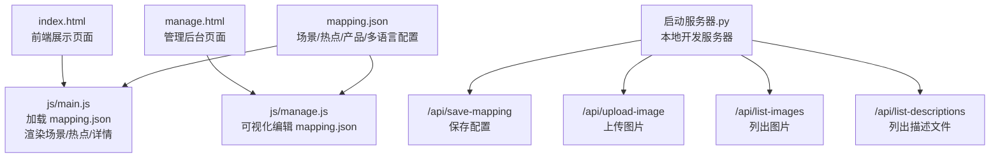
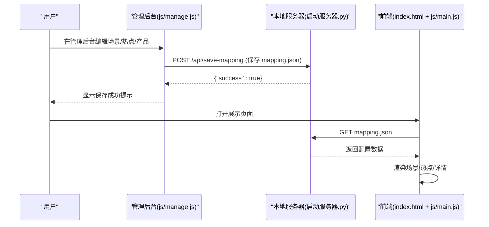
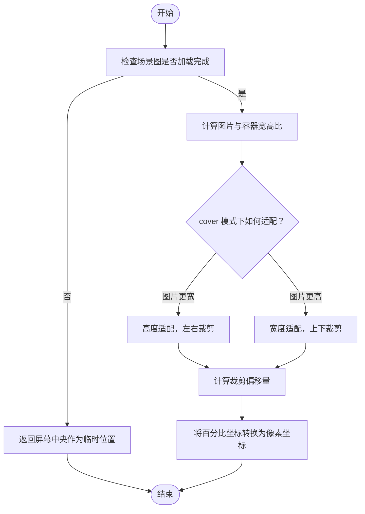
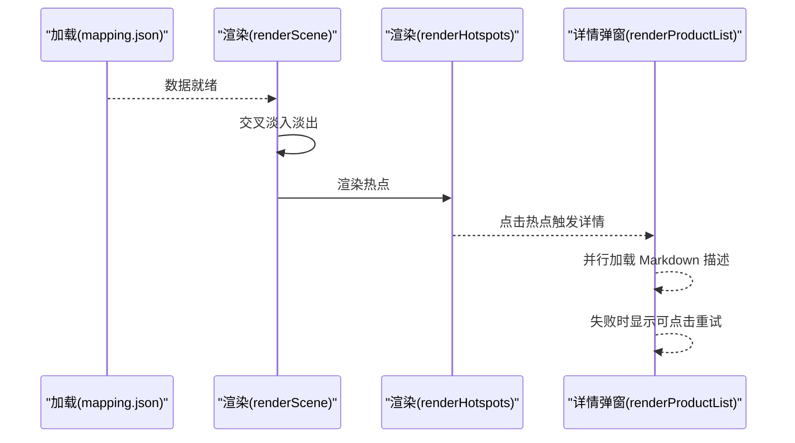
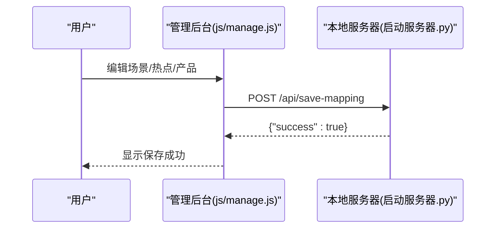
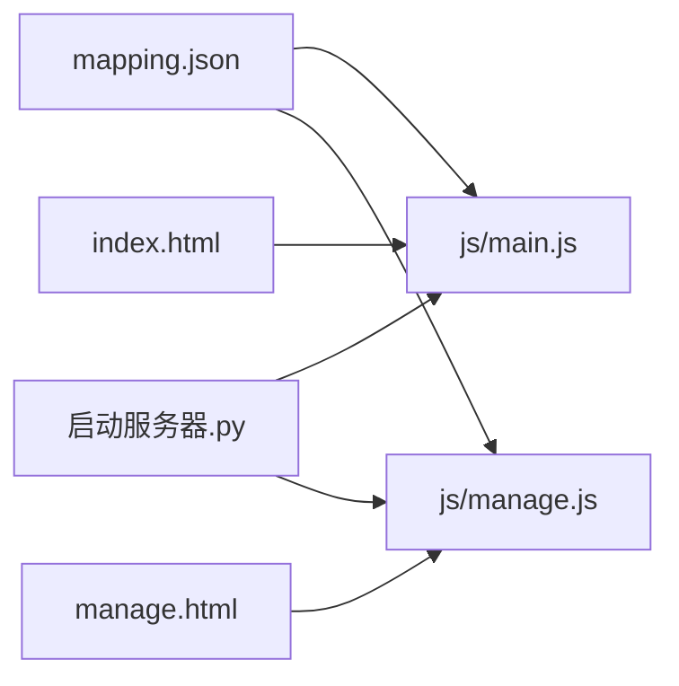

# 数据配置示例

<cite>
**本文引用的文件**
- [mapping.json](file://mapping.json)
- [index.html](file://index.html)
- [manage.html](file://manage.html)
- [project_architecture.md](file://project_architecture.md)
- [启动服务器.py](file://启动服务器.py)
- [js/main.js](file://js/main.js)
- [js/manage.js](file://js/manage.js)
- [css/style.css](file://css/style.css)
- [css/manage.css](file://css/manage.css)
- [产品描述/室内双面吊装标牌.md](file://产品描述/室内双面吊装标牌.md)
- [产品描述/电子水牌.md](file://产品描述/电子水牌.md)
</cite>

## 目录
1. [简介](#简介)
2. [项目结构](#项目结构)
3. [核心组件](#核心组件)
4. [架构总览](#架构总览)
5. [详细组件分析](#详细组件分析)
6. [依赖关系分析](#依赖关系分析)
7. [性能考量](#性能考量)
8. [故障排查指南](#故障排查指南)
9. [结论](#结论)
10. [附录](#附录)

## 简介
本文件面向数字标牌项目的“数据配置示例”，围绕 mapping.json 的结构、字段含义、配置方法与最佳实践展开，结合管理后台与前端渲染逻辑，帮助用户快速理解并正确配置场景、热点与产品信息，涵盖多场景模板、热点坐标系统、产品图片与描述规范、校验与检查清单，以及常见错误与解决方案。

## 项目结构
- 数据配置入口：mapping.json（v4.0 起独立数据文件，替代硬编码 scenes）
- 前端展示：index.html + js/main.js + css/style.css
- 管理后台：manage.html + js/manage.js + css/manage.css
- 本地开发服务器：启动服务器.py（提供 /api/save-mapping、/api/upload-image、/api/list-images、/api/list-descriptions）

图表来源
- [index.html:1-83](file://index.html#L1-L83)
- [manage.html:1-113](file://manage.html#L1-L113)
- [启动服务器.py:25-252](file://启动服务器.py#L25-L252)
- [js/main.js:49-73](file://js/main.js#L49-L73)
- [js/manage.js:35-72](file://js/manage.js#L35-L72)

章节来源
- [project_architecture.md:43-108](file://project_architecture.md#L43-L108)

## 核心组件
- 数据模型（mapping.json）
  - version：版本号（建议 v4.0）
  - scenes：场景数组，每个场景包含 id、category、image、hotspots
  - i18n：多语言字典，包含页面标题、按钮文案、提示文本等
- 前端渲染（js/main.js）
  - 动态加载 mapping.json，含重试机制
  - 多语言文本与名称解析（getText）
  - 场景渲染、交叉淡入淡出、热点定位与点击交互
  - 产品详情弹窗与 Markdown 描述加载
- 管理后台（js/manage.js）
  - 可视化编辑场景、热点、产品
  - 上传图片、列出可用资源、保存配置到服务器

章节来源
- [mapping.json:1-232](file://mapping.json#L1-L232)
- [project_architecture.md:112-220](file://project_architecture.md#L112-L220)
- [js/main.js:49-162](file://js/main.js#L49-L162)
- [js/manage.js:35-108](file://js/manage.js#L35-L108)

## 架构总览
前端通过 fetch 加载 mapping.json，管理后台通过 API 与本地服务器交互，实现“数据与逻辑分离”的配置体系。

图表来源
- [js/manage.js:81-108](file://js/manage.js#L81-L108)
- [启动服务器.py:101-127](file://启动服务器.py#L101-L127)
- [js/main.js:49-73](file://js/main.js#L49-L73)

## 详细组件分析

### 数据模型与字段说明（mapping.json）
- 顶层字段
  - version：字符串，版本号（如 "4.0"）
  - scenes：数组，场景集合
  - i18n：对象，多语言字典（ja、zh）
- 场景对象（scene）
  - id：字符串，场景唯一标识（推荐格式 scene_XXX）
  - category：对象，多语言分类名（ja、zh）
  - image：字符串，场景图路径（相对项目根目录）
  - hotspots：数组，热点集合
- 热点对象（hotspot）
  - id：字符串，热点唯一标识（推荐格式 hs_XXX）
  - x：数值，水平百分比坐标（0~100）
  - y：数值，垂直百分比坐标（0~100）
  - products：数组，该热点关联的产品集合
- 产品对象（product）
  - name：对象，多语言产品名（ja、zh）
  - image：字符串，产品图路径
  - descriptionFile：字符串，产品描述 Markdown 文件路径
- 多语言字典（i18n）
  - 包含页面标题、按钮文案、提示文本等键值

章节来源
- [mapping.json:1-232](file://mapping.json#L1-L232)
- [project_architecture.md:118-220](file://project_architecture.md#L118-L220)

### 热点坐标系统与响应式适配
- 坐标系统
  - 百分比坐标：x、y ∈ [0, 100]
  - 0 表示最左/最上，100 表示最右/最下
- 响应式适配
  - 前端根据当前场景图的自然尺寸与容器尺寸计算实际像素位置
  - 使用 object-fit: cover 时，会按容器比例裁剪，计算时考虑裁剪偏移
- 设备兼容性
  - 通过图片加载完成状态与容器尺寸计算，避免在图片未加载时计算错误位置
  - 若图片未加载完成，热点计算会回退到屏幕中央，保证交互可用

图表来源
- [js/main.js:774-806](file://js/main.js#L774-L806)

章节来源
- [js/main.js:774-806](file://js/main.js#L774-L806)

### 产品配置最佳实践
- 图片选择标准
  - 产品图为白底图，便于在详情卡片中统一视觉风格
  - 建议尺寸：宽度约 400px，高度适配，保持清晰锐利
- 描述文件格式
  - 使用 Markdown，支持列表、表格、粗体等
  - 建议：突出卖点、规格参数、认证信息、适用场景
- 多语言内容维护
  - name 与 category 均为多语言对象，需同时维护 ja 与 zh
  - i18n 字典中的文案用于 UI 文本，与产品描述文件无关
- 文件命名与路径
  - image 与 descriptionFile 为相对路径，建议与项目目录结构保持一致
  - 通过管理后台上传图片时，服务器会返回相对路径

章节来源
- [产品描述/室内双面吊装标牌.md:1-13](file://产品描述/室内双面吊装标牌.md#L1-L13)
- [产品描述/电子水牌.md:1-10](file://产品描述/电子水牌.md#L1-L10)
- [启动服务器.py:129-202](file://启动服务器.py#L129-L202)
- [js/manage.js:760-781](file://js/manage.js#L760-L781)

### 不同场景类型的配置模板
- 便利店场景
  - 典型：场景图 + 1 个热点 + 1 个产品
  - 坐标：根据场景图布局合理放置，避免遮挡关键元素
- 超市场景
  - 典型：场景图 + 多个热点（不同区域）+ 多个产品
  - 建议：热点分布覆盖收银台、货架、通道等关键位置
- 酒店场景
  - 典型：场景图 + 1 个热点 + 1 个产品（如室内立式广告机）
- 快餐店场景
  - 典型：场景图 + 1 个热点 + 多个产品（如自助点单机系列）
- 集会/其他场景
  - 典型：场景图 + 1 个热点 + 1 个产品（如室外可移动广告机/室外立式广告机）

章节来源
- [mapping.json:3-204](file://mapping.json#L3-L204)
- [project_architecture.md:220-234](file://project_architecture.md#L220-L234)

### 前端渲染与交互流程
- 初始化
  - 加载 mapping.json（含重试），失败时显示全屏错误
  - 初始化场景分类映射、创建分类切换器与指示器
- 场景切换
  - 交叉淡入淡出，双层图片切换，避免黑屏
  - 图片加载失败/超时则不渲染热点
- 热点交互
  - 点击热点打开产品详情弹窗，左图右文布局
  - Markdown 描述加载失败时显示可点击重试提示
- 语言切换
  - 切换语言后，UI 文本与弹窗标题同步更新

图表来源
- [js/main.js:480-595](file://js/main.js#L480-L595)
- [js/main.js:716-759](file://js/main.js#L716-L759)
- [js/main.js:421-460](file://js/main.js#L421-L460)

章节来源
- [js/main.js:480-595](file://js/main.js#L480-L595)
- [js/main.js:716-759](file://js/main.js#L716-L759)
- [js/main.js:421-460](file://js/main.js#L421-L460)

### 管理后台工作流
- 加载数据
  - 从 mapping.json 加载配置
  - 获取可用图片与描述文件列表
- 编辑场景
  - 修改分类名、更换场景图（上传后返回相对路径）
  - 添加/删除热点，拖拽热点调整坐标
- 编辑产品
  - 为热点添加/删除产品，选择图片与描述文件
- 保存配置
  - POST /api/save-mapping，服务器先备份再写入

图表来源
- [js/manage.js:81-108](file://js/manage.js#L81-L108)
- [启动服务器.py:101-127](file://启动服务器.py#L101-L127)

章节来源
- [js/manage.js:35-108](file://js/manage.js#L35-L108)
- [启动服务器.py:101-127](file://启动服务器.py#L101-L127)

## 依赖关系分析
- 前端依赖
  - mapping.json：数据源
  - marked.js：Markdown 解析（CDN 引入）
  - 本地服务器：提供 API 与静态文件服务
- 后端依赖
  - Python 内置 HTTP 服务器 + 自定义处理器
  - 文件系统：读写 mapping.json、上传图片、扫描资源

图表来源
- [js/main.js:49-73](file://js/main.js#L49-L73)
- [js/manage.js:35-46](file://js/manage.js#L35-L46)
- [启动服务器.py:25-98](file://启动服务器.py#L25-L98)

章节来源
- [启动服务器.py:25-98](file://启动服务器.py#L25-L98)

## 性能考量
- 图片预加载
  - 预加载所有场景图与产品图，减少切换时延
  - 失败时重试，提升稳定性
- 场景切换
  - 双层图片交叉淡入淡出，避免黑屏
  - 图片加载超时保护，防止长时间等待
- Markdown 加载
  - 缓存已加载文件，避免重复请求
  - 加载失败时提供可点击重试提示

章节来源
- [js/main.js:257-327](file://js/main.js#L257-L327)
- [js/main.js:354-395](file://js/main.js#L354-L395)
- [js/main.js:421-460](file://js/main.js#L421-L460)

## 故障排查指南
- 常见错误与解决
  - mapping.json 加载失败
    - 现象：全屏错误提示
    - 原因：网络异常、路径错误、权限问题
    - 解决：检查本地服务器是否启动、路径是否正确、浏览器跨域设置
  - 热点位置不准确
    - 现象：点击无效或位置偏移
    - 原因：场景图未加载完成、object-fit 裁剪导致偏移
    - 解决：确保图片加载完成后再渲染热点；检查坐标范围（0~100）
  - 产品描述加载失败
    - 现象：显示“加载失败，点击重试”
    - 原因：描述文件路径错误、网络异常
    - 解决：确认 descriptionFile 路径正确；点击重试或检查文件是否存在
  - 保存配置失败
    - 现象：保存状态显示失败
    - 原因：服务器错误、请求体为空或 JSON 解析失败
    - 解决：检查服务器日志；确认 mapping.json 结构正确
- 验证步骤
  - 启动本地服务器，访问 /index.html 与 /manage.html
  - 在管理后台保存配置，观察保存状态
  - 在展示页面切换场景，检查热点与详情弹窗
  - 检查控制台是否有错误信息

章节来源
- [js/main.js:623-639](file://js/main.js#L623-L639)
- [js/main.js:421-460](file://js/main.js#L421-L460)
- [启动服务器.py:101-127](file://启动服务器.py#L101-L127)

## 结论
通过 mapping.json 的标准化配置与管理后台的可视化编辑，项目实现了“数据与逻辑分离”。遵循本文提供的字段说明、坐标系统、产品配置最佳实践与检查清单，可高效构建高质量的数字标牌展示页面，并确保跨场景、跨设备的一致体验。

## 附录

### 完整配置示例（结构概览）
- 顶层
  - version: "4.0"
  - scenes: [场景对象数组]
  - i18n: { ja: {...}, zh: {...} }
- 场景对象
  - id: "scene_001"
  - category: { ja: "场景分类名(日文)", zh: "场景分类名(中文)" }
  - image: "场景图路径"
  - hotspots: [热点对象数组]
- 热点对象
  - id: "hs_001"
  - x: 30
  - y: 25
  - products: [产品对象数组]
- 产品对象
  - name: { ja: "产品名(日文)", zh: "产品名(中文)" }
  - image: "产品图路径"
  - descriptionFile: "产品描述文件路径"

章节来源
- [mapping.json:1-232](file://mapping.json#L1-L232)
- [project_architecture.md:118-150](file://project_architecture.md#L118-L150)

### 配置验证清单
- 必填字段核对
  - scenes 数组非空
  - 每个场景包含 id、category、image、hotspots
  - 每个热点包含 id、x、y、products
  - 每个产品包含 name、image、descriptionFile
- 坐标范围
  - x、y ∈ [0, 100]
- 路径有效性
  - image 与 descriptionFile 路径存在且可访问
- 多语言一致性
  - name 与 category 的 ja、zh 字段均填写
  - i18n 字典包含所需键值
- 保存与预览
  - 保存配置后，管理后台显示成功
  - 展示页面正常加载并渲染

章节来源
- [js/manage.js:81-108](file://js/manage.js#L81-L108)
- [启动服务器.py:101-127](file://启动服务器.py#L101-L127)