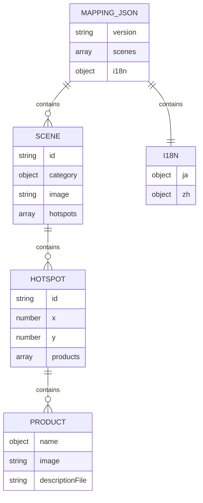
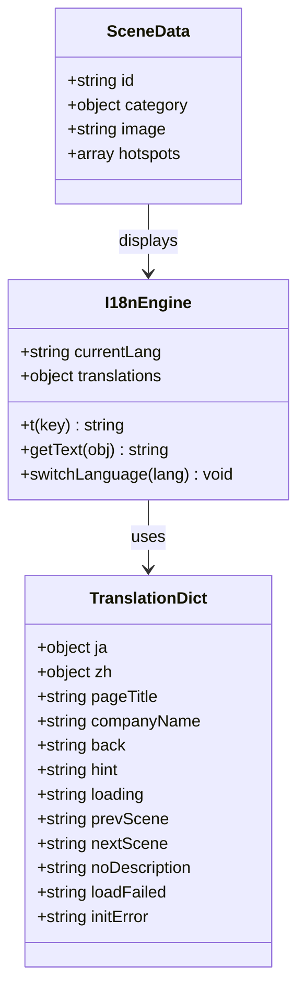
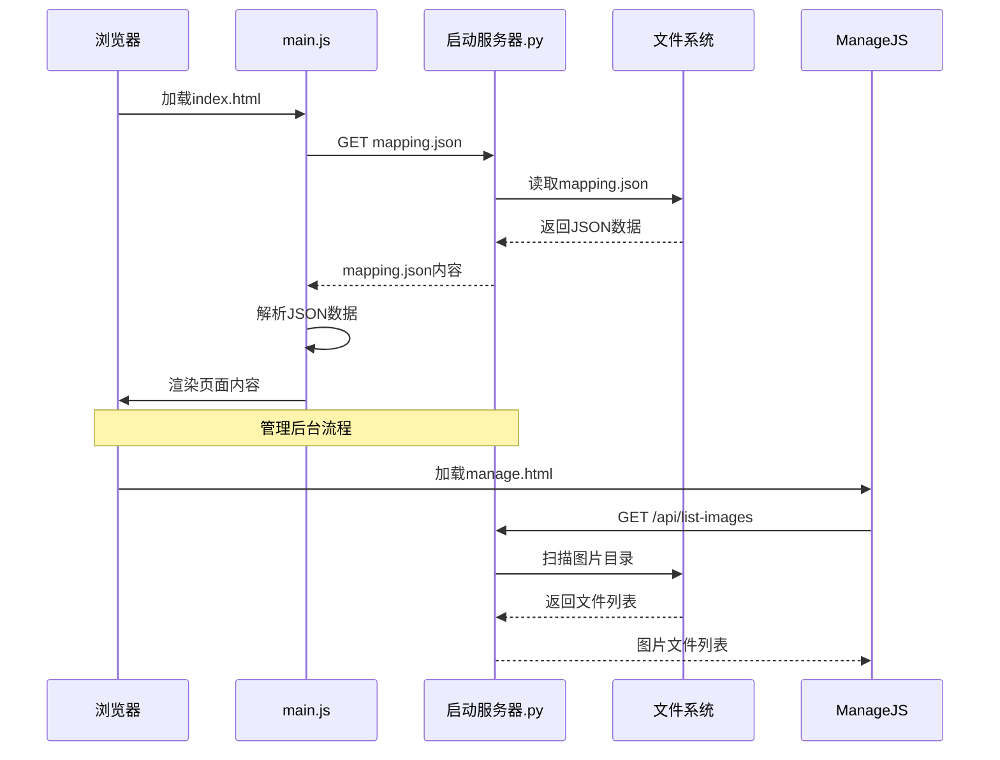
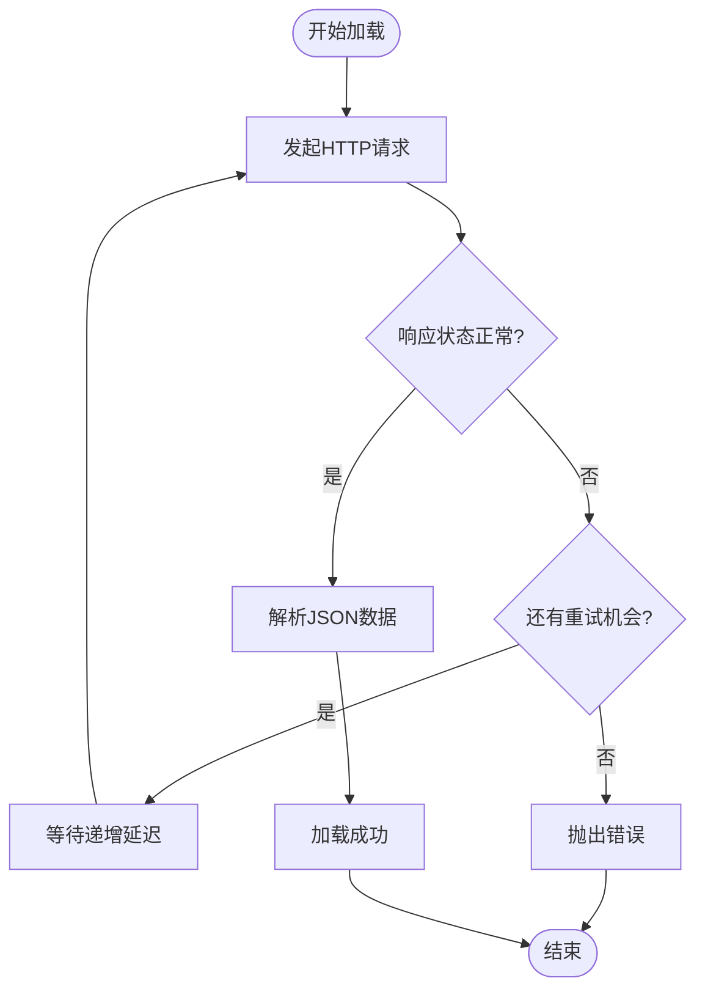
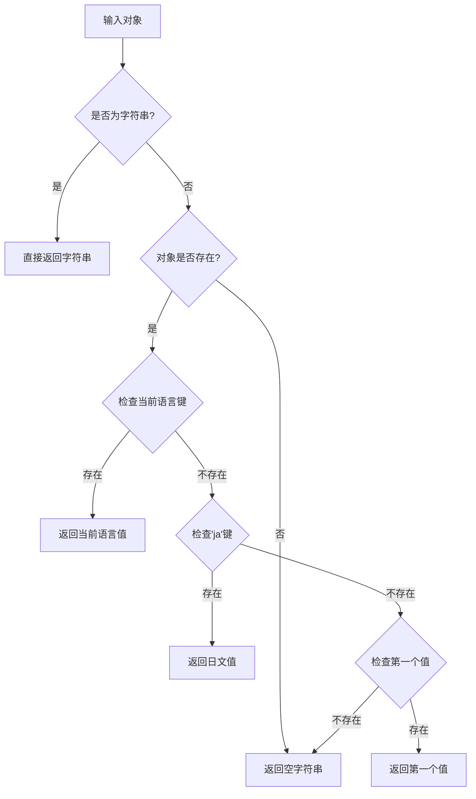
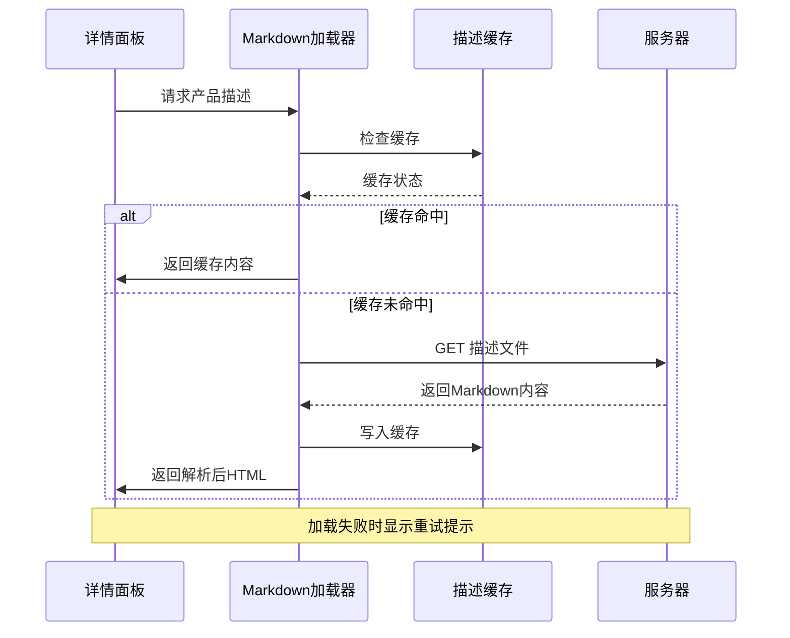
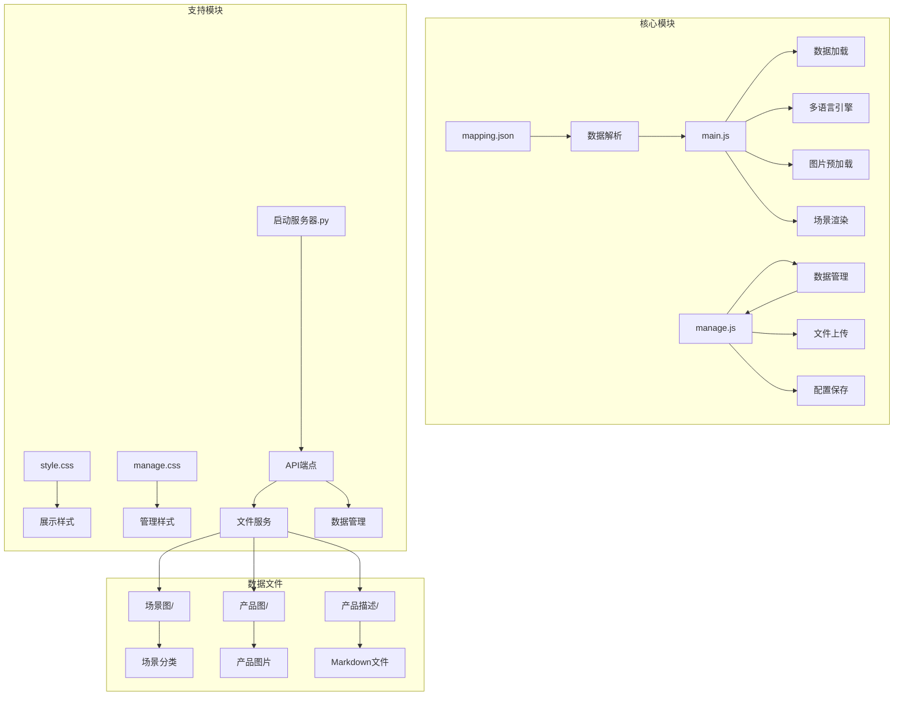

# 数据配置系统

<cite>
**本文档引用的文件**
- [mapping.json](file://mapping.json)
- [index.html](file://index.html)
- [manage.html](file://manage.html)
- [main.js](file://js/main.js)
- [manage.js](file://js/manage.js)
- [style.css](file://css/style.css)
- [manage.css](file://css/manage.css)
- [启动服务器.py](file://启动服务器.py)
- [project_architecture.md](file://project_architecture.md)
- [电子水牌.md](file://产品描述/电子水牌.md)
</cite>

## 目录
1. [简介](#简介)
2. [项目结构](#项目结构)
3. [核心组件](#核心组件)
4. [架构概览](#架构概览)
5. [详细组件分析](#详细组件分析)
6. [依赖关系分析](#依赖关系分析)
7. [性能考虑](#性能考虑)
8. [故障排除指南](#故障排除指南)
9. [结论](#结论)
10. [附录](#附录)

## 简介

数字标牌产品展示项目是一个基于纯原生JavaScript的前端应用，通过`mapping.json`文件实现数据与逻辑的完全分离。该项目采用v4.0架构，实现了以下核心功能：

- **动态数据加载**：从`mapping.json`文件动态加载场景、产品和多语言配置
- **多语言支持**：完整的中日文双语切换系统
- **可视化管理**：提供专门的管理后台用于编辑场景和产品配置
- **高性能渲染**：采用交叉淡入淡出、图片预加载等优化技术
- **错误处理**：完善的重试机制和错误降级策略

## 项目结构

项目采用清晰的模块化组织结构，主要包含以下核心部分：

```mermaid
graph TB
subgraph "前端应用"
A[index.html] --> B[mapping.json]
C[manage.html] --> D[管理后台]
E[main.js] --> F[数据加载模块]
G[manage.js] --> H[管理模块]
end
subgraph "样式系统"
I[style.css] --> J[展示页面样式]
K[manage.css] --> L[管理后台样式]
end
subgraph "数据文件"
M[场景图/] --> N[场景分类目录]
O[产品图/] --> P[产品图片]
Q[产品描述/] --> R[Markdown描述文件]
end
subgraph "服务器"
S[启动服务器.py] --> T[API端点]
U[/api/save-mapping] --> V[保存配置]
W[/api/upload-image] --> X[图片上传]
Y[/api/list-images] --> Z[文件列表]
AA[/api/list-descriptions] --> BB[描述列表]
end
```

**图表来源**
- [project_architecture.md:43-108](file://project_architecture.md#L43-L108)
- [启动服务器.py:25-98](file://启动服务器.py#L25-L98)

**章节来源**
- [project_architecture.md:43-108](file://project_architecture.md#L43-L108)
- [启动服务器.py:25-98](file://启动服务器.py#L25-L98)

## 核心组件

### 数据配置文件结构

`mapping.json`是整个系统的核心配置文件，采用JSON格式存储所有数据配置：



**图表来源**
- [mapping.json:1-232](file://mapping.json#L1-L232)

### 多语言系统架构

系统采用统一的多语言字典结构，支持中日文双语切换：



**图表来源**
- [main.js:87-162](file://js/main.js#L87-L162)
- [mapping.json:205-230](file://mapping.json#L205-L230)

**章节来源**
- [main.js:87-162](file://js/main.js#L87-L162)
- [mapping.json:205-230](file://mapping.json#L205-L230)

## 架构概览

系统采用前后端分离的设计模式，通过API端点实现数据的动态加载和管理：



**图表来源**
- [main.js:49-73](file://js/main.js#L49-L73)
- [启动服务器.py:204-251](file://启动服务器.py#L204-L251)

**章节来源**
- [main.js:49-73](file://js/main.js#L49-L73)
- [启动服务器.py:204-251](file://启动服务器.py#L204-L251)

## 详细组件分析

### 数据加载机制

系统实现了完善的异步数据加载和重试机制：



**图表来源**
- [main.js:49-73](file://js/main.js#L49-L73)

#### 重试机制实现

系统采用递增延迟的重试策略，最多重试3次：

| 重试次数 | 延迟时间 | 用途 |
|---------|---------|------|
| 第1次 | 500ms | 快速响应网络瞬时故障 |
| 第2次 | 1000ms | 给网络恢复时间 |
| 第3次 | 2000ms | 处理较严重的网络问题 |

#### 错误处理策略

- **初始化失败**：显示全屏错误提示，阻止页面继续初始化
- **图片加载失败**：使用占位符和重试机制
- **Markdown加载失败**：显示可点击重试的错误提示

**章节来源**
- [main.js:49-73](file://js/main.js#L49-L73)
- [main.js:1173-1178](file://js/main.js#L1173-L1178)

### 多语言系统实现

#### getText()函数工作原理

`getText()`函数实现了智能的语言回退机制：



**图表来源**
- [main.js:102-106](file://js/main.js#L102-L106)

#### i18n字典结构

系统使用统一的多语言字典结构，包含以下键值：

| 键名 | 语言 | 用途 |
|------|------|------|
| `pageTitle` | 日文/中文 | 页面标题显示 |
| `companyName` | 日文/中文 | 公司名称显示 |
| `back` | 日文/中文 | 返回按钮文字 |
| `hint` | 日文/中文 | 首屏提示文字 |
| `loading` | 日文/中文 | 加载状态提示 |
| `prevScene` | 日文/中文 | 上一个场景按钮 |
| `nextScene` | 日文/中文 | 下一个场景按钮 |
| `noDescription` | 日文/中文 | 无描述提示 |
| `loadFailed` | 日文/中文 | 加载失败提示 |
| `initError` | 日文/中文 | 初始化错误提示 |

**章节来源**
- [main.js:102-106](file://js/main.js#L102-L106)
- [mapping.json:205-230](file://mapping.json#L205-L230)

### 场景管理系统

#### 场景对象结构

每个场景包含以下核心属性：

| 属性名 | 类型 | 必填 | 说明 |
|--------|------|------|------|
| `id` | string | 是 | 场景唯一标识，格式`scene_XXX` |
| `category` | object | 是 | 多语言分类名，包含`ja`和`zh`键 |
| `image` | string | 是 | 场景图片路径，相对项目根目录 |
| `hotspots` | array | 否 | 热点数组，可为空 |

#### 热点对象结构

热点系统支持单场景多热点设计：

| 属性名 | 类型 | 必填 | 说明 |
|--------|------|------|------|
| `id` | string | 是 | 热点唯一标识，格式`hs_XXX` |
| `x` | number | 是 | 水平位置百分比(0-100) |
| `y` | number | 是 | 垂直位置百分比(0-100) |
| `products` | array | 否 | 关联产品数组，可为空 |

**章节来源**
- [mapping.json:3-204](file://mapping.json#L3-L204)

### 产品描述系统

系统支持Markdown格式的产品描述，采用异步加载和缓存机制：



**图表来源**
- [main.js:421-442](file://js/main.js#L421-L442)

**章节来源**
- [main.js:421-442](file://js/main.js#L421-L442)

## 依赖关系分析

系统采用松耦合的设计，各模块之间的依赖关系清晰明确：



**图表来源**
- [project_architecture.md:446-501](file://project_architecture.md#L446-L501)
- [启动服务器.py:25-98](file://启动服务器.py#L25-L98)

**章节来源**
- [project_architecture.md:446-501](file://project_architecture.md#L446-L501)
- [启动服务器.py:25-98](file://启动服务器.py#L25-L98)

## 性能考虑

### 图片加载优化

系统实现了多层次的图片加载优化策略：

1. **首屏独占带宽**：首屏图片完全加载后再启动预加载
2. **图片预加载**：提前加载所有场景和产品图片到浏览器缓存
3. **缓存检测**：使用`isImageCached()`避免重复加载
4. **超时保护**：设置合理的加载超时时间(8-30秒)

### 渲染性能优化

- **交叉淡入淡出**：使用双图层实现无黑屏切换
- **防抖处理**：窗口大小变化时使用200ms防抖
- **懒加载**：场景缩略图使用`loading="lazy"`属性
- **虚拟滚动**：场景列表使用CSS滚动条优化

### 内存管理

- **缓存清理**：描述文件缓存使用对象存储，避免内存泄漏
- **事件解绑**：使用`{once: true}`避免事件监听器累积
- **DOM复用**：热点元素使用统一的创建和销毁机制

## 故障排除指南

### 常见问题及解决方案

#### mapping.json加载失败

**症状**：页面显示全屏错误提示，无法加载数据

**可能原因**：
1. 文件路径错误
2. JSON格式不正确
3. 服务器配置问题
4. 权限不足

**解决步骤**：
1. 检查`mapping.json`文件是否存在且可访问
2. 验证JSON格式的正确性
3. 确认服务器端口(8082)正常运行
4. 检查文件权限设置

#### 图片加载失败

**症状**：场景图片或产品图片显示加载失败

**解决方法**：
1. 确认图片文件路径正确
2. 检查图片格式(.webp/.jpg/.png)
3. 验证图片文件完整性
4. 确认服务器能够访问图片目录

#### 多语言显示异常

**症状**：页面文字显示不正确或乱码

**解决步骤**：
1. 检查`mapping.json`中`i18n`字段的完整性
2. 确认多语言键值的正确性
3. 验证字符编码设置
4. 检查浏览器语言设置

**章节来源**
- [main.js:1173-1178](file://js/main.js#L1173-L1178)
- [启动服务器.py:101-127](file://启动服务器.py#L101-L127)

## 结论

数字标牌产品展示项目的数据配置系统具有以下特点：

1. **高度模块化**：通过`mapping.json`实现数据与逻辑分离
2. **强大的扩展性**：支持动态场景、多语言、多产品配置
3. **优秀的用户体验**：采用渐进式加载、骨架屏、动画过渡
4. **完善的错误处理**：重试机制、降级策略、用户友好的错误提示
5. **易于维护**：纯原生JavaScript实现，无外部依赖

该系统为数字标牌产品的展示提供了灵活、可扩展的数据配置方案，适用于各种商业应用场景。

## 附录

### JSON Schema定义

以下是`mapping.json`的完整JSON Schema定义：

```json
{
  "$schema": "http://json-schema.org/draft-07/schema#",
  "type": "object",
  "required": ["version", "scenes", "i18n"],
  "properties": {
    "version": {
      "type": "string",
      "pattern": "^\\d+\\.\\d+$"
    },
    "scenes": {
      "type": "array",
      "items": {
        "type": "object",
        "required": ["id", "category", "image"],
        "properties": {
          "id": {
            "type": "string",
            "pattern": "^scene_\\d{3}$"
          },
          "category": {
            "type": "object",
            "required": ["ja", "zh"],
            "properties": {
              "ja": {"type": "string"},
              "zh": {"type": "string"}
            }
          },
          "image": {
            "type": "string",
            "pattern": "^场景图/"
          },
          "hotspots": {
            "type": "array",
            "items": {
              "type": "object",
              "required": ["id", "x", "y"],
              "properties": {
                "id": {
                  "type": "string",
                  "pattern": "^hs_\\d{3}$"
                },
                "x": {
                  "type": "number",
                  "minimum": 0,
                  "maximum": 100
                },
                "y": {
                  "type": "number",
                  "minimum": 0,
                  "maximum": 100
                },
                "products": {
                  "type": "array",
                  "items": {
                    "type": "object",
                    "required": ["name", "image", "descriptionFile"],
                    "properties": {
                      "name": {
                        "type": "object",
                        "required": ["ja", "zh"]
                      },
                      "image": {
                        "type": "string",
                        "pattern": "^产品图/"
                      },
                      "descriptionFile": {
                        "type": "string",
                        "pattern": "^产品描述/"
                      }
                    }
                  }
                }
              }
            }
          }
        }
      }
    },
    "i18n": {
      "type": "object",
      "required": ["ja", "zh"],
      "properties": {
        "ja": {
          "type": "object",
          "required": ["pageTitle", "companyName", "back", "hint", "loading", "prevScene", "nextScene", "noDescription", "loadFailed", "initError"]
        },
        "zh": {
          "type": "object",
          "required": ["pageTitle", "companyName", "back", "hint", "loading", "prevScene", "nextScene", "noDescription", "loadFailed", "initError"]
        }
      }
    }
  }
}
```

### 数据配置最佳实践

#### 命名规范

1. **场景ID**：`scene_XXX`格式，三位数字递增
2. **热点ID**：`hs_XXX`格式，三位数字递增  
3. **文件路径**：使用相对路径，遵循项目目录结构
4. **多语言键**：保持一致性，避免拼写错误

#### 文件组织

1. **场景图**：按场景类型分类存放
2. **产品图**：统一存放，便于管理
3. **描述文件**：按产品名称命名，使用.md扩展名
4. **配置文件**：集中管理，定期备份

#### 版本管理策略

1. **版本号**：采用语义化版本控制
2. **变更记录**：详细记录每次配置变更
3. **回滚机制**：保留备份文件，支持快速回滚
4. **测试验证**：变更后进行全面的功能测试

### 数据迁移指南

从旧版本格式迁移到新的`mapping.json`格式：

#### 迁移步骤

1. **备份现有数据**：复制现有的硬编码数据
2. **创建mapping.json**：按照新的JSON Schema格式创建文件
3. **转换场景数据**：将硬编码的场景数组转换为JSON对象
4. **更新产品配置**：将产品信息转换为新的结构
5. **测试验证**：确保所有功能正常工作
6. **部署上线**：替换旧版本代码

#### 迁移注意事项

- 保持多语言键的一致性
- 验证所有文件路径的正确性
- 确保热点坐标的准确性
- 测试所有交互功能的正常性

### 常用配置示例

#### 基础场景配置

```json
{
  "id": "scene_001",
  "category": {
    "ja": "コンビニエンスストア",
    "zh": "便利店"
  },
  "image": "场景图/便利店场景/便利店场景1.webp",
  "hotspots": []
}
```

#### 包含热点的场景配置

```json
{
  "id": "scene_002",
  "category": {
    "ja": "スーパーマーケット", 
    "zh": "超市"
  },
  "image": "场景图/超市场景/超市场景1.webp",
  "hotspots": [
    {
      "id": "hs_001",
      "x": 30,
      "y": 25,
      "products": [
        {
          "name": {
            "ja": "電子サイネージスタンド",
            "zh": "电子水牌"
          },
          "image": "产品图/电子水牌.webp",
          "descriptionFile": "产品描述/电子水牌.md"
        }
      ]
    }
  ]
}
```

#### 多产品热点配置

```json
{
  "id": "scene_003",
  "category": {
    "ja": "ファストフード店",
    "zh": "快餐店"
  },
  "image": "场景图/快餐店场景/快餐店场景1.webp",
  "hotspots": [
    {
      "id": "hs_001", 
      "x": 50,
      "y": 50,
      "products": [
        {
          "name": {"ja": "セルフオーダー端末", "zh": "自助点单机"},
          "image": "产品图/自助点单机1.webp",
          "descriptionFile": "产品描述/自助点单机1.md"
        },
        {
          "name": {"ja": "セルフオーダー端末", "zh": "自助点单机"}, 
          "image": "产品图/自助点单机2.webp",
          "descriptionFile": "产品描述/自助点单机2.md"
        }
      ]
    }
  ]
}
```

**章节来源**
- [project_architecture.md:112-234](file://project_architecture.md#L112-L234)
- [mapping.json:1-232](file://mapping.json#L1-L232)