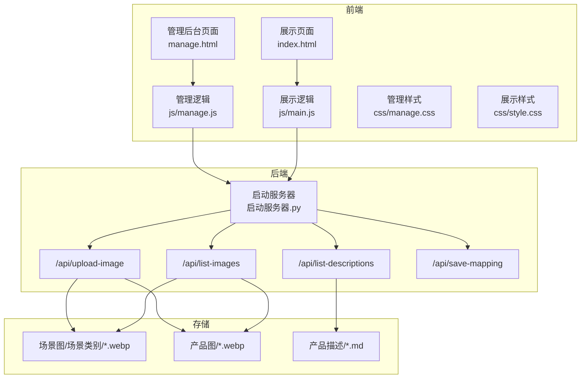
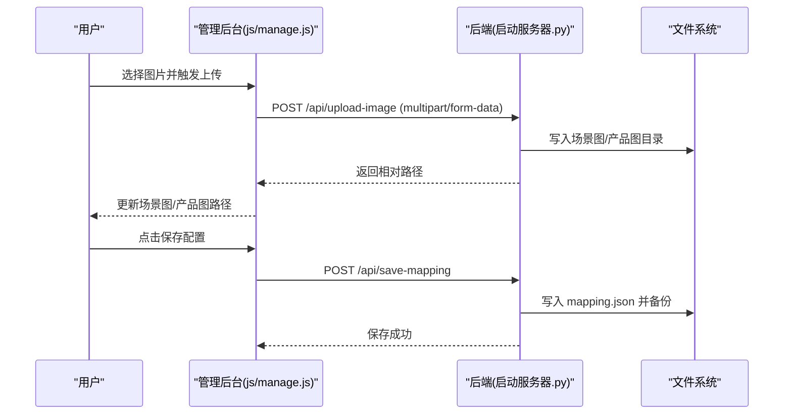
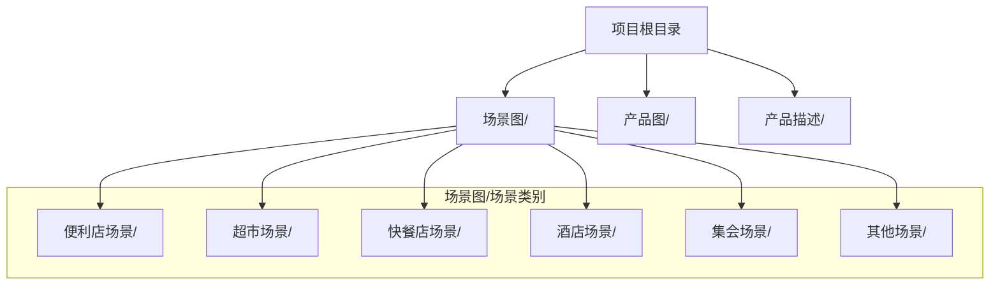
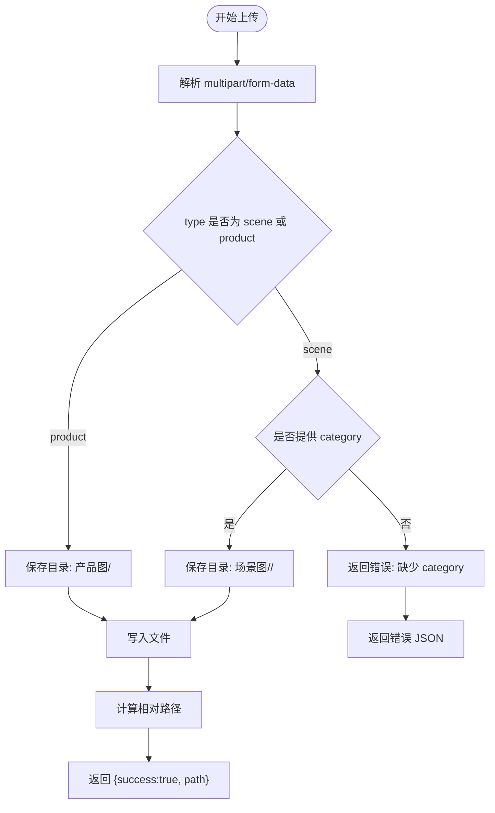
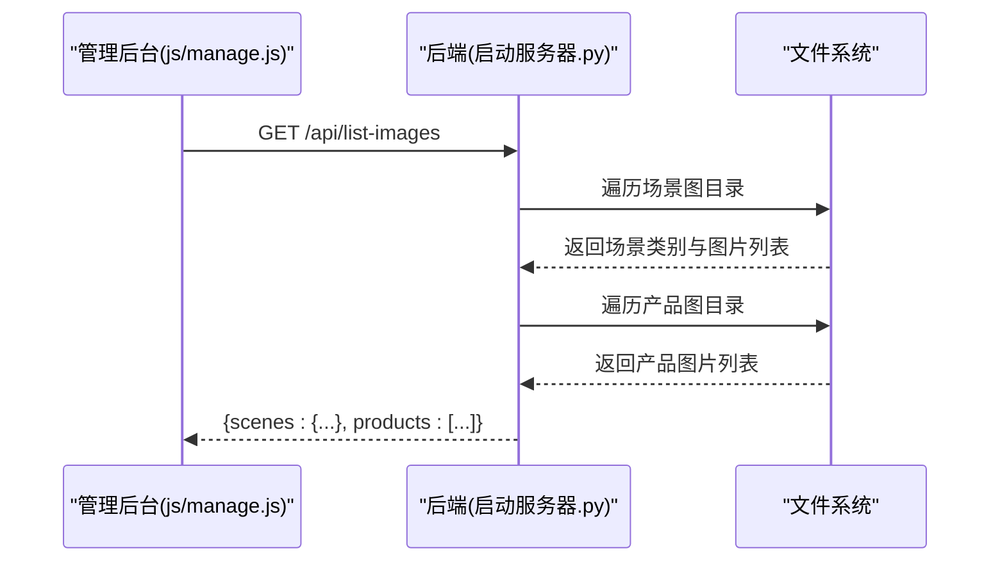
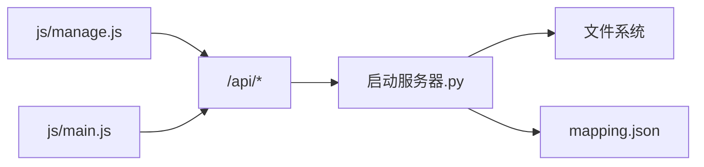

# 图片文件管理

<cite>
**本文档引用的文件**
- [manage.html](file://manage.html)
- [js/manage.js](file://js/manage.js)
- [mapping.json](file://mapping.json)
- [启动服务器.py](file://启动服务器.py)
- [index.html](file://index.html)
- [js/main.js](file://js/main.js)
- [css/manage.css](file://css/manage.css)
- [css/style.css](file://css/style.css)
</cite>

## 目录
1. [简介](#简介)
2. [项目结构](#项目结构)
3. [核心组件](#核心组件)
4. [架构总览](#架构总览)
5. [详细组件分析](#详细组件分析)
6. [依赖关系分析](#依赖关系分析)
7. [性能考量](#性能考量)
8. [故障排查指南](#故障排查指南)
9. [结论](#结论)
10. [附录](#附录)

## 简介
本文件面向数字标牌项目的图片文件管理，围绕“场景图”和“产品图”的目录结构与分类策略、图片上传机制、图片列表获取、图片管理最佳实践、图片预加载与缓存策略、安全考虑以及维护指南进行系统化说明。目标读者既包括前端与后端开发者，也包括运营与内容维护人员。

## 项目结构
项目采用前后端一体化的静态资源与简易HTTP服务结合的方式：
- 前端页面：管理后台（管理图片与场景）与展示页面（展示场景与产品详情）
- 后端服务：Python内置HTTP服务器，提供API端点用于图片上传、列表查询、配置保存等
- 存储结构：场景图按场景类别分组存放；产品图统一存放于产品图目录；描述文件统一存放于产品描述目录

图表来源
- [启动服务器.py:25-252](file://启动服务器.py#L25-L252)
- [manage.html:1-113](file://manage.html#L1-L113)
- [index.html:1-83](file://index.html#L1-L83)

章节来源
- [启动服务器.py:1-298](file://启动服务器.py#L1-L298)
- [manage.html:1-113](file://manage.html#L1-L113)
- [index.html:1-83](file://index.html#L1-L83)

## 核心组件
- 管理后台页面与逻辑：负责场景与热点的编辑、场景图上传、产品图与描述文件的选择与保存
- 展示页面与逻辑：负责场景轮播、热点渲染、产品详情展示、图片预加载与缓存
- 后端API：提供图片上传、图片列表、描述列表、配置保存等接口
- 存储策略：场景图按场景类别分组；产品图统一存放；描述文件统一存放

章节来源
- [js/manage.js:1-811](file://js/manage.js#L1-L811)
- [js/main.js:1-1284](file://js/main.js#L1-L1284)
- [启动服务器.py:25-252](file://启动服务器.py#L25-L252)
- [mapping.json:1-232](file://mapping.json#L1-L232)

## 架构总览
前端通过fetch调用后端API，后端基于SimpleHTTPRequestHandler扩展自定义路由，实现图片上传、列表查询与配置保存。图片文件按约定目录结构存储，前端通过API返回的相对路径引用。

图表来源
- [js/manage.js:762-781](file://js/manage.js#L762-L781)
- [启动服务器.py:129-202](file://启动服务器.py#L129-L202)
- [启动服务器.py:101-127](file://启动服务器.py#L101-L127)

章节来源
- [js/manage.js:762-781](file://js/manage.js#L762-L781)
- [启动服务器.py:129-202](file://启动服务器.py#L129-L202)
- [启动服务器.py:101-127](file://启动服务器.py#L101-L127)

## 详细组件分析

### 场景图与产品图目录结构与分类策略
- 场景图按场景类别分组：每个场景类别对应一个子目录，目录内存放该场景下的图片文件
- 产品图统一存放：所有产品图位于“产品图”根目录，便于统一管理与快速检索
- 描述文件统一存放：所有产品描述文件位于“产品描述”根目录，便于统一管理与快速检索

图表来源
- [启动服务器.py:204-236](file://启动服务器.py#L204-L236)
- [mapping.json:1-232](file://mapping.json#L1-L232)

章节来源
- [启动服务器.py:204-236](file://启动服务器.py#L204-L236)
- [mapping.json:1-232](file://mapping.json#L1-L232)

### 图片上传机制
- 接口路径：POST /api/upload-image
- 表单字段：
  - image：二进制文件流（multipart/form-data）
  - type：场景图或产品图标识（scene 或 product）
  - category：当type为scene时必填，表示场景类别目录
  - filename：可选，若不提供则使用原始文件名
- 文件类型验证：后端扫描支持的扩展名集合（.webp、.jpg、.png），仅接受这些扩展名
- 存储路径规则：
  - 场景图：场景图/<category>/<filename>.webp
  - 产品图：产品图/<filename>.webp
- 返回格式：包含success与path字段的JSON对象，path为相对路径

图表来源
- [启动服务器.py:129-202](file://启动服务器.py#L129-L202)

章节来源
- [启动服务器.py:129-202](file://启动服务器.py#L129-L202)

### 图片列表获取
- 接口路径：GET /api/list-images
- 返回格式：包含scenes与products两个键的JSON对象
  - scenes：以场景类别为键的对象，值为该类别下所有支持扩展名的图片相对路径数组
  - products：产品图目录下所有支持扩展名的图片相对路径数组
- 文件类型过滤：仅返回支持的扩展名（.webp、.jpg、.png）

图表来源
- [js/manage.js:48-59](file://js/manage.js#L48-L59)
- [启动服务器.py:204-236](file://启动服务器.py#L204-L236)

章节来源
- [js/manage.js:48-59](file://js/manage.js#L48-L59)
- [启动服务器.py:204-236](file://启动服务器.py#L204-L236)

### 图片管理最佳实践
- 文件命名规范
  - 场景图：建议使用“场景名+序号”命名，例如“场景名1.webp”，便于排序与识别
  - 产品图：建议使用“产品名称.webp”，避免重复与歧义
- 目录结构优化
  - 场景图按业务场景分组，避免单目录文件过多
  - 产品图与描述文件集中管理，便于统一检索与维护
- 存储空间管理策略
  - 定期清理无效或重复图片
  - 控制图片尺寸与质量，减少存储占用
  - 使用WebP格式以获得更好的压缩效果

### 图片预加载机制与缓存策略
- 管理后台预加载
  - 页面加载时调用 /api/list-images 获取图片列表，并在编辑器中作为下拉选项
- 展示页面预加载
  - 展示页面在加载 mapping.json 后，对场景图与产品图进行预加载，提升首屏体验
  - 使用双层图片容器实现交叉淡入淡出，增强视觉过渡
- 缓存策略
  - 通过HTTP缓存与浏览器缓存机制减少重复请求
  - 对于频繁访问的图片，建议在生产环境中启用CDN与持久缓存

章节来源
- [js/manage.js:48-59](file://js/manage.js#L48-L59)
- [js/main.js:1-200](file://js/main.js#L1-L200)

### 安全考虑
- 文件类型验证
  - 后端严格校验扩展名，仅接受 .webp、.jpg、.png
- 恶意文件防护
  - 上传接口要求multipart/form-data格式，避免非预期内容
  - 保存路径基于受控目录，防止路径穿越
- 访问权限控制
  - 服务器默认允许跨域（开发用途），生产环境需根据需要调整CORS策略
  - 建议在生产环境中限制上传接口的访问来源与频率

章节来源
- [启动服务器.py:21-22](file://启动服务器.py#L21-L22)
- [启动服务器.py:129-202](file://启动服务器.py#L129-L202)
- [启动服务器.py:28-33](file://启动服务器.py#L28-L33)

### 图片维护指南
- 批量上传
  - 通过管理后台的“添加场景”对话框或“更换场景图”按钮批量上传图片
  - 上传后自动刷新图片列表，便于后续选择
- 格式转换
  - 建议统一使用WebP格式，兼顾质量与体积
  - 如需转换，可在上传前使用图像处理工具进行批量转换
- 质量优化技巧
  - 控制分辨率与压缩比，避免过大文件影响加载速度
  - 对于场景图与产品图，建议统一尺寸，提升展示一致性

章节来源
- [manage.html:85-108](file://manage.html#L85-L108)
- [js/manage.js:205-221](file://js/manage.js#L205-L221)

## 依赖关系分析
- 前端依赖后端API：管理后台与展示页面均依赖后端提供的API端点
- 后端依赖文件系统：API端点直接读写项目根目录下的图片与描述文件
- 配置依赖：管理后台通过 /api/save-mapping 将配置写回 mapping.json

图表来源
- [js/manage.js:18-31](file://js/manage.js#L18-L31)
- [js/main.js:49-73](file://js/main.js#L49-L73)
- [启动服务器.py:54-97](file://启动服务器.py#L54-L97)
- [启动服务器.py:101-127](file://启动服务器.py#L101-L127)

章节来源
- [js/manage.js:18-31](file://js/manage.js#L18-L31)
- [js/main.js:49-73](file://js/main.js#L49-L73)
- [启动服务器.py:54-97](file://启动服务器.py#L54-L97)
- [启动服务器.py:101-127](file://启动服务器.py#L101-L127)

## 性能考量
- 图片加载性能
  - 使用预加载与交叉淡入淡出，减少白屏时间
  - 控制图片尺寸与格式，优先使用WebP
- 网络传输
  - 合理设置缓存头，减少重复下载
  - 对于大量图片，建议使用CDN加速
- 存储与IO
  - 将图片按场景分类存储，减少单目录文件数量
  - 定期清理冗余图片，保持磁盘空间健康

## 故障排查指南
- 上传失败
  - 检查请求是否为multipart/form-data格式
  - 确认type与category参数是否正确
  - 查看后端错误响应，定位具体问题
- 图片列表为空
  - 确认图片扩展名是否为 .webp/.jpg/.png
  - 检查图片是否位于正确的目录结构中
- 配置保存失败
  - 检查请求体是否为合法JSON
  - 确认服务器是否有写权限

章节来源
- [启动服务器.py:129-202](file://启动服务器.py#L129-L202)
- [启动服务器.py:101-127](file://启动服务器.py#L101-L127)

## 结论
本项目通过清晰的目录结构与完善的API设计，实现了场景图与产品图的高效管理。前端负责编辑与展示，后端负责上传与列表查询，配合合理的命名规范与存储策略，能够满足数字标牌项目的图片管理需求。建议在生产环境中进一步强化安全与性能措施，以保障系统的稳定性与用户体验。

## 附录
- API清单
  - POST /api/upload-image：上传图片，返回相对路径
  - GET /api/list-images：获取图片列表（场景图与产品图）
  - GET /api/list-descriptions：获取描述文件列表
  - POST /api/save-mapping：保存配置到 mapping.json

章节来源
- [启动服务器.py:276-281](file://启动服务器.py#L276-L281)