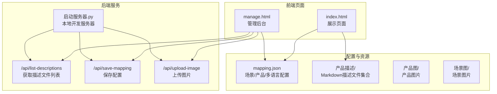
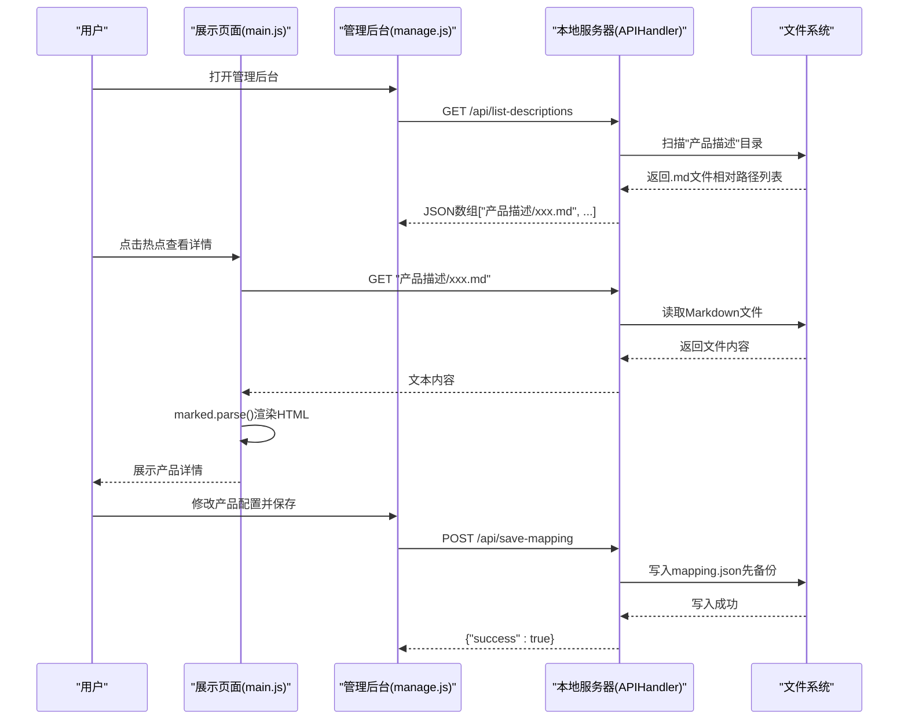
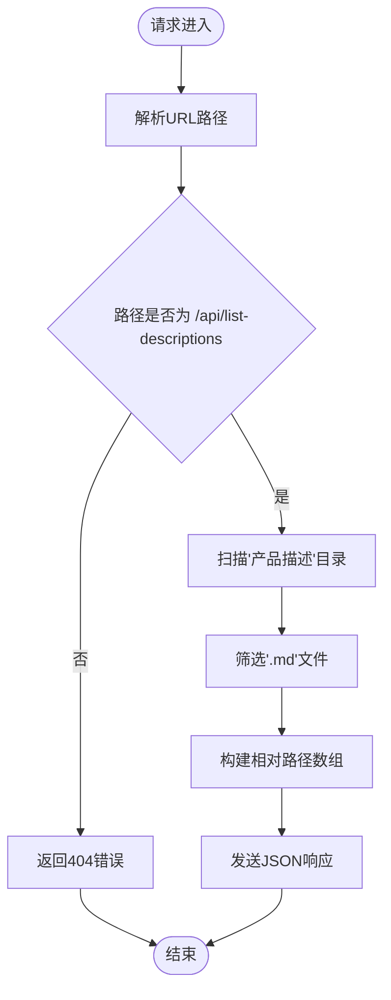
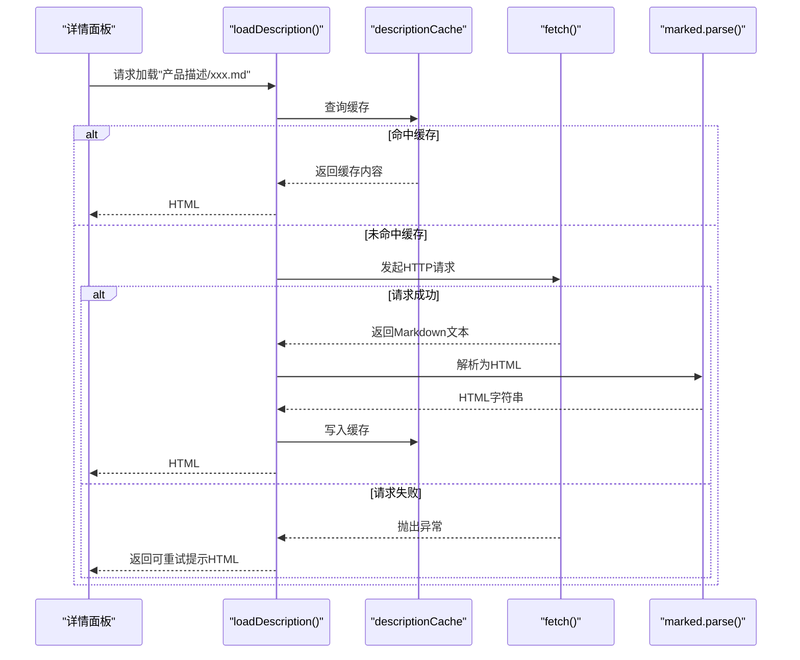
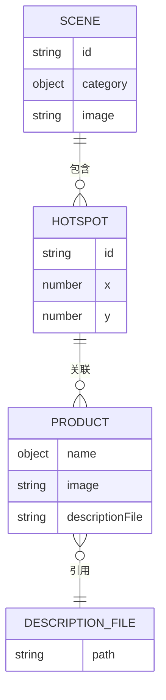
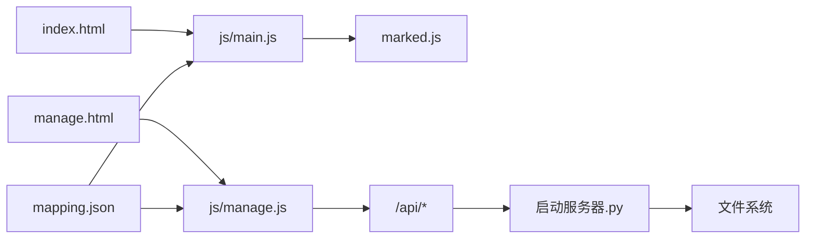

# 描述文件管理

<cite>
**本文档引用的文件**
- [index.html](file://index.html)
- [manage.html](file://manage.html)
- [mapping.json](file://mapping.json)
- [启动服务器.py](file://启动服务器.py)
- [project_architecture.md](file://project_architecture.md)
- [main.js](file://js/main.js)
- [manage.js](file://js/manage.js)
- [manage.css](file://css/manage.css)
- [室内双面吊装标牌.md](file://产品描述/室内双面吊装标牌.md)
- [电子水牌.md](file://产品描述/电子水牌.md)
- [自助点单机1.md](file://产品描述/自助点单机1.md)
</cite>

## 目录
1. [简介](#简介)
2. [项目结构](#项目结构)
3. [核心组件](#核心组件)
4. [架构总览](#架构总览)
5. [详细组件分析](#详细组件分析)
6. [依赖关系分析](#依赖关系分析)
7. [性能考虑](#性能考虑)
8. [故障排查指南](#故障排查指南)
9. [结论](#结论)
10. [附录](#附录)

## 简介
本文件聚焦数字标牌项目中的“产品描述文件管理”，系统阐述描述文件的存储结构、命名规范、目录管理策略，以及上传与管理机制。同时详细说明描述文件列表获取接口的工作原理与返回格式，给出最佳实践建议（Markdown语法规范、命名约定、版本管理策略），解释描述文件与产品配置的关联方式，提供编辑与维护指南（在线编辑、批量处理、内容审核流程），并说明国际化支持策略与多语言描述文件的管理与切换机制。

## 项目结构
项目采用“数据与逻辑分离”的架构，描述文件统一存放于“产品描述”目录，通过 mapping.json 中的 descriptionFile 字段与具体产品建立关联。管理后台通过 API 获取描述文件列表，支持在线编辑与保存。

图表来源
- [启动服务器.py:75-252](file://启动服务器.py#L75-L252)
- [mapping.json:1-232](file://mapping.json#L1-L232)
- [index.html:1-83](file://index.html#L1-L83)
- [manage.html:1-113](file://manage.html#L1-L113)

章节来源
- [project_architecture.md:43-108](file://project_architecture.md#L43-L108)
- [启动服务器.py:17-298](file://启动服务器.py#L17-L298)

## 核心组件
- 描述文件存储与命名
  - 存放位置：项目根目录下的“产品描述”目录，按产品分类命名，文件扩展名为“.md”。
  - 命名规范：建议与产品名称一致，便于维护与检索；文件名应使用英文或拼音，避免特殊字符。
  - 目录管理：按产品类别建立子目录可提升可维护性，但当前仓库采用扁平目录，便于集中管理与列表获取。
- 描述文件与配置关联
  - 在 mapping.json 中，每个产品对象包含 descriptionFile 字段，指向“产品描述/产品名.md”的相对路径。
- 描述文件列表获取
  - 管理后台通过 /api/list-descriptions 接口获取所有描述文件的相对路径列表，用于编辑器下拉选择。
- 描述文件加载与渲染
  - 展示页面通过 loadDescription(filePath) 异步加载 Markdown 文件，使用 marked.js 解析为 HTML；失败时返回可点击重试的提示。

章节来源
- [mapping.json:14-176](file://mapping.json#L14-L176)
- [启动服务器.py:238-252](file://启动服务器.py#L238-L252)
- [main.js:421-461](file://js/main.js#L421-L461)

## 架构总览
描述文件管理涉及前端展示、管理后台与本地开发服务器三层协作：

图表来源
- [manage.js:61-72](file://js/manage.js#L61-L72)
- [manage.js:81-108](file://js/manage.js#L81-L108)
- [启动服务器.py:238-252](file://启动服务器.py#L238-L252)
- [启动服务器.py:101-127](file://启动服务器.py#L101-L127)
- [main.js:421-461](file://js/main.js#L421-L461)

## 详细组件分析

### 描述文件列表获取接口（/api/list-descriptions）
- 接口路径：GET /api/list-descriptions
- 功能：扫描“产品描述”目录，返回所有以“.md”结尾的文件相对路径组成的数组。
- 返回格式：JSON数组，元素为字符串，形如 "产品描述/产品名.md"。
- 实现要点：
  - 仅扫描“产品描述”目录，忽略大小写差异。
  - 返回路径使用正斜杠，确保跨平台兼容。
- 典型调用：管理后台初始化时调用 fetch('/api/list-descriptions')，并将结果填充到产品编辑器的描述文件下拉框。

图表来源
- [启动服务器.py:75-86](file://启动服务器.py#L75-L86)
- [启动服务器.py:238-252](file://启动服务器.py#L238-L252)

章节来源
- [启动服务器.py:75-86](file://启动服务器.py#L75-L86)
- [启动服务器.py:238-252](file://启动服务器.py#L238-L252)
- [manage.js:61-72](file://js/manage.js#L61-L72)

### 描述文件加载与渲染（展示页面）
- 加载流程：
  - 通过 loadDescription(filePath) 异步读取 Markdown 文件内容。
  - 使用 marked.parse() 将 Markdown 转换为 HTML。
  - 失败时返回可点击重试的提示，点击后清除缓存并重新加载。
- 缓存策略：descriptionCache 对象缓存已加载的文件，避免重复请求。
- 错误处理：网络异常或文件缺失时，显示 t('loadFailed') 提示，支持重试。

图表来源
- [main.js:421-461](file://js/main.js#L421-L461)

章节来源
- [main.js:421-461](file://js/main.js#L421-L461)

### 描述文件与产品配置的关联机制
- 配置结构：在 mapping.json 的 scenes.hotspots.products 数组中，每个产品对象包含 name、image、descriptionFile 字段。
- 关联方式：descriptionFile 指向“产品描述/产品名.md”的相对路径，展示页面根据该路径加载对应 Markdown 文件。
- 多语言支持：name 字段采用 { ja: "...", zh: "..." } 结构，而 descriptionFile 为普通字符串，不受多语言系统影响。

图表来源
- [mapping.json:120-176](file://mapping.json#L120-L176)

章节来源
- [mapping.json:120-176](file://mapping.json#L120-L176)

### 描述文件管理的最佳实践
- Markdown 语法规范
  - 使用无序列表、标题、粗体等基础语法，保持简洁一致。
  - 避免复杂表格与高级特性，确保 marked.js 渲染稳定。
- 文件命名约定
  - 建议与产品名称严格一致，便于维护与检索。
  - 文件名使用英文或拼音，避免特殊字符与空格。
- 版本管理策略
  - 采用 Git 管理 mapping.json 与描述文件，提交信息清晰描述变更内容。
  - 保存配置时服务器会自动备份 mapping.json（生成 mapping.json.bak），便于回滚。
- 内容审核流程
  - 管理后台支持在线编辑，修改后点击“保存配置”提交。
  - 建议在发布前进行内容审核与预览，确保多语言一致性与排版美观。

章节来源
- [启动服务器.py:116-127](file://启动服务器.py#L116-L127)
- [manage.js:81-108](file://js/manage.js#L81-L108)

### 描述文件的编辑与维护指南
- 在线编辑
  - 管理后台通过 /api/list-descriptions 获取可用描述文件列表，填充到产品编辑器的下拉框。
  - 修改产品对象的 descriptionFile 字段后，保存配置即可生效。
- 批量处理
  - 可通过管理后台批量添加/删除场景与热点，统一维护描述文件引用。
  - 建议在批量操作前后进行备份与校验。
- 内容审核
  - 展示页面加载失败时提供可点击重试提示，便于快速发现并修复问题。
  - 建议在管理后台保存后进行预览验证。

章节来源
- [manage.js:61-72](file://js/manage.js#L61-L72)
- [manage.js:514-522](file://js/manage.js#L514-L522)
- [main.js:436-442](file://js/main.js#L436-L442)

### 国际化支持与多语言描述文件管理
- 当前实现
  - 描述文件路径（descriptionFile）为普通字符串，不受多语言系统影响。
  - 产品名称（name）采用 { ja: "...", zh: "..." } 结构，展示页面通过 getText() 获取当前语言的名称。
- 多语言描述文件策略
  - 方案一：在同一目录下为不同语言维护独立文件（如 "产品描述/产品名-ja.md"、"产品描述/产品名-zh.md"），在配置中按语言选择对应路径。
  - 方案二：在单一描述文件中使用分节或注释标记区分语言，前端按当前语言提取对应段落。
- 切换机制
  - 展示页面通过 switchLanguage() 切换语言，重新渲染 UI 文本与弹窗内容。
  - 描述文件路径保持不变，需在配置层面提供多语言映射。

章节来源
- [mapping.json:140-176](file://mapping.json#L140-L176)
- [main.js:119-162](file://js/main.js#L119-L162)

## 依赖关系分析
- 前端依赖
  - 展示页面依赖 marked.js 进行 Markdown 解析。
  - 管理后台依赖 fetch API 获取描述文件列表与保存配置。
- 后端依赖
  - 本地开发服务器提供 /api/list-descriptions、/api/save-mapping、/api/upload-image 等端点。
  - 服务器负责扫描文件系统、备份与写入 mapping.json。
- 配置依赖
  - mapping.json 中的 descriptionFile 字段决定展示页面加载的具体 Markdown 文件。

图表来源
- [index.html](file://index.html#L10)
- [manage.html](file://manage.html#L110)
- [main.js:450-460](file://js/main.js#L450-L460)
- [manage.js:36-46](file://js/manage.js#L36-L46)
- [启动服务器.py:25-98](file://启动服务器.py#L25-L98)

章节来源
- [index.html](file://index.html#L10)
- [manage.html](file://manage.html#L110)
- [启动服务器.py:25-98](file://启动服务器.py#L25-L98)

## 性能考虑
- 描述文件缓存
  - 使用 descriptionCache 避免重复请求，提升加载速度。
- Markdown 解析
  - marked.js 作为 CDN 加载，减少本地体积；若未加载，提供降级处理（转义后换行）。
- 图片与描述文件并发
  - 展示页面在弹窗打开时并行加载多个描述文件，结合骨架屏与重试机制优化用户体验。

章节来源
- [main.js:235-236](file://js/main.js#L235-L236)
- [main.js:450-460](file://js/main.js#L450-L460)

## 故障排查指南
- 描述文件加载失败
  - 现象：详情面板显示“加载失败，点击重试”提示。
  - 排查：检查 descriptionFile 路径是否正确；确认文件存在于“产品描述”目录；查看浏览器网络面板与控制台错误。
- 保存配置失败
  - 现象：管理后台显示“保存失败”状态。
  - 排查：确认请求体为合法 JSON；检查服务器端错误日志；确认 mapping.json.bak 是否生成。
- 描述文件列表为空
  - 现象：管理后台产品编辑器下拉框无选项。
  - 排查：确认“产品描述”目录存在且包含“.md”文件；检查 /api/list-descriptions 返回内容。

章节来源
- [main.js:436-442](file://js/main.js#L436-L442)
- [manage.js:97-101](file://js/manage.js#L97-L101)
- [启动服务器.py:238-252](file://启动服务器.py#L238-L252)

## 结论
本项目通过 mapping.json 将产品与描述文件解耦，结合本地开发服务器提供的 API，实现了描述文件的集中管理与在线编辑。建议在现有基础上完善多语言描述文件策略与版本管理流程，持续提升维护效率与发布质量。

## 附录
- 示例描述文件
  - [室内双面吊装标牌.md:1-13](file://产品描述/室内双面吊装标牌.md#L1-L13)
  - [电子水牌.md:1-10](file://产品描述/电子水牌.md#L1-L10)
  - [自助点单机1.md:1-11](file://产品描述/自助点单机1.md#L1-L11)