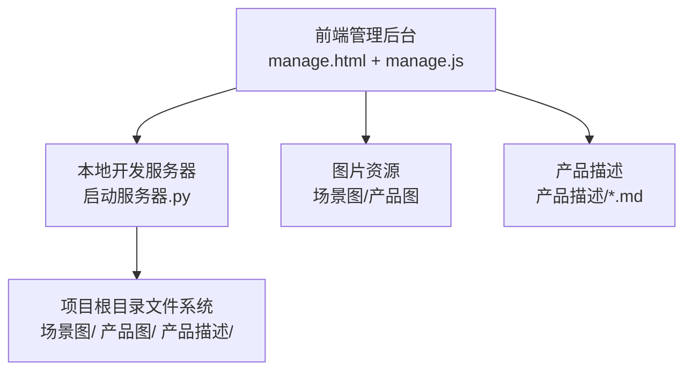
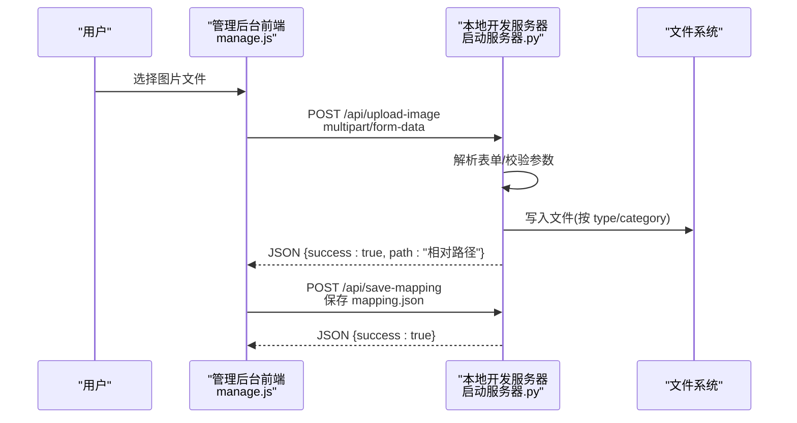
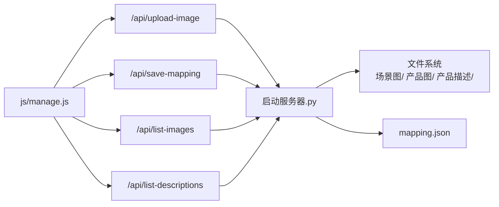

# 文件上传系统

<cite>
**本文引用的文件**
- [manage.html](file://manage.html)
- [js/manage.js](file://js/manage.js)
- [启动服务器.py](file://启动服务器.py)
- [mapping.json](file://mapping.json)
- [project_architecture.md](file://project_architecture.md)
- [产品描述/室内双面吊装标牌.md](file://产品描述/室内双面吊装标牌.md)
- [产品描述/电子水牌.md](file://产品描述/电子水牌.md)
</cite>

## 目录
1. [简介](#简介)
2. [项目结构](#项目结构)
3. [核心组件](#核心组件)
4. [架构总览](#架构总览)
5. [详细组件分析](#详细组件分析)
6. [依赖关系分析](#依赖关系分析)
7. [性能考量](#性能考量)
8. [故障排查指南](#故障排查指南)
9. [结论](#结论)
10. [附录](#附录)

## 简介
本文件上传系统服务于数字标牌项目的管理后台，负责接收前端上传的图片资源，并将其保存到项目根目录下的“场景图”和“产品图”目录中。系统通过本地开发服务器提供的 API 端点实现，支持场景图与产品图两类资源的上传，并提供图片列表查询、配置保存等功能。本文档将详细说明上传接口的实现机制、参数校验、文件类型与大小限制、存储策略、错误处理、安全考虑、性能优化以及调试监控建议。

## 项目结构
- 前端页面与脚本
  - 管理后台页面：manage.html
  - 管理后台逻辑：js/manage.js
- 本地开发服务器：启动服务器.py
- 数据配置：mapping.json
- 架构说明：project_architecture.md
- 示例产品描述：产品描述/xxx.md

图表来源
- [启动服务器.py:1-298](file://启动服务器.py#L1-L298)
- [manage.html:1-113](file://manage.html#L1-L113)
- [js/manage.js:1-811](file://js/manage.js#L1-L811)

章节来源
- [启动服务器.py:1-298](file://启动服务器.py#L1-L298)
- [project_architecture.md:43-108](file://project_architecture.md#L43-L108)

## 核心组件
- 前端上传逻辑
  - 通过 manage.js 的 uploadImage(file) 发起 POST /api/upload-image 请求，使用 FormData 传输文件。
- 服务器端 API
  - 启动服务器.py 中的 APIHandler 类提供 /api/upload-image 端点，解析 multipart/form-data，校验参数，保存文件并返回相对路径。
- 存储策略
  - 场景图按分类目录组织，产品图统一存放；目录不存在时自动创建；返回相对路径以适配静态文件服务。
- 错误处理
  - 对请求体格式、必需参数缺失、目录创建失败等情况进行统一错误响应。
- 安全与验证
  - 通过扩展名白名单限制图片格式；对 type 参数进行严格校验；对 category 参数在场景图上传时强制要求。

章节来源
- [js/manage.js:760-781](file://js/manage.js#L760-L781)
- [启动服务器.py:129-202](file://启动服务器.py#L129-L202)
- [启动服务器.py:20-22](file://启动服务器.py#L20-L22)

## 架构总览
前端通过 fetch 发送 multipart/form-data，服务器解析表单并根据 type 与 category 决定保存目录，随后写入文件并返回相对路径。管理后台收到路径后更新 mapping.json 中的 image 字段，最终通过 /api/save-mapping 保存配置。

图表来源
- [js/manage.js:760-781](file://js/manage.js#L760-L781)
- [启动服务器.py:87-97](file://启动服务器.py#L87-L97)
- [启动服务器.py:129-202](file://启动服务器.py#L129-L202)
- [启动服务器.py:101-127](file://启动服务器.py#L101-L127)

## 详细组件分析

### 上传接口实现机制
- 请求处理流程
  - 前端使用 FormData 附加 file 字段，同时可选传入 type、category、filename。
  - 服务器端解析 Content-Type 中的 boundary，使用 cgi.FieldStorage 读取表单字段。
  - 校验必需参数与类型，决定保存目录，写入文件，返回相对路径。
- 表单数据解析与文件接收
  - 服务器端逐块读取 file_item.file，避免一次性占用大量内存。
- 相对路径返回
  - 服务器计算相对路径并替换分隔符，保证跨平台一致性。

章节来源
- [js/manage.js:760-781](file://js/manage.js#L760-L781)
- [启动服务器.py:129-202](file://启动服务器.py#L129-L202)
- [启动服务器.py:144-152](file://启动服务器.py#L144-L152)
- [启动服务器.py:187-202](file://启动服务器.py#L187-L202)

### 上传参数验证与处理
- type 参数
  - 必须为 scene 或 product；否则返回错误。
  - scene：必须提供 category；否则返回错误。
  - product：无需 category。
- category 参数
  - 仅在 type=scene 时必填；作为子目录名使用。
- filename 参数
  - 可选；若未提供，则使用原始文件名；若原始文件名为空则回退为“unnamed”。

章节来源
- [启动服务器.py:154-182](file://启动服务器.py#L154-L182)
- [启动服务器.py:164-167](file://启动服务器.py#L164-L167)

### 文件类型验证与大小限制
- 支持的图片格式
  - 服务器端通过 IMAGE_EXTENSIONS 白名单限制为 .webp、.jpg、.png。
- 文件大小限制
  - 服务器端未设置显式大小上限；当前实现逐块读取写入，未对总大小进行限制。
- 安全验证措施
  - 未进行 MIME 类型校验；仅依据扩展名判断。
  - 未进行路径遍历防护（例如禁止 ../）；保存路径由 type/category 组合决定，避免直接使用用户输入作为路径。
  - 未进行恶意文件检测（如可执行文件、压缩包等）。

章节来源
- [启动服务器.py:20-22](file://启动服务器.py#L20-L22)
- [启动服务器.py:129-202](file://启动服务器.py#L129-L202)

### 文件存储策略
- 目录结构
  - 场景图：场景图/<category>/，其中 category 来自参数；若目录不存在则自动创建。
  - 产品图：产品图/。
- 文件路径计算
  - 保存路径 = 项目根目录 + 目录 + 文件名。
  - 返回相对路径并统一使用正斜杠。
- 相对路径返回机制
  - 便于静态文件服务直接访问，避免绝对路径带来的部署风险。

章节来源
- [启动服务器.py:172-185](file://启动服务器.py#L172-L185)
- [启动服务器.py:187-202](file://启动服务器.py#L187-L202)

### 错误处理机制
- 未知 API 路径
  - 返回“未知的 API 路径: ...”及 404。
- 请求体为空或 JSON 解析失败
  - /api/save-mapping：返回相应错误码与消息。
- 表单格式错误
  - /api/upload-image：当 Content-Type 不含 multipart/form-data 时返回 400。
- 缺少必需参数
  - /api/upload-image：缺少 type、缺少 category（type=scene）或未找到上传文件时返回 400。
- 目录创建失败
  - 服务器端异常时返回 500。
- 前端错误处理
  - 上传失败时在前端弹出错误提示；保存配置失败时也进行错误提示。

章节来源
- [启动服务器.py:84-97](file://启动服务器.py#L84-L97)
- [启动服务器.py:104-114](file://启动服务器.py#L104-L114)
- [启动服务器.py:132-135](file://启动服务器.py#L132-L135)
- [启动服务器.py:160-162](file://启动服务器.py#L160-L162)
- [js/manage.js:762-781](file://js/manage.js#L762-L781)

### 安全性考虑
- 文件类型过滤
  - 通过扩展名白名单限制图片格式，减少非图片文件被接受的风险。
- 路径遍历防护
  - 未直接使用用户输入作为保存路径；type=scene 时使用 category 作为子目录，避免 ../ 等路径遍历。
- 恶意文件检测
  - 当前未进行 MIME 类型校验、未对文件内容进行深度扫描，存在潜在风险。
- 建议增强
  - 引入 MIME 类型校验；
  - 对文件内容进行基本格式校验；
  - 限制文件大小；
  - 对保存路径进行更严格的规范化处理。

章节来源
- [启动服务器.py:20-22](file://启动服务器.py#L20-L22)
- [启动服务器.py:172-185](file://启动服务器.py#L172-L185)

### 性能优化策略
- 大文件处理
  - 服务器端采用分块读取写入，避免一次性占用大量内存。
- 并发上传支持
  - 当前未实现并发队列或并发限制；建议在前端引入队列与并发控制，避免同时发起过多请求导致内存压力。
- 内存管理
  - 服务器端逐块写入，前端使用 FormData，避免将整个文件读入内存。
- 建议优化
  - 前端增加进度条与取消能力；
  - 限制并发数量（如 2-3 个）；
  - 对大文件进行分片上传（可选）。

章节来源
- [启动服务器.py:187-195](file://启动服务器.py#L187-L195)
- [js/manage.js:760-781](file://js/manage.js#L760-L781)

### 调试与监控指南
- 日志记录
  - 建议在服务器端增加请求日志（时间、IP、路径、参数摘要、结果状态）。
- 错误追踪
  - 前端捕获 fetch 异常并记录错误信息；服务器端捕获异常并返回统一错误格式。
- 性能分析
  - 记录上传耗时、文件大小、并发数等指标，便于定位瓶颈。
- 建议实践
  - 使用浏览器开发者工具 Network 面板观察请求与响应；
  - 在服务器端输出关键步骤日志；
  - 对异常进行统一错误码与消息封装。

章节来源
- [js/manage.js:762-781](file://js/manage.js#L762-L781)
- [启动服务器.py:84-97](file://启动服务器.py#L84-L97)

## 依赖关系分析
- 前端依赖
  - manage.js 依赖 fetch 与 FormData；
  - manage.html 引入 manage.js。
- 服务器端依赖
  - 启动服务器.py 依赖 http.server、socketserver、cgi、urllib.parse、os、shutil、json 等标准库。
- 数据依赖
  - mapping.json 作为配置数据源，管理后台通过 /api/save-mapping 保存；/api/list-images 与 /api/list-descriptions 用于获取可用资源列表。

图表来源
- [js/manage.js:18-31](file://js/manage.js#L18-L31)
- [js/manage.js:760-781](file://js/manage.js#L760-L781)
- [启动服务器.py:54-97](file://启动服务器.py#L54-L97)
- [启动服务器.py:204-251](file://启动服务器.py#L204-L251)

章节来源
- [js/manage.js:18-31](file://js/manage.js#L18-L31)
- [启动服务器.py:54-97](file://启动服务器.py#L54-L97)
- [启动服务器.py:204-251](file://启动服务器.py#L204-L251)

## 性能考量
- 服务器端
  - 分块读取写入，降低内存峰值；
  - 未设置文件大小上限，需结合业务场景评估风险。
- 前端
  - 使用 FormData，避免大文件内存占用；
  - 建议增加并发控制与进度反馈。
- 建议
  - 为上传接口增加超时与重试机制；
  - 对大文件进行压缩或尺寸限制；
  - 增加断点续传（可选）。

章节来源
- [启动服务器.py:187-195](file://启动服务器.py#L187-L195)
- [js/manage.js:760-781](file://js/manage.js#L760-L781)

## 故障排查指南
- 常见问题
  - 上传失败：检查 Content-Type 是否为 multipart/form-data；确认 type 与 category 参数是否正确；查看服务器错误响应。
  - 保存失败：检查 /api/save-mapping 请求体是否为合法 JSON；确认服务器是否有写权限。
  - 图片未显示：确认返回的相对路径是否正确；检查静态文件服务是否可访问该路径。
- 前端调试
  - 使用浏览器 Network 面板查看请求与响应；
  - 在控制台查看错误日志。
- 服务器调试
  - 在关键步骤输出日志；
  - 捕获异常并返回统一错误格式。

章节来源
- [js/manage.js:762-781](file://js/manage.js#L762-L781)
- [启动服务器.py:84-97](file://启动服务器.py#L84-L97)

## 结论
本文件上传系统通过本地开发服务器提供简洁可靠的上传能力，支持场景图与产品图两类资源的上传与管理。系统在参数校验、目录创建与相对路径返回方面具备良好设计，但在文件类型校验、大小限制与恶意文件检测方面仍有改进空间。建议在生产环境中引入 MIME 校验、文件内容校验、大小限制与更严格的路径规范化，并优化前端并发与进度反馈能力。

## 附录
- API 端点概览
  - POST /api/save-mapping：保存 mapping.json（自动备份）
  - POST /api/upload-image：上传图片（multipart/form-data）
  - GET /api/list-images：获取图片列表
  - GET /api/list-descriptions：获取产品描述文件列表

章节来源
- [project_architecture.md:763-777](file://project_architecture.md#L763-L777)
- [启动服务器.py:266-295](file://启动服务器.py#L266-L295)