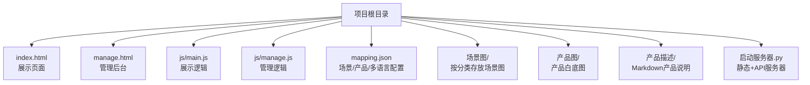
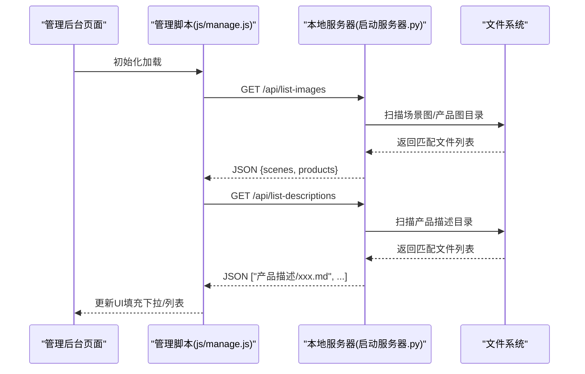
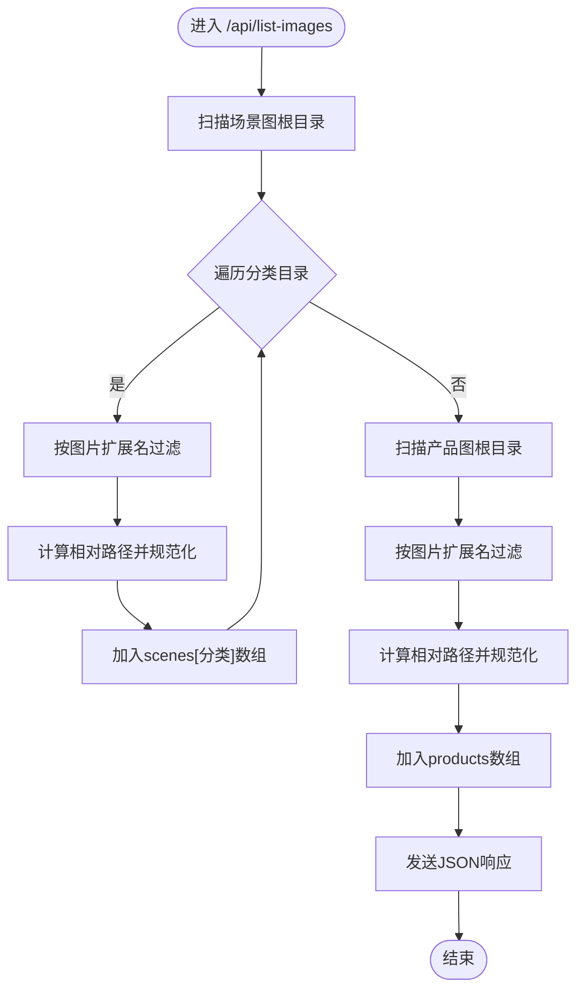
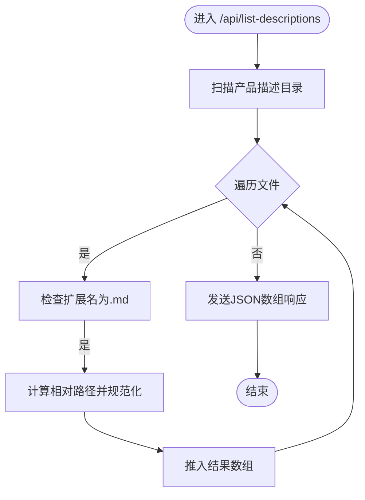
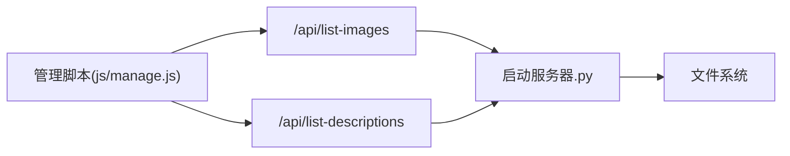

# 文件列表API

<cite>
**本文引用的文件**
- [启动服务器.py](file://启动服务器.py)
- [项目架构文档](file://project_architecture.md)
- [管理后台页面](file://manage.html)
- [管理后台脚本](file://js/manage.js)
- [映射配置文件](file://mapping.json)
- [产品描述示例](file://产品描述/室内双面吊装标牌.md)
</cite>

## 目录
1. [简介](#简介)
2. [项目结构](#项目结构)
3. [核心组件](#核心组件)
4. [架构总览](#架构总览)
5. [详细组件分析](#详细组件分析)
6. [依赖分析](#依赖分析)
7. [性能考量](#性能考量)
8. [故障排查指南](#故障排查指南)
9. [结论](#结论)
10. [附录](#附录)

## 简介
本文件针对数字标牌项目的文件列表API进行深入说明，重点覆盖以下两个接口：
- GET /api/list-images：返回场景图与产品图的文件清单，按场景分类组织
- GET /api/list-descriptions：返回产品描述Markdown文件的完整路径清单

文档将从实现原理、扫描机制、过滤逻辑、数据结构、响应格式、调用示例、性能优化、扩展性、测试验证以及与前端集成等方面进行全面阐述。

## 项目结构
项目采用“静态资源 + 本地Python服务器”的轻量架构，核心目录与文件如下：
- 根目录包含页面入口、样式、脚本、映射配置与两类API数据源目录
- 场景图目录按场景分类组织，产品图目录存放产品白底图，产品描述目录存放Markdown文件
- 本地服务器提供静态文件服务与若干API端点，其中包含上述两个文件列表API

图表来源
- [启动服务器.py:1-298](file://启动服务器.py#L1-L298)
- [项目架构文档:43-108](file://project_architecture.md#L43-L108)

章节来源
- [项目架构文档:43-108](file://project_architecture.md#L43-L108)
- [启动服务器.py:17-298](file://启动服务器.py#L17-L298)

## 核心组件
- 本地开发服务器：基于Python内置HTTP服务器，扩展CORS与4个API端点
- 文件扫描器：针对场景图、产品图、产品描述三类目录进行递归扫描
- 过滤器：根据扩展名进行文件类型过滤
- 路径规范化：统一使用相对路径并替换分隔符，保证跨平台一致性
- 响应构造器：将扫描结果封装为JSON结构返回

章节来源
- [启动服务器.py:25-236](file://启动服务器.py#L25-L236)

## 架构总览
文件列表API的调用链路如下：
- 管理后台在初始化时分别调用两个API获取可用文件列表
- 服务器解析请求路径，路由到对应API处理函数
- 处理函数扫描对应目录，过滤文件类型，构造响应数据
- 前端接收JSON后，填充下拉选择框等UI控件

图表来源
- [管理后台脚本:48-72](file://js/manage.js#L48-L72)
- [启动服务器.py:75-251](file://启动服务器.py#L75-L251)

章节来源
- [管理后台脚本:48-72](file://js/manage.js#L48-L72)
- [启动服务器.py:75-251](file://启动服务器.py#L75-L251)

## 详细组件分析

### /api/list-images 接口
- 功能：返回场景图与产品图的文件清单
- 请求方式：GET /api/list-images
- 响应结构：
  - scenes: 对象，键为场景分类名，值为该分类下的图片路径数组
  - products: 产品图路径数组
- 扫描机制：
  - 场景图扫描：遍历场景图根目录下的子目录（分类），对每个分类目录内的文件进行扩展名过滤
  - 产品图扫描：遍历产品图根目录下的文件进行扩展名过滤
- 过滤逻辑：
  - 仅接受特定图片扩展名（由服务器常量定义）
- 路径规范化：
  - 使用相对路径，统一替换目录分隔符为正斜杠，确保跨平台一致

图表来源
- [启动服务器.py:204-236](file://启动服务器.py#L204-L236)

章节来源
- [启动服务器.py:204-236](file://启动服务器.py#L204-L236)

### /api/list-descriptions 接口
- 功能：返回产品描述Markdown文件的完整路径清单
- 请求方式：GET /api/list-descriptions
- 响应结构：字符串数组，每个元素为产品描述文件的相对路径
- 扫描机制：递归扫描产品描述目录
- 过滤逻辑：仅接受.md扩展名
- 路径规范化：同上，统一为相对路径并规范化

图表来源
- [启动服务器.py:238-251](file://启动服务器.py#L238-L251)

章节来源
- [启动服务器.py:238-251](file://启动服务器.py#L238-L251)

### 响应数据格式规范
- /api/list-images
  - 类型：对象
  - 字段
    - scenes: 对象，键为分类名（字符串），值为数组（字符串[]，元素为相对路径）
    - products: 数组（字符串[]，元素为相对路径）
- /api/list-descriptions
  - 类型：数组
  - 元素：字符串（产品描述文件的相对路径）

章节来源
- [启动服务器.py:209-236](file://启动服务器.py#L209-L236)
- [启动服务器.py:241-251](file://启动服务器.py#L241-L251)

### API调用示例与错误处理
- 管理后台前端调用方式（示意）
  - 获取图片列表：fetch('/api/list-images').then(r=>r.json()).then(data=>{ /* 更新UI */ })
  - 获取描述列表：fetch('/api/list-descriptions').then(r=>r.json()).then(files=>{ /* 更新UI */ })
- 错误处理策略
  - 前端捕获异常并降级为空数组，避免阻塞初始化
  - 服务器端对未知路径返回404，对内部异常返回500并包含错误信息

章节来源
- [管理后台脚本:48-72](file://js/manage.js#L48-L72)
- [启动服务器.py:84-97](file://启动服务器.py#L84-L97)

## 依赖分析
- 服务器端依赖
  - Python标准库：http.server、socketserver、os、json、urllib.parse、cgi等
- 前端依赖
  - 原生JavaScript，无第三方依赖
  - 管理后台通过fetch调用API，使用FormData上传图片

图表来源
- [管理后台脚本:48-72](file://js/manage.js#L48-L72)
- [启动服务器.py:75-251](file://启动服务器.py#L75-L251)

章节来源
- [管理后台脚本:48-72](file://js/manage.js#L48-L72)
- [启动服务器.py:75-251](file://启动服务器.py#L75-L251)

## 性能考量
- 文件系统访问优化
  - 仅扫描必要目录，避免深度递归与隐藏文件遍历
  - 使用排序遍历，便于前端稳定展示
- 响应时间优化
  - 服务器端不做复杂计算，主要为IO与字符串处理
  - 前端在初始化阶段并行加载两个列表，减少等待时间
- 缓存机制
  - 前端可对返回的文件列表进行内存缓存，避免重复请求
  - 服务器端未实现文件系统缓存，建议在生产环境中引入文件系统监控或CDN

章节来源
- [启动服务器.py:204-251](file://启动服务器.py#L204-L251)
- [管理后台脚本:48-72](file://js/manage.js#L48-L72)

## 故障排查指南
- 常见问题
  - API返回404：确认请求路径正确且服务器已启动
  - API返回500：查看服务器日志，检查目录权限与路径
  - 前端获取列表为空：确认目录中存在符合扩展名的文件
- 排查步骤
  - 检查服务器输出的端口与URL
  - 手动访问API端点验证返回内容
  - 确认目录结构与扩展名符合预期

章节来源
- [启动服务器.py:84-97](file://启动服务器.py#L84-L97)

## 结论
文件列表API通过简洁的扫描与过滤逻辑，为管理后台提供了稳定的文件发现能力。其设计遵循最小依赖、易于维护的原则，适合在本地开发与小规模部署场景中使用。若需进一步提升性能与可维护性，可在前端引入缓存策略，并在生产环境中考虑引入文件监控或CDN。

## 附录

### API端点一览
- GET /api/list-images：返回场景图与产品图文件列表
- GET /api/list-descriptions：返回产品描述文件列表

章节来源
- [项目架构文档:769-776](file://project_architecture.md#L769-L776)

### 响应示例（结构示意）
- /api/list-images
  - {
    "scenes": {
      "分类A": ["场景图/分类A/图1.webp", "场景图/分类A/图2.jpg"],
      "分类B": ["场景图/分类B/图3.png"]
    },
    "products": ["产品图/产品1.webp", "产品图/产品2.jpg"]
  }
- /api/list-descriptions
  - ["产品描述/产品A.md", "产品描述/产品B.md"]

章节来源
- [启动服务器.py:209-236](file://启动服务器.py#L209-L236)
- [启动服务器.py:241-251](file://启动服务器.py#L241-L251)

### 与前端应用的集成最佳实践
- 数据绑定
  - 将API返回的文件列表映射为下拉选项或网格卡片
- 状态管理
  - 在全局状态中缓存文件列表，避免重复请求
- 错误处理
  - 对API调用失败进行降级处理，保持UI可用性
- 路径处理
  - 始终使用相对路径，避免硬编码绝对路径

章节来源
- [管理后台脚本:48-72](file://js/manage.js#L48-L72)