# 文件系统管理

<cite>
**本文档引用的文件**
- [index.html](file://index.html)
- [manage.html](file://manage.html)
- [mapping.json](file://mapping.json)
- [启动服务器.py](file://启动服务器.py)
- [project_architecture.md](file://project_architecture.md)
- [js/main.js](file://js/main.js)
- [js/manage.js](file://js/manage.js)
- [产品描述/室内双面吊装标牌.md](file://产品描述/室内双面吊装标牌.md)
- [产品描述/电子水牌.md](file://产品描述/电子水牌.md)
</cite>

## 目录
1. [简介](#简介)
2. [项目结构](#项目结构)
3. [核心组件](#核心组件)
4. [架构概览](#架构概览)
5. [详细组件分析](#详细组件分析)
6. [依赖关系分析](#依赖关系分析)
7. [性能考虑](#性能考虑)
8. [故障排除指南](#故障排除指南)
9. [结论](#结论)

## 简介

数字标牌产品展示项目是一个基于Web技术的静态文件管理系统，专门用于管理和展示数字标牌产品在不同应用场景中的展示效果。该项目采用纯原生JavaScript实现，无需任何外部框架依赖，通过Python本地服务器提供API接口支持。

项目的核心功能包括：
- 场景化产品展示（支持中日文双语切换）
- 可视化场景编辑和管理
- 动态文件系统管理
- 实时文件上传和版本控制
- 智能文件分类和组织

## 项目结构

项目采用清晰的文件组织结构，按照功能和用途进行分类管理：

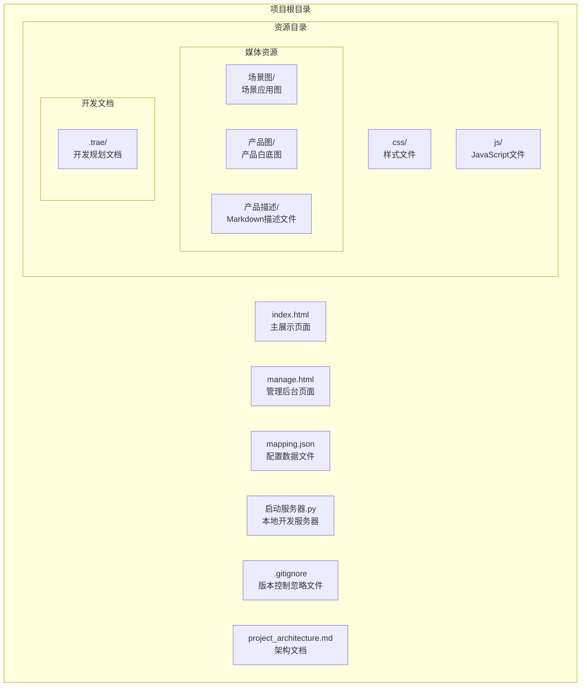

**图表来源**
- [project_architecture.md:43-108](file://project_architecture.md#L43-L108)

### 目录结构详解

#### 核心页面文件
- **index.html**: 主展示页面，负责产品场景的展示和交互
- **manage.html**: 管理后台页面，提供可视化编辑功能
- **mapping.json**: 核心配置文件，存储场景、产品和多语言数据

#### 资源组织
- **css/**: 样式文件目录，包含展示页面和管理后台的样式
- **js/**: JavaScript逻辑文件，包含业务逻辑和交互处理
- **场景图/**: 场景应用图片，按应用场景分类存储
- **产品图/**: 产品展示图片，统一格式存储
- **产品描述/**: Markdown格式的产品描述文件

**章节来源**
- [project_architecture.md:43-108](file://project_architecture.md#L43-L108)

## 核心组件

### 文件系统架构

项目采用三层文件分类体系：

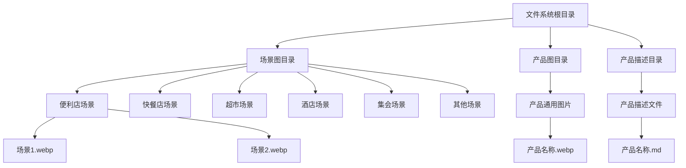

**图表来源**
- [project_architecture.md:60-101](file://project_architecture.md#L60-L101)

### 文件类型规范

项目严格遵循文件类型和命名规范：

| 文件类型 | 存储目录 | 文件扩展名 | 规范要求 | 示例 |
|---------|---------|-----------|---------|------|
| 场景图片 | 场景图/分类名 | .webp | 1. 优先使用WebP格式 2. 文件名简洁明确 3. 按应用场景分类 | 便利店场景1.webp |
| 产品图片 | 产品图 | .webp | 1. 白底透明背景 2. 统一尺寸规格 3. 无多余边框 | 商用壁挂液晶显示器.webp |
| 产品描述 | 产品描述 | .md | 1. Markdown格式 2. 清晰的产品特性描述 3. 结构化列表 | 商用壁挂液晶显示器.md |

**章节来源**
- [project_architecture.md:60-101](file://project_architecture.md#L60-L101)

## 架构概览

### 系统架构图

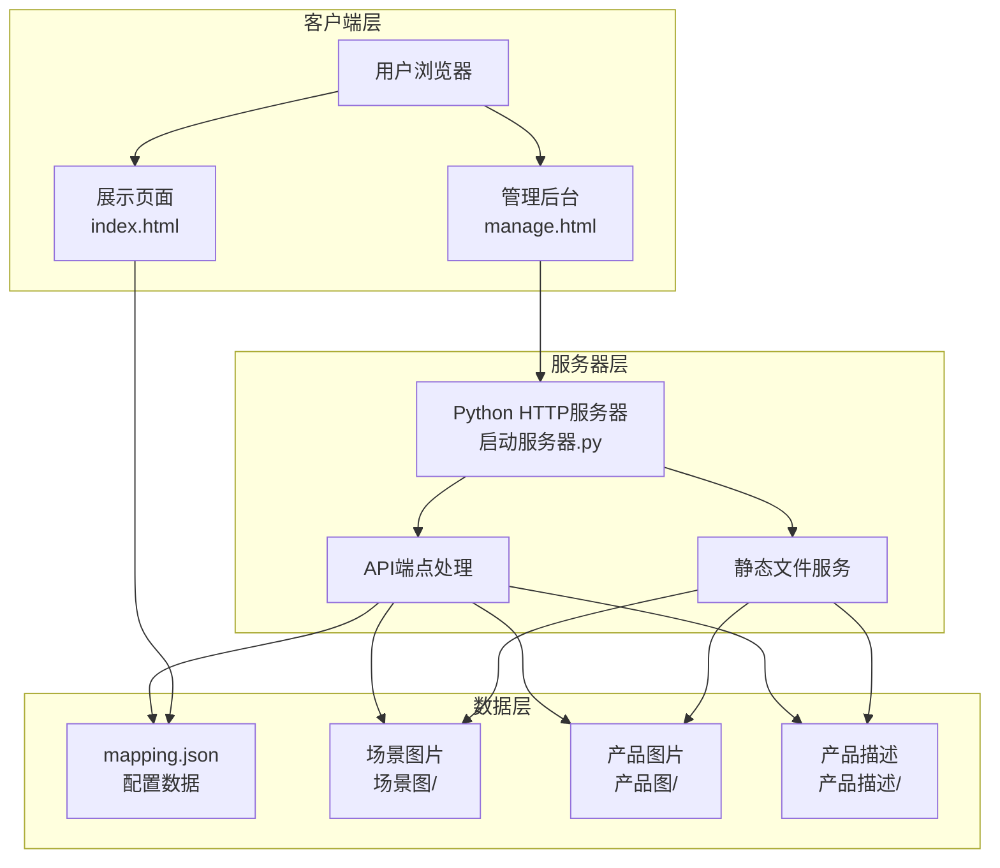

**图表来源**
- [启动服务器.py:25-298](file://启动服务器.py#L25-L298)

### 数据流架构

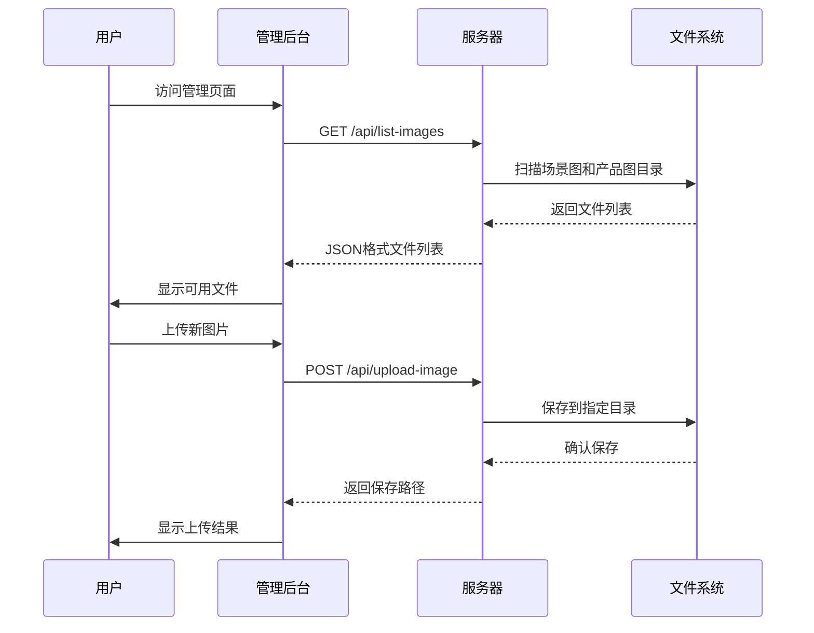

**图表来源**
- [启动服务器.py:75-252](file://启动服务器.py#L75-L252)

## 详细组件分析

### 文件上传机制

#### 上传流程设计

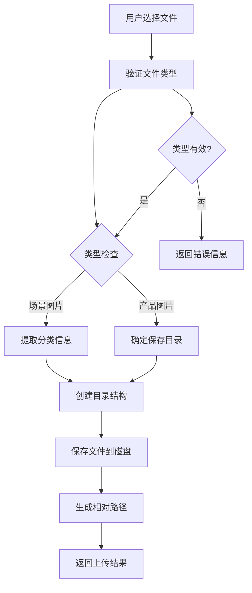

**图表来源**
- [启动服务器.py:129-202](file://启动服务器.py#L129-L202)

#### 文件类型验证

服务器端实现了严格的文件类型验证机制：

| 验证维度 | 验证规则 | 实现方式 | 错误处理 |
|---------|---------|---------|---------|
| MIME类型 | 必须为multipart/form-data | Content-Type解析 | 返回400错误 |
| 文件类型参数 | type必须为scene或product | 参数校验 | 返回400错误 |
| 分类参数 | 场景图片必须提供category | 条件验证 | 返回400错误 |
| 文件扩展名 | 支持.webp, .jpg, .png | 扩展名检查 | 使用原始扩展名 |
| 文件大小 | 无限制（受服务器内存限制） | 文件读取 | 内存不足时异常 |

**章节来源**
- [启动服务器.py:129-202](file://启动服务器.py#L129-L202)

### 文件列表获取功能

#### API接口设计

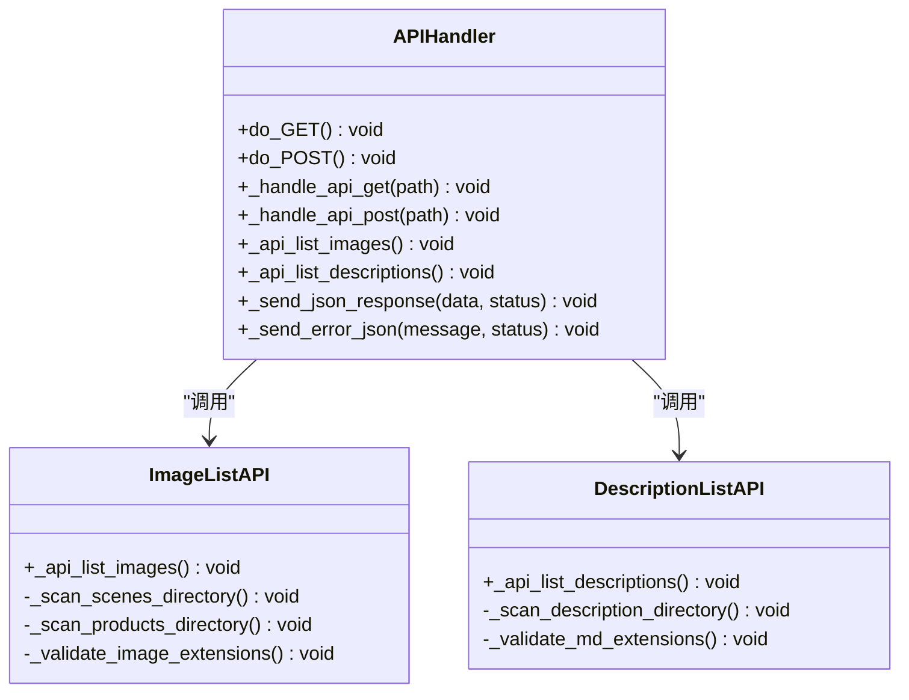

**图表来源**
- [启动服务器.py:75-252](file://启动服务器.py#L75-L252)

#### 文件扫描策略

服务器采用递归扫描策略获取文件列表：

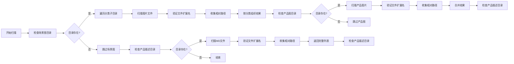

**图表来源**
- [启动服务器.py:204-251](file://启动服务器.py#L204-L251)

**章节来源**
- [启动服务器.py:204-251](file://启动服务器.py#L204-L251)

### 配置数据管理

#### 数据结构设计

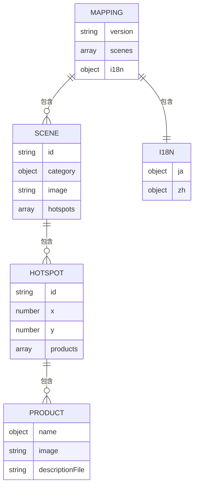

**图表来源**
- [mapping.json:1-232](file://mapping.json#L1-L232)

#### 版本控制机制

服务器实现了智能的版本控制和备份策略：

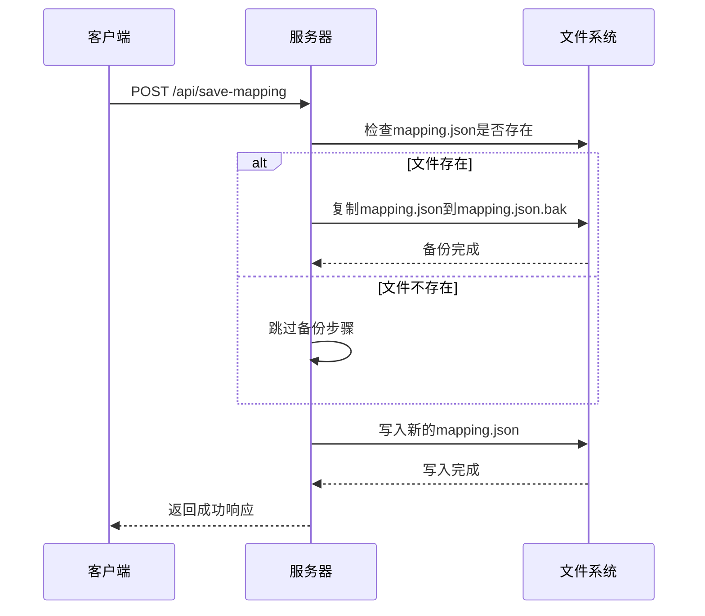

**图表来源**
- [启动服务器.py:101-127](file://启动服务器.py#L101-L127)

**章节来源**
- [启动服务器.py:101-127](file://启动服务器.py#L101-L127)

### 前端文件管理

#### 展示页面文件处理

前端JavaScript实现了智能的文件加载和缓存机制：

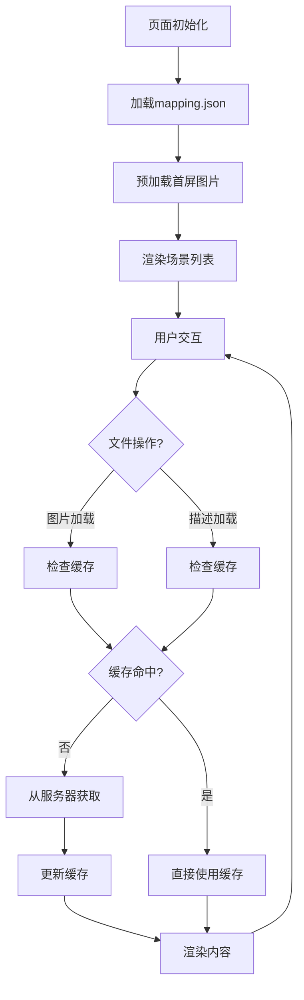

**图表来源**
- [js/main.js:49-73](file://js/main.js#L49-L73)

#### 管理后台文件操作

管理后台提供了完整的文件管理功能：

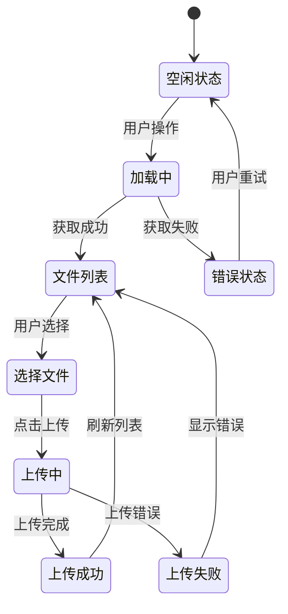

**图表来源**
- [js/manage.js:48-72](file://js/manage.js#L48-L72)

**章节来源**
- [js/manage.js:48-72](file://js/manage.js#L48-L72)

## 依赖关系分析

### 组件间依赖关系

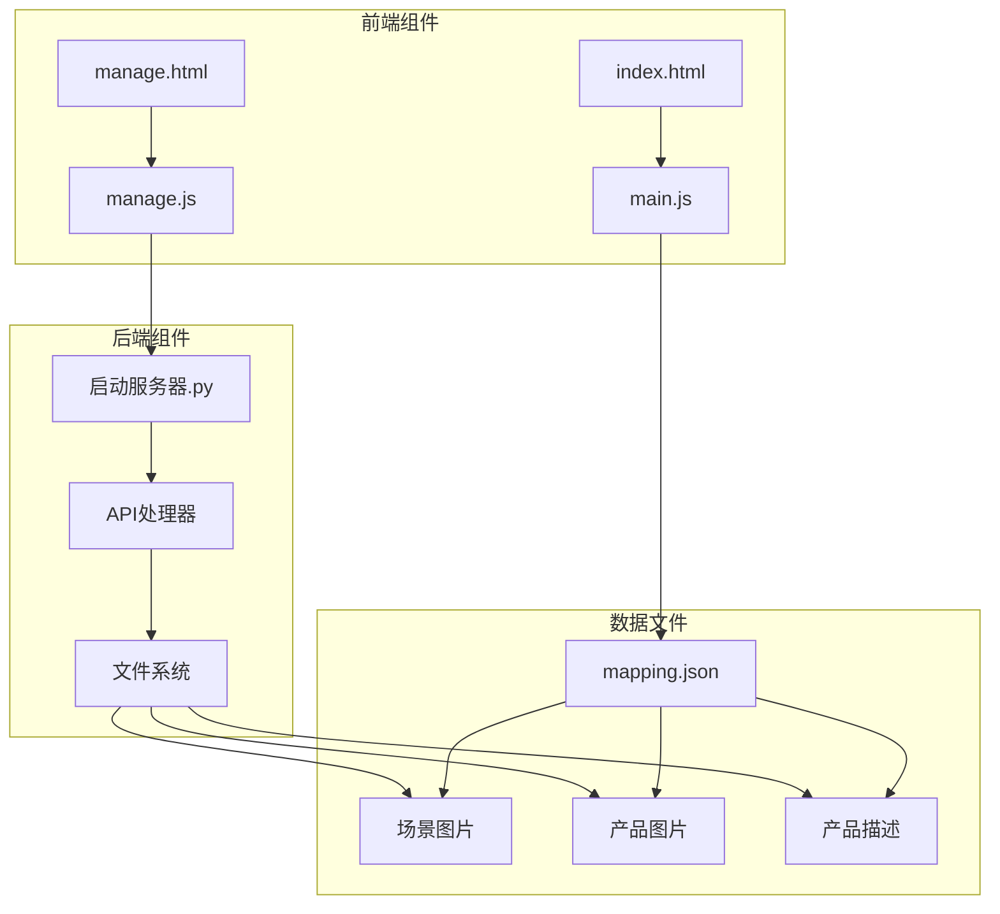

**图表来源**
- [启动服务器.py:25-298](file://启动服务器.py#L25-L298)

### 数据依赖关系

项目的数据依赖呈现层次化结构：

1. **配置层**: mapping.json作为单一数据源
2. **媒体层**: 场景图、产品图、产品描述文件
3. **逻辑层**: JavaScript业务逻辑处理
4. **服务层**: Python服务器API接口

**章节来源**
- [project_architecture.md:112-254](file://project_architecture.md#L112-L254)

## 性能考虑

### 文件系统性能优化

项目在文件系统层面采用了多项性能优化策略：

#### 缓存策略
- **图片预加载**: 首屏图片优先加载，后续图片异步预加载
- **描述文件缓存**: Markdown文件内容缓存，避免重复网络请求
- **配置数据缓存**: mapping.json数据缓存，减少服务器压力

#### 存储优化
- **WebP格式优先**: 使用现代压缩格式减少文件体积
- **目录结构优化**: 按应用场景分类存储，便于快速检索
- **文件命名规范**: 简洁明确的文件名便于管理和识别

#### 网络优化
- **CORS支持**: 允许本地开发跨域请求
- **错误重试**: 数据加载失败自动重试机制
- **进度反馈**: 上传和加载过程的实时状态反馈

## 故障排除指南

### 常见问题及解决方案

#### 文件上传失败

**问题症状**:
- 上传按钮无响应
- 控制台出现400错误
- 文件未出现在目标目录

**可能原因**:
1. 文件类型不匹配
2. 缺少必需参数
3. 目录权限问题
4. 网络连接中断

**解决步骤**:
1. 检查文件扩展名是否为.webp/.jpg/.png
2. 确认type参数为scene或product
3. 验证category参数（场景图片必需）
4. 检查服务器磁盘空间
5. 重启本地服务器

#### 文件列表获取失败

**问题症状**:
- 管理后台显示空列表
- 控制台出现500错误
- 页面加载缓慢

**可能原因**:
1. 目录权限不足
2. 文件名包含特殊字符
3. 文件损坏
4. 服务器配置问题

**解决步骤**:
1. 检查场景图和产品图目录权限
2. 验证文件名符合命名规范
3. 重新上传损坏文件
4. 清理服务器缓存

#### 配置文件保存失败

**问题症状**:
- 保存按钮显示失败
- mapping.json未更新
- 备份文件未创建

**可能原因**:
1. JSON格式错误
2. 服务器权限不足
3. 磁盘空间不足
4. 文件被其他进程占用

**解决步骤**:
1. 验证JSON格式正确性
2. 检查服务器写入权限
3. 清理磁盘空间
4. 关闭占用文件的程序

**章节来源**
- [启动服务器.py:44-97](file://启动服务器.py#L44-L97)

### 调试工具和方法

#### 服务器日志分析
- 查看Python服务器输出的错误信息
- 监控文件系统访问权限
- 分析API请求响应时间

#### 前端调试
- 使用浏览器开发者工具监控网络请求
- 检查JavaScript控制台错误
- 验证DOM元素状态变化

#### 文件系统检查
- 验证目录结构完整性
- 检查文件权限设置
- 确认文件编码格式

## 结论

数字标牌产品展示项目的文件系统管理方案体现了现代Web应用的最佳实践。通过清晰的文件分类、严格的类型验证、智能的缓存策略和完善的错误处理机制，项目实现了高效、可靠、易维护的文件管理系统。

### 主要优势

1. **结构清晰**: 采用层次化的目录结构，便于文件管理和维护
2. **类型安全**: 严格的文件类型验证，防止恶意文件上传
3. **性能优化**: 智能缓存和预加载机制，提升用户体验
4. **版本控制**: 自动备份机制，确保数据安全
5. **易于扩展**: 模块化设计，便于功能扩展和维护

### 发展建议

1. **监控机制**: 增加文件系统使用情况监控
2. **自动化测试**: 建立文件上传和下载的自动化测试
3. **性能分析**: 定期分析文件访问模式，优化存储策略
4. **安全审计**: 定期检查文件权限和访问日志

该项目为数字标牌行业的文件管理提供了一个优秀的参考模板，其设计理念和实现方案值得类似项目借鉴和学习。