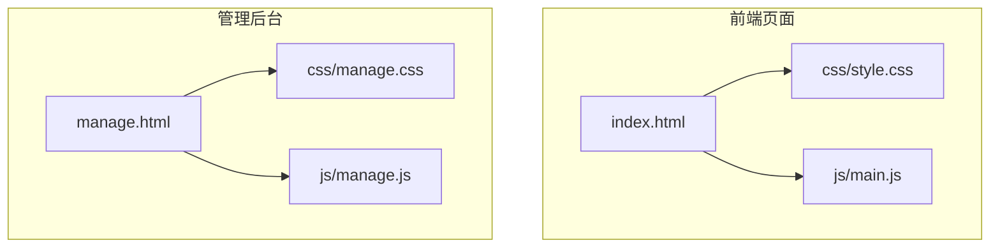
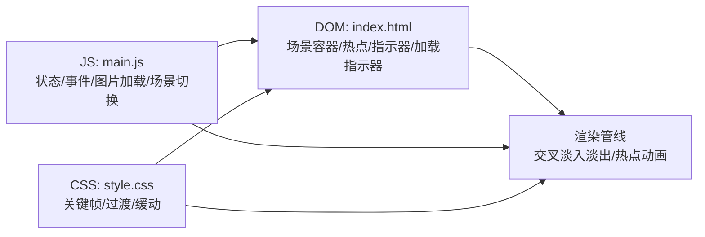
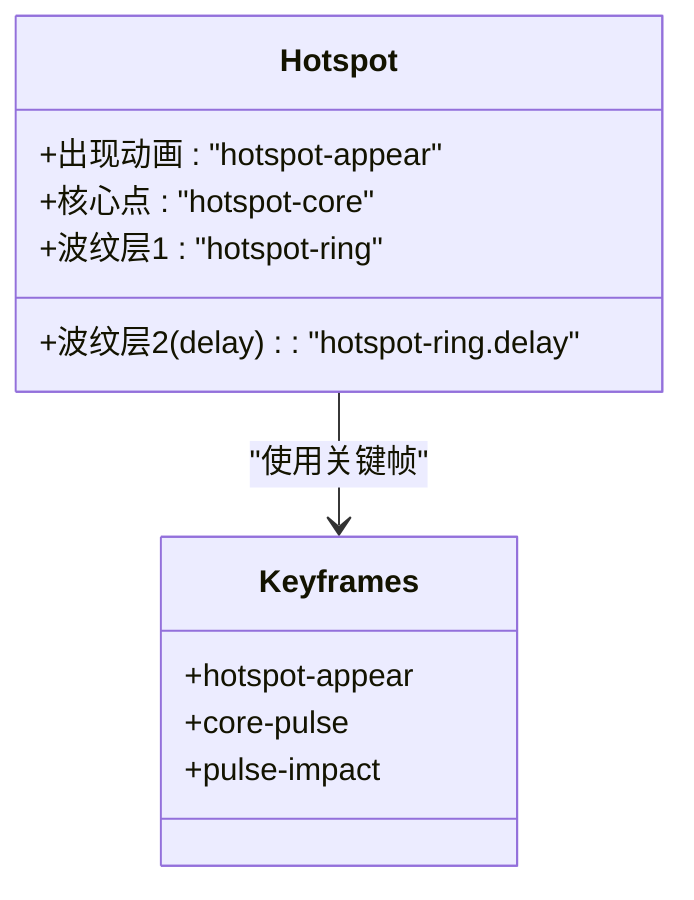
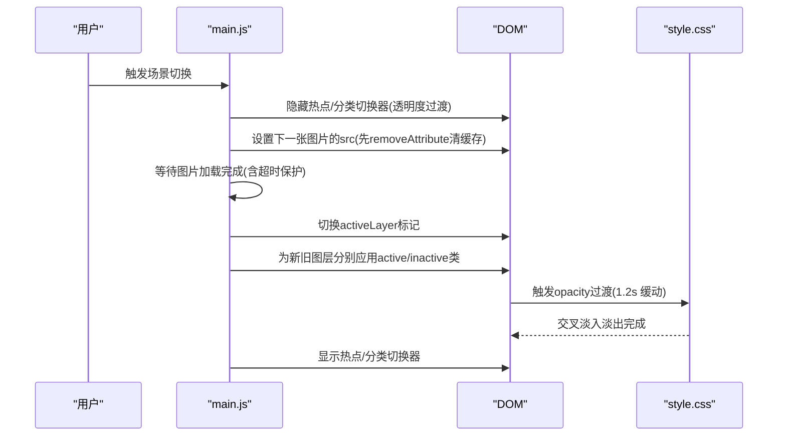
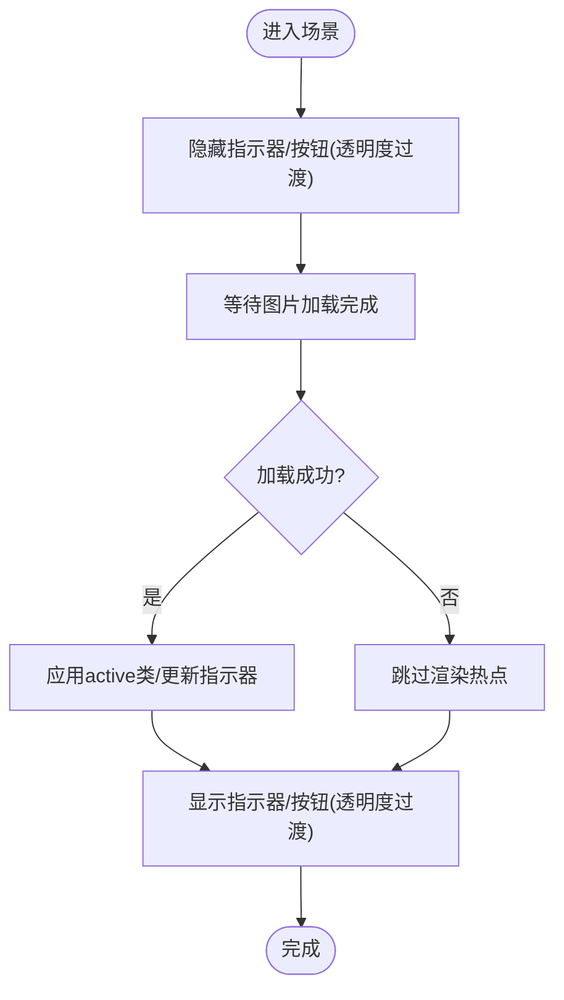
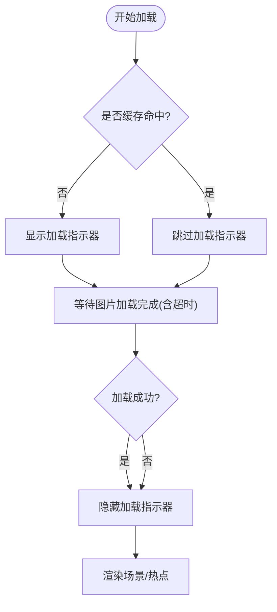
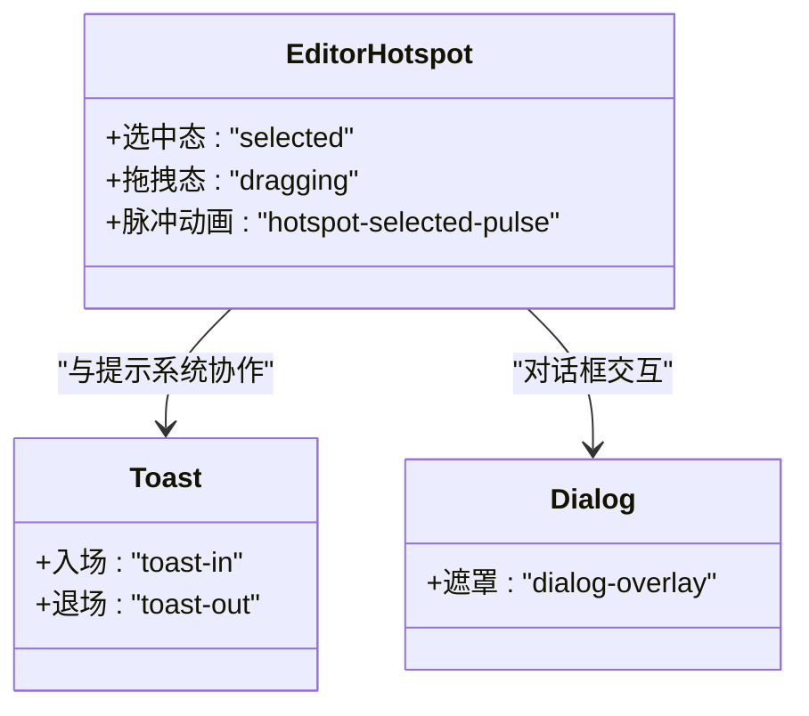
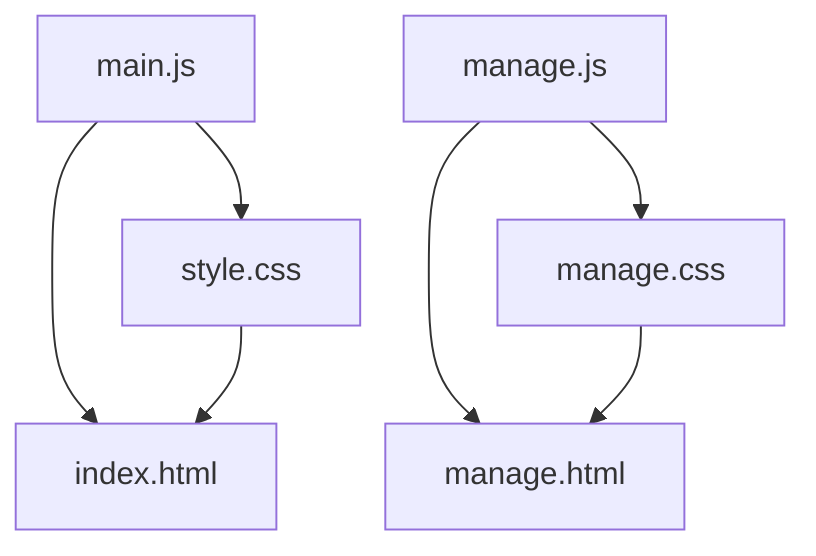

# 动画效果系统

<cite>
**本文引用的文件**
- [index.html](file://index.html)
- [style.css](file://css/style.css)
- [main.js](file://js/main.js)
- [manage.html](file://manage.html)
- [manage.css](file://css/manage.css)
- [manage.js](file://js/manage.js)
</cite>

## 目录
1. [简介](#简介)
2. [项目结构](#项目结构)
3. [核心组件](#核心组件)
4. [架构总览](#架构总览)
5. [详细组件分析](#详细组件分析)
6. [依赖关系分析](#依赖关系分析)
7. [性能考量](#性能考量)
8. [故障排查指南](#故障排查指南)
9. [结论](#结论)
10. [附录](#附录)

## 简介
本文件面向数字标牌项目的动画效果系统，聚焦于CSS动画与JavaScript驱动的动画协同实现，涵盖以下主题：
- CSS动画实现原理：关键帧动画、过渡效果、变换动画
- 脉冲热点动画：核心点脉冲、波纹扩散、延迟动画的组合
- 交叉淡入淡出动画：两层图片叠加、透明度控制、缓动函数
- 场景切换动画：基于CSS transition的流畅切换
- 性能优化：硬件加速、帧率控制、内存管理
- 可访问性：减少动态效果的用户偏好支持
- 调试与测试：工具与方法建议

## 项目结构
前端采用“HTML + CSS + 原生JS”的轻量架构，主页面负责展示与动画，管理后台负责场景与热点的编辑与保存。

图表来源
- [index.html](file://index.html)
- [style.css](file://css/style.css)
- [main.js](file://js/main.js)
- [manage.html](file://manage.html)
- [manage.css](file://css/manage.css)
- [manage.js](file://js/manage.js)

章节来源
- [index.html](file://index.html)
- [manage.html](file://manage.html)

## 核心组件
- 场景容器与双层图片：通过两个图片层实现交叉淡入淡出，配合过渡时长与缓动曲线保证顺滑。
- 脉冲热点：由核心点脉冲与两层波纹（带延迟）组成，形成“核心发光+同心扩散”的复合动画。
- 场景指示器与导航按钮：统一使用过渡与缓动，提升交互反馈。
- 加载指示器与骨架屏：在图片加载期间提供视觉反馈，避免闪烁与空白。
- 管理后台动画：热点选中脉冲、Toast提示入场/退场、对话框遮罩等。

章节来源
- [style.css](file://css/style.css)
- [main.js](file://js/main.js)
- [manage.css](file://css/manage.css)
- [manage.js](file://js/manage.js)

## 架构总览
整体架构围绕“DOM + CSS动画 + JS状态控制”展开。JS负责数据加载、状态管理、图片预加载与场景切换；CSS负责动画表现与过渡；HTML负责结构与可访问性语义。

图表来源
- [main.js](file://js/main.js)
- [style.css](file://css/style.css)
- [index.html](file://index.html)

## 详细组件分析

### 脉冲热点动画系统
脉冲热点由三层元素构成：核心点、第一层波纹、第二层波纹（延迟）。通过CSS关键帧与动画延迟实现错峰扩散，营造自然的脉冲感。

图表来源
- [style.css](file://css/style.css)

实现要点
- 出现动画：通过关键帧在极短时间内完成缩放与透明度变化，配合缓动曲线提升起始感受。
- 核心点脉冲：关键帧在中间态放大并增强阴影，形成“呼吸”感；hover时停止动画并强化发光。
- 波纹扩散：两层波纹以不同延迟播放，起始尺寸与边框颜色随时间变化，最终淡出至不可见。
- 多热点延迟：通过nth-child选择器对多个热点设置不同的animation-delay，避免同时播放造成的视觉拥挤。

章节来源
- [style.css](file://css/style.css)
- [main.js](file://js/main.js)

### 交叉淡入淡出动画系统
双层图片实现无缝场景切换，避免黑屏与闪烁。通过active/inactive类控制透明度与层级，并配合过渡时长与缓动曲线。

图表来源
- [main.js](file://js/main.js)
- [style.css](file://css/style.css)

实现要点
- 图片加载等待：使用事件监听与超时保护，避免“黑屏+孤立热点”的问题。
- 双层切换：先隐藏热点与分类切换器，再进行图片切换，最后恢复可见性，保证视觉一致性。
- 过渡时长与缓动：统一使用cubic-bezier曲线，确保动画节奏一致且顺滑。

章节来源
- [main.js](file://js/main.js)
- [style.css](file://css/style.css)

### 场景指示器与导航按钮
底部圆点指示器与左右导航按钮均采用过渡与缓动，hover时增强视觉反馈，active态强调当前状态。

图表来源
- [main.js](file://js/main.js)
- [style.css](file://css/style.css)

章节来源
- [style.css](file://css/style.css)
- [main.js](file://js/main.js)

### 加载指示器与骨架屏
在图片加载期间显示旋转指示器与骨架屏，避免空白与闪烁，提升感知速度与稳定性。

图表来源
- [main.js](file://js/main.js)
- [style.css](file://css/style.css)

章节来源
- [style.css](file://css/style.css)
- [main.js](file://js/main.js)

### 管理后台动画
管理界面包含热点选中脉冲、Toast提示的入场/退场动画、对话框遮罩等，统一使用关键帧与过渡。

图表来源
- [manage.css](file://css/manage.css)
- [manage.js](file://js/manage.js)

章节来源
- [manage.css](file://css/manage.css)
- [manage.js](file://js/manage.js)

## 依赖关系分析
- JS与CSS的耦合点主要体现在类名与过渡属性上：JS通过切换active/inactive类触发动画，CSS通过关键帧与过渡定义动画行为。
- HTML结构为动画提供锚点：场景容器、热点容器、指示器、加载指示器等。
- 管理后台与主页面共享部分动画模式（如Toast、关键帧），但实现细节不同。

图表来源
- [main.js](file://js/main.js)
- [style.css](file://css/style.css)
- [index.html](file://index.html)
- [manage.js](file://js/manage.js)
- [manage.css](file://css/manage.css)
- [manage.html](file://manage.html)

章节来源
- [main.js](file://js/main.js)
- [style.css](file://css/style.css)
- [index.html](file://index.html)
- [manage.js](file://js/manage.js)
- [manage.css](file://css/manage.css)
- [manage.html](file://manage.html)

## 性能考量
- 硬件加速与合成层
  - 使用transform与opacity而非布局相关的属性（如width/height/left/top）可触发GPU加速，降低主线程压力。
  - 在高频动画中尽量避免强制同步布局（reflow）。
- 帧率与缓动
  - 统一使用cubic-bezier缓动曲线，避免过于复杂的贝塞尔曲线导致抖动。
  - 控制动画时长与频率，避免在同一时间触发过多动画。
- 内存与资源
  - 图片预加载与缓存命中可显著减少首屏等待与闪烁。
  - 使用requestAnimationFrame进行批量DOM更新，避免频繁重排。
- 可访问性
  - 提供prefers-reduced-motion支持：当用户禁用动画时，JS应移除关键帧与过渡，或将其降级为静态状态。
  - 为交互元素提供键盘可达性与ARIA标签，确保动画不影响可理解性。

[本节为通用指导，不直接分析具体文件]

## 故障排查指南
- 场景切换黑屏或闪烁
  - 检查图片加载是否成功，确认waitForImageLoad返回值与超时逻辑。
  - 确保切换前先移除旧src并设置新src，避免complete状态残留。
- 热点位置不正确
  - 确认图片已完全加载后再计算热点像素位置，避免naturalWidth为0导致偏移。
- 动画卡顿或掉帧
  - 检查是否在动画期间修改了布局属性；尽量使用transform/opacity。
  - 控制同时播放的动画数量，必要时使用animation-play-state暂停。
- 加载指示器不消失
  - 确认加载完成后移除visible类，检查超时分支是否提前结束。
- 管理后台热点拖拽异常
  - 检查拖拽事件绑定与坐标计算，确保百分比与像素坐标的换算正确。

章节来源
- [main.js](file://js/main.js)
- [style.css](file://css/style.css)
- [manage.js](file://js/manage.js)
- [manage.css](file://css/manage.css)

## 结论
本项目通过“CSS关键帧 + JS状态控制”的方式实现了稳定、顺滑的动画体验。脉冲热点与交叉淡入淡出是两大亮点，前者通过核心点与波纹的组合营造层次感，后者通过双层图片与过渡时长实现无缝切换。建议在后续版本中进一步完善可访问性支持与性能监控，以适应更广泛的设备与网络环境。

[本节为总结性内容，不直接分析具体文件]

## 附录

### 动画术语速查
- 关键帧动画：通过@keyframes定义动画序列，配合animation属性在元素上播放。
- 过渡动画：通过transition定义属性变化的时间曲线，常用于悬停、激活等交互状态。
- 变换动画：通过transform与opacity等属性实现平滑过渡，有利于硬件加速。
- 缓动函数：cubic-bezier定义动画的速度曲线，影响动画的起止与中间阶段的速率。

[本节为概念性内容，不直接分析具体文件]